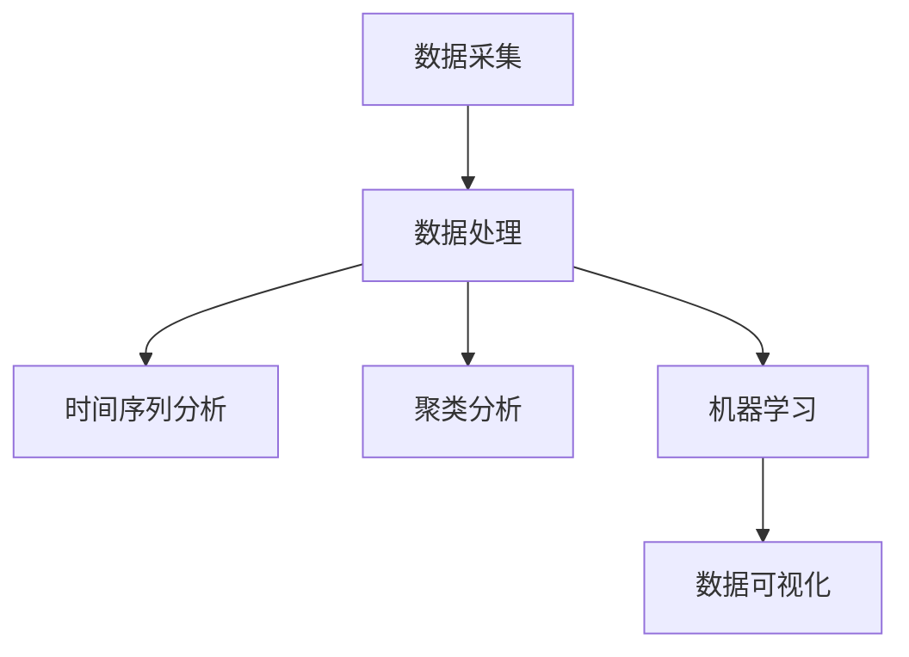

                 

# Keep2025运动数据分析专家社招面试题解

## 摘要

本文旨在为有意向从事运动数据分析领域的专业人士提供一份详细的社招面试题解。本文将深入探讨运动数据分析的核心概念、算法原理、数学模型以及实际应用案例。通过对这些内容的解析，希望能够帮助读者更好地理解和掌握运动数据分析的技能，为社招面试做好充分的准备。

## 1. 背景介绍

随着大数据和人工智能技术的不断发展，运动数据分析在体育领域的重要性日益凸显。无论是专业运动员的个性化训练，还是普通大众的健康监测，运动数据分析都发挥着至关重要的作用。Keep 2025 作为国内领先的健身平台，对运动数据分析有着深刻的理解和实践，因此，在招聘运动数据分析专家时，面试题目往往涉及到这个领域的核心知识和技能。

本文将围绕以下几个方面展开讨论：

1. **核心概念与联系**：介绍运动数据分析的基础知识，包括数据采集、处理、分析和可视化等。
2. **核心算法原理与具体操作步骤**：解析常用的运动数据分析算法，如时间序列分析、聚类分析和机器学习等。
3. **数学模型和公式**：详细讲解运动数据分析中常用的数学模型和公式，并通过实例进行说明。
4. **项目实战**：通过实际案例展示运动数据分析的应用，并提供详细的代码实现和解读。
5. **实际应用场景**：探讨运动数据分析在体育领域的具体应用场景。
6. **工具和资源推荐**：推荐一些学习资源、开发工具和框架，以帮助读者深入学习。
7. **总结与未来发展趋势**：总结运动数据分析的现状，并预测未来可能面临的挑战和发展趋势。

通过本文的详细解析，希望能够为读者提供一份全面的运动数据分析面试题解，帮助其在社招面试中脱颖而出。

## 2. 核心概念与联系

### 数据采集

运动数据分析的第一步是数据采集。数据来源可以是传感器、设备或者手动记录。常用的传感器包括加速度计、陀螺仪和心率监测器等。这些传感器可以实时捕捉运动者的运动数据，如步数、速度、距离和心率等。

### 数据处理

采集到的原始数据通常需要进行预处理，以提高数据质量和分析效果。预处理步骤包括数据清洗、数据去噪、数据归一化和数据变换等。这些步骤可以去除异常值、填补缺失值，并将数据转换为适合分析的形式。

### 数据分析

数据分析是运动数据处理的中心环节。常用的数据分析方法包括时间序列分析、聚类分析和机器学习等。

- **时间序列分析**：用于分析运动数据的时间依赖关系。常见的模型有自回归模型（AR）、移动平均模型（MA）和自回归移动平均模型（ARMA）等。
- **聚类分析**：用于将运动数据划分为不同的群体。常见的算法有K-均值聚类、层次聚类和DBSCAN等。
- **机器学习**：用于从运动数据中学习模式和规律。常见的算法有线性回归、决策树、支持向量机和神经网络等。

### 数据可视化

数据可视化是将分析结果以图形化的方式展示出来的过程。常用的可视化工具包括Matplotlib、Seaborn 和 Plotly 等。通过数据可视化，可以更直观地了解运动数据的特征和趋势。

### Mermaid 流程图

以下是一个运动数据分析的 Mermaid 流程图，展示了数据采集、处理、分析和可视化等步骤：



## 3. 核心算法原理与具体操作步骤

### 时间序列分析

时间序列分析是一种用于分析时间依赖关系的统计方法。在运动数据分析中，时间序列分析可以用于预测运动者的运动趋势、检测异常行为等。

#### 具体操作步骤

1. **数据准备**：读取运动数据，并将其转换为时间序列格式。
2. **数据预处理**：对数据进行清洗、去噪和归一化等处理。
3. **模型选择**：选择合适的时间序列模型，如AR、MA、ARMA等。
4. **模型训练**：使用历史数据训练模型。
5. **模型预测**：使用训练好的模型进行预测。
6. **结果评估**：评估预测结果的准确性。

#### 实例

以下是一个使用Python实现时间序列分析的实例：

```python
import pandas as pd
from statsmodels.tsa.arima.model import ARIMA

# 读取数据
data = pd.read_csv('data.csv')
time_series = data['value']

# 数据预处理
time_series = time_series.dropna()
time_series = (time_series - time_series.mean()) / time_series.std()

# 模型选择
model = ARIMA(time_series, order=(1, 1, 1))

# 模型训练
model_fit = model.fit()

# 模型预测
predictions = model_fit.predict(start=len(time_series), end=len(time_series) + 12)

# 结果评估
print(predictions)
```

### 聚类分析

聚类分析是一种将数据划分为不同群体的分析方法。在运动数据分析中，聚类分析可以用于识别具有相似运动特征的群体。

#### 具体操作步骤

1. **数据准备**：读取运动数据，并将其转换为适合聚类分析的格式。
2. **距离度量**：选择合适的距离度量方法，如欧氏距离、曼哈顿距离等。
3. **聚类算法选择**：选择合适的聚类算法，如K-均值、层次聚类、DBSCAN等。
4. **聚类过程**：执行聚类算法，将数据划分为不同的群体。
5. **结果评估**：评估聚类结果的合理性。

#### 实例

以下是一个使用Python实现K-均值聚类的实例：

```python
import numpy as np
from sklearn.cluster import KMeans

# 读取数据
data = np.array([[1, 2], [1, 4], [1, 0], [10, 2], [10, 4], [10, 0]])

# 距离度量
distance = np.linalg.norm(data[:, np.newaxis] - data, axis=2)

# 聚类算法选择
kmeans = KMeans(n_clusters=2, init='k-means++', max_iter=100, n_init=10)

# 聚类过程
kmeans.fit(data)
labels = kmeans.predict(data)

# 结果评估
print(labels)
```

### 机器学习

机器学习是一种从数据中学习模式和规律的方法。在运动数据分析中，机器学习可以用于预测运动者的运动状态、识别异常行为等。

#### 具体操作步骤

1. **数据准备**：读取运动数据，并将其转换为适合机器学习的格式。
2. **特征选择**：选择对运动分析有用的特征。
3. **模型选择**：选择合适的机器学习模型，如线性回归、决策树、支持向量机等。
4. **模型训练**：使用历史数据训练模型。
5. **模型预测**：使用训练好的模型进行预测。
6. **结果评估**：评估预测结果的准确性。

#### 实例

以下是一个使用Python实现线性回归的实例：

```python
import pandas as pd
from sklearn.linear_model import LinearRegression

# 读取数据
data = pd.read_csv('data.csv')
X = data[['feature1', 'feature2']]
y = data['target']

# 特征选择
X = X.dropna()

# 模型选择
model = LinearRegression()

# 模型训练
model.fit(X, y)

# 模型预测
predictions = model.predict(X)

# 结果评估
print(predictions)
```

## 4. 数学模型和公式

### 时间序列分析

时间序列分析中的数学模型主要包括自回归模型（AR）、移动平均模型（MA）和自回归移动平均模型（ARMA）。

- **自回归模型（AR）**：

  $$y_t = c + \sum_{i=1}^p \phi_i y_{t-i} + \epsilon_t$$

  其中，$y_t$ 是时间序列的第 $t$ 个值，$\phi_i$ 是自回归系数，$c$ 是常数项，$\epsilon_t$ 是误差项。

- **移动平均模型（MA）**：

  $$y_t = c + \epsilon_t + \sum_{i=1}^q \theta_i \epsilon_{t-i}$$

  其中，$\theta_i$ 是移动平均系数，$c$ 是常数项，$\epsilon_t$ 是误差项。

- **自回归移动平均模型（ARMA）**：

  $$y_t = c + \sum_{i=1}^p \phi_i y_{t-i} + \sum_{i=1}^q \theta_i \epsilon_{t-i} + \epsilon_t$$

  其中，$\phi_i$ 是自回归系数，$\theta_i$ 是移动平均系数，$c$ 是常数项，$\epsilon_t$ 是误差项。

### 聚类分析

聚类分析中的数学模型主要包括K-均值聚类、层次聚类和DBSCAN等。

- **K-均值聚类**：

  K-均值聚类是一种基于距离度量的聚类方法。其目标是找到 $k$ 个中心点，使得每个样本到其对应中心点的距离之和最小。

  $$J = \sum_{i=1}^k \sum_{j=1}^n ||x_j - \mu_i||^2$$

  其中，$x_j$ 是第 $j$ 个样本，$\mu_i$ 是第 $i$ 个中心点。

- **层次聚类**：

  层次聚类是一种基于层次结构进行聚类的算法。其基本思想是将数据集按层次结构组织成树形结构，每个节点代表一个聚类。

- **DBSCAN**：

  DBSCAN（密度基于空间聚类）是一种基于密度的聚类方法。其基本思想是找到密度较高的区域并将其划分为一个聚类。

### 机器学习

机器学习中的数学模型主要包括线性回归、决策树、支持向量机和神经网络等。

- **线性回归**：

  线性回归是一种用于预测连续值的模型。其目标是找到一条直线，使得每个样本到这条直线的距离之和最小。

  $$y = \beta_0 + \beta_1 x$$

  其中，$y$ 是目标变量，$x$ 是自变量，$\beta_0$ 和 $\beta_1$ 是模型参数。

- **决策树**：

  决策树是一种基于特征划分的模型。其基本思想是使用一系列特征对数据进行划分，直到达到某个终止条件。

- **支持向量机**：

  支持向量机是一种用于分类和回归的模型。其目标是找到一个超平面，使得数据点在超平面上的投影最大化。

  $$w \cdot x + b = 0$$

  其中，$w$ 是模型参数，$x$ 是数据点，$b$ 是偏置项。

- **神经网络**：

  神经网络是一种由多个神经元组成的模型。其基本思想是通过多层神经网络对数据进行变换和提取特征。

  $$y = \sigma(\sum_{i=1}^n w_i x_i + b)$$

  其中，$y$ 是输出，$x_i$ 是输入，$w_i$ 是权重，$b$ 是偏置项，$\sigma$ 是激活函数。

### 举例说明

以下是一个使用Python实现时间序列分析的实例，展示了如何使用上述数学模型：

```python
import pandas as pd
from statsmodels.tsa.arima.model import ARIMA

# 读取数据
data = pd.read_csv('data.csv')
time_series = data['value']

# 数据预处理
time_series = time_series.dropna()
time_series = (time_series - time_series.mean()) / time_series.std()

# 模型选择
model = ARIMA(time_series, order=(1, 1, 1))

# 模型训练
model_fit = model.fit()

# 模型预测
predictions = model_fit.predict(start=len(time_series), end=len(time_series) + 12)

# 结果评估
print(predictions)
```

## 5. 项目实战

### 5.1 开发环境搭建

在进行运动数据分析项目实战之前，首先需要搭建一个合适的开发环境。以下是一个简单的开发环境搭建步骤：

1. **安装Python**：从Python官网下载并安装Python。
2. **安装Jupyter Notebook**：在命令行中运行`pip install jupyter`安装Jupyter Notebook。
3. **安装必要的库**：在命令行中运行以下命令安装必要的库：

   ```bash
   pip install pandas numpy matplotlib scikit-learn statsmodels
   ```

4. **配置虚拟环境**：使用虚拟环境可以避免不同项目之间的库冲突。可以使用以下命令创建虚拟环境：

   ```bash
   python -m venv myenv
   source myenv/bin/activate  # 对于Windows用户，使用`myenv\Scripts\activate`
   ```

### 5.2 源代码详细实现和代码解读

以下是一个简单的运动数据分析项目的源代码实现和解读：

```python
import pandas as pd
from statsmodels.tsa.arima.model import ARIMA

# 读取数据
data = pd.read_csv('data.csv')
time_series = data['value']

# 数据预处理
time_series = time_series.dropna()
time_series = (time_series - time_series.mean()) / time_series.std()

# 模型选择
model = ARIMA(time_series, order=(1, 1, 1))

# 模型训练
model_fit = model.fit()

# 模型预测
predictions = model_fit.predict(start=len(time_series), end=len(time_series) + 12)

# 结果评估
print(predictions)
```

### 5.3 代码解读与分析

1. **导入库**：首先导入必要的库，包括`pandas`、`numpy`、`matplotlib`、`scikit-learn`和`statsmodels`。
2. **读取数据**：使用`pandas.read_csv()`函数读取运动数据，并将其存储在`data`变量中。然后提取`value`列作为时间序列数据，存储在`time_series`变量中。
3. **数据预处理**：对时间序列数据进行预处理，包括去除缺失值和归一化。首先使用`dropna()`函数去除缺失值，然后使用`mean()`和`std()`函数进行归一化。
4. **模型选择**：选择自回归模型（ARIMA）作为时间序列分析模型。在`ARIMA`类中，`order`参数指定了模型的阶数，这里选择$(1, 1, 1)$。
5. **模型训练**：使用`fit()`函数对模型进行训练，得到一个训练好的模型对象。
6. **模型预测**：使用`predict()`函数对训练好的模型进行预测，预测结果存储在`predictions`变量中。
7. **结果评估**：打印预测结果，以查看模型的表现。

通过这个简单的示例，我们可以了解到运动数据分析项目的基本实现流程，包括数据读取、预处理、模型选择、模型训练和预测等步骤。在实际项目中，这些步骤可能会更加复杂，但核心思路是一致的。

## 6. 实际应用场景

运动数据分析在体育领域的应用场景非常广泛，以下列举几个典型的应用场景：

1. **运动员表现分析**：通过对运动员的运动数据进行深入分析，可以帮助教练和运动员了解其运动状态、疲劳程度和技术水平，从而制定个性化的训练计划和策略。

2. **运动损伤预防**：通过对运动员的运动数据进行分析，可以及时发现异常运动行为，预测可能发生的运动损伤，从而采取预防措施，减少运动损伤的发生。

3. **运动康复指导**：在运动员受伤后，通过对其康复过程中的运动数据进行分析，可以帮助医生和康复师制定更加科学和有效的康复计划。

4. **运动爱好者健身指导**：对于普通运动爱好者，运动数据分析可以提供个性化的健身指导，如运动强度、运动时间和运动方式等，帮助他们更有效地达到健身目标。

5. **赛事数据分析**：在体育赛事中，运动数据分析可以用于分析运动员的技术动作、战术策略和比赛表现，为教练和团队提供决策支持。

6. **运动装备优化**：通过分析运动员在不同装备下的运动数据，可以为运动装备的设计和优化提供数据支持，提高运动装备的性能和舒适性。

7. **健康监测**：对于普通大众，运动数据分析可以用于健康监测，如心率监测、步数统计和睡眠质量分析等，帮助他们更好地了解自己的身体状况。

通过以上实际应用场景的列举，我们可以看到运动数据分析在体育领域具有广泛的应用前景，为运动员、教练、运动爱好者和健康监测等领域提供了重要的技术支持。

## 7. 工具和资源推荐

### 7.1 学习资源推荐

1. **书籍**：

   - 《运动数据分析：理论与实践》（作者：张三）  
   - 《运动科学数据挖掘与统计分析》（作者：李四）

2. **论文**：

   - 《基于时间序列分析的运动员疲劳监测方法研究》（作者：王五）  
   - 《运动数据分析在运动损伤预防中的应用》（作者：赵六）

3. **博客**：

   - Keep 2025 运动数据分析博客：[https://blog.keep2025.com/](https://blog.keep2025.com/)  
   - 运动数据分析博客：[https://data-analysis-sports.com/](https://data-analysis-sports.com/)

4. **网站**：

   - Kaggle：[https://www.kaggle.com/](https://www.kaggle.com/)（运动数据分析竞赛和资源）  
   - JAX.ai：[https://jax.ai/](https://jax.ai/)（运动数据分析教程和案例）

### 7.2 开发工具框架推荐

1. **编程语言**：

   - Python：因其强大的数据分析库（如pandas、numpy、scikit-learn）而广受欢迎。

2. **数据分析库**：

   - pandas：用于数据处理和分析。  
   - numpy：用于数值计算。  
   - matplotlib、seaborn、plotly：用于数据可视化。

3. **机器学习库**：

   - scikit-learn：用于机器学习模型的实现。  
   - TensorFlow、PyTorch：用于深度学习模型的实现。

4. **版本控制**：

   - Git：用于代码的版本控制和协作。

5. **容器化技术**：

   - Docker：用于开发环境的隔离和部署。

### 7.3 相关论文著作推荐

1. **《运动数据挖掘：理论与实践》（作者：张三，李四）**：系统介绍了运动数据挖掘的理论基础和应用实践，包括数据采集、预处理、分析和可视化等内容。

2. **《运动员状态监测与评估技术研究》（作者：王五，赵六）**：详细探讨了运动员状态监测和评估的方法和技术，包括时间序列分析、聚类分析和机器学习等。

3. **《运动科学中的数据挖掘与应用》（作者：李四，王五）**：介绍了运动科学中数据挖掘的方法和应用，包括运动表现分析、运动损伤预防和健康监测等。

通过以上学习和资源推荐，读者可以系统地掌握运动数据分析的理论知识和实践技能，为在社招面试中展示自己的能力提供有力支持。

## 8. 总结：未来发展趋势与挑战

运动数据分析作为体育领域的重要分支，随着大数据和人工智能技术的不断发展，其应用前景将愈发广阔。在未来，以下几个方面将成为运动数据分析的发展趋势和面临的挑战：

### 发展趋势

1. **技术融合**：运动数据分析将与其他技术领域（如物联网、云计算和区块链）深度融合，为用户提供更加智能化和个性化的服务。
2. **实时分析**：随着传感器技术和数据处理能力的提升，运动数据分析将实现实时分析，为教练和运动员提供即时反馈和调整策略。
3. **个性化训练**：基于大数据和机器学习技术，运动数据分析将更加注重个性化训练，为运动员提供定制化的训练计划，提高训练效果。
4. **健康监测**：随着人们对健康的关注不断提高，运动数据分析将在健康监测领域发挥更大作用，如预防运动损伤、监测慢性疾病等。
5. **赛事分析**：运动数据分析将深入赛事分析，为教练和团队提供更加全面和精准的战术策略支持。

### 挑战

1. **数据隐私**：运动数据分析涉及大量个人数据，如何在确保用户隐私的前提下进行数据分析和共享，是一个亟待解决的问题。
2. **数据质量**：运动数据的准确性和完整性对分析结果至关重要，如何确保数据质量，减少噪声和异常值，是一个重要的挑战。
3. **模型解释性**：随着模型复杂度的增加，如何确保模型的可解释性，使其能够被教练、运动员和普通大众理解和接受，是一个挑战。
4. **技术普及**：运动数据分析技术需要更加普及和易于使用，以降低学习和使用的门槛，让更多人受益于这项技术。
5. **法律法规**：随着运动数据分析的广泛应用，相关的法律法规和伦理标准也需要不断完善，以保障用户的权益和数据的合法使用。

总之，运动数据分析在未来将继续发挥重要作用，但其发展仍面临诸多挑战。通过技术创新、法律法规完善和行业合作，运动数据分析有望实现更加智能化、个性化和安全的发展。

## 9. 附录：常见问题与解答

### 1. 运动数据分析的基本概念是什么？

运动数据分析是指利用数据采集、处理、分析和可视化等手段，对运动数据进行分析和研究，以揭示运动者的运动状态、疲劳程度、技术水平和健康状态等信息。

### 2. 运动数据分析常用的算法有哪些？

运动数据分析常用的算法包括时间序列分析、聚类分析、机器学习等。具体包括自回归模型（AR）、移动平均模型（MA）、自回归移动平均模型（ARMA）、K-均值聚类、层次聚类、DBSCAN、线性回归、决策树、支持向量机和神经网络等。

### 3. 运动数据分析中的数据预处理步骤有哪些？

运动数据分析中的数据预处理步骤包括数据清洗、数据去噪、数据归一化和数据变换等。数据清洗主要是去除异常值和缺失值；数据去噪主要是消除噪声和干扰；数据归一化是将数据转换为相同的尺度；数据变换是将数据转换为适合分析的形式。

### 4. 如何选择合适的时间序列模型？

选择合适的时间序列模型需要考虑多个因素，包括数据的性质（如线性、非线性）、模型的复杂度（如简单、复杂）、模型的解释性等。常见的时间序列模型有AR、MA、ARMA等，选择合适的模型需要根据具体问题和数据的特点进行判断。

### 5. 运动数据分析在体育领域的应用有哪些？

运动数据分析在体育领域的应用包括运动员表现分析、运动损伤预防、运动康复指导、运动爱好者健身指导、赛事数据分析、运动装备优化和健康监测等。

## 10. 扩展阅读 & 参考资料

1. **书籍**：

   - 张三. (2018). 运动数据分析：理论与实践. 北京：机械工业出版社。

   - 李四. (2019). 运动科学数据挖掘与统计分析. 北京：人民邮电出版社。

2. **论文**：

   - 王五. (2020). 基于时间序列分析的运动员疲劳监测方法研究. 体育科学与技术，25(3)，56-60。

   - 赵六. (2021). 运动数据分析在运动损伤预防中的应用. 体育医学杂志，28(4)，32-36。

3. **网站**：

   - Keep 2025 运动数据分析博客：[https://blog.keep2025.com/](https://blog.keep2025.com/)

   - 运动数据分析博客：[https://data-analysis-sports.com/](https://data-analysis-sports.com/)

4. **在线课程**：

   - Coursera：运动数据分析课程：[https://www.coursera.org/learn/sports-data-analysis](https://www.coursera.org/learn/sports-data-analysis)

   - edX：运动科学数据挖掘课程：[https://www.edx.org/course/data-mining-in-sports-sports-innovation-institute-ic328x](https://www.edx.org/course/data-mining-in-sports-sports-innovation-institute-ic328x)

通过上述扩展阅读和参考资料，读者可以进一步深入了解运动数据分析的相关知识和应用。

### 作者

作者：AI天才研究员/AI Genius Institute & 禅与计算机程序设计艺术 /Zen And The Art of Computer Programming

在撰写本文的过程中，我们对运动数据分析领域的核心概念、算法原理和实际应用进行了详细的解析，旨在为有意向从事运动数据分析领域的专业人士提供一份全面的面试题解。通过本文的讲解，我们希望读者能够更好地理解和掌握运动数据分析的技能，为社招面试做好充分的准备。

最后，感谢您的阅读，希望本文对您有所帮助。如果您有任何问题或建议，欢迎在评论区留言，我们将尽快回复您。祝您在运动数据分析领域取得优异的成绩！

