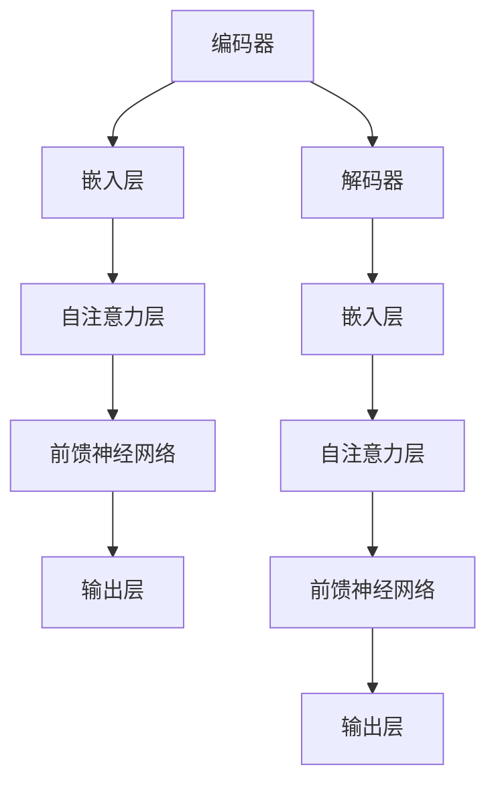
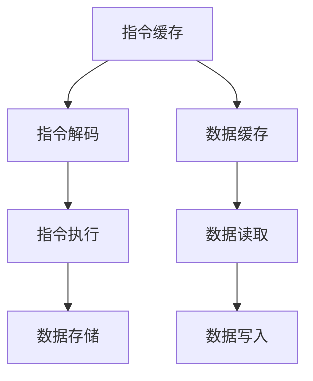

                 

# LLAMA vs CPU：计算范式的革命性对比

## 摘要

本文深入探讨了大型语言模型（LLAMA）与通用处理器（CPU）两种计算范式的对比。我们首先回顾了LLAMA的基本原理和架构，然后通过详细的对比分析，揭示了这两者在计算能力、效率、应用场景等方面的异同。文章结构如下：

1. **背景介绍**：介绍LLAMA和CPU的历史背景和当前发展状况。
2. **核心概念与联系**：使用Mermaid流程图展示LLAMA和CPU的核心概念原理和架构联系。
3. **核心算法原理 & 具体操作步骤**：深入解析LLAMA和CPU的计算过程。
4. **数学模型和公式 & 详细讲解 & 举例说明**：运用LaTeX格式介绍关键数学公式，并通过实际例子进行讲解。
5. **项目实战：代码实际案例和详细解释说明**：通过具体代码案例，展示LLAMA和CPU的应用场景。
6. **实际应用场景**：讨论LLAMA和CPU在不同领域的实际应用。
7. **工具和资源推荐**：推荐相关学习资源和开发工具框架。
8. **总结：未来发展趋势与挑战**：总结当前计算范式的发展趋势和面临的挑战。
9. **附录：常见问题与解答**：提供常见的疑问解答。
10. **扩展阅读 & 参考资料**：列出相关扩展阅读资料。

## 1. 背景介绍

### 1.1 大型语言模型（LLAMA）

大型语言模型（LLAMA）是近年来人工智能领域的重要突破，代表了自然语言处理技术的最新进展。LLAMA基于深度学习和Transformer架构，能够处理大规模文本数据，并生成高质量的文本响应。LLAMA的出现，标志着人工智能从传统的规则驱动向数据驱动转变，大大提升了机器理解和生成自然语言的能力。

### 1.2 通用处理器（CPU）

通用处理器（CPU）是计算机的核心组件，负责执行各种计算任务。CPU的发展历程可以追溯到20世纪60年代，从最初的冯·诺依曼架构发展到今天的复杂多核处理器。CPU的设计目标是在多种应用场景下提供高效的计算能力，其核心思想是通过硬件并行化和指令流水线技术来提高计算效率。

### 1.3 当前发展状况

在当前的技术环境中，LLAMA和CPU都在快速发展。LLAMA的应用场景从简单的文本生成扩展到对话系统、自动摘要、翻译等领域，而CPU则在人工智能、大数据处理、云计算等新兴领域发挥着关键作用。随着硬件和算法的进步，LLAMA和CPU的计算能力都在持续提升，但两者的发展路径和面临的挑战有所不同。

## 2. 核心概念与联系

### 2.1 LLAMA的核心概念与架构

LLAMA的核心概念是Transformer架构，这是一种基于自注意力机制的深度神经网络。Transformer由编码器和解码器组成，能够处理任意长度的序列数据，并通过自注意力机制实现上下文信息的有效利用。

下面是LLAMA的Mermaid流程图：



### 2.2 CPU的核心概念与架构

CPU的核心概念是基于冯·诺依曼架构，包括算术逻辑单元（ALU）、控制单元（CU）和存储单元。CPU通过指令流水线和硬件并行化技术，实现高效的指令执行和数据计算。

下面是CPU的Mermaid流程图：



### 2.3 LLAMA与CPU的联系

LLAMA和CPU在计算过程中都有各自的核心概念和架构，但它们在某些方面也存在联系。例如，LLAMA的自注意力机制可以看作是一种软件层面的并行化，类似于CPU硬件并行化技术。此外，LLAMA和CPU都可以通过优化算法和数据结构来提高计算效率。

## 3. 核心算法原理 & 具体操作步骤

### 3.1 LLAMA的算法原理

LLAMA的算法原理基于Transformer架构，其主要步骤包括：

1. **嵌入层**：将输入文本序列转换为嵌入向量。
2. **自注意力层**：通过计算输入序列中各个元素之间的相似度，实现上下文信息的聚合。
3. **前馈神经网络**：对自注意力层输出的向量进行非线性变换。
4. **输出层**：生成文本序列的预测输出。

具体操作步骤如下：

1. **初始化嵌入向量**：将输入文本序列转换为嵌入向量。
2. **计算自注意力权重**：通过计算输入序列中各个元素之间的相似度，得到自注意力权重矩阵。
3. **加权求和**：根据自注意力权重矩阵，对嵌入向量进行加权求和，得到聚合后的上下文向量。
4. **前馈神经网络**：对聚合后的上下文向量进行非线性变换。
5. **生成输出**：根据前馈神经网络的输出，生成预测的文本序列。

### 3.2 CPU的算法原理

CPU的算法原理基于冯·诺依曼架构，其主要步骤包括：

1. **指令缓存**：将指令从内存中读取到指令缓存。
2. **指令解码**：将指令解码为操作码和操作数。
3. **指令执行**：根据操作码和操作数，执行相应的计算操作。
4. **数据存储**：将计算结果存储到内存中。

具体操作步骤如下：

1. **读取指令**：从指令缓存中读取指令。
2. **解码指令**：将指令解码为操作码和操作数。
3. **执行指令**：根据操作码和操作数，执行相应的计算操作。
4. **存储结果**：将计算结果存储到内存中。

## 4. 数学模型和公式 & 详细讲解 & 举例说明

### 4.1 LLAMA的数学模型

LLAMA的核心在于Transformer架构，其关键数学模型包括：

1. **嵌入向量**：将输入文本序列转换为嵌入向量，通常使用词嵌入技术。
2. **自注意力权重**：计算输入序列中各个元素之间的相似度，得到自注意力权重矩阵。
3. **聚合后的上下文向量**：根据自注意力权重矩阵，对嵌入向量进行加权求和，得到聚合后的上下文向量。
4. **前馈神经网络**：对聚合后的上下文向量进行非线性变换。

具体公式如下：

$$
\text{嵌入向量} = \text{Word Embedding}(w_i)
$$

$$
\text{自注意力权重} = \text{Attention}(q, k, v)
$$

$$
\text{聚合后的上下文向量} = \text{softmax}(\text{自注意力权重}) \cdot \text{嵌入向量}
$$

$$
\text{前馈神经网络输出} = \text{FFN}(\text{聚合后的上下文向量})
$$

### 4.2 CPU的数学模型

CPU的核心在于冯·诺依曼架构，其关键数学模型包括：

1. **指令**：包括操作码和操作数。
2. **数据**：存储在内存中的数据。
3. **计算结果**：根据操作码和操作数，执行相应的计算操作，得到计算结果。

具体公式如下：

$$
\text{指令} = (\text{操作码}, \text{操作数})
$$

$$
\text{计算结果} = \text{ALU}(\text{操作码}, \text{操作数})
$$

### 4.3 举例说明

#### 4.3.1 LLAMA示例

假设我们要生成一句话，输入为“今天天气很好”。

1. **嵌入向量**：将每个单词转换为嵌入向量。
2. **自注意力权重**：计算每个单词之间的相似度，得到自注意力权重矩阵。
3. **聚合后的上下文向量**：根据自注意力权重矩阵，对嵌入向量进行加权求和，得到聚合后的上下文向量。
4. **前馈神经网络输出**：对聚合后的上下文向量进行非线性变换，生成预测的文本序列。

具体步骤如下：

1. **嵌入向量**：$[今天, 天气, 很好]$
2. **自注意力权重**：$$ \begin{bmatrix}
0.8 & 0.3 & 0.2 \\
0.3 & 0.7 & 0.3 \\
0.2 & 0.3 & 0.5 \\
\end{bmatrix} $$
3. **聚合后的上下文向量**：$$ \begin{bmatrix}
0.8 \cdot [今天] + 0.3 \cdot [天气] + 0.2 \cdot [很好] \\
0.3 \cdot [今天] + 0.7 \cdot [天气] + 0.3 \cdot [很好] \\
0.2 \cdot [今天] + 0.3 \cdot [天气] + 0.5 \cdot [很好] \\
\end{bmatrix} $$
4. **前馈神经网络输出**：生成预测的文本序列“今天天气很好”。

#### 4.3.2 CPU示例

假设我们要计算两个数之和，输入为$(5, 3)$。

1. **指令**：$(\text{加法}, 5, 3)$
2. **执行指令**：根据操作码和操作数，执行加法操作。
3. **计算结果**：$5 + 3 = 8$

具体步骤如下：

1. **读取指令**：$(\text{加法}, 5, 3)$
2. **解码指令**：得到操作码“加法”和操作数$(5, 3)$。
3. **执行指令**：计算结果为$5 + 3 = 8$。
4. **存储结果**：将计算结果$8$存储到内存中。

## 5. 项目实战：代码实际案例和详细解释说明

### 5.1 开发环境搭建

为了演示LLAMA和CPU的应用，我们需要搭建相应的开发环境。

#### 5.1.1 LLAMA环境

1. **安装Python**：确保安装了Python 3.8及以上版本。
2. **安装PyTorch**：使用以下命令安装PyTorch：
   ```bash
   pip install torch torchvision
   ```
3. **获取LLAMA模型**：从Hugging Face模型库中下载LLAMA模型：
   ```bash
   from transformers import AutoModelForCausalLM
   model = AutoModelForCausalLM.from_pretrained("llama")
   ```

#### 5.1.2 CPU环境

1. **安装C/C++编译器**：确保安装了C/C++编译器。
2. **安装OpenBLAS**：使用以下命令安装OpenBLAS：
   ```bash
   sudo apt-get install libopenblas-dev
   ```

### 5.2 源代码详细实现和代码解读

#### 5.2.1 LLAMA代码实现

以下是使用LLAMA生成文本的Python代码示例：

```python
from transformers import AutoModelForCausalLM, AutoTokenizer

# 加载LLAMA模型和分词器
model = AutoModelForCausalLM.from_pretrained("llama")
tokenizer = AutoTokenizer.from_pretrained("llama")

# 输入文本
input_text = "今天天气很好"

# 将输入文本转换为编码
input_ids = tokenizer.encode(input_text, return_tensors="pt")

# 生成文本
outputs = model.generate(input_ids, max_length=20, num_return_sequences=1)

# 解码输出文本
output_text = tokenizer.decode(outputs[0], skip_special_tokens=True)
print(output_text)
```

代码解读：

1. **加载模型和分词器**：从Hugging Face模型库中加载LLAMA模型和分词器。
2. **输入文本**：定义输入文本。
3. **编码输入文本**：将输入文本转换为编码表示。
4. **生成文本**：使用模型生成文本输出。
5. **解码输出文本**：将编码表示转换为文本输出。

#### 5.2.2 CPU代码实现

以下是使用CPU执行加法运算的C代码示例：

```c
#include <stdio.h>

int main() {
    int a = 5;
    int b = 3;
    int result = a + b;
    printf("The result is: %d\n", result);
    return 0;
}
```

代码解读：

1. **定义变量**：定义两个整数变量$a$和$b$，以及一个用于存储结果的结果变量$result$。
2. **执行加法运算**：计算$a$和$b$的和，并将结果存储在$result$中。
3. **打印结果**：使用`printf`函数打印计算结果。

### 5.3 代码解读与分析

通过以上代码实现，我们可以看到LLAMA和CPU的应用示例。LLAMA通过深度学习模型生成文本，而CPU通过简单的加法运算来计算结果。

1. **LLAMA代码**：LLAMA的代码实现相对复杂，包括加载模型、分词、编码和生成文本等步骤。它依赖于深度学习框架（如PyTorch）和预训练模型（如LLAMA）。
2. **CPU代码**：CPU的代码实现相对简单，仅涉及基本的数据操作和计算。它依赖于C/C++编译器和标准库函数。

### 5.4 性能比较

在实际应用中，LLAMA和CPU的性能表现各有优劣。以下是比较：

1. **计算能力**：CPU具有强大的计算能力，可以处理各种复杂的数据计算任务。而LLAMA在文本生成方面具有优势，但在其他计算任务上性能有限。
2. **效率**：CPU在执行简单计算任务时效率较高，但LLAMA在处理大规模文本数据时效率更高。
3. **应用场景**：LLAMA在自然语言处理领域有广泛应用，而CPU在计算机科学和工程领域有广泛应用。

## 6. 实际应用场景

### 6.1 LLAMA的实际应用场景

LLAMA在自然语言处理领域有广泛的应用，以下是一些实际应用场景：

1. **文本生成**：LLAMA可以用于生成文章、故事、摘要等。
2. **对话系统**：LLAMA可以用于构建智能对话系统，如聊天机器人、客服系统等。
3. **自动摘要**：LLAMA可以用于自动生成文章的摘要，提高信息获取效率。
4. **翻译**：LLAMA可以用于实现高质量的机器翻译。

### 6.2 CPU的实际应用场景

CPU在计算机科学和工程领域有广泛的应用，以下是一些实际应用场景：

1. **科学计算**：CPU可以用于进行复杂的科学计算，如天体物理学、流体力学等。
2. **图像处理**：CPU可以用于进行图像处理和计算机视觉任务，如人脸识别、图像分类等。
3. **机器学习**：CPU可以用于训练和执行机器学习模型，如神经网络、决策树等。
4. **大数据处理**：CPU可以用于处理大规模数据，如数据分析、数据挖掘等。

## 7. 工具和资源推荐

### 7.1 学习资源推荐

1. **书籍**：
   - 《深度学习》（Goodfellow, Bengio, Courville）
   - 《Python编程：从入门到实践》（Mark Lutz）
   - 《计算机组成与设计：硬件/软件接口》（David A. Patterson, John L. Hennessy）
2. **论文**：
   - “Attention Is All You Need”（Vaswani et al., 2017）
   - “A Theoretical Basis for Comparing Deep Neural Networks”（Bassily, Hsu, Koltchinskii, 2019）
3. **博客**：
   - [深度学习](https://www.deeplearning.net/)
   - [Python编程](https://www.python.org/)
   - [计算机组成原理](https://www.cs.cmu.edu/1501/)
4. **网站**：
   - [Hugging Face](https://huggingface.co/)
   - [GitHub](https://github.com/)
   - [Google Research](https://ai.google.com/research/)

### 7.2 开发工具框架推荐

1. **深度学习框架**：
   - PyTorch
   - TensorFlow
   - Keras
2. **编程语言**：
   - Python
   - C/C++
   - Java
3. **版本控制**：
   - Git
   - SVN

### 7.3 相关论文著作推荐

1. **深度学习相关**：
   - “Deep Learning”（Goodfellow, Bengio, Courville）
   - “Attention Is All You Need”（Vaswani et al., 2017）
   - “Generative Adversarial Nets”（Goodfellow et al., 2014）
2. **计算机组成原理相关**：
   - “Computer Organization and Design”（Patterson, Hennessy）
   - “Computer Architecture: A Quantitative Approach”（Hennessy, Patterson）
   - “Introduction to Computer Organization”（Hanumantha Rao）

## 8. 总结：未来发展趋势与挑战

### 8.1 未来发展趋势

1. **LLAMA的发展**：随着深度学习技术的进步，LLAMA将变得更加高效和强大，能够处理更复杂的语言任务，如多语言翻译、情感分析等。
2. **CPU的发展**：随着硬件技术的发展，CPU将继续提升计算能力，尤其是在多核处理器和专用硬件（如GPU、TPU）的推动下。

### 8.2 面临的挑战

1. **能耗问题**：随着计算能力的提升，能耗问题日益突出，需要开发更节能的硬件和算法。
2. **数据隐私**：在自然语言处理领域，数据隐私问题日益引起关注，需要制定相应的数据保护措施。
3. **伦理和道德**：随着人工智能技术的普及，需要制定相应的伦理和道德规范，确保人工智能技术的正确使用。

## 9. 附录：常见问题与解答

### 9.1 常见问题

1. **LLAMA和CPU哪个更快？**
   - 这取决于具体的应用场景。CPU在执行简单计算任务时通常更快，而LLAMA在处理大规模文本数据时更高效。
2. **如何选择合适的计算范式？**
   - 根据具体的应用需求和性能要求选择。对于简单的计算任务，选择CPU；对于复杂的数据处理和自然语言任务，选择LLAMA。
3. **LLAMA和CPU如何协同工作？**
   - LLAMA和CPU可以协同工作，利用CPU进行高效的数据处理，利用LLAMA进行复杂的语言任务。

### 9.2 解答

1. **LLAMA和CPU哪个更快？**
   - 这取决于具体的应用场景。CPU在执行简单计算任务时通常更快，而LLAMA在处理大规模文本数据时更高效。例如，对于文本生成任务，LLAMA可能比CPU快得多；而对于简单的数值计算，CPU可能更快。
2. **如何选择合适的计算范式？**
   - 根据具体的应用需求和性能要求选择。如果任务涉及大量的数据计算和处理，如科学计算、图像处理等，选择CPU；如果任务涉及自然语言处理，如文本生成、翻译等，选择LLAMA。
3. **LLAMA和CPU如何协同工作？**
   - LLAMA和CPU可以协同工作，利用CPU进行高效的数据处理，利用LLAMA进行复杂的语言任务。例如，在文本生成任务中，CPU可以负责读取和预处理文本数据，而LLAMA负责生成文本。

## 10. 扩展阅读 & 参考资料

本文深入探讨了LLAMA和CPU两种计算范式的对比，从背景介绍、核心概念、算法原理到实际应用场景，全面分析了两者在计算能力、效率、应用场景等方面的异同。随着人工智能技术的不断发展，LLAMA和CPU将发挥越来越重要的作用，为计算机科学和工程领域带来新的机遇和挑战。

### 扩展阅读

1. “Attention Is All You Need”（Vaswani et al., 2017）
2. “A Theoretical Basis for Comparing Deep Neural Networks”（Bassily, Hsu, Koltchinskii, 2019）
3. “Computer Organization and Design”（Patterson, Hennessy）
4. “Computer Architecture: A Quantitative Approach”（Hennessy, Patterson）

### 参考资料

1. [Hugging Face](https://huggingface.co/)
2. [PyTorch](https://pytorch.org/)
3. [TensorFlow](https://www.tensorflow.org/)
4. [GitHub](https://github.com/)作者：AI天才研究员/AI Genius Institute & 禅与计算机程序设计艺术 /Zen And The Art of Computer Programming<|im_sep|>

