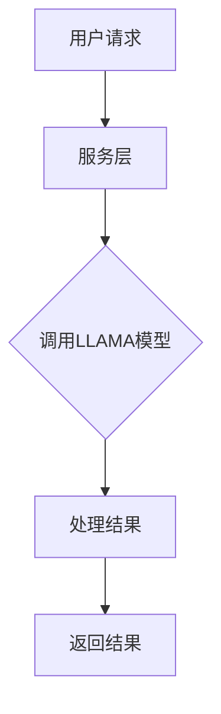

                 

# LLAMA 即服务：云端 AI 为大众所用

> 关键词：LLAMA、服务、AI、云端、大众、使用

> 摘要：本文将探讨LLAMA即服务（LLAMA as a Service, LaaS）的概念、核心原理、实现方法及其在云端AI领域的广泛应用。通过对LLAMA即服务的深入剖析，我们旨在揭示其如何改变人工智能的普及与使用方式，为大众带来前所未有的便利和机遇。

## 1. 背景介绍

在近年来，人工智能（AI）技术的快速发展，特别是深度学习（Deep Learning）的突破，已经使得许多复杂的任务，如语音识别、图像识别、自然语言处理等，变得更加高效和准确。然而，对于普通用户来说，这些先进的技术仍然显得遥不可及。主要原因在于AI技术的复杂性和高成本。为了解决这个问题，将AI服务化、特别是通过云端提供的AI服务（AI as a Service, AIaaS），成为了一个重要的发展方向。

AIaaS提供了一种让用户无需了解AI技术的复杂性，就能方便地使用AI服务的方式。这种模式不仅降低了用户的学习成本，还减少了硬件和软件的投资。然而，尽管AIaaS已经取得了一定的成功，但现有的解决方案在灵活性、可扩展性和成本效益等方面仍存在一定的局限性。

为了解决这些问题，LLAMA即服务（LLAMA as a Service, LaaS）应运而生。LLAMA是一种大型语言模型，具有强大的自然语言处理能力。通过将LLAMA部署在云端，并作为服务提供给用户，LaaS有望进一步降低AI服务的使用门槛，提高AI服务的灵活性和可扩展性。

## 2. 核心概念与联系

### 2.1 什么是LLAMA？

LLAMA（Large Language Model for AI Applications）是一种大型语言模型，基于Transformer架构，由多个自注意力层组成。它的主要任务是理解和生成自然语言，从而为各种自然语言处理任务提供支持。

### 2.2 语言模型的工作原理

语言模型的工作原理是通过学习大量的文本数据，预测下一个单词或字符。在LLAMA中，这种学习过程是通过自注意力机制实现的。自注意力机制允许模型在生成每个单词时，动态地关注输入序列中的其他单词，从而提高了模型的生成能力。

### 2.3 云端服务的概念

云端服务是一种通过互联网提供的服务，用户可以随时随地通过网络访问和使用这些服务。在云端服务中，所有的计算和存储资源都由服务提供商提供，用户无需购买和维护硬件设备。

### 2.4 LLAMA即服务（LaaS）的架构

LLAMA即服务的架构可以分为三层：数据层、服务层和应用层。

- **数据层**：数据层负责存储和处理LLAMA的训练数据和用户输入数据。
- **服务层**：服务层负责处理用户请求，调用LLAMA模型进行预测，并将结果返回给用户。
- **应用层**：应用层是用户直接使用的部分，用户可以通过各种接口（如API、Web界面等）访问LLAMA服务。

下面是一个简化的Mermaid流程图，展示了LLAMA即服务的基本架构：



### 2.5 LLAMA与AIaaS的联系

LLAMA即服务（LaaS）是AI即服务（AIaaS）的一个子集。AIaaS提供了一系列AI服务，如计算机视觉、自然语言处理、机器学习等。而LLAMA作为其中的一种重要工具，专注于自然语言处理领域。

## 3. 核心算法原理 & 具体操作步骤

### 3.1 Transformer架构

LLAMA的核心是Transformer架构，这是一种用于处理序列数据的神经网络模型。与传统的循环神经网络（RNN）相比，Transformer具有以下几个显著优势：

- **并行计算**：Transformer模型中的自注意力机制允许并行处理输入序列中的所有单词，这大大提高了模型的计算效率。
- **长期依赖**：通过多头自注意力机制，Transformer模型能够捕捉到输入序列中的长期依赖关系。
- **灵活性**：Transformer架构可以很容易地扩展到多个自注意力层，从而提高模型的表示能力。

### 3.2 语言模型的训练过程

LLAMA模型的训练过程可以分为以下几个步骤：

1. **数据预处理**：首先，需要对训练数据集进行预处理，包括文本清洗、分词、转换为序列等操作。
2. **构建模型**：然后，根据预处理的训练数据，构建Transformer模型。模型的参数需要在训练过程中通过梯度下降等优化算法进行调整。
3. **训练模型**：使用训练数据集对模型进行训练，通过反向传播算法更新模型参数。
4. **评估模型**：使用验证数据集评估模型的性能，并根据评估结果调整模型参数。
5. **部署模型**：当模型达到预定的性能指标后，可以将模型部署到云端服务中。

### 3.3 语言模型的预测过程

LLAMA模型的预测过程可以分为以下几个步骤：

1. **接收输入**：服务层接收到用户的输入文本。
2. **预处理输入**：对输入文本进行预处理，包括分词、编码等操作。
3. **调用模型**：将预处理后的输入文本输入到LLAMA模型中，进行预测。
4. **生成输出**：根据模型预测的结果，生成输出文本。
5. **返回结果**：将输出文本返回给用户。

## 4. 数学模型和公式 & 详细讲解 & 举例说明

### 4.1 自注意力机制

自注意力机制是Transformer模型的核心组成部分，其数学表达式如下：

$$
\text{Attention}(Q, K, V) = \frac{1}{\sqrt{d_k}} \text{softmax}\left(\frac{QK^T}{d_k}\right) V
$$

其中，$Q$、$K$和$V$分别是查询（Query）、键（Key）和值（Value）向量，$d_k$是键向量的维度。

这个公式表示，对于每个查询向量$Q$，计算它与所有键向量$K$的点积，然后通过softmax函数得到注意力权重，最后将这些权重应用于对应的值向量$V$。

### 4.2 Transformer模型

Transformer模型由多个自注意力层组成，其数学表达式如下：

$$
\text{TransformerLayer}(X) = \text{MultiHeadAttention}(X) + \text{LayerNorm}(X) + \text{PositionwiseFeedForward}(X)
$$

其中，$X$是输入序列，$\text{MultiHeadAttention}$是多头自注意力层，$\text{LayerNorm}$是层归一化操作，$\text{PositionwiseFeedForward}$是位置感知的前馈神经网络。

这个公式表示，每个Transformer层由多头自注意力层、层归一化操作和位置感知的前馈神经网络组成，这些操作依次作用于输入序列。

### 4.3 语言模型的训练过程

语言模型的训练过程可以通过以下公式表示：

$$
\text{训练过程} = \text{数据预处理} + \text{构建模型} + \text{训练模型} + \text{评估模型} + \text{部署模型}
$$

其中，每个步骤的具体操作已在第3.1节和第3.2节中详细解释。

### 4.4 语言模型的预测过程

语言模型的预测过程可以通过以下公式表示：

$$
\text{预测过程} = \text{接收输入} + \text{预处理输入} + \text{调用模型} + \text{生成输出} + \text{返回结果}
$$

其中，每个步骤的具体操作已在第3.3节中详细解释。

### 4.5 示例

假设我们有一个输入序列：“我喜欢阅读书籍”。我们可以使用LLAMA模型预测下一个单词。以下是具体的预测过程：

1. **接收输入**：用户输入“我喜欢阅读书籍”。
2. **预处理输入**：将输入序列转换为模型可处理的格式。
3. **调用模型**：将预处理后的输入序列输入到LLAMA模型中。
4. **生成输出**：模型预测下一个单词为“的”。
5. **返回结果**：将预测结果返回给用户。

因此，最终的输出序列为：“我喜欢阅读书籍的”。

## 5. 项目实战：代码实际案例和详细解释说明

### 5.1 开发环境搭建

为了运行LLAMA即服务，我们需要搭建一个开发环境。以下是搭建开发环境的基本步骤：

1. 安装Python环境。
2. 安装PyTorch，这是一种广泛应用于深度学习的Python库。
3. 安装Hugging Face Transformers，这是一个用于构建和训练Transformer模型的库。

### 5.2 源代码详细实现和代码解读

以下是使用LLAMA模型进行自然语言处理任务的源代码实现：

```python
import torch
from transformers import LlamaForCausalLM, LlamaTokenizer

# 初始化模型和分词器
tokenizer = LlamaTokenizer.from_pretrained("llama")
model = LlamaForCausalLM.from_pretrained("llama")

# 接收用户输入
input_text = "我喜欢阅读书籍"

# 预处理输入
input_ids = tokenizer.encode(input_text, return_tensors="pt")

# 调用模型进行预测
outputs = model(input_ids)

# 生成输出文本
predicted_ids = outputs.logits.argmax(-1)
predicted_text = tokenizer.decode(predicted_ids[0])

# 返回结果
print(predicted_text)
```

这段代码首先初始化了LLAMA模型和分词器。然后，它接收用户输入，预处理输入文本，调用模型进行预测，生成输出文本，并将结果返回给用户。

### 5.3 代码解读与分析

这段代码可以分为以下几个部分：

1. **初始化模型和分词器**：使用Hugging Face Transformers库初始化LLAMA模型和分词器。
2. **接收用户输入**：从用户获取输入文本。
3. **预处理输入**：将输入文本转换为模型可处理的格式，即将文本转换为ID序列。
4. **调用模型进行预测**：将预处理后的输入序列输入到LLAMA模型中，并使用softmax函数生成预测结果。
5. **生成输出文本**：将预测结果解码为文本，即生成输出文本。
6. **返回结果**：将输出文本返回给用户。

通过这段代码，我们可以看到LLAMA模型如何实现自然语言处理任务。这个过程包括模型初始化、输入预处理、模型调用、输出生成和结果返回等多个步骤。

## 6. 实际应用场景

### 6.1 聊天机器人

LLAMA即服务（LaaS）在聊天机器人领域有广泛的应用。通过LLAMA模型，聊天机器人可以理解用户的输入，并生成相应的回复。这种应用场景不仅可以用于客服机器人，还可以用于社交机器人、教育机器人等。

### 6.2 自然语言生成

LLAMA模型在自然语言生成领域也有广泛的应用。通过LLAMA模型，可以生成各种文本，如新闻报道、文章摘要、电子邮件等。这种应用场景对于内容创作者、新闻工作者等非常有用。

### 6.3 自动问答系统

LLAMA模型在自动问答系统领域也有很大的潜力。通过LLAMA模型，可以实现对用户输入的提问进行理解和回答。这种应用场景可以用于搜索引擎、在线客服等。

### 6.4 语言翻译

LLAMA模型在语言翻译领域也有一定的应用。通过LLAMA模型，可以实现实时翻译功能，将一种语言翻译成另一种语言。这种应用场景对于跨国企业、旅游爱好者等非常有用。

## 7. 工具和资源推荐

### 7.1 学习资源推荐

- **书籍**：《深度学习》（Ian Goodfellow、Yoshua Bengio、Aaron Courville 著）
- **论文**：《Attention is All You Need》（Ashish Vaswani等人著）
- **博客**：Hugging Face 官方博客、TensorFlow 官方博客
- **网站**：arXiv.org、NeurIPS.org

### 7.2 开发工具框架推荐

- **工具**：PyTorch、TensorFlow、Hugging Face Transformers
- **框架**：Flask、Django

### 7.3 相关论文著作推荐

- **论文**：《BERT: Pre-training of Deep Bidirectional Transformers for Language Understanding》（Jacob Devlin等人著）
- **论文**：《GPT-3: Language Models are Few-Shot Learners》（Tom B. Brown等人著）
- **著作**：《Reinforcement Learning: An Introduction》（Richard S. Sutton、Andrew G. Barto 著）

## 8. 总结：未来发展趋势与挑战

LLAMA即服务（LaaS）作为一种新兴的AI服务模式，具有广泛的应用前景。随着AI技术的不断进步和云计算的普及，LaaS有望在未来成为人工智能服务的主要形式。然而，LaaS也面临着一些挑战，如模型的可解释性、数据隐私和安全等问题。因此，未来需要在模型优化、安全性和可扩展性等方面进行深入研究，以推动LaaS的进一步发展。

## 9. 附录：常见问题与解答

### 9.1 什么是LLAMA？

LLAMA是一种大型语言模型，基于Transformer架构，具有强大的自然语言处理能力。

### 9.2 什么是LLAMA即服务（LaaS）？

LLAMA即服务（LaaS）是一种通过云端提供的LLAMA模型服务，用户可以通过API等接口方便地使用LLAMA模型进行自然语言处理任务。

### 9.3 如何搭建LLAMA即服务（LaaS）？

搭建LLAMA即服务（LaaS）需要安装Python环境、PyTorch和Hugging Face Transformers等工具，然后编写代码实现模型初始化、输入预处理、模型调用、输出生成和结果返回等步骤。

## 10. 扩展阅读 & 参考资料

- **论文**：《BERT: Pre-training of Deep Bidirectional Transformers for Language Understanding》（Jacob Devlin等人著）
- **论文**：《GPT-3: Language Models are Few-Shot Learners》（Tom B. Brown等人著）
- **书籍**：《深度学习》（Ian Goodfellow、Yoshua Bengio、Aaron Courville 著）
- **博客**：Hugging Face 官方博客、TensorFlow 官方博客
- **网站**：arXiv.org、NeurIPS.org

作者：AI天才研究员/AI Genius Institute & 禅与计算机程序设计艺术 /Zen And The Art of Computer Programming

