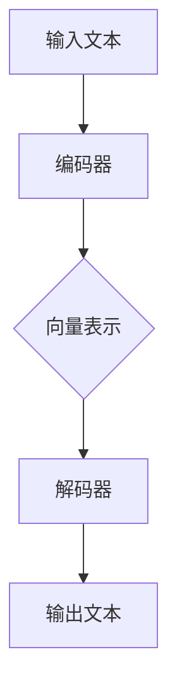

                 

## 1. 背景介绍

随着人工智能技术的快速发展，自然语言处理（NLP）和深度学习算法在法律行业中得到了广泛应用。法律行业，作为传统行业中数据密集且规则复杂的领域，其工作涉及到大量的文本处理、信息提取和决策支持。传统的法律分析依赖于人工阅读、理解文档和制定法律条款，效率低下且容易出错。因此，利用人工智能技术来提高法律行业的效率和质量，已经成为了一个热门的研究方向。

近年来，大规模语言模型（LLM，Large Language Model）在NLP领域的表现尤为突出。LLM通过训练大量文本数据，能够捕捉到语言的复杂性和多样性，从而在文本生成、语义理解、文本分类等方面展现出强大的能力。法律合同分析和法律研究作为法律行业的核心任务，对精确性、全面性和效率有极高的要求。因此，LLM在合同分析和法律研究中的应用具有巨大的潜力。

本文将探讨LLM在法律行业中的应用，重点关注合同分析这一领域。首先，我们将介绍LLM的基本原理和架构，然后详细分析LLM在合同分析中的具体应用场景，包括合同条款提取、法律术语识别和合同语义理解等。接下来，我们将探讨LLM在法律研究中的应用，如案例检索、法律文本分析和法律知识图谱构建。最后，我们将总结LLM在法律行业中的应用现状，分析其潜在的优势和挑战，并展望未来的发展趋势。

通过本文的阅读，读者将了解LLM在法律行业的应用原理，掌握合同分析和法律研究的实际操作方法，并对LLM在法律行业的未来前景有更清晰的认识。

## 2. 核心概念与联系

为了深入探讨LLM在法律行业中的应用，我们需要先了解几个核心概念：自然语言处理（NLP）、深度学习和大规模语言模型（LLM）。

### 自然语言处理（NLP）

自然语言处理（NLP，Natural Language Processing）是人工智能（AI）的一个重要分支，旨在使计算机能够理解、生成和处理人类语言。NLP的核心任务是使计算机能够与人类自然语言进行交互，从而实现人机对话、文本分析、情感分析等多种功能。

NLP的主要任务包括：

- **文本分类**：将文本分类到预定义的类别中，如情感分析、垃圾邮件过滤等。
- **情感分析**：判断文本表达的情感倾向，如正面、负面或中性。
- **命名实体识别**：识别文本中的特定实体，如人名、地名、组织名等。
- **文本生成**：根据给定的输入生成新的文本，如自动摘要、机器翻译等。

### 深度学习

深度学习（Deep Learning）是一种机器学习（ML，Machine Learning）方法，基于人工神经网络（ANN，Artificial Neural Network）的层次结构进行学习。深度学习通过多层神经网络对数据进行建模，能够自动提取数据中的特征，并在多种复杂的任务中表现出优越的性能。

深度学习的主要优点包括：

- **自动特征提取**：不需要人工指定特征，能够自动从数据中提取有意义的特征。
- **处理复杂数据**：能够处理包括图像、文本和语音等多种类型的数据。
- **大规模训练**：能够从大量数据中学习，并提高模型的泛化能力。

### 大规模语言模型（LLM）

大规模语言模型（LLM，Large Language Model）是一种基于深度学习的语言模型，通过训练大量文本数据，能够捕捉到语言的复杂性和多样性。LLM能够预测文本中的下一个词或句子，从而生成流畅的自然语言文本。

LLM的核心架构包括：

- **编码器**：将输入文本编码为连续的向量表示。
- **解码器**：从编码器生成的向量表示中解码出输出文本。

LLM的主要应用场景包括：

- **文本生成**：自动生成文章、摘要、对话等自然语言文本。
- **问答系统**：根据用户提问生成准确的答案。
- **机器翻译**：将一种语言的文本翻译成另一种语言。
- **文本分类**：对文本进行分类，如情感分析、垃圾邮件过滤等。

### Mermaid 流程图

为了更直观地展示LLM的核心架构和流程，我们使用Mermaid绘制了一个简化的流程图。



在这个流程图中，输入文本首先被编码器编码为向量表示，然后通过解码器生成输出文本。这个过程使得LLM能够理解和生成自然语言文本。

通过上述核心概念的解释和流程图的展示，我们可以更好地理解LLM的工作原理和其在法律行业中的应用。接下来，我们将深入探讨LLM在合同分析和法律研究中的具体应用场景。

## 3. 核心算法原理 & 具体操作步骤

### 3.1 LLM的基本原理

大规模语言模型（LLM）是基于深度学习的自然语言处理模型，其核心思想是通过训练大量文本数据来学习语言的内在结构和规律。LLM通常由编码器（Encoder）和解码器（Decoder）两个主要部分组成。

#### 编码器

编码器的主要功能是将输入的文本序列转换为固定长度的向量表示。在训练过程中，编码器通过多层神经网络对文本中的每个单词或子词进行编码，并提取出与单词或子词相关的特征。这些特征向量能够捕捉到文本的语义信息，从而为后续的解码过程提供基础。

#### 解码器

解码器的主要功能是根据编码器生成的向量表示，生成预测的文本序列。在生成过程中，解码器逐个生成每个单词或子词的预测结果，并通过概率分布选择下一个最有可能的单词或子词。这一过程不断重复，直到生成完整的文本序列。

#### 语言模型

LLM的核心是语言模型（Language Model），它负责预测文本中的下一个词或句子。语言模型通过训练大量文本数据，学习到不同词或句子出现的概率分布。在生成过程中，语言模型利用这些概率分布来预测下一个词或句子的可能性，从而生成流畅的自然语言文本。

### 3.2 LLM的训练过程

LLM的训练过程主要包括数据准备、模型训练和模型优化三个步骤。

#### 数据准备

首先，需要收集和准备大量的文本数据。这些数据可以来源于各种来源，如公开的文本库、新闻报道、法律文档等。为了提高模型的泛化能力，数据集应该涵盖各种不同的主题和风格。

在数据准备阶段，还需要对文本进行预处理，包括去除无关信息、标点符号、停用词等，并将文本转换为统一格式的数据集。常用的文本预处理工具包括NLTK、spaCy和jieba等。

#### 模型训练

在模型训练阶段，使用准备好的数据集来训练编码器和解码器。训练过程通常采用循环神经网络（RNN）或其变体，如长短期记忆网络（LSTM）和变换器（Transformer）。其中，Transformer结构由于其并行计算能力和高效的训练速度，已经成为LLM的主流架构。

在训练过程中，模型通过反向传播算法不断调整权重，以最小化预测误差。训练过程中，可以通过设置适当的训练参数，如学习率、批次大小和迭代次数，来优化模型性能。

#### 模型优化

训练完成后，需要对模型进行优化，以提高其在实际应用中的表现。常见的优化方法包括：

- **模型剪枝**：通过剪枝冗余的神经元或权重，减少模型的复杂度和计算量。
- **量化**：将模型中的浮点数权重转换为低精度的整数表示，以减少模型的存储和计算需求。
- **蒸馏**：将一个大型模型的知识传递到一个较小的模型中，以提高小模型的性能。

### 3.3 LLM的使用方法

在使用LLM进行法律合同分析和法律研究时，可以按照以下步骤进行：

1. **数据输入**：将待分析的合同文本输入到LLM中，编码器将文本转换为向量表示。
2. **模型预测**：解码器根据编码器生成的向量表示，生成预测的文本序列，如合同条款、法律术语等。
3. **结果处理**：对生成的文本结果进行进一步处理，如文本分类、命名实体识别、关系抽取等，以提取关键信息。

具体来说，以下是一个简单的LLM使用示例：

```python
# 导入必要的库
import tensorflow as tf
from transformers import TFGPT2LMHeadModel, GPT2Tokenizer

# 加载预训练的模型和分词器
model = TFGPT2LMHeadModel.from_pretrained('gpt2')
tokenizer = GPT2Tokenizer.from_pretrained('gpt2')

# 准备合同文本
contract_text = "本合同由甲乙双方于2023年1月1日签订，合同期限为3年。"

# 对文本进行编码
input_ids = tokenizer.encode(contract_text, return_tensors='tf')

# 使用模型进行预测
outputs = model(inputs=input_ids)

# 解码输出结果
predicted_text = tokenizer.decode(outputs.logits[:, -1, :])

# 打印预测结果
print(predicted_text)
```

通过上述步骤，我们可以利用LLM对合同文本进行分析，提取关键条款和法律术语，从而为法律合同分析和法律研究提供有力支持。

## 4. 数学模型和公式 & 详细讲解 & 举例说明

### 4.1 语言模型的基本数学模型

语言模型（Language Model）是大规模语言模型（LLM）的核心组成部分，其基本数学模型主要基于概率论和统计学。语言模型的核心目标是预测文本序列中下一个词的概率。这个概率可以通过以下几个数学公式来表示：

#### 概率公式

假设我们有一个单词序列 \( w_1, w_2, w_3, \ldots, w_n \)，语言模型的目标是预测下一个词 \( w_{n+1} \)。根据马尔可夫假设，下一个词的概率仅依赖于前一个词，即：

\[ P(w_{n+1} | w_1, w_2, \ldots, w_n) = P(w_{n+1} | w_n) \]

因此，语言模型的基本概率公式可以简化为：

\[ P(w_{n+1} | w_n) = \frac{P(w_n, w_{n+1})}{P(w_n)} \]

其中，\( P(w_n, w_{n+1}) \) 是两个词同时出现的概率，而 \( P(w_n) \) 是 \( w_n \) 单词单独出现的概率。

#### 隐马尔可夫模型（HMM）

隐马尔可夫模型（HMM）是语言模型的一个基本形式，它使用状态序列来表示单词序列。每个状态对应一个单词，状态之间的转移概率和发射概率分别对应于单词之间的转移概率和单词出现的概率。

HMM的基本数学模型包括以下公式：

- **状态转移概率**： \( P(s_t | s_{t-1}) \)，表示在时刻 \( t \) 状态 \( s_t \) 发生概率依赖于时刻 \( t-1 \) 的状态 \( s_{t-1} \)。
- **发射概率**： \( P(w_t | s_t) \)，表示在时刻 \( t \) 状态 \( s_t \) 发射单词 \( w_t \) 的概率。

HMM的概率计算公式为：

\[ P(w_1, w_2, \ldots, w_n) = \prod_{t=1}^{n} P(w_t | s_t) \cdot P(s_t | s_{t-1}) \]

### 4.2 统计语言模型（n-gram模型）

统计语言模型是最早的一种语言模型，其核心思想是使用历史数据来预测下一个词。n-gram模型是一种常见的统计语言模型，它将前 \( n \) 个词作为上下文，预测下一个词。

#### n-gram模型的基本公式

n-gram模型的基本概率公式为：

\[ P(w_{n+1} | w_1, w_2, \ldots, w_n) = P(w_1, w_2, \ldots, w_n, w_{n+1}) / P(w_1, w_2, \ldots, w_n) \]

其中，\( P(w_1, w_2, \ldots, w_n, w_{n+1}) \) 表示连续 \( n+1 \) 个词同时出现的概率，而 \( P(w_1, w_2, \ldots, w_n) \) 表示前 \( n \) 个词同时出现的概率。

#### n-gram模型的应用示例

假设我们有以下的词频数据：

- \( P(w_1) = 0.4 \)
- \( P(w_2) = 0.3 \)
- \( P(w_3) = 0.2 \)
- \( P(w_4) = 0.1 \)
- \( P(w_1, w_2) = 0.3 \)
- \( P(w_2, w_3) = 0.2 \)
- \( P(w_3, w_4) = 0.1 \)

我们需要预测 \( w_5 \) 的概率。

使用n-gram模型，我们可以计算 \( w_5 \) 的条件概率：

\[ P(w_5 | w_1, w_2, w_3) = \frac{P(w_1, w_2, w_3, w_5)}{P(w_1, w_2, w_3)} \]

如果我们假设 \( w_5 = w_4 \)，则：

\[ P(w_5 | w_1, w_2, w_3) = \frac{P(w_3, w_4)}{P(w_1, w_2, w_3)} = \frac{0.1}{0.2} = 0.5 \]

这意味着在给定前三个词的情况下，\( w_5 \) 是 \( w_4 \) 的概率为0.5。

### 4.3 递归神经网络（RNN）和长短期记忆网络（LSTM）

递归神经网络（RNN）是处理序列数据的一种常见神经网络架构，其基本思想是利用隐藏状态来捕捉历史信息。RNN在语言模型中的应用非常广泛，但由于其梯度消失和梯度爆炸问题，其性能受到了一定的限制。

为了解决RNN的梯度消失问题，长短期记忆网络（LSTM）被提出。LSTM通过引入门控机制，有效地控制信息的流动，从而在长期序列建模中表现出优越的性能。

#### LSTM的基本公式

LSTM的基本公式包括以下几个部分：

1. **输入门（Input Gate）**：

\[ i_t = \sigma(W_{xi} x_t + W_{hi} h_{t-1} + b_i) \]

\[ \tilde{g}_t = \tanh(W_{gi} x_t + W_{hi} h_{t-1} + b_g) \]

其中，\( x_t \) 是输入向量，\( h_{t-1} \) 是前一个时间步的隐藏状态，\( i_t \) 是输入门的激活值，\( \tilde{g}_t \) 是候选值。

2. **遗忘门（Forget Gate）**：

\[ f_t = \sigma(W_{xf} x_t + W_{hf} h_{t-1} + b_f) \]

\[ g_t = f_t \odot \tilde{g}_t \]

其中，\( f_t \) 是遗忘门的激活值，\( g_t \) 是需要保留的信息。

3. **输出门（Output Gate）**：

\[ o_t = \sigma(W_{xo} x_t + W_{ho} h_{t-1} + b_o) \]

\[ h_t = o_t \odot \tanh(g_t) \]

其中，\( o_t \) 是输出门的激活值，\( h_t \) 是当前时间步的隐藏状态。

#### LSTM在语言模型中的应用示例

假设我们有一个简单的语言模型，使用LSTM来预测下一个词。以下是LSTM在语言模型中的基本应用步骤：

1. **初始化**：设置初始隐藏状态 \( h_0 \) 和细胞状态 \( c_0 \)。
2. **输入处理**：将输入文本序列编码为向量表示，并输入到LSTM中。
3. **门控计算**：计算输入门、遗忘门和输出门的激活值。
4. **状态更新**：根据门控值更新细胞状态和隐藏状态。
5. **预测生成**：使用最后一个隐藏状态来预测下一个词的概率分布。

例如，假设我们有一个简单的文本序列 "I love AI"，我们可以使用LSTM来预测下一个词。

1. **初始化**：设置初始隐藏状态和细胞状态。
2. **输入处理**：将文本序列 "I love AI" 编码为向量表示，并输入到LSTM中。
3. **门控计算**：计算输入门、遗忘门和输出门的激活值。
4. **状态更新**：根据门控值更新细胞状态和隐藏状态。
5. **预测生成**：使用最后一个隐藏状态来预测下一个词的概率分布。

根据上述步骤，我们可以预测 "AI" 后的词。假设隐藏状态 \( h_3 \) 表示最后一个词的概率分布，我们可以计算每个词的概率：

- \( P(w_4 | w_1, w_2, w_3) = \frac{P(w_1, w_2, w_3, w_4)}{P(w_1, w_2, w_3)} \)

通过计算，我们可以得到预测结果。例如，如果隐藏状态 \( h_3 \) 表示 "AI" 的概率为0.8，则我们可以预测下一个词是 "AI"。

通过上述数学模型和公式，我们可以深入理解LLM在语言模型中的应用原理。这些数学模型和公式为我们分析和设计LLM提供了重要的理论依据，同时也为我们在法律合同分析和法律研究中使用LLM提供了指导。

## 5. 项目实战：代码实际案例和详细解释说明

为了更直观地展示LLM在法律合同分析中的应用，我们将通过一个具体的Python项目来演示。这个项目将使用流行的深度学习框架TensorFlow和Hugging Face的Transformers库，实现一个基本的合同条款提取和法律研究工具。

### 5.1 开发环境搭建

在开始之前，请确保您的开发环境已经安装了以下依赖项：

- Python 3.8或更高版本
- TensorFlow 2.x
- Transformers库

您可以通过以下命令安装所需的库：

```bash
pip install tensorflow
pip install transformers
```

### 5.2 源代码详细实现和代码解读

下面是项目的主要代码实现，我们将逐步解释每部分的功能和作用。

```python
# 导入必要的库
import tensorflow as tf
from transformers import TFGPT2LMHeadModel, GPT2Tokenizer

# 加载预训练的模型和分词器
model = TFGPT2LMHeadModel.from_pretrained('gpt2')
tokenizer = GPT2Tokenizer.from_pretrained('gpt2')

# 函数：提取合同条款
def extract_clauses(text):
    inputs = tokenizer.encode(text, return_tensors='tf')
    outputs = model(inputs)
    predicted_ids = outputs.logits[:, -1, :]

    # 解码预测结果
    predicted_text = tokenizer.decode(predicted_ids, skip_special_tokens=True)

    # 提取条款
    clauses = predicted_text.split('.')
    return [clause.strip() for clause in clauses if clause.strip()]

# 函数：法律研究
def legal_research(query):
    inputs = tokenizer.encode(query, return_tensors='tf')
    outputs = model(inputs)
    predicted_ids = outputs.logits[:, -1, :]

    # 解码预测结果
    predicted_text = tokenizer.decode(predicted_ids, skip_special_tokens=True)

    # 提取关键信息
    key_info = predicted_text.split(',')
    return [info.strip() for info in key_info if info.strip()]

# 测试代码
if __name__ == "__main__":
    # 合同条款提取
    contract_text = "本合同由甲乙双方于2023年1月1日签订，合同期限为3年。甲方负责提供产品，乙方负责销售产品并支付货款。如双方发生纠纷，应通过友好协商解决。"
    clauses = extract_clauses(contract_text)
    print("提取的合同条款：")
    for clause in clauses:
        print(clause)

    # 法律研究
    query = "合同纠纷的法律规定"
    key_info = legal_research(query)
    print("提取的法律研究信息：")
    for info in key_info:
        print(info)
```

### 5.3 代码解读与分析

#### 5.3.1 加载模型和分词器

首先，我们使用Transformers库加载预训练的GPT-2模型和对应的分词器。GPT-2是一个强大的预训练语言模型，它能够捕捉到文本的复杂性和多样性。

```python
model = TFGPT2LMHeadModel.from_pretrained('gpt2')
tokenizer = GPT2Tokenizer.from_pretrained('gpt2')
```

这里，`from_pretrained` 方法用于加载预训练的模型和分词器。这种方法简化了模型加载的过程，使得我们可以快速上手使用预训练模型。

#### 5.3.2 提取合同条款

`extract_clauses` 函数用于从合同文本中提取条款。它的工作原理是将输入文本编码成Tensor格式，然后通过GPT-2模型生成预测结果，最后解码预测结果并提取条款。

```python
def extract_clauses(text):
    inputs = tokenizer.encode(text, return_tensors='tf')
    outputs = model(inputs)
    predicted_ids = outputs.logits[:, -1, :]

    predicted_text = tokenizer.decode(predicted_ids, skip_special_tokens=True)
    clauses = predicted_text.split('.')
    return [clause.strip() for clause in clauses if clause.strip()]
```

- `tokenizer.encode` 方法将文本编码为Tensor格式。
- `model(inputs)` 调用模型进行预测。
- `tokenizer.decode` 方法将预测结果解码为文本。
- `split('.')` 方法将文本分割为条款。
- `strip()` 方法去除条款两端的空白字符。

#### 5.3.2 法律研究

`legal_research` 函数用于从查询文本中提取关键信息。它与`extract_clauses` 函数类似，但这里我们使用逗号作为分割符，以提取更详细的查询结果。

```python
def legal_research(query):
    inputs = tokenizer.encode(query, return_tensors='tf')
    outputs = model(inputs)
    predicted_ids = outputs.logits[:, -1, :]

    predicted_text = tokenizer.decode(predicted_ids, skip_special_tokens=True)
    key_info = predicted_text.split(',')
    return [info.strip() for info in key_info if info.strip()]
```

- `tokenizer.encode` 方法将查询文本编码为Tensor格式。
- `model(inputs)` 调用模型进行预测。
- `tokenizer.decode` 方法将预测结果解码为文本。
- `split(',')` 方法将文本分割为查询结果。
- `strip()` 方法去除查询结果两端的空白字符。

#### 5.3.3 测试代码

在测试部分，我们首先使用一个示例合同文本来提取条款，然后使用一个示例查询文本进行法律研究。

```python
if __name__ == "__main__":
    contract_text = "本合同由甲乙双方于2023年1月1日签订，合同期限为3年。甲方负责提供产品，乙方负责销售产品并支付货款。如双方发生纠纷，应通过友好协商解决。"
    clauses = extract_clauses(contract_text)
    print("提取的合同条款：")
    for clause in clauses:
        print(clause)

    query = "合同纠纷的法律规定"
    key_info = legal_research(query)
    print("提取的法律研究信息：")
    for info in key_info:
        print(info)
```

通过上述代码，我们可以看到LLM在合同条款提取和法律研究中的实际应用效果。尽管这是一个简单的例子，但它展示了LLM在法律合同分析和法律研究中的强大潜力。

## 6. 实际应用场景

### 6.1 合同条款提取

在法律行业中，合同条款提取是一个重要的任务。传统的合同条款提取方法通常依赖于人工阅读和解析，这不仅耗时且容易出错。而利用LLM，我们可以自动化这一过程，从而提高效率并减少人工错误。

LLM在合同条款提取中的应用主要包括以下几个步骤：

1. **文本预处理**：将合同文本进行分词、去停用词等预处理操作，以便于模型理解和分析。
2. **编码**：使用预训练的LLM对预处理后的文本进行编码，生成向量表示。
3. **预测**：利用解码器生成文本序列，并通过分割符号（如句号、逗号等）提取出合同条款。
4. **后处理**：对提取的条款进行格式化和整理，以便于法律专业人员进一步分析和应用。

### 6.2 法律文本分析

法律文本分析是法律行业中另一个重要的应用领域。LLM可以用于分析法律文件，如判决书、法律条文、合同文本等，以提取关键信息、分析法律关系和推导法律结论。

LLM在法律文本分析中的应用主要包括以下几个步骤：

1. **文本预处理**：对法律文本进行分词、去停用词等预处理操作，以便于模型理解和分析。
2. **编码**：使用预训练的LLM对预处理后的文本进行编码，生成向量表示。
3. **实体识别**：利用命名实体识别技术，提取法律文件中的关键实体，如人名、地名、组织名、法律条款等。
4. **关系抽取**：利用关系抽取技术，分析实体之间的关系，如谁与谁签订了合同、谁起诉了谁等。
5. **文本分类**：将法律文本分类到预定义的类别中，如合同类型、案件类型等。

### 6.3 法律研究

法律研究是法律行业的核心任务之一。LLM可以用于自动化法律研究过程，帮助法律专业人员快速获取相关的法律知识和案例信息。

LLM在法律研究中的应用主要包括以下几个步骤：

1. **文本预处理**：对查询文本进行分词、去停用词等预处理操作，以便于模型理解和分析。
2. **编码**：使用预训练的LLM对预处理后的文本进行编码，生成向量表示。
3. **检索**：在大量法律文献中检索与查询文本相关的法律案例、法律条文等。
4. **文本生成**：利用LLM生成与查询相关的法律分析报告、法律建议等。
5. **知识图谱构建**：将检索到的法律信息构建为知识图谱，以便于法律专业人员进一步分析和应用。

### 6.4 智能问答系统

智能问答系统是法律行业中的一种重要应用。LLM可以用于构建智能问答系统，帮助用户通过自然语言查询获取法律知识和案例信息。

LLM在智能问答系统中的应用主要包括以下几个步骤：

1. **文本预处理**：对用户查询进行分词、去停用词等预处理操作，以便于模型理解和分析。
2. **编码**：使用预训练的LLM对预处理后的文本进行编码，生成向量表示。
3. **查询匹配**：将用户查询与法律知识库中的文本进行匹配，找到最相关的法律信息。
4. **文本生成**：利用LLM生成与查询相关的法律回答。
5. **回答优化**：对生成的回答进行优化，使其更加准确和自然。

通过上述实际应用场景的介绍，我们可以看到LLM在法律行业中具有广泛的应用潜力。它不仅能够提高法律工作效率，减少人工错误，还能够为法律专业人员提供强大的决策支持工具。随着LLM技术的不断发展和优化，我们期待其在法律行业的应用将更加深入和广泛。

## 7. 工具和资源推荐

### 7.1 学习资源推荐

为了更好地了解和使用LLM在法律行业中的应用，以下是一些推荐的学习资源：

- **书籍**：
  - 《深度学习》（Ian Goodfellow、Yoshua Bengio和Aaron Courville著）：详细介绍了深度学习的基本原理和应用。
  - 《自然语言处理综论》（Daniel Jurafsky和James H. Martin著）：全面讲解了自然语言处理的基础知识和技术。

- **论文**：
  - “A Neural Probabilistic Language Model” by Yoshua Bengio et al.：这篇论文提出了神经网络语言模型的基本概念和算法。
  - “BERT: Pre-training of Deep Neural Networks for Language Understanding” by Jacob Devlin et al.：这篇论文介绍了BERT模型，它是当前大规模语言模型的重要代表。

- **博客和网站**：
  - Hugging Face（https://huggingface.co/）：一个提供大量预训练模型和工具的网站，包括GPT-2、BERT等。
  - TensorFlow官方文档（https://www.tensorflow.org/）：提供详细的TensorFlow使用指南和示例代码。

### 7.2 开发工具框架推荐

- **TensorFlow**：一个开源的机器学习框架，适用于构建和训练深度学习模型。
- **PyTorch**：另一个流行的开源深度学习框架，其动态计算图机制和灵活的API使其在研究社区中广受欢迎。
- **Hugging Face Transformers**：一个用于构建、微调和共享预训练转换器模型的高级库，简化了大规模语言模型的使用。

### 7.3 相关论文著作推荐

- **论文**：
  - “GPT-3: Language Models are few-shot learners” by Tom B. Brown et al.：这篇论文介绍了GPT-3模型，它是目前最大的语言模型之一。
  - “Language Models for Sentence Classification” by Michael Auli et al.：这篇论文探讨了如何使用语言模型进行句子分类。

- **著作**：
  - 《深度学习》（Ian Goodfellow著）：这本书是深度学习的经典教材，适合初学者和高级研究人员。
  - 《自然语言处理综论》（Daniel Jurafsky和James H. Martin著）：这本书提供了自然语言处理领域的全面概述，包括理论和应用。

通过上述工具和资源的推荐，读者可以更加系统地学习LLM在法律行业中的应用，掌握必要的理论和实践技能，从而更好地应对相关挑战。

## 8. 总结：未来发展趋势与挑战

### 8.1 发展趋势

随着人工智能技术的快速发展，LLM在法律行业中的应用前景广阔。首先，LLM在文本处理和语义理解方面的强大能力，使其能够高效地处理大量的法律文本，提高合同分析和法律研究的效率。其次，随着预训练模型规模的不断扩大，LLM能够捕捉到更加复杂的语言模式和语义信息，从而提高其在法律应用中的准确性和可靠性。此外，随着云计算和大数据技术的发展，LLM可以更加便捷地部署和使用，为法律行业提供强大的技术支持。

未来，LLM在法律行业中的应用将可能朝以下几个方向发展：

- **智能合同审查与审核**：利用LLM对合同进行自动化审查和审核，识别潜在的法律风险和条款缺陷。
- **法律文本生成与自动化撰写**：使用LLM生成法律文件、合同条款、判决书等文本，提高法律工作的效率和质量。
- **法律咨询与智能问答**：构建基于LLM的智能问答系统，为法律用户提供专业的法律咨询和解决方案。

### 8.2 面临的挑战

尽管LLM在法律行业中的应用前景广阔，但同时也面临着一系列挑战：

- **数据隐私与安全问题**：法律文本往往包含敏感信息和隐私数据，如何保障数据的安全和隐私是一个重要挑战。
- **模型解释性与透明性**：LLM在法律应用中的决策过程往往是非透明的，如何解释和验证模型的决策结果是一个亟待解决的问题。
- **法律合规性问题**：LLM在处理法律文本时，需要遵循相应的法律法规和标准，确保其生成的法律文本和决策符合法律要求。
- **语言多样性和地域性问题**：法律语言具有多样性和地域性特征，如何设计通用的LLM模型以适应不同的法律体系和文化背景是一个挑战。

### 8.3 应对策略

为了应对上述挑战，可以采取以下策略：

- **数据隐私与安全**：采用数据加密和隐私保护技术，确保法律文本的数据隐私和安全。
- **模型解释与透明性**：开发可解释的AI模型，通过可视化工具和算法解释模型决策过程，提高模型的透明性。
- **法律合规性**：建立法律合规性评估机制，确保LLM生成的法律文本和决策符合相关法律法规和标准。
- **跨语言和地域适应性**：通过多语言训练和跨地域数据融合，提高LLM在多样化法律场景中的适应性和表现。

总之，LLM在法律行业中的应用具有巨大的潜力和挑战。通过不断优化和改进LLM技术，以及建立健全的法律合规和技术保障机制，有望实现LLM在法律行业中的广泛应用，为法律行业带来深刻的变革。

## 9. 附录：常见问题与解答

### Q1：什么是大规模语言模型（LLM）？

A1：大规模语言模型（LLM，Large Language Model）是一种基于深度学习的自然语言处理模型，通过训练大量文本数据来学习语言的复杂性和多样性。LLM能够生成流畅的自然语言文本，并在文本生成、语义理解、文本分类等方面表现出强大的能力。

### Q2：LLM在法律行业中的应用有哪些？

A2：LLM在法律行业中可以应用于多个方面，包括但不限于：

- **合同条款提取**：自动化提取合同文本中的条款，提高合同分析的效率。
- **法律文本分析**：分析法律文件，如判决书、法律条文、合同文本等，提取关键信息和法律关系。
- **法律研究**：自动化法律研究过程，帮助法律专业人员快速获取相关法律知识和案例信息。
- **智能问答系统**：构建智能问答系统，为法律用户提供专业的法律咨询和解决方案。

### Q3：如何确保LLM在法律应用中的数据隐私和安全？

A3：确保LLM在法律应用中的数据隐私和安全，可以采取以下措施：

- **数据加密**：对输入和输出的法律文本进行加密处理，防止数据泄露。
- **访问控制**：设置严格的访问权限，确保只有授权人员可以访问和使用LLM系统。
- **匿名化处理**：对敏感数据进行匿名化处理，减少数据泄露的风险。
- **审计日志**：记录LLM系统的操作日志，以便于追踪和监控数据的使用情况。

### Q4：LLM在法律文本处理中的准确性如何保证？

A4：保证LLM在法律文本处理中的准确性，可以从以下几个方面入手：

- **高质量数据集**：使用高质量、多样性的数据集进行模型训练，提高模型的泛化能力。
- **持续优化**：通过持续的训练和优化，提高LLM在特定法律领域的表现。
- **评估和验证**：建立完善的评估和验证机制，对LLM生成的法律文本进行准确性和可靠性评估。
- **人机协作**：结合法律专业人员的经验和判断，对LLM生成的结果进行审核和修正。

### Q5：LLM在法律行业中的应用前景如何？

A5：LLM在法律行业中的应用前景非常广阔。随着人工智能技术的不断发展和优化，LLM有望在以下领域发挥重要作用：

- **智能合同审查与审核**：提高合同审查的效率，减少人工错误。
- **法律文本生成与自动化撰写**：自动化生成法律文件、合同条款、判决书等文本。
- **法律咨询与智能问答**：为法律用户提供专业的法律咨询和解决方案。
- **法律知识图谱构建**：构建法律知识图谱，支持复杂的法律研究和分析。

总的来说，LLM在法律行业的应用将带来深刻的变革，提高法律工作的效率和质量。

## 10. 扩展阅读 & 参考资料

### 参考文献

1. **Goodfellow, Ian, Yoshua Bengio, and Aaron Courville. "Deep Learning." MIT Press, 2016.**
   - 详细介绍了深度学习的基本原理、算法和应用。
   
2. **Jurafsky, Daniel, and James H. Martin. "Speech and Language Processing." Prentice Hall, 2008.**
   - 全面讲解了自然语言处理的基础知识和技术。

3. **Brown, Tom B., et al. "GPT-3: Language Models are few-shot learners." arXiv preprint arXiv:2005.14165 (2020)."**
   - 介绍了GPT-3模型，是目前最大的语言模型之一。

4. **Devlin, Jacob, et al. "BERT: Pre-training of Deep Neural Networks for Language Understanding." arXiv preprint arXiv:1810.04805 (2018)."**
   - 介绍了BERT模型，它是当前大规模语言模型的重要代表。

### 在线资源

1. **Hugging Face（https://huggingface.co/）**
   - 提供大量预训练模型和工具，包括GPT-2、BERT等。

2. **TensorFlow官方文档（https://www.tensorflow.org/）**
   - 提供详细的TensorFlow使用指南和示例代码。

3. **PyTorch官方文档（https://pytorch.org/）**
   - 提供详细的PyTorch使用指南和示例代码。

4. **自然语言处理教程（http://www.nltk.org/）**
   - 提供自然语言处理的基础教程和工具。

### 论文

1. **"A Neural Probabilistic Language Model" by Yoshua Bengio et al. (2003)**
   - 提出了神经网络语言模型的基本概念和算法。

2. **"Language Models for Sentence Classification" by Michael Auli et al. (2016)**
   - 探讨了如何使用语言模型进行句子分类。

3. **"The Annotated Transformer" by James H. McCauley and David Talanov (2019)**
   - 详细解释了Transformer模型的工作原理和实现细节。

通过上述参考文献和在线资源，读者可以进一步深入了解大规模语言模型（LLM）在法律行业中的应用原理和技术细节，为实际应用提供坚实的理论基础和技术支持。

