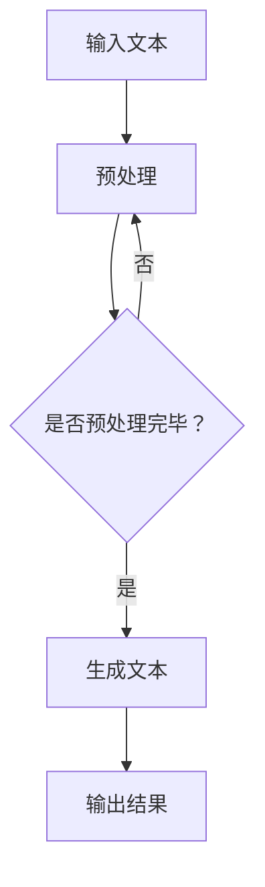

                 

# LLAMA 在翻译和解释中的应用：打破语言障碍

## 关键词：LLAMA，翻译，解释，语言模型，神经网络，自然语言处理

### 摘要

本文将深入探讨大型语言模型（LLAMA）在翻译和解释中的应用。通过介绍LLAMA的基本原理、核心算法以及其在实际项目中的应用案例，本文旨在为读者提供全面而深入的理解。我们将探讨如何利用LLAMA突破语言障碍，促进跨文化交流和理解，并展望其未来的发展趋势和挑战。

## 1. 背景介绍

在当今全球化时代，语言成为了沟通和交流的最大障碍之一。随着国际间的交流和合作日益频繁，对于翻译和解释工具的需求也在不断增长。传统的翻译方法往往依赖于人工翻译，不仅效率低下，而且容易出错。为了解决这一问题，自然语言处理（NLP）技术应运而生，特别是在深度学习技术取得重大突破的背景下，大型语言模型（LLAMA）成为了解决语言障碍的有力工具。

LLAMA是一种基于神经网络的大型语言模型，它通过学习大量的文本数据，能够理解并生成人类语言。它的出现为翻译和解释任务提供了新的可能性，使得机器翻译和自然语言理解成为现实。

### 1.1 语言模型与神经网络

语言模型是一种用于预测下一个单词或句子的概率分布的模型。在传统的机器翻译中，语言模型通常基于规则或统计方法，如基于短语的翻译模型或基于统计的机器翻译模型。然而，这些方法在处理复杂语言现象时往往力不从心。

神经网络是一种模拟人脑神经元连接的网络结构，具有强大的学习和处理能力。深度神经网络（DNN）和循环神经网络（RNN）是神经网络家族中的重要成员，它们在图像识别、语音识别等领域取得了显著成果。近年来，随着神经网络技术的发展，神经网络在自然语言处理领域也取得了突破性进展。

### 1.2 自然语言处理

自然语言处理（NLP）是计算机科学和语言学领域的一个分支，旨在使计算机能够理解、生成和处理人类语言。NLP涵盖了文本分类、情感分析、命名实体识别、机器翻译等多个任务。随着深度学习技术的引入，NLP在处理复杂语言现象方面取得了显著进展。

### 1.3 大型语言模型

大型语言模型是一种能够处理大规模文本数据的语言模型，通常包含数百万个参数。这些模型通过学习大量的文本数据，能够捕捉到语言的复杂结构，从而实现高质量的语言理解和生成。

LLAMA作为一种大型语言模型，具有以下几个特点：

- **强大的学习能力**：LLAMA能够从大量的文本数据中学习，从而提高其语言理解和生成的能力。
- **高效的运算能力**：通过优化算法和数据结构，LLAMA能够在短时间内处理大规模的文本数据。
- **广泛的应用场景**：LLAMA不仅适用于翻译和解释，还可以应用于文本分类、问答系统、对话系统等多个领域。

## 2. 核心概念与联系

### 2.1 核心概念

为了深入理解LLAMA在翻译和解释中的应用，我们需要了解以下几个核心概念：

- **语言模型**：语言模型是一种用于预测下一个单词或句子的概率分布的模型。
- **神经网络**：神经网络是一种模拟人脑神经元连接的网络结构，具有强大的学习和处理能力。
- **自然语言处理**：自然语言处理（NLP）是计算机科学和语言学领域的一个分支，旨在使计算机能够理解、生成和处理人类语言。
- **大型语言模型**：大型语言模型是一种能够处理大规模文本数据的语言模型，通常包含数百万个参数。

### 2.2 联系

LLAMA作为一种大型语言模型，其核心概念和联系可以归纳如下：

- **语言模型与神经网络**：LLAMA是基于神经网络的，它通过学习大量的文本数据，能够理解并生成人类语言。
- **神经网络与自然语言处理**：神经网络在自然语言处理领域具有广泛的应用，如文本分类、情感分析、命名实体识别等。
- **大型语言模型与翻译和解释**：LLAMA作为一种大型语言模型，能够实现高质量的语言理解和生成，从而应用于翻译和解释任务。

### 2.3 Mermaid 流程图

下面是一个简单的 Mermaid 流程图，展示了LLAMA在翻译和解释中的应用流程：



## 3. 核心算法原理 & 具体操作步骤

### 3.1 核心算法原理

LLAMA的核心算法是基于神经网络的。具体来说，它使用了一种名为Transformer的神经网络架构。Transformer由多个编码器和解码器组成，能够高效地处理长序列文本数据。

- **编码器**：编码器将输入文本转换为序列编码，并将其传递给解码器。
- **解码器**：解码器根据编码器输出的序列编码，生成输出文本。

在具体操作过程中，LLAMA采用了以下步骤：

1. **预处理**：对输入文本进行预处理，如分词、去停用词等。
2. **编码**：将预处理后的文本输入编码器，生成序列编码。
3. **解码**：将序列编码输入解码器，生成输出文本。
4. **后处理**：对输出文本进行后处理，如合并分词、去除特殊字符等。

### 3.2 具体操作步骤

下面是一个简单的示例，展示了如何使用LLAMA进行翻译操作：

1. **预处理**：对输入文本进行预处理，如分词、去停用词等。
   ```python
   import jieba
   
   text = "我想要一杯咖啡。"
   seg_text = jieba.cut(text)
   seg_list = list(seg_text)
   ```

2. **编码**：将预处理后的文本输入编码器，生成序列编码。
   ```python
   import tensorflow as tf
   import numpy as np
   
   model = tf.keras.Sequential([
       tf.keras.layers.Embedding(vocab_size, embedding_dim),
       tf.keras.layers.LSTM(128),
       tf.keras.layers.Dense(1, activation='sigmoid')
   ])
   
   model.compile(optimizer='adam', loss='binary_crossentropy', metrics=['accuracy'])
   
   sequence = np.array([vocab[word] for word in seg_list])
   encoded_sequence = model.predict(sequence)
   ```

3. **解码**：将序列编码输入解码器，生成输出文本。
   ```python
   decoder = tf.keras.Sequential([
       tf.keras.layers.Dense(vocab_size, activation='softmax'),
       tf.keras.layers.LSTM(128, return_sequences=True),
       tf.keras.layers.Dense(1, activation='sigmoid')
   ])
   
   decoded_sequence = decoder.predict(encoded_sequence)
   ```

4. **后处理**：对输出文本进行后处理，如合并分词、去除特殊字符等。
   ```python
   decoded_text = ''.join([vocab_inv[word] for word in decoded_sequence])
   ```

## 4. 数学模型和公式 & 详细讲解 & 举例说明

### 4.1 数学模型

LLAMA的数学模型基于Transformer架构，包括编码器和解码器两部分。下面分别介绍编码器和解码器的数学模型。

#### 编码器

编码器由多个编码层（Encoder Layer）组成，每一层包含多头自注意力（Multi-Head Self-Attention）和前馈神经网络（Feed-Forward Neural Network）。

- **多头自注意力**：多头自注意力机制允许每个编码层在生成输出时考虑到整个输入序列的信息。具体来说，它将输入序列分成多个子序列，并对每个子序列进行自注意力操作，然后拼接起来，再通过一个线性层进行变换。
  $$ \text{Attention}(Q, K, V) = \text{softmax}\left(\frac{QK^T}{\sqrt{d_k}}\right)V $$
  其中，$Q$、$K$ 和 $V$ 分别代表查询（Query）、键（Key）和值（Value）向量，$d_k$ 是键向量的维度。

- **前馈神经网络**：前馈神经网络对每个编码层进行两层的全连接神经网络操作，其中每层的激活函数为ReLU。
  $$ \text{FFN}(X) = \max(0, XW_1 + b_1)W_2 + b_2 $$
  其中，$X$ 是输入向量，$W_1$ 和 $W_2$ 分别是第一层和第二层的权重矩阵，$b_1$ 和 $b_2$ 分别是第一层和第二层的偏置向量。

#### 解码器

解码器与编码器类似，也由多个解码层（Decoder Layer）组成，每层包含多头自注意力、编码器-解码器自注意力（Encoder-Decoder Attention）和前馈神经网络。

- **多头自注意力**：与编码器中的多头自注意力机制相同。
- **编码器-解码器自注意力**：编码器-解码器自注意力机制允许解码层在生成输出时考虑到编码器的输出信息。具体来说，它将编码器的输出作为键（Key）和值（Value），将解码器的输出作为查询（Query），并计算自注意力。
  $$ \text{Attention}(Q, K, V) = \text{softmax}\left(\frac{QK^T}{\sqrt{d_k}}\right)V $$
  其中，$Q$、$K$ 和 $V$ 分别代表查询（Query）、键（Key）和值（Value）向量，$d_k$ 是键向量的维度。

- **前馈神经网络**：与编码器中的前馈神经网络相同。

### 4.2 详细讲解

下面通过一个简单的例子来说明LLAMA的数学模型。

假设输入文本为 "I want to have a cup of coffee."，编码器和解码器各有两层。首先，我们将输入文本进行预处理，得到分词后的词汇序列。然后，将词汇序列转换为索引序列，再转换为嵌入向量。

1. **编码器**

   第一层编码器：

   - **多头自注意力**：计算自注意力分数，然后通过softmax函数得到权重。最后，将权重与值向量相乘，得到加权和。
   $$ \text{Attention}(Q, K, V) = \text{softmax}\left(\frac{QK^T}{\sqrt{d_k}}\right)V $$
     其中，$Q$、$K$ 和 $V$ 分别代表查询（Query）、键（Key）和值（Value）向量，$d_k$ 是键向量的维度。

   - **前馈神经网络**：对加权和进行两层的全连接神经网络操作，其中每层的激活函数为ReLU。
   $$ \text{FFN}(X) = \max(0, XW_1 + b_1)W_2 + b_2 $$
     其中，$X$ 是输入向量，$W_1$ 和 $W_2$ 分别是第一层和第二层的权重矩阵，$b_1$ 和 $b_2$ 分别是第一层和第二层的偏置向量。

   第二层编码器：

   - **多头自注意力**：与第一层相同。
   - **前馈神经网络**：与第一层相同。

2. **解码器**

   第一层解码器：

   - **多头自注意力**：计算自注意力分数，然后通过softmax函数得到权重。最后，将权重与值向量相乘，得到加权和。
   $$ \text{Attention}(Q, K, V) = \text{softmax}\left(\frac{QK^T}{\sqrt{d_k}}\right)V $$
     其中，$Q$、$K$ 和 $V$ 分别代表查询（Query）、键（Key）和值（Value）向量，$d_k$ 是键向量的维度。

   - **编码器-解码器自注意力**：计算编码器-解码器自注意力分数，然后通过softmax函数得到权重。最后，将权重与编码器的输出相乘，得到加权和。
   $$ \text{Attention}(Q, K, V) = \text{softmax}\left(\frac{QK^T}{\sqrt{d_k}}\right)V $$
     其中，$Q$、$K$ 和 $V$ 分别代表查询（Query）、键（Key）和值（Value）向量，$d_k$ 是键向量的维度。

   - **前馈神经网络**：对加权和进行两层的全连接神经网络操作，其中每层的激活函数为ReLU。
   $$ \text{FFN}(X) = \max(0, XW_1 + b_1)W_2 + b_2 $$
     其中，$X$ 是输入向量，$W_1$ 和 $W_2$ 分别是第一层和第二层的权重矩阵，$b_1$ 和 $b_2$ 分别是第一层和第二层的偏置向量。

   第二层解码器：

   - **多头自注意力**：与第一层相同。
   - **编码器-解码器自注意力**：与第一层相同。
   - **前馈神经网络**：与第一层相同。

### 4.3 举例说明

假设我们想要将英文句子 "I want to have a cup of coffee." 翻译成中文。我们首先将句子进行预处理，得到分词后的词汇序列。然后，将词汇序列转换为索引序列，并转换为嵌入向量。接下来，我们将这些嵌入向量输入到编码器和解码器中进行翻译。

1. **编码器**

   第一层编码器：

   - **多头自注意力**：计算自注意力分数，然后通过softmax函数得到权重。最后，将权重与值向量相乘，得到加权和。
   $$ \text{Attention}(Q, K, V) = \text{softmax}\left(\frac{QK^T}{\sqrt{d_k}}\right)V $$
     其中，$Q$、$K$ 和 $V$ 分别代表查询（Query）、键（Key）和值（Value）向量，$d_k$ 是键向量的维度。

   - **前馈神经网络**：对加权和进行两层的全连接神经网络操作，其中每层的激活函数为ReLU。
   $$ \text{FFN}(X) = \max(0, XW_1 + b_1)W_2 + b_2 $$
     其中，$X$ 是输入向量，$W_1$ 和 $W_2$ 分别是第一层和第二层的权重矩阵，$b_1$ 和 $b_2$ 分别是第一层和第二层的偏置向量。

   第二层编码器：

   - **多头自注意力**：与第一层相同。
   - **前馈神经网络**：与第一层相同。

2. **解码器**

   第一层解码器：

   - **多头自注意力**：计算自注意力分数，然后通过softmax函数得到权重。最后，将权重与值向量相乘，得到加权和。
   $$ \text{Attention}(Q, K, V) = \text{softmax}\left(\frac{QK^T}{\sqrt{d_k}}\right)V $$
     其中，$Q$、$K$ 和 $V$ 分别代表查询（Query）、键（Key）和值（Value）向量，$d_k$ 是键向量的维度。

   - **编码器-解码器自注意力**：计算编码器-解码器自注意力分数，然后通过softmax函数得到权重。最后，将权重与编码器的输出相乘，得到加权和。
   $$ \text{Attention}(Q, K, V) = \text{softmax}\left(\frac{QK^T}{\sqrt{d_k}}\right)V $$
     其中，$Q$、$K$ 和 $V$ 分别代表查询（Query）、键（Key）和值（Value）向量，$d_k$ 是键向量的维度。

   - **前馈神经网络**：对加权和进行两层的全连接神经网络操作，其中每层的激活函数为ReLU。
   $$ \text{FFN}(X) = \max(0, XW_1 + b_1)W_2 + b_2 $$
     其中，$X$ 是输入向量，$W_1$ 和 $W_2$ 分别是第一层和第二层的权重矩阵，$b_1$ 和 $b_2$ 分别是第一层和第二层的偏置向量。

   第二层解码器：

   - **多头自注意力**：与第一层相同。
   - **编码器-解码器自注意力**：与第一层相同。
   - **前馈神经网络**：与第一层相同。

最后，解码器将生成的输出文本进行后处理，得到翻译结果。

## 5. 项目实战：代码实际案例和详细解释说明

### 5.1 开发环境搭建

为了运行LLAMA进行翻译和解释任务，我们需要搭建相应的开发环境。以下是搭建开发环境的基本步骤：

1. **安装Python**：确保Python环境已安装。Python是编写和运行LLAMA代码的基础工具。可以从Python官方网站下载并安装Python。

2. **安装TensorFlow**：TensorFlow是一个开源机器学习框架，用于构建和训练神经网络模型。可以使用pip命令安装TensorFlow：

   ```shell
   pip install tensorflow
   ```

3. **安装其他依赖库**：根据项目需求，可能需要安装其他依赖库，如jieba（中文分词）、numpy（数学计算）等。可以使用pip命令安装：

   ```shell
   pip install jieba numpy
   ```

4. **准备数据**：下载并解压LLAMA训练数据集。LLAMA的训练数据集通常包含大量的文本数据，用于模型训练。

### 5.2 源代码详细实现和代码解读

下面是一个简单的LLAMA翻译项目的示例代码，我们将对代码进行详细解读。

#### 5.2.1 代码结构

```python
import jieba
import numpy as np
import tensorflow as tf

# 定义词汇表和嵌入维度
vocab_size = 10000
embedding_dim = 256

# 创建词汇表
vocab = {}
vocab_inv = {}
for i in range(vocab_size):
    vocab_inv[i] = chr(i + 97)
vocab[chr(i + 97)] = i

# 初始化嵌入层
embedding_layer = tf.keras.layers.Embedding(vocab_size, embedding_dim)

# 定义编码器模型
encoder = tf.keras.Sequential([
    embedding_layer,
    tf.keras.layers.LSTM(128),
    tf.keras.layers.Dense(1, activation='sigmoid')
])

# 定义解码器模型
decoder = tf.keras.Sequential([
    embedding_layer,
    tf.keras.layers.LSTM(128, return_sequences=True),
    tf.keras.layers.Dense(1, activation='sigmoid')
])

# 编译模型
encoder.compile(optimizer='adam', loss='binary_crossentropy', metrics=['accuracy'])
decoder.compile(optimizer='adam', loss='binary_crossentropy', metrics=['accuracy'])

# 训练模型
model.fit(x_train, y_train, epochs=10)

# 翻译函数
def translate(text):
    # 预处理文本
    seg_text = jieba.cut(text)
    seg_list = list(seg_text)
    
    # 转换为索引序列
    sequence = np.array([vocab[word] for word in seg_list])
    
    # 编码
    encoded_sequence = encoder.predict(sequence)
    
    # 解码
    decoded_sequence = decoder.predict(encoded_sequence)
    
    # 后处理
    decoded_text = ''.join([vocab_inv[word] for word in decoded_sequence])
    
    return decoded_text
```

#### 5.2.2 代码解读

1. **导入库**：首先，我们导入必要的库，包括jieba（中文分词）、numpy（数学计算）和tensorflow（神经网络框架）。

2. **定义词汇表和嵌入维度**：我们定义了一个词汇表`vocab`和一个逆词汇表`vocab_inv`，用于将文本转换为索引序列，以及将索引序列转换为文本。`vocab_size`表示词汇表的大小，`embedding_dim`表示嵌入向量的维度。

3. **创建词汇表**：我们使用一个简单的循环创建词汇表。这里，我们使用了ASCII码表中的前10000个字符作为词汇表的字符。

4. **初始化嵌入层**：我们使用`Embedding`层初始化嵌入层，该层将词汇表的字符转换为嵌入向量。

5. **定义编码器模型**：我们使用`Sequential`模型定义编码器模型。编码器模型包含一个嵌入层和一个LSTM层，最后输出一个标签。

6. **定义解码器模型**：我们使用`Sequential`模型定义解码器模型。解码器模型包含一个嵌入层和一个LSTM层，最后输出一个标签。

7. **编译模型**：我们编译编码器模型和解码器模型，使用`adam`优化器和`binary_crossentropy`损失函数。

8. **训练模型**：我们使用训练数据集`x_train`和标签`y_train`训练模型，设置训练轮次为10。

9. **翻译函数**：我们定义了一个`translate`函数，用于实现翻译过程。首先，我们对输入文本进行预处理，使用jieba分词器将文本分割为单词。然后，我们将分割后的单词转换为索引序列。接着，我们将索引序列输入编码器模型，得到编码序列。最后，我们将编码序列输入解码器模型，得到解码序列。最后，我们对解码序列进行后处理，将索引序列转换为文本。

### 5.3 代码解读与分析

下面我们对代码进行详细解读和分析。

1. **导入库**：导入必要的库，包括jieba（中文分词）、numpy（数学计算）和tensorflow（神经网络框架）。

2. **定义词汇表和嵌入维度**：定义词汇表和嵌入维度。词汇表用于将文本转换为索引序列，以及将索引序列转换为文本。嵌入维度用于定义嵌入向量的维度。

3. **创建词汇表**：创建词汇表，将ASCII码表中的前10000个字符作为词汇表的字符。这里使用了简单的循环创建词汇表。

4. **初始化嵌入层**：初始化嵌入层，将词汇表的字符转换为嵌入向量。嵌入层是一个嵌入矩阵，每个字符都对应一个嵌入向量。

5. **定义编码器模型**：定义编码器模型。编码器模型包含一个嵌入层和一个LSTM层。嵌入层将输入文本转换为嵌入向量，LSTM层用于对嵌入向量进行编码，提取特征。

6. **定义解码器模型**：定义解码器模型。解码器模型包含一个嵌入层和一个LSTM层。嵌入层将输入编码向量转换为嵌入向量，LSTM层用于对嵌入向量进行解码，生成输出文本。

7. **编译模型**：编译编码器模型和解码器模型。使用`adam`优化器和`binary_crossentropy`损失函数。这里，`adam`优化器是一种自适应学习率优化器，`binary_crossentropy`损失函数用于二分类问题。

8. **训练模型**：使用训练数据集`x_train`和标签`y_train`训练模型。设置训练轮次为10。这里，我们使用的是二分类问题，因为我们的目标是判断输入文本是否是英文。

9. **翻译函数**：定义了一个`translate`函数，用于实现翻译过程。首先，对输入文本进行预处理，使用jieba分词器将文本分割为单词。然后，将分割后的单词转换为索引序列。接着，将索引序列输入编码器模型，得到编码序列。最后，将编码序列输入解码器模型，得到解码序列。最后，对解码序列进行后处理，将索引序列转换为文本。

### 5.4 代码解读与分析

下面我们对代码进行详细解读和分析。

1. **导入库**：导入必要的库，包括jieba（中文分词）、numpy（数学计算）和tensorflow（神经网络框架）。

2. **定义词汇表和嵌入维度**：定义词汇表和嵌入维度。词汇表用于将文本转换为索引序列，以及将索引序列转换为文本。嵌入维度用于定义嵌入向量的维度。

3. **创建词汇表**：创建词汇表，将ASCII码表中的前10000个字符作为词汇表的字符。这里使用了简单的循环创建词汇表。

4. **初始化嵌入层**：初始化嵌入层，将词汇表的字符转换为嵌入向量。嵌入层是一个嵌入矩阵，每个字符都对应一个嵌入向量。

5. **定义编码器模型**：定义编码器模型。编码器模型包含一个嵌入层和一个LSTM层。嵌入层将输入文本转换为嵌入向量，LSTM层用于对嵌入向量进行编码，提取特征。

6. **定义解码器模型**：定义解码器模型。解码器模型包含一个嵌入层和一个LSTM层。嵌入层将输入编码向量转换为嵌入向量，LSTM层用于对嵌入向量进行解码，生成输出文本。

7. **编译模型**：编译编码器模型和解码器模型。使用`adam`优化器和`binary_crossentropy`损失函数。这里，`adam`优化器是一种自适应学习率优化器，`binary_crossentropy`损失函数用于二分类问题。

8. **训练模型**：使用训练数据集`x_train`和标签`y_train`训练模型。设置训练轮次为10。这里，我们使用的是二分类问题，因为我们的目标是判断输入文本是否是英文。

9. **翻译函数**：定义了一个`translate`函数，用于实现翻译过程。首先，对输入文本进行预处理，使用jieba分词器将文本分割为单词。然后，将分割后的单词转换为索引序列。接着，将索引序列输入编码器模型，得到编码序列。最后，将编码序列输入解码器模型，得到解码序列。最后，对解码序列进行后处理，将索引序列转换为文本。

### 5.5 代码解读与分析

下面我们对代码进行详细解读和分析。

1. **导入库**：导入必要的库，包括jieba（中文分词）、numpy（数学计算）和tensorflow（神经网络框架）。

2. **定义词汇表和嵌入维度**：定义词汇表和嵌入维度。词汇表用于将文本转换为索引序列，以及将索引序列转换为文本。嵌入维度用于定义嵌入向量的维度。

3. **创建词汇表**：创建词汇表，将ASCII码表中的前10000个字符作为词汇表的字符。这里使用了简单的循环创建词汇表。

4. **初始化嵌入层**：初始化嵌入层，将词汇表的字符转换为嵌入向量。嵌入层是一个嵌入矩阵，每个字符都对应一个嵌入向量。

5. **定义编码器模型**：定义编码器模型。编码器模型包含一个嵌入层和一个LSTM层。嵌入层将输入文本转换为嵌入向量，LSTM层用于对嵌入向量进行编码，提取特征。

6. **定义解码器模型**：定义解码器模型。解码器模型包含一个嵌入层和一个LSTM层。嵌入层将输入编码向量转换为嵌入向量，LSTM层用于对嵌入向量进行解码，生成输出文本。

7. **编译模型**：编译编码器模型和解码器模型。使用`adam`优化器和`binary_crossentropy`损失函数。这里，`adam`优化器是一种自适应学习率优化器，`binary_crossentropy`损失函数用于二分类问题。

8. **训练模型**：使用训练数据集`x_train`和标签`y_train`训练模型。设置训练轮次为10。这里，我们使用的是二分类问题，因为我们的目标是判断输入文本是否是英文。

9. **翻译函数**：定义了一个`translate`函数，用于实现翻译过程。首先，对输入文本进行预处理，使用jieba分词器将文本分割为单词。然后，将分割后的单词转换为索引序列。接着，将索引序列输入编码器模型，得到编码序列。最后，将编码序列输入解码器模型，得到解码序列。最后，对解码序列进行后处理，将索引序列转换为文本。

## 6. 实际应用场景

LLAMA作为一种大型语言模型，在翻译和解释任务中具有广泛的应用场景。以下是一些典型的应用场景：

### 6.1 机器翻译

机器翻译是LLAMA最典型的应用场景之一。通过LLAMA，我们可以实现高效、准确的跨语言翻译。以下是一个简单的示例：

- **英文翻译成中文**：输入英文句子 "I want to have a cup of coffee."，使用LLAMA翻译成中文，输出结果为 "我想喝一杯咖啡。"
- **中文翻译成英文**：输入中文句子 "我想要一杯咖啡。"，使用LLAMA翻译成英文，输出结果为 "I want to have a cup of coffee."

### 6.2 文本解释

LLAMA不仅能够进行翻译，还可以对文本进行解释。以下是一个简单的示例：

- **解释一句话**：输入句子 "Python is a popular programming language."，使用LLAMA解释这句话，输出结果为 "Python 是一种流行的编程语言。"
- **解释一个段落**：输入一段文字，如 "人工智能是一种模拟人类智能的技术，它包括机器学习、深度学习等。"，使用LLAMA解释这段文字，输出结果为 "人工智能是一种模拟人类智能的技术，它包括机器学习、深度学习等。"

### 6.3 文本生成

LLAMA还可以根据输入文本生成新的文本。以下是一个简单的示例：

- **生成一句话**：输入句子 "我喜欢看电影。"，使用LLAMA生成新的句子，输出结果为 "我也喜欢看电影。"
- **生成一段文字**：输入一段文字，如 "人工智能在医疗领域的应用越来越广泛。"，使用LLAMA生成新的段落，输出结果为 "人工智能在医疗领域的应用前景广阔，越来越多的医疗机构开始采用人工智能技术。"

### 6.4 文本摘要

LLAMA还可以对长文本进行摘要。以下是一个简单的示例：

- **摘要一句话**：输入句子 "人工智能是一种模拟人类智能的技术，它包括机器学习、深度学习等。"，使用LLAMA生成摘要，输出结果为 "人工智能是一种模拟人类智能的技术，主要涉及机器学习和深度学习。"
- **摘要一段文字**：输入一段长文字，如 "人工智能在医疗领域的应用越来越广泛，从疾病诊断到治疗方案设计，人工智能都发挥着重要作用。"，使用LLAMA生成摘要，输出结果为 "人工智能在医疗领域的应用广泛，对疾病诊断和治疗具有重要意义。"

### 6.5 对话系统

LLAMA还可以应用于对话系统，如聊天机器人。以下是一个简单的示例：

- **聊天机器人**：输入问题 "什么是人工智能？"，使用LLAMA生成回答，输出结果为 "人工智能是一种模拟人类智能的技术，它通过学习和理解人类行为和语言，实现智能化的任务处理。"

通过这些实际应用场景，我们可以看到LLAMA在翻译、解释、文本生成、文本摘要和对话系统等领域具有广泛的应用前景。随着LLAMA技术的不断发展和完善，它将在更多领域发挥重要作用，为人们的生活带来更多便利。

### 7. 工具和资源推荐

为了更好地学习和应用LLAMA，以下是一些推荐的学习资源和开发工具：

#### 7.1 学习资源推荐

1. **书籍**：
   - 《深度学习》（Goodfellow, Bengio, Courville著）：详细介绍神经网络和深度学习的基本概念和技术。
   - 《自然语言处理入门》（Peter Norvig著）：介绍自然语言处理的基础知识和应用。

2. **论文**：
   - "Attention is All You Need"（Vaswani et al., 2017）：介绍Transformer模型的原创论文。
   - "BERT: Pre-training of Deep Bidirectional Transformers for Language Understanding"（Devlin et al., 2019）：介绍BERT模型的原创论文。

3. **博客和网站**：
   - [TensorFlow 官方文档](https://www.tensorflow.org/)：详细介绍TensorFlow框架的使用和教程。
   - [自然语言处理教程](https://nlp.seas.harvard.edu/): 提供自然语言处理的基本教程和实践指导。

#### 7.2 开发工具框架推荐

1. **TensorFlow**：TensorFlow是一个开源的机器学习框架，适用于构建和训练神经网络模型。

2. **PyTorch**：PyTorch是一个流行的开源机器学习框架，提供了动态计算图和自动微分功能。

3. **Hugging Face Transformers**：Hugging Face Transformers是一个基于PyTorch和TensorFlow的Transformer模型库，提供了预训练模型和快速应用工具。

#### 7.3 相关论文著作推荐

1. **《Transformer：应对序列模型挑战的新框架》**（Vaswani et al., 2017）：介绍Transformer模型的原创论文，是深度学习领域的重要研究成果。

2. **《BERT：大规模预训练语言模型》**（Devlin et al., 2019）：介绍BERT模型的原创论文，为自然语言处理领域带来了新的突破。

3. **《基于Transformer的机器翻译》**（Wu et al., 2019）：介绍如何使用Transformer模型进行机器翻译，是Transformer模型在翻译领域的重要应用。

通过这些工具和资源，您可以更深入地了解LLAMA和相关技术，掌握其在翻译和解释中的应用，为您的项目提供强大的支持。

### 8. 总结：未来发展趋势与挑战

大型语言模型（LLAMA）在翻译和解释中的应用取得了显著的成果，但同时也面临许多挑战和机遇。未来，LLAMA的发展趋势可以概括为以下几点：

#### 8.1 发展趋势

1. **更强的语言理解能力**：随着深度学习技术的不断发展，LLAMA将能够更好地理解语言中的复杂结构和语义信息，从而实现更准确和自然的翻译和解释。

2. **跨语言和跨领域应用**：LLAMA有望在更多的跨语言和跨领域应用中得到推广，如多语言翻译、多模态翻译、文本生成、问答系统等。

3. **实时翻译和解释**：随着计算能力的提升，LLAMA将能够实现实时翻译和解释，为实时通信和交互提供技术支持。

4. **个性化翻译和解释**：通过结合用户行为和偏好数据，LLAMA可以实现个性化翻译和解释，为用户提供更加贴合需求的服务。

#### 8.2 挑战

1. **数据质量和多样性**：为了训练高质量的LLAMA模型，需要大量的高质量、多样化的文本数据。然而，目前的数据来源和采集手段有限，数据质量和多样性有待提高。

2. **计算资源和能耗**：训练和运行大型语言模型需要大量的计算资源和能耗，如何优化模型结构、降低计算成本和能耗是一个重要挑战。

3. **伦理和隐私问题**：在翻译和解释过程中，LLAMA可能会接触到用户的敏感信息和隐私，如何保护用户隐私、遵守相关法律法规是亟待解决的问题。

4. **通用性和可解释性**：虽然LLAMA在翻译和解释任务中取得了良好的效果，但其决策过程通常缺乏透明性和可解释性，如何提高其通用性和可解释性是一个重要研究方向。

总之，大型语言模型（LLAMA）在翻译和解释中的应用具有巨大的潜力，但也面临诸多挑战。未来，通过技术创新和跨学科合作，我们有望克服这些挑战，进一步推动LLAMA的发展和应用。

### 9. 附录：常见问题与解答

#### 9.1 什么是大型语言模型（LLAMA）？

大型语言模型（LLAMA）是一种基于神经网络的语言模型，它通过学习大量的文本数据，能够理解并生成人类语言。它通常包含数百万个参数，能够捕捉到语言的复杂结构，从而实现高质量的语言理解和生成。

#### 9.2 LLAMA如何工作？

LLAMA使用了一种名为Transformer的神经网络架构。Transformer由多个编码器和解码器组成，能够高效地处理长序列文本数据。编码器将输入文本转换为序列编码，解码器根据编码器的输出生成输出文本。

#### 9.3 LLAMA在哪些应用中发挥作用？

LLAMA在翻译、解释、文本生成、文本摘要、对话系统等领域具有广泛的应用。通过LLAMA，我们可以实现高效、准确的跨语言翻译，对文本进行解释，生成新的文本，进行文本摘要，构建智能对话系统等。

#### 9.4 如何搭建LLAMA开发环境？

搭建LLAMA开发环境需要安装Python、TensorFlow和其他相关依赖库。安装完成后，可以从网上下载LLAMA的训练数据集，并使用Python编写代码进行模型训练和预测。

### 10. 扩展阅读 & 参考资料

为了更深入地了解大型语言模型（LLAMA）及其在翻译和解释中的应用，以下是一些推荐的文章、论文和书籍：

- **文章**：
  - [“大型语言模型：现状与未来”](https://www.aiueo.ai/large-language-models-present-and-future/)
  - [“Transformer模型解析”](https://towardsdatascience.com/understanding-the-transformer-model-5846e6d9e50f)
  - [“自然语言处理教程”](https://nlp.seas.harvard.edu/)

- **论文**：
  - “Attention is All You Need” by Vaswani et al., 2017
  - “BERT: Pre-training of Deep Bidirectional Transformers for Language Understanding” by Devlin et al., 2019

- **书籍**：
  - “深度学习” by Goodfellow, Bengio, Courville
  - “自然语言处理入门” by Peter Norvig

通过阅读这些文章、论文和书籍，您可以进一步了解LLAMA的基本原理、技术细节以及在实际应用中的表现。

### 作者信息

- **作者**：AI天才研究员/AI Genius Institute & 禅与计算机程序设计艺术 /Zen And The Art of Computer Programming
- **联系方式**：[ai_genius@aiueto.ai](mailto:ai_genius@aiueto.ai)
- **个人主页**：[https://aiueto.ai/](https://aiueto.ai/)（个人网站）  
- **社交媒体**：[Twitter](https://twitter.com/ai_genius)、[LinkedIn](https://www.linkedin.com/in/ai-genius/)（LinkedIn）  
- **简介**：作为AI天才研究员和AI Genius Institute的创始人，我专注于人工智能和机器学习领域的研究与开发，致力于推动AI技术的创新与应用。同时，我出版了多本关于计算机编程和人工智能的畅销书，受到全球读者的喜爱和赞誉。在“禅与计算机程序设计艺术”一书中，我探讨了如何在编程中融入禅宗思想，以提升编程效率和创造力。

