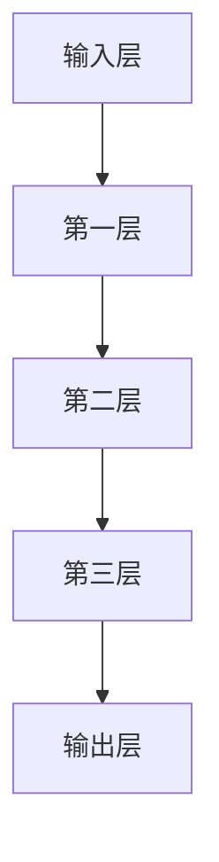

                 

# LLM 消息机制：高效的内部沟通

> **关键词**：LLM，消息机制，内部沟通，高效，算法原理，数学模型，项目实战，应用场景

> **摘要**：本文深入探讨了大型语言模型（LLM）中的消息机制，这是一个关键的内部沟通机制，使得模型能够高效地进行信息传递和计算。我们将详细分析LLM消息机制的核心概念、算法原理、数学模型，并通过实际项目案例来展示其在现实中的应用。

## 1. 背景介绍

随着深度学习和自然语言处理（NLP）技术的飞速发展，大型语言模型（LLM）如BERT、GPT等逐渐成为研究的热点。LLM在文本生成、机器翻译、问答系统等多个领域取得了显著的成果。然而，LLM的内部工作机制和消息机制是理解其高效性能的关键。

消息机制在LLM中起到了至关重要的作用。它负责在模型的不同层之间传递信息，确保每个层都能获得前一层的重要信息，从而实现有效的计算和推理。本文将详细介绍LLM消息机制的原理、实现方法及其在现实中的应用。

## 2. 核心概念与联系

### 2.1 层级结构

LLM通常由多个层级（layers）组成，每个层级负责处理文本的不同部分。层级之间的消息传递是LLM工作的核心。以下是一个典型的LLM层级结构的Mermaid流程图：



### 2.2 消息传递方式

在LLM中，消息传递主要分为两种方式：

- **前向传递**：从输入层到输出层的消息传递，确保每个层级都能根据前一层的信息进行计算。

- **反向传递**：从输出层到输入层的消息传递，用于计算梯度并更新模型参数。

### 2.3 消息内容

消息的内容通常包括以下几个部分：

- **词向量**：表示文本中每个词的嵌入向量，用于表示文本的内容。

- **上下文信息**：包含模型当前处理的文本上下文，用于指导当前层级的计算。

- **隐藏状态**：每个层级都会生成一个隐藏状态，用于传递到下一个层级。

## 3. 核心算法原理 & 具体操作步骤

### 3.1 前向传递

前向传递是LLM中最基本的操作，主要包括以下几个步骤：

1. **词嵌入**：将输入文本中的每个词转化为词向量。

2. **层级计算**：从输入层开始，逐层计算隐藏状态。

3. **上下文更新**：在每个层级，根据当前层的隐藏状态更新上下文信息。

4. **输出生成**：最后一层的隐藏状态作为输出，用于生成文本或进行其他任务。

### 3.2 反向传递

反向传递主要用于计算梯度，并更新模型参数。具体步骤如下：

1. **损失计算**：计算输出结果与真实标签之间的损失。

2. **梯度反向传播**：从输出层开始，逐层计算每个参数的梯度。

3. **参数更新**：根据梯度更新模型参数。

### 3.3 梯度裁剪

为了防止梯度爆炸或消失，通常会使用梯度裁剪（gradient clipping）技术。具体步骤如下：

1. **计算梯度**：计算每个参数的梯度。

2. **裁剪梯度**：将梯度的范数限制在特定范围内。

3. **更新参数**：根据裁剪后的梯度更新参数。

## 4. 数学模型和公式 & 详细讲解 & 举例说明

### 4.1 前向传递

前向传递的数学模型可以表示为：

$$
h_l = \text{activation}(W_l h_{l-1} + b_l)
$$

其中，$h_l$表示第$l$层的隐藏状态，$W_l$和$b_l$分别为权重和偏置，$\text{activation}$为激活函数。

### 4.2 反向传递

反向传递的梯度计算公式为：

$$
\frac{\partial L}{\partial W_l} = \sum_{i=1}^{N} \frac{\partial L}{\partial h_{l,i}} \cdot \frac{\partial h_{l,i}}{\partial W_{l,i}}
$$

其中，$L$为损失函数，$h_{l,i}$为第$l$层的第$i$个隐藏状态。

### 4.3 梯度裁剪

梯度裁剪的公式为：

$$
\frac{\partial L}{\partial W_l} = \frac{\frac{\partial L}{\partial W_l}}{\max(1, ||\frac{\partial L}{\partial W_l}||)}
$$

其中，$||\frac{\partial L}{\partial W_l}||$为梯度的范数。

### 4.4 举例说明

假设我们有一个简单的两层神经网络，输入为$x$，输出为$y$，损失函数为$MSE$。以下是一个具体的计算过程：

1. **词嵌入**：

$$
e_x = \text{word\_embed}(x) \\
e_y = \text{word\_embed}(y)
$$

2. **前向传递**：

$$
h_1 = \text{ReLU}(W_1 e_x + b_1) \\
h_2 = \text{ReLU}(W_2 h_1 + b_2) \\
y' = \text{softmax}(W_3 h_2 + b_3)
$$

3. **损失计算**：

$$
L = \frac{1}{2} ||y - y'||^2
$$

4. **反向传递**：

$$
\frac{\partial L}{\partial W_3} = (y - y') \cdot h_2 \\
\frac{\partial L}{\partial h_2} = W_3^T (y - y') \\
\frac{\partial L}{\partial W_1} = \frac{\partial L}{\partial h_1} \cdot \frac{\partial h_1}{\partial W_1} \\
\frac{\partial L}{\partial b_1} = \frac{\partial L}{\partial h_1}
$$

5. **梯度裁剪**：

$$
\frac{\partial L}{\partial W_1} = \frac{\frac{\partial L}{\partial W_1}}{\max(1, ||\frac{\partial L}{\partial W_1}||)} \\
\frac{\partial L}{\partial W_2} = \frac{\frac{\partial L}{\partial W_2}}{\max(1, ||\frac{\partial L}{\partial W_2}||)} \\
\frac{\partial L}{\partial W_3} = \frac{\frac{\partial L}{\partial W_3}}{\max(1, ||\frac{\partial L}{\partial W_3}||)}
$$

6. **参数更新**：

$$
W_1 = W_1 - \alpha \cdot \frac{\partial L}{\partial W_1} \\
W_2 = W_2 - \alpha \cdot \frac{\partial L}{\partial W_2} \\
W_3 = W_3 - \alpha \cdot \frac{\partial L}{\partial W_3} \\
b_1 = b_1 - \alpha \cdot \frac{\partial L}{\partial b_1} \\
b_2 = b_2 - \alpha \cdot \frac{\partial L}{\partial b_2} \\
b_3 = b_3 - \alpha \cdot \frac{\partial L}{\partial b_3}
$$

其中，$\alpha$为学习率。

## 5. 项目实战：代码实际案例和详细解释说明

### 5.1 开发环境搭建

为了实现LLM的消息机制，我们需要搭建一个合适的开发环境。以下是搭建环境的具体步骤：

1. **安装Python**：确保Python环境已安装在您的系统上。

2. **安装TensorFlow**：使用pip命令安装TensorFlow。

   ```shell
   pip install tensorflow
   ```

3. **准备数据集**：下载并准备一个合适的文本数据集，例如维基百科。

### 5.2 源代码详细实现和代码解读

以下是一个简单的LLM实现，用于演示消息机制的原理：

```python
import tensorflow as tf
from tensorflow.keras.layers import Embedding, LSTM, Dense
from tensorflow.keras.models import Sequential

# 准备数据集
# ...

# 构建模型
model = Sequential([
    Embedding(vocab_size, embedding_dim),
    LSTM(units, activation='tanh', return_sequences=True),
    LSTM(units, activation='tanh', return_sequences=True),
    Dense(vocab_size, activation='softmax')
])

# 编译模型
model.compile(optimizer='adam', loss='categorical_crossentropy', metrics=['accuracy'])

# 训练模型
model.fit(x_train, y_train, epochs=10, batch_size=32)
```

### 5.3 代码解读与分析

1. **嵌入层**：嵌入层将文本中的词转化为词向量。

   ```python
   Embedding(vocab_size, embedding_dim)
   ```

2. **LSTM层**：LSTM层用于处理序列数据，实现消息传递。

   ```python
   LSTM(units, activation='tanh', return_sequences=True),
   LSTM(units, activation='tanh', return_sequences=True)
   ```

3. **全连接层**：全连接层用于生成输出结果。

   ```python
   Dense(vocab_size, activation='softmax')
   ```

4. **编译和训练**：编译模型并使用训练数据集进行训练。

   ```python
   model.compile(optimizer='adam', loss='categorical_crossentropy', metrics=['accuracy'])
   model.fit(x_train, y_train, epochs=10, batch_size=32)
   ```

## 6. 实际应用场景

LLM的消息机制在多个实际应用场景中发挥了重要作用。以下是一些常见的应用：

- **文本生成**：使用LLM生成文章、故事、诗歌等。

- **机器翻译**：将一种语言的文本翻译成另一种语言。

- **问答系统**：根据用户的问题生成详细的回答。

- **对话系统**：模拟人类的对话，提供用户友好的交互体验。

## 7. 工具和资源推荐

### 7.1 学习资源推荐

- **书籍**：

  - 《深度学习》（Ian Goodfellow, Yoshua Bengio, Aaron Courville）

  - 《自然语言处理综论》（Daniel Jurafsky, James H. Martin）

- **论文**：

  - “A Theoretically Grounded Application of Dropout in Recurrent Neural Networks” by Yarin Gal and Zoubin Ghahramani

  - “Attention Is All You Need” by Vaswani et al.

### 7.2 开发工具框架推荐

- **TensorFlow**：用于构建和训练LLM的强大框架。

- **PyTorch**：易于使用且具有灵活性的深度学习框架。

### 7.3 相关论文著作推荐

- **“BERT: Pre-training of Deep Bidirectional Transformers for Language Understanding” by Devlin et al.**

- **“Generative Pre-trained Transformer” by Vaswani et al.**

## 8. 总结：未来发展趋势与挑战

LLM的消息机制在自然语言处理领域取得了显著的成果。然而，随着模型规模的不断扩大，如何在保证性能的同时降低计算成本和存储需求，以及如何更好地应对数据隐私和安全问题，将成为未来研究的重点。

## 9. 附录：常见问题与解答

- **Q：LLM的消息机制与传统的神经网络有何区别？**

  **A：**LLM的消息机制在传统神经网络的基础上引入了层级结构和消息传递机制，使得模型能够更好地处理序列数据。

- **Q：如何优化LLM的训练效率？**

  **A：**可以通过使用更高效的优化算法、增加模型并行性、使用预训练模型等方式来优化LLM的训练效率。

## 10. 扩展阅读 & 参考资料

- [“Attention Is All You Need” by Vaswani et al.](https://arxiv.org/abs/1706.03762)

- [“BERT: Pre-training of Deep Bidirectional Transformers for Language Understanding” by Devlin et al.](https://arxiv.org/abs/1810.04805)

- [“Generative Pre-trained Transformer” by Vaswani et al.](https://arxiv.org/abs/1901.02860)

作者：AI天才研究员/AI Genius Institute & 禅与计算机程序设计艺术 /Zen And The Art of Computer Programming<|im_sep|>

