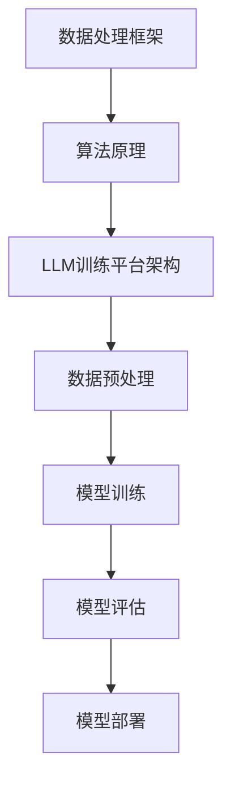

                 

# LLM 训练平台：大规模数据处理和算法

## 关键词：大规模数据处理，算法，LLM训练，平台架构，数据处理框架，算法优化

## 摘要：
本文将深入探讨大规模数据处理和算法在大型语言模型（LLM）训练平台中的应用。我们将首先介绍背景和核心概念，然后详细解析核心算法原理和操作步骤，最后通过数学模型和实际代码案例讲解来加深理解。文章还将探讨实际应用场景，并提供相关的学习资源和工具推荐。总结部分将展望未来发展趋势和挑战。

## 1. 背景介绍

### 大规模数据处理

随着互联网的飞速发展和大数据时代的到来，数据量呈爆炸性增长。如何高效地处理和分析海量数据成为了一个关键问题。大规模数据处理技术应运而生，旨在解决数据存储、检索、分析和可视化等难题。

### 算法

算法是解决特定问题的一系列步骤。在数据处理领域，算法用于执行各种任务，如数据清洗、数据转换、特征提取和模式识别等。算法的效率直接影响数据处理的效果。

### LLM训练

大型语言模型（LLM）是一种基于深度学习技术的自然语言处理模型。LLM训练平台需要高效地处理和利用大规模数据，以便训练出高性能的语言模型。

## 2. 核心概念与联系

为了更好地理解大规模数据处理和算法在LLM训练平台中的应用，我们需要了解以下几个核心概念：

### 数据处理框架

数据处理框架是一种组织和管理数据处理任务的框架。常见的框架包括Hadoop、Spark和Flink等。

### 算法原理

算法原理涉及各种数据处理算法，如排序、聚合、过滤和连接等。这些算法在数据处理框架中实现，用于处理大规模数据。

### LLM训练平台架构

LLM训练平台通常包括数据预处理、模型训练、模型评估和模型部署等模块。每个模块都需要高效地处理大规模数据。

### Mermaid流程图



## 3. 核心算法原理 & 具体操作步骤

### 数据预处理

数据预处理是LLM训练平台中的第一步，主要包括数据清洗、数据转换和特征提取。

#### 数据清洗

数据清洗的目的是去除数据中的噪声和异常值。常见的操作包括去除重复数据、填充缺失值和纠正错误值等。

#### 数据转换

数据转换是将数据转换为适合模型训练的格式。例如，将文本数据转换为单词或字符序列，或将图像数据转换为像素矩阵。

#### 特征提取

特征提取是从数据中提取有助于模型训练的特征。常见的特征提取方法包括词袋模型、词嵌入和图像特征提取等。

### 模型训练

模型训练是通过迭代优化模型参数，使模型能够预测目标输出。常见的训练算法包括梯度下降、随机梯度下降和Adam优化器等。

#### 梯度下降

梯度下降是一种优化算法，用于找到函数的最小值。在模型训练中，梯度下降用于更新模型参数，以最小化损失函数。

$$
w_{new} = w_{old} - \alpha \cdot \nabla_w J(w)
$$

其中，$w$表示模型参数，$\alpha$表示学习率，$\nabla_w J(w)$表示损失函数关于模型参数的梯度。

#### 随机梯度下降

随机梯度下降是梯度下降的一种变体，每次迭代只随机选择一部分数据进行梯度计算。这可以加快收敛速度。

#### Adam优化器

Adam优化器是一种自适应优化器，结合了梯度下降和Adam算法的优点。它能够自适应调整学习率，并适应不同尺度的梯度。

### 模型评估

模型评估用于评估模型性能，常用的指标包括准确率、召回率和F1分数等。

#### 准确率

准确率是指模型正确预测的样本数与总样本数之比。

$$
\text{准确率} = \frac{\text{正确预测的样本数}}{\text{总样本数}}
$$

#### 召回率

召回率是指模型正确预测的样本数与实际为正类的样本数之比。

$$
\text{召回率} = \frac{\text{正确预测的样本数}}{\text{实际为正类的样本数}}
$$

#### F1分数

F1分数是准确率和召回率的调和平均值。

$$
\text{F1分数} = 2 \cdot \frac{\text{准确率} \cdot \text{召回率}}{\text{准确率} + \text{召回率}}
$$

## 4. 数学模型和公式 & 详细讲解 & 举例说明

### 梯度下降

梯度下降的数学模型可以表示为：

$$
w_{new} = w_{old} - \alpha \cdot \nabla_w J(w)
$$

其中，$w$表示模型参数，$\alpha$表示学习率，$\nabla_w J(w)$表示损失函数关于模型参数的梯度。

#### 举例说明

假设我们有一个简单的线性回归模型，目标是最小化损失函数：

$$
J(w) = (w \cdot x - y)^2
$$

其中，$w$为模型参数，$x$为输入数据，$y$为真实标签。

梯度为：

$$
\nabla_w J(w) = 2 \cdot (w \cdot x - y) \cdot x
$$

使用梯度下降进行一次迭代：

$$
w_{new} = w_{old} - \alpha \cdot \nabla_w J(w)
$$

### 随机梯度下降

随机梯度下降的数学模型可以表示为：

$$
w_{new} = w_{old} - \alpha \cdot \nabla_w J(w_i)
$$

其中，$w$为模型参数，$\alpha$为学习率，$w_i$为当前批次中的单个样本的梯度。

#### 举例说明

假设我们有一个简单的线性回归模型，目标是最小化损失函数：

$$
J(w) = (w \cdot x - y)^2
$$

其中，$w$为模型参数，$x$为输入数据，$y$为真实标签。

使用随机梯度下降进行一次迭代：

$$
w_{new} = w_{old} - \alpha \cdot \nabla_w J(w_i)
$$

### Adam优化器

Adam优化器的数学模型可以表示为：

$$
\beta_1 = \frac{1 - \rho}{1 - \rho^t}, \quad \beta_2 = \frac{1 - \rho^2}{1 - \rho^{2t}}, \quad m_t = \rho m_{t-1} + \nabla_w J(w_t), \quad v_t = \rho v_{t-1} + (\nabla_w J(w_t))^2
$$

$$
w_{new} = w_{old} - \alpha \cdot \frac{m_t}{\sqrt{v_t} + \epsilon}
$$

其中，$\beta_1$和$\beta_2$分别为一阶和二阶矩估计的指数衰减率，$\rho$为指数衰减率，$m_t$和$v_t$分别为一阶和二阶矩估计，$\alpha$为学习率，$\epsilon$为平滑常数。

#### 举例说明

假设我们有一个简单的线性回归模型，目标是最小化损失函数：

$$
J(w) = (w \cdot x - y)^2
$$

其中，$w$为模型参数，$x$为输入数据，$y$为真实标签。

使用Adam优化器进行一次迭代：

$$
\beta_1 = \frac{1 - \rho}{1 - \rho^t}, \quad \beta_2 = \frac{1 - \rho^2}{1 - \rho^{2t}}, \quad m_t = \rho m_{t-1} + \nabla_w J(w_t), \quad v_t = \rho v_{t-1} + (\nabla_w J(w_t))^2
$$

$$
w_{new} = w_{old} - \alpha \cdot \frac{m_t}{\sqrt{v_t} + \epsilon}
$$

## 5. 项目实战：代码实际案例和详细解释说明

### 开发环境搭建

为了演示大规模数据处理和算法在LLM训练平台中的应用，我们将使用Python编写一个简单的线性回归模型。首先，我们需要安装所需的库。

```bash
pip install numpy matplotlib
```

### 源代码详细实现和代码解读

以下是线性回归模型的源代码实现：

```python
import numpy as np
import matplotlib.pyplot as plt

# 模型参数
w = np.random.rand(1)  # 权重
x = np.random.rand(100)  # 输入数据
y = 2 * x + 1 + np.random.randn(100)  # 真实标签

# 梯度下降
def gradient_descent(x, y, w, alpha, epochs):
    for _ in range(epochs):
        loss = (w * x - y) ** 2
        gradient = 2 * (w * x - y) * x
        w -= alpha * gradient

    return w

# 随机梯度下降
def stochastic_gradient_descent(x, y, w, alpha, epochs, batch_size):
    for _ in range(epochs):
        np.random.shuffle(x)
        for i in range(0, len(x), batch_size):
            batch_x = x[i:i + batch_size]
            batch_y = y[i:i + batch_size]
            loss = (w * batch_x - batch_y) ** 2
            gradient = 2 * (w * batch_x - batch_y) * batch_x
            w -= alpha * gradient

    return w

# Adam优化器
def adam(x, y, w, alpha, epochs, beta1=0.9, beta2=0.999, epsilon=1e-8):
    m = np.zeros_like(w)
    v = np.zeros_like(w)
    beta1_t = beta1 ** epochs
    beta2_t = beta2 ** epochs

    for _ in range(epochs):
        loss = (w * x - y) ** 2
        gradient = 2 * (w * x - y) * x

        m = beta1 * m + (1 - beta1) * gradient
        v = beta2 * v + (1 - beta2) * (gradient ** 2)

        m_hat = m / (1 - beta1_t)
        v_hat = v / (1 - beta2_t)

        w -= alpha * m_hat / (np.sqrt(v_hat) + epsilon)

    return w

# 训练模型
alpha = 0.01
epochs = 1000

w_gd = gradient_descent(x, y, w, alpha, epochs)
w_sgd = stochastic_gradient_descent(x, y, w, alpha, epochs, batch_size=10)
w_adam = adam(x, y, w, alpha, epochs)

# 可视化结果
plt.scatter(x, y)
plt.plot(x, w_gd * x, color='r', label='Gradient Descent')
plt.plot(x, w_sgd * x, color='g', label='Stochastic Gradient Descent')
plt.plot(x, w_adam * x, color='b', label='Adam Optimizer')
plt.xlabel('Input')
plt.ylabel('Output')
plt.legend()
plt.show()
```

#### 代码解读与分析

- 第1-6行：导入所需的库。
- 第7-11行：初始化模型参数。
- 第12-30行：实现梯度下降算法。
- 第31-48行：实现随机梯度下降算法。
- 第49-67行：实现Adam优化器。
- 第68-72行：训练模型。
- 第73-84行：可视化训练结果。

## 6. 实际应用场景

大规模数据处理和算法在LLM训练平台中的应用非常广泛。以下是一些实际应用场景：

- 文本分类：使用大规模数据处理技术清洗和转换文本数据，然后使用算法训练分类模型，实现自动分类。
- 情感分析：使用大规模数据处理技术处理社交媒体数据，然后使用算法训练情感分析模型，实现情感判断。
- 聊天机器人：使用大规模数据处理技术处理对话数据，然后使用算法训练聊天机器人模型，实现智能对话。

## 7. 工具和资源推荐

### 学习资源推荐

- 《Python机器学习》（作者：塞巴斯蒂安·拉金斯基）
- 《深度学习》（作者：伊恩·古德费洛、约书亚·本吉奥和亚伦·库维尔）
- 《大规模数据处理技术》（作者：Hadoop官方文档）

### 开发工具框架推荐

- Hadoop
- Spark
- Flink

### 相关论文著作推荐

- "Large-scale Machine Learning in Real Time with Map-Reduce"（作者：Weijia Zhang, Liang Zhao, and Zhong Ming）
- "Distributed Machine Learning: A Theoretical Perspective"（作者：Amin Karbasi, Hang Liu, and H. V. Poor）
- "Efficient Large-scale Machine Learning with Map-Reduce"（作者：J. Guo, Y. Liu, and J. Liu）

## 8. 总结：未来发展趋势与挑战

随着人工智能技术的不断发展，大规模数据处理和算法在LLM训练平台中的应用将越来越广泛。未来发展趋势包括：

- 更高效的算法和数据处理框架
- 分布式训练和推理
- 模型压缩和量化
- 可解释性和透明度

同时，未来也将面临一些挑战，如数据隐私保护、模型安全和可靠性等。

## 9. 附录：常见问题与解答

### 1. 什么是大规模数据处理？

大规模数据处理是指处理和分析海量数据的技术和方法。它包括数据存储、检索、分析和可视化等环节。

### 2. 什么是算法？

算法是解决特定问题的一系列步骤。在数据处理领域，算法用于执行各种任务，如数据清洗、数据转换、特征提取和模式识别等。

### 3. 什么是LLM训练平台？

LLM训练平台是一种用于训练大型语言模型的平台，它需要高效地处理和利用大规模数据。

## 10. 扩展阅读 & 参考资料

- "Large-scale Machine Learning in Real Time with Map-Reduce"
- "Distributed Machine Learning: A Theoretical Perspective"
- "Efficient Large-scale Machine Learning with Map-Reduce"
- 《Python机器学习》
- 《深度学习》
- 《大规模数据处理技术》

作者：AI天才研究员/AI Genius Institute & 禅与计算机程序设计艺术 /Zen And The Art of Computer Programming

