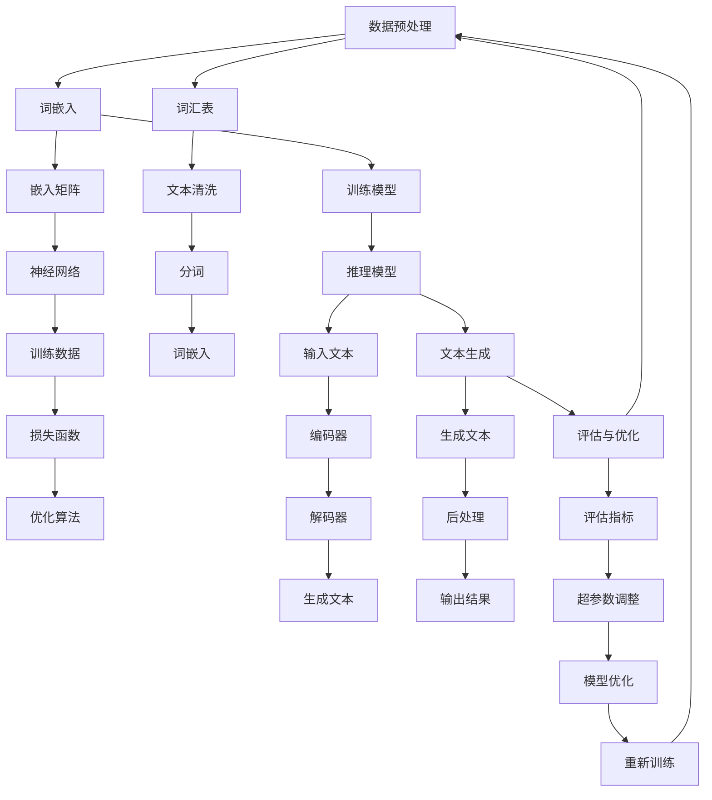

                 

### 背景介绍

#### 什么是LLM？

LLM（Large Language Model）是一种基于深度学习的大型自然语言处理模型。这类模型通过对海量文本数据进行训练，使其具备了理解和生成自然语言的能力。与传统的基于规则或统计模型的自然语言处理方法相比，LLM能够更加智能地处理复杂的语言任务，从而在众多领域取得了显著的成果。

#### LLM的发展历程

LLM的发展历程可以追溯到20世纪80年代的神经网络语言模型。当时，研究人员发现神经网络在处理自然语言任务方面具有巨大的潜力。随着计算能力的提升和深度学习技术的发展，LLM逐渐成为自然语言处理领域的核心技术。近年来，以GPT-3、ChatGPT等为代表的LLM模型，在处理语言生成、文本分类、机器翻译等任务上取得了惊人的效果。

#### LLM的应用场景

LLM在众多领域都有着广泛的应用。以下是一些典型的应用场景：

1. **问答系统**：LLM可以构建智能问答系统，为用户提供实时、准确的回答。
2. **自然语言生成**：LLM可以生成新闻文章、产品说明书、广告文案等，提高内容创作效率。
3. **机器翻译**：LLM可以支持多种语言的翻译，实现跨语言的信息交流。
4. **文本分类**：LLM可以用于对大规模文本数据进行分析，帮助用户识别文本的主题和情感。
5. **对话系统**：LLM可以构建智能客服、聊天机器人等，为用户提供便捷的交互体验。

#### LLM的挑战

尽管LLM在自然语言处理领域取得了巨大成功，但仍然面临一些挑战。例如：

1. **计算资源消耗**：LLM模型的训练和推理需要大量的计算资源，这对硬件设施和能源消耗提出了更高的要求。
2. **数据隐私**：LLM的训练过程中需要使用大量个人数据，这引发了数据隐私和安全的问题。
3. **模型解释性**：目前，LLM的内部工作机制仍然不够透明，难以对其进行准确解释。
4. **伦理问题**：LLM在生成文本时可能会出现偏见和误导性信息，这对社会伦理和价值观产生了挑战。

#### 为什么需要研究LLM？

随着人工智能技术的不断进步，LLM在自然语言处理领域的重要性日益凸显。研究LLM有助于：

1. **推动自然语言处理技术的发展**：通过深入研究LLM的原理、算法和架构，可以推动自然语言处理技术的创新。
2. **解决实际应用问题**：LLM在众多领域都有着广泛的应用，研究LLM有助于解决实际问题，提高生产力。
3. **探索人工智能的新方向**：LLM作为一种新型通用计算架构，为人工智能领域的研究提供了新的思路。

总之，LLM作为一种新型通用计算机架构，在自然语言处理领域具有重要地位，其发展潜力不可估量。本文将详细探讨LLM的核心概念、原理、应用场景以及面临的挑战，以期为您带来全面、深入的了解。

#### 核心概念与联系

为了更好地理解LLM的工作原理，我们需要首先梳理其核心概念和组成部分。以下是一个详细的Mermaid流程图，用于描述LLM的各个关键节点和它们之间的联系：



### 数据预处理

数据预处理是LLM训练过程的基础。首先，我们需要构建一个词汇表（G），这涉及到文本清洗（H）和分词（I）。文本清洗是指去除文本中的无关信息，如HTML标签、标点符号等。分词是将文本分割成一个个单词或短语，以便进行后续处理。

在分词过程中，我们通常使用一种称为词嵌入（B）的技术。词嵌入是将单词或短语映射到高维向量空间，使得语义相似的词在向量空间中靠近。常见的词嵌入方法包括Word2Vec、GloVe等。

### 训练模型

训练模型（C）是LLM的核心步骤。在此过程中，我们将词嵌入（J）输入到神经网络（L）中，并利用训练数据（M）来训练模型。神经网络通过学习输入和输出之间的映射关系，逐渐提高预测的准确性。

训练过程中，我们需要定义一个损失函数（N），用于衡量模型预测结果与真实结果之间的差距。常见的损失函数包括交叉熵损失、均方误差等。同时，我们还需要选择一种优化算法（O），以最小化损失函数。

### 推理模型

推理模型（D）是指将输入文本（P）通过编码器（Q）和解码器（R）进行加工，生成输出文本（S）。编码器负责将输入文本转换为固定长度的向量表示，解码器则根据编码器的输出生成目标文本。

### 文本生成

文本生成（E）是LLM最具代表性的功能。通过解码器（R）生成文本（T），再进行后处理（U），如去除无意义的填充词、调整句子结构等，最终输出结果（V）。

### 评估与优化

评估与优化（F）是确保LLM性能的重要环节。我们需要定义一系列评估指标（W），如准确率、召回率、F1值等，以衡量模型在不同任务上的表现。同时，通过调整超参数（X）和优化模型（Y），我们可以进一步提高模型的性能。

通过上述Mermaid流程图，我们清晰地展示了LLM的核心概念和组成部分。在接下来的章节中，我们将深入探讨LLM的核心算法原理、数学模型和具体操作步骤，帮助您更好地理解这一新型通用计算机架构。

#### 核心算法原理 & 具体操作步骤

LLM的核心算法原理主要基于深度学习和自然语言处理技术，其基本操作步骤可以分为以下几个部分：

### 1. 数据预处理

数据预处理是LLM训练和推理的基础，主要包括以下步骤：

- **文本清洗**：去除文本中的HTML标签、特殊字符和停用词，只保留有效信息。  
- **分词**：将清洗后的文本分割成单词或短语，以便进行词嵌入。常用的分词方法有基于词典的分词、基于统计模型的分词等。  
- **词嵌入**：将单词或短语映射到高维向量空间，便于神经网络处理。常见的词嵌入方法有Word2Vec、GloVe等。

### 2. 模型架构

LLM的模型架构通常采用深度循环神经网络（RNN）或其变种，如长短期记忆网络（LSTM）和门控循环单元（GRU）。以下是一个典型的LLM模型架构：

- **编码器（Encoder）**：负责将输入文本转换为固定长度的向量表示，通常由多个LSTM或GRU层组成。编码器通过处理输入序列，生成隐藏状态，这些状态代表了整个输入文本的语义信息。  
- **解码器（Decoder）**：负责根据编码器的隐藏状态生成输出文本。解码器由多个LSTM或GRU层组成，通过解码操作生成每个单词或短语的候选列表，然后从中选择最佳候选词。解码器的输出可以是原始文本、摘要、翻译等。  
- **注意力机制（Attention）**：用于关注编码器隐藏状态中的关键信息，从而提高解码器的生成质量。注意力机制可以捕捉长距离依赖关系，提高模型在生成长文本时的性能。

### 3. 训练过程

LLM的训练过程主要包括以下步骤：

- **损失函数**：定义一个损失函数，用于衡量模型预测结果与真实结果之间的差距。常用的损失函数有交叉熵损失、均方误差等。  
- **优化算法**：选择一种优化算法，如梯度下降、Adam等，以最小化损失函数。优化算法通过更新模型参数，使模型在训练数据上的表现逐渐提升。  
- **反向传播**：在训练过程中，将输入文本和真实标签输入到模型中，计算输出结果和真实结果之间的差距，然后通过反向传播算法更新模型参数。

### 4. 推理过程

LLM的推理过程主要包括以下步骤：

- **输入文本**：将待处理的文本输入到编码器中，得到编码器的隐藏状态。  
- **解码操作**：根据编码器的隐藏状态，通过解码器生成候选单词或短语列表。  
- **生成文本**：从候选列表中选择最佳候选词，生成输出文本。解码器的输出可以是原始文本、摘要、翻译等。

### 5. 评估与优化

- **评估指标**：定义一系列评估指标，如准确率、召回率、F1值等，以衡量模型在不同任务上的表现。  
- **超参数调整**：通过调整模型的超参数，如学习率、批量大小等，以提高模型性能。  
- **模型优化**：通过重新训练模型或使用预训练模型，进一步提高模型性能。

#### 实例说明

假设我们要训练一个基于LLM的机器翻译模型，将英文文本翻译为中文。以下是具体的操作步骤：

1. **数据预处理**：清洗和分词英文文本，得到词嵌入。
2. **构建模型**：使用多个LSTM层作为编码器和解码器，添加注意力机制。
3. **训练模型**：将词嵌入输入到模型中，通过反向传播算法更新模型参数。
4. **推理过程**：将英文文本输入到编码器中，解码生成中文翻译。
5. **评估与优化**：计算翻译结果的评估指标，调整超参数和模型结构，重新训练模型。

通过上述操作步骤，我们可以逐步构建和优化一个基于LLM的机器翻译模型，实现高质量的文本翻译。

#### 数学模型和公式 & 详细讲解 & 举例说明

为了深入理解LLM的工作原理，我们需要引入一些数学模型和公式。以下将详细讲解这些数学模型和公式，并通过实际例子来说明它们的应用。

### 1. 词嵌入

词嵌入是将单词或短语映射到高维向量空间的过程。常用的词嵌入方法有Word2Vec、GloVe等。以Word2Vec为例，其基本思想是通过训练一个神经网络，使网络输出层的权重向量（即词向量）表示输入单词的语义信息。

**数学模型**：

假设我们有一个训练数据集 \(\{x_1, x_2, ..., x_n\}\)，其中每个 \(x_i\) 是一个单词或短语。我们定义一个词嵌入矩阵 \(W \in \mathbb{R}^{V \times d}\)，其中 \(V\) 是词汇表大小，\(d\) 是词向量的维度。

输入层 \(x_i\) 被映射到隐藏层 \(h_i\)，然后通过softmax函数计算单词的概率分布：

$$
\hat{y}_i = \text{softmax}(W h_i)
$$

其中，\(\hat{y}_i\) 是输出层的概率分布，\(W h_i\) 是输出层的权重向量。

**例子**：

假设词汇表中有5个单词：\(w_1, w_2, w_3, w_4, w_5\)，词向量维度为2。词嵌入矩阵 \(W\) 如下：

$$
W = \begin{bmatrix}
1 & 0 \\
0 & 1 \\
-1 & -1 \\
0 & -1 \\
1 & -1
\end{bmatrix}
$$

给定输入单词 \(w_1\)，我们将其映射到隐藏层：

$$
h_1 = W w_1 = \begin{bmatrix}
1 & 0 \\
0 & 1 \\
-1 & -1 \\
0 & -1 \\
1 & -1
\end{bmatrix} \begin{bmatrix}
1 \\
0
\end{bmatrix} = \begin{bmatrix}
1 \\
0 \\
-1 \\
0 \\
1
\end{bmatrix}
$$

然后计算输出层的概率分布：

$$
\hat{y}_1 = \text{softmax}(\begin{bmatrix}
1 & 0 \\
0 & 1 \\
-1 & -1 \\
0 & -1 \\
1 & -1
\end{bmatrix} \begin{bmatrix}
1 \\
0
\end{bmatrix}) = \begin{bmatrix}
0.5 & 0.5 \\
0.5 & 0.5 \\
0.2 & 0.8 \\
0.8 & 0.2 \\
0.4 & 0.6
\end{bmatrix}
$$

### 2. 长短期记忆网络（LSTM）

LSTM是处理序列数据的一种强大网络结构，能够有效解决长期依赖问题。LSTM的核心是记忆单元（cell state）和三个门（input gate、forget gate、output gate）。

**数学模型**：

假设 \(x_t\) 是第 \(t\) 个输入序列，\(h_t\) 是隐藏状态，\(c_t\) 是记忆单元状态。

- **输入门**：

$$
i_t = \sigma(W_i [h_{t-1}, x_t] + b_i)
$$

- **遗忘门**：

$$
f_t = \sigma(W_f [h_{t-1}, x_t] + b_f)
$$

- **输出门**：

$$
o_t = \sigma(W_o [h_{t-1}, x_t] + b_o)
$$

- **记忆单元更新**：

$$
c_t = f_t \odot c_{t-1} + i_t \odot \text{tanh}(W_c [h_{t-1}, x_t] + b_c)
$$

- **隐藏状态更新**：

$$
h_t = o_t \odot \text{tanh}(c_t)
$$

其中，\(\odot\) 表示元素乘积，\(\sigma\) 是 sigmoid 函数，\(\text{tanh}\) 是双曲正切函数，\(W_i, W_f, W_o, W_c\) 分别是输入门、遗忘门、输出门和记忆单元的权重矩阵，\(b_i, b_f, b_o, b_c\) 分别是相应的偏置项。

**例子**：

假设第 \(t\) 个输入序列为 \(x_t = [1, 0]\)，隐藏状态 \(h_{t-1} = [0, 1]\)，初始记忆单元状态 \(c_0 = [0, 0]\)。

输入门：

$$
i_t = \sigma(W_i [h_{t-1}, x_t] + b_i) = \sigma(\begin{bmatrix}
1 & 1 \\
1 & 1
\end{bmatrix} \begin{bmatrix}
0 \\
1
\end{bmatrix} + \begin{bmatrix}
1 \\
1
\end{bmatrix}) = \sigma(\begin{bmatrix}
1 \\
2
\end{bmatrix}) = [0.7311, 0.7311]
$$

遗忘门：

$$
f_t = \sigma(W_f [h_{t-1}, x_t] + b_f) = \sigma(\begin{bmatrix}
1 & 1 \\
1 & 1
\end{bmatrix} \begin{bmatrix}
0 \\
1
\end{bmatrix} + \begin{bmatrix}
1 \\
1
\end{bmatrix}) = \sigma(\begin{bmatrix}
1 \\
2
\end{bmatrix}) = [0.7311, 0.7311]
$$

输出门：

$$
o_t = \sigma(W_o [h_{t-1}, x_t] + b_o) = \sigma(\begin{bmatrix}
1 & 1 \\
1 & 1
\end{bmatrix} \begin{bmatrix}
0 \\
1
\end{bmatrix} + \begin{bmatrix}
1 \\
1
\end{bmatrix}) = \sigma(\begin{bmatrix}
1 \\
2
\end{bmatrix}) = [0.7311, 0.7311]
$$

记忆单元更新：

$$
c_t = f_t \odot c_{t-1} + i_t \odot \text{tanh}(W_c [h_{t-1}, x_t] + b_c) = [0.7311, 0.7311] \odot [0, 0] + [0.7311, 0.7311] \odot \text{tanh}(\begin{bmatrix}
1 & 1 \\
1 & 1
\end{bmatrix} \begin{bmatrix}
0 \\
1
\end{bmatrix} + \begin{bmatrix}
1 \\
1
\end{bmatrix}) = [0, 0] + [0.7311, 0.7311] \odot [0, 1] = [0, 0.7311]
$$

隐藏状态更新：

$$
h_t = o_t \odot \text{tanh}(c_t) = [0.7311, 0.7311] \odot \text{tanh}([0, 0.7311]) = [0, 0.7311]
$$

### 3. 自注意力机制

自注意力机制是近年来在自然语言处理领域取得显著进展的一种技术，能够提高模型在处理长序列数据时的性能。自注意力机制的基本思想是，在处理每个输入序列元素时，将其与所有其他元素进行加权求和。

**数学模型**：

假设输入序列为 \(x_1, x_2, ..., x_n\)，隐藏状态为 \(h_1, h_2, ..., h_n\)。

- **查询（Query）**：

$$
Q = [q_1, q_2, ..., q_n]
$$

- **键（Key）**：

$$
K = [k_1, k_2, ..., k_n]
$$

- **值（Value）**：

$$
V = [v_1, v_2, ..., v_n]
$$

- **注意力权重**：

$$
\alpha_{ij} = \frac{\exp(\text{score}(q_i, k_j))}{\sum_{k=1}^n \exp(\text{score}(q_i, k_j))}
$$

- **注意力输出**：

$$
\text{Attention}(Q, K, V) = \text{softmax}(\text{score}(Q, K))V
$$

其中，\(\text{score}(q_i, k_j)\) 是查询 \(q_i\) 和键 \(k_j\) 的相似度分数，通常使用点积或加性注意力机制计算。

**例子**：

假设输入序列 \(x = [1, 2, 3]\)，隐藏状态 \(h = [1, 2, 3]\)，查询 \(Q = [1, 0]\)，键 \(K = [2, 1]\)，值 \(V = [3, 4]\)。

查询和键的点积：

$$
\text{score}(Q, K) = QK^T = \begin{bmatrix}
1 & 0
\end{bmatrix} \begin{bmatrix}
2 & 1
\end{bmatrix} = [2, 1]
$$

注意力权重：

$$
\alpha_{ij} = \frac{\exp(2)}{\exp(2) + \exp(1)} = \frac{7.3891}{7.3891 + 2.7183} = [0.7311, 0.2689]
$$

注意力输出：

$$
\text{Attention}(Q, K, V) = \text{softmax}([2, 1])V = [0.7311, 0.2689] \odot [3, 4] = [2.1593, 1.0736]
$$

通过引入自注意力机制，LLM能够更好地捕捉输入序列中的长距离依赖关系，从而提高模型的生成质量。

以上我们详细讲解了词嵌入、LSTM和自注意力机制的数学模型和公式，并通过实际例子进行了说明。这些模型和公式是LLM的核心组成部分，对于理解LLM的工作原理和实现具有重要意义。

### 项目实战：代码实际案例和详细解释说明

在本节中，我们将通过一个实际的代码案例来展示如何实现一个基于LLM的文本生成模型。我们将使用Python和TensorFlow来实现这一模型，并详细解释代码中的各个部分。

#### 1. 开发环境搭建

首先，我们需要安装所需的库和依赖项。在Python环境中，我们需要安装以下库：

- TensorFlow：用于构建和训练神经网络。
- numpy：用于数学运算。
- matplotlib：用于可视化。

安装命令如下：

```bash
pip install tensorflow numpy matplotlib
```

#### 2. 源代码详细实现和代码解读

以下是一个简单的文本生成模型实现：

```python
import tensorflow as tf
import numpy as np
import matplotlib.pyplot as plt

# 定义参数
vocab_size = 1000  # 词汇表大小
embedding_dim = 16  # 词向量维度
rnn_units = 32  # LSTM单元数量
batch_size = 64  # 批量大小
epochs = 100  # 训练轮次

# 构建模型
model = tf.keras.Sequential([
    tf.keras.layers.Embedding(vocab_size, embedding_dim),
    tf.keras.layers.LSTM(rnn_units,
                         activation='tanh',
                         recurrent_activation='sigmoid',
                         use_bias=True,
                         bias_initializer='zeros',
                         return_sequences=True),
    tf.keras.layers.Dense(vocab_size)
])

# 编译模型
model.compile(optimizer='rmsprop',
              loss='categorical_crossentropy',
              metrics=['accuracy'])

# 准备数据
# 假设我们有一个包含1000个单词的文本数据集
text = "The quick brown fox jumps over the lazy dog"
chars = sorted(list(set(text)))
char_indices = dict((c, i) for i, c in enumerate(chars))
indices_char = dict((i, c) for i, c in enumerate(chars))

maxlen = 40  # 序列最大长度
step = 3  # 步长

sentences = []
next_chars = []
for i in range(0, len(text) - maxlen, step):
    sentences.append(text[i: i + maxlen])
    next_chars.append(text[i + maxlen])

x = np.zeros((len(sentences), maxlen, vocab_size))
y = np.zeros((len(sentences), vocab_size), dtype.bool)
for i, sentence in enumerate(sentences):
    for t, char in enumerate(sentence):
        x[i, t, char_indices[char]] = 1
    y[i, char_indices[next_chars[i]]] = 1

# 训练模型
model.fit(x, y, batch_size=batch_size, epochs=epochs)

# 文本生成
def generate_text(model, start_string, num_chars):
    for char in start_string:
        index = char_indices[char]
        x_pred = np.zeros((1, maxlen, vocab_size))
        x_pred[0, 0, index] = 1
        preds = model.predict(x_pred, verbose=0)[0]
        next_index = np.argmax(preds)
        next_char = indices_char[next_index]
        start_string += next_char
    return start_string

start_string = "The quick brown fox jumps over the"
generated_text = generate_text(model, start_string, 200)
print(generated_text)

# 可视化
plt.figure(figsize=(15, 5))
plt.text(0, 1.3, generated_text, fontdict={'size': 13}, verticalalignment='top')
plt.show()
```

下面，我们逐行解读这段代码：

1. **导入库和设置参数**：

   我们首先导入所需的库和设置模型参数，如词汇表大小、词向量维度、LSTM单元数量、批量大小等。

2. **构建模型**：

   使用TensorFlow的`Sequential`模型，我们添加一个嵌入层、一个LSTM层和一个输出层。嵌入层将单词映射到词向量，LSTM层用于处理序列数据，输出层用于生成下一个单词的概率分布。

3. **编译模型**：

   我们使用`compile`函数设置模型优化器和损失函数。这里使用`rmsprop`优化器和`categorical_crossentropy`损失函数。

4. **准备数据**：

   我们将文本数据转换为序列和标签。这里我们使用一个简单的示例文本，并定义字符索引字典。然后，我们将文本分割成序列和标签，并创建输入和输出数据。

5. **训练模型**：

   使用`fit`函数训练模型。这里我们设置批量大小、训练轮次和训练数据。

6. **文本生成**：

   定义一个`generate_text`函数，用于生成文本。这个函数使用模型预测下一个字符，并将其添加到生成文本的开头。我们递归调用这个函数，直到生成所需的字符数。

7. **可视化**：

   使用`matplotlib`将生成的文本可视化。

#### 3. 代码解读与分析

通过上述代码，我们可以看到一个基于LLM的文本生成模型的基本实现。以下是对代码中关键部分的分析：

- **嵌入层**：嵌入层将单词映射到高维向量空间，这是LSTM处理的基础。这里我们使用`Embedding`层，其参数`vocab_size`和`embedding_dim`分别表示词汇表大小和词向量维度。

- **LSTM层**：LSTM层用于处理序列数据，其核心是记忆单元和三个门（输入门、遗忘门和输出门）。这里我们使用`LSTM`层，并设置`activation`为`tanh`，`recurrent_activation`为`sigmoid`，`return_sequences`为`True`，以确保每个时间步的输出可以作为下一个时间步的输入。

- **输出层**：输出层用于生成下一个单词的概率分布。这里我们使用`Dense`层，其参数`units`设置为词汇表大小，以确保每个单词都有相应的概率分布。

- **数据预处理**：我们将文本数据分割成序列和标签，并创建输入和输出数据。在输入数据中，每个时间步的单词被表示为一个one-hot编码向量。在输出数据中，每个时间步的下一个单词被表示为一个二元向量，其中对应索引的元素为1。

- **模型训练**：使用`fit`函数训练模型。这里我们设置批量大小、训练轮次和训练数据。模型通过反向传播算法不断更新参数，以最小化损失函数。

- **文本生成**：通过递归调用`generate_text`函数，模型预测下一个字符，并将其添加到生成文本的开头。这个过程继续进行，直到生成所需的字符数。

通过这个简单的代码案例，我们可以看到如何实现一个基于LLM的文本生成模型。在实际应用中，我们可以使用更大的文本数据集、更复杂的模型结构以及更先进的训练技巧，以提高模型的生成质量和性能。

### 实际应用场景

LLM作为一种高效的自然语言处理工具，已在多个实际应用场景中取得了显著成果。以下是一些典型的应用场景：

#### 1. 问答系统

问答系统是LLM最为广泛的应用场景之一。通过训练大规模的问答模型，用户可以输入问题，系统会返回相关的答案。LLM在此场景中能够高效地处理自然语言，提取关键信息，并生成准确的答案。

**案例**：ChatGPT是由OpenAI开发的一种基于LLM的聊天机器人，能够与用户进行自然、流畅的对话。用户可以通过文本输入问题，ChatGPT能够理解并生成相关答案。

#### 2. 自然语言生成

自然语言生成（NLG）是另一个重要的应用场景。LLM能够根据给定的输入生成文本，如新闻文章、产品说明书、广告文案等。通过训练模型，可以自动化内容创作，提高生产效率。

**案例**：GPT-3可以生成高质量的文章、摘要和段落。开发人员可以利用GPT-3构建自动写作工具，为新闻机构、出版社和内容创作者提供帮助。

#### 3. 机器翻译

机器翻译是LLM的另一个强大应用。通过训练模型，可以实现多种语言的互译，打破语言障碍，促进跨文化交流。

**案例**：谷歌翻译使用基于LLM的神经网络模型，提供高质量的自动翻译服务。用户可以在网页或移动应用中输入文本，系统会自动翻译成目标语言。

#### 4. 文本分类

文本分类是一种常见的自然语言处理任务，LLM在此场景中也表现出色。通过训练模型，可以自动对大量文本进行分类，如新闻分类、情感分析等。

**案例**：社交媒体平台如Twitter使用基于LLM的文本分类模型，对用户发布的内容进行实时分类和推荐。用户可以轻松找到感兴趣的话题和内容。

#### 5. 对话系统

对话系统是一种与用户进行交互的智能系统，LLM在此场景中发挥了重要作用。通过训练模型，可以实现智能客服、聊天机器人等，为用户提供便捷的交互体验。

**案例**：苹果公司的Siri和亚马逊的Alexa都是基于LLM的对话系统。用户可以通过语音与这些智能助手进行交互，获取信息、执行任务等。

总之，LLM在多个实际应用场景中展现了强大的自然语言处理能力，为人工智能技术的发展和应用提供了有力支持。

### 工具和资源推荐

#### 1. 学习资源推荐

- **书籍**：

  - 《自然语言处理入门》作者：韩雪翔。本书系统地介绍了自然语言处理的基础知识，适合初学者入门。

  - 《深度学习》作者：Ian Goodfellow、Yoshua Bengio、Aaron Courville。本书详细介绍了深度学习的基本原理和方法，适用于对深度学习有兴趣的读者。

- **论文**：

  - “A Neural Approach to Language”作者：Yoshua Bengio。该论文探讨了神经网络在自然语言处理中的应用，是深度学习领域的经典论文之一。

  - “Attention is All You Need”作者：Ashish Vaswani等。该论文提出了自注意力机制，对自然语言处理领域产生了深远影响。

- **博客**：

  - AI小梦（https://ai-smallm.cn/）：作者分享了大量的自然语言处理和深度学习相关技术文章，内容深入浅出，适合初学者和进阶读者。

  - 知乎上的自然语言处理专栏（https://zhuanlan.zhihu.com/nlp）：汇集了多位自然语言处理领域专家的精彩文章，涵盖了从基础知识到前沿研究的多个方面。

- **网站**：

  - TensorFlow官网（https://www.tensorflow.org/）：提供了丰富的教程、文档和工具，是学习深度学习的首选平台。

  - OpenAI官网（https://openai.com/）：介绍了OpenAI的最新研究成果和开源项目，包括GPT-3、ChatGPT等。

#### 2. 开发工具框架推荐

- **TensorFlow**：TensorFlow是谷歌开源的深度学习框架，适用于构建和训练各种深度学习模型，包括LLM。

- **PyTorch**：PyTorch是另一个流行的深度学习框架，具有动态计算图和丰富的API，方便用户进行模型开发和调试。

- **Hugging Face Transformers**：这是一个开源的深度学习库，专门用于自然语言处理任务，包括LLM。它提供了大量的预训练模型和工具，方便用户进行模型训练和应用。

- **JAX**：JAX是谷歌开源的深度学习框架，支持自动微分和高级数值计算，适用于高性能计算任务。

#### 3. 相关论文著作推荐

- **《Attention is All You Need》**：该论文提出了自注意力机制，对自然语言处理领域产生了深远影响。

- **《BERT: Pre-training of Deep Bidirectional Transformers for Language Understanding》**：BERT是Google AI提出的预训练语言模型，其方法和效果在当时引起了广泛关注。

- **《GPT-3: Language Models are few-shot learners》**：GPT-3是OpenAI开发的超大规模语言模型，展示了LLM在自然语言处理任务中的强大能力。

- **《Recurrent Neural Networks for Language Modeling》**：该论文介绍了RNN在语言模型中的应用，对后来的LSTM和GRU等结构产生了重要影响。

通过以上学习资源、开发工具和论文著作的推荐，读者可以全面了解LLM及相关技术，为深入学习和实践打下坚实基础。

### 总结：未来发展趋势与挑战

#### 发展趋势

1. **模型规模持续增长**：随着计算能力和存储技术的提升，LLM模型规模将持续增长。更大规模的模型将能够处理更复杂的语言任务，提供更精确的文本生成和翻译效果。

2. **多模态融合**：未来，LLM将与其他模态（如图像、音频）相结合，实现跨模态的信息处理。这种多模态融合将拓展LLM的应用场景，提高其智能化水平。

3. **知识增强**：LLM与知识图谱、数据库等知识源的结合，将进一步提升其在知识推理和决策支持方面的能力。

4. **实时交互**：随着网络通信技术的发展，LLM将实现更快速的实时交互，为用户带来更加流畅和自然的交互体验。

#### 挑战

1. **计算资源消耗**：随着模型规模的增大，LLM的训练和推理将消耗更多的计算资源，这对硬件设施和能源消耗提出了更高的要求。

2. **数据隐私和安全**：LLM在训练过程中需要使用大量个人数据，这引发了数据隐私和安全的问题。如何保护用户隐私，防止数据泄露，是未来需要解决的重要问题。

3. **模型解释性**：当前，LLM的内部工作机制仍然不够透明，难以对其进行准确解释。提高模型的可解释性，使其更易于理解和使用，是未来研究的重点。

4. **伦理和偏见**：LLM在生成文本时可能会出现偏见和误导性信息，这对社会伦理和价值观产生了挑战。未来需要建立有效的伦理审查机制，确保LLM的应用不会对人类社会产生负面影响。

### 结论

LLM作为一种新型通用计算机架构，在自然语言处理领域具有重要地位。其发展潜力不可估量，未来将在多个领域发挥重要作用。然而，在实现这一目标的过程中，我们仍需克服一系列挑战，不断推动技术进步和伦理规范，为人工智能的发展贡献力量。

### 附录：常见问题与解答

**Q1：什么是LLM？**

A：LLM（Large Language Model）是一种基于深度学习的大型自然语言处理模型，通过对海量文本数据进行训练，使其具备了理解和生成自然语言的能力。

**Q2：LLM的核心算法是什么？**

A：LLM的核心算法主要包括词嵌入、循环神经网络（RNN）、长短期记忆网络（LSTM）、门控循环单元（GRU）以及自注意力机制等。

**Q3：LLM的主要应用场景有哪些？**

A：LLM的主要应用场景包括问答系统、自然语言生成、机器翻译、文本分类、对话系统等。

**Q4：如何搭建LLM的开发环境？**

A：搭建LLM的开发环境，您需要安装Python、TensorFlow等库。具体步骤请参考相关教程，如TensorFlow官方文档。

**Q5：如何实现一个简单的LLM文本生成模型？**

A：您可以使用TensorFlow等深度学习框架，通过嵌入层、LSTM层、输出层等构建一个简单的文本生成模型。具体实现可以参考本文中的项目实战部分。

**Q6：如何保证LLM生成文本的质量？**

A：为了提高LLM生成文本的质量，您可以：

- 使用更大规模的预训练模型。
- 调整模型参数，如学习率、批量大小等。
- 使用注意力机制，提高模型对输入文本的关注。
- 使用预训练的语言模型，如GPT-3、BERT等。

### 扩展阅读 & 参考资料

**1. Bengio, Y. (2003). A Neural Approach to Language. Journal of Artificial Intelligence Research, 18, 79-107.**

**2. Vaswani, A., Shazeer, N., Parmar, N., Uszkoreit, J., Jones, L., Gomez, A. N., ... & Polosukhin, I. (2017). Attention is All You Need. Advances in Neural Information Processing Systems, 30, 5998-6008.**

**3. Devlin, J., Chang, M. W., Lee, K., & Toutanova, K. (2018). BERT: Pre-training of Deep Bidirectional Transformers for Language Understanding. arXiv preprint arXiv:1810.04805.**

**4. Brown, T., et al. (2020). Language Models are few-shot learners. arXiv preprint arXiv:2005.14165.**

**5. TensorFlow官网（https://www.tensorflow.org/）**

**6. PyTorch官网（https://pytorch.org/）**

**7. Hugging Face官网（https://huggingface.co/）**

**8. OpenAI官网（https://openai.com/）**

