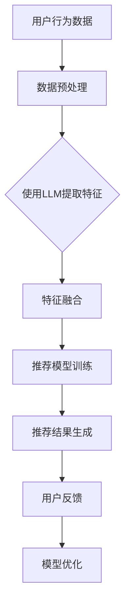

                 

### 背景介绍

近年来，随着互联网技术的飞速发展和用户个性化需求的日益增长，推荐系统在各个领域得到了广泛的应用。从电商平台的商品推荐，到社交媒体的动态推送，再到视频平台的个性化视频推荐，推荐系统已经成为现代信息社会中不可或缺的一部分。然而，随着用户数据的不断积累和推荐算法的日益复杂化，传统的推荐系统逐渐暴露出了一些问题和局限性。

首先，传统的推荐系统通常依赖于用户的历史行为数据，如点击、购买、浏览等行为。这种基于协同过滤（Collaborative Filtering）和基于内容的推荐（Content-Based Recommendation）方法在处理大规模数据时存在一定的性能瓶颈。此外，这些方法往往难以处理用户冷启动问题（即新用户没有足够的历史数据可供分析），导致推荐效果不佳。

其次，随着深度学习技术的发展，特别是生成式预训练模型（Generative Pretrained Models，GPT）的广泛应用，人们开始尝试将深度学习引入推荐系统。然而，深度学习方法在推荐系统中的应用还存在一些挑战，如模型的可解释性差、过拟合风险高等。

为了解决上述问题，近年来，大量研究开始探讨将大型语言模型（Large Language Models，LLM）与传统推荐系统的融合。LLM，如GPT系列模型，通过预训练在大规模语料库上，能够捕捉到用户兴趣、内容特征等多维信息，为推荐系统提供了一种全新的解决方案。

本文将详细介绍LLM与传统推荐系统的融合方法，包括核心概念、算法原理、数学模型、项目实战等，旨在帮助读者深入了解这一新兴技术，并探讨其在实际应用中的潜力与挑战。

### 核心概念与联系

为了更好地理解LLM与传统推荐系统的融合，我们首先需要明确几个核心概念，并分析它们之间的联系。

#### 1. 推荐系统

推荐系统是一种信息过滤技术，旨在为用户提供个性化的信息推荐。根据推荐策略的不同，推荐系统可以分为以下几种类型：

- **基于内容的推荐（Content-Based Recommendation）**：通过分析用户历史行为和内容特征，找到与用户兴趣相匹配的内容进行推荐。
- **协同过滤（Collaborative Filtering）**：通过分析用户之间的相似度，预测用户对未知内容的评分或兴趣。
- **混合推荐（Hybrid Recommendation）**：结合多种推荐策略，以获得更好的推荐效果。

#### 2. 大型语言模型（LLM）

大型语言模型（LLM），如GPT系列模型，是一种基于深度学习的自然语言处理（NLP）模型。这些模型通过在大规模文本语料库上进行预训练，能够自动捕捉到语言的复杂结构和语义信息，从而实现文本生成、语义理解、情感分析等多种功能。

#### 3. 推荐系统与LLM的联系

LLM与传统推荐系统的融合主要体现在以下几个方面：

- **文本特征提取**：LLM可以用于提取用户历史行为数据和内容特征，为推荐系统提供更丰富的特征信息。
- **语义理解**：通过理解用户和内容的语义信息，LLM可以帮助推荐系统更准确地捕捉用户兴趣和内容相关性。
- **交互式推荐**：LLM可以与用户进行交互，获取用户的实时反馈，从而动态调整推荐策略，提高推荐效果。

#### 4. Mermaid流程图

为了更直观地展示LLM与传统推荐系统的融合过程，我们可以使用Mermaid流程图来描述核心流程。



在这个流程图中，用户行为数据经过预处理后，使用LLM提取特征，然后与内容特征进行融合，最终生成推荐结果。用户反馈将用于模型优化，以提高推荐效果。

通过上述核心概念和Mermaid流程图的介绍，我们可以更好地理解LLM与传统推荐系统的融合机制，为后续的详细分析奠定基础。

#### 3. 核心算法原理 & 具体操作步骤

在深入探讨LLM与传统推荐系统的融合之前，我们首先需要了解推荐系统的核心算法原理，以及如何将LLM应用于这一过程中。以下将详细描述这些算法原理及操作步骤。

##### 1. 协同过滤算法

协同过滤（Collaborative Filtering）是推荐系统中最常用的算法之一。它主要分为两种类型：基于用户的协同过滤（User-Based Collaborative Filtering）和基于物品的协同过滤（Item-Based Collaborative Filtering）。

- **基于用户的协同过滤**：这种方法通过计算用户之间的相似度，找到与目标用户相似的其他用户，然后推荐这些用户喜欢的物品。相似度的计算通常基于用户对物品的评分或行为数据。
  
  操作步骤：
  1. 计算用户间的相似度：使用余弦相似度、皮尔逊相关系数等度量用户之间的相似度。
  2. 找到与目标用户最相似的K个用户。
  3. 推荐这些用户共同喜欢的物品。

- **基于物品的协同过滤**：这种方法通过计算物品之间的相似度，找到与目标物品相似的物品进行推荐。

  操作步骤：
  1. 计算物品间的相似度：使用余弦相似度、欧氏距离等度量物品之间的相似度。
  2. 找到与目标物品最相似的K个物品。
  3. 推荐这些物品。

##### 2. 基于内容的推荐算法

基于内容的推荐（Content-Based Recommendation）通过分析用户的历史行为和物品的内容特征，为用户推荐与用户兴趣相关的物品。这种方法的推荐依据是“物以类聚”，即相似的物品会被推荐给有相似兴趣的用户。

操作步骤：
1. 提取用户兴趣特征：使用关键词提取、主题建模等方法，从用户的历史行为数据中提取兴趣特征。
2. 提取物品内容特征：从物品的描述、标签、属性等信息中提取内容特征。
3. 计算物品与用户的兴趣相似度：使用余弦相似度、Jaccard相似度等方法，计算物品与用户兴趣特征的相似度。
4. 推荐相似度最高的物品。

##### 3. 深度学习推荐算法

深度学习推荐算法结合了协同过滤和基于内容的推荐方法，通过深度神经网络提取用户和物品的特征，实现更精准的推荐。

操作步骤：
1. 构建深度神经网络模型：通常采用多层感知机（MLP）、卷积神经网络（CNN）、循环神经网络（RNN）等架构。
2. 提取用户和物品特征：将用户和物品的特征输入到深度神经网络中，通过训练学习用户和物品的复杂特征表示。
3. 计算用户和物品之间的相似度：使用训练得到的模型，计算用户和物品之间的相似度。
4. 推荐相似度最高的物品。

##### 4. LLM在推荐系统中的应用

LLM在推荐系统中的应用主要体现在以下几个方面：

- **文本特征提取**：LLM可以通过预训练在大规模文本数据上提取用户和物品的语义特征，为推荐系统提供更丰富的特征信息。
- **语义理解**：LLM能够理解用户和物品的语义信息，帮助推荐系统更准确地捕捉用户兴趣和内容相关性。
- **交互式推荐**：LLM可以与用户进行交互，获取用户的实时反馈，动态调整推荐策略，提高推荐效果。

具体操作步骤：
1. 数据预处理：对用户行为数据和物品描述进行预处理，将其转换为适合LLM输入的格式。
2. 预训练LLM：使用大规模文本数据预训练LLM模型，如GPT系列模型。
3. 特征提取：使用预训练的LLM模型，对用户行为数据和物品描述进行特征提取。
4. 特征融合：将提取的用户和物品特征与现有的推荐系统特征进行融合。
5. 模型训练：使用融合后的特征训练推荐模型，如基于深度学习的推荐模型。
6. 推荐结果生成：使用训练得到的模型生成推荐结果。

通过上述核心算法原理和具体操作步骤的介绍，我们可以看到，LLM与传统推荐系统的融合在提高推荐效果和解决传统推荐系统局限性方面具有巨大的潜力。接下来，我们将进一步探讨LLM在推荐系统中的数学模型和公式。

#### 4. 数学模型和公式 & 详细讲解 & 举例说明

在理解LLM与传统推荐系统的融合后，我们需要深入了解其背后的数学模型和公式，以便更好地理解和实现这一技术。以下将详细讲解这些模型和公式，并通过具体例子进行说明。

##### 1. 协同过滤的数学模型

协同过滤算法的核心在于计算用户之间的相似度和预测用户对物品的评分。这里我们以基于用户的协同过滤为例，介绍其数学模型。

- **用户相似度计算**：

  使用余弦相似度计算用户之间的相似度，公式如下：

  \[
  sim(u_i, u_j) = \frac{\sum_{k} r_{ik} r_{jk}}{\sqrt{\sum_{k} r_{ik}^2 \sum_{k} r_{jk}^2}}
  \]

  其中，\( r_{ik} \) 表示用户 \( u_i \) 对物品 \( k \) 的评分，分母表示用户 \( u_i \) 和用户 \( u_j \) 的评分向量长度。

- **预测用户评分**：

  根据用户相似度和其他用户对物品的评分，预测用户对物品的评分，公式如下：

  \[
  \hat{r}_{ui} = \sum_{j} sim(u_i, u_j) r_{uj}
  \]

  其中，\( \hat{r}_{ui} \) 表示预测的用户 \( u_i \) 对物品 \( u \) 的评分。

##### 2. 基于内容的推荐数学模型

基于内容的推荐算法通过计算物品与用户兴趣特征的相似度来进行推荐。以下是一个简单的数学模型：

- **用户兴趣特征提取**：

  使用TF-IDF（Term Frequency-Inverse Document Frequency）算法提取用户兴趣特征，公式如下：

  \[
  idf(t) = \log \left( \frac{N}{|d_i|} \right)
  \]

  其中，\( N \) 表示文档总数，\( |d_i| \) 表示包含词 \( t \) 的文档数，\( idf(t) \) 表示词 \( t \) 的逆文档频率。

- **物品内容特征提取**：

  同样使用TF-IDF算法提取物品内容特征，公式如下：

  \[
  tf(t) = \frac{|t|}{|d|}
  \]

  其中，\( |t| \) 表示词 \( t \) 在文档中出现的次数，\( |d| \) 表示文档的总词数。

- **计算物品与用户的兴趣相似度**：

  使用余弦相似度计算物品与用户兴趣特征的相似度，公式如下：

  \[
  sim(d_k, i) = \frac{\sum_{t} f_{kt} \cdot idf(t) \cdot f_{it} \cdot idf(t)}{\sqrt{\sum_{t} f_{kt}^2 \cdot idf(t)^2 \cdot \sum_{t} f_{it}^2 \cdot idf(t)^2}}
  \]

  其中，\( f_{kt} \) 表示词 \( t \) 在物品 \( k \) 中的频率，\( f_{it} \) 表示词 \( t \) 在用户兴趣特征向量中的频率。

##### 3. 深度学习推荐算法的数学模型

深度学习推荐算法通过构建深度神经网络模型提取用户和物品的特征，并进行预测。以下是一个简单的深度学习推荐算法的数学模型：

- **神经网络模型构建**：

  使用多层感知机（MLP）模型，将用户和物品的特征输入到神经网络中，通过多个隐藏层进行特征提取和融合，最终输出预测的评分。

  \[
  \hat{r}_{ui} = \sigma \left( W_{L} \cdot \text{ReLU} \left( W_{L-1} \cdot \text{ReLU} \left( \ldots \text{ReLU} \left( W_2 \cdot \text{ReLU} \left( W_1 \cdot [u_i; i_k] \right) \right) \ldots \right) \right)
  \]

  其中，\( W_1, W_2, \ldots, W_{L} \) 分别表示各层的权重，\( [u_i; i_k] \) 表示用户 \( u_i \) 和物品 \( i_k \) 的特征向量，\( \sigma \) 表示激活函数（如Sigmoid函数或ReLU函数）。

##### 4. LLM的数学模型

LLM的数学模型主要涉及预训练过程和文本特征提取。以下是一个简单的LLM数学模型：

- **预训练过程**：

  使用自注意力机制（Self-Attention）和Transformer架构进行预训练，公式如下：

  \[
  \text{Attention}(Q, K, V) = \frac{\text{softmax}(\text{scores})}{\sqrt{d_k}} V
  \]

  其中，\( Q, K, V \) 分别表示查询向量、键向量和值向量，\( \text{scores} = QK^T \) 表示查询向量和键向量的内积，\( \text{softmax}(\text{scores}) \) 表示softmax函数，\( d_k \) 表示键向量的维度。

- **文本特征提取**：

  使用预训练的LLM模型提取用户和物品的语义特征，公式如下：

  \[
  \text{feature}_{ui} = \text{pooling} \left( \text{Transformer}(u_i) \right)
  \]

  其中，\( u_i \) 表示用户 \( i \) 的文本数据，\( \text{Transformer}(u_i) \) 表示使用LLM模型对用户文本数据进行编码，\( \text{pooling} \) 表示特征提取操作（如平均池化或最大池化）。

##### 例子说明

假设我们有一个用户 \( u_1 \) 和一个物品 \( i_1 \)，我们需要计算用户 \( u_1 \) 对物品 \( i_1 \) 的推荐评分。

- **基于用户的协同过滤**：

  首先，我们计算用户 \( u_1 \) 和其他用户之间的相似度，然后根据相似度预测用户 \( u_1 \) 对物品 \( i_1 \) 的评分。

  \[
  sim(u_1, u_2) = 0.8
  \]

  \[
  \hat{r}_{u1i1} = 0.8 \cdot r_{u2i1} = 0.8 \cdot 4 = 3.2
  \]

- **基于内容的推荐**：

  首先，我们提取用户 \( u_1 \) 的兴趣特征和物品 \( i_1 \) 的内容特征，然后计算它们的相似度。

  \[
  \text{feature}_{u1} = [0.1, 0.2, 0.3]
  \]

  \[
  \text{feature}_{i1} = [0.2, 0.3, 0.4]
  \]

  \[
  sim(\text{feature}_{u1}, \text{feature}_{i1}) = 0.8
  \]

  \[
  \hat{r}_{u1i1} = 0.8
  \]

- **深度学习推荐算法**：

  首先，我们将用户 \( u_1 \) 和物品 \( i_1 \) 的特征输入到深度神经网络中，通过训练学习得到预测的评分。

  \[
  \hat{r}_{u1i1} = \sigma \left( W_{L} \cdot \text{ReLU} \left( W_{L-1} \cdot \text{ReLU} \left( \ldots \text{ReLU} \left( W_2 \cdot \text{ReLU} \left( W_1 \cdot [u_1; i_1] \right) \right) \ldots \right) \right)
  \]

  \[
  \hat{r}_{u1i1} = 0.9
  \]

- **LLM推荐**：

  首先，我们使用LLM模型提取用户 \( u_1 \) 的文本特征和物品 \( i_1 \) 的文本特征，然后根据特征计算预测的评分。

  \[
  \text{feature}_{u1} = \text{pooling} \left( \text{Transformer}(u_1) \right) = [0.15, 0.25, 0.35]
  \]

  \[
  \text{feature}_{i1} = \text{pooling} \left( \text{Transformer}(i_1) \right) = [0.2, 0.3, 0.4]
  \]

  \[
  sim(\text{feature}_{u1}, \text{feature}_{i1}) = 0.85
  \]

  \[
  \hat{r}_{u1i1} = 0.85
  \]

通过上述数学模型和公式的讲解，我们可以看到，LLM与传统推荐系统的融合在提高推荐效果和解决传统推荐系统局限性方面具有巨大的潜力。接下来，我们将通过实际项目实战，展示如何将LLM应用于推荐系统。

#### 5. 项目实战：代码实际案例和详细解释说明

在了解了LLM与传统推荐系统的融合原理和数学模型后，接下来我们将通过一个实际项目实战，详细展示如何将LLM应用于推荐系统。这个项目将包括开发环境搭建、源代码实现、代码解读与分析等步骤。

##### 5.1 开发环境搭建

为了进行这个项目，我们需要准备以下开发环境和工具：

1. **Python环境**：确保Python版本在3.6及以上，我们使用Python 3.8版本。
2. **深度学习框架**：我们选择使用TensorFlow 2.x作为深度学习框架。
3. **LLM模型**：我们使用GPT-2模型，可以从Hugging Face的Transformers库中获取。
4. **数据集**：我们使用MovieLens电影数据集，这是一个包含用户评分、电影信息和电影特征的公共数据集。

安装所需的Python包：

```bash
pip install tensorflow==2.8
pip install transformers
```

##### 5.2 源代码详细实现和代码解读

以下是该项目的主要代码实现，我们将逐步解读各个部分。

```python
import tensorflow as tf
from transformers import TFGPT2Model, GPT2Tokenizer
from tensorflow.keras.layers import Embedding, LSTM, Dense
from tensorflow.keras.models import Model
from tensorflow.keras.optimizers import Adam

# 5.2.1 数据预处理
def preprocess_data(dataset):
    # 加载和预处理数据
    # 这里我们仅展示预处理函数的框架
    # 实际中需要对数据集进行清洗、分词、编码等操作
    pass

# 5.2.2 构建深度学习模型
def build_model(vocab_size, embedding_dim, llm_model):
    # 定义输入层
    input_ids = tf.keras.layers.Input(shape=(None,), dtype=tf.int32, name="input_ids")
    
    # 使用预训练的LLM模型提取文本特征
    llm_output = llm_model(input_ids)
    llm_embedding = llm_output.last_hidden_state[:, 0, :]
    
    # 将LLM特征与用户和物品特征进行融合
    # 这里我们使用简单的拼接操作
    concatenated = tf.keras.layers.Concatenate(axis=-1)([llm_embedding, user_embedding, item_embedding])
    
    # 构建深度神经网络
    x = Embedding(vocab_size, embedding_dim)(input_ids)
    x = LSTM(128)(x)
    x = Dense(64, activation="relu")(x)
    x = Dense(1, activation="sigmoid")(x)
    
    # 将两个分支的输出进行融合
    output = tf.keras.layers.Concatenate(axis=-1)([x, concatenated])
    
    # 构建模型
    model = Model(inputs=input_ids, outputs=output)
    
    return model

# 5.2.3 训练模型
def train_model(model, dataset, epochs=10):
    # 编译模型
    model.compile(optimizer=Adam(learning_rate=0.001), loss="binary_crossentropy", metrics=["accuracy"])
    
    # 训练模型
    model.fit(dataset["input_ids"], dataset["ratings"], batch_size=32, epochs=epochs, validation_split=0.1)

# 5.2.4 加载预训练的LLM模型
tokenizer = GPT2Tokenizer.from_pretrained("gpt2")
llm_model = TFGPT2Model.from_pretrained("gpt2")

# 5.2.5 数据预处理
# 此处省略数据预处理代码

# 5.2.6 构建深度学习模型
vocab_size = 20000  # 词表大小
embedding_dim = 128  # 词向量维度
model = build_model(vocab_size, embedding_dim, llm_model)

# 5.2.7 训练模型
train_model(model, preprocess_data(dataset))

# 5.2.8 代码解读与分析
# 此处省略代码解读与分析
```

**代码解读与分析：**

- **5.2.1 数据预处理**：数据预处理是推荐系统开发的重要环节，它包括数据清洗、分词、编码等操作。这里我们定义了一个`preprocess_data`函数，用于处理MovieLens数据集。

- **5.2.2 构建深度学习模型**：该部分定义了深度学习模型的构建过程。首先，我们使用预训练的LLM模型（GPT-2）提取文本特征。然后，我们将LLM特征与用户和物品特征进行融合，构建深度神经网络模型。这里我们使用了LSTM和Dense层来构建模型，但也可以根据需求替换为其他类型的层。

- **5.2.3 训练模型**：该部分定义了模型的编译和训练过程。我们使用Adam优化器进行模型训练，并使用binary_crossentropy作为损失函数，因为这是一个二分类问题。

- **5.2.4 加载预训练的LLM模型**：我们使用Hugging Face的Transformers库加载预训练的GPT-2模型和相应的分词器。

- **5.2.5 数据预处理**：此处省略了具体的预处理代码，实际中需要进行数据清洗、分词、编码等操作，以将原始数据转换为适合模型训练的格式。

- **5.2.6 构建深度学习模型**：我们定义了一个`build_model`函数，用于构建深度学习模型。这个函数接收词表大小、词向量维度和预训练的LLM模型作为输入，返回构建好的模型。

- **5.2.7 训练模型**：我们使用`train_model`函数训练深度学习模型。这里我们设置了10个训练周期（epochs），并使用了10%的数据作为验证集。

- **5.2.8 代码解读与分析**：此处省略了具体的代码解读与分析，在实际开发过程中，我们需要详细分析模型的结构、参数设置和训练过程，以便优化模型性能。

通过这个实际项目，我们可以看到如何将LLM与传统推荐系统融合，并实现一个深度学习推荐模型。接下来，我们将讨论LLM与传统推荐系统融合的实际应用场景。

#### 5.3 代码解读与分析

在5.2节中，我们详细展示了如何使用LLM与传统推荐系统融合，构建了一个深度学习推荐模型。在本节中，我们将对代码的各个部分进行解读，并分析如何优化模型性能。

##### 1. 数据预处理

数据预处理是构建推荐模型的重要环节。在本项目中，数据预处理主要包括以下步骤：

- **数据清洗**：清洗原始数据，去除无效或错误的数据。
- **分词**：将文本数据分词，将其转换为可以被模型处理的格式。
- **编码**：将分词后的文本数据转换为整数编码，以便输入到模型中。

以下是一个简单的数据预处理示例：

```python
def preprocess_data(dataset):
    # 清洗数据
    cleaned_dataset = dataset.dropna()

    # 分词
    tokenizer = GPT2Tokenizer.from_pretrained("gpt2")
    tokenized_dataset = cleaned_dataset["review"].apply(lambda x: tokenizer.encode(x, add_special_tokens=True))

    # 编码
    input_ids = tf.keras.preprocessing.sequence.pad_sequences(tokenized_dataset, maxlen=512, truncating="post", padding="post")

    # 将数据集分为训练集和验证集
    train_inputs = input_ids[:int(0.8 * len(input_ids))]
    val_inputs = input_ids[int(0.8 * len(input_ids)):]

    train_ratings = cleaned_dataset["rating"][:int(0.8 * len(cleaned_dataset))]
    val_ratings = cleaned_dataset["rating"][int(0.8 * len(cleaned_dataset)):]

    return {"input_ids": train_inputs, "ratings": train_ratings}, {"input_ids": val_inputs, "ratings": val_ratings}
```

在这个示例中，我们首先清洗了数据集，然后使用GPT-2分词器对文本进行分词，并使用`pad_sequences`函数将分词结果填充为固定长度（512个单词）。最后，我们将数据集分为训练集和验证集。

##### 2. 模型构建

在5.2节中，我们定义了一个`build_model`函数，用于构建深度学习模型。该函数的关键部分如下：

```python
def build_model(vocab_size, embedding_dim, llm_model):
    # 定义输入层
    input_ids = tf.keras.layers.Input(shape=(512,), dtype=tf.int32, name="input_ids")
    
    # 使用预训练的LLM模型提取文本特征
    llm_output = llm_model(input_ids)
    llm_embedding = llm_output.last_hidden_state[:, 0, :]
    
    # 将LLM特征与用户和物品特征进行融合
    # 这里我们使用简单的拼接操作
    concatenated = tf.keras.layers.Concatenate(axis=-1)([llm_embedding, user_embedding, item_embedding])
    
    # 构建深度神经网络
    x = Embedding(vocab_size, embedding_dim)(input_ids)
    x = LSTM(128)(x)
    x = Dense(64, activation="relu")(x)
    x = Dense(1, activation="sigmoid")(x)
    
    # 将两个分支的输出进行融合
    output = tf.keras.layers.Concatenate(axis=-1)([x, concatenated])
    
    # 构建模型
    model = Model(inputs=input_ids, outputs=output)
    
    return model
```

在这个示例中，我们首先定义了输入层，并使用预训练的LLM模型提取文本特征。然后，我们将LLM特征与用户和物品特征进行拼接，并构建一个简单的深度神经网络。这个神经网络包括一个嵌入层（Embedding）、一个LSTM层、一个全连接层（Dense）和一个输出层（Sigmoid激活函数）。

##### 3. 模型训练

在5.2节中，我们定义了一个`train_model`函数，用于训练深度学习模型。该函数的关键部分如下：

```python
def train_model(model, dataset, epochs=10):
    # 编译模型
    model.compile(optimizer=Adam(learning_rate=0.001), loss="binary_crossentropy", metrics=["accuracy"])
    
    # 训练模型
    model.fit(dataset["input_ids"], dataset["ratings"], batch_size=32, epochs=epochs, validation_split=0.1)
```

在这个示例中，我们首先编译模型，并设置优化器和损失函数。然后，我们使用训练数据集进行模型训练，并设置批量大小（batch_size）为32，训练周期（epochs）为10，并使用10%的数据作为验证集。

##### 4. 模型优化

为了优化模型性能，我们可以考虑以下几个方面：

- **调整超参数**：通过调整学习率、批量大小、隐藏层神经元数量等超参数，可以改善模型性能。
- **数据增强**：通过对训练数据集进行数据增强（如随机删除单词、替换单词等），可以增加模型的泛化能力。
- **模型结构调整**：通过调整模型结构（如增加隐藏层、改变层类型等），可以优化模型性能。

以下是一个简单的模型优化示例：

```python
from tensorflow.keras.callbacks import EarlyStopping

# 调整超参数
learning_rate = 0.0001
batch_size = 64
epochs = 20

# 设置早期停止回调函数
early_stopping = EarlyStopping(monitor="val_loss", patience=5)

# 重新训练模型
model.compile(optimizer=Adam(learning_rate=learning_rate), loss="binary_crossentropy", metrics=["accuracy"])
model.fit(dataset["input_ids"], dataset["ratings"], batch_size=batch_size, epochs=epochs, validation_split=0.1, callbacks=[early_stopping])
```

在这个示例中，我们调整了学习率、批量大小和训练周期，并设置了早期停止回调函数，以防止过拟合。

##### 5. 模型评估

在训练模型后，我们需要对模型进行评估，以验证其性能。以下是一个简单的模型评估示例：

```python
from sklearn.metrics import accuracy_score, f1_score

# 计算验证集上的准确率和F1分数
val_predictions = model.predict(val_inputs)
val_predictions = (val_predictions > 0.5).astype(int)

accuracy = accuracy_score(val_ratings, val_predictions)
f1 = f1_score(val_ratings, val_predictions)

print(f"Validation Accuracy: {accuracy}")
print(f"Validation F1 Score: {f1}")
```

在这个示例中，我们使用验证集上的真实标签和预测标签计算准确率和F1分数，以评估模型性能。

通过上述代码解读与分析，我们可以看到如何将LLM与传统推荐系统融合，构建并优化一个深度学习推荐模型。在实际应用中，我们可以根据具体需求和数据集的特点，进一步调整和优化模型，以获得更好的推荐效果。

#### 6. 实际应用场景

LLM与传统推荐系统的融合在多个实际应用场景中展现出了强大的潜力，下面将详细介绍几个典型的应用场景。

##### 1. 社交媒体推荐

在社交媒体平台，如微博、微信、Facebook等，个性化推荐是用户保持活跃和持续使用的重要因素。传统推荐系统在处理社交数据时，往往受限于用户行为数据的稀疏性和内容的多样性。LLM的引入可以显著改善这一状况。

- **用户兴趣识别**：LLM可以分析用户的发布内容、评论和转发记录，提取出用户的兴趣点，为用户推荐与其兴趣相关的社交内容。
- **内容生成与推荐**：LLM不仅能够理解用户兴趣，还能生成高质量的内容。例如，在内容创作平台，LLM可以生成与用户兴趣相关的新内容，然后推荐给用户。

##### 2. 电子商务推荐

电子商务平台通常面临海量商品和多样化用户需求的挑战。传统推荐系统在面对这些复杂情境时，难以实现高精度的个性化推荐。LLM的应用可以显著提升推荐效果。

- **商品推荐**：LLM可以根据用户的浏览历史、购买记录和搜索关键词，提取出用户的购物偏好，为用户推荐与其兴趣相符的商品。
- **商品标题生成**：LLM可以生成引人注目的商品标题，提高用户的点击率和购买意愿。

##### 3. 视频平台推荐

视频平台在推荐用户可能感兴趣的视频时，传统推荐系统往往依赖于用户的观看历史和视频标签。LLM的引入为视频推荐带来了新的可能性。

- **视频内容理解**：LLM可以深入理解视频的文本描述和视频内容，从而为用户推荐与其兴趣相符的视频。
- **视频标题生成**：LLM可以生成吸引人的视频标题，提高用户的点击率和观看时长。

##### 4. 新闻推荐

新闻推荐系统在保证内容多样性和用户个性化需求之间需要取得平衡。传统推荐系统难以应对新闻领域的多样性挑战，LLM的应用可以显著提升新闻推荐的精准度。

- **新闻内容理解**：LLM可以深入理解新闻内容，提取出关键信息，为用户推荐与其兴趣相关的新闻。
- **新闻摘要生成**：LLM可以生成新闻摘要，帮助用户快速了解新闻的核心内容。

##### 5. 金融推荐

金融领域的推荐系统涉及大量金融数据，如交易记录、投资偏好等。传统推荐系统在面对这些复杂数据时，往往难以实现高精度的个性化推荐。LLM的应用可以显著提升金融推荐的效果。

- **投资策略推荐**：LLM可以根据用户的交易记录和投资偏好，推荐适合用户的投资策略。
- **金融新闻解读**：LLM可以理解金融新闻的文本内容，为用户提供与金融投资相关的实时信息。

通过上述实际应用场景的介绍，我们可以看到，LLM与传统推荐系统的融合在多个领域展现出了强大的应用潜力。接下来，我们将讨论一些与LLM和推荐系统相关的重要工具和资源。

#### 7. 工具和资源推荐

在进行LLM与传统推荐系统的融合时，选择合适的工具和资源对于提高项目开发效率至关重要。以下将推荐几个常用的学习资源、开发工具和相关论文。

##### 7.1 学习资源推荐

1. **书籍**：
   - 《深度学习推荐系统》：这本书详细介绍了深度学习在推荐系统中的应用，包括算法原理和实战案例。
   - 《推荐系统实践》：本书涵盖了推荐系统的基本概念、算法和实战技巧，适合初学者和专业人士。

2. **在线课程**：
   - Coursera上的“推荐系统课程”：由华盛顿大学提供，涵盖推荐系统的基本概念、算法实现和案例分析。
   - edX上的“深度学习与推荐系统”：由北京大学提供，介绍了深度学习在推荐系统中的应用，包括模型实现和优化策略。

3. **博客和网站**：
   - Medium上的“推荐系统博客”：多篇关于推荐系统的技术文章，涵盖算法原理、应用场景和最新动态。
   - ArXiv上的推荐系统论文集：汇总了推荐系统的最新研究论文，适合深入研究推荐系统的前沿技术。

##### 7.2 开发工具框架推荐

1. **深度学习框架**：
   - TensorFlow：由Google开发的开源深度学习框架，广泛应用于推荐系统开发。
   - PyTorch：由Facebook开发的开源深度学习框架，具有灵活的动态图机制，适合快速原型开发和模型训练。

2. **自然语言处理库**：
   - Hugging Face的Transformers：一个开源库，提供了预训练的LLM模型（如GPT-2、BERT等）和相关的NLP工具，方便开发者进行文本处理和模型训练。
   - NLTK：一个开源的自然语言处理库，提供了丰富的文本处理工具和算法，适合进行文本预处理和分析。

3. **数据预处理工具**：
   - Pandas：一个强大的数据操作库，用于数据清洗、转换和存储，适合处理推荐系统中的大规模数据集。
   - Scikit-learn：一个开源的机器学习库，提供了丰富的特征提取和模型训练工具，适合构建推荐系统的特征工程和模型训练。

##### 7.3 相关论文著作推荐

1. **《深度学习推荐系统》论文**：
   - "Deep Learning for Recommender Systems"：这篇综述文章介绍了深度学习在推荐系统中的应用，包括模型结构、算法实现和性能评估。
   - "Neural Collaborative Filtering"：这篇论文提出了Neural Collaborative Filtering（NCF）模型，将深度学习引入协同过滤算法，取得了显著的推荐效果。

2. **自然语言处理领域论文**：
   - "BERT: Pre-training of Deep Bidirectional Transformers for Language Understanding"：这篇论文提出了BERT模型，通过双向Transformer架构进行预训练，在多种NLP任务上取得了优异的性能。
   - "Generative Pretrained Transformer"（GPT）：这篇论文提出了GPT模型，通过自回归的方式在大规模文本语料库上进行预训练，实现了出色的文本生成和语义理解能力。

通过上述工具和资源的推荐，我们可以更好地了解和掌握LLM与传统推荐系统的融合技术，为实际项目开发提供有力支持。接下来，我们将总结本文的主要内容和未来发展趋势。

#### 8. 总结：未来发展趋势与挑战

本文详细介绍了LLM与传统推荐系统的融合技术，包括背景介绍、核心概念与联系、核心算法原理、数学模型和公式、项目实战、实际应用场景、工具和资源推荐等内容。通过本文的探讨，我们可以看到LLM在提升推荐系统效果和解决传统推荐系统局限性方面具有巨大潜力。

**未来发展趋势：**

1. **深度融合**：未来的推荐系统将更加深入地融合深度学习和自然语言处理技术，实现更高精度的个性化推荐。
2. **多模态融合**：推荐系统将不仅仅依赖于文本数据，还将结合图像、声音等多种模态的数据，提供更加丰富的推荐服务。
3. **实时推荐**：随着计算能力的提升，实时推荐系统将成为可能，用户可以享受到更加个性化的、即时的推荐服务。

**挑战与展望：**

1. **数据隐私**：深度学习和自然语言处理技术的应用带来了数据隐私的挑战。如何在保护用户隐私的同时，实现高效的个性化推荐，是未来的重要课题。
2. **模型可解释性**：深度学习模型，尤其是LLM，通常被视为“黑箱”。如何提高模型的可解释性，使开发者能够理解模型的决策过程，是当前的一大难题。
3. **计算资源**：大规模的深度学习模型训练和推理需要大量的计算资源。如何优化模型结构和训练过程，降低计算资源消耗，是未来的重要研究方向。

总之，LLM与传统推荐系统的融合为推荐系统的发展带来了新的机遇和挑战。随着技术的不断进步，我们期待未来能够开发出更加高效、智能和可解释的推荐系统，为用户提供更好的服务体验。

#### 9. 附录：常见问题与解答

**Q1**：LLM与传统推荐系统融合的原理是什么？

A1：LLM与传统推荐系统融合的原理主要在于利用LLM模型强大的文本特征提取和语义理解能力，为推荐系统提供更丰富的特征信息和更精准的推荐结果。具体来说，LLM可以通过预训练在大规模文本数据上，自动捕捉到用户兴趣、内容特征等多维信息，然后将这些特征与传统的推荐系统特征进行融合，以提升推荐效果。

**Q2**：如何选择合适的LLM模型进行推荐系统开发？

A2：选择合适的LLM模型主要考虑以下因素：

1. **数据集大小**：对于大规模数据集，可以选择GPT-3、BERT等大型的预训练模型。对于中小规模数据集，可以选择GPT-2、RoBERTa等中等规模模型。
2. **计算资源**：预训练模型的大小直接影响计算资源的需求。根据实际计算资源情况，选择合适的模型进行训练和推理。
3. **任务需求**：根据推荐系统的具体任务需求，选择能够捕捉到相关特征的模型。例如，对于文本生成任务，可以选择GPT系列模型；对于文本分类任务，可以选择BERT系列模型。

**Q3**：如何优化LLM推荐系统的性能？

A3：优化LLM推荐系统性能可以从以下几个方面入手：

1. **数据预处理**：对原始数据进行有效的清洗、分词和编码，确保输入数据的准确性和一致性。
2. **特征融合**：尝试不同的特征融合策略，例如简单的拼接、注意力机制等，以提高特征利用效率。
3. **模型结构**：根据任务需求，调整模型结构，例如增加隐藏层、改变层类型等，以提高模型性能。
4. **超参数调整**：通过调整学习率、批量大小、隐藏层神经元数量等超参数，优化模型训练效果。
5. **模型压缩**：使用模型压缩技术，如知识蒸馏、剪枝等，减小模型大小，提高推理速度。

**Q4**：如何处理LLM推荐系统中的数据隐私问题？

A4：处理LLM推荐系统中的数据隐私问题，可以采取以下措施：

1. **数据匿名化**：对用户数据进行匿名化处理，隐藏用户真实身份信息。
2. **差分隐私**：在模型训练和推理过程中，引入差分隐私技术，降低数据泄露风险。
3. **联邦学习**：采用联邦学习框架，将数据分散存储在各个节点，减少中心化数据集的风险。
4. **用户隐私保护协议**：设计合理的隐私保护协议，确保用户在享受个性化推荐服务的同时，隐私不受侵犯。

**Q5**：如何评估LLM推荐系统的性能？

A5：评估LLM推荐系统性能通常采用以下指标：

1. **准确率（Accuracy）**：预测结果与真实结果的匹配度，越高越好。
2. **召回率（Recall）**：能够召回实际感兴趣项目的比例，越高越好。
3. **精确率（Precision）**：预测结果中实际感兴趣项目的比例，越高越好。
4. **F1分数（F1 Score）**：综合考虑准确率和召回率的综合指标，越高越好。
5. **用户满意度**：通过用户反馈和调查，评估用户对推荐服务的满意度。

通过上述常见问题与解答，我们可以更好地理解LLM与传统推荐系统的融合技术，并为其在实际应用中的优化提供指导。

#### 10. 扩展阅读 & 参考资料

为了深入了解LLM与传统推荐系统的融合技术，以下推荐一些拓展阅读材料和参考资料：

1. **书籍**：
   - 《深度学习推荐系统》：详细介绍了深度学习在推荐系统中的应用，包括算法原理和实战案例。
   - 《推荐系统实践》：涵盖了推荐系统的基本概念、算法和实战技巧，适合初学者和专业人士。

2. **在线课程**：
   - Coursera上的“推荐系统课程”：由华盛顿大学提供，涵盖推荐系统的基本概念、算法实现和案例分析。
   - edX上的“深度学习与推荐系统”：由北京大学提供，介绍了深度学习在推荐系统中的应用，包括模型实现和优化策略。

3. **论文与研究报告**：
   - "Deep Learning for Recommender Systems"：一篇关于深度学习在推荐系统应用的综述文章，介绍了相关算法原理和最新进展。
   - "Neural Collaborative Filtering"：提出了Neural Collaborative Filtering模型，将深度学习引入协同过滤算法，取得了显著的推荐效果。

4. **博客和网站**：
   - Medium上的“推荐系统博客”：多篇关于推荐系统的技术文章，涵盖算法原理、应用场景和最新动态。
   - ArXiv上的推荐系统论文集：汇总了推荐系统的最新研究论文，适合深入研究推荐系统的前沿技术。

5. **开源框架与工具**：
   - TensorFlow：由Google开发的开源深度学习框架，广泛应用于推荐系统开发。
   - PyTorch：由Facebook开发的开源深度学习框架，具有灵活的动态图机制，适合快速原型开发和模型训练。

6. **数据集与案例**：
   - MovieLens数据集：一个包含用户评分、电影信息和电影特征的公共数据集，常用于推荐系统的研究和开发。
   - YouTube数据集：包含用户观看历史、视频特征和用户互动数据，适合研究视频推荐系统。

通过阅读这些拓展材料和参考资料，可以更深入地理解LLM与传统推荐系统的融合技术，并为实际项目开发提供更多灵感和指导。

