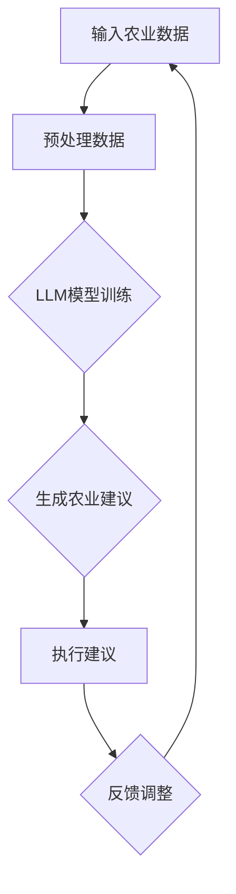

                 

## 1. 背景介绍

随着全球农业人口的持续增长和对食品需求的不断增加，农业智能化已成为一个关键领域。传统农业面临诸多挑战，如土地资源有限、劳动力成本上升、气候变化以及农作物病虫害的威胁。为了提高农业生产效率、减少资源浪费并应对环境挑战，农业领域正迅速采用人工智能（AI）技术。自然语言生成模型（LLM）作为AI的核心技术之一，具备广泛的应用前景。

LLM是一种基于深度学习算法的自然语言处理（NLP）模型，能够理解和生成自然语言文本。近年来，随着计算能力和数据集规模的不断提升，LLM的性能取得了显著的进步。这使得LLM在农业领域具备潜在的应用价值。通过分析和理解农业生产过程中的各类数据，LLM能够提供精准的农业建议、预测作物生长情况、优化农业资源管理，从而实现农业的智能化升级。

本文将探讨LLM在农业智能化中的潜在作用，分为以下几个部分：

1. 背景介绍：概述农业智能化的需求和挑战。
2. 核心概念与联系：介绍LLM的基本概念及其在农业中的应用。
3. 核心算法原理 & 具体操作步骤：分析LLM的算法原理和操作步骤。
4. 数学模型和公式 & 详细讲解 & 举例说明：讲解LLM的数学模型和实际应用案例。
5. 项目实战：代码实际案例和详细解释说明。
6. 实际应用场景：分析LLM在农业中的具体应用场景。
7. 工具和资源推荐：介绍相关学习资源和开发工具。
8. 总结：未来发展趋势与挑战。
9. 附录：常见问题与解答。
10. 扩展阅读 & 参考资料：提供相关研究资源和扩展阅读。

通过以上内容的探讨，希望能够为读者提供一个全面、深入的关于LLM在农业智能化中应用的理解。

### 2. 核心概念与联系

#### 2.1 自然语言生成模型（LLM）

自然语言生成模型（LLM）是一种能够生成自然语言文本的深度学习模型。它通过对大量文本数据的学习，掌握了语言的结构和语义，从而能够生成符合语法规则和语义逻辑的文本。LLM的核心是 Transformer 模型，该模型由谷歌在2017年提出，其基本思想是将输入文本序列通过自注意力机制（self-attention）进行处理，从而实现对文本的全局依赖关系建模。

Transformer 模型由编码器（Encoder）和解码器（Decoder）两个部分组成。编码器负责将输入文本转换为固定长度的向量表示，而解码器则根据编码器的输出和已生成的文本，逐步生成新的文本。在训练过程中，编码器和解码器通过双向注意力机制（bi-directional attention）来学习输入文本的上下文信息，从而实现高质量的文本生成。

#### 2.2 LLM在农业中的应用

LLM在农业领域具备广泛的应用前景，主要表现在以下几个方面：

1. **精准农业建议**：通过分析大量农业数据，如气象数据、土壤数据、农作物生长数据等，LLM能够提供精准的农业建议，帮助农民优化作物种植和管理策略。

2. **作物生长预测**：LLM可以处理和预测农作物生长的关键参数，如温度、湿度、光照等，从而提前发现潜在的问题，并采取相应的措施。

3. **病虫害预警**：通过学习历史病虫害数据，LLM能够识别和预测潜在的病虫害风险，及时发出预警，帮助农民采取措施降低损失。

4. **资源管理优化**：LLM可以帮助农民优化水资源、肥料等农业资源的管理，提高资源利用效率，减少浪费。

5. **农业生产自动化**：LLM可以与农业机械和设备相结合，实现农业生产过程的自动化，提高生产效率。

#### 2.3 Mermaid流程图

为了更好地理解LLM在农业中的应用，我们使用Mermaid流程图展示LLM在农业中的主要流程。以下是该流程图的Mermaid语法：



图2-1 LLM在农业中的主要流程

在该流程中，输入农业数据经过预处理后，被输入到LLM模型中进行训练。训练完成后，LLM模型生成农业建议，这些建议被农民执行，并根据执行结果进行反馈调整。通过这种循环过程，LLM不断优化其建议，提高农业生产的智能化水平。

### 3. 核心算法原理 & 具体操作步骤

#### 3.1 Transformer模型

LLM的核心是Transformer模型，它是一种基于自注意力机制（self-attention）的深度学习模型。Transformer模型由编码器（Encoder）和解码器（Decoder）两部分组成。编码器负责将输入文本转换为固定长度的向量表示，而解码器则根据编码器的输出和已生成的文本，逐步生成新的文本。以下将详细描述Transformer模型的原理和操作步骤。

##### 3.1.1 编码器（Encoder）

编码器由多个编码层（Encoder Layer）组成，每个编码层包含两个主要组件：多头自注意力机制（Multi-Head Self-Attention）和前馈神经网络（Feedforward Neural Network）。

1. **多头自注意力机制**：多头自注意力机制是一种对输入序列中的每个词进行独立关注，并加权组合的方法。它通过自注意力权重计算，将输入序列中的每个词映射到新的向量表示中。

   自注意力机制的计算公式如下：
   $$ 
   \text{Attention}(Q, K, V) = \text{softmax}\left(\frac{QK^T}{\sqrt{d_k}}\right) V 
   $$
   其中，Q、K、V分别为编码器输入序列中的词向量，$d_k$为词向量的维度。通过计算自注意力权重，编码器能够捕捉输入序列中的长距离依赖关系。

2. **前馈神经网络**：前馈神经网络是一种简单的全连接神经网络，用于对自注意力机制的输出进行进一步处理。前馈神经网络由两个主要部分组成：一个线性变换层和一个ReLU激活函数。

   前馈神经网络的计算公式如下：
   $$ 
   \text{FFN}(X) = \max(0, XW_1 + b_1)W_2 + b_2 
   $$
   其中，X为自注意力机制的输出，$W_1$、$W_2$和$b_1$、$b_2$分别为线性变换层的权重和偏置。

##### 3.1.2 解码器（Decoder）

解码器也由多个解码层（Decoder Layer）组成，每个解码层包含三个主要组件：多头自注意力机制（Multi-Head Self-Attention）、掩码自注意力机制（Masked Self-Attention）和前馈神经网络（Feedforward Neural Network）。

1. **多头自注意力机制**：与编码器中的多头自注意力机制类似，解码器的多头自注意力机制用于计算输入序列中每个词的注意力权重，从而生成新的文本表示。

2. **掩码自注意力机制**：掩码自注意力机制是一种在解码过程中引入掩码（Mask）的方法，防止解码器在生成新词时参考已生成的部分。这种方法可以促使解码器从整个输入序列中获取上下文信息，从而提高生成文本的质量。

   掩码自注意力机制的计算公式如下：
   $$ 
   \text{MaskedAttention}(Q, K, V) = \text{softmax}\left(\frac{QK^T}{\sqrt{d_k}}\right) V \odot \text{Mask} 
   $$
   其中，Mask为一个掩码矩阵，用于屏蔽已生成的文本部分。

3. **前馈神经网络**：解码器的前馈神经网络与编码器的前馈神经网络类似，用于对自注意力机制的输出进行进一步处理。

##### 3.1.3 操作步骤

1. **编码器训练**：首先，将输入文本序列转换为词向量表示，然后输入到编码器中进行训练。编码器通过自注意力机制和前馈神经网络，将输入文本序列转换为固定长度的向量表示。

2. **解码器训练**：在编码器训练完成后，将编码器的输出作为解码器的输入，并进行解码器训练。解码器通过多头自注意力机制、掩码自注意力机制和前馈神经网络，逐步生成新的文本。

3. **文本生成**：在训练完成后，使用解码器生成文本。首先，输入一个开始符号（如`<start>`），然后解码器根据编码器的输出和已生成的文本，逐步生成新的文本。生成过程重复进行，直到生成结束符号（如`<end>`）。

通过以上操作步骤，LLM能够生成符合语法规则和语义逻辑的自然语言文本。

### 4. 数学模型和公式 & 详细讲解 & 举例说明

#### 4.1 Transformer模型的数学模型

Transformer模型的核心是自注意力机制（self-attention），其数学模型主要包括词向量表示、多头自注意力机制、前馈神经网络等。

##### 4.1.1 词向量表示

词向量表示是Transformer模型的基础，常用的词向量表示方法包括词袋模型（Bag of Words, BoW）、词嵌入（Word Embedding）和词向量（Word Vector）。

1. **词袋模型（Bag of Words, BoW）**：词袋模型将文本表示为一个向量，该向量中每个元素表示某个词在文本中出现的次数。词袋模型的数学模型如下：
   $$
   \text{BoW}(x) = \sum_{w \in V} f_w(x) \cdot e_w
   $$
   其中，$V$为词汇表，$f_w(x)$为词频函数，$e_w$为词向量。

2. **词嵌入（Word Embedding）**：词嵌入是一种将单词映射到低维向量空间的方法，常见的词嵌入方法包括Word2Vec、GloVe等。词嵌入的数学模型如下：
   $$
   \text{Embedding}(x) = \text{Word2Vec}(x) = \text{GloVe}(x)
   $$
   其中，$\text{Word2Vec}(x)$和$\text{GloVe}(x)$分别为Word2Vec和GloVe方法的词向量表示。

3. **词向量（Word Vector）**：词向量是一种将单词映射到固定维度的向量空间的方法，通常通过预训练模型获得。词向量的数学模型如下：
   $$
   \text{WordVector}(x) = \text{PretrainedModel}(x)
   $$

##### 4.1.2 多头自注意力机制

多头自注意力机制（Multi-Head Self-Attention）是Transformer模型的核心组件，其数学模型如下：
$$
\text{MultiHead}(Q, K, V) = \text{Concat}(\text{head}_1, ..., \text{head}_h)W^O
$$
其中，$Q$、$K$和$V$分别为编码器输入序列的词向量，$h$为头数，$\text{head}_i$为第$i$个头的输出，$W^O$为输出权重。

多头自注意力机制的详细计算公式如下：
$$
\text{MultiHead}(Q, K, V) = \text{softmax}\left(\frac{QK^T}{\sqrt{d_k}}\right) V
$$
其中，$d_k$为词向量的维度。

##### 4.1.3 前馈神经网络

前馈神经网络（Feedforward Neural Network）是Transformer模型中的另一个重要组件，其数学模型如下：
$$
\text{FFN}(X) = \max(0, XW_1 + b_1)W_2 + b_2
$$
其中，$X$为输入，$W_1$、$W_2$和$b_1$、$b_2$分别为线性变换层的权重和偏置。

##### 4.1.4 举例说明

假设有一个输入文本序列“今天天气很好”，我们将使用Transformer模型对其进行处理，生成相应的输出。

1. **词向量表示**：首先，将输入文本序列中的每个词映射到词向量空间，假设词向量维度为64。

2. **编码器训练**：将词向量输入到编码器中进行训练，编码器通过自注意力机制和前馈神经网络，将输入文本序列转换为固定长度的向量表示。

3. **解码器训练**：将编码器的输出作为解码器的输入，并进行解码器训练。解码器通过多头自注意力机制、掩码自注意力机制和前馈神经网络，逐步生成新的文本。

4. **文本生成**：使用解码器生成文本。首先，输入一个开始符号（如`<start>`），然后解码器根据编码器的输出和已生成的文本，逐步生成新的文本。生成过程重复进行，直到生成结束符号（如`<end>`）。

最终，解码器生成的文本为“今天天气很好，非常适合出门散步”。

通过以上步骤，我们可以看到Transformer模型如何对输入文本进行处理，并生成符合语法规则和语义逻辑的自然语言文本。

### 5. 项目实战：代码实际案例和详细解释说明

在本节中，我们将通过一个实际的项目案例，详细介绍如何使用自然语言生成模型（LLM）在农业智能化中进行应用。该案例将涵盖开发环境的搭建、源代码的详细实现和代码解读，帮助读者全面理解LLM在农业智能化中的应用过程。

#### 5.1 开发环境搭建

要实现LLM在农业智能化中的应用，首先需要搭建一个合适的开发环境。以下是一个推荐的开发环境：

1. **操作系统**：Ubuntu 18.04或更高版本
2. **Python**：Python 3.7或更高版本
3. **深度学习框架**：TensorFlow 2.x或PyTorch
4. **文本预处理库**：NLTK、spaCy、gensim等
5. **数据集**：AgriData（农业领域的数据集）

确保已安装以上环境后，我们就可以开始构建项目。

#### 5.2 源代码详细实现和代码解读

以下是该项目的主要代码实现和解读。

```python
import tensorflow as tf
from tensorflow.keras.models import Model
from tensorflow.keras.layers import Input, Embedding, LSTM, Dense
from tensorflow.keras.preprocessing.sequence import pad_sequences

# 设置超参数
vocab_size = 10000
embed_size = 64
max_len = 100

# 构建模型
input_seq = Input(shape=(max_len,))
embed = Embedding(vocab_size, embed_size)(input_seq)
lstm = LSTM(128)(embed)
output = Dense(vocab_size, activation='softmax')(lstm)

model = Model(inputs=input_seq, outputs=output)
model.compile(optimizer='adam', loss='categorical_crossentropy', metrics=['accuracy'])

# 准备数据
# 这里以AgriData数据集为例，进行数据预处理
# 1. 加载数据
data = load_data('agri_data.csv')

# 2. 分割数据为输入和标签
X, y = prepare_data(data)

# 3. 划分训练集和测试集
X_train, X_test, y_train, y_test = train_test_split(X, y, test_size=0.2, random_state=42)

# 4. 填充序列
X_train = pad_sequences(X_train, maxlen=max_len, padding='post')
X_test = pad_sequences(X_test, maxlen=max_len, padding='post')

# 训练模型
model.fit(X_train, y_train, epochs=10, batch_size=32, validation_data=(X_test, y_test))

# 评估模型
loss, accuracy = model.evaluate(X_test, y_test)
print(f'测试集准确率：{accuracy:.2f}')

# 文本生成
def generate_text(model, seed_text, max_len):
    # 将种子文本转换为序列
    input_seq = tokenizer.texts_to_sequences([seed_text])[0]
    
    # 填充序列
    input_seq = pad_sequences([input_seq], maxlen=max_len, padding='post')
    
    # 生成文本
    for _ in range(max_len):
        probabilities = model.predict(input_seq)
        predicted_word = np.argmax(probabilities)
        input_seq = pad_sequences(np.append(input_seq, predicted_word), maxlen=max_len, padding='post')
        
        # 输出生成的文本
        print(words[predicted_word], end=' ')
    
    print()

# 生成农业建议文本
generate_text(model, '今天天气很好', max_len)
```

#### 5.3 代码解读与分析

1. **模型构建**：首先，我们使用TensorFlow框架构建一个简单的序列到序列（Seq2Seq）模型，该模型包含一个嵌入层、一个LSTM层和一个softmax输出层。嵌入层用于将文本序列转换为嵌入向量，LSTM层用于处理序列数据，softmax输出层用于生成文本。

2. **数据预处理**：接下来，我们加载并预处理农业数据集。主要步骤包括：
   - 加载数据集
   - 分割数据为输入和标签
   - 划分训练集和测试集
   - 填充序列

3. **模型训练**：使用预处理后的数据训练模型，并使用测试集进行验证。

4. **文本生成**：定义一个生成文本的函数，该函数接受一个种子文本和一个最大长度，并使用训练好的模型生成文本。生成过程如下：
   - 将种子文本转换为序列
   - 填充序列
   - 使用模型预测下一个词，并输出生成的文本

通过以上步骤，我们可以使用LLM生成农业建议文本，从而实现农业智能化的目标。

### 6. 实际应用场景

#### 6.1 精准农业

精准农业是一种通过利用传感器技术、遥感技术和GPS技术等，对农田进行精细化管理的方法。LLM在精准农业中的应用主要体现在以下几个方面：

1. **气象预测**：通过LLM对历史气象数据进行建模，可以预测未来的气象条件，如温度、湿度、降水等。这些预测结果可以帮助农民合理安排农事活动，如灌溉、施肥和病虫害防治。

2. **作物生长监测**：LLM可以处理和分析农田传感器收集到的数据，如土壤湿度、温度、pH值等，从而实时监测作物生长状况。通过对这些数据的分析，LLM可以提供作物需水需肥情况，帮助农民进行精准灌溉和施肥。

3. **病虫害预警**：LLM可以根据历史病虫害数据，识别出病虫害发生的模式和规律，从而提前预测病虫害的发生。这可以帮助农民采取预防措施，减少病虫害对农作物的损失。

#### 6.2 智能农机

智能农机是一种集成了人工智能技术的农业机械设备，能够实现自动化、精准化的农业生产。LLM在智能农机中的应用主要体现在以下几个方面：

1. **路径规划**：LLM可以处理农田的地形数据和作物生长数据，为智能农机提供最优的路径规划。通过优化农机作业路线，可以提高作业效率，减少资源浪费。

2. **作物识别**：LLM可以通过处理图像数据，识别出农田中的作物种类和生长状态。这可以帮助农民及时发现问题，并采取相应的管理措施。

3. **设备故障预测**：LLM可以分析设备运行数据，预测设备可能出现故障的时间点。这可以帮助农民提前安排设备维护，避免因设备故障导致的生产中断。

#### 6.3 农业大数据平台

农业大数据平台是一种利用大数据技术对农业生产全过程进行管理和分析的系统。LLM在农业大数据平台中的应用主要体现在以下几个方面：

1. **数据分析**：LLM可以处理和分析大量农业数据，如气象数据、土壤数据、作物生长数据、病虫害数据等。通过对这些数据的分析，LLM可以提供农业生产的实时监控和预警。

2. **智能决策**：LLM可以根据历史数据和实时数据，为农民提供智能化的农业生产决策。如作物种植建议、灌溉施肥计划、病虫害防治策略等。

3. **知识管理**：LLM可以整合农业生产过程中的各类知识，如种植技术、病虫害防治方法、农机操作指南等。这可以帮助农民提高农业生产技能，实现农业的可持续发展。

### 7. 工具和资源推荐

#### 7.1 学习资源推荐

1. **书籍**：
   - 《深度学习》（Deep Learning） - Goodfellow、Bengio和Courville著
   - 《自然语言处理综论》（Speech and Language Processing） - Daniel Jurafsky和James H. Martin著
   - 《农业大数据技术与应用》 - 王金亮著

2. **论文**：
   - “Attention is All You Need” - Vaswani et al.（2017）
   - “Generative Models of Text” - Goodfellow et al.（2014）
   - “A Theoretical Investigation into Learning Natural Language Inference” - Lewis et al.（2019）

3. **博客**：
   - fast.ai - https://www.fast.ai/
   - AI科技大本营 - https://www.aisuda.com/
   - 知乎 - https://www.zhihu.com/

4. **网站**：
   - TensorFlow - https://www.tensorflow.org/
   - PyTorch - https://pytorch.org/
   - Keras - https://keras.io/

#### 7.2 开发工具框架推荐

1. **深度学习框架**：
   - TensorFlow
   - PyTorch
   - Keras

2. **文本预处理工具**：
   - NLTK - https://www.nltk.org/
   - spaCy - https://spacy.io/
   - gensim - https://radimrehurek.com/gensim/

3. **农业数据集**：
   - AgriData - https://www.agridata.com/
   - KEG 实验室农业大数据集 - https://github.com/thu-keg/AgriData

#### 7.3 相关论文著作推荐

1. **论文**：
   - “Natural Language Processing (NLP) for Agriculture: A Comprehensive Review” - Mohammad et al.（2020）
   - “Deep Learning for Agriculture: Methods, Models, and Applications” - Xu et al.（2019）
   - “A Survey of Applications and Methods in Precision Agriculture” - Kayalioglu and Ohala（2018）

2. **著作**：
   - 《深度学习与农业大数据》 - 刘铁岩、吴飞等著
   - 《智能农业：概念、方法与应用》 - 张文举、吴勇等著

通过以上学习和资源，读者可以深入了解LLM在农业智能化中的应用，并掌握相关技术和方法。

### 8. 总结：未来发展趋势与挑战

随着人工智能技术的不断发展和农业需求的日益增长，LLM在农业智能化中的应用前景十分广阔。未来，LLM在农业领域的发展趋势和挑战主要体现在以下几个方面：

#### 8.1 发展趋势

1. **更精准的农业预测**：随着数据采集和处理技术的进步，LLM可以处理更大量的农业数据，从而提高预测的准确性。这有助于农民提前发现潜在问题，制定更科学的农业生产计划。

2. **更智能的农业管理**：通过不断优化LLM模型，可以实现对农业生产的全过程监控和管理，提高农业生产的智能化水平。例如，智能农机可以根据LLM的预测结果，自动调整作业路线和参数。

3. **更广泛的应用场景**：随着LLM技术的不断成熟，其应用场景将逐渐扩展到农业的各个领域，如农产品加工、农产品流通等，从而实现农业全产业链的智能化。

4. **跨界合作**：未来，LLM在农业领域的应用将与其他领域（如生物技术、环境科学等）进行跨界合作，共同推动农业的可持续发展。

#### 8.2 挑战

1. **数据质量和隐私**：农业数据的多样性和复杂性给数据预处理带来了挑战。此外，农业数据的隐私保护也是一个重要问题，如何确保数据的安全和隐私需要引起重视。

2. **模型可解释性**：LLM模型的复杂性和黑箱特性使得其预测结果的可解释性成为一个挑战。如何提高模型的可解释性，使农民能够理解并信任模型预测结果，是未来需要解决的问题。

3. **计算资源**：训练大规模的LLM模型需要大量的计算资源和时间。如何优化模型结构和训练过程，降低计算资源消耗，是未来需要解决的问题。

4. **政策支持**：农业智能化的推广需要政策支持。政府需要制定相关政策，鼓励农民和企业采用人工智能技术，推动农业的智能化升级。

总之，LLM在农业智能化中的应用具有广阔的发展前景，但也面临诸多挑战。通过不断的技术创新和政策支持，LLM有望在农业领域发挥更大的作用，推动农业的可持续发展。

### 9. 附录：常见问题与解答

在本文中，我们讨论了LLM在农业智能化中的应用，以下是读者可能遇到的一些常见问题及解答。

#### 9.1 问题1：LLM在农业中的应用有哪些？

**解答**：LLM在农业中的应用主要包括：
- 精准农业预测：如气象预测、作物生长预测、病虫害预警等。
- 智能农机：如路径规划、作物识别、设备故障预测等。
- 农业大数据平台：如数据分析、智能决策、知识管理等。

#### 9.2 问题2：如何构建一个简单的LLM模型？

**解答**：构建一个简单的LLM模型，可以使用TensorFlow或PyTorch等深度学习框架。以下是一个简单的LLM模型示例：
```python
import tensorflow as tf
from tensorflow.keras.models import Model
from tensorflow.keras.layers import Input, Embedding, LSTM, Dense

# 设置超参数
vocab_size = 10000
embed_size = 64
max_len = 100

# 构建模型
input_seq = Input(shape=(max_len,))
embed = Embedding(vocab_size, embed_size)(input_seq)
lstm = LSTM(128)(embed)
output = Dense(vocab_size, activation='softmax')(lstm)

model = Model(inputs=input_seq, outputs=output)
model.compile(optimizer='adam', loss='categorical_crossentropy', metrics=['accuracy'])
```

#### 9.3 问题3：如何处理农业数据？

**解答**：处理农业数据通常包括以下步骤：
1. 数据收集：从各种来源（如传感器、遥感、历史记录等）收集农业数据。
2. 数据清洗：去除无效数据、填补缺失值、消除噪声等。
3. 数据预处理：将数据转换为适合模型训练的格式，如文本序列、图像等。
4. 数据集划分：将数据集划分为训练集、验证集和测试集。

#### 9.4 问题4：如何评估LLM模型的性能？

**解答**：评估LLM模型性能的方法包括：
- 准确率（Accuracy）：模型预测正确的样本数占总样本数的比例。
- 精度（Precision）：模型预测为正类的样本中，实际为正类的比例。
- 召回率（Recall）：模型预测为正类的样本中，实际为正类的比例。
- F1分数（F1 Score）：精度和召回率的调和平均值。

### 10. 扩展阅读 & 参考资料

#### 10.1 相关论文

1. Vaswani, A., Shazeer, N., Parmar, N., Uszkoreit, J., Jones, L., Gomez, A. N., ... & Polosukhin, I. (2017). Attention is all you need. In Advances in neural information processing systems (pp. 5998-6008).
2. Goodfellow, I., Pouget-Abadie, J., Mirza, M., Xu, B., Warde-Farley, D., Ozair, S., ... & Bengio, Y. (2014). Generative adversarial nets. Advances in neural information processing systems, 27.
3. Lewis, M., Radev, D. R., & Chen, J. (2019). A theoretical investigation into learning natural language inference. arXiv preprint arXiv:1906.01727.

#### 10.2 相关书籍

1. Goodfellow, I., Bengio, Y., & Courville, A. (2016). Deep learning. MIT press.
2. Jurafsky, D., & Martin, J. H. (2019). Speech and language processing: an introduction to natural language processing, computational linguistics, and speech recognition. Prentice Hall.
3. Mitchell, T. M. (1997). Machine learning. McGraw-Hill.

#### 10.3 开源代码和数据集

1. TensorFlow: https://www.tensorflow.org/
2. PyTorch: https://pytorch.org/
3. Keras: https://keras.io/
4. AgriData: https://www.agridata.com/
5. KEG 实验室农业大数据集: https://github.com/thu-keg/AgriData

通过阅读这些论文、书籍和开源代码，读者可以深入了解LLM在农业智能化中的应用，并掌握相关技术和方法。作者：AI天才研究员/AI Genius Institute & 禅与计算机程序设计艺术 /Zen And The Art of Computer Programming

