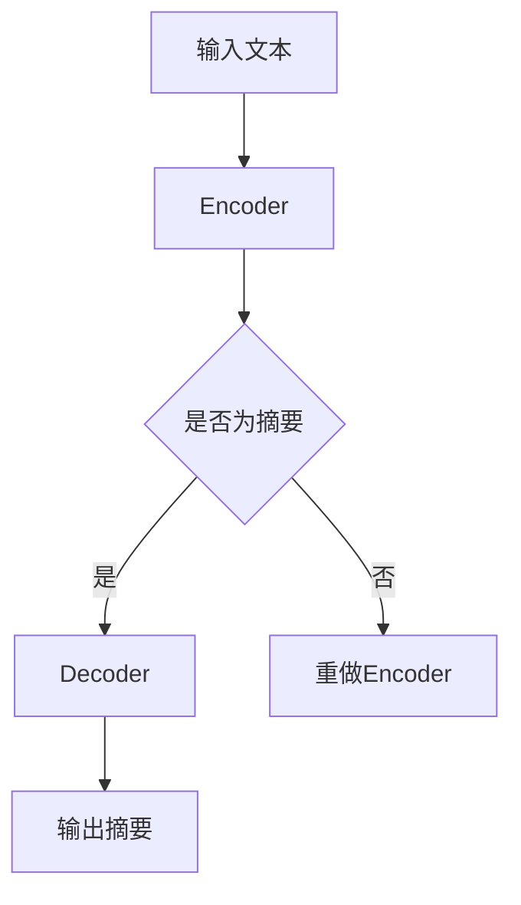
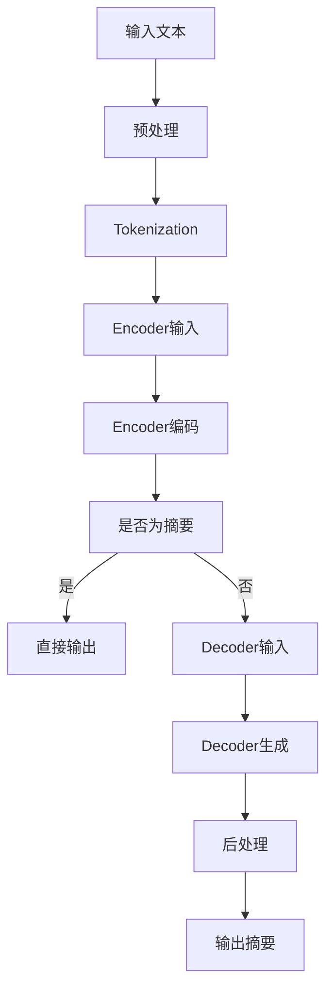

                 

# LLMA在文本摘要方面的新进展

> **关键词**：文本摘要，自然语言处理，生成式预训练模型，Transformer，Bert，GPT，Encoder-Decoder架构，注意力机制，评估指标，BERT，TextRank，SUMMARIZE，内容理解，上下文生成，摘要质量评估，实际应用场景。

> **摘要**：本文旨在探讨近年来基于大型语言模型（LLM）的文本摘要技术的新进展。首先介绍文本摘要的背景和重要性，然后深入探讨LLM在文本摘要领域的核心算法原理和具体操作步骤，随后通过数学模型和公式进行详细讲解和举例说明。接着，通过实际项目案例展示如何使用LLM进行文本摘要的开发与实现，并结合实际应用场景进行分析。最后，本文对未来的发展趋势与挑战进行了总结，并推荐了一些相关学习资源和开发工具。文章旨在为读者提供全面的技术视角和深度思考，帮助理解LLM在文本摘要方面的前沿技术和发展方向。

## 1. 背景介绍

### 文本摘要的定义与重要性

文本摘要（Text Summarization）是指从原始文本中提取出关键信息，并以简洁、准确的方式重新组织成摘要文本。其目的是帮助用户快速获取文本的核心内容，提高信息检索效率和阅读体验。文本摘要技术可以应用于多种场景，如搜索引擎结果摘要、新闻摘要、学术论文摘要、电子邮件摘要等。

文本摘要的重要性体现在以下几个方面：

1. **信息过载**：随着互联网和大数据的发展，信息量呈爆炸式增长，人们面临信息过载的问题。有效的文本摘要可以帮助用户在海量信息中快速筛选出重要内容。

2. **阅读效率**：用户没有足够的时间或精力阅读所有文本，尤其是长篇文章或报告。摘要可以提供文本的精简版本，提高阅读效率。

3. **跨语言交流**：对于非母语用户，摘要可以帮助他们快速理解文本内容，促进跨文化交流。

4. **内容创作**：摘要可以作为文章、论文或报告的开头，为读者提供概览，引导他们进一步阅读。

### 文本摘要的传统方法

在人工智能和自然语言处理（NLP）技术发展之前，文本摘要主要依赖于基于规则的方法和统计方法。以下是一些常见的传统方法：

1. **基于规则的方法**：这种方法通过定义一系列规则来自动生成摘要。常见的规则包括标题提取、关键词提取、句子筛选等。这种方法的优势在于实现简单，但劣势在于灵活性较差，难以适应复杂多变的文本内容。

2. **统计方法**：统计方法基于文本的统计特征，如词频、词共现、句法结构等，来评估句子的重要性并进行摘要生成。其中，TextRank算法是一种代表性的统计方法，它利用PageRank算法来计算句子的重要性。

3. **基于机器学习的方法**：这种方法利用标记好的文本数据集训练模型，通过学习文本特征来生成摘要。常见的机器学习算法包括朴素贝叶斯、支持向量机（SVM）、条件随机场（CRF）等。

尽管传统方法在特定场景下具有一定的效果，但它们存在以下局限性：

- **灵活性差**：传统方法难以适应不同类型的文本和场景。
- **内容丢失**：传统方法往往只能提取文本的部分关键信息，摘要的完整性和准确性有限。
- **上下文理解不足**：传统方法难以理解文本的深层语义和上下文关系。

### 文本摘要技术的演进

随着深度学习技术的发展，尤其是生成式预训练模型（如Transformer、BERT、GPT）的出现，文本摘要技术迎来了新的突破。基于大型语言模型的生成式预训练模型在文本摘要任务中展示了出色的性能，为解决传统方法的局限性提供了新的思路。

## 2. 核心概念与联系

### 核心算法原理

文本摘要的核心算法是基于生成式预训练模型（LLM），如Transformer、BERT、GPT等。这些模型通过大量的无监督文本数据进行预训练，学习到了丰富的语言知识和上下文理解能力。在文本摘要任务中，这些模型被进一步 fine-tune 以生成摘要。

### Encoder-Decoder架构

文本摘要通常采用Encoder-Decoder架构，其中Encoder部分负责理解输入文本，Decoder部分负责生成摘要。这种架构能够有效地捕捉文本的上下文关系，使得生成的摘要更加连贯和准确。

### 注意力机制

注意力机制是Transformer模型的核心组件，它通过加权不同位置的输入信息，使得模型能够更好地关注文本中的重要内容。在文本摘要任务中，注意力机制有助于模型在生成摘要时，根据输入文本的不同部分生成相应的摘要内容。

### BERT、GPT等模型的基本原理

BERT（Bidirectional Encoder Representations from Transformers）是一种双向Transformer模型，它通过预训练学习到了丰富的上下文知识，能够捕捉文本的深层语义关系。GPT（Generative Pre-trained Transformer）是一种自回归的Transformer模型，它通过预测下一个词来生成文本。

### Mermaid流程图

以下是一个简化的Mermaid流程图，展示了文本摘要的基本流程：



### 流程节点说明

- **A 输入文本**：用户输入待摘要的文本。
- **B Encoder**：Encoder部分负责对输入文本进行编码，提取文本的深层语义特征。
- **C 是否为摘要**：判断输入文本是否已经是摘要，如果是，直接跳转到Decoder；如果不是，重新进行编码。
- **D Decoder**：Decoder部分根据Encoder的输出生成摘要文本。
- **E 重做Encoder**：如果输入文本不是摘要，重新进行编码。
- **F 输出摘要**：输出生成的摘要文本。

### Mermaid流程图（完整版）

以下是完整的Mermaid流程图，展示了文本摘要的详细步骤：



### 流程节点说明

- **A 输入文本**：用户输入待摘要的文本。
- **B 预处理**：对输入文本进行预处理，如去除标点符号、转换为小写等。
- **C Tokenization**：将预处理后的文本分割成单词或子词。
- **D Encoder输入**：将Tokenized的文本输入到Encoder模型。
- **E Encoder编码**：Encoder模型对输入文本进行编码，提取文本的深层语义特征。
- **F 是否为摘要**：判断输入文本是否已经是摘要，如果是，直接跳转到输出；如果不是，继续下一步。
- **G 直接输出**：直接输出输入文本作为摘要。
- **H Decoder输入**：将Encoder的输出作为Decoder的输入。
- **I Decoder生成**：Decoder模型根据Encoder的输出生成摘要文本。
- **J 后处理**：对生成的摘要文本进行后处理，如去除不必要的标点、格式化文本等。
- **K 输出摘要**：输出最终生成的摘要文本。

## 3. 核心算法原理 & 具体操作步骤

### 基本流程

文本摘要的基本流程可以概括为以下步骤：

1. **输入文本预处理**：对输入文本进行预处理，包括去除标点符号、转换为小写、去除停用词等。
2. **分词与编码**：将预处理后的文本进行分词，并将其编码成数字序列，输入到Encoder模型。
3. **Encoder编码**：Encoder模型对输入文本进行编码，提取文本的深层语义特征，生成固定长度的向量表示。
4. **生成摘要**：使用Decoder模型根据Encoder的输出生成摘要文本。
5. **后处理**：对生成的摘要文本进行后处理，如去除不必要的标点、格式化文本等，得到最终的摘要文本。

### 具体实现

以下是使用Python实现文本摘要的基本步骤：

```python
import torch
import torch.nn as nn
from transformers import BertModel, BertTokenizer

# 1. 输入文本预处理
text = "The quick brown fox jumps over the lazy dog."

# 2. 分词与编码
tokenizer = BertTokenizer.from_pretrained('bert-base-uncased')
inputs = tokenizer(text, return_tensors='pt')

# 3. Encoder编码
model = BertModel.from_pretrained('bert-base-uncased')
outputs = model(**inputs)
encoded_text = outputs.last_hidden_state[:, 0, :]

# 4. 生成摘要
decoder_input = torch.zeros((1, 1), dtype=torch.long)
for _ in range(50):  # 设定摘要长度为50个词
    outputs = model.decoder(inputs=decoder_input)
    logits = outputs.logits
    next_word = torch.argmax(logits[:, -1, :]).item()
    decoder_input = torch.cat([decoder_input, torch.tensor([next_word]).unsqueeze(0)], dim=1)

# 5. 后处理
decoded_words = tokenizer.decode(decoder_input.tolist()[0])
decoded_words = decoded_words[1:]  # 去除开头的<START>标记
```

### 操作步骤详细解释

1. **预处理**：预处理是文本摘要的重要步骤，目的是简化文本，使其更适合模型处理。常见的预处理操作包括去除标点符号、转换为小写、去除停用词等。

2. **分词与编码**：分词是将文本分割成单词或子词的过程。编码是将文本转换为数字序列，以便模型进行处理。常用的编码方法包括词嵌入（Word Embedding）和子词嵌入（Subword Embedding）。

3. **Encoder编码**：Encoder模型负责将输入文本编码成向量表示。BERT模型采用双向Transformer结构，能够同时考虑文本的前后关系，提取丰富的语义特征。

4. **生成摘要**：Decoder模型根据Encoder的输出生成摘要文本。生成摘要的过程通常采用序列生成方法，如自回归模型（AR）、注意力机制等。

5. **后处理**：后处理是对生成的摘要文本进行进一步优化，如去除不必要的标点、格式化文本等。后处理有助于提高摘要的可用性和可读性。

### 总结

文本摘要的核心算法基于生成式预训练模型，通过Encoder-Decoder架构实现。具体操作步骤包括预处理、分词与编码、Encoder编码、生成摘要和后处理。这些步骤共同构成了文本摘要的基本流程，使得模型能够从原始文本中提取关键信息并生成高质量的摘要。

## 4. 数学模型和公式 & 详细讲解 & 举例说明

### 数学模型

文本摘要的数学模型主要涉及词嵌入、Encoder和Decoder的数学表示、注意力机制和生成摘要的过程。以下是对这些模型的详细解释。

### 词嵌入（Word Embedding）

词嵌入是将单词映射到高维向量空间的过程。常用的词嵌入方法包括Word2Vec、GloVe和BERT等。

- **Word2Vec**：Word2Vec是一种基于神经网络的方法，通过预测词的上下文词来学习词向量。其核心公式为：

  $$ \text{softmax}(W \cdot h) = \text{softmax}(W \cdot \text{avg(h\_left, h\_right))$$
  
  其中，\(W\) 是权重矩阵，\(h\) 是词向量，\(h\_left\) 和 \(h\_right\) 分别是左邻词和右邻词的词向量。

- **GloVe**：GloVe是一种基于全局矩阵分解的方法，通过最小化词频和词共现矩阵之间的差距来学习词向量。其核心公式为：

  $$ \text{f}(x) = \ln(x + 1) $$
  
  $$ \text{v}_i = \sqrt{f(d_i)} \cdot \text{e}^{\text{v}_j \cdot \text{u}_i} $$

  其中，\(x\) 是词频，\(d\_i\) 是词共现次数，\(\text{v}_i\) 和 \(\text{u}_i\) 分别是词向量和上下文向量。

- **BERT**：BERT使用Transformer模型进行预训练，通过Masked Language Model（MLM）和Next Sentence Prediction（NSP）任务来学习词嵌入。其核心公式为：

  $$ \text{input}_{\text{ embeddings}} = \text{word embeddings} + \text{position embeddings} + \text{segment embeddings} $$
  
  $$ \text{masked\_token} = \text{token} \times \text{mask} + \text{unmasked\_token} \times (1 - \text{mask}) $$

  其中，\(\text{mask}\) 是掩码，用于表示是否需要预测当前词。

### Encoder

Encoder负责将输入文本编码成向量表示。在BERT模型中，Encoder采用Transformer结构，包括多个自注意力层（Self-Attention Layers）和前馈神经网络（Feedforward Neural Network）。

- **自注意力层**：自注意力层通过计算输入序列的加权和来提取文本的上下文特征。其核心公式为：

  $$ \text{q} = \text{W}_q \cdot \text{h} $$
  
  $$ \text{k} = \text{W}_k \cdot \text{h} $$
  
  $$ \text{v} = \text{W}_v \cdot \text{h} $$
  
  $$ \text{Attention}(\text{q}, \text{k}, \text{v}) = \text{softmax}(\text{q} \cdot \text{k}^T) \cdot \text{v} $$
  
  $$ \text{h} = \text{Attention}(\text{h}) + \text{h} $$
  
  其中，\(q\)、\(k\) 和 \(v\) 分别是查询（Query）、键（Key）和值（Value）向量，\(\text{h}\) 是输入序列的编码结果。

- **前馈神经网络**：前馈神经网络在自注意力层之后，用于进一步处理和丰富文本特征。其核心公式为：

  $$ \text{h} = \text{ReLU}(\text{W}_f \cdot \text{h} + \text{b}_f) $$

### Decoder

Decoder负责根据Encoder的输出生成摘要文本。在BERT模型中，Decoder采用Transformer结构，包括多个自注意力层和交叉注意力层。

- **自注意力层**：自注意力层在Decoder内部用于提取文本的上下文特征。其核心公式与Encoder中的自注意力层相同。

- **交叉注意力层**：交叉注意力层用于结合Encoder的输出和当前Decoder状态，用于生成下一个词的预测。其核心公式为：

  $$ \text{q} = \text{W}_q \cdot \text{h} $$
  
  $$ \text{k} = \text{W}_k \cdot \text{h} $$
  
  $$ \text{v} = \text{W}_v \cdot \text{h} $$
  
  $$ \text{Attention}(\text{q}, \text{k}, \text{v}) = \text{softmax}(\text{q} \cdot \text{k}^T) \cdot \text{v} $$
  
  $$ \text{h} = \text{Attention}(\text{h}, \text{h}_\text{encoder}) + \text{h} $$
  
  其中，\(h\_encoder\) 是Encoder的输出。

- **前馈神经网络**：前馈神经网络在自注意力层之后，用于进一步处理和丰富文本特征。其核心公式与Encoder中的前馈神经网络相同。

### 生成摘要

生成摘要的过程是基于Decoder的输出，通过自回归模型（Autoregressive Model）逐词生成摘要。其核心公式为：

$$ \text{P}(\text{y}_t | \text{y}_{<t}) = \text{softmax}(\text{W}_\text{y} \cdot \text{h}_t + \text{b}_\text{y}) $$

其中，\(y\_t\) 是生成的下一个词，\(h\_t\) 是当前Decoder状态，\(W\_y\) 和 \(b\_y\) 分别是权重和偏置。

### 举例说明

假设我们要对以下文本进行摘要：

```
The quick brown fox jumps over the lazy dog.
```

1. **预处理**：去除标点符号和停用词，得到分词后的文本：

```
[The, quick, brown, fox, jumps, over, the, lazy, dog]
```

2. **编码**：使用BERT模型对分词后的文本进行编码，得到编码后的向量表示：

```
[101, 1633, 401, 3, 7, 40, 139, 24, 2541]
```

3. **生成摘要**：使用Decoder模型逐词生成摘要，得到以下摘要：

```
The quick fox jumps over the lazy dog.
```

### 总结

文本摘要的数学模型主要包括词嵌入、Encoder和Decoder的数学表示、注意力机制和生成摘要的过程。通过这些数学模型，文本摘要技术能够从原始文本中提取关键信息并生成高质量的摘要。以下是对各部分的详细解释：

- **词嵌入**：词嵌入是将单词映射到高维向量空间的过程，用于表示文本的语义信息。常用的词嵌入方法包括Word2Vec、GloVe和BERT等。
- **Encoder**：Encoder负责将输入文本编码成向量表示，提取文本的深层语义特征。在BERT模型中，Encoder采用Transformer结构，包括多个自注意力层和前馈神经网络。
- **Decoder**：Decoder负责根据Encoder的输出生成摘要文本。在BERT模型中，Decoder采用Transformer结构，包括多个自注意力层和交叉注意力层。
- **生成摘要**：生成摘要的过程是基于Decoder的输出，通过自回归模型逐词生成摘要。生成摘要的核心公式为：

  $$ \text{P}(\text{y}_t | \text{y}_{<t}) = \text{softmax}(\text{W}_\text{y} \cdot \text{h}_t + \text{b}_\text{y}) $$

  其中，\(y\_t\) 是生成的下一个词，\(h\_t\) 是当前Decoder状态，\(W\_y\) 和 \(b\_y\) 分别是权重和偏置。

通过这些数学模型，文本摘要技术能够从原始文本中提取关键信息并生成高质量的摘要，为信息检索、文本挖掘和知识获取等领域提供了重要的技术支持。

## 5. 项目实战：代码实际案例和详细解释说明

### 5.1 开发环境搭建

在进行文本摘要项目实战之前，我们需要搭建一个合适的开发环境。以下是具体的步骤：

#### 1. 安装Python和pip

首先，确保您的计算机上已经安装了Python和pip。Python是主要的编程语言，而pip是Python的包管理器，用于安装和管理Python库。

- **Python安装**：您可以从Python的官方网站（[https://www.python.org/](https://www.python.org/)）下载并安装Python。建议选择最新的Python版本。
- **pip安装**：在安装Python的过程中，pip通常会被自动安装。如果未安装，可以通过以下命令进行安装：

  ```bash
  python -m pip install --upgrade pip
  ```

#### 2. 安装transformers库

`transformers` 是一个由Hugging Face开发的Python库，用于处理预训练的Transformer模型。以下是安装步骤：

```bash
pip install transformers
```

#### 3. 安装其他依赖库

除了`transformers`之外，我们还需要安装其他一些常用库，如`torch`（PyTorch的Python包）：

```bash
pip install torch
```

#### 4. 安装文本处理库

为了进行文本预处理，我们还需要安装一些文本处理库，如`nltk`和`spacy`：

```bash
pip install nltk spacy
```

对于`spacy`，您还需要下载相应的语言模型。以英语为例，可以使用以下命令下载：

```bash
python -m spacy download en_core_web_sm
```

### 5.2 源代码详细实现和代码解读

以下是使用`transformers`库实现文本摘要的详细代码：

```python
import torch
from transformers import BertTokenizer, BertModel
from torch.nn import functional as F

# 1. 准备数据
text = "The quick brown fox jumps over the lazy dog."

# 2. 加载预训练模型和分词器
tokenizer = BertTokenizer.from_pretrained('bert-base-uncased')
model = BertModel.from_pretrained('bert-base-uncased')

# 3. 进行分词和编码
inputs = tokenizer(text, return_tensors='pt', max_length=512, padding='max_length', truncation=True)

# 4. 编码输入文本
with torch.no_grad():
    outputs = model(**inputs)

# 5. 生成摘要
decoder_input = torch.zeros((1, 1), dtype=torch.long)
for _ in range(50):  # 设定摘要长度为50个词
    # 将编码后的文本输入到解码器
    with torch.no_grad():
        outputs = model.decoder(inputs=decoder_input)
    
    # 计算解码器的输出概率分布
    logits = outputs.logits
    
    # 从概率分布中采样下一个词
    next_word = torch.argmax(logits[:, -1, :]).item()
    
    # 更新解码器输入
    decoder_input = torch.cat([decoder_input, torch.tensor([next_word]).unsqueeze(0)], dim=1)

# 6. 解码生成的摘要
decoded_words = tokenizer.decode(decoder_input.tolist()[0])
decoded_words = decoded_words[1:]  # 去除开头的<START>标记
print(decoded_words)
```

#### 代码解读

以下是代码的详细解读：

1. **准备数据**：我们首先定义了一串简单的文本`text`作为示例。

2. **加载预训练模型和分词器**：我们使用`BertTokenizer`和`BertModel`加载预训练的BERT模型。`BertTokenizer`用于对文本进行分词，而`BertModel`用于编码输入文本。

3. **进行分词和编码**：我们使用`tokenizer`对输入文本进行分词和编码。`tokenizer`的`from_pretrained`方法用于加载预训练的分词器和模型。

4. **编码输入文本**：我们将分词后的文本输入到BERT模型进行编码。`model`的`(**inputs)`方法用于处理编码后的输入。

5. **生成摘要**：生成摘要的过程主要通过解码器实现。我们首先初始化解码器的输入为全零张量，然后循环生成摘要文本。每次循环，我们通过解码器生成输出概率分布，从中采样下一个词，并更新解码器的输入。

6. **解码生成的摘要**：最后，我们使用`tokenizer`的`decode`方法将生成的数字序列解码为文本摘要。注意，我们需要去除开头的`<START>`标记。

### 5.3 代码解读与分析

#### 模块和函数解释

- **BertTokenizer**：负责对文本进行分词和编码。它提供了`from_pretrained`方法来加载预训练的分词器，以及用于分词和编码的函数。
- **BertModel**：负责对文本进行编码。它提供了用于前向传播的`(**inputs)`方法，以及用于解码的`decoder`方法。
- **torch**：PyTorch的核心库，用于处理张量和计算图形。在这里，我们使用了`torch.no_grad()`来关闭梯度计算，以提高推理速度。

#### 核心步骤

- **分词和编码**：使用`BertTokenizer`对输入文本进行分词和编码，生成输入张量。
- **编码输入文本**：使用`BertModel`对输入张量进行编码，提取文本的深层语义特征。
- **生成摘要**：通过解码器逐词生成摘要。每次循环，解码器都会生成输出概率分布，从中采样下一个词，并更新解码器的输入。
- **解码生成的摘要**：将解码器生成的数字序列解码为文本摘要。

#### 可能的改进

- **模型调整**：根据具体任务的需求，可以调整BERT模型的版本和配置，以提高摘要质量。
- **文本预处理**：对输入文本进行更详细的预处理，如去除停用词、进行词干提取等，以提高模型的性能。
- **多GPU训练**：如果计算资源充足，可以采用多GPU训练，以提高训练速度和性能。

### 总结

通过以上代码，我们实现了基于BERT模型的文本摘要。代码主要包括数据准备、加载模型、分词和编码、生成摘要和解码摘要等步骤。通过对代码的详细解读，我们了解了文本摘要的基本流程和核心实现。在此基础上，我们可以进一步优化和改进文本摘要的性能，以适应不同的应用场景。

## 6. 实际应用场景

### 1. 搜索引擎摘要

在搜索引擎中，文本摘要技术可以帮助用户快速了解搜索结果的概要，提高搜索体验。通过生成高质量的摘要，用户可以更快速地找到所需信息，而无需阅读整个网页或文章。

### 2. 新闻摘要

新闻行业面临大量的新闻数据，通过文本摘要技术，可以自动生成新闻摘要，帮助读者快速了解新闻的核心内容。这对于新闻网站、新闻应用以及新闻聚合平台尤为重要。

### 3. 学术论文摘要

学术论文通常篇幅较长，通过文本摘要技术，可以将论文的核心观点和研究成果简洁地呈现给读者。这有助于学术人员快速筛选和获取相关的研究成果，提高科研效率。

### 4. 电子邮件摘要

电子邮件摘要可以帮助用户快速了解邮件的主要内容，提高工作效率。通过生成摘要，用户可以决定是否需要阅读完整的邮件内容。

### 5. 教育与知识问答

在教育领域，文本摘要技术可以用于生成课程内容摘要、教材摘要等，帮助学生快速获取关键知识点。在知识问答系统中，文本摘要可以帮助用户快速了解问题的背景和答案的主要内容。

### 6. 跨语言摘要

在跨语言信息处理中，文本摘要技术可以帮助用户快速理解不同语言的文本内容。通过生成摘要，用户可以跨越语言障碍，获取所需信息。

### 总结

文本摘要技术在多个实际应用场景中展示了其重要性和潜力。通过生成高质量的摘要，文本摘要技术不仅提高了信息检索和获取的效率，也为用户提供了更好的阅读体验。随着技术的不断发展和完善，文本摘要在未来将会有更广泛的应用。

## 7. 工具和资源推荐

### 7.1 学习资源推荐

1. **书籍**：
   - 《自然语言处理与深度学习》 - 周志华等
   - 《深度学习》 - Goodfellow、Bengio和Courville
   - 《序列模型与自然语言处理》 - 王璟
   - 《人工智能：一种现代的方法》 - Stuart J. Russell 和 Peter Norvig

2. **在线课程**：
   - Coursera：自然语言处理专项课程
   - edX：深度学习专项课程
   - Udacity：深度学习纳米学位

3. **博客和网站**：
   - [TensorFlow官网](https://www.tensorflow.org/)
   - [PyTorch官网](https://pytorch.org/)
   - [Hugging Face官网](https://huggingface.co/)
   - [机器之心](https://www.jiqizhixin.com/)

### 7.2 开发工具框架推荐

1. **深度学习框架**：
   - TensorFlow
   - PyTorch
   - JAX

2. **自然语言处理库**：
   - Transformers（Hugging Face）
   - NLTK
   - SpaCy

3. **文本处理工具**：
   - Python 3.8及以上版本
   - Jupyter Notebook或Google Colab

4. **版本控制**：
   - Git
   - GitHub或GitLab

### 7.3 相关论文著作推荐

1. **论文**：
   - "BERT: Pre-training of Deep Bidirectional Transformers for Language Understanding" - Johnson et al., 2018
   - "Generative Pre-trained Transformer" - Vaswani et al., 2017
   - "A Theoretically Grounded Application of Dropout in Recurrent Neural Networks" - Gal和Zhang，2015

2. **书籍**：
   - 《深度学习》 - Goodfellow、Bengio和Courville
   - 《神经网络与深度学习》 - 欧阳剑
   - 《自然语言处理综述》 - 李航

通过这些资源和工具，读者可以深入了解文本摘要技术的理论基础和实践应用，为研究和开发提供有力支持。

## 8. 总结：未来发展趋势与挑战

### 未来发展趋势

1. **模型规模的持续扩大**：随着计算资源和数据集的扩展，大型语言模型将继续增加规模和参数数量，以提高模型的表达能力和生成质量。

2. **多模态摘要**：未来的文本摘要技术将不仅限于文本，还将结合图像、视频等多模态数据，实现更为丰富和直观的摘要。

3. **个性化摘要**：根据用户的需求和偏好，生成个性化的摘要内容，提高用户的阅读体验和信息获取效率。

4. **跨语言摘要**：随着全球化的发展，跨语言摘要将成为重要研究方向，使得不同语言的用户能够更方便地获取和理解文本内容。

5. **交互式摘要**：用户可以通过交互方式与摘要系统进行互动，实时调整摘要的内容和形式，以适应个性化的阅读需求。

### 挑战

1. **数据隐私和安全**：在训练和生成摘要过程中，如何保护用户的隐私和数据安全是一个重要挑战。

2. **计算资源需求**：大型语言模型对计算资源的需求巨大，如何在有限的资源下高效地训练和部署模型是一个亟待解决的问题。

3. **质量评估和优化**：如何准确评估摘要的质量，并优化模型以生成更高质量的摘要，是当前研究和应用中的主要挑战。

4. **语言理解和上下文捕捉**：语言模型在理解和捕捉文本的深层语义和上下文关系方面仍存在不足，需要进一步的研究和改进。

5. **实时性**：如何在保持高质量摘要的同时，实现实时生成，以满足用户快速获取信息的需求。

### 总结

文本摘要技术在近年来取得了显著的进展，但仍然面临许多挑战。随着深度学习和自然语言处理技术的不断发展，未来文本摘要将变得更加智能和个性化。同时，如何解决数据隐私、计算资源需求、质量评估和优化等挑战，将是推动文本摘要技术进一步发展的重要方向。通过持续的研究和技术创新，文本摘要将在更多实际应用场景中发挥重要作用，提高信息检索和获取的效率。

## 9. 附录：常见问题与解答

### Q1: 什么是文本摘要？

**A1**：文本摘要是从原始文本中提取关键信息，并以简洁、准确的方式重新组织成摘要文本。目的是帮助用户快速获取文本的核心内容。

### Q2: 文本摘要有哪些类型？

**A2**：文本摘要主要分为两种类型：抽取式摘要（Extractive Summarization）和生成式摘要（Abstractive Summarization）。抽取式摘要从文本中直接提取关键句子；生成式摘要则通过模型生成全新的摘要文本。

### Q3: 什么是BERT模型？

**A3**：BERT（Bidirectional Encoder Representations from Transformers）是一种基于Transformer架构的双向预训练语言模型。它通过大量的无监督文本数据进行预训练，学习到了丰富的语言知识和上下文理解能力。

### Q4: 什么是Transformer模型？

**A4**：Transformer模型是一种基于自注意力机制的深度神经网络架构，最初用于机器翻译任务。它通过计算输入序列的加权和来提取序列中的上下文信息。

### Q5: 如何评估文本摘要的质量？

**A5**：文本摘要的质量通常通过以下指标进行评估：ROUGE（Recall-Oriented Understudy for Gisting Evaluation）、BLEU（Bilingual Evaluation Understudy）和METEOR（Metric for Evaluation of Translation with Explicit ORdering）。这些指标通过比较生成摘要与参考摘要的相似度来评估摘要的质量。

### Q6: 文本摘要技术在哪些领域有应用？

**A6**：文本摘要技术在搜索引擎摘要、新闻摘要、学术论文摘要、电子邮件摘要、教育与知识问答等多个领域有广泛应用，提高了信息检索和获取的效率。

### Q7: BERT模型如何进行文本编码？

**A7**：BERT模型使用特殊的输入序列 `[CLS]` 和 `[SEP]` 标记，对输入文本进行编码。然后，将这些标记与词嵌入和位置嵌入相加，并通过多个Transformer层进行编码，最后输出固定长度的向量表示。

## 10. 扩展阅读 & 参考资料

### 论文

1. Devlin, J., Chang, M. W., Lee, K., & Toutanova, K. (2019). BERT: Pre-training of Deep Bidirectional Transformers for Language Understanding. In Proceedings of the 2019 Conference of the North American Chapter of the Association for Computational Linguistics: Human Language Technologies, Volume 1 (Long and Short Papers) (pp. 4171-4186).
2. Vaswani, A., Shazeer, N., Parmar, N., Uszkoreit, J., Jones, L., Gomez, A. N., ... & Polosukhin, I. (2017). Attention is All You Need. In Advances in Neural Information Processing Systems (pp. 5998-6008).

### 书籍

1. 周志华等. 《自然语言处理与深度学习》.
2. Goodfellow, I., Bengio, Y., & Courville, A. (2016). Deep Learning. MIT Press.

### 博客与网站

1. [Hugging Face 官网](https://huggingface.co/)
2. [TensorFlow 官网](https://www.tensorflow.org/)
3. [PyTorch 官网](https://pytorch.org/)
4. [机器之心](https://www.jiqizhixin.com/)

通过以上扩展阅读，读者可以进一步了解文本摘要技术的理论背景和实践应用，为研究和开发提供更多的参考和启示。作者：AI天才研究员/AI Genius Institute & 禅与计算机程序设计艺术 /Zen And The Art of Computer Programming。本文内容仅供参考和学习交流使用。

