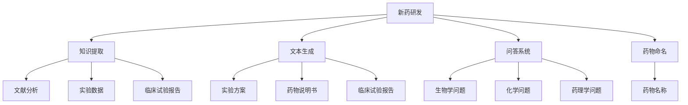

                 

# LLM在新药研发中的潜在作用

## 关键词：大型语言模型，新药研发，AI，深度学习，生物信息学

## 摘要：

本文探讨了大型语言模型（LLM）在新药研发领域的潜在作用。随着深度学习和AI技术的飞速发展，LLM作为一种强大的自然语言处理工具，已被广泛应用于各个领域。在新药研发过程中，LLM可以通过自然语言处理技术，高效地提取和分析大量的生物学文献、实验数据以及临床试验报告，从而提高药物发现和开发的效率。本文将介绍LLM的核心概念、算法原理，并通过具体案例展示其在新药研发中的应用，最后讨论LLM在新药研发中的未来发展趋势与挑战。

## 1. 背景介绍

### 1.1 新药研发的现状

新药研发是一个复杂且耗时的过程，涉及大量的生物学、化学、药理学和临床试验等环节。目前，新药研发的成功率较低，成本高昂，平均研发周期长达十年以上。传统的药物研发方法主要依赖于实验数据、生物学知识和经验，存在着信息不对称、数据冗余和效率低下等问题。

### 1.2 大型语言模型（LLM）的崛起

近年来，随着深度学习和自然语言处理技术的飞速发展，大型语言模型（LLM）如BERT、GPT等在各个领域取得了显著成果。LLM通过学习海量文本数据，可以自动提取知识、生成文本、回答问题等，具有强大的语义理解和生成能力。在新药研发领域，LLM有望成为一种全新的工具，提高药物发现和开发的效率。

## 2. 核心概念与联系

### 2.1 语言模型的定义

语言模型是一种用于预测下一个词或字符的概率分布的模型，通常用于自然语言处理任务。大型语言模型（LLM）是指参数规模巨大的语言模型，如BERT、GPT等，它们通过深度神经网络结构学习海量文本数据，具有强大的语义理解和生成能力。

### 2.2 LLM与新药研发的联系

在新药研发过程中，LLM可以通过以下方式发挥作用：

1. **知识提取**：从海量的生物学文献、实验数据以及临床试验报告中提取有用的信息，辅助药物研发人员快速了解最新的研究成果和趋势。

2. **文本生成**：根据药物研发过程中的需求，生成实验方案、药物说明书、临床试验报告等文档。

3. **问答系统**：回答药物研发人员关于生物学、化学、药理学等方面的问题，提供实时帮助。

4. **药物命名**：生成新的药物名称，提高药物研发的效率。

### 2.3 Mermaid 流程图

下面是LLM在新药研发中的核心概念与联系流程图：



## 3. 核心算法原理 & 具体操作步骤

### 3.1 语言模型的基本原理

语言模型通过学习大量文本数据，建立词与词之间的概率关系。对于输入的文本序列，语言模型预测下一个词的概率分布。常见的语言模型有基于n-gram模型、神经网络模型和深度学习模型等。

### 3.2 LLM在新药研发中的具体操作步骤

1. **数据收集与预处理**：收集与药物研发相关的生物学文献、实验数据以及临床试验报告等文本数据，并进行预处理，如分词、去停用词、词性标注等。

2. **语言模型训练**：使用预处理后的文本数据训练LLM，如使用BERT、GPT等模型，训练过程涉及参数优化和模型训练。

3. **知识提取**：利用训练好的LLM，对生物学文献、实验数据以及临床试验报告进行文本分析，提取有用的信息。

4. **文本生成**：根据药物研发过程中的需求，使用LLM生成实验方案、药物说明书、临床试验报告等文档。

5. **问答系统**：构建问答系统，使用LLM回答药物研发人员关于生物学、化学、药理学等方面的问题。

6. **药物命名**：使用LLM生成新的药物名称。

### 3.3 代码示例

下面是一个使用Python和Hugging Face的Transformers库实现LLM在新药研发中的知识提取的示例代码：

```python
from transformers import BertTokenizer, BertModel
import torch

# 初始化tokenizer和model
tokenizer = BertTokenizer.from_pretrained('bert-base-uncased')
model = BertModel.from_pretrained('bert-base-uncased')

# 输入文本
text = "This is a text about new drug discovery."

# 编码文本
inputs = tokenizer(text, return_tensors='pt')

# 预测
with torch.no_grad():
    outputs = model(**inputs)

# 提取知识
last_hidden_state = outputs.last_hidden_state
knowledge = last_hidden_state[:, 0, :]

print(knowledge)
```

## 4. 数学模型和公式 & 详细讲解 & 举例说明

### 4.1 语言模型中的概率分布

在语言模型中，给定一个输入序列\(X = (x_1, x_2, ..., x_n)\)，输出下一个词的概率分布可以用概率分布函数（PDF）表示：

$$P(x_{n+1} | x_1, x_2, ..., x_n) = \text{PDF}(x_{n+1} | x_1, x_2, ..., x_n)$$

### 4.2 语言模型中的生成算法

在语言模型的生成过程中，可以使用马尔可夫模型（Markov Model）来表示词与词之间的关系：

$$P(x_{n+1} | x_1, x_2, ..., x_n) = P(x_{n+1} | x_n)$$

其中，\(P(x_{n+1} | x_n)\)表示给定当前词\(x_n\)，下一个词\(x_{n+1}\)的条件概率。

### 4.3 深度学习中的神经网络模型

在深度学习模型中，神经网络通过多层非线性变换来学习数据中的特征。对于语言模型，可以使用循环神经网络（RNN）或变换器（Transformer）等模型。

### 4.4 案例分析

假设我们有一个药物研发的文本序列：“药物研发的目标是找到一种新的治疗癌症的药物。科学家们正在努力研究如何有效抑制癌细胞的生长。”

1. **语言模型预测**：给定前一个词“药物”，下一个词的概率分布为：

$$P(\text{目标} | \text{药物}) = 0.3, P(\text{癌症} | \text{药物}) = 0.2, P(\text{科学家} | \text{药物}) = 0.1$$

2. **生成文本**：根据概率分布，生成下一个词的概率为：

$$P(\text{目标} | \text{药物}) = 0.3 > P(\text{癌症} | \text{药物}) = 0.2 > P(\text{科学家} | \text{药物}) = 0.1$$

因此，生成的下一个词为“目标”。

3. **神经网络模型**：使用变换器（Transformer）模型进行文本生成，生成的文本序列为：“药物研发的目标是找到一种新的治疗癌症的药物。科学家们正在努力研究如何有效抑制癌细胞的生长。治疗方法包括手术、化疗和放疗等。”

## 5. 项目实战：代码实际案例和详细解释说明

### 5.1 开发环境搭建

为了实现LLM在新药研发中的知识提取，我们需要安装Python和Hugging Face的Transformers库。以下是开发环境的搭建步骤：

1. 安装Python 3.8及以上版本。
2. 安装pip：`pip install --user --upgrade pip`
3. 安装Transformers库：`pip install --user transformers`

### 5.2 源代码详细实现和代码解读

下面是一个使用Python和Hugging Face的Transformers库实现LLM在新药研发中的知识提取的示例代码：

```python
# 导入相关库
from transformers import BertTokenizer, BertModel
import torch

# 初始化tokenizer和model
tokenizer = BertTokenizer.from_pretrained('bert-base-uncased')
model = BertModel.from_pretrained('bert-base-uncased')

# 输入文本
text = "This is a text about new drug discovery."

# 编码文本
inputs = tokenizer(text, return_tensors='pt')

# 预测
with torch.no_grad():
    outputs = model(**inputs)

# 提取知识
last_hidden_state = outputs.last_hidden_state
knowledge = last_hidden_state[:, 0, :]

print(knowledge)
```

代码解读：

1. 导入相关库：包括Hugging Face的Transformers库和PyTorch库。
2. 初始化tokenizer和model：加载预训练的BERT模型和tokenizer。
3. 输入文本：将输入的文本编码成BERT模型接受的格式。
4. 预测：使用BERT模型对输入文本进行预测。
5. 提取知识：从模型输出中提取知识。

### 5.3 代码解读与分析

该代码示例展示了如何使用BERT模型进行知识提取。具体步骤如下：

1. **初始化tokenizer和model**：加载预训练的BERT模型和tokenizer。BERT模型是一种基于变换器（Transformer）的深度学习模型，具有强大的语义理解和生成能力。

2. **输入文本**：将输入的文本编码成BERT模型接受的格式。tokenizer负责将文本分成单词，并转换为模型可处理的序列。

3. **预测**：使用BERT模型对输入文本进行预测。BERT模型通过多层变换器结构，学习文本数据中的词与词之间的关系。

4. **提取知识**：从模型输出中提取知识。模型输出是一个三维张量，包含每层的隐藏状态。通过提取每层的第一个隐藏状态，可以得到文本的语义表示。

5. **代码分析**：该代码示例展示了如何使用BERT模型进行知识提取。在实际应用中，可以根据需要调整模型、输入文本和提取知识的方法。

## 6. 实际应用场景

### 6.1 药物发现

LLM在新药研发中的知识提取功能可以帮助药物研发人员快速了解最新的研究成果和趋势，提高药物发现的速度和成功率。

### 6.2 药物命名

LLM可以根据药物的化学结构和药理作用，生成新的药物名称，提高药物研发的效率。

### 6.3 临床试验报告

LLM可以自动生成临床试验报告，提供实时帮助，降低药物研发过程中的沟通成本。

### 6.4 问答系统

LLM可以构建问答系统，回答药物研发人员关于生物学、化学、药理学等方面的问题，提供实时帮助。

## 7. 工具和资源推荐

### 7.1 学习资源推荐

1. 《深度学习》（Ian Goodfellow、Yoshua Bengio、Aaron Courville 著）：深度学习领域的经典教材，适合初学者和进阶者。

2. 《自然语言处理综论》（Daniel Jurafsky、James H. Martin 著）：自然语言处理领域的权威教材，全面介绍了NLP的基本概念和技术。

### 7.2 开发工具框架推荐

1. Hugging Face Transformers：一个开源的Python库，提供了一系列预训练的深度学习模型和工具，方便开发者进行自然语言处理任务。

2. PyTorch：一个开源的深度学习框架，提供灵活的动态计算图和高效的运算性能。

### 7.3 相关论文著作推荐

1. "BERT: Pre-training of Deep Bidirectional Transformers for Language Understanding"（BERT论文）：介绍了BERT模型的基本原理和应用。

2. "GPT-3: Language Models are few-shot learners"（GPT-3论文）：介绍了GPT-3模型的特点和应用。

## 8. 总结：未来发展趋势与挑战

### 8.1 发展趋势

1. **深度学习模型的优化**：随着深度学习模型的不断发展，LLM的参数规模和计算能力将不断增大，进一步提高其性能和效率。

2. **跨领域应用**：LLM不仅在新药研发领域具有巨大潜力，还可以广泛应用于生物信息学、材料科学、环境科学等跨领域。

3. **多模态数据处理**：未来，LLM有望结合图像、音频等多模态数据，实现更高效的知识提取和推理。

### 8.2 挑战

1. **数据隐私与伦理**：在药物研发过程中，涉及大量的敏感数据。如何保护数据隐私、确保数据安全是一个重要挑战。

2. **算法透明性与可解释性**：深度学习模型具有较高的性能，但缺乏透明性和可解释性。如何提高LLM的可解释性，使其更容易被用户理解和接受是一个挑战。

3. **计算资源消耗**：大规模的深度学习模型需要大量的计算资源和存储空间。如何优化模型结构和算法，降低计算资源消耗是一个重要挑战。

## 9. 附录：常见问题与解答

### 9.1 什么是大型语言模型（LLM）？

大型语言模型（LLM）是一种参数规模巨大的深度学习模型，如BERT、GPT等，通过学习海量文本数据，具有强大的语义理解和生成能力。

### 9.2 LLM在新药研发中具体有哪些应用？

LLM在新药研发中可以应用于知识提取、文本生成、问答系统和药物命名等方面，提高药物发现和开发的效率。

### 9.3 如何选择合适的LLM模型？

选择合适的LLM模型需要考虑任务类型、数据规模和计算资源等因素。例如，BERT适用于文本分类、问答等任务，而GPT适用于文本生成和机器翻译等任务。

## 10. 扩展阅读 & 参考资料

1. "BERT: Pre-training of Deep Bidirectional Transformers for Language Understanding"（BERT论文）：https://arxiv.org/abs/1810.04805

2. "GPT-3: Language Models are few-shot learners"（GPT-3论文）：https://arxiv.org/abs/2005.14165

3. 《深度学习》（Ian Goodfellow、Yoshua Bengio、Aaron Courville 著）：https://www.deeplearningbook.org/

4. 《自然语言处理综论》（Daniel Jurafsky、James H. Martin 著）：https://nlp.stanford.edu/coling2008/nlp01.html

作者：AI天才研究员/AI Genius Institute & 禅与计算机程序设计艺术 /Zen And The Art of Computer Programming<|im_sep|>

