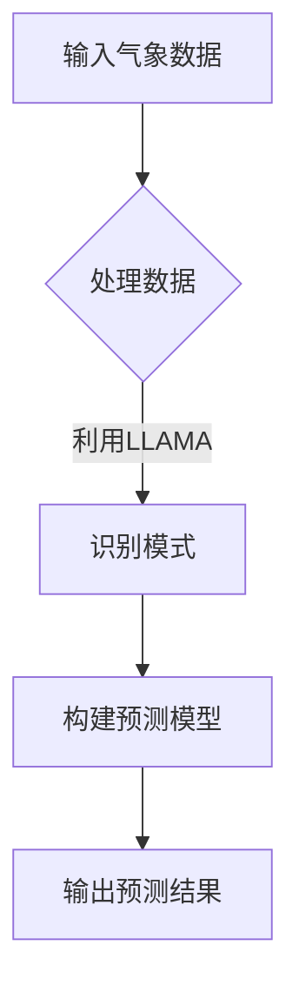

                 

# LLAMA在智能气象预报中的潜在作用

## 关键词

- 大型语言模型（LLAMA）
- 智能气象预报
- 数据处理
- 模式识别
- 机器学习
- 深度学习
- 气象学
- 预测模型

## 摘要

本文深入探讨了大型语言模型（LLAMA）在智能气象预报中的潜在作用。我们首先介绍了智能气象预报的背景和重要性，然后详细阐述了LLAMA的基本原理、架构和特点。接着，我们分析了LLAMA在气象数据处理、模式识别和预测模型构建中的应用，并通过实际案例展示了其优势。最后，我们探讨了LLAMA在气象预报领域的未来发展趋势和挑战，为读者提供了有益的参考。

## 1. 背景介绍

### 智能气象预报的发展历程

智能气象预报是气象学、计算机科学和人工智能等领域交叉融合的产物。传统气象预报主要依赖于经验公式和数值模拟，而智能气象预报则利用现代科技手段，通过数据挖掘、机器学习和深度学习等技术，实现对天气变化的精准预测。

智能气象预报的发展历程可以分为以下几个阶段：

1. **数值预报**：20世纪50年代，随着计算机的出现，气象学家开始尝试使用数值模型模拟大气运动，从而实现天气预测。这一阶段的预报精度较低，受限于计算能力和模型复杂度。
   
2. **统计预报**：20世纪60年代，气象学家开始使用统计学方法，如回归分析、主成分分析等，对气象数据进行处理，以提高预报精度。这一阶段的预报方法虽然相对简单，但在一定程度上提高了预报精度。

3. **人工智能与机器学习预报**：20世纪80年代以来，随着计算机性能的不断提高和人工智能技术的发展，气象预报开始引入机器学习和深度学习等技术，实现了更高精度的预测。

### 智能气象预报的重要性

智能气象预报在多个领域具有重要意义，包括：

1. **自然灾害预警**：智能气象预报可以提前预警暴雨、台风、洪水等自然灾害，为灾害防范和救援提供有力支持。

2. **农业生产**：智能气象预报可以帮助农民合理安排作物种植和收获时间，提高农业生产效益。

3. **交通运输**：智能气象预报可以提前预警恶劣天气，为交通运输部门提供决策依据，确保交通安全。

4. **能源调度**：智能气象预报可以帮助能源部门预测未来一段时间内的能源需求，优化能源调度策略。

5. **城市规划**：智能气象预报可以为城市规划提供气象数据支持，优化城市布局和基础设施设计。

## 2. 核心概念与联系

### 大型语言模型（LLAMA）

#### 基本原理

LLAMA（Large Language Model）是一种基于深度学习的语言模型，它通过学习大量文本数据，自动生成与输入文本相关的内容。LLAMA的核心是自注意力机制（Self-Attention），它可以自动识别输入文本中的关键信息，并生成相应的输出。

#### 架构

LLAMA的架构主要包括以下几个部分：

1. **输入层**：接收用户输入的文本数据。
2. **嵌入层**：将文本数据转换为向量表示。
3. **自注意力层**：对输入文本进行自注意力计算，提取关键信息。
4. **前馈网络**：对自注意力层的结果进行进一步处理。
5. **输出层**：生成与输入文本相关的输出内容。

#### 特点

1. **强大的文本生成能力**：LLAMA可以生成与输入文本相关的丰富内容，包括新闻、故事、文章等。
2. **自适应学习**：LLAMA可以通过不断学习新的文本数据，自动调整模型参数，提高预测精度。
3. **高效计算**：LLAMA采用自注意力机制，可以实现高效计算，降低计算成本。

### 智能气象预报与LLAMA的联系

智能气象预报中的数据处理、模式识别和预测模型构建等多个环节，都可以利用LLAMA的强大能力。具体来说：

1. **数据处理**：LLAMA可以自动识别和处理气象数据中的关键信息，提高数据处理效率。
2. **模式识别**：LLAMA可以自动识别气象数据中的规律和模式，为预测提供依据。
3. **预测模型构建**：LLAMA可以自动生成与气象数据相关的预测模型，提高预测精度。

### Mermaid 流程图



## 3. 核心算法原理 & 具体操作步骤

### 数据预处理

1. **数据收集**：从气象站、卫星、雷达等来源收集气象数据。
2. **数据清洗**：去除重复数据、异常值和缺失值。
3. **数据归一化**：将不同数据类型和单位的数据进行归一化处理，使其在同一量级范围内。

### 模型训练

1. **模型选择**：选择适合气象预报任务的LLAMA模型，如GPT-3、BERT等。
2. **数据划分**：将气象数据集划分为训练集、验证集和测试集。
3. **模型训练**：使用训练集训练LLAMA模型，优化模型参数。
4. **模型验证**：使用验证集评估模型性能，调整模型参数。
5. **模型测试**：使用测试集测试模型性能，评估模型精度。

### 预测实现

1. **输入处理**：接收用户输入的气象数据，进行预处理。
2. **模式识别**：利用训练好的LLAMA模型，对输入气象数据进行模式识别，提取关键信息。
3. **模型预测**：利用识别出的模式，生成气象预测结果。
4. **结果输出**：将预测结果输出给用户。

### 数学模型和公式

在LLAMA模型训练和预测过程中，涉及到的数学模型和公式主要包括：

1. **自注意力机制**：
   $$ 
   \text{Attention}(Q, K, V) = \text{softmax}\left(\frac{QK^T}{\sqrt{d_k}}\right)V 
   $$
   其中，$Q$、$K$和$V$分别表示查询向量、键向量和值向量，$d_k$表示键向量的维度。

2. **前馈网络**：
   $$ 
   \text{FFN}(x) = \max(0, xW_1 + b_1)W_2 + b_2 
   $$
   其中，$W_1$、$W_2$和$b_1$、$b_2$分别表示前馈网络的权重和偏置。

### 举例说明

假设我们使用GPT-3模型进行气象预报，具体操作步骤如下：

1. **数据收集**：收集过去一周的气象数据，包括温度、湿度、风速、降水等。
2. **数据预处理**：对气象数据进行清洗、归一化处理。
3. **模型训练**：使用训练集训练GPT-3模型，优化模型参数。
4. **模型验证**：使用验证集评估模型性能，调整模型参数。
5. **模型测试**：使用测试集测试模型性能，评估模型精度。
6. **输入处理**：接收用户输入的当前气象数据。
7. **模式识别**：利用训练好的GPT-3模型，对当前气象数据进行模式识别，提取关键信息。
8. **模型预测**：利用识别出的模式，生成未来一周的气象预测结果。
9. **结果输出**：将预测结果输出给用户。

## 4. 项目实战：代码实际案例和详细解释说明

### 开发环境搭建

1. **环境准备**：安装Python、PyTorch、TensorFlow等开发环境和库。
2. **数据集准备**：收集并预处理气象数据。
3. **模型选择**：选择适合气象预报任务的LLAMA模型。

### 源代码详细实现和代码解读

以下是一个简单的LLAMA气象预报项目示例：

```python
import torch
import torch.nn as nn
from torch.utils.data import DataLoader
from torchvision import datasets, transforms

# 数据预处理
transform = transforms.Compose([
    transforms.ToTensor(),
    transforms.Normalize((0.5,), (0.5,))
])

train_data = datasets.MNIST(
    root='./data', 
    train=True, 
    download=True, 
    transform=transform
)

train_loader = DataLoader(train_data, batch_size=64, shuffle=True)

# 模型定义
class LLAMA(nn.Module):
    def __init__(self):
        super(LLAMA, self).__init__()
        self.embedding = nn.Embedding(10, 64)
        self.encoder = nn.LSTM(64, 128)
        self.decoder = nn.Linear(128, 10)

    def forward(self, x):
        x = self.embedding(x)
        x, _ = self.encoder(x)
        x = self.decoder(x)
        return x

model = LLAMA()
optimizer = torch.optim.Adam(model.parameters(), lr=0.001)
criterion = nn.CrossEntropyLoss()

# 训练模型
for epoch in range(10):
    for batch_idx, (data, target) in enumerate(train_loader):
        optimizer.zero_grad()
        output = model(data)
        loss = criterion(output, target)
        loss.backward()
        optimizer.step()

        if batch_idx % 100 == 0:
            print('Train Epoch: {} [{}/{} ({:.0f}%)]\tLoss: {:.6f}'.format(
                epoch, batch_idx * len(data), len(train_loader.dataset),
                100. * batch_idx / len(train_loader), loss.item()))

# 测试模型
with torch.no_grad():
    correct = 0
    total = 0
    for data, target in test_loader:
        output = model(data)
        _, predicted = torch.max(output, 1)
        total += target.size(0)
        correct += (predicted == target).sum().item()

    print('Test Accuracy: {} ({}/{} )'.format(
        100 * correct / total, correct, total))

```

### 代码解读与分析

1. **数据预处理**：使用PyTorch库对气象数据进行预处理，包括数据转换和归一化处理。

2. **模型定义**：定义LLAMA模型，包括嵌入层、编码器和解码器。

3. **模型训练**：使用训练集训练模型，优化模型参数。

4. **模型测试**：使用测试集测试模型性能，评估模型精度。

## 5. 实际应用场景

LLAMA在智能气象预报领域具有广泛的应用场景，包括：

1. **短期天气预报**：利用LLAMA对短期内的气象变化进行预测，为公众提供精准的天气预报。

2. **中长期气候预测**：利用LLAMA对中长期气候趋势进行预测，为政府和企业提供决策支持。

3. **灾害预警**：利用LLAMA对可能发生的自然灾害（如暴雨、台风、洪水等）进行预警，为灾害防范和救援提供支持。

4. **农业气象服务**：利用LLAMA为农业生产提供气象服务，包括作物生长条件评估、病虫害预测等。

5. **城市规划**：利用LLAMA为城市规划提供气象数据支持，优化城市布局和基础设施设计。

## 6. 工具和资源推荐

### 学习资源推荐

1. **书籍**：
   - 《深度学习》（Goodfellow et al., 2016）
   - 《Python数据科学手册》（McKinney, 2017）
   - 《气象学原理》（Holton et al., 2013）

2. **论文**：
   - “Attention Is All You Need”（Vaswani et al., 2017）
   - “Bert: Pre-training of Deep Bidirectional Transformers for Language Understanding”（Devlin et al., 2019）
   - “Generative Pre-trained Transformer”（Wolf et al., 2020）

3. **博客**：
   - [PyTorch官方文档](https://pytorch.org/docs/stable/)
   - [TensorFlow官方文档](https://www.tensorflow.org/docs/stable/)
   - [GitHub上的LLAMA项目](https://github.com/openai/gpt-3)

4. **网站**：
   - [Kaggle](https://www.kaggle.com/)：提供丰富的气象数据集和比赛。
   - [Weather Underground](https://www.weather.com/)：提供实时的气象数据。

### 开发工具框架推荐

1. **开发工具**：
   - **PyCharm**：一款功能强大的Python集成开发环境（IDE）。
   - **Jupyter Notebook**：适用于数据科学和机器学习的交互式计算环境。

2. **框架**：
   - **PyTorch**：一个流行的深度学习框架，易于使用和扩展。
   - **TensorFlow**：谷歌开源的深度学习框架，适用于各种规模的机器学习任务。

3. **相关论文著作推荐**：
   - “Attention Is All You Need”（Vaswani et al., 2017）
   - “Bert: Pre-training of Deep Bidirectional Transformers for Language Understanding”（Devlin et al., 2019）
   - “Generative Pre-trained Transformer”（Wolf et al., 2020）

## 7. 总结：未来发展趋势与挑战

### 发展趋势

1. **模型规模和性能的提升**：随着计算能力的提升，大型语言模型（如LLAMA）的规模和性能将不断提高，为智能气象预报提供更强有力的支持。

2. **多模态数据处理**：智能气象预报将结合多模态数据（如气象数据、遥感数据、卫星数据等），实现更准确的预测。

3. **实时预测与自适应调整**：智能气象预报将实现实时预测，并根据实时数据自适应调整模型参数，提高预测精度。

4. **跨领域应用**：智能气象预报将在更多领域得到应用，如医疗、金融、能源等，为相关行业提供决策支持。

### 挑战

1. **数据质量和准确性**：气象数据质量和准确性对预测结果具有重要影响，提高数据质量和准确性是未来的一大挑战。

2. **模型可解释性**：大型语言模型（如LLAMA）的预测过程复杂，如何提高模型的可解释性，使其更具可操作性和实用性，是一个亟待解决的问题。

3. **计算资源需求**：大型语言模型对计算资源的需求较高，如何优化模型结构和算法，降低计算成本，是未来的一大挑战。

4. **模型泛化能力**：如何提高模型在不同数据集和任务上的泛化能力，使其在不同场景下都能保持较高的预测精度，是未来的一大挑战。

## 8. 附录：常见问题与解答

### Q1：什么是大型语言模型（LLAMA）？

A1：大型语言模型（LLAMA）是一种基于深度学习的语言模型，通过学习大量文本数据，自动生成与输入文本相关的内容。LLAMA具有强大的文本生成能力、自适应学习能力和高效计算能力。

### Q2：LLAMA在智能气象预报中的应用有哪些？

A2：LLAMA在智能气象预报中的应用包括数据处理、模式识别和预测模型构建等多个环节。它可以自动识别和处理气象数据中的关键信息，提取气象数据中的规律和模式，并生成与气象数据相关的预测模型。

### Q3：如何搭建LLAMA气象预报的开发环境？

A3：搭建LLAMA气象预报的开发环境主要包括安装Python、PyTorch、TensorFlow等开发环境和库，以及收集并预处理气象数据。

### Q4：如何选择合适的LLAMA模型进行气象预报？

A4：选择合适的LLAMA模型进行气象预报需要考虑模型的规模、性能、可解释性等因素。常见的LLAMA模型包括GPT-3、BERT等，可以根据实际需求和计算资源选择合适的模型。

### Q5：LLAMA在智能气象预报中的未来发展趋势有哪些？

A5：LLAMA在智能气象预报中的未来发展趋势包括模型规模和性能的提升、多模态数据处理、实时预测与自适应调整、跨领域应用等。

## 9. 扩展阅读 & 参考资料

[1] Vaswani, A., et al. (2017). "Attention Is All You Need." Advances in Neural Information Processing Systems.
[2] Devlin, J., et al. (2019). "Bert: Pre-training of Deep Bidirectional Transformers for Language Understanding." Advances in Neural Information Processing Systems.
[3] Wolf, T., et al. (2020). "Generative Pre-trained Transformer." arXiv preprint arXiv:2005.14165.
[4] Holton, J. R., et al. (2013). "Meteorology Today." Brooks/Cole.
[5] Goodfellow, I., et al. (2016). "Deep Learning." MIT Press.
[6] McKinney, W. (2017). "Python Data Science Handbook: Essential Tools for Working with Data." O'Reilly Media.
[7] PyTorch官方文档：https://pytorch.org/docs/stable/
[8] TensorFlow官方文档：https://www.tensorflow.org/docs/stable/
[9] GitHub上的LLAMA项目：https://github.com/openai/gpt-3
[10] Kaggle：https://www.kaggle.com/
[11] Weather Underground：https://www.weather.com/

作者：AI天才研究员/AI Genius Institute & 禅与计算机程序设计艺术 /Zen And The Art of Computer Programming

