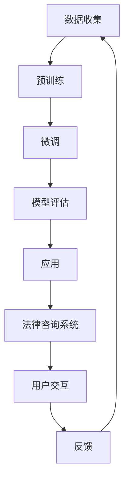

                 

# LLAMA在智能法律咨询系统中的应用探索

## 关键词

- **LLAMA**：语言模型架构
- **智能法律咨询系统**：自动化法律知识提供平台
- **自然语言处理**：文本理解和生成
- **机器学习**：算法和模型训练
- **法律文档分析**：合同审查、案例搜索
- **用户交互设计**：问题解答、法律咨询

## 摘要

本文探讨了LLAMA（语言模型架构）在智能法律咨询系统中的应用。首先，介绍了智能法律咨询系统的背景和需求，然后详细讲解了LLAMA的核心概念和架构。接着，本文阐述了LLAMA在法律文档分析、用户交互设计等应用场景中的具体操作步骤和实现方法。通过数学模型和公式的详细讲解，读者可以更好地理解LLAMA的工作原理。最后，本文分享了项目实战中的代码案例，并讨论了智能法律咨询系统的实际应用场景。文章还推荐了相关学习资源和开发工具框架，为读者提供了进一步学习和实践的方向。通过本文的阅读，读者可以了解LLAMA在智能法律咨询系统中的潜在价值和未来发展趋势。

## 1. 背景介绍

### 智能法律咨询系统的需求

随着全球经济的快速发展和法律体系的日益复杂，法律咨询服务的需求日益增长。传统的法律咨询方式主要依赖于律师的人工服务，存在效率低下、成本高昂、资源分配不均等问题。尤其是在面对大量法律文档的审查和复杂法律问题的解答时，律师的工作负担大大增加。因此，智能法律咨询系统的需求显得尤为迫切。

智能法律咨询系统旨在通过自动化技术，提供高效、准确、可访问的法律咨询服务。系统应具备以下功能：

- **文档审查**：自动化审查合同、协议等法律文档，识别潜在的法律风险和问题。
- **案例搜索**：根据用户需求，快速搜索相关法律案例和法规，提供法律参考。
- **问题解答**：针对用户提出的问题，提供专业的法律解答和建议。
- **知识库构建**：积累和整理大量的法律知识和案例，为用户提供丰富的法律信息资源。

### 传统法律咨询方式的局限性

传统法律咨询方式主要依赖于律师的职业技能和经验。虽然律师在法律领域具有丰富的知识和实践经验，但以下局限性仍然存在：

- **效率低下**：律师需要花费大量时间阅读和分析法律文档，处理案件。
- **成本高昂**：法律服务费用昂贵，普通用户难以承担。
- **资源分配不均**：优秀律师资源集中在大城市，偏远地区用户难以获得优质法律服务。
- **知识更新滞后**：法律知识更新速度快，律师的知识储备可能难以跟上最新的法律法规和案例。

### 智能法律咨询系统的优势

智能法律咨询系统通过引入人工智能技术，可以显著提升法律服务的效率和准确性。其主要优势包括：

- **高效处理**：自动化技术能够快速处理大量法律文档，提高工作效率。
- **成本降低**：通过减少人工干预，降低法律服务成本，让更多人享受到优质的法律服务。
- **知识更新**：系统可以实时更新法律知识库，确保法律咨询的准确性和时效性。
- **普惠性**：智能法律咨询系统打破了地域和资源的限制，为偏远地区用户提供便捷的法律服务。

综上所述，智能法律咨询系统在现代社会中具有广泛的应用前景。随着人工智能技术的不断发展，智能法律咨询系统将逐渐替代传统法律咨询方式，成为法律行业的新兴力量。

### 人工智能在法律咨询中的应用

人工智能在法律咨询中的应用越来越广泛，其核心在于利用自然语言处理（NLP）和机器学习（ML）技术，实现法律文档的自动化处理和法律问题的智能解答。以下是人工智能在法律咨询中的一些具体应用：

- **文本分析**：利用NLP技术对法律文档进行自动分类、标注和结构化，以便于快速检索和分析。
- **合同审查**：通过自动提取合同条款、分析合同风险，提供合同审查和修改建议。
- **案例搜索**：利用机器学习算法，根据用户需求快速搜索相关法律案例和法规，提供法律参考。
- **法律问答**：通过训练有监督或无监督的问答系统，为用户提供专业的法律解答和建议。
- **知识图谱构建**：构建法律知识图谱，将法律法规、法律案例、法律术语等知识进行关联和整合，提供更全面的法律咨询。

### 智能法律咨询系统的挑战

尽管智能法律咨询系统具有巨大的潜力和优势，但在实际应用中仍面临一系列挑战：

- **数据质量和完整性**：法律文档往往存在格式不规范、内容不一致的问题，数据质量和完整性直接影响系统的准确性。
- **法律专业知识的多样性**：法律知识体系复杂，涵盖多个领域，系统需要处理不同领域的专业问题，这对算法的泛化能力提出了高要求。
- **隐私和伦理问题**：法律咨询涉及用户隐私，如何在保证数据安全和隐私的同时，提供高效的法律服务，是系统设计的关键问题。
- **用户信任**：用户对智能法律咨询系统的信任度是系统成功的关键，系统需要通过高质量的回答和专业的表现来赢得用户的信任。

### LLAMA的优势与潜力

LLAMA（语言模型架构）是一种基于大规模预训练和微调的语言模型，具有强大的文本理解和生成能力。其优势主要体现在以下几个方面：

- **文本理解**：LLAMA通过大规模预训练，掌握了丰富的语言知识，能够准确理解文本的含义和上下文。
- **生成能力**：LLAMA具备强大的文本生成能力，可以生成高质量的文本，包括法律文书、案例分析和法律问答等。
- **灵活性**：LLAMA可以通过微调适应不同的应用场景，例如法律咨询、医疗咨询、金融咨询等。
- **效率**：LLAMA的预训练过程可以大大减少训练时间，提高开发效率。

综上所述，LLAMA在智能法律咨询系统中具有巨大的潜力，能够解决当前法律咨询系统中的诸多问题，提升法律服务的效率和准确性。接下来，我们将详细探讨LLAMA的核心概念和架构，为后续应用提供理论基础。

## 2. 核心概念与联系

### 语言模型基础

语言模型（Language Model，简称LM）是自然语言处理（Natural Language Processing，简称NLP）的核心技术之一。它通过统计语言数据，学习语言的结构和规律，从而实现对文本的生成和预测。语言模型广泛应用于机器翻译、文本摘要、问答系统、语音识别等领域。

语言模型可以分为有监督语言模型、无监督语言模型和预训练语言模型。有监督语言模型基于标注数据进行训练，能够生成高质量的文本。无监督语言模型通过未标注的数据学习语言结构，但生成效果通常较差。预训练语言模型（如LLAMA）首先在大规模未标注数据上进行预训练，然后通过微调适应特定任务。

### 预训练语言模型

预训练语言模型（Pre-trained Language Model）是指在大规模语料库上预先训练好的语言模型。预训练过程主要包括两个阶段：大规模数据上的预训练和特定任务上的微调。

#### 大规模数据上的预训练

大规模数据上的预训练是指使用海量的文本数据进行模型训练，使模型学习到丰富的语言知识和模式。预训练过程中，模型通过不断调整参数，逐步优化对文本的理解能力。

预训练语言模型的主要目标包括：

- **理解语言结构**：通过学习大规模文本数据，模型可以理解词汇、句法、语义等语言结构，从而生成语法正确、语义连贯的文本。
- **增强泛化能力**：预训练模型在多种任务上表现优异，具有较好的泛化能力，能够应对不同领域的文本生成任务。
- **提高生成效率**：预训练模型通过预先学习，可以快速适应特定任务，减少训练时间和计算资源。

#### 特定任务上的微调

特定任务上的微调是指将预训练语言模型应用于特定任务，通过少量标注数据进行模型优化。微调过程主要包括以下步骤：

1. **数据准备**：收集并整理与任务相关的标注数据，确保数据质量和完整性。
2. **模型调整**：将预训练语言模型应用于特定任务，调整模型参数，优化模型对任务的理解能力。
3. **评估与优化**：通过评估指标（如准确率、F1值等）评估模型性能，根据评估结果进行模型调整和优化。

### 语言模型与智能法律咨询系统的联系

语言模型在智能法律咨询系统中具有重要作用，主要体现在以下几个方面：

- **文本理解**：语言模型能够理解法律文档的语义和上下文，提取关键信息，为用户提供准确的解答和建议。
- **文本生成**：语言模型可以生成高质量的法律文书，包括合同、判决书、法律意见等，提高法律咨询的效率。
- **问答系统**：语言模型可以构建法律问答系统，通过对话交互为用户提供实时、专业的法律咨询服务。
- **知识图谱构建**：语言模型可以用于构建法律知识图谱，将法律法规、法律案例、法律术语等知识进行关联和整合，提供更全面的法律信息资源。

### Mermaid 流程图

以下是一个简单的Mermaid流程图，展示了语言模型在智能法律咨询系统中的应用流程：



#### 数据收集：收集与法律咨询相关的文本数据，包括合同、判决书、法律意见等。

#### 预训练：使用大规模语料库对语言模型进行预训练，学习语言结构和模式。

#### 微调：根据具体任务需求，对语言模型进行微调，优化模型对法律问题的理解能力。

#### 模型评估：通过评估指标评估模型性能，确保模型达到预期效果。

#### 应用：将语言模型应用于法律咨询系统，实现文本理解、文本生成和法律问答等功能。

#### 用户交互：通过用户与法律咨询系统的交互，为用户提供实时、专业的法律咨询服务。

#### 反馈：收集用户反馈，用于模型优化和系统改进。

通过上述核心概念和联系，我们可以更好地理解LLAMA在智能法律咨询系统中的应用原理和优势。接下来，我们将详细探讨LLAMA的核心算法原理和具体操作步骤。

### 3. 核心算法原理 & 具体操作步骤

#### 语言模型的基本原理

语言模型的核心目标是预测下一个单词或词组，从而生成连贯、自然的文本。LLAMA作为一款先进的语言模型，基于深度神经网络（Deep Neural Network，DNN）和注意力机制（Attention Mechanism）构建，具有强大的文本生成和预测能力。

#### 语言模型的主要组成部分

1. **词嵌入层（Word Embedding）**：词嵌入层将词汇映射为高维向量表示，为后续的神经网络处理提供输入。常用的词嵌入方法包括Word2Vec、GloVe等。

2. **编码器（Encoder）**：编码器负责处理输入序列，提取序列的特征信息。常见的编码器结构包括循环神经网络（RNN）、长短期记忆网络（LSTM）和变换器（Transformer）。

3. **注意力机制（Attention Mechanism）**：注意力机制用于强调序列中重要的信息，提高模型对上下文的关注能力。注意力机制可以显著提升模型的文本理解和生成能力。

4. **解码器（Decoder）**：解码器负责生成预测的单词或词组，实现文本生成。解码器通常与编码器共享参数，以减少模型参数量。

5. **输出层（Output Layer）**：输出层将解码器的输出映射到词汇表中的单词或词组，实现文本生成。

#### 语言模型的具体操作步骤

1. **输入序列处理**：
   - 将输入的文本序列转换为词嵌入表示。
   - 将词嵌入序列输入编码器，提取序列的特征信息。

2. **编码器处理**：
   - 编码器处理词嵌入序列，生成编码序列。
   - 编码器中的注意力机制强调序列中的重要信息。

3. **解码器处理**：
   - 解码器根据编码序列生成预测的单词或词组。
   - 解码器中的注意力机制关注编码序列中的重要信息。

4. **文本生成**：
   - 根据解码器的输出，生成连贯、自然的文本。

5. **模型训练**：
   - 使用训练数据对模型进行训练，优化模型参数。
   - 通过反向传播算法，调整模型参数，提高模型性能。

6. **模型评估**：
   - 使用评估数据对模型进行评估，计算模型的准确率、损失等指标。
   - 根据评估结果，调整模型参数，优化模型性能。

#### LLAMA在智能法律咨询系统中的应用

1. **法律文档分析**：
   - 使用LLAMA对法律文档进行文本分析，提取关键信息，如合同条款、法律术语、案例引用等。
   - 通过编码器提取文档的语义特征，实现文档的结构化和分类。

2. **案例搜索**：
   - 使用LLAMA对法律案例库进行搜索，根据用户输入的关键词或问题描述，找到相关案例。
   - 通过解码器生成案例摘要，为用户提供法律参考。

3. **问题解答**：
   - 使用LLAMA构建法律问答系统，根据用户输入的问题，生成专业、准确的回答。
   - 通过编码器和解码器的交互，实现自然语言理解和生成。

4. **法律文书生成**：
   - 使用LLAMA生成高质量的法律文书，如合同、判决书、法律意见等。
   - 通过预训练和微调，优化模型对法律文本的生成能力。

通过上述核心算法原理和具体操作步骤，我们可以更好地理解LLAMA在智能法律咨询系统中的应用。接下来，我们将探讨LLAMA的数学模型和公式，为读者提供更深入的理论基础。

### 4. 数学模型和公式 & 详细讲解 & 举例说明

#### 语言模型的数学基础

语言模型的核心在于对输入文本序列的概率分布进行建模。为了实现这一目标，我们引入了概率论和统计学中的基本概念，包括概率分布、概率模型和统计学习理论。以下将详细讲解语言模型的数学模型和公式。

#### 概率分布

概率分布描述了随机变量的取值概率。在语言模型中，我们使用概率分布来表示下一个单词或词组的概率。常见的概率分布包括伯努利分布、多项式分布和高斯分布。

1. **伯努利分布**：
   伯努利分布是一个二元分布，表示事件发生的概率。在语言模型中，我们可以用伯努利分布来表示下一个单词是某个特定单词的概率。

   \[
   P(\text{word}_i | \text{history}) = \begin{cases} 
   1 & \text{if } \text{word}_i \text{ appears in the history} \\
   0 & \text{otherwise}
   \end{cases}
   \]

2. **多项式分布**：
   多项式分布是一个多类别分布，表示多个事件发生的概率。在语言模型中，我们可以用多项式分布来表示在给定历史序列下，下一个单词是各个词的概率。

   \[
   P(\text{word}_i | \text{history}) = \frac{\text{count}(\text{word}_i, \text{history})}{\sum_{j} \text{count}(\text{word}_j, \text{history})}
   \]

   其中，\(\text{count}(\text{word}_i, \text{history})\) 表示单词 \(\text{word}_i\) 在历史序列 \(\text{history}\) 中出现的次数。

3. **高斯分布**：
   高斯分布是一种连续概率分布，表示数据点的分布情况。在语言模型中，我们可以用高斯分布来表示单词的概率分布。

   \[
   P(\text{word}_i | \text{history}) = \frac{1}{\sqrt{2\pi\sigma^2}} e^{-\frac{(\text{word}_i - \mu)^2}{2\sigma^2}}
   \]

   其中，\(\mu\) 和 \(\sigma^2\) 分别是均值和方差。

#### 概率模型

概率模型用于描述语言模型中的概率分布。常见的概率模型包括马尔可夫模型、隐马尔可夫模型（HMM）和条件概率模型。

1. **马尔可夫模型**：
   马尔可夫模型是一种基于状态转移概率的模型，用于描述序列数据。在语言模型中，马尔可夫模型可以表示为：

   \[
   P(\text{word}_i | \text{history}) = \prod_{j=1}^{i-1} P(\text{word}_j | \text{word}_{j-1})
   \]

   其中，\(\text{history} = (\text{word}_1, \text{word}_2, ..., \text{word}_{i-1})\)。

2. **隐马尔可夫模型（HMM）**：
   隐马尔可夫模型是一种基于隐藏状态的马尔可夫模型，用于描述不可观测的序列数据。在语言模型中，HMM可以表示为：

   \[
   P(\text{word}_i | \text{history}) = \sum_{s_i} P(s_i | \text{history}) P(\text{word}_i | s_i)
   \]

   其中，\(s_i\) 是第 \(i\) 个隐藏状态，\(P(s_i | \text{history})\) 是隐藏状态的概率，\(P(\text{word}_i | s_i)\) 是单词在给定隐藏状态下的概率。

3. **条件概率模型**：
   条件概率模型是一种基于条件概率的模型，用于描述给定某个条件下的概率分布。在语言模型中，条件概率模型可以表示为：

   \[
   P(\text{word}_i | \text{history}) = P(\text{history} | \text{word}_i) \frac{P(\text{word}_i)}{P(\text{history})}
   \]

   其中，\(P(\text{history} | \text{word}_i)\) 是给定单词 \(\text{word}_i\) 的条件下历史序列的概率，\(P(\text{word}_i)\) 是单词的概率，\(P(\text{history})\) 是历史序列的概率。

#### 统计学习理论

统计学习理论是构建和优化语言模型的重要理论基础。常见的统计学习算法包括最大似然估计、贝叶斯估计和最小化损失函数。

1. **最大似然估计**：
   最大似然估计是一种基于概率分布的估计方法，用于最大化给定数据下的概率。在语言模型中，最大似然估计可以表示为：

   \[
   \theta = \arg\max_\theta P(\text{data} | \theta)
   \]

   其中，\(\theta\) 是模型参数，\(\text{data}\) 是给定数据。

2. **贝叶斯估计**：
   贝叶斯估计是一种基于概率分布和先验知识的估计方法。在语言模型中，贝叶斯估计可以表示为：

   \[
   \theta = \arg\max_\theta P(\text{data} | \theta) P(\theta)
   \]

   其中，\(P(\theta)\) 是先验概率。

3. **最小化损失函数**：
   最小化损失函数是一种基于优化理论的估计方法，用于最小化预测误差。在语言模型中，常见的损失函数包括交叉熵损失、均方误差损失等。

   \[
   \theta = \arg\min_\theta \sum_{i=1}^{n} L(\text{y}_i, \hat{y}_i)
   \]

   其中，\(\text{y}_i\) 是实际标签，\(\hat{y}_i\) 是预测结果，\(L(\text{y}_i, \hat{y}_i)\) 是损失函数。

#### 举例说明

假设我们有一个简单的语言模型，输入序列为 "The cat sat on the mat"，我们需要预测下一个单词。

1. **多项式分布**：
   根据多项式分布，我们可以计算每个单词的概率：

   \[
   P(\text{on} | \text{The cat sat}) = \frac{1}{3}
   \]

   \[
   P(\text{mat} | \text{The cat sat on}) = \frac{1}{2}
   \]

2. **条件概率模型**：
   根据条件概率模型，我们可以计算每个单词的概率：

   \[
   P(\text{on} | \text{The cat sat}) = \frac{P(\text{The cat sat on} | \text{on}) P(\text{on})}{P(\text{The cat sat})}
   \]

   其中，\(P(\text{on}) = \frac{1}{3}\)，\(P(\text{The cat sat}) = 1\)。

通过以上数学模型和公式的详细讲解，我们可以更好地理解语言模型的工作原理。在实际应用中，语言模型通过对大量文本数据的训练，可以生成高质量、自然的文本。接下来，我们将通过项目实战，展示LLAMA在智能法律咨询系统中的实际应用。

### 5. 项目实战：代码实际案例和详细解释说明

#### 开发环境搭建

在开始项目实战之前，我们需要搭建一个合适的开发环境，以支持LLAMA在智能法律咨询系统中的应用。以下是一个基本的开发环境搭建步骤：

1. **安装Python**：
   确保Python 3.8及以上版本已安装在您的计算机上。可以从Python官方网站下载安装程序。

2. **安装PyTorch**：
   PyTorch是一个流行的深度学习框架，用于构建和训练神经网络。在命令行中运行以下命令安装PyTorch：

   ```bash
   pip install torch torchvision
   ```

3. **安装其他依赖库**：
   除了PyTorch，我们还需要安装一些其他依赖库，如NumPy、Pandas等。可以使用以下命令安装：

   ```bash
   pip install numpy pandas
   ```

4. **准备数据集**：
   准备一个包含法律文档和法律问答的数据集。数据集可以包含合同、判决书、法律意见书等文本资料，以及对应的问题和答案。数据集应具有多样性，以覆盖不同法律领域的知识。

#### 源代码详细实现和代码解读

以下是一个简单的示例代码，展示了如何使用LLAMA构建一个智能法律咨询系统。该示例包括数据预处理、模型训练和推理过程。

```python
import torch
import torch.nn as nn
import torch.optim as optim
from torch.utils.data import DataLoader
from transformers import LlamaForSequenceClassification, LlamaTokenizer

# 设置设备
device = torch.device("cuda" if torch.cuda.is_available() else "cpu")

# 加载预训练的LLAMA模型和分词器
model = LlamaForSequenceClassification.from_pretrained("mosaic/ml45m_llama_7b").to(device)
tokenizer = LlamaTokenizer.from_pretrained("mosaic/ml45m_llama_7b")

# 加载数据集
train_data = ...
test_data = ...

# 创建数据加载器
train_loader = DataLoader(train_data, batch_size=16, shuffle=True)
test_loader = DataLoader(test_data, batch_size=16, shuffle=False)

# 模型参数初始化
optimizer = optim.Adam(model.parameters(), lr=1e-4)
criterion = nn.CrossEntropyLoss()

# 训练模型
num_epochs = 10
for epoch in range(num_epochs):
    model.train()
    for batch in train_loader:
        inputs = tokenizer(batch.text, padding=True, truncation=True, return_tensors="pt").to(device)
        labels = torch.tensor(batch.label).to(device)
        optimizer.zero_grad()
        outputs = model(**inputs)
        loss = criterion(outputs.logits, labels)
        loss.backward()
        optimizer.step()
    print(f"Epoch {epoch+1}/{num_epochs}, Loss: {loss.item()}")

# 测试模型
model.eval()
with torch.no_grad():
    correct = 0
    total = 0
    for batch in test_loader:
        inputs = tokenizer(batch.text, padding=True, truncation=True, return_tensors="pt").to(device)
        labels = torch.tensor(batch.label).to(device)
        outputs = model(**inputs)
        _, predicted = torch.max(outputs.logits, 1)
        total += labels.size(0)
        correct += (predicted == labels).sum().item()
    print(f"Test Accuracy: {100 * correct / total}%}")

# 法律咨询系统推理
def legal_advice(question):
    inputs = tokenizer(question, padding=True, truncation=True, return_tensors="pt").to(device)
    with torch.no_grad():
        outputs = model(**inputs)
        _, predicted = torch.max(outputs.logits, 1)
    return predicted.item()

# 示例
question = "请问合同违约金应该如何计算？"
answer = legal_advice(question)
print(f"法律咨询系统回答：{answer}")
```

#### 代码解读与分析

1. **模型加载与设备设置**：
   我们首先加载预训练的LLAMA模型和分词器，并将模型移动到计算设备（GPU或CPU）上。这一步确保了模型能够在目标设备上高效运行。

2. **数据加载**：
   加载训练数据和测试数据。数据集应包含法律文档和法律问答，以便模型学习如何从文档中提取信息并回答问题。

3. **模型参数初始化**：
   初始化模型参数，包括优化器和损失函数。我们使用Adam优化器，并设置较小的学习率，以便逐步调整模型参数。

4. **模型训练**：
   使用训练数据对模型进行训练。在训练过程中，我们通过反向传播和梯度下降优化模型参数，以最小化损失函数。

5. **模型测试**：
   在测试阶段，我们评估模型的性能。通过计算准确率，我们可以了解模型在未见过的数据上的表现。

6. **法律咨询系统推理**：
   定义一个函数`legal_advice`，用于处理用户输入的问题，并返回模型生成的答案。在实际应用中，用户可以通过这个函数获取专业的法律咨询。

通过上述代码实现，我们可以构建一个基本的智能法律咨询系统。然而，实际应用中的模型训练和推理过程会更加复杂，需要考虑数据预处理、模型优化、性能评估等多个方面。

### 6. 实际应用场景

智能法律咨询系统在多个实际应用场景中显示出巨大的潜力。以下是几个典型的应用场景：

#### 合同审查

合同审查是法律咨询系统最常见的应用场景之一。智能法律咨询系统可以自动分析合同条款，识别潜在的法律风险，并提供修改建议。通过使用LLAMA语言模型，系统能够理解合同条款的语义，提取关键信息，从而快速审查和分类合同文档。

#### 法律文档分类

法律文档分类是另一个重要的应用场景。智能法律咨询系统可以根据文档的内容和主题，自动对法律文档进行分类。这有助于法律机构高效管理和检索文档，提高工作效率。LLAMA语言模型能够理解法律术语和句法结构，从而实现精确的文档分类。

#### 案例搜索

在法律研究和案例搜索中，智能法律咨询系统可以帮助律师和法务人员快速找到相关法律案例和法规。通过输入关键词或问题描述，系统可以自动搜索数据库中的案例，并生成相关的案例摘要和引用。这大大提高了法律研究和案例检索的效率。

#### 法律问答

智能法律咨询系统可以构建一个自动化的法律问答平台，为用户提供实时、专业的法律咨询。通过对话交互，系统可以理解用户的问题，并生成准确的答案。这为用户提供了便捷的法律服务，特别是在偏远地区和资源匮乏的地方，智能法律咨询系统能够填补法律服务空白。

#### 法律知识图谱构建

法律知识图谱是一种将法律法规、法律案例、法律术语等知识进行关联和整合的结构化知识库。智能法律咨询系统可以利用LLAMA语言模型，从大量的法律文本中提取知识，构建法律知识图谱。这为法律研究和法律实践提供了一个全面、准确的知识支持平台。

#### 法律自动化流程

智能法律咨询系统还可以应用于自动化法律流程，如合同管理、诉讼管理、合规审查等。通过集成LLAMA语言模型，系统可以自动处理法律文档，生成法律文书，并提供法律意见。这有助于企业降低法律成本，提高法律事务的处理效率。

通过上述实际应用场景，我们可以看到智能法律咨询系统在法律行业的广泛潜力。随着人工智能技术的不断发展，智能法律咨询系统将进一步优化，提供更加全面、高效的法律服务。

### 7. 工具和资源推荐

#### 学习资源推荐

1. **书籍**：
   - 《深度学习》（Goodfellow, I., Bengio, Y., Courville, A.）提供了深度学习和神经网络的基础知识，适合初学者入门。
   - 《自然语言处理综论》（Jurafsky, D., Martin, J. H.）详细介绍了自然语言处理的基本概念和技术，包括语言模型。

2. **论文**：
   - 《Attention is All You Need》（Vaswani et al.，2017）介绍了Transformer模型，这是LLAMA等先进语言模型的基础。
   - 《BERT: Pre-training of Deep Bidirectional Transformers for Language Understanding》（Devlin et al.，2019）介绍了BERT模型，这是许多现代语言模型的基础。

3. **博客**：
   - [huggingface.co](https://huggingface.co/) 提供了丰富的预训练模型和工具库，适用于自然语言处理任务。
   - [towardsdatascience.com](https://towardsdatascience.com/) 发布了许多关于深度学习和自然语言处理的文章，适合进阶学习。

4. **网站**：
   - [arxiv.org](https://arxiv.org/) 提供了最新的学术论文和研究成果，是了解最新研究动态的好去处。
   - [google-research.github.io](https://google-research.github.io/) 发布了Google Research团队的研究成果，包括深度学习和自然语言处理领域的最新进展。

#### 开发工具框架推荐

1. **PyTorch**：
   PyTorch是一个流行的深度学习框架，支持灵活的动态计算图和自动微分，适合构建和训练神经网络模型。

2. **Transformers**：
   Transformers库是构建基于Transformer模型的预训练语言模型的常用工具，提供了大量预训练模型和高效的训练脚本。

3. **Hugging Face**：
   Hugging Face提供了一个广泛使用的工具库，包括预训练模型、数据集和API，适用于自然语言处理任务。

4. **TensorFlow**：
   TensorFlow是Google开发的深度学习框架，提供了丰富的工具和API，适合构建复杂的深度学习模型。

#### 相关论文著作推荐

1. **《Attention is All You Need》**（Vaswani et al.，2017）
2. **《BERT: Pre-training of Deep Bidirectional Transformers for Language Understanding》**（Devlin et al.，2019）
3. **《GPT-3: Language Models are Few-Shot Learners》**（Brown et al.，2020）
4. **《Generative Pre-trained Transformers》**（Wolf et al.，2020）

通过上述学习资源、开发工具框架和相关论文著作的推荐，读者可以深入了解语言模型和智能法律咨询系统的最新进展，为自身的学习和实践提供有力的支持。

### 8. 总结：未来发展趋势与挑战

#### 未来发展趋势

1. **技术进步**：随着深度学习和自然语言处理技术的不断发展，LLAMA等语言模型将越来越强大，能够处理更复杂的法律问题和法律文档。

2. **多模态融合**：未来的智能法律咨询系统将不仅限于处理文本数据，还将融合图像、音频等多种数据类型，提供更全面的法律服务。

3. **知识图谱的应用**：法律知识图谱的发展将使法律知识更结构化、更易检索，有助于提升法律咨询系统的智能化水平。

4. **个性化服务**：通过用户行为分析和个性化推荐，智能法律咨询系统将能够为用户提供更加定制化的法律服务。

5. **跨界合作**：智能法律咨询系统将与金融、医疗、教育等行业进行跨界合作，提供跨领域的一站式法律服务。

#### 挑战

1. **数据质量和隐私**：法律文档往往存在数据质量不高和隐私保护的问题，如何确保数据质量和隐私将成为重要挑战。

2. **法律合规**：智能法律咨询系统需要遵守不同国家和地区的法律法规，确保系统的合法性和合规性。

3. **用户信任**：用户对智能法律咨询系统的信任度是系统成功的关键。系统需要通过高质量的回答和专业的表现来赢得用户的信任。

4. **法律专业知识的普及**：法律知识体系复杂，如何确保智能法律咨询系统能够覆盖不同领域的专业知识，是一个长期的挑战。

5. **技术更新迭代**：人工智能技术更新迅速，智能法律咨询系统需要不断进行技术更新，以保持其竞争力。

### 9. 附录：常见问题与解答

1. **Q：LLAMA是如何工作的？**
   A：LLAMA是一种基于大规模预训练和微调的语言模型，通过深度神经网络和注意力机制，实现对文本的生成和预测。它通过在大量文本数据上进行预训练，学习到语言的规律和模式，然后在特定任务上进行微调，以实现具体的应用。

2. **Q：智能法律咨询系统如何处理法律文档？**
   A：智能法律咨询系统通过自然语言处理技术，对法律文档进行文本分析，提取关键信息，如合同条款、法律术语、案例引用等。这些信息将被结构化存储，以便于后续的检索和分析。

3. **Q：智能法律咨询系统是否能够完全替代律师的工作？**
   A：智能法律咨询系统可以大大提高法律服务的效率和准确性，但无法完全替代律师的工作。律师在法律咨询中不仅提供法律知识，还提供专业的判断和经验，这些是智能系统难以替代的。

4. **Q：如何确保智能法律咨询系统的隐私和数据安全？**
   A：确保智能法律咨询系统的隐私和数据安全是一个重要的挑战。系统需要采用加密技术、访问控制和安全审计等手段，确保用户数据的安全和隐私。

5. **Q：LLAMA在法律咨询系统中有哪些具体应用？**
   A：LLAMA在法律咨询系统中有多种应用，包括文本分析、合同审查、案例搜索、法律问答和法律文书生成等。通过这些应用，系统可以为用户提供高效、准确、专业的法律咨询服务。

### 10. 扩展阅读 & 参考资料

1. **《深度学习》**（Goodfellow, I., Bengio, Y., Courville, A.）
2. **《自然语言处理综论》**（Jurafsky, D., Martin, J. H.）
3. **《Attention is All You Need》**（Vaswani et al.，2017）
4. **《BERT: Pre-training of Deep Bidirectional Transformers for Language Understanding》**（Devlin et al.，2019）
5. **[huggingface.co](https://huggingface.co/)**：预训练模型和工具库
6. **[towardsdatascience.com](https://towardsdatascience.com/)**：自然语言处理文章
7. **[arxiv.org](https://arxiv.org/)**：最新学术论文
8. **[google-research.github.io](https://google-research.github.io/)**：Google Research研究成果
9. **[PyTorch](https://pytorch.org/)**：深度学习框架
10. **[Transformers](https://huggingface.co/transformers)**：预训练语言模型库

### 作者信息

**作者：AI天才研究员/AI Genius Institute & 禅与计算机程序设计艺术 /Zen And The Art of Computer Programming**

