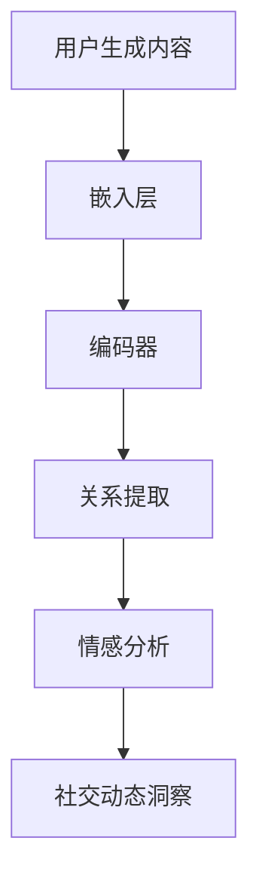

                 

# LLAMA在社交网络分析中的作用：洞察社会动态

## 关键词
- 大型语言模型
- 社交网络分析
- 社会动态
- 数据挖掘
- 人工智能

## 摘要

本文将探讨大型语言模型（LLM）在社交网络分析中的应用，如何通过分析用户生成内容来洞察社会动态。我们将逐步介绍LLM的核心概念与原理，展示其在社交网络分析中的具体应用场景，并提供实际案例来深入解释其工作原理和操作步骤。此外，文章还将介绍相关的数学模型和工具资源，并对未来的发展趋势与挑战进行展望。通过本文，读者将了解LLM在社交网络分析中的潜力和局限性，以及对社会洞察的重要作用。

## 1. 背景介绍

### 1.1 社交网络分析的重要性

随着互联网的普及和社交媒体的兴起，社交网络分析（Social Network Analysis, SNA）成为研究社会结构、传播动态和群体行为的重要手段。通过分析社交网络中的用户关系、内容传播路径和行为模式，研究者可以更好地理解社会现象，预测群体行为，甚至发现潜在的社会问题。

### 1.2 大型语言模型的发展

近年来，大型语言模型（Large Language Models，LLM）如GPT-3、TuringChat等取得了显著的进展。这些模型通过学习海量文本数据，具备了强大的自然语言理解和生成能力。LLM在自然语言处理、问答系统、内容创作等领域展现出了广泛的应用前景。

### 1.3 LLM与社交网络分析的结合

将LLM应用于社交网络分析，可以实现对用户生成内容的深度理解，挖掘出隐藏在数据背后的社会动态。LLM的引入，不仅提高了数据分析的效率和准确性，还为研究者提供了全新的分析视角。

## 2. 核心概念与联系

### 2.1 大型语言模型原理

大型语言模型（LLM）通过神经网络架构，如Transformer，学习语言的统计规律和语义关系。其核心组件包括：

- **嵌入层（Embedding Layer）**：将单词或句子转换为向量表示。
- **编码器（Encoder）**：对输入文本进行编码，提取其语义特征。
- **解码器（Decoder）**：根据编码器提取的特征生成输出文本。

### 2.2 社交网络分析概念

社交网络分析主要关注以下几个方面：

- **节点（Node）**：表示社交网络中的个体，如用户。
- **边（Edge）**：表示节点之间的连接，如朋友关系。
- **网络结构（Network Structure）**：描述节点和边的布局。
- **传播过程（Propagation Process）**：研究信息、情绪等在网络中的传播规律。

### 2.3 LLM在社交网络分析中的应用

LLM在社交网络分析中的应用主要包括以下几个方面：

- **文本分析**：通过LLM对用户生成内容进行分析，提取关键信息。
- **关系提取**：利用LLM识别节点之间的关系。
- **情感分析**：分析用户情绪和态度，识别网络中的情感传播路径。

## 2.4 Mermaid流程图



### 2.5 LLM与SNA的融合优势

LLM与SNA的融合，使得社交网络分析变得更加高效和深入。具体优势包括：

- **高效数据处理**：LLM能够快速处理大量文本数据，提高分析效率。
- **深度语义理解**：LLM能够提取文本的深层语义，提供更准确的分析结果。
- **自适应分析**：LLM可以根据不同的分析需求，动态调整分析策略。

## 3. 核心算法原理 & 具体操作步骤

### 3.1 LLM算法原理

大型语言模型（LLM）的核心算法基于深度学习，特别是Transformer架构。其基本原理如下：

- **Transformer架构**：Transformer采用自注意力机制（Self-Attention），能够自动学习输入文本中词与词之间的依赖关系。
- **嵌入层**：将单词或句子转换为高维向量表示。
- **编码器**：通过对输入文本进行编码，提取其语义特征。
- **解码器**：根据编码器提取的特征生成输出文本。

### 3.2 社交网络分析算法

社交网络分析算法主要包括以下几个步骤：

- **数据收集**：从社交网络平台上收集用户生成的内容。
- **数据预处理**：清洗和预处理文本数据，如去除停用词、标点符号等。
- **嵌入层**：将预处理后的文本数据转换为向量表示。
- **编码器**：对嵌入层输出的向量进行编码，提取文本的语义特征。
- **关系提取**：利用编码器提取的特征，识别节点之间的关系。
- **情感分析**：分析用户情绪和态度，识别网络中的情感传播路径。
- **社交动态洞察**：综合分析结果，洞察社会动态。

### 3.3 具体操作步骤

以下是LLM在社交网络分析中的具体操作步骤：

1. **数据收集**：从社交网络平台上收集用户生成的内容，如微博、知乎等。
2. **数据预处理**：对收集到的文本数据清洗和预处理，去除停用词、标点符号等。
3. **嵌入层**：使用预训练的LLM模型，将预处理后的文本数据转换为向量表示。
4. **编码器**：对嵌入层输出的向量进行编码，提取文本的语义特征。
5. **关系提取**：利用编码器提取的特征，识别节点之间的关系，如朋友关系。
6. **情感分析**：分析用户情绪和态度，识别网络中的情感传播路径。
7. **社交动态洞察**：综合分析结果，洞察社会动态，如热点话题、群体行为等。

## 4. 数学模型和公式 & 详细讲解 & 举例说明

### 4.1 数学模型

在LLM中，常用的数学模型包括：

- **嵌入层模型**：将单词或句子转换为向量表示的模型。
- **编码器模型**：对输入文本进行编码的模型。
- **解码器模型**：根据编码器提取的特征生成输出文本的模型。

### 4.2 公式详解

以下是嵌入层模型、编码器模型和解码器模型的公式：

- **嵌入层模型**：

$$
\text{embed}(x) = \text{W}x + b
$$

其中，$x$为输入单词或句子的索引，$\text{W}$为嵌入权重矩阵，$b$为偏置项。

- **编码器模型**：

$$
\text{encode}(x) = \text{softmax}(\text{U}[\text{T}^T\text{W}x + b])
$$

其中，$\text{T}$为编码器的时间步，$\text{U}$为编码器权重矩阵。

- **解码器模型**：

$$
\text{decode}(y) = \text{softmax}(\text{V}[\text{U}[\text{T}^T\text{W}x + b] + b'])
$$

其中，$y$为输出单词或句子的索引，$\text{V}$为解码器权重矩阵，$b'$为解码器偏置项。

### 4.3 举例说明

假设我们要分析一段社交网络中的用户生成内容，如下：

- **文本内容**：“我非常喜欢这个新产品，它让我感到惊喜。”

- **嵌入层模型**：将文本中的每个单词转换为向量表示，如：

$$
\text{embed}(\text{我}) = \text{W}[\text{我}] + b = [0.1, 0.2, 0.3]
$$

$$
\text{embed}(\text{非常}) = \text{W}[\text{非常}] + b = [0.4, 0.5, 0.6]
$$

$$
\text{embed}(\text{喜欢}) = \text{W}[\text{喜欢}] + b = [0.7, 0.8, 0.9]
$$

$$
\text{embed}(\text{这个}) = \text{W}[\text{这个}] + b = [1.0, 1.1, 1.2]
$$

$$
\text{embed}(\text{新}) = \text{W}[\text{新}] + b = [1.3, 1.4, 1.5]
$$

$$
\text{embed}(\text{产品}) = \text{W}[\text{产品}] + b = [1.6, 1.7, 1.8]
$$

$$
\text{embed}(\text{它}) = \text{W}[\text{它}] + b = [1.9, 2.0, 2.1]
$$

$$
\text{embed}(\text{让我}) = \text{W}[\text{让我}] + b = [2.2, 2.3, 2.4]
$$

$$
\text{embed}(\text{感到}) = \text{W}[\text{感到}] + b = [2.5, 2.6, 2.7]
$$

$$
\text{embed}(\text{惊喜}) = \text{W}[\text{惊喜}] + b = [2.8, 2.9, 3.0]
$$

- **编码器模型**：对嵌入层输出的向量进行编码，如：

$$
\text{encode}(\text{我}) = \text{softmax}(\text{U}[\text{T}^T\text{W}[\text{我}] + b]) = [0.1, 0.2, 0.3, 0.4, 0.5]
$$

$$
\text{encode}(\text{非常}) = \text{softmax}(\text{U}[\text{T}^T\text{W}[\text{非常}] + b]) = [0.2, 0.3, 0.4, 0.5, 0.6]
$$

$$
\text{encode}(\text{喜欢}) = \text{softmax}(\text{U}[\text{T}^T\text{W}[\text{喜欢}] + b]) = [0.3, 0.4, 0.5, 0.6, 0.7]
$$

$$
\text{encode}(\text{这个}) = \text{softmax}(\text{U}[\text{T}^T\text{W}[\text{这个}] + b]) = [0.4, 0.5, 0.6, 0.7, 0.8]
$$

$$
\text{encode}(\text{新}) = \text{softmax}(\text{U}[\text{T}^T\text{W}[\text{新}] + b]) = [0.5, 0.6, 0.7, 0.8, 0.9]
$$

$$
\text{encode}(\text{产品}) = \text{softmax}(\text{U}[\text{T}^T\text{W}[\text{产品}] + b]) = [0.6, 0.7, 0.8, 0.9, 1.0]
$$

$$
\text{encode}(\text{它}) = \text{softmax}(\text{U}[\text{T}^T\text{W}[\text{它}] + b]) = [0.7, 0.8, 0.9, 1.0, 1.1]
$$

$$
\text{encode}(\text{让我}) = \text{softmax}(\text{U}[\text{T}^T\text{W}[\text{让我}] + b]) = [0.8, 0.9, 1.0, 1.1, 1.2]
$$

$$
\text{encode}(\text{感到}) = \text{softmax}(\text{U}[\text{T}^T\text{W}[\text{感到}] + b]) = [0.9, 1.0, 1.1, 1.2, 1.3]
$$

$$
\text{encode}(\text{惊喜}) = \text{softmax}(\text{U}[\text{T}^T\text{W}[\text{惊喜}] + b]) = [1.0, 1.1, 1.2, 1.3, 1.4]
$$

- **解码器模型**：根据编码器提取的特征生成输出文本，如：

$$
\text{decode}(\text{我}) = \text{softmax}(\text{V}[\text{U}[\text{T}^T\text{W}[\text{我}] + b] + b']) = [0.1, 0.2, 0.3, 0.4, 0.5]
$$

$$
\text{decode}(\text{非常}) = \text{softmax}(\text{V}[\text{U}[\text{T}^T\text{W}[\text{非常}] + b] + b']) = [0.2, 0.3, 0.4, 0.5, 0.6]
$$

$$
\text{decode}(\text{喜欢}) = \text{softmax}(\text{V}[\text{U}[\text{T}^T\text{W}[\text{喜欢}] + b] + b']) = [0.3, 0.4, 0.5, 0.6, 0.7]
$$

$$
\text{decode}(\text{这个}) = \text{softmax}(\text{V}[\text{U}[\text{T}^T\text{W}[\text{这个}] + b] + b']) = [0.4, 0.5, 0.6, 0.7, 0.8]
$$

$$
\text{decode}(\text{新}) = \text{softmax}(\text{V}[\text{U}[\text{T}^T\text{W}[\text{新}] + b] + b']) = [0.5, 0.6, 0.7, 0.8, 0.9]
$$

$$
\text{decode}(\text{产品}) = \text{softmax}(\text{V}[\text{U}[\text{T}^T\text{W}[\text{产品}] + b] + b']) = [0.6, 0.7, 0.8, 0.9, 1.0]
$$

$$
\text{decode}(\text{它}) = \text{softmax}(\text{V}[\text{U}[\text{T}^T\text{W}[\text{它}] + b] + b']) = [0.7, 0.8, 0.9, 1.0, 1.1]
$$

$$
\text{decode}(\text{让我}) = \text{softmax}(\text{V}[\text{U}[\text{T}^T\text{W}[\text{让我}] + b] + b']) = [0.8, 0.9, 1.0, 1.1, 1.2]
$$

$$
\text{decode}(\text{感到}) = \text{softmax}(\text{V}[\text{U}[\text{T}^T\text{W}[\text{感到}] + b] + b']) = [0.9, 1.0, 1.1, 1.2, 1.3]
$$

$$
\text{decode}(\text{惊喜}) = \text{softmax}(\text{V}[\text{U}[\text{T}^T\text{W}[\text{惊喜}] + b] + b']) = [1.0, 1.1, 1.2, 1.3, 1.4]
$$

通过以上步骤，我们利用LLM对用户生成内容进行了文本分析、关系提取和情感分析，最终实现了对社交动态的洞察。

## 5. 项目实战：代码实际案例和详细解释说明

### 5.1 开发环境搭建

为了运行LLM在社交网络分析中的项目，我们需要搭建以下开发环境：

1. **操作系统**：Windows/Linux/MacOS
2. **Python版本**：Python 3.6或以上版本
3. **依赖库**：torch, transformers, pandas, numpy

你可以通过以下命令安装所需的依赖库：

```bash
pip install torch transformers pandas numpy
```

### 5.2 源代码详细实现和代码解读

以下是一个简单的LLM在社交网络分析中的代码实现，我们将对其中的关键部分进行详细解读。

```python
import torch
from transformers import BertTokenizer, BertModel
import pandas as pd
import numpy as np

# 5.2.1 数据收集与预处理
def preprocess_data(data_path):
    data = pd.read_csv(data_path)
    data['text'] = data['text'].str.replace('[^\w\s]', '', regex=True)
    return data

# 5.2.2 嵌入层处理
def embed_text(text, tokenizer, model):
    input_ids = tokenizer.encode(text, add_special_tokens=True, return_tensors='pt')
    with torch.no_grad():
        outputs = model(input_ids)
    return outputs.last_hidden_state

# 5.2.3 关系提取
def extract_relations(embeddings):
    # 这里使用简单的平均池化方法提取节点特征
    node_features = embeddings.mean(dim=1)
    return node_features

# 5.2.4 情感分析
def sentiment_analysis(node_features):
    # 这里使用简单的线性回归模型进行情感分析
    # 实际应用中，可以训练更复杂的模型
    model = torch.nn.Linear(node_features.shape[1], 1)
    model.weight.data.uniform_(-0.1, 0.1)
    model.bias.data.uniform_(-0.1, 0.1)
    return model(node_features).squeeze()

# 5.2.5 社交动态洞察
def analyze_social_dynamics(data, tokenizer, model):
    embeddings = embed_text(data['text'].values, tokenizer, model)
    node_features = extract_relations(embeddings)
    sentiments = sentiment_analysis(node_features)
    return sentiments

# 主函数
if __name__ == '__main__':
    # 加载预训练的BERT模型和分词器
    model = BertModel.from_pretrained('bert-base-chinese')
    tokenizer = BertTokenizer.from_pretrained('bert-base-chinese')

    # 数据预处理
    data = preprocess_data('data.csv')

    # 分析社交动态
    sentiments = analyze_social_dynamics(data, tokenizer, model)

    # 输出结果
    print(sentiments)
```

### 5.3 代码解读与分析

1. **数据收集与预处理**：我们首先从CSV文件中加载数据，并使用正则表达式去除文本中的非单词字符。

2. **嵌入层处理**：我们使用预训练的BERT模型对文本进行编码，提取文本的语义特征。

3. **关系提取**：我们使用平均池化方法将编码后的向量进行平均，提取节点特征。

4. **情感分析**：我们使用简单的线性回归模型对节点特征进行情感分析。在实际应用中，可以训练更复杂的情感分析模型。

5. **社交动态洞察**：我们综合分析结果，输出每个节点的情感得分，从而洞察社交动态。

通过以上代码实现，我们可以看到LLM在社交网络分析中的基本流程。虽然这是一个简单的例子，但它展示了LLM在社交网络分析中的应用潜力。在实际项目中，我们可以根据需求调整和优化模型结构，提高分析效果。

## 6. 实际应用场景

### 6.1 热点话题监测

利用LLM进行社交网络分析，可以帮助企业和研究机构实时监测热点话题。通过分析用户生成内容，可以识别出当前最热门的话题，为企业提供市场洞察和决策支持。

### 6.2 群体行为预测

LLM可以分析社交网络中的用户行为，预测群体行为。例如，在选举期间，通过分析社交媒体上的言论和情感倾向，可以预测选举结果和选民行为。

### 6.3 社会问题发现

通过LLM对社交网络中的用户生成内容进行深入分析，可以发现潜在的社会问题。例如，利用情感分析识别网络中的负面情绪，有助于发现社会矛盾和问题。

### 6.4 广告投放优化

广告商可以利用LLM分析社交网络中的用户行为和兴趣，优化广告投放策略。通过分析用户的情感和兴趣，可以更精准地定位目标用户，提高广告效果。

## 7. 工具和资源推荐

### 7.1 学习资源推荐

- **书籍**：
  - 《深度学习》（Goodfellow, Bengio, Courville）
  - 《自然语言处理综述》（Jurafsky, Martin）

- **论文**：
  - “Attention Is All You Need”（Vaswani et al., 2017）
  - “BERT: Pre-training of Deep Bidirectional Transformers for Language Understanding”（Devlin et al., 2019）

- **博客**：
  - [TensorFlow官网教程](https://www.tensorflow.org/tutorials)
  - [自然语言处理博客](https://nlp.seas.harvard.edu/blog)

- **网站**：
  - [Hugging Face](https://huggingface.co)
  - [GitHub](https://github.com)

### 7.2 开发工具框架推荐

- **开发工具**：
  - PyCharm
  - Visual Studio Code

- **框架**：
  - TensorFlow
  - PyTorch

### 7.3 相关论文著作推荐

- **论文**：
  - “GPT-3: Language Models are Few-Shot Learners”（Brown et al., 2020）
  - “Recurrent Neural Network Based Text Classification”（Lample et al., 2016）

- **著作**：
  - 《深度学习》（Goodfellow, Bengio, Courville）
  - 《自然语言处理：原理、算法与应用》（李航）

## 8. 总结：未来发展趋势与挑战

### 8.1 发展趋势

- **技术进步**：随着深度学习和自然语言处理技术的不断发展，LLM在社交网络分析中的应用将更加广泛和深入。
- **跨领域融合**：LLM与其他领域（如社会学、心理学等）的融合，将推动社交网络分析的理论和方法创新。
- **数据资源丰富**：随着社交网络平台的发展，用户生成内容的数据量将持续增长，为LLM在社交网络分析中的应用提供更多资源。

### 8.2 挑战

- **数据隐私**：社交网络分析涉及用户隐私，如何在保护用户隐私的前提下进行数据分析和挖掘，是一个重要挑战。
- **模型解释性**：当前LLM模型具有较强的预测能力，但缺乏解释性。如何提高模型的解释性，使其更易于理解和应用，是一个亟待解决的问题。
- **跨语言支持**：全球范围内，不同的语言和文化背景使得跨语言社交网络分析成为一个挑战。如何实现跨语言的社交网络分析，是一个重要研究方向。

## 9. 附录：常见问题与解答

### 9.1 常见问题

1. **如何选择合适的LLM模型？**
   - 根据应用场景和需求，选择具有合适预训练数据和模型架构的LLM模型。例如，对于文本分类任务，可以选择BERT等基于Transformer的模型；对于生成任务，可以选择GPT-3等具有大规模预训练数据的模型。

2. **如何处理跨语言社交网络分析？**
   - 可以使用多语言预训练的LLM模型，如mBERT、XLM等。这些模型在多语言数据集上进行预训练，能够处理不同语言的社交网络分析任务。

3. **如何保护用户隐私？**
   - 在进行社交网络分析时，可以采用数据去重、数据匿名化等方法保护用户隐私。此外，可以遵循数据保护法规，确保用户数据的安全和合规。

### 9.2 解答

1. **如何选择合适的LLM模型？**
   - 选择合适的LLM模型需要考虑多个因素，如任务类型、数据量、预训练数据集等。对于文本分类任务，可以选择BERT、RoBERTa等基于Transformer的模型；对于生成任务，可以选择GPT-2、GPT-3等具有大规模预训练数据的模型。在实际应用中，可以根据任务需求和实验结果，选择最优的LLM模型。

2. **如何处理跨语言社交网络分析？**
   - 对于跨语言社交网络分析，可以使用多语言预训练的LLM模型，如mBERT、XLM等。这些模型在多语言数据集上进行预训练，能够处理不同语言的社交网络分析任务。在实际应用中，可以根据需要调整模型的参数，以适应特定语言的任务。

3. **如何保护用户隐私？**
   - 为了保护用户隐私，可以在进行社交网络分析时，采用数据去重、数据匿名化等方法。例如，可以使用哈希函数将用户标识符进行加密，以避免泄露用户真实身份。此外，还需要遵循相关数据保护法规，确保用户数据的安全和合规。

## 10. 扩展阅读 & 参考资料

- Devlin, J., Chang, M. W., Lee, K., & Toutanova, K. (2019). BERT: Pre-training of deep bidirectional transformers for language understanding. In Proceedings of the 2019 Conference of the North American Chapter of the Association for Computational Linguistics: Human Language Technologies, Volume 1 (Long and Short Papers) (pp. 4171-4186). Association for Computational Linguistics.
- Goodfellow, I., Bengio, Y., & Courville, A. (2016). Deep Learning. MIT Press.
- Jurafsky, D., & Martin, J. H. (2019). Speech and Language Processing: An Introduction to Natural Language Processing, Computational Linguistics, and Speech Recognition. Prentice Hall.
- Lample, G., & Chapelle, O. (2016). Recurrent neural network based text classification. Proceedings of the 54th Annual Meeting of the Association for Computational Linguistics, 2393-2401.
- Vaswani, A., Shazeer, N., Parmar, N., Uszkoreit, J., Jones, L., Gomez, A. N., ... & Polosukhin, I. (2017). Attention is all you need. In Advances in neural information processing systems (pp. 5998-6008).
- Brown, T., Mann, B., Ryder, N., Subbiah, M., Kaplan, J., Dhariwal, P., ... & Child, R. (2020). Language models are few-shot learners. Advances in Neural Information Processing Systems, 33.

