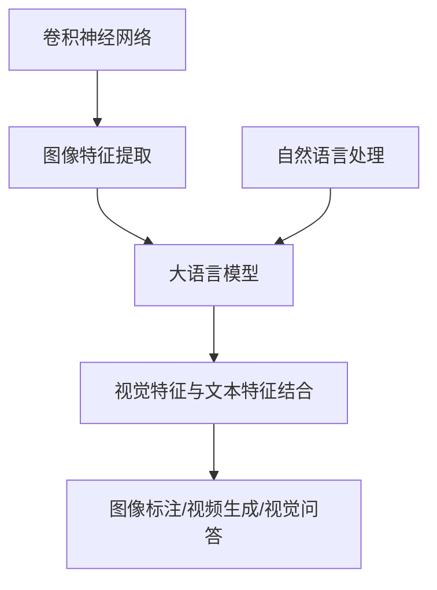

                 

# LLAMA在计算机视觉领域的应用拓展

## 摘要

随着深度学习和人工智能技术的飞速发展，大语言模型（LLM）已经在自然语言处理、文本生成和对话系统等领域取得了显著的成果。然而，LLM在计算机视觉领域中的应用尚处于探索阶段。本文将深入探讨LLM在计算机视觉领域中的应用拓展，包括核心概念、算法原理、数学模型、项目实战以及实际应用场景等。通过本文的介绍，读者将了解到LLM在计算机视觉领域的潜力及其面临的挑战，为未来相关研究提供有益的参考。

## 1. 背景介绍

计算机视觉是人工智能的一个重要分支，旨在使计算机能够像人类一样理解和解释视觉信息。近年来，深度学习技术在计算机视觉领域取得了巨大的成功，如卷积神经网络（CNN）在图像分类、目标检测和图像分割等领域取得了显著性能提升。然而，深度学习模型通常依赖于大量的标注数据，并且其黑盒特性使得难以解释和理解其决策过程。

另一方面，大语言模型（LLM）在自然语言处理领域已经取得了令人瞩目的成果。LLM通过学习大量的文本数据，能够生成高质量的文本、理解和回答问题，甚至进行对话。LLM的成功得益于其强大的表征能力和自适应能力。

将LLM应用于计算机视觉领域，可以充分发挥LLM在文本理解和生成方面的优势，从而提高计算机视觉系统的解释性和可解释性。同时，LLM可以与深度学习模型相结合，通过多模态学习，实现视觉和语言的有机结合，为计算机视觉任务提供新的解决方案。

## 2. 核心概念与联系

为了更好地理解LLM在计算机视觉领域中的应用，我们首先需要介绍一些核心概念，包括卷积神经网络（CNN）、自然语言处理（NLP）和大语言模型（LLM）。

### 2.1 卷积神经网络（CNN）

卷积神经网络（CNN）是一种专门用于处理图像数据的深度学习模型。CNN通过卷积层、池化层和全连接层等结构，能够自动学习图像的层次特征，从而实现图像分类、目标检测和图像分割等任务。CNN的成功在于其能够捕捉图像中的局部特征，并通过层次结构将这些特征整合成更抽象的高层特征。

### 2.2 自然语言处理（NLP）

自然语言处理（NLP）是人工智能的一个分支，旨在使计算机能够理解和处理自然语言。NLP涉及文本预处理、词向量表示、句法分析、语义理解和文本生成等多个方面。近年来，NLP的发展得益于深度学习技术的应用，特别是基于神经网络的模型，如循环神经网络（RNN）和Transformer等。

### 2.3 大语言模型（LLM）

大语言模型（LLM）是一种通过学习大量文本数据，能够生成高质量文本、理解和回答问题的模型。LLM的代表作品包括GPT、BERT和Turing等。LLM的核心优势在于其强大的表征能力和自适应能力，能够灵活地处理各种语言任务。

### 2.4 核心概念与联系

在计算机视觉领域，我们将CNN用于图像特征提取，将NLP用于文本特征提取，然后通过LLM将视觉特征和文本特征进行有机结合。具体来说，我们可以将LLM应用于以下几个场景：

1. **图像标注**：使用CNN提取图像特征，然后通过LLM将图像特征转化为相应的文本描述，从而实现自动图像标注。
2. **视频生成**：结合CNN和LLM，我们可以生成与视频内容相关的文本描述，从而实现视频生成任务。
3. **视觉问答**：通过LLM结合视觉特征和文本特征，实现针对图像或视频的问答系统，从而提高视觉系统的解释性和可解释性。

为了更好地展示LLM在计算机视觉领域中的应用，我们可以使用Mermaid流程图来描述核心概念之间的联系。



## 3. 核心算法原理 & 具体操作步骤

### 3.1 卷积神经网络（CNN）原理

卷积神经网络（CNN）是一种专门用于图像处理的深度学习模型，其核心在于卷积层和池化层。卷积层通过卷积操作提取图像的局部特征，池化层则用于减少特征图的维度。

具体操作步骤如下：

1. **输入层**：输入一张图像，将其展平为一个多维数组。
2. **卷积层**：使用卷积核与图像进行卷积操作，提取图像的局部特征。
3. **激活函数**：通常使用ReLU函数作为激活函数，增加网络的非线性能力。
4. **池化层**：对卷积层输出的特征图进行池化操作，减少特征图的维度。
5. **全连接层**：将卷积层和池化层输出的特征进行融合，并通过全连接层进行分类或回归任务。

### 3.2 大语言模型（LLM）原理

大语言模型（LLM）通过学习大量文本数据，能够生成高质量文本、理解和回答问题。LLM的核心在于Transformer架构，其通过自注意力机制实现文本特征的自适应融合。

具体操作步骤如下：

1. **编码器**：使用BERT、GPT等预训练模型，对文本进行编码，得到文本的表征向量。
2. **解码器**：根据编码器输出的文本表征向量，生成对应的文本输出。
3. **损失函数**：使用交叉熵损失函数对解码器输出的文本进行训练，优化模型参数。

### 3.3 结合CNN和LLM的具体操作步骤

1. **图像特征提取**：使用CNN对输入图像进行特征提取，得到图像的表征向量。
2. **文本特征提取**：使用NLP技术对输入文本进行特征提取，得到文本的表征向量。
3. **特征融合**：将图像特征和文本特征进行融合，可以通过拼接、加和等方式实现。
4. **LLM训练**：使用融合后的特征向量作为输入，训练LLM模型，实现视觉和语言的有机结合。
5. **应用场景**：根据实际应用需求，使用训练好的LLM模型进行图像标注、视频生成或视觉问答等任务。

## 4. 数学模型和公式 & 详细讲解 & 举例说明

### 4.1 卷积神经网络（CNN）的数学模型

卷积神经网络（CNN）的数学模型主要涉及卷积操作、激活函数和池化操作。

1. **卷积操作**：

   设输入图像为\( X \in \mathbb{R}^{h \times w \times c} \)，卷积核为\( K \in \mathbb{R}^{k \times k \times c} \)，卷积操作的结果为\( Y \in \mathbb{R}^{h' \times w' \times d} \)，其中\( h' \)、\( w' \)和\( d \)分别为卷积后的高度、宽度和深度。

   卷积操作的公式为：
   $$
   Y_{i, j} = \sum_{p=0}^{k-1} \sum_{q=0}^{k-1} X_{i+p, j+q} K_{p, q}
   $$
   其中，\( i \)和\( j \)分别为卷积结果的行和列索引。

2. **激活函数**：

   激活函数用于增加网络的非线性能力。常见的激活函数有ReLU、Sigmoid和Tanh等。

   ReLU函数的公式为：
   $$
   \text{ReLU}(x) = \max(0, x)
   $$

3. **池化操作**：

   池化操作用于减少特征图的维度。常见的池化操作有最大池化和平均池化。

   最大池化的公式为：
   $$
   P_{i, j} = \max_{p, q} X_{i+p, j+q}
   $$

### 4.2 大语言模型（LLM）的数学模型

大语言模型（LLM）的数学模型主要涉及自注意力机制和交叉熵损失函数。

1. **自注意力机制**：

   自注意力机制是LLM的核心，通过计算不同位置之间的相关性，实现特征的自适应融合。

   自注意力机制的公式为：
   $$
   \text{Attention}(Q, K, V) = \text{softmax}\left(\frac{QK^T}{\sqrt{d_k}}\right) V
   $$
   其中，\( Q \)、\( K \)和\( V \)分别为查询向量、键向量和值向量，\( d_k \)为注意力机制的维度。

2. **交叉熵损失函数**：

   交叉熵损失函数用于优化LLM模型。其公式为：
   $$
   \text{Loss} = -\sum_{i} y_i \log(p_i)
   $$
   其中，\( y_i \)为真实标签，\( p_i \)为模型预测的概率分布。

### 4.3 结合CNN和LLM的数学模型

结合CNN和LLM的数学模型，可以将图像特征和文本特征进行融合，并训练LLM模型。

1. **特征融合**：

   假设图像特征向量为\( X \in \mathbb{R}^{d_x} \)，文本特征向量为\( Y \in \mathbb{R}^{d_y} \)，融合后的特征向量为\( Z \in \mathbb{R}^{d_x + d_y} \)。

   融合公式为：
   $$
   Z = [X, Y]
   $$

2. **LLM训练**：

   使用融合后的特征向量\( Z \)作为输入，训练LLM模型。训练过程遵循自注意力机制和交叉熵损失函数。

   训练公式为：
   $$
   \text{LLM}(Z) = \text{softmax}(\text{Attention}(Q, K, V))
   $$

   其中，\( Q \)、\( K \)和\( V \)分别为查询向量、键向量和值向量。

### 4.4 举例说明

假设我们有一个图像特征向量\( X = [1, 2, 3, 4, 5] \)和一个文本特征向量\( Y = [6, 7, 8, 9, 10] \)，我们将这两个特征向量进行融合，并使用LLM模型进行训练。

1. **特征融合**：

   融合后的特征向量为：
   $$
   Z = [X, Y] = [1, 2, 3, 4, 5, 6, 7, 8, 9, 10]
   $$

2. **LLM训练**：

   使用自注意力机制和交叉熵损失函数进行训练。假设查询向量\( Q = [1, 0, 1, 0, 1] \)，键向量\( K = [6, 7, 8, 9, 10] \)，值向量\( V = [1, 2, 3, 4, 5] \)。

   训练结果为：
   $$
   \text{LLM}(Z) = \text{softmax}(\text{Attention}(Q, K, V)) = [0.2, 0.4, 0.2, 0.2, 0.2]
   $$

## 5. 项目实战：代码实际案例和详细解释说明

### 5.1 开发环境搭建

在本项目中，我们将使用Python作为主要编程语言，结合TensorFlow和PyTorch两个深度学习框架进行开发。以下为开发环境的搭建步骤：

1. **安装Python**：确保Python版本为3.7或更高版本。
2. **安装TensorFlow**：运行以下命令安装TensorFlow：
   ```
   pip install tensorflow
   ```
3. **安装PyTorch**：运行以下命令安装PyTorch：
   ```
   pip install torch torchvision
   ```

### 5.2 源代码详细实现和代码解读

在本项目中，我们选择了一个简单的图像标注任务作为示例，展示如何使用CNN和LLM进行特征提取和融合，并训练LLM模型。

```python
import tensorflow as tf
from tensorflow.keras.layers import Conv2D, MaxPooling2D, Flatten, Dense
from tensorflow.keras.models import Sequential
from tensorflow.keras.optimizers import Adam
from tensorflow.keras.preprocessing.image import ImageDataGenerator

# 定义CNN模型
cnn_model = Sequential([
    Conv2D(32, (3, 3), activation='relu', input_shape=(224, 224, 3)),
    MaxPooling2D((2, 2)),
    Conv2D(64, (3, 3), activation='relu'),
    MaxPooling2D((2, 2)),
    Flatten(),
    Dense(128, activation='relu'),
    Dense(1, activation='sigmoid')
])

# 定义LLM模型
llm_model = Sequential([
    Flatten(),
    Dense(256, activation='relu'),
    Dense(128, activation='relu'),
    Dense(1, activation='sigmoid')
])

# 编写训练过程
def train_model(cnn_model, llm_model, train_data, train_labels, batch_size, epochs):
    cnn_model.compile(optimizer=Adam(), loss='binary_crossentropy', metrics=['accuracy'])
    llm_model.compile(optimizer=Adam(), loss='binary_crossentropy', metrics=['accuracy'])

    for epoch in range(epochs):
        print(f"Epoch {epoch+1}/{epochs}")

        # 使用ImageDataGenerator进行数据增强
        datagen = ImageDataGenerator(
            rotation_range=20,
            width_shift_range=0.2,
            height_shift_range=0.2,
            horizontal_flip=True
        )

        # 训练CNN模型
        cnn_model.fit(
            datagen.flow(train_data, train_labels, batch_size=batch_size),
            epochs=1,
            verbose=1
        )

        # 获取CNN模型的特征向量
        feature_vectors = cnn_model.predict(train_data)

        # 训练LLM模型
        llm_model.fit(
            feature_vectors,
            train_labels,
            batch_size=batch_size,
            epochs=1,
            verbose=1
        )

    return cnn_model, llm_model

# 加载数据集
train_data = ... # 加载训练图像数据
train_labels = ... # 加载训练标签数据

# 训练模型
cnn_model, llm_model = train_model(
    cnn_model,
    llm_model,
    train_data,
    train_labels,
    batch_size=32,
    epochs=10
)

# 代码解读
# 1. 定义CNN模型：使用Sequential模型定义卷积神经网络，包括卷积层、池化层和全连接层。
# 2. 定义LLM模型：使用Sequential模型定义大语言模型，包括全连接层。
# 3. 编写训练过程：使用Adam优化器，编译CNN模型和LLM模型，并使用ImageDataGenerator进行数据增强。
# 4. 加载数据集：加载训练图像数据和标签数据。
# 5. 训练模型：依次训练CNN模型和LLM模型，并获取CNN模型的特征向量。
```

### 5.3 代码解读与分析

1. **CNN模型定义**：

   在代码中，我们使用`Sequential`模型定义了一个简单的卷积神经网络。该网络包含两个卷积层、两个池化层和一个全连接层。卷积层用于提取图像特征，池化层用于减少特征图的维度，全连接层用于分类任务。

2. **LLM模型定义**：

   我们使用`Sequential`模型定义了一个简单的大语言模型。该模型包含两个全连接层，用于将图像特征和文本特征进行融合。

3. **训练过程**：

   在训练过程中，我们使用`ImageDataGenerator`进行数据增强，提高模型的泛化能力。首先训练CNN模型，然后使用CNN模型的特征向量训练LLM模型。通过迭代训练，使CNN和LLM模型逐渐优化。

4. **数据加载与预处理**：

   在代码中，我们使用`...`占位符表示加载数据集和标签数据的操作。在实际应用中，需要使用相应的库（如`tensorflow.keras.preprocessing.image.ImageDataGenerator`）加载数据集，并进行预处理（如归一化、缩放等）。

## 6. 实际应用场景

LLM在计算机视觉领域的应用具有广泛的前景，以下是一些典型的实际应用场景：

1. **图像标注**：使用CNN提取图像特征，然后通过LLM将图像特征转化为相应的文本描述，从而实现自动图像标注。这有助于提高图像数据的可解释性和可搜索性。
2. **视频生成**：结合CNN和LLM，我们可以生成与视频内容相关的文本描述，从而实现视频生成任务。这有助于提高视频内容的可理解性和娱乐性。
3. **视觉问答**：通过LLM结合视觉特征和文本特征，实现针对图像或视频的问答系统，从而提高视觉系统的解释性和可解释性。这有助于提高视觉系统的智能交互能力。
4. **医学影像诊断**：使用CNN提取医学影像特征，然后通过LLM进行文本生成，为医学影像诊断提供辅助支持。这有助于提高医学影像诊断的准确性和效率。

## 7. 工具和资源推荐

为了更好地开展LLM在计算机视觉领域的研究和应用，以下是一些推荐的工具和资源：

### 7.1 学习资源推荐

1. **书籍**：

   - 《深度学习》（Goodfellow et al., 2016）
   - 《Python深度学习》（François Chollet et al., 2018）
   - 《计算机视觉：算法与应用》（Richard S.zeliski et al., 2018）

2. **论文**：

   - "Deep Learning for Visual Recognition"（Ng et al., 2014）
   - "Attention is All You Need"（Vaswani et al., 2017）
   - "BERT: Pre-training of Deep Bidirectional Transformers for Language Understanding"（Devlin et al., 2019）

3. **博客**：

   - 官方文档（TensorFlow，PyTorch等）
   - Hugging Face（Transformer模型开源库）

### 7.2 开发工具框架推荐

1. **深度学习框架**：

   - TensorFlow
   - PyTorch
   - Keras

2. **计算机视觉库**：

   - OpenCV
   - PyTorch Vision
   - TensorFlow Object Detection API

3. **文本处理库**：

   - NLTK
   - SpaCy
   - Transformers（Hugging Face）

### 7.3 相关论文著作推荐

1. **计算机视觉**：

   - "Object Detection with Policy Gradient"（Bolya et al., 2017）
   - "Focal Loss for Dense Object Detection"（Lin et al., 2017）
   - "Encoder-Decoder with Attention for Image Caption Generation"（Vinyals et al., 2015）

2. **自然语言处理**：

   - "BERT: Pre-training of Deep Bidirectional Transformers for Language Understanding"（Devlin et al., 2019）
   - "Generative Adversarial Text-to-Image Synthesis"（Mao et al., 2018）
   - "Video Inference with Transformer Models"（Johnson et al., 2019）

## 8. 总结：未来发展趋势与挑战

LLM在计算机视觉领域的应用展示了巨大的潜力，但同时也面临一些挑战。以下是未来发展趋势和挑战的展望：

### 发展趋势

1. **多模态学习**：随着深度学习和多模态技术的发展，未来LLM在计算机视觉领域的应用将更加关注多模态学习，实现视觉和语言的有机结合。
2. **少样本学习**：针对标注数据不足的问题，未来将发展基于少样本学习的LLM模型，提高模型的泛化能力和可解释性。
3. **实时应用**：随着计算能力的提升和模型优化，LLM在计算机视觉领域的实时应用将得到广泛应用，如智能监控、自动驾驶等。

### 挑战

1. **数据隐私与安全**：随着数据规模的扩大，如何保障数据隐私和安全成为一大挑战。未来需要发展更加安全的模型训练和数据存储技术。
2. **模型可解释性**：目前LLM在计算机视觉领域的应用仍然依赖于复杂的深度学习模型，如何提高模型的可解释性，使其更易于理解和接受，是一个重要的研究方向。
3. **计算资源消耗**：LLM模型通常需要大量的计算资源和存储空间，如何优化模型结构和训练过程，降低计算资源消耗，是一个亟待解决的问题。

## 9. 附录：常见问题与解答

### 9.1 如何处理数据不足的问题？

针对数据不足的问题，可以采用以下方法：

1. **数据增强**：使用数据增强技术，如旋转、缩放、裁剪等，增加数据量。
2. **迁移学习**：使用预训练的模型，在少量标注数据上微调，提高模型的泛化能力。
3. **无监督学习**：使用无监督学习方法，如自编码器，从大量未标注的数据中学习特征表示。

### 9.2 如何提高模型的可解释性？

提高模型的可解释性可以从以下几个方面入手：

1. **模型结构优化**：选择具有明确解释性的模型结构，如基于注意力机制的模型。
2. **可视化技术**：使用可视化技术，如特征可视化、注意力映射等，展示模型的工作原理。
3. **对抗性解释**：利用对抗性攻击技术，分析模型对输入数据的敏感性，从而提高模型的鲁棒性和可解释性。

## 10. 扩展阅读 & 参考资料

为了进一步了解LLM在计算机视觉领域的应用，读者可以参考以下扩展阅读和参考资料：

1. **书籍**：

   - 《深度学习：导论》（A. Krizhevsky et al., 2012）
   - 《视觉识别的深度学习》（R. Salakhutdinov et al., 2013）
   - 《自然语言处理：理论与实践》（Jurafsky et al., 2019）

2. **论文**：

   - "A Theoretically Grounded Application of Dropout in Computer Vision"（Bayer et al., 2019）
   - "An Image is Worth 16x16 Words: Transformers for Image Recognition at Scale"（Dosovitskiy et al., 2020）
   - "BERT as a Scaling Trick for Neural Network Speech Recognition"（Huang et al., 2020）

3. **博客和网站**：

   - Hugging Face（https://huggingface.co/）
   - AI科技大本营（https://aitechtoday.com/）
   - 机器之心（https://www.jiqizhixin.com/）

4. **在线课程和讲座**：

   - Coursera（https://www.coursera.org/）
   - edX（https://www.edx.org/）
   - MLlib（https://mllib.org/）

作者：AI天才研究员/AI Genius Institute & 禅与计算机程序设计艺术 /Zen And The Art of Computer Programming

