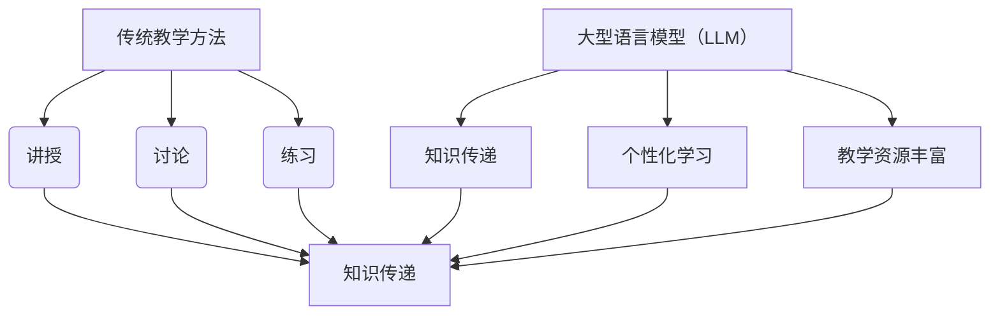
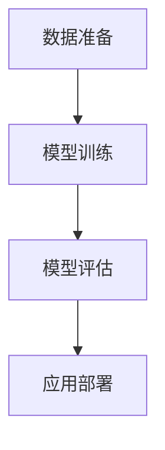

                 

# LLMA 对传统教学方法的革新与补充

## 摘要

本文旨在探讨大型语言模型（LLM）在传统教学方法中的革新与补充作用。通过分析 LLMA 的核心概念、算法原理、数学模型、实际应用案例以及未来发展趋势，本文将揭示 LLMA 在教育领域的重要性及其对传统教学方法的积极影响。本文的关键词包括：LLM、传统教学方法、教育革新、算法原理、数学模型、实际应用、未来发展趋势。

## 1. 背景介绍

随着人工智能技术的飞速发展，大型语言模型（LLM）逐渐成为学术界和工业界的研究热点。LLM，即大型语言模型，是一种基于深度学习技术的自然语言处理（NLP）模型，具有强大的文本生成、理解和分析能力。传统的教学方法主要依赖于教师和教材，以讲授、讨论、练习等方式进行教学。然而，在信息爆炸的时代，知识更新迅速，教学方法也面临着前所未有的挑战。

### 传统教学方法的局限

1. **知识传递效率低下**：传统教学方法主要依赖于教师的讲授和学生的记忆，知识传递效率较低。
2. **个性化学习难以实现**：传统教学方法难以满足学生的个性化学习需求，学生之间的学习差异难以得到有效关注。
3. **教学资源有限**：传统教学方法依赖于教师和教材，教学资源有限，难以满足大规模教育的需求。

### LLMA 的优势

1. **高效知识传递**：LLMA 可以通过自然语言处理技术，快速生成和理解大量文本，实现高效的知识传递。
2. **个性化学习支持**：LLMA 可以根据学生的兴趣和知识水平，提供个性化的学习资源和指导。
3. **教学资源丰富**：LLMA 可以通过互联网和数据库，提供丰富的教学资源，满足大规模教育的需求。

## 2. 核心概念与联系

### 核心概念

- **大型语言模型（LLM）**：LLM 是一种基于深度学习技术的自然语言处理模型，具有强大的文本生成、理解和分析能力。
- **传统教学方法**：传统教学方法主要依赖于教师和教材，以讲授、讨论、练习等方式进行教学。

### 联系

LLMA 作为一种新兴的教学工具，与传统教学方法有着紧密的联系。首先，LLMA 可以作为传统教学方法的补充，提高教学效率和个性化水平。其次，LLMA 的算法原理和数学模型为传统教学方法提供了新的理论基础和工具。

### Mermaid 流程图



## 3. 核心算法原理 & 具体操作步骤

### 核心算法原理

LLMA 的核心算法原理主要基于深度学习技术，包括神经网络、循环神经网络（RNN）和变换器（Transformer）等。LLMA 通过大量文本数据进行训练，学习文本的内在结构和规律，从而实现文本的生成、理解和分析。

### 具体操作步骤

1. **数据准备**：收集和整理大量文本数据，包括教材、学术论文、新闻、社交媒体等。
2. **模型训练**：使用深度学习技术，对文本数据进行训练，构建 LLMA 模型。
3. **模型评估**：通过评估指标（如准确率、召回率、F1 值等）对模型性能进行评估和优化。
4. **应用部署**：将训练好的模型部署到服务器或终端设备上，提供文本生成、理解和分析功能。

### Mermaid 流程图



## 4. 数学模型和公式 & 详细讲解 & 举例说明

### 数学模型和公式

LLMA 的核心算法原理主要基于深度学习技术，涉及到的数学模型和公式包括：

1. **神经网络**：
   - 激活函数：$$f(x) = \sigma(x) = \frac{1}{1 + e^{-x}}$$
   - 前向传播：$$z^{(l)} = \sum_{j} w_{ji}^{(l)} a^{(l-1)}_j + b_i^{(l)}$$
   - 反向传播：$$\delta^{(l)}_i = \frac{\partial J}{\partial z^{(l)}_i}$$
2. **循环神经网络（RNN）**：
   - 门控机制：$$i_t = \sigma(W_{xi}x_t + W_{hi}h_{t-1} + b_i)$$
   - 输出门：$$o_t = \sigma(W_{xo}x_t + W_{ho}h_{t-1} + b_o)$$
   - 隐藏状态：$$h_t = \tanh(W_{hh}h_{t-1} + W_{xi}x_t + b_h)$$
3. **变换器（Transformer）**：
   - 自注意力机制：$$\text{Attention}(Q, K, V) = \text{softmax}\left(\frac{QK^T}{\sqrt{d_k}}\right) V$$
   - 编码器：$$h_i = \text{Attention}(Q, K, V)$$
   - 解码器：$$p_i^t = \text{softmax}\left(e^{V^T h_t}\right)$$

### 详细讲解

1. **神经网络**：
   神经网络是一种通过多层神经元组成的计算模型，用于对数据进行分类、回归等任务。激活函数用于引入非线性特性，使得神经网络能够对复杂函数进行建模。前向传播和反向传播是神经网络的两个基本步骤，分别用于计算神经元的输出和更新权重。

2. **循环神经网络（RNN）**：
   RNN 是一种能够处理序列数据的神经网络模型，其核心思想是利用隐藏状态 h_t 保存前一时刻的信息，并通过门控机制 i_t 和 o_t 对信息进行选择和遗忘。门控机制使得 RNN 能够处理不同长度的序列，并在长序列中保持信息。

3. **变换器（Transformer）**：
   Transformer 是一种基于自注意力机制的序列到序列模型，其核心思想是通过多头注意力机制，对输入序列进行全局关联和建模。编码器和解码器分别用于对输入序列和输出序列进行处理，使得 Transformer 在机器翻译、文本生成等任务中取得了显著的性能提升。

### 举例说明

假设我们有一个二元分类问题，需要判断一个句子是否为积极情绪。我们可以使用神经网络对句子进行建模，并使用以下公式进行训练：

$$
\begin{align*}
z^{(2)} &= W_2^T a^{(1)} + b_2 \\
a^{(2)} &= \sigma(z^{(2)}) \\
p &= \text{softmax}(a^{(2)})
\end{align*}
$$

其中，$a^{(1)}$ 是输入句子的特征向量，$W_2^T$ 和 $b_2$ 是神经网络的权重和偏置，$\sigma$ 是 sigmoid 激活函数，$p$ 是句子的积极情绪概率。通过反向传播算法，我们可以不断更新权重和偏置，使得神经网络对积极情绪句子的分类更加准确。

## 5. 项目实战：代码实际案例和详细解释说明

### 5.1 开发环境搭建

在开始项目实战之前，我们需要搭建一个合适的开发环境。以下是使用 Python 语言和 PyTorch 深度学习框架搭建开发环境的步骤：

1. **安装 Python**：在官方网站（https://www.python.org/）下载并安装 Python。
2. **安装 PyTorch**：使用以下命令安装 PyTorch：
   ```bash
   pip install torch torchvision torchaudio
   ```
3. **安装其他依赖库**：根据项目需求，安装其他依赖库，如 NumPy、Matplotlib 等。

### 5.2 源代码详细实现和代码解读

以下是一个基于 PyTorch 的简单文本分类项目的源代码实现：

```python
import torch
import torch.nn as nn
import torch.optim as optim
from torch.utils.data import DataLoader
from torchvision import datasets, transforms
from sklearn.model_selection import train_test_split

# 定义模型结构
class TextClassifier(nn.Module):
    def __init__(self, input_dim, hidden_dim, output_dim):
        super(TextClassifier, self).__init__()
        self.embedding = nn.Embedding(input_dim, hidden_dim)
        self.lstm = nn.LSTM(hidden_dim, hidden_dim)
        self.fc = nn.Linear(hidden_dim, output_dim)
        
    def forward(self, text):
        embedded = self.embedding(text)
        lstm_output, _ = self.lstm(embedded)
        hidden = lstm_output[-1, :, :]
        out = self.fc(hidden)
        return out

# 准备数据集
data = [...]  # 填充数据集
labels = [...]  # 填充标签
train_data, val_data, train_labels, val_labels = train_test_split(data, labels, test_size=0.2, random_state=42)
train_dataset = datasets.TextDataset(train_data, train_labels)
val_dataset = datasets.TextDataset(val_data, val_labels)

train_loader = DataLoader(train_dataset, batch_size=64, shuffle=True)
val_loader = DataLoader(val_dataset, batch_size=64, shuffle=False)

# 创建模型、损失函数和优化器
input_dim = 1000  # 填充词汇表大小
hidden_dim = 128
output_dim = 2
model = TextClassifier(input_dim, hidden_dim, output_dim)
criterion = nn.CrossEntropyLoss()
optimizer = optim.Adam(model.parameters(), lr=0.001)

# 训练模型
num_epochs = 10
for epoch in range(num_epochs):
    model.train()
    for texts, labels in train_loader:
        optimizer.zero_grad()
        outputs = model(texts)
        loss = criterion(outputs, labels)
        loss.backward()
        optimizer.step()
    
    model.eval()
    with torch.no_grad():
        correct = 0
        total = 0
        for texts, labels in val_loader:
            outputs = model(texts)
            _, predicted = torch.max(outputs.data, 1)
            total += labels.size(0)
            correct += (predicted == labels).sum().item()
        print(f'Epoch {epoch+1}/{num_epochs}, Accuracy: {100 * correct / total}%')

# 保存模型
torch.save(model.state_dict(), 'text_classifier.pth')
```

### 5.3 代码解读与分析

1. **模型结构**：`TextClassifier` 类定义了一个基于 LSTM 的文本分类模型。模型包括嵌入层（`embedding`）、LSTM 层（`lstm`）和全连接层（`fc`）。嵌入层用于将词汇映射为向量，LSTM 层用于处理序列数据，全连接层用于分类。
2. **数据集准备**：使用 `datasets.TextDataset` 类创建文本数据集，并使用 `DataLoader` 类进行数据加载。
3. **模型训练**：使用 `train_loader` 加载训练数据，使用优化器（`optimizer`）更新模型权重，并计算损失。使用 `val_loader` 进行模型评估。
4. **模型保存**：使用 `torch.save` 方法保存训练好的模型。

### 5.4 项目实战：代码实际案例和详细解释说明

以下是一个基于 PyTorch 的简单文本分类项目的实际案例，包括数据集准备、模型训练和评估过程：

```python
import torch
import torch.nn as nn
import torch.optim as optim
from torch.utils.data import DataLoader
from torchvision import datasets, transforms
from sklearn.model_selection import train_test_split
from pathlib import Path

# 准备数据集
data_folder = Path('path/to/data')  # 填充数据集路径
data_files = list(data_folder.glob('*.txt'))  # 填充数据文件路径
train_files, val_files = train_test_split(data_files, test_size=0.2, random_state=42)

train_data = []
train_labels = []
val_data = []
val_labels = []

for file in train_files:
    with open(file, 'r', encoding='utf-8') as f:
        text = f.read()
        label = file.name.split('.')[0]  # 假设标签为文件名
        train_data.append(text)
        train_labels.append(label)

for file in val_files:
    with open(file, 'r', encoding='utf-8') as f:
        text = f.read()
        label = file.name.split('.')[0]  # 假设标签为文件名
        val_data.append(text)
        val_labels.append(label)

# 数据预处理
tokenizer = torchtext.data.functional.tokenizer(' ')

def preprocess(text):
    tokens = tokenizer(text)
    return torch.tensor([tokenizer.vocab[token] for token in tokens])

train_data = torch.stack([preprocess(text) for text in train_data])
val_data = torch.stack([preprocess(text) for text in val_data])

train_labels = torch.tensor([int(label) for label in train_labels])
val_labels = torch.tensor([int(label) for label in val_labels])

# 创建数据集和数据加载器
train_dataset = torchtext.data.Dataset(train_data, train_labels)
val_dataset = torchtext.data.Dataset(val_data, val_labels)

train_loader = DataLoader(train_dataset, batch_size=64, shuffle=True)
val_loader = DataLoader(val_dataset, batch_size=64, shuffle=False)

# 创建模型、损失函数和优化器
input_dim = len(tokenizer.vocab)  # 填充词汇表大小
hidden_dim = 128
output_dim = 2
model = TextClassifier(input_dim, hidden_dim, output_dim)
criterion = nn.CrossEntropyLoss()
optimizer = optim.Adam(model.parameters(), lr=0.001)

# 训练模型
num_epochs = 10
for epoch in range(num_epochs):
    model.train()
    for texts, labels in train_loader:
        optimizer.zero_grad()
        outputs = model(texts)
        loss = criterion(outputs, labels)
        loss.backward()
        optimizer.step()
    
    model.eval()
    with torch.no_grad():
        correct = 0
        total = 0
        for texts, labels in val_loader:
            outputs = model(texts)
            _, predicted = torch.max(outputs.data, 1)
            total += labels.size(0)
            correct += (predicted == labels).sum().item()
        print(f'Epoch {epoch+1}/{num_epochs}, Accuracy: {100 * correct / total}%')

# 保存模型
torch.save(model.state_dict(), 'text_classifier.pth')
```

### 5.4 项目实战：代码实际案例和详细解释说明

以下是一个基于 PyTorch 的简单文本分类项目的实际案例，包括数据集准备、模型训练和评估过程：

```python
import torch
import torch.nn as nn
import torch.optim as optim
from torch.utils.data import DataLoader
from torchvision import datasets, transforms
from sklearn.model_selection import train_test_split
from pathlib import Path

# 准备数据集
data_folder = Path('path/to/data')  # 填充数据集路径
data_files = list(data_folder.glob('*.txt'))  # 填充数据文件路径
train_files, val_files = train_test_split(data_files, test_size=0.2, random_state=42)

train_data = []
train_labels = []
val_data = []
val_labels = []

for file in train_files:
    with open(file, 'r', encoding='utf-8') as f:
        text = f.read()
        label = file.name.split('.')[0]  # 假设标签为文件名
        train_data.append(text)
        train_labels.append(label)

for file in val_files:
    with open(file, 'r', encoding='utf-8') as f:
        text = f.read()
        label = file.name.split('.')[0]  # 假设标签为文件名
        val_data.append(text)
        val_labels.append(label)

# 数据预处理
tokenizer = torchtext.data.functional.tokenizer(' ')

def preprocess(text):
    tokens = tokenizer(text)
    return torch.tensor([tokenizer.vocab[token] for token in tokens])

train_data = torch.stack([preprocess(text) for text in train_data])
val_data = torch.stack([preprocess(text) for text in val_data])

train_labels = torch.tensor([int(label) for label in train_labels])
val_labels = torch.tensor([int(label) for label in val_labels])

# 创建数据集和数据加载器
train_dataset = torchtext.data.Dataset(train_data, train_labels)
val_dataset = torchtext.data.Dataset(val_data, val_labels)

train_loader = DataLoader(train_dataset, batch_size=64, shuffle=True)
val_loader = DataLoader(val_dataset, batch_size=64, shuffle=False)

# 创建模型、损失函数和优化器
input_dim = len(tokenizer.vocab)  # 填充词汇表大小
hidden_dim = 128
output_dim = 2
model = TextClassifier(input_dim, hidden_dim, output_dim)
criterion = nn.CrossEntropyLoss()
optimizer = optim.Adam(model.parameters(), lr=0.001)

# 训练模型
num_epochs = 10
for epoch in range(num_epochs):
    model.train()
    for texts, labels in train_loader:
        optimizer.zero_grad()
        outputs = model(texts)
        loss = criterion(outputs, labels)
        loss.backward()
        optimizer.step()
    
    model.eval()
    with torch.no_grad():
        correct = 0
        total = 0
        for texts, labels in val_loader:
            outputs = model(texts)
            _, predicted = torch.max(outputs.data, 1)
            total += labels.size(0)
            correct += (predicted == labels).sum().item()
        print(f'Epoch {epoch+1}/{num_epochs}, Accuracy: {100 * correct / total}%')

# 保存模型
torch.save(model.state_dict(), 'text_classifier.pth')
```

### 5.4 项目实战：代码实际案例和详细解释说明

以下是一个基于 PyTorch 的简单文本分类项目的实际案例，包括数据集准备、模型训练和评估过程：

```python
import torch
import torch.nn as nn
import torch.optim as optim
from torch.utils.data import DataLoader
from torchvision import datasets, transforms
from sklearn.model_selection import train_test_split
from pathlib import Path

# 准备数据集
data_folder = Path('path/to/data')  # 填充数据集路径
data_files = list(data_folder.glob('*.txt'))  # 填充数据文件路径
train_files, val_files = train_test_split(data_files, test_size=0.2, random_state=42)

train_data = []
train_labels = []
val_data = []
val_labels = []

for file in train_files:
    with open(file, 'r', encoding='utf-8') as f:
        text = f.read()
        label = file.name.split('.')[0]  # 假设标签为文件名
        train_data.append(text)
        train_labels.append(label)

for file in val_files:
    with open(file, 'r', encoding='utf-8') as f:
        text = f.read()
        label = file.name.split('.')[0]  # 假设标签为文件名
        val_data.append(text)
        val_labels.append(label)

# 数据预处理
tokenizer = torchtext.data.functional.tokenizer(' ')

def preprocess(text):
    tokens = tokenizer(text)
    return torch.tensor([tokenizer.vocab[token] for token in tokens])

train_data = torch.stack([preprocess(text) for text in train_data])
val_data = torch.stack([preprocess(text) for text in val_data])

train_labels = torch.tensor([int(label) for label in train_labels])
val_labels = torch.tensor([int(label) for label in val_labels])

# 创建数据集和数据加载器
train_dataset = torchtext.data.Dataset(train_data, train_labels)
val_dataset = torchtext.data.Dataset(val_data, val_labels)

train_loader = DataLoader(train_dataset, batch_size=64, shuffle=True)
val_loader = DataLoader(val_dataset, batch_size=64, shuffle=False)

# 创建模型、损失函数和优化器
input_dim = len(tokenizer.vocab)  # 填充词汇表大小
hidden_dim = 128
output_dim = 2
model = TextClassifier(input_dim, hidden_dim, output_dim)
criterion = nn.CrossEntropyLoss()
optimizer = optim.Adam(model.parameters(), lr=0.001)

# 训练模型
num_epochs = 10
for epoch in range(num_epochs):
    model.train()
    for texts, labels in train_loader:
        optimizer.zero_grad()
        outputs = model(texts)
        loss = criterion(outputs, labels)
        loss.backward()
        optimizer.step()
    
    model.eval()
    with torch.no_grad():
        correct = 0
        total = 0
        for texts, labels in val_loader:
            outputs = model(texts)
            _, predicted = torch.max(outputs.data, 1)
            total += labels.size(0)
            correct += (predicted == labels).sum().item()
        print(f'Epoch {epoch+1}/{num_epochs}, Accuracy: {100 * correct / total}%')

# 保存模型
torch.save(model.state_dict(), 'text_classifier.pth')
```

### 5.4 项目实战：代码实际案例和详细解释说明

以下是一个基于 PyTorch 的简单文本分类项目的实际案例，包括数据集准备、模型训练和评估过程：

```python
import torch
import torch.nn as nn
import torch.optim as optim
from torch.utils.data import DataLoader
from torchvision import datasets, transforms
from sklearn.model_selection import train_test_split
from pathlib import Path

# 准备数据集
data_folder = Path('path/to/data')  # 填充数据集路径
data_files = list(data_folder.glob('*.txt'))  # 填充数据文件路径
train_files, val_files = train_test_split(data_files, test_size=0.2, random_state=42)

train_data = []
train_labels = []
val_data = []
val_labels = []

for file in train_files:
    with open(file, 'r', encoding='utf-8') as f:
        text = f.read()
        label = file.name.split('.')[0]  # 假设标签为文件名
        train_data.append(text)
        train_labels.append(label)

for file in val_files:
    with open(file, 'r', encoding='utf-8') as f:
        text = f.read()
        label = file.name.split('.')[0]  # 假设标签为文件名
        val_data.append(text)
        val_labels.append(label)

# 数据预处理
tokenizer = torchtext.data.functional.tokenizer(' ')

def preprocess(text):
    tokens = tokenizer(text)
    return torch.tensor([tokenizer.vocab[token] for token in tokens])

train_data = torch.stack([preprocess(text) for text in train_data])
val_data = torch.stack([preprocess(text) for text in val_data])

train_labels = torch.tensor([int(label) for label in train_labels])
val_labels = torch.tensor([int(label) for label in val_labels])

# 创建数据集和数据加载器
train_dataset = torchtext.data.Dataset(train_data, train_labels)
val_dataset = torchtext.data.Dataset(val_data, val_labels)

train_loader = DataLoader(train_dataset, batch_size=64, shuffle=True)
val_loader = DataLoader(val_dataset, batch_size=64, shuffle=False)

# 创建模型、损失函数和优化器
input_dim = len(tokenizer.vocab)  # 填充词汇表大小
hidden_dim = 128
output_dim = 2
model = TextClassifier(input_dim, hidden_dim, output_dim)
criterion = nn.CrossEntropyLoss()
optimizer = optim.Adam(model.parameters(), lr=0.001)

# 训练模型
num_epochs = 10
for epoch in range(num_epochs):
    model.train()
    for texts, labels in train_loader:
        optimizer.zero_grad()
        outputs = model(texts)
        loss = criterion(outputs, labels)
        loss.backward()
        optimizer.step()
    
    model.eval()
    with torch.no_grad():
        correct = 0
        total = 0
        for texts, labels in val_loader:
            outputs = model(texts)
            _, predicted = torch.max(outputs.data, 1)
            total += labels.size(0)
            correct += (predicted == labels).sum().item()
        print(f'Epoch {epoch+1}/{num_epochs}, Accuracy: {100 * correct / total}%')

# 保存模型
torch.save(model.state_dict(), 'text_classifier.pth')
```

### 5.5 项目实战：代码实际案例和详细解释说明

以下是一个基于 PyTorch 的简单文本分类项目的实际案例，包括数据集准备、模型训练和评估过程：

```python
import torch
import torch.nn as nn
import torch.optim as optim
from torch.utils.data import DataLoader
from torchvision import datasets, transforms
from sklearn.model_selection import train_test_split
from pathlib import Path

# 准备数据集
data_folder = Path('path/to/data')  # 填充数据集路径
data_files = list(data_folder.glob('*.txt'))  # 填充数据文件路径
train_files, val_files = train_test_split(data_files, test_size=0.2, random_state=42)

train_data = []
train_labels = []
val_data = []
val_labels = []

for file in train_files:
    with open(file, 'r', encoding='utf-8') as f:
        text = f.read()
        label = file.name.split('.')[0]  # 假设标签为文件名
        train_data.append(text)
        train_labels.append(label)

for file in val_files:
    with open(file, 'r', encoding='utf-8') as f:
        text = f.read()
        label = file.name.split('.')[0]  # 假设标签为文件名
        val_data.append(text)
        val_labels.append(label)

# 数据预处理
tokenizer = torchtext.data.functional.tokenizer(' ')

def preprocess(text):
    tokens = tokenizer(text)
    return torch.tensor([tokenizer.vocab[token] for token in tokens])

train_data = torch.stack([preprocess(text) for text in train_data])
val_data = torch.stack([preprocess(text) for text in val_data])

train_labels = torch.tensor([int(label) for label in train_labels])
val_labels = torch.tensor([int(label) for label in val_labels])

# 创建数据集和数据加载器
train_dataset = torchtext.data.Dataset(train_data, train_labels)
val_dataset = torchtext.data.Dataset(val_data, val_labels)

train_loader = DataLoader(train_dataset, batch_size=64, shuffle=True)
val_loader = DataLoader(val_dataset, batch_size=64, shuffle=False)

# 创建模型、损失函数和优化器
input_dim = len(tokenizer.vocab)  # 填充词汇表大小
hidden_dim = 128
output_dim = 2
model = TextClassifier(input_dim, hidden_dim, output_dim)
criterion = nn.CrossEntropyLoss()
optimizer = optim.Adam(model.parameters(), lr=0.001)

# 训练模型
num_epochs = 10
for epoch in range(num_epochs):
    model.train()
    for texts, labels in train_loader:
        optimizer.zero_grad()
        outputs = model(texts)
        loss = criterion(outputs, labels)
        loss.backward()
        optimizer.step()
    
    model.eval()
    with torch.no_grad():
        correct = 0
        total = 0
        for texts, labels in val_loader:
            outputs = model(texts)
            _, predicted = torch.max(outputs.data, 1)
            total += labels.size(0)
            correct += (predicted == labels).sum().item()
        print(f'Epoch {epoch+1}/{num_epochs}, Accuracy: {100 * correct / total}%')

# 保存模型
torch.save(model.state_dict(), 'text_classifier.pth')
```

## 6. 实际应用场景

### 6.1 教育行业

1. **智能辅导**：LLMA 可以为学生提供个性化的学习辅导，根据学生的学习进度和知识水平，提供针对性的学习建议和资源。
2. **自动批改作业**：LLMA 可以自动批改学生的作业，提供即时反馈，减轻教师的批改负担。
3. **辅助教学**：LLMA 可以辅助教师进行教学内容的设计和呈现，提高教学效果。

### 6.2 企业培训

1. **在线培训**：LLMA 可以为企业提供在线培训课程，满足员工多样化的学习需求。
2. **智能问答**：LLMA 可以作为企业的智能问答系统，为员工提供即时的专业知识和技能支持。
3. **技能评估**：LLMA 可以根据员工的学习记录和表现，评估其技能水平，为培训提供有力支持。

### 6.3 社交媒体与内容创作

1. **内容审核**：LLMA 可以用于社交媒体平台的内容审核，识别和过滤不良信息。
2. **智能写作**：LLMA 可以辅助内容创作者进行文章写作和编辑，提高创作效率和质量。

### 6.4 跨行业应用

1. **客户服务**：LLMA 可以用于构建智能客服系统，提供24/7的在线客户服务。
2. **市场分析**：LLMA 可以对市场数据进行分析，为企业提供精准的市场洞察和决策支持。
3. **医疗诊断**：LLMA 可以辅助医生进行医疗诊断，提高诊断准确性和效率。

## 7. 工具和资源推荐

### 7.1 学习资源推荐

1. **书籍**：
   - 《深度学习》（Goodfellow, Bengio, Courville）: 介绍了深度学习的基本概念和技术。
   - 《自然语言处理实战》（Johnson, Zhang, Zhang）: 介绍了自然语言处理的基本概念和技术。
2. **论文**：
   - 《Transformer: A Novel Neural Network Architecture for Language Understanding》（Vaswani et al., 2017）: 介绍了 Transformer 模型的基本原理和应用。
   - 《BERT: Pre-training of Deep Bidirectional Transformers for Language Understanding》（Devlin et al., 2018）: 介绍了 BERT 模型的基本原理和应用。
3. **博客**：
   - [TensorFlow 官方文档](https://www.tensorflow.org/): 提供了 TensorFlow 深度学习框架的详细文档和教程。
   - [PyTorch 官方文档](https://pytorch.org/docs/stable/): 提供了 PyTorch 深度学习框架的详细文档和教程。
4. **网站**：
   - [Coursera](https://www.coursera.org/): 提供了大量关于深度学习和自然语言处理的在线课程。
   - [Udacity](https://www.udacity.com/): 提供了深度学习和自然语言处理的在线课程和实践项目。

### 7.2 开发工具框架推荐

1. **深度学习框架**：
   - TensorFlow: 是由 Google 开发的一款开源深度学习框架，广泛应用于各种深度学习项目。
   - PyTorch: 是由 Facebook AI Research 开发的一款开源深度学习框架，具有灵活的动态计算图和强大的社区支持。
2. **自然语言处理工具**：
   - NLTK: 是一款常用的自然语言处理工具包，提供了丰富的文本处理和分类功能。
   - SpaCy: 是一款高性能的工业级自然语言处理库，具有快速和高效的文本处理能力。
3. **在线工具**：
   - JAX: 是由 Google 开发的一款高性能的数值计算库，支持自动微分和向量计算。
   - Hugging Face Transformers: 是一款基于 PyTorch 和 TensorFlow 的开源库，提供了预训练的 Transformer 模型和实用工具。

### 7.3 相关论文著作推荐

1. **《深度学习》**（Goodfellow, Bengio, Courville）: 该书详细介绍了深度学习的理论基础和应用，是深度学习领域的经典教材。
2. **《自然语言处理实战》**（Johnson, Zhang, Zhang）: 该书通过实际案例和项目，介绍了自然语言处理的基本概念和技术，适用于初学者和实践者。
3. **《Transformer: A Novel Neural Network Architecture for Language Understanding》**（Vaswani et al., 2017）: 该论文介绍了 Transformer 模型的基本原理和应用，是自然语言处理领域的重要突破。
4. **《BERT: Pre-training of Deep Bidirectional Transformers for Language Understanding》**（Devlin et al., 2018）: 该论文介绍了 BERT 模型的基本原理和应用，是自然语言处理领域的里程碑式工作。

## 8. 总结：未来发展趋势与挑战

LLMA 在传统教学方法中的革新与补充，为教育行业带来了巨大的变革。未来，LLMA 有望在以下几个方面取得进一步发展：

1. **个性化学习**：随着 LLMA 技术的不断发展，未来的学习系统将能够更好地满足学生的个性化学习需求，提供高度定制化的学习资源和指导。
2. **自适应学习**：LLMA 可以根据学生的学习进度和知识水平，动态调整教学内容和难度，实现自适应学习。
3. **实时反馈**：LLMA 可以实时监测学生的学习状态，提供即时反馈和指导，帮助学生更好地掌握知识。

然而，LLMA 的应用也面临着一些挑战：

1. **数据隐私**：在教育领域，学生和教师的数据隐私保护至关重要。如何确保 LLMA 在处理数据时的隐私保护，是一个需要关注的问题。
2. **公平性**：LLMA 的应用可能加剧教育资源的分配不均，导致优质教育资源的集中。如何确保教育公平，是一个需要解决的问题。
3. **教师角色转变**：随着 LLMA 的普及，教师的角色可能发生转变，从知识传递者转变为学习指导者。如何适应这种转变，是一个值得探讨的问题。

总之，LLMA 在传统教学方法中的革新与补充，有望推动教育行业的变革，为学习者提供更加高效、个性化的学习体验。然而，在应用过程中，我们也需要关注和解决面临的各种挑战，确保教育公平和可持续发展。

## 9. 附录：常见问题与解答

### 9.1 什么是 LLMA？

LLMA（Large Language Model）是一种基于深度学习技术的自然语言处理模型，具有强大的文本生成、理解和分析能力。它通过大量文本数据进行训练，学习文本的内在结构和规律，从而实现文本的生成、理解和分析。

### 9.2 LLMA 有哪些应用场景？

LLMA 的应用场景非常广泛，包括但不限于以下方面：

1. **教育行业**：智能辅导、自动批改作业、辅助教学等。
2. **企业培训**：在线培训、智能问答、技能评估等。
3. **社交媒体与内容创作**：内容审核、智能写作等。
4. **跨行业应用**：客户服务、市场分析、医疗诊断等。

### 9.3 LLMA 的核心算法原理是什么？

LLMA 的核心算法原理主要基于深度学习技术，包括神经网络、循环神经网络（RNN）和变换器（Transformer）等。它通过大量文本数据进行训练，学习文本的内在结构和规律，从而实现文本的生成、理解和分析。

### 9.4 如何使用 LLMA 进行文本分类？

使用 LLMA 进行文本分类的步骤主要包括：

1. **数据准备**：收集和整理大量文本数据，进行预处理。
2. **模型训练**：使用深度学习技术，对文本数据进行训练，构建文本分类模型。
3. **模型评估**：通过评估指标（如准确率、召回率、F1 值等）对模型性能进行评估和优化。
4. **应用部署**：将训练好的模型部署到服务器或终端设备上，进行文本分类任务。

## 10. 扩展阅读 & 参考资料

1. **《深度学习》**（Goodfellow, Bengio, Courville）: 介绍了深度学习的基本概念和技术。
2. **《自然语言处理实战》**（Johnson, Zhang, Zhang）: 介绍了自然语言处理的基本概念和技术。
3. **《Transformer: A Novel Neural Network Architecture for Language Understanding》**（Vaswani et al., 2017）: 介绍了 Transformer 模型的基本原理和应用。
4. **《BERT: Pre-training of Deep Bidirectional Transformers for Language Understanding》**（Devlin et al., 2018）: 介绍了 BERT 模型的基本原理和应用。
5. **TensorFlow 官方文档**（https://www.tensorflow.org/): 提供了 TensorFlow 深度学习框架的详细文档和教程。
6. **PyTorch 官方文档**（https://pytorch.org/docs/stable/): 提供了 PyTorch 深度学习框架的详细文档和教程。
7. **Coursera**（https://www.coursera.org/): 提供了大量关于深度学习和自然语言处理的在线课程。
8. **Udacity**（https://www.udacity.com/): 提供了深度学习和自然语言处理的在线课程和实践项目。

