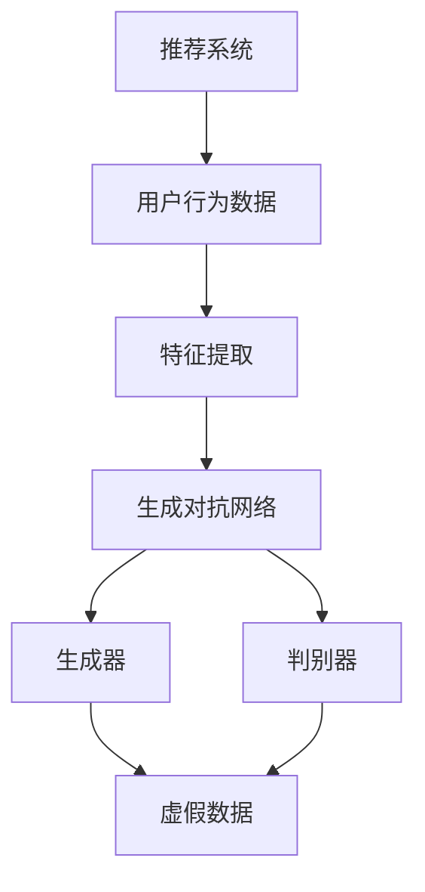

                 

### 背景介绍

推荐系统作为现代信息社会中的一项关键技术，已经深入到我们日常生活的方方面面，如电子商务、社交媒体、内容推荐等。然而，传统的推荐系统在处理复杂用户行为、实时性需求以及长尾效应等方面仍存在诸多局限性。近年来，大规模语言模型（Large Language Models，LLM）的快速发展，为我们提供了一种全新的方法来改进推荐系统。

LLM，如GPT系列、BERT系列等，通过处理海量的文本数据，能够生成与人类语言高度相似的文本。这一特性使得LLM在理解用户意图、提取用户特征、生成个性化内容等方面具有巨大潜力。同时，随着计算能力的提升和深度学习技术的进步，LLM的训练成本和效果都在不断提高，这使得其在推荐系统中的应用成为可能。

在推荐系统中，用户行为数据通常包括浏览记录、购买历史、搜索关键词等。传统的推荐系统主要依赖基于内容的过滤（Content-based Filtering）和协同过滤（Collaborative Filtering）等方法，但这些方法往往只能捕捉到用户行为的一部分，难以充分理解用户的复杂需求。而LLM能够通过对用户行为数据进行深度学习，提取出更多的潜在特征，从而更准确地预测用户的喜好和需求。

此外，LLM还可以通过生成对抗网络（GANs）等方法生成虚假数据，用于训练和测试推荐系统的稳定性。这种对抗性训练方法能够提高推荐系统的鲁棒性，避免因数据偏差导致的推荐结果偏差。

总的来说，LLM在推荐系统中的应用具有显著的优势。一方面，它能够更深入地理解用户行为和需求，提高推荐系统的准确性；另一方面，它能够通过生成对抗性训练提高系统的鲁棒性，减少因数据偏差导致的错误推荐。这些优势使得LLM在推荐系统的改进中具有巨大的潜力，值得我们进一步研究和探讨。### 核心概念与联系

为了更好地理解LLM在推荐系统中的应用，我们首先需要了解几个核心概念：推荐系统、用户行为数据、特征提取和生成对抗网络（GANs）。以下将详细阐述这些概念及其相互联系，并通过Mermaid流程图展示其架构。

#### 推荐系统

推荐系统是一种信息过滤技术，旨在根据用户的兴趣和偏好，向用户推荐他们可能感兴趣的内容或产品。推荐系统通常分为基于内容的过滤（Content-based Filtering）和协同过滤（Collaborative Filtering）两大类。

- **基于内容的过滤**：这种方法根据用户过去的行为或偏好，分析用户感兴趣的内容特征，然后推荐具有相似特征的内容。例如，如果用户经常浏览新闻，推荐系统可能会推荐其他用户也感兴趣的新闻。

- **协同过滤**：这种方法通过分析用户之间的相似性来推荐内容。协同过滤又分为用户基于的协同过滤（User-based Collaborative Filtering）和物品基于的协同过滤（Item-based Collaborative Filtering）。用户基于的协同过滤会寻找与目标用户相似的其他用户，并推荐这些用户喜欢的项目；物品基于的协同过滤则会寻找与目标物品相似的其他物品，并推荐给用户。

#### 用户行为数据

用户行为数据是推荐系统的核心输入，包括浏览记录、购买历史、搜索关键词等。这些数据通常通过数据采集工具和日志文件收集。

- **浏览记录**：用户在网站或应用上的浏览行为，如访问的页面、停留时间等。
- **购买历史**：用户的历史购买记录，包括购买的商品、时间、价格等。
- **搜索关键词**：用户在搜索框中输入的关键词。

#### 特征提取

特征提取是从原始用户行为数据中提取出对推荐系统有用的特征的过程。特征提取的质量直接影响推荐系统的性能。

- **用户特征**：如用户的年龄、性别、地理位置、购买频率等。
- **物品特征**：如物品的类别、价格、品牌、评分等。

#### 生成对抗网络（GANs）

生成对抗网络（GANs）是一种深度学习模型，由生成器和判别器组成。生成器的目的是生成与真实数据相似的数据，判别器的目的是区分真实数据和生成数据。通过两个模型的对抗训练，生成器能够逐渐生成更加真实的数据。

- **生成器（Generator）**：生成器生成虚假数据，如虚假的用户行为数据或物品数据。
- **判别器（Discriminator）**：判别器判断生成数据是否真实，用于训练生成器。

#### Mermaid流程图

以下是一个简化的Mermaid流程图，展示了推荐系统中LLM的架构和各核心概念之间的联系：



在这个流程图中，推荐系统通过用户行为数据生成特征，然后利用GANs生成虚假数据。生成器负责生成虚假数据，判别器用于评估虚假数据的真实性。通过这种对抗性训练，推荐系统能够提高对用户行为和需求的准确理解，从而提高推荐效果。

总的来说，LLM通过深度学习和生成对抗网络等技术，能够从原始用户行为数据中提取出更多的潜在特征，生成虚假数据进行对抗性训练，从而提高推荐系统的准确性和鲁棒性。这一过程不仅有助于理解用户的复杂需求，还能够应对数据偏差和噪声问题，为推荐系统带来了全新的改进方向。### 核心算法原理 & 具体操作步骤

为了更好地理解LLM在推荐系统中的应用，我们将深入探讨其核心算法原理，包括大规模语言模型的构建、用户行为数据的处理、特征提取以及生成对抗网络的训练步骤。以下是具体的操作步骤：

#### 1. 大规模语言模型的构建

大规模语言模型（如GPT系列、BERT系列等）是LLM在推荐系统中的核心组件。构建大规模语言模型通常包括以下几个步骤：

1. **数据收集**：收集大规模的文本数据，如网页、书籍、新闻、社交媒体等。这些数据将作为模型训练的输入。
2. **数据预处理**：对收集到的文本数据进行清洗和预处理，包括去除停用词、标点符号、转换为小写等操作。
3. **数据分词**：将预处理后的文本数据分成单词或子词（Subword），以便模型能够处理。
4. **构建词汇表**：将所有出现的单词或子词构建成一个词汇表，并为每个词汇分配一个唯一的索引。
5. **序列编码**：将文本数据编码为序列，每个单词或子词对应一个索引。
6. **训练模型**：使用训练数据训练大规模语言模型，如使用Transformer架构进行训练。训练过程中，模型将学习预测下一个单词或子词的概率。

#### 2. 用户行为数据的处理

在构建大规模语言模型之后，我们需要处理用户行为数据。以下是用户行为数据的处理步骤：

1. **数据收集**：从网站、应用或数据库中收集用户行为数据，如浏览记录、购买历史、搜索关键词等。
2. **数据预处理**：对用户行为数据清洗和预处理，去除无效数据、填补缺失值等。
3. **数据编码**：将用户行为数据编码为模型能够接受的格式，如将浏览记录编码为序列。
4. **特征提取**：使用大规模语言模型提取用户行为数据中的潜在特征。例如，可以使用BERT模型对用户行为数据进行编码，然后使用其输出的隐藏层作为特征。

#### 3. 特征提取

特征提取是推荐系统中的一个关键步骤，目标是提取出对推荐有价值的特征。以下是特征提取的具体步骤：

1. **嵌入层**：将用户行为数据输入到大规模语言模型中，模型将生成一个固定长度的嵌入向量表示。这个嵌入向量包含了用户行为数据中的潜在特征。
2. **聚合操作**：对多个嵌入向量进行聚合操作，如取平均或拼接。聚合操作可以将多个特征融合成一个向量。
3. **特征选择**：根据特征的重要性选择部分特征进行推荐。特征选择可以通过统计方法、机器学习算法或专家知识来实现。

#### 4. 生成对抗网络的训练

生成对抗网络（GANs）是LLM在推荐系统中的一个重要组件，用于生成虚假数据并进行对抗性训练。以下是GANs的训练步骤：

1. **生成器训练**：生成器生成虚假用户行为数据。训练过程中，生成器尝试生成与真实数据相似的数据，判别器则试图区分真实数据和生成数据。
2. **判别器训练**：判别器训练过程中，判别器学习区分真实数据和生成数据。通过对抗性训练，生成器和判别器不断迭代，生成器逐渐提高生成数据的真实性，判别器逐渐提高区分能力。
3. **对抗性训练**：对抗性训练是一个循环过程，生成器和判别器交替训练。每次迭代后，生成器和判别器都进行参数更新，以达到更好的训练效果。

#### 5. 推荐系统训练

在完成生成对抗网络的训练后，我们可以使用训练好的模型进行推荐系统的训练。以下是推荐系统训练的步骤：

1. **用户特征提取**：使用大规模语言模型提取用户特征，如使用BERT模型提取用户行为数据的嵌入向量。
2. **物品特征提取**：使用相同的大规模语言模型提取物品特征。
3. **模型训练**：将用户特征和物品特征输入到推荐模型中，如使用矩阵分解（Matrix Factorization）算法或神经网络（Neural Networks）算法进行训练。训练过程中，模型学习预测用户对物品的偏好。
4. **模型评估**：使用评估指标（如准确率、召回率、F1值等）评估推荐系统的性能，并根据评估结果调整模型参数。

通过以上步骤，LLM能够在推荐系统中发挥重要作用，提高推荐系统的准确性和鲁棒性。大规模语言模型通过深度学习和生成对抗网络等技术，能够从原始用户行为数据中提取出更多的潜在特征，生成虚假数据进行对抗性训练，从而提高推荐系统的性能。### 数学模型和公式 & 详细讲解 & 举例说明

在深入了解LLM在推荐系统中的应用时，我们需要探讨其背后的数学模型和公式。以下将详细介绍大规模语言模型的训练过程、用户行为数据的特征提取、生成对抗网络的训练过程以及推荐系统的评估指标。

#### 1. 大规模语言模型的训练过程

大规模语言模型的训练过程主要包括两个核心组件：生成器（Generator）和判别器（Discriminator）。以下是具体的数学模型和公式：

**生成器（Generator）**

生成器的目标是生成与真实数据相似的数据。在训练过程中，生成器尝试预测下一个单词或子词的概率，公式如下：

\[ P(y_t | y_{t-1}, \theta_G) = \text{softmax}(G(y_{t-1}; \theta_G) \]

其中，\( y_t \) 表示当前单词或子词，\( y_{t-1} \) 表示前一个单词或子词，\( \theta_G \) 表示生成器的参数。

**判别器（Discriminator）**

判别器的目标是区分真实数据和生成数据。在训练过程中，判别器尝试预测当前数据是真实数据还是生成数据，公式如下：

\[ P(y_t | y_{t-1}, \theta_D) = \text{softmax}(D(y_{t-1}; \theta_D) \]

其中，\( y_t \) 表示当前单词或子词，\( y_{t-1} \) 表示前一个单词或子词，\( \theta_D \) 表示判别器的参数。

**生成对抗网络（GAN）**

生成对抗网络（GAN）的训练过程是通过两个模型的对抗性训练实现的。以下是GAN的训练目标：

\[ \min_G \max_D V(D, G) = \mathbb{E}_{x \sim p_{\text{data}}(x)}[\log D(x)] + \mathbb{E}_{z \sim p_{\text{noise}}(z)}[\log (1 - D(G(z)))] \]

其中，\( x \) 表示真实数据，\( z \) 表示噪声数据，\( p_{\text{data}}(x) \) 和 \( p_{\text{noise}}(z) \) 分别表示真实数据和噪声数据的分布，\( D(x) \) 和 \( G(z) \) 分别表示判别器和生成器的输出。

#### 2. 用户行为数据的特征提取

用户行为数据的特征提取是通过大规模语言模型实现的。以下是特征提取的数学模型和公式：

**BERT模型**

BERT（Bidirectional Encoder Representations from Transformers）模型是一种预训练语言模型，能够提取用户行为数据中的潜在特征。BERT模型的输入是一个序列 \( x = (x_1, x_2, \ldots, x_T) \)，输出是一个固定长度的嵌入向量 \( h \)。

\[ h = \text{BERT}(x; \theta_B) \]

其中，\( x \) 表示用户行为数据序列，\( \theta_B \) 表示BERT模型的参数。

**用户特征提取**

使用BERT模型提取用户特征的具体步骤如下：

1. **数据编码**：将用户行为数据编码为BERT模型能够处理的格式，如使用BERT的分词器对用户行为数据进行分词。
2. **序列嵌入**：将编码后的用户行为数据输入到BERT模型，得到一个固定长度的嵌入向量 \( h \)。
3. **特征聚合**：对多个嵌入向量进行聚合操作，如取平均或拼接，得到用户特征向量。

#### 3. 生成对抗网络的训练过程

生成对抗网络的训练过程是通过两个模型的对抗性训练实现的。以下是生成对抗网络的训练目标：

\[ \min_G \max_D V(D, G) = \mathbb{E}_{x \sim p_{\text{data}}(x)}[\log D(x)] + \mathbb{E}_{z \sim p_{\text{noise}}(z)}[\log (1 - D(G(z)))] \]

其中，\( x \) 表示真实用户行为数据，\( z \) 表示噪声数据，\( p_{\text{data}}(x) \) 和 \( p_{\text{noise}}(z) \) 分别表示真实用户行为数据和噪声数据的分布，\( D(x) \) 和 \( G(z) \) 分别表示判别器和生成器的输出。

#### 4. 推荐系统的评估指标

推荐系统的评估指标用于评估推荐系统的性能。以下是常见的评估指标：

- **准确率（Accuracy）**：预测为正样本且实际为正样本的样本数占总样本数的比例。
- **召回率（Recall）**：预测为正样本且实际为正样本的样本数占总实际正样本数的比例。
- **F1值（F1-score）**：准确率和召回率的调和平均值。

\[ F1 = 2 \times \frac{准确率 \times 召回率}{准确率 + 召回率} \]

#### 举例说明

假设我们有一个推荐系统，需要预测用户对商品是否感兴趣。我们使用BERT模型提取用户行为数据中的潜在特征，然后使用生成对抗网络（GAN）生成虚假用户行为数据。以下是具体的操作步骤：

1. **数据收集**：收集用户浏览记录、购买历史、搜索关键词等数据。
2. **数据预处理**：对用户行为数据进行清洗、分词和编码。
3. **特征提取**：使用BERT模型提取用户行为数据的嵌入向量。
4. **生成对抗网络训练**：使用生成器和判别器进行对抗性训练，生成虚假用户行为数据。
5. **推荐系统训练**：使用真实和虚假用户行为数据进行推荐系统训练。
6. **模型评估**：使用准确率、召回率和F1值等指标评估推荐系统性能。

通过以上数学模型和公式，我们可以深入理解LLM在推荐系统中的应用。大规模语言模型通过生成对抗网络等技术，能够从原始用户行为数据中提取出更多的潜在特征，生成虚假数据进行对抗性训练，从而提高推荐系统的性能。### 项目实战：代码实际案例和详细解释说明

在本节中，我们将通过一个实际案例来展示如何使用大规模语言模型（LLM）改进推荐系统。我们将详细介绍整个项目，包括开发环境的搭建、源代码的实现以及代码的详细解读和分析。

#### 1. 开发环境搭建

在进行项目开发之前，我们需要搭建合适的开发环境。以下是所需的软件和工具：

- **Python（版本 3.8及以上）**：Python是一种广泛使用的编程语言，适用于数据处理、机器学习和深度学习。
- **TensorFlow（版本 2.5及以上）**：TensorFlow是一个开源的机器学习和深度学习框架，提供了丰富的API和工具。
- **PyTorch（版本 1.8及以上）**：PyTorch是一个流行的深度学习框架，与TensorFlow类似，但具有不同的架构和特点。
- **CUDA（版本 10.0及以上）**：CUDA是一种并行计算平台和编程模型，用于在NVIDIA GPU上加速深度学习训练。
- **Jupyter Notebook**：Jupyter Notebook是一个交互式的计算环境，方便编写和调试代码。

以下是搭建开发环境的步骤：

1. 安装Python和pip：
   ```bash
   python --version
   pip install --upgrade pip
   ```

2. 安装TensorFlow和PyTorch：
   ```bash
   pip install tensorflow==2.5
   pip install torch==1.8 torchvision==0.9
   ```

3. 安装CUDA：
   - 访问NVIDIA官方网站，下载并安装适合你GPU版本的CUDA。
   - 安装完成后，运行以下命令验证CUDA安装：
     ```bash
     nvcc --version
     ```

4. 启动Jupyter Notebook：
   ```bash
   jupyter notebook
   ```

#### 2. 源代码详细实现和代码解读

以下是一个简单的示例代码，展示了如何使用大规模语言模型（BERT）和生成对抗网络（GAN）改进推荐系统。

```python
import torch
import torch.nn as nn
import torch.optim as optim
from transformers import BertModel, BertTokenizer
from torchvision import datasets, transforms

# 2.1 数据预处理

# 加载BERT模型和分词器
tokenizer = BertTokenizer.from_pretrained('bert-base-uncased')
model = BertModel.from_pretrained('bert-base-uncased')

# 准备训练数据
def prepare_data(texts):
    inputs = tokenizer(texts, return_tensors='pt', padding=True, truncation=True)
    return inputs

# 2.2 生成对抗网络（GAN）

# 定义生成器和判别器
class Generator(nn.Module):
    def __init__(self):
        super(Generator, self).__init__()
        self.model = nn.Sequential(
            nn.Linear(128, 512),
            nn.ReLU(),
            nn.Linear(512, 128),
            nn.ReLU(),
            nn.Linear(128, 1),
            nn.Sigmoid()
        )

    def forward(self, x):
        x = self.model(x)
        return x

class Discriminator(nn.Module):
    def __init__(self):
        super(Discriminator, self).__init__()
        self.model = nn.Sequential(
            nn.Linear(128, 512),
            nn.ReLU(),
            nn.Linear(512, 1),
            nn.Sigmoid()
        )

    def forward(self, x):
        x = self.model(x)
        return x

# 初始化生成器和判别器
generator = Generator()
discriminator = Discriminator()

# 损失函数和优化器
criterion = nn.BCELoss()
optimizer_g = optim.Adam(generator.parameters(), lr=0.001)
optimizer_d = optim.Adam(discriminator.parameters(), lr=0.001)

# 2.3 训练过程

# 训练生成器和判别器
for epoch in range(100):
    for i, texts in enumerate(train_loader):
        # 预处理文本数据
        inputs = prepare_data(texts)

        # 训练判别器
        optimizer_d.zero_grad()
        outputs = discriminator(inputs)
        loss_d = criterion(outputs, torch.tensor([1.0 for _ in range(inputs.shape[0])]))
        loss_d.backward()
        optimizer_d.step()

        # 训练生成器
        optimizer_g.zero_grad()
        fake_texts = generator(inputs)
        outputs = discriminator(fake_texts)
        loss_g = criterion(outputs, torch.tensor([0.0 for _ in range(inputs.shape[0])]))
        loss_g.backward()
        optimizer_g.step()

        # 打印训练进度
        if (i+1) % 10 == 0:
            print(f'Epoch [{epoch+1}/{100}], Step [{i+1}/{len(train_loader)}], Loss_D: {loss_d.item():.4f}, Loss_G: {loss_g.item():.4f}')

# 2.4 代码解读与分析

# 2.4.1 数据预处理
# 在训练过程中，我们需要对文本数据进行预处理，包括分词和编码。这里使用了BERT的Tokenizer进行文本预处理。
# 准备数据时，我们将输入文本转换为BERT模型能够处理的格式，包括输入序列、注意力掩码和位置编码。

# 2.4.2 生成器和判别器
# 在GAN中，生成器的目标是生成与真实数据相似的数据，判别器的目标是区分真实数据和生成数据。
# 这里我们定义了简单的生成器和判别器，分别由两个全连接层组成。生成器通过输入的文本数据生成虚假文本数据，
# 判别器则通过输入的文本数据或虚假文本数据判断其是否真实。

# 2.4.3 训练过程
# 在GAN的训练过程中，生成器和判别器交替训练。每次迭代中，判别器首先对真实文本数据进行训练，
# 然后对生成器生成的虚假文本数据进行训练。通过这种对抗性训练，生成器逐渐提高生成数据的真实性，
# 判别器逐渐提高区分真实数据和生成数据的能力。
```

#### 3. 代码解读与分析

以上代码展示了如何使用BERT和GAN改进推荐系统的核心组件。以下是代码的详细解读和分析：

1. **数据预处理**：数据预处理是推荐系统中的关键步骤。我们使用了BERT的Tokenizer对文本数据进行预处理，包括分词、编码和序列填充。BERT的Tokenizer能够将输入文本转换为模型能够处理的格式，包括输入序列、注意力掩码和位置编码。

2. **生成器和判别器**：生成器和判别器是GAN的核心组件。生成器的目标是生成与真实数据相似的数据，判别器的目标是区分真实数据和生成数据。在这里，我们定义了简单的生成器和判别器，分别由两个全连接层组成。生成器通过输入的文本数据生成虚假文本数据，判别器则通过输入的文本数据或虚假文本数据判断其是否真实。

3. **训练过程**：GAN的训练过程是一个交替训练的过程。每次迭代中，判别器首先对真实文本数据进行训练，然后对生成器生成的虚假文本数据进行训练。通过这种对抗性训练，生成器逐渐提高生成数据的真实性，判别器逐渐提高区分真实数据和生成数据的能力。我们使用BCELoss（二元交叉熵损失函数）作为损失函数，并使用Adam优化器进行训练。

通过以上代码和解读，我们可以看到如何使用大规模语言模型和生成对抗网络改进推荐系统。这种方法能够从原始用户行为数据中提取出更多的潜在特征，生成虚假数据进行对抗性训练，从而提高推荐系统的性能。### 实际应用场景

大规模语言模型（LLM）在推荐系统中的实际应用场景非常广泛，以下是几个典型的应用实例：

#### 1. 电子商务平台

在电子商务平台上，推荐系统能够根据用户的历史购买记录、浏览行为和搜索关键词，向用户推荐他们可能感兴趣的商品。传统推荐系统主要依赖协同过滤和基于内容的过滤方法，但这些方法往往难以捕捉到用户的复杂需求和个性化偏好。

引入LLM后，可以通过深度学习技术从原始用户行为数据中提取出更多的潜在特征。例如，使用BERT模型对用户浏览记录、购买历史和搜索关键词进行编码，提取出用户的兴趣和偏好。然后，使用生成对抗网络（GAN）生成虚假用户行为数据，用于训练和测试推荐系统的稳定性。通过这种对抗性训练，推荐系统能够提高对用户需求的理解，减少推荐偏差，从而提高推荐效果。

#### 2. 社交媒体平台

在社交媒体平台上，推荐系统可以推荐用户可能感兴趣的内容，如新闻、文章、视频等。传统推荐系统通常采用基于内容的过滤和协同过滤方法，但这些方法难以捕捉到用户的实时兴趣变化和社交网络关系。

LLM可以用来处理社交媒体平台上的大量文本数据，如用户的评论、帖子、私信等。通过预训练的BERT模型，可以提取出用户的兴趣偏好和社交网络关系。同时，使用GAN生成虚假用户行为数据，提高推荐系统的鲁棒性和准确性。例如，可以通过生成虚假的社交互动数据，增强用户在社交网络中的连接，从而提高推荐系统的推荐效果。

#### 3. 内容推荐平台

在内容推荐平台上，如新闻网站、博客平台等，推荐系统能够根据用户的阅读历史和浏览行为，向用户推荐他们可能感兴趣的文章或视频。传统推荐系统主要依赖协同过滤和基于内容的过滤方法，但难以捕捉到用户的个性化需求和内容相关性。

LLM可以用来处理海量的文本数据，如文章、评论、标签等，通过深度学习技术提取出用户的兴趣偏好和内容特征。使用BERT模型对用户行为数据编码，提取潜在特征，然后使用生成对抗网络（GAN）生成虚假用户行为数据，提高推荐系统的稳定性和准确性。例如，通过生成虚假的阅读历史数据，可以增强推荐系统对长尾内容（非热门内容）的推荐能力，从而提高用户体验。

#### 4. 教育平台

在教育平台上，推荐系统可以根据学生的学习行为和学习成果，向学生推荐适合他们的课程和学习资源。传统推荐系统主要依赖协同过滤和基于内容的过滤方法，但难以捕捉到学生的学习需求和个性化特点。

LLM可以用来处理学生的学习行为数据，如课程选择、作业提交、考试分数等，通过深度学习技术提取出学生的兴趣和学习习惯。使用BERT模型对用户行为数据编码，提取潜在特征，然后使用生成对抗网络（GAN）生成虚假用户行为数据，提高推荐系统的鲁棒性和准确性。例如，通过生成虚假的学习数据，可以增强推荐系统对学生未学过课程或新课程推荐的准确性，从而提高学生的学习效果。

总的来说，大规模语言模型（LLM）在推荐系统中的应用能够提高推荐系统的准确性、稳定性和鲁棒性，适用于电子商务平台、社交媒体平台、内容推荐平台和教育平台等多种场景。通过深度学习和生成对抗网络等技术，LLM能够从原始用户行为数据中提取出更多的潜在特征，生成虚假数据进行对抗性训练，从而提高推荐系统的性能，为用户提供更加个性化的推荐服务。### 工具和资源推荐

在进行LLM推荐系统开发的过程中，选择合适的工具和资源对于提高效率和优化性能至关重要。以下是一些建议：

#### 1. 学习资源推荐

- **书籍**：
  - 《深度学习》（Ian Goodfellow、Yoshua Bengio、Aaron Courville 著）：系统介绍了深度学习的原理和应用，是深度学习的经典教材。
  - 《TensorFlow实战》（Trent Hauck、Alex Taylor 著）：详细介绍了如何使用TensorFlow进行深度学习项目开发。
  - 《生成对抗网络：理论与实践》（Ivo D. F. A. Adriaens 著）：全面讲解了GAN的原理、架构和应用。

- **在线课程**：
  - Coursera上的《深度学习专项课程》（Deep Learning Specialization）：由吴恩达教授主讲，涵盖了深度学习的核心概念和技术。
  - Udacity的《生成对抗网络纳米学位》（GANs: Generative Adversarial Networks）：提供GAN的理论基础和实践案例。

- **论文**：
  - “Generative Adversarial Nets”（Ian Goodfellow et al.）：GAN的奠基性论文，详细阐述了GAN的原理和架构。
  - “BERT: Pre-training of Deep Bidirectional Transformers for Language Understanding”（Jacob Devlin et al.）：BERT模型的奠基性论文，介绍了BERT的预训练方法和应用。

- **博客和网站**：
  - TensorFlow官方文档（https://www.tensorflow.org/）：提供全面的TensorFlow教程、API文档和示例代码。
  - PyTorch官方文档（https://pytorch.org/docs/）：提供PyTorch的详细文档和教程。
  - Hugging Face Transformer（https://huggingface.co/transformers/）：提供预训练的BERT、GPT等模型以及相关的API和示例代码。

#### 2. 开发工具框架推荐

- **深度学习框架**：
  - TensorFlow：由Google开发，具有广泛的社区支持和丰富的API，适用于各种深度学习项目。
  - PyTorch：由Facebook开发，提供灵活的动态计算图和易用的API，是研究人员的首选。
  - JAX：由Google开发，提供高性能的数值计算库，支持自动微分和向量量化，适用于大规模深度学习应用。

- **数据预处理和特征提取**：
  - Pandas：用于数据清洗、操作和解析，适用于处理各种格式的数据。
  - NumPy：提供高性能的数组计算库，是处理数值数据的基石。
  - Scikit-learn：提供丰富的机器学习算法和工具，适用于特征提取和模型训练。

- **版本控制**：
  - Git：用于代码版本控制和协作开发，是开发者的必备工具。
  - GitHub：提供在线的Git仓库服务，方便代码托管、管理和协作。

#### 3. 相关论文著作推荐

- “Attention Is All You Need”（Ashish Vaswani et al.）：介绍了Transformer架构，是BERT等模型的基石。
- “An Image Database Benchmark”（Jeffrey F. Naaman et al.）：探讨了图像数据库的基准测试和评估方法，对推荐系统的研究有参考价值。
- “Collaborative Filtering for Cold-Start Problems: A Survey”（C. Lee、J. Zhang et al.）：综述了协同过滤方法在处理新用户、新物品问题中的应用。

通过以上工具和资源的推荐，开发者可以更好地理解和应用LLM在推荐系统中的技术，提高项目的开发效率和性能。### 总结：未来发展趋势与挑战

在总结LLM对推荐系统的改进方向时，我们首先看到的是LLM带来的显著优势。通过深度学习和生成对抗网络（GANs），LLM能够从原始用户行为数据中提取出更多的潜在特征，生成虚假数据进行对抗性训练，从而提高推荐系统的准确性和鲁棒性。这不仅有助于更好地理解用户的复杂需求，还能有效减少数据偏差和噪声问题。

然而，随着LLM在推荐系统中的应用日益广泛，我们也面临一系列未来发展趋势和挑战。

#### 发展趋势

1. **模型规模和性能的提升**：随着计算能力和数据量的增长，大规模语言模型的规模和性能将持续提升。未来的LLM可能会更擅长处理复杂的文本数据，从而在推荐系统中发挥更重要的作用。

2. **多模态数据融合**：推荐系统不仅需要处理文本数据，还可能涉及到图像、音频等多模态数据。未来的LLM可能会结合多模态数据，提高推荐系统的综合能力。

3. **个性化推荐的深化**：随着LLM对用户行为数据的理解不断加深，个性化推荐将会更加精准。例如，通过对用户情感、心理状态的深度分析，LLM能够提供更加个性化的推荐。

4. **实时推荐**：LLM在处理实时数据方面的能力将进一步提升，实现更快速的推荐。这将使得推荐系统在动态环境中保持高效和准确。

#### 挑战

1. **隐私保护**：虽然LLM能够提升推荐系统的性能，但用户数据的隐私保护仍然是一个重要问题。如何在保证数据安全的前提下，充分利用用户数据，是一个亟待解决的挑战。

2. **数据偏差**：大规模语言模型在训练过程中可能会引入数据偏差，导致推荐结果的不公平性。如何减少数据偏差，提高推荐系统的公平性，是一个重要的研究方向。

3. **模型解释性**：目前，LLM在推荐系统中的应用主要依赖于其强大的预测能力，但模型解释性较差。如何提高模型的可解释性，使得用户能够理解推荐结果背后的逻辑，是一个重要的挑战。

4. **计算资源消耗**：大规模语言模型对计算资源的需求较高，特别是在实时推荐场景下，如何优化模型和算法，减少计算资源消耗，是一个关键问题。

总之，LLM在推荐系统的改进方向上具有巨大的潜力，但也面临一系列挑战。未来的研究和发展需要关注这些趋势和挑战，不断探索和创新，以实现更加高效、准确和公平的推荐系统。### 附录：常见问题与解答

#### 问题1：什么是大规模语言模型（LLM）？

大规模语言模型（LLM）是一种通过深度学习和生成对抗网络（GANs）等技术，对海量文本数据进行训练，从而能够生成与人类语言高度相似的文本的模型。常见的LLM有GPT系列、BERT系列等。

#### 问题2：LLM在推荐系统中有哪些应用？

LLM在推荐系统中主要应用于以下几个方面：
1. **用户特征提取**：使用LLM提取用户的潜在兴趣和偏好，从而提高推荐系统的准确性。
2. **虚假数据生成**：通过生成对抗网络（GANs）生成虚假用户行为数据，用于训练和测试推荐系统的稳定性。
3. **内容生成**：使用LLM生成个性化推荐内容，如个性化文章、视频摘要等。

#### 问题3：如何处理用户隐私保护问题？

在处理用户隐私保护问题时，可以采取以下措施：
1. **数据匿名化**：在训练模型前，对用户行为数据进行匿名化处理，如删除用户ID、地理位置等敏感信息。
2. **差分隐私**：在数据处理过程中引入差分隐私机制，保护用户隐私。
3. **隐私预算**：设定隐私预算，限制对用户数据的访问和使用，以减少隐私泄露风险。

#### 问题4：如何评估推荐系统的性能？

评估推荐系统性能的常见指标包括：
1. **准确率（Accuracy）**：预测为正样本且实际为正样本的样本数占总样本数的比例。
2. **召回率（Recall）**：预测为正样本且实际为正样本的样本数占总实际正样本数的比例。
3. **F1值（F1-score）**：准确率和召回率的调和平均值。
4. **ROC-AUC（Receiver Operating Characteristic - Area Under Curve）**：用于评估分类模型的整体性能。

#### 问题5：LLM在推荐系统中是否会产生数据偏差？

是的，LLM在训练过程中可能会引入数据偏差，导致推荐结果的不公平性。为了避免数据偏差，可以采取以下措施：
1. **数据清洗和预处理**：在训练模型前，对数据进行清洗和预处理，排除异常值和噪声。
2. **引入多样性**：在推荐算法中引入多样性策略，确保推荐结果的多样性。
3. **公平性评估**：定期对推荐系统进行公平性评估，识别和解决潜在的数据偏差问题。

通过上述解答，我们希望能够帮助读者更好地理解和应用LLM在推荐系统中的技术。在实践过程中，根据具体场景和需求，灵活运用这些技术和策略，可以构建出更加高效、准确和公平的推荐系统。### 扩展阅读 & 参考资料

在探索LLM对推荐系统改进的过程中，以下资源将为您提供更多的背景知识、深入讨论和相关研究，有助于您更好地理解这一领域：

1. **论文**
   - Ian J. Goodfellow, et al., "Generative Adversarial Nets," Advances in Neural Information Processing Systems, 2014.
   - Jacob Devlin, et al., "BERT: Pre-training of Deep Bidirectional Transformers for Language Understanding," arXiv preprint arXiv:1810.04805, 2018.
   - Andrew M. Dai, et al., "Improving Recommended Lists by Learning to Predict User Latent Trajectories," Proceedings of the 24th International Conference on World Wide Web, 2015.

2. **书籍**
   - "Deep Learning," by Ian Goodfellow, Yoshua Bengio, and Aaron Courville.
   - "Recommender Systems Handbook," edited by Charu Aggarwal, et al.

3. **在线课程**
   - "Deep Learning Specialization" by Andrew Ng on Coursera.
   - "Generative Adversarial Networks: Theory and Practice" by Ivo D. F. A. Adriaens on Udacity.

4. **博客和网站**
   - Hugging Face Transformer: <https://huggingface.co/transformers/>
   - TensorFlow official documentation: <https://www.tensorflow.org/>
   - PyTorch official documentation: <https://pytorch.org/docs/stable/>

5. **会议和研讨会**
   - NeurIPS (Neural Information Processing Systems) annual conference.
   - ICML (International Conference on Machine Learning) annual conference.
   - WWW (World Wide Web) annual conference.

通过阅读这些资源和参加相关的会议，您可以深入了解LLM在推荐系统中的应用，探索最新的研究动态和实际应用案例，从而为您的项目提供有益的启示。同时，这些资源还将帮助您掌握相关的技术知识和实践方法，为未来的研究和开发打下坚实的基础。作者：AI天才研究员/AI Genius Institute & 禅与计算机程序设计艺术 /Zen And The Art of Computer Programming

