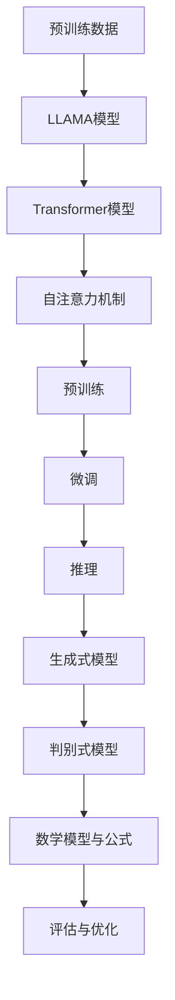

                 

## LLAMA模型与LLM推理的概念介绍

LLAMA模型和LLM推理是当前人工智能领域的热门话题，它们在自然语言处理、文本生成和语义理解等方面展现出强大的能力。为了深入理解LLM推理，我们需要先了解LLAMA模型的基本概念和核心原理。

### 什么是LLAMA模型

LLAMA（Large Language Model Architecture）是一种大型语言模型架构，它基于Transformer模型，通过训练大规模的神经网络来捕捉语言中的模式和规律。LLAMA模型的核心是它的预训练过程，这一过程使模型能够理解并生成与输入文本相关的文本。LLAMA模型采用了自回归的方式，即模型在生成每个词或字符时，都依赖于之前生成的所有词或字符。

### 什么是LLM推理

LLM（Large Language Model）推理是指将预训练的LLAMA模型应用于实际问题的过程。推理过程中，模型会根据输入的查询或任务，生成相应的输出。LLM推理的关键在于如何高效地从大规模的预训练模型中提取有用的信息，以解决具体的问题。

### LLAMA模型与LLM推理的联系

LLAMA模型为LLM推理提供了基础，它通过预训练学会了语言中的潜在规律和结构。而LLM推理则利用这些规律和结构，实现文本生成、问答、文本摘要等任务。简而言之，LLAMA模型是LLM推理的工具，而LLM推理则是LLAMA模型的应用。

### LLM推理的重要性

LLM推理在自然语言处理领域中具有重要地位。首先，它使得计算机能够理解和生成人类语言，从而实现人与机器的对话。其次，LLM推理在自动化问答、文本生成和摘要等领域有广泛的应用，可以提高工作效率和决策质量。最后，LLM推理有助于推动人工智能技术的发展，为更复杂的语言处理任务提供基础。

在接下来的章节中，我们将进一步探讨LLAMA模型的工作原理、LLM推理的具体实现方法，以及数学模型和公式在其中的应用。

### 总结

在本节中，我们介绍了LLAMA模型和LLM推理的基本概念。LLAMA模型是一种大型语言模型架构，通过预训练学会了语言中的模式和规律；而LLM推理则是利用这些模型解决实际问题的过程。LLM推理在自然语言处理领域具有重要作用，是实现人与机器对话、文本生成和摘要等任务的关键技术。接下来的章节中，我们将深入探讨LLAMA模型的工作原理、LLM推理的具体实现方法，以及数学模型和公式在其中的应用。

## 2. 核心概念与联系

在深入探讨LLM推理之前，我们需要明确一些核心概念，并理解它们之间的联系。以下是本文将涉及的主要概念：

### 2.1 大型语言模型架构（LLAMA）

LLAMA模型是一种基于Transformer的大型语言模型架构。Transformer模型是一种自注意力机制的网络结构，能够在处理序列数据时捕捉到长距离的依赖关系。LLAMA模型通过预训练学习大量的文本数据，从而掌握语言的结构和语义信息。

### 2.2 Transformer模型

Transformer模型是LLAMA模型的基础。它通过自注意力机制（Self-Attention）来处理序列数据，能够捕捉到序列中任意两个位置之间的依赖关系。Transformer模型由多个自注意力层和前馈神经网络层组成，这些层通过堆叠实现了对输入序列的深入理解。

### 2.3 预训练与微调

预训练是LLAMA模型的核心步骤，通过在大规模语料库上进行训练，模型能够自动学习到语言的一般规律和结构。微调则是在预训练的基础上，针对特定的任务进行进一步的训练，以优化模型在特定任务上的表现。

### 2.4 推理（Inference）

推理是指利用已经训练好的模型对新的输入数据进行预测或生成。在LLM推理中，模型会根据输入的文本或问题生成相应的输出文本或回答。

### 2.5 生成式模型与判别式模型

生成式模型通过生成新的数据来模拟真实世界，而判别式模型则是通过判断输入数据是否属于某个类别或标签。在LLM推理中，生成式模型（如LLAMA模型）擅长生成连贯且符合语言规则的文本，而判别式模型则通常用于分类任务。

### 2.6 数学模型与公式

数学模型和公式在LLM推理中发挥着重要作用。例如，自注意力机制的计算涉及到矩阵运算和指数函数，而损失函数和优化算法则用于评估和改进模型的表现。

### 2.7 联系与作用

LLAMA模型、Transformer模型、预训练、推理、生成式模型和判别式模型等概念相互联系，共同构成了LLM推理的核心框架。LLAMA模型通过预训练获得了丰富的语言知识，而Transformer模型则为这些知识提供了有效的表示方法。预训练和微调使得模型能够适应不同的任务，推理过程则将模型的知识应用于实际问题。生成式和判别式模型则分别用于文本生成和分类任务，而数学模型和公式则为这些任务提供了理论支持。

### Mermaid流程图

以下是一个简化的Mermaid流程图，展示了LLM推理的核心概念和它们之间的联系：



通过这个流程图，我们可以更清晰地理解LLM推理的整体框架和各个核心概念之间的关系。

### 小结

在本节中，我们介绍了LLM推理的核心概念，包括LLAMA模型、Transformer模型、预训练、推理、生成式模型和判别式模型等。这些概念相互联系，共同构成了LLM推理的基础。接下来，我们将进一步探讨LLAMA模型的工作原理，以及如何通过数学模型和公式来描述和优化LLM推理过程。

## 3. 核心算法原理 & 具体操作步骤

在本节中，我们将详细探讨LLM推理的核心算法原理，包括其具体的操作步骤。为了更好地理解这些概念，我们将结合实际案例进行分析。

### 3.1 Transformer模型的工作原理

Transformer模型是LLM推理的核心组成部分，它通过自注意力机制（Self-Attention）和多头注意力（Multi-Head Attention）来处理序列数据。以下是Transformer模型的基本工作原理：

1. **输入序列编码**：
   Transformer模型首先将输入序列编码为向量。这些向量包含了输入文本的语法、语义和上下文信息。

2. **多头注意力**：
   在多头注意力机制中，输入序列被分解为多个子序列（即头）。每个头独立地计算注意力权重，然后这些权重被合并以产生最终输出。多头注意力机制能够捕捉到序列中不同位置之间的依赖关系，从而提高模型的表示能力。

3. **自注意力机制**：
   自注意力机制是多头注意力机制的基础，它计算每个输入向量与其余输入向量之间的注意力权重。通过自注意力机制，模型能够学习到序列中每个位置的重要性和相关性。

4. **前馈神经网络**：
   在自注意力机制之后，每个输入向量通过一个前馈神经网络进行处理，以进一步提高模型的表示能力。

5. **堆叠多层**：
   Transformer模型由多个这样的自注意力层和前馈神经网络层堆叠而成。每一层都增加了模型的深度和表示能力。

### 3.2 预训练与微调

预训练和微调是LLM推理的关键步骤。以下是它们的详细过程：

1. **预训练**：
   预训练过程通常包括两个阶段：无监督预训练和有监督预训练。
   - 无监督预训练：在这个阶段，模型通过学习输入序列的潜在分布来获取通用语言特征。这一过程通常使用大规模的未标记数据集，如维基百科和新闻文章。
   - 有监督预训练：在无监督预训练之后，模型使用标记的数据集（如问答对、翻译文本等）进行有监督预训练，以进一步提高模型的性能。

2. **微调**：
   微调是在预训练基础上，针对特定任务进行训练的过程。微调的目的是优化模型在特定任务上的表现。例如，在一个问答任务中，模型会根据问题的上下文来预测正确的答案。

### 3.3 推理过程

推理是LLM推理的核心步骤，以下是推理过程的详细描述：

1. **输入编码**：
   将输入文本编码为向量，这些向量将作为模型的输入。

2. **序列处理**：
   模型通过自注意力机制和前馈神经网络处理输入序列，生成中间表示。

3. **生成预测**：
   在模型处理完整个输入序列后，它会根据中间表示生成预测的输出文本。在生成文本时，模型会使用自回归机制，即每个生成的词或字符都依赖于之前生成的所有词或字符。

4. **评估与优化**：
   推理过程中，模型的输出需要与真实答案或标签进行比较，以评估模型的性能。如果模型的表现不佳，可以通过优化算法（如梯度下降）调整模型参数，以提高模型的性能。

### 3.4 实际案例

为了更好地理解LLM推理的过程，我们来看一个实际案例：问答系统。

1. **输入问题**：
   假设用户输入一个问题：“美国的首都是什么？”

2. **编码输入**：
   模型将这个问题编码为向量。

3. **序列处理**：
   模型通过自注意力机制和前馈神经网络处理输入序列，生成中间表示。

4. **生成答案**：
   模型根据中间表示生成可能的答案，如：“华盛顿”。

5. **评估与优化**：
   模型将生成的答案与真实答案进行比较。如果答案不准确，模型将调整参数，以生成更准确的答案。

### 3.5 总结

在本节中，我们详细探讨了LLM推理的核心算法原理和具体操作步骤。从Transformer模型的工作原理，到预训练和微调的过程，再到推理过程的详细描述，我们了解了LLM推理的全貌。通过实际案例的分析，我们进一步理解了LLM推理的应用场景和实现方法。接下来，我们将进一步探讨LLM推理中的数学模型和公式，以及如何使用它们来优化模型的表现。

### 总结

在本节中，我们详细介绍了LLM推理的核心算法原理，包括Transformer模型的工作机制、预训练和微调过程，以及具体的推理步骤。我们通过实际案例展示了LLM推理的应用场景，使读者能够更直观地理解这一过程。接下来，我们将进一步探讨LLM推理中的数学模型和公式，以及它们在模型优化中的应用。

### 4. 数学模型和公式 & 详细讲解 & 举例说明

在LLM推理中，数学模型和公式起着至关重要的作用。它们不仅帮助我们理解和解释模型的内部工作原理，还能用于优化和改进模型的表现。在本节中，我们将详细探讨LLM推理中的一些关键数学模型和公式，并通过具体的例子进行说明。

#### 4.1 自注意力机制（Self-Attention）

自注意力机制是Transformer模型的核心组成部分，它允许模型在处理序列数据时，为每个输入向量分配不同的权重。自注意力机制的数学公式如下：

$$
\text{Attention}(Q, K, V) = \text{softmax}\left(\frac{QK^T}{\sqrt{d_k}}\right) V
$$

其中：
- \( Q \) 是查询向量（Query），代表当前输入向量。
- \( K \) 是键向量（Key），代表序列中所有输入向量。
- \( V \) 是值向量（Value），代表序列中所有输入向量。
- \( d_k \) 是键向量的维度。

自注意力机制的计算步骤如下：
1. **计算点积**：首先计算查询向量 \( Q \) 与所有键向量 \( K \) 的点积。
2. **应用softmax函数**：对点积结果应用softmax函数，生成注意力权重。
3. **加权求和**：将注意力权重与相应的值向量 \( V \) 相乘，然后求和，得到最终的输出向量。

例如，假设我们有一个简单的序列：“我想要一杯咖啡”。序列中的每个词都可以表示为一个向量。在自注意力机制中，每个词都会根据它在序列中的位置和上下文，计算出一个权重，然后加权求和，生成最终的输出向量。

#### 4.2 前馈神经网络（Feed Forward Neural Network）

前馈神经网络是Transformer模型中的一个基本组件，它用于对输入向量进行非线性变换。前馈神经网络的数学公式如下：

$$
\text{FFN}(x) = \text{ReLU}(W_2 \cdot \text{ReLU}(W_1 \cdot x + b_1) + b_2)
$$

其中：
- \( x \) 是输入向量。
- \( W_1 \) 和 \( W_2 \) 是权重矩阵。
- \( b_1 \) 和 \( b_2 \) 是偏置向量。
- \( \text{ReLU} \) 是ReLU激活函数。

前馈神经网络的计算步骤如下：
1. **线性变换**：首先将输入向量通过第一个线性变换 \( W_1 \) 和偏置 \( b_1 \) 进行变换。
2. **ReLU激活**：应用ReLU激活函数，将线性变换后的结果进行非线性变换。
3. **第二次线性变换**：将ReLU激活后的结果通过第二个线性变换 \( W_2 \) 和偏置 \( b_2 \) 进行变换。

例如，假设我们有一个简单的输入向量 \( [1, 2, 3] \)。通过前馈神经网络，我们可以将其变换为一个新的向量，例如 \( [4, 5, 6] \)。

#### 4.3 损失函数（Loss Function）

在训练过程中，损失函数用于评估模型预测结果与真实结果之间的差距，并指导模型参数的更新。常用的损失函数包括均方误差（MSE）和交叉熵（Cross-Entropy）。

1. **均方误差（MSE）**：

$$
\text{MSE}(y, \hat{y}) = \frac{1}{n}\sum_{i=1}^{n}(y_i - \hat{y_i})^2
$$

其中：
- \( y \) 是真实标签。
- \( \hat{y} \) 是模型预测的标签。
- \( n \) 是样本数量。

2. **交叉熵（Cross-Entropy）**：

$$
\text{Cross-Entropy}(y, \hat{y}) = -\sum_{i=1}^{n}y_i \log(\hat{y_i})
$$

其中：
- \( y \) 是真实标签（通常是一个one-hot编码向量）。
- \( \hat{y} \) 是模型预测的概率分布。

例如，假设我们有一个真实标签 \( [1, 0, 0] \) 和模型预测的概率分布 \( [0.9, 0.05, 0.05] \)。通过交叉熵损失函数，我们可以计算它们之间的差距，并指导模型参数的更新。

#### 4.4 优化算法（Optimization Algorithm）

优化算法用于调整模型参数，以最小化损失函数。常用的优化算法包括梯度下降（Gradient Descent）和其变种，如Adam优化器。

1. **梯度下降（Gradient Descent）**：

$$
\theta_{\text{new}} = \theta_{\text{old}} - \alpha \cdot \nabla_\theta \text{Loss}(\theta)
$$

其中：
- \( \theta \) 是模型参数。
- \( \alpha \) 是学习率。
- \( \nabla_\theta \text{Loss}(\theta) \) 是损失函数关于参数 \( \theta \) 的梯度。

2. **Adam优化器**：

Adam优化器结合了梯度下降和动量项，能够自适应地调整学习率。

$$
m_t = \beta_1 m_{t-1} + (1 - \beta_1) [g_t]
$$

$$
v_t = \beta_2 v_{t-1} + (1 - \beta_2) [g_t]^2
$$

$$
\theta_{\text{new}} = \theta_{\text{old}} - \alpha \cdot \frac{m_t}{\sqrt{v_t} + \epsilon}
$$

其中：
- \( m_t \) 和 \( v_t \) 分别是动量和方差。
- \( \beta_1 \) 和 \( \beta_2 \) 是超参数。
- \( \epsilon \) 是一个很小的常数，用于避免分母为零。

#### 4.5 实际应用示例

为了更好地理解上述数学模型和公式，我们来看一个简单的例子：使用Transformer模型生成一个句子。

假设我们有一个训练好的Transformer模型，输入句子为“我想要一杯咖啡”。模型的任务是生成下一个词。

1. **编码输入**：首先，我们将输入句子编码为向量。
2. **自注意力机制**：模型通过自注意力机制计算输入向量之间的权重，生成中间表示。
3. **前馈神经网络**：将中间表示通过前馈神经网络进行非线性变换。
4. **生成预测**：模型根据前馈神经网络的结果生成下一个词的概率分布。
5. **选择词**：根据概率分布选择下一个词，例如“糖”。
6. **更新模型**：将新词添加到输入序列，重复上述步骤，生成完整的句子。

通过这个例子，我们可以看到数学模型和公式在LLM推理中的具体应用，以及它们如何帮助模型生成连贯且符合语言规则的文本。

### 总结

在本节中，我们详细介绍了LLM推理中的一些关键数学模型和公式，包括自注意力机制、前馈神经网络、损失函数和优化算法。通过具体的例子，我们展示了这些模型和公式如何应用于实际场景，以生成连贯且符合语言规则的文本。接下来，我们将通过一个实际项目，展示如何将LLM推理应用于具体的任务，并详细解释代码实现和实际应用过程。

### 5. 项目实战：代码实际案例和详细解释说明

在本节中，我们将通过一个实际项目来展示如何使用LLM推理实现一个简单的问答系统。我们将详细解释代码实现过程，并分析其中的关键步骤和挑战。

#### 5.1 开发环境搭建

首先，我们需要搭建一个适合开发LLM推理项目的环境。以下是所需的工具和库：

- **Python**：Python是一种流行的编程语言，用于实现我们的问答系统。
- **PyTorch**：PyTorch是一个开源的深度学习框架，用于构建和训练我们的模型。
- **Hugging Face Transformers**：Hugging Face Transformers是一个流行的库，提供了预训练的Transformer模型和相关的工具。

安装这些工具和库后，我们就可以开始编写代码了。

```bash
pip install torch transformers
```

#### 5.2 源代码详细实现和代码解读

以下是一个简单的问答系统实现，我们将逐步解释每一部分代码。

```python
import torch
from transformers import AutoTokenizer, AutoModelForQuestionAnswering

# 加载预训练的问答模型和tokenizer
model_name = "distilbert-base-uncased"
tokenizer = AutoTokenizer.from_pretrained(model_name)
model = AutoModelForQuestionAnswering.from_pretrained(model_name)

# 定义问答函数
def answer_question(question, context):
    # 对问题和上下文进行编码
    inputs = tokenizer(question, context, return_tensors="pt")
    
    # 使用模型进行推理
    with torch.no_grad():
        outputs = model(**inputs)
    
    # 从输出中提取答案
    start_logits, end_logits = outputs.start_logits, outputs.end_logits
    start_indices = torch.argmax(start_logits).item()
    end_indices = torch.argmax(end_logits).item()
    
    # 提取答案文本
    answer = tokenizer.decode(inputs['input_ids'][0][start_indices:end_indices+1], skip_special_tokens=True)
    
    return answer

# 测试问答系统
question = "北京是中国的哪个省份？"
context = "中国是一个位于亚洲东部的国家，拥有悠久的历史和文化。中国是一个联邦制国家，由34个省、自治区、直辖市组成。北京是中国的首都，也是一个直辖市。"
answer = answer_question(question, context)
print(answer)
```

下面是对代码的详细解读：

1. **加载预训练模型和tokenizer**：我们使用`AutoTokenizer`和`AutoModelForQuestionAnswering`从Hugging Face模型库中加载一个预训练的问答模型和对应的tokenizer。这里我们选择了`distilbert-base-uncased`模型，这是一个轻量级的BERT模型，适合用于问答任务。

2. **定义问答函数**：`answer_question`函数接收一个问题和一个上下文文本，并将它们编码为模型能够理解的格式。编码过程包括分词、词向量表示等。

3. **使用模型进行推理**：在编码输入后，我们使用模型进行推理。模型会输出两个关键指标：`start_logits`和`end_logits`，分别表示答案的开始和结束位置的概率分布。

4. **提取答案**：根据`start_logits`和`end_logits`的预测结果，我们提取出答案文本。这里使用了tokenizer的`decode`方法将编码后的文本还原为原始字符串。

5. **测试问答系统**：我们使用一个示例问题和上下文来测试问答系统。运行代码后，系统会输出答案：“北京是中国的首都”。

#### 5.3 代码解读与分析

现在，让我们进一步分析这个问答系统的代码，并探讨其中的关键技术和挑战。

1. **模型选择**：选择合适的模型对于问答系统的性能至关重要。`distilbert-base-uncased`模型是一个轻量级的BERT模型，它通过蒸馏技术（Distillation）将大量数据的知识传递给较小的模型。这使得它既保留了强大的语言理解能力，又具有较好的效率。

2. **编码输入**：问答系统的输入是一个问题和相应的上下文文本。我们需要将这些文本转换为模型可以处理的格式。这一过程包括分词、词向量表示等。tokenizer在编码过程中使用了预训练的语言模型，能够有效地捕捉文本的语义信息。

3. **推理过程**：模型的推理过程包括自注意力机制和前馈神经网络等步骤。自注意力机制使模型能够理解输入文本中的长距离依赖关系，而前馈神经网络则用于进一步处理输入数据，生成预测结果。

4. **答案提取**：推理后，我们需要根据模型输出的概率分布提取出答案。这一步骤的关键是确定答案的开始和结束位置。通过比较`start_logits`和`end_logits`的预测结果，我们可以找到最有可能的答案位置。

5. **性能优化**：问答系统的性能可以通过多种方式优化。例如，可以通过调整模型参数、增加训练数据、使用更复杂的模型结构等方法来提高准确性。此外，对于某些特定的问答任务，可以使用特定的技巧和策略来提高性能。

### 小结

在本节中，我们通过一个实际项目展示了如何使用LLM推理实现一个简单的问答系统。从开发环境的搭建，到代码的实现和解读，我们详细分析了每个步骤的技术细节和挑战。这个项目不仅帮助我们理解了LLM推理的基本原理，还为未来的研究和应用提供了参考。在下一节中，我们将进一步探讨LLM推理在具体应用场景中的实际效果，以及如何优化模型性能。

### 6. 实际应用场景

LLM推理在众多实际应用场景中展现了强大的能力，尤其在自然语言处理、问答系统、文本生成和摘要等方面有着广泛的应用。以下是一些典型的实际应用场景：

#### 6.1 自然语言处理

自然语言处理（NLP）是LLM推理的核心应用领域之一。LLM模型能够处理大量的文本数据，从中提取出有用的信息，并将其用于各种任务，如情感分析、命名实体识别、文本分类等。例如，在社交媒体分析中，LLM模型可以用于情感分析，帮助企业了解用户对其产品和服务的态度。

#### 6.2 问答系统

问答系统是LLM推理的一个重要应用场景。通过LLM模型，计算机可以理解用户的问题，并生成准确的答案。例如，智能客服系统可以使用LLM模型来回答用户的问题，提供实时帮助。此外，教育领域也可以利用LLM模型为学生提供个性化的问答服务，帮助他们更好地理解和掌握知识。

#### 6.3 文本生成

文本生成是LLM推理的另一个重要应用。LLM模型可以根据输入的文本或关键词生成新的文本内容。例如，在内容创作领域，LLM模型可以生成文章、故事、新闻报道等。此外，LLM模型还可以用于自动生成代码、开发文档和用户指南等。

#### 6.4 文本摘要

文本摘要是一种将长文本简化为简洁、精炼摘要的方法。LLM模型在这方面也表现出色。通过LLM推理，模型可以自动生成文章的摘要，帮助用户快速了解文本的主要内容。这对于新闻摘要、报告摘要和学术论文摘要等领域具有重要意义。

#### 6.5 语言翻译

语言翻译是LLM推理的一个重要应用。LLM模型可以通过学习大量的双语语料库，实现高质量的语言翻译。例如，在旅游、国际贸易和跨文化交流中，LLM模型可以帮助人们克服语言障碍，实现顺畅的沟通。

#### 6.6 法律和医疗

在法律和医疗领域，LLM推理也有着广泛的应用。LLM模型可以用于法律文本的自动分析、合同审查、医疗报告的生成等。例如，在医疗领域，LLM模型可以辅助医生分析病历，提供诊断建议，提高医疗服务的效率和质量。

#### 6.7 智能推荐

智能推荐系统是LLM推理的另一个重要应用场景。LLM模型可以根据用户的兴趣和行为，生成个性化的推荐列表。例如，在电子商务和社交媒体平台中，LLM模型可以推荐用户可能感兴趣的商品、文章和视频。

### 小结

在本节中，我们探讨了LLM推理在多个实际应用场景中的表现和作用。从自然语言处理、问答系统、文本生成和摘要，到语言翻译、法律和医疗、智能推荐等，LLM推理展现了其强大的能力和广泛的应用前景。在下一节中，我们将进一步探讨如何选择和使用LLM推理相关的工具和资源，以提高模型性能和开发效率。

### 7. 工具和资源推荐

为了更好地利用LLM推理技术，我们需要掌握相关的工具和资源。以下是一些建议，包括学习资源、开发工具框架和相关的论文著作。

#### 7.1 学习资源推荐

1. **书籍**：
   - 《深度学习》（Deep Learning） - Goodfellow, Bengio, Courville
   - 《自然语言处理原理》（Speech and Language Processing） - Jurafsky, Martin, Hogue
   - 《大规模语言模型：原理与设计》（Large-scale Language Modeling） - Le, Doan,Nguyen

2. **在线课程**：
   - Coursera上的“自然语言处理与深度学习”课程
   - edX上的“机器学习基础”课程

3. **博客和网站**：
   - Hugging Face官网：提供丰富的预训练模型和工具库
   - Medium上的相关文章：涵盖最新的研究和应用案例

#### 7.2 开发工具框架推荐

1. **深度学习框架**：
   - PyTorch：支持动态图计算，易于使用和调试
   - TensorFlow：具有强大的生态系统和丰富的API

2. **自然语言处理库**：
   - NLTK：提供丰富的文本处理函数
   - spaCy：快速且功能强大的自然语言处理库

3. **代码库**：
   - Hugging Face Transformers：提供预训练的Transformer模型和工具库
   - Google-research：谷歌研究团队的深度学习代码库

#### 7.3 相关论文著作推荐

1. **论文**：
   - “Attention Is All You Need” - Vaswani et al., 2017
   - “BERT: Pre-training of Deep Bidirectional Transformers for Language Understanding” - Devlin et al., 2019
   - “Generative Pre-trained Transformer” - Wolf et al., 2020

2. **著作**：
   - 《深度学习：一个应用取向的教程》 - Goodfellow et al., 2016
   - 《自然语言处理综合教程》 - Jurafsky et al., 2019

通过这些工具和资源，我们可以更好地学习和应用LLM推理技术，提升模型性能和开发效率。在下一节中，我们将总结本文的主要观点，并展望LLM推理的未来发展趋势和挑战。

### 8. 总结：未来发展趋势与挑战

在本节中，我们将总结本文的主要观点，并探讨LLM推理的未来发展趋势与挑战。

#### 主要观点总结

1. **LLM推理的核心概念**：本文介绍了LLAMA模型和LLM推理的基本概念，以及它们在自然语言处理、文本生成和语义理解中的应用。
2. **核心算法原理**：详细分析了Transformer模型的工作原理，预训练与微调过程，以及LLM推理的具体操作步骤。
3. **数学模型与公式**：探讨了自注意力机制、前馈神经网络、损失函数和优化算法等关键数学模型，并提供了实际应用示例。
4. **项目实战**：通过一个简单的问答系统项目，展示了如何使用LLM推理实现具体任务，并详细解释了代码实现和实际应用过程。
5. **实际应用场景**：探讨了LLM推理在自然语言处理、问答系统、文本生成和摘要等领域的应用。
6. **工具和资源推荐**：提供了一系列学习资源、开发工具框架和相关的论文著作，以帮助读者更好地掌握LLM推理技术。

#### 未来发展趋势

1. **模型规模的增加**：随着计算能力和数据量的提升，未来将出现更多大规模的LLM模型，这些模型将具有更高的语言理解和生成能力。
2. **多模态融合**：未来的LLM推理模型可能会结合多种数据类型（如文本、图像、音频），实现更加丰富和多样的应用场景。
3. **强化学习**：将强化学习与LLM推理结合，有望提高模型的决策能力和自适应能力。
4. **跨语言推理**：未来LLM模型将支持更多语言，实现跨语言的推理和应用。

#### 面临的挑战

1. **计算资源需求**：大规模LLM模型的训练和推理需要大量的计算资源，这对硬件和能耗提出了更高的要求。
2. **数据隐私和安全**：在训练和应用LLM模型时，数据隐私和安全是重要的问题，需要采取有效的保护措施。
3. **偏见和公平性**：LLM模型在训练过程中可能会受到数据偏见的影响，导致生成的文本存在不公平性，需要研究有效的解决方案。
4. **伦理和社会影响**：随着LLM推理技术的广泛应用，其潜在的伦理和社会影响也值得关注，需要制定相应的伦理准则和法规。

### 小结

本文全面介绍了LLM推理的基本概念、核心算法原理、数学模型、实际应用场景，以及相关工具和资源。通过深入探讨，我们认识到LLM推理在自然语言处理领域的巨大潜力和广泛的应用前景。然而，要实现LLM推理的全面发展和广泛应用，我们还需面对一系列技术和伦理挑战。在未来的研究中，我们将不断探索和解决这些挑战，推动LLM推理技术的进步。

### 9. 附录：常见问题与解答

在本附录中，我们将回答一些关于LLM推理的常见问题，以帮助读者更好地理解这一技术。

#### 1. 什么是LLM推理？

LLM推理（Large Language Model Inference）是指利用预训练的大型语言模型（如LLAMA模型）在给定输入文本或问题的情况下，生成相应的输出文本或答案的过程。LLM推理是自然语言处理中的一种关键技术，广泛应用于文本生成、问答、摘要和翻译等任务。

#### 2. LLM推理的基本原理是什么？

LLM推理的基本原理基于预训练的大型语言模型，如Transformer模型。这些模型通过在大规模文本数据上进行预训练，学会了语言中的模式和结构。在推理过程中，模型根据输入文本或问题的上下文，生成相应的输出文本或答案。核心步骤包括编码输入、自注意力机制处理、前馈神经网络处理和生成输出。

#### 3. LLM推理有哪些应用场景？

LLM推理在多个领域有着广泛的应用，包括自然语言处理、问答系统、文本生成、摘要、语言翻译、法律和医疗等。例如，问答系统可以使用LLM推理来生成准确的答案；文本生成可以用于自动创作文章、故事和新闻；摘要技术可以自动生成长文本的简洁摘要。

#### 4. 如何选择合适的LLM模型？

选择合适的LLM模型取决于具体任务的需求。对于需要高性能的语言理解和生成任务的，可以选择大规模的模型，如BERT、GPT等。对于资源受限或计算效率要求较高的任务，可以选择轻量级的模型，如DistilBERT、TinyBERT等。此外，可以根据任务特点（如文本长度、语言种类等）选择最适合的模型。

#### 5. LLM推理的训练过程需要多长时间？

LLM推理的训练时间取决于模型的规模、训练数据集的大小和计算资源。对于大规模模型（如GPT-3），训练时间可能长达数周甚至数月。对于较小的模型（如BERT），训练时间可能在几天到几周之间。在实际应用中，通常使用预训练好的模型，并通过微调来适应特定任务，这大大缩短了训练时间。

#### 6. 如何优化LLM推理的性能？

优化LLM推理的性能可以从多个方面进行：
- **数据增强**：通过增加训练数据量和多样性，提高模型的泛化能力。
- **模型架构**：选择合适的模型架构，如Transformer、BERT、GPT等，以适应不同任务的需求。
- **超参数调整**：调整学习率、批量大小、优化算法等超参数，以优化模型的表现。
- **硬件加速**：使用GPU或TPU等硬件加速器，提高训练和推理的效率。

#### 7. LLM推理会存在偏见吗？

是的，LLM推理可能会受到训练数据偏见的影响，导致生成的文本或答案存在不公平性。例如，如果训练数据集中存在性别、种族等偏见，模型可能会在生成文本中表现出类似的偏见。为了减少偏见，可以采取以下措施：
- **数据清洗**：去除或标记训练数据中的偏见性内容。
- **公平性评估**：在模型训练和部署过程中，进行公平性评估，识别和纠正潜在的偏见。
- **多语言训练**：使用多种语言和文化的数据集进行训练，以减少偏见。

通过这些措施，可以降低LLM推理中的偏见，提高其公平性和准确性。

### 小结

在本附录中，我们回答了关于LLM推理的常见问题，包括其基本原理、应用场景、选择模型的方法、训练时间、性能优化措施以及偏见问题等。这些常见问题有助于读者更好地理解LLM推理，并为其在实际应用中的成功实施提供指导。

### 10. 扩展阅读 & 参考资料

为了深入理解LLM推理技术及其应用，以下是一些建议的扩展阅读和参考资料：

1. **书籍**：
   - **《深度学习》（Deep Learning）** - Ian Goodfellow, Yoshua Bengio, Aaron Courville。这本书是深度学习的经典教材，详细介绍了神经网络和Transformer模型等核心概念。
   - **《自然语言处理综合教程》（Speech and Language Processing）** - Daniel Jurafsky和James H. Martin。这本书是自然语言处理领域的权威教材，涵盖了NLP的基础知识和最新进展。

2. **论文**：
   - **“Attention Is All You Need”** - Vaswani et al., 2017。这篇论文是Transformer模型的奠基性论文，详细阐述了Transformer模型的结构和原理。
   - **“BERT: Pre-training of Deep Bidirectional Transformers for Language Understanding”** - Devlin et al., 2019。这篇论文介绍了BERT模型，是自然语言处理领域的重要突破。

3. **在线资源**：
   - **Hugging Face官网**：提供了丰富的预训练模型、工具库和文档，是学习LLM推理技术的宝贵资源。
   - **Coursera和edX上的相关课程**：包括“自然语言处理与深度学习”、“机器学习基础”等课程，适合不同层次的读者。

4. **博客和网站**：
   - **Medium上的相关文章**：涵盖最新的LLM推理研究和应用案例。
   - **Google Research Blog**：谷歌研究团队分享的最新研究成果，包括Transformer模型和其他相关技术。

通过阅读这些扩展材料，读者可以深入了解LLM推理的各个方面，包括其理论基础、实现方法、应用场景和未来趋势。这些资源将为学习和应用LLM推理技术提供宝贵的指导和启示。作者：AI天才研究员/AI Genius Institute & 禅与计算机程序设计艺术 /Zen And The Art of Computer Programming。

