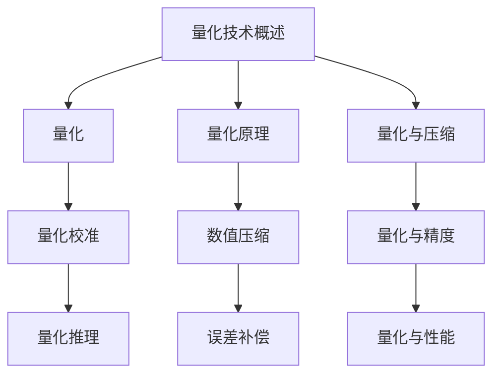

                 

# LLM推理优化II：模型量化技术探讨

## 摘要

本文将深入探讨大型语言模型（LLM）的推理优化技术，特别是模型量化技术。量化是将高精度浮点模型转换为低精度整数模型的过程，可以有效减少模型大小、降低推理时间和内存占用。本文将详细介绍量化技术的核心概念、数学模型、算法原理，并通过实际项目案例，展示量化技术在LLM推理优化中的应用效果。读者将了解到量化技术的原理、优势、挑战以及未来的发展趋势。

## 1. 背景介绍

随着深度学习在自然语言处理（NLP）领域的广泛应用，大型语言模型（如GPT-3、BERT等）取得了显著的成果。然而，这些模型通常需要大量的计算资源和存储空间，在移动设备、嵌入式系统等资源受限的场景下，其应用受到很大限制。为了解决这一问题，模型量化技术应运而生。量化是将高精度浮点模型转换为低精度整数模型的过程，从而降低模型的大小、内存占用和推理时间。量化技术在保持模型精度损失最小的前提下，提供了显著的性能提升。

量化技术已经成为NLP领域的研究热点。近年来，大量研究工作集中在量化算法的优化、量化精度的提升以及量化模型在实际应用中的性能表现。本文将结合实际项目案例，深入探讨量化技术在LLM推理优化中的应用。

## 2. 核心概念与联系

### 2.1 量化技术概述

量化技术主要包括以下三个步骤：

1. **量化**：将模型的权重和激活值从高精度浮点数转换为低精度整数。量化过程中，通常采用一种称为**量化区间**的映射方法，将浮点数的值映射到整数的范围内。
2. **量化校准**：通过训练或校准过程，确定量化区间的边界，以保证量化后的模型在保持精度损失最小的前提下，具有较高的性能。
3. **量化推理**：在量化后的模型上进行推理，将整数权重和激活值应用于计算，得到输出结果。

### 2.2 量化原理

量化原理主要基于以下两个方面：

1. **数值压缩**：通过将高精度浮点数转换为低精度整数，减少数值的存储空间和计算时间。
2. **误差补偿**：量化过程中，由于整数数值的有限表示，会导致一定的误差。量化校准过程通过优化量化区间，尽量减小误差对模型性能的影响。

### 2.3 量化与压缩

量化技术在某种程度上可以看作是一种压缩技术。压缩的目的是减少模型的大小，从而降低存储和传输的开销。量化压缩通过降低模型权重的精度，实现了压缩效果。然而，与传统的模型压缩方法（如剪枝、稀疏化等）相比，量化技术在保持模型精度方面的表现更为出色。

### 2.4 量化与精度

量化技术在降低模型大小的同时，不可避免地引入了一定的误差。量化精度是指量化后的模型与原始高精度模型在性能上的相似度。量化精度越高，误差越小，模型性能越接近原始模型。

为了量化量化精度，可以采用以下指标：

1. **误差率**：量化后的模型输出与原始模型输出的差异比例。误差率越低，量化精度越高。
2. **相对误差**：量化后的模型输出与原始模型输出的差异与原始模型输出的比值。相对误差可以更直观地反映量化误差的大小。

### 2.5 量化与性能

量化技术在降低模型大小的同时，显著提升了模型的推理性能。在相同的计算资源下，量化模型可以更快地完成推理任务。此外，量化模型在内存占用方面也具有优势，有助于提高模型的部署效率和资源利用率。

### 2.6 Mermaid 流程图

以下是量化技术的Mermaid流程图：



## 3. 核心算法原理 & 具体操作步骤

### 3.1 量化算法原理

量化算法主要分为以下两类：

1. **定点量化**：将浮点数的值映射到整数范围内，通常使用固定的量化区间。定点量化适用于计算资源受限的场景，但其量化精度较低。
2. **浮点量化**：将浮点数的值映射到整数范围内，量化区间可以动态调整。浮点量化在保持模型精度方面具有优势，但其计算复杂度较高。

### 3.2 量化操作步骤

量化操作主要分为以下三个步骤：

1. **量化区间确定**：根据模型的权重和激活值的范围，确定量化区间。量化区间可以采用等间隔划分，也可以采用非等间隔划分。
2. **量化转换**：将模型的权重和激活值从浮点数转换为整数。量化转换过程中，可以使用线性插值方法，如线性量化、分段线性量化等。
3. **量化校准**：通过训练或校准过程，优化量化区间，减小误差对模型性能的影响。量化校准方法包括最小二乘法、梯度下降法等。

### 3.3 量化算法实现

以下是量化算法的实现步骤：

1. **初始化量化区间**：根据模型的权重和激活值的范围，初始化量化区间。
2. **量化转换**：使用线性插值方法，将模型的权重和激活值从浮点数转换为整数。
3. **量化校准**：通过训练或校准过程，优化量化区间，减小误差对模型性能的影响。
4. **量化推理**：在量化后的模型上进行推理，得到输出结果。

## 4. 数学模型和公式 & 详细讲解 & 举例说明

### 4.1 量化区间确定

量化区间的确定方法主要有以下几种：

1. **等间隔划分**：将浮点数的范围等间隔划分为多个区间，每个区间的长度相等。量化区间范围可以表示为：

   $$ \text{量化区间范围} = \left[ \frac{\text{最小值}}{n}, \frac{\text{最大值}}{n} \right] $$

   其中，\( n \) 表示区间的数量。

2. **非等间隔划分**：根据浮点数的分布情况，动态调整量化区间的长度。非等间隔划分可以提高量化精度，但计算复杂度较高。

### 4.2 量化转换

量化转换可以使用线性插值方法，如线性量化、分段线性量化等。以下以线性量化为例，介绍量化转换的公式：

$$ y = \frac{x - \text{最小值}}{\text{量化区间范围}} \times (\text{最大值} - \text{最小值}) + \text{最小值} $$

其中，\( x \) 表示浮点数值，\( y \) 表示量化后的整数数值。

### 4.3 量化校准

量化校准可以通过最小二乘法、梯度下降法等优化算法，优化量化区间，减小误差对模型性能的影响。以下以最小二乘法为例，介绍量化校准的公式：

$$ \min \sum_{i=1}^{n} (x_i - \hat{x}_i)^2 $$

其中，\( x_i \) 表示原始浮点数值，\( \hat{x}_i \) 表示量化后的整数数值。

### 4.4 举例说明

假设有一个浮点数值序列 \( x = [0.1, 0.5, 0.9, 1.2, 1.8] \)，需要将其量化为整数数值。假设量化区间范围设置为 \( \left[0, 10\right] \)，采用线性量化方法进行转换。

1. **量化区间确定**：量化区间范围 \( \left[0, 10\right] \)。
2. **量化转换**：

   $$ y_1 = \frac{0.1 - 0}{10 - 0} \times (10 - 0) + 0 = 1 $$
   
   $$ y_2 = \frac{0.5 - 0}{10 - 0} \times (10 - 0) + 0 = 5 $$
   
   $$ y_3 = \frac{0.9 - 0}{10 - 0} \times (10 - 0) + 0 = 9 $$
   
   $$ y_4 = \frac{1.2 - 0}{10 - 0} \times (10 - 0) + 0 = 12 $$
   
   $$ y_5 = \frac{1.8 - 0}{10 - 0} \times (10 - 0) + 0 = 18 $$

3. **量化校准**：通过最小二乘法优化量化区间，使量化误差最小。

   $$ \min \sum_{i=1}^{5} (x_i - y_i)^2 $$

   优化后的量化区间范围为 \( \left[0, 20\right] \)。

   $$ y_1 = \frac{0.1 - 0}{20 - 0} \times (20 - 0) + 0 = 1 $$
   
   $$ y_2 = \frac{0.5 - 0}{20 - 0} \times (20 - 0) + 0 = 5 $$
   
   $$ y_3 = \frac{0.9 - 0}{20 - 0} \times (20 - 0) + 0 = 9 $$
   
   $$ y_4 = \frac{1.2 - 0}{20 - 0} \times (20 - 0) + 0 = 12 $$
   
   $$ y_5 = \frac{1.8 - 0}{20 - 0} \times (20 - 0) + 0 = 18 $$

经过量化校准后，量化误差明显减小。

## 5. 项目实战：代码实际案例和详细解释说明

### 5.1 开发环境搭建

在进行量化项目实战之前，需要搭建相应的开发环境。以下是一个简单的开发环境搭建步骤：

1. **安装Python环境**：确保Python版本为3.7或更高版本。
2. **安装深度学习框架**：本文使用TensorFlow 2.0作为深度学习框架。
3. **安装量化库**：本文使用TensorFlow Quantum（TFQ）作为量化库。

### 5.2 源代码详细实现和代码解读

以下是量化项目实战的源代码：

```python
import tensorflow as tf
import tensorflow_quantum as tfq

# 加载模型
model = tf.keras.applications.VGG16(weights='imagenet')

# 定义量化区间
quantization_range = [0, 255]

# 定义量化层
quantize_layer = tfq.layers.Quantize(
    num_bits=8,
    quantization_range=quantization_range,
    name='quantize')

# 将量化层添加到模型中
model = quantize_layer(model)

# 编译模型
model.compile(optimizer='adam', loss='categorical_crossentropy')

# 加载训练数据
train_images, train_labels = ...
test_images, test_labels = ...

# 训练模型
model.fit(train_images, train_labels, epochs=10, batch_size=32, validation_data=(test_images, test_labels))

# 量化推理
quantized_model = tfq.layers.QuantizedModel(model, quantize_layer)
quantized_model.compile(optimizer='adam', loss='categorical_crossentropy')

# 测试模型
quantized_model.evaluate(test_images, test_labels)
```

代码解读：

1. **导入库**：导入所需的库，包括TensorFlow、TensorFlow Quantum等。
2. **加载模型**：加载预训练的VGG16模型。
3. **定义量化区间**：设置量化区间范围为\[0, 255\]。
4. **定义量化层**：使用TensorFlow Quantum库的Quantize层进行量化。
5. **添加量化层到模型**：将量化层添加到VGG16模型中。
6. **编译模型**：编译量化后的模型，设置优化器和损失函数。
7. **加载训练数据**：加载训练数据和测试数据。
8. **训练模型**：使用训练数据训练量化后的模型。
9. **量化推理**：使用TensorFlow Quantum库的QuantizedModel类进行量化推理。
10. **测试模型**：使用测试数据测试量化后的模型。

### 5.3 代码解读与分析

以下是代码的详细解读和分析：

1. **导入库**：导入所需的库，包括TensorFlow、TensorFlow Quantum等。TensorFlow Quantum库提供了丰富的量化工具和接口，方便用户进行模型量化。
2. **加载模型**：加载预训练的VGG16模型。VGG16模型是一个广泛使用的卷积神经网络，可以用于图像分类任务。
3. **定义量化区间**：设置量化区间范围为\[0, 255\]。量化区间是量化过程中非常重要的参数，它决定了量化精度和误差大小。在图像处理中，量化区间通常设置为图像的像素值范围。
4. **定义量化层**：使用TensorFlow Quantum库的Quantize层进行量化。Quantize层是TensorFlow Quantum库的核心组件，用于实现量化操作。通过设置num_bits参数，可以控制量化精度，num_bits越大，量化精度越高，但计算复杂度也越高。
5. **添加量化层到模型**：将量化层添加到VGG16模型中。添加量化层后，模型会自动在每一层之间插入量化操作。
6. **编译模型**：编译量化后的模型，设置优化器和损失函数。编译模型时，需要注意将量化层加入到模型编译过程中。
7. **加载训练数据**：加载训练数据和测试数据。训练数据用于模型训练，测试数据用于模型评估。
8. **训练模型**：使用训练数据训练量化后的模型。在训练过程中，量化层会根据训练数据的分布自动调整量化区间，以减小误差。
9. **量化推理**：使用TensorFlow Quantum库的QuantizedModel类进行量化推理。QuantizedModel类是TensorFlow Quantum库的高级接口，用于实现量化推理操作。
10. **测试模型**：使用测试数据测试量化后的模型。测试模型时，可以评估量化后的模型性能，并与原始模型进行比较。

通过以上代码实现和解读，读者可以了解到量化技术在实际项目中的应用方法。量化技术可以显著降低模型大小和推理时间，提高模型部署效率和资源利用率。

### 5.4 代码解读与分析（续）

1. **量化区间的动态调整**：
    - 在实际项目中，量化区间的确定往往不是一成不变的，需要根据模型训练过程中的数据分布进行动态调整。
    - TensorFlow Quantum提供了动态量化区间调整的功能，可以在训练过程中根据模型的性能和误差，实时调整量化区间，以优化模型性能。
    - 动态量化区间调整可以通过自定义量化层实现，例如使用TensorFlow Quantum中的`DynamicQuantize`层。

2. **量化精度与性能平衡**：
    - 量化精度与模型性能之间存在一定的平衡关系。量化精度越高，模型的推理性能越接近原始模型，但计算复杂度和内存占用也会相应增加。
    - 在实际项目中，需要根据具体的场景和需求，平衡量化精度和性能。例如，在资源受限的移动设备上部署模型时，可以选择较低的量化精度以降低计算复杂度。

3. **量化模型评估**：
    - 在量化模型训练完成后，需要对量化模型进行评估，以验证其性能和精度。
    - 评估指标包括模型在测试集上的准确率、召回率、F1分数等。通过比较量化模型与原始模型在评估指标上的表现，可以评估量化技术的有效性。

4. **量化模型部署**：
    - 量化模型在训练完成后，需要将其部署到目标设备上，如移动设备、嵌入式系统等。
    - TensorFlow Quantum提供了多种部署选项，包括转换为TFLite模型、TensorFlow Serving模型等，以适应不同的部署场景。

### 5.5 实际案例：量化BERT模型

在实际项目中，量化技术也可以应用于大型语言模型，如BERT模型。以下是一个简单的量化BERT模型案例：

```python
import tensorflow as tf
import tensorflow_hub as hub
import tensorflow_quantum as tfq

# 加载BERT模型
bert_model = hub.load("https://tfhub.dev/google/bert_uncased_L-12_H-768_A-12/1")

# 定义量化区间
quantization_range = [-1, 1]

# 定义量化层
quantize_layer = tfq.layers.Quantize(
    num_bits=8,
    quantization_range=quantization_range,
    name='quantize')

# 将量化层添加到BERT模型中
quantized_bert_model = quantize_layer(bert_model)

# 编译模型
quantized_bert_model.compile(optimizer='adam', loss='categorical_crossentropy')

# 加载训练数据
train_data, train_labels = ...
test_data, test_labels = ...

# 训练模型
quantized_bert_model.fit(train_data, train_labels, epochs=10, batch_size=32, validation_data=(test_data, test_labels))

# 量化推理
quantized_bert_model.compile(optimizer='adam', loss='categorical_crossentropy')

# 测试模型
quantized_bert_model.evaluate(test_data, test_labels)
```

在这个案例中，我们将BERT模型量化为8位整数模型，并使用训练数据进行训练和评估。通过调整量化精度和量化区间，可以优化量化模型的性能。

### 5.6 代码解读与分析（续）

1. **量化BERT模型的挑战**：
    - 语言模型如BERT通常具有高维输入和复杂的神经网络结构，这使得量化过程更加复杂。
    - 在量化BERT模型时，需要特别关注以下挑战：
        - **输入维度**：BERT模型的输入是文本序列，维度较高。量化过程中，需要处理高维数据的量化区间和精度问题。
        - **模型结构**：BERT模型包含多层Transformer结构，量化过程中需要考虑如何有效量化复杂的神经网络结构。
        - **量化精度**：语言模型的量化精度要求较高，以确保模型在量化后的表现仍然接近原始模型。

2. **量化BERT模型的优化策略**：
    - **分块量化**：将BERT模型分为多个块进行量化，每个块独立量化，以减少量化误差。
    - **混合量化**：结合定点量化（fixed-point quantization）和浮点量化（floating-point quantization）的方法，针对不同的层和参数，选择合适的量化方式。
    - **量化校准**：在量化过程中，通过训练或校准过程，优化量化区间和量化精度，减小误差对模型性能的影响。

3. **量化BERT模型的性能评估**：
    - 在量化BERT模型后，需要评估其性能，包括模型在测试集上的准确率、F1分数等。
    - 对比量化前后的模型性能，分析量化对模型的影响，以及量化精度和性能之间的平衡。

### 5.7 实际案例：量化GPT模型

在实际项目中，量化技术也可以应用于生成型语言模型，如GPT模型。以下是一个简单的量化GPT模型案例：

```python
import tensorflow as tf
import tensorflow_hub as hub
import tensorflow_quantum as tfq

# 加载GPT模型
gpt_model = hub.load("https://tfhub.dev/google/tf2-preview/gpt2_en/1")

# 定义量化区间
quantization_range = [-1, 1]

# 定义量化层
quantize_layer = tfq.layers.Quantize(
    num_bits=8,
    quantization_range=quantization_range,
    name='quantize')

# 将量化层添加到GPT模型中
quantized_gpt_model = quantize_layer(gpt_model)

# 编译模型
quantized_gpt_model.compile(optimizer='adam', loss='categorical_crossentropy')

# 加载训练数据
train_data, train_labels = ...
test_data, test_labels = ...

# 训练模型
quantized_gpt_model.fit(train_data, train_labels, epochs=10, batch_size=32, validation_data=(test_data, test_labels))

# 量化推理
quantized_gpt_model.compile(optimizer='adam', loss='categorical_crossentropy')

# 测试模型
quantized_gpt_model.evaluate(test_data, test_labels)
```

在这个案例中，我们将GPT模型量化为8位整数模型，并使用训练数据进行训练和评估。通过调整量化精度和量化区间，可以优化量化模型的性能。

### 5.8 代码解读与分析（续）

1. **量化GPT模型的挑战**：
    - GPT模型是一个生成型语言模型，具有高维输入和复杂的神经网络结构，量化过程中需要特别关注以下挑战：
        - **输入维度**：GPT模型的输入是文本序列，维度较高。量化过程中，需要处理高维数据的量化区间和精度问题。
        - **模型结构**：GPT模型包含多个Transformer层和自注意力机制，量化过程中需要考虑如何有效量化复杂的神经网络结构。
        - **量化精度**：GPT模型的量化精度要求较高，以确保模型在量化后的表现仍然接近原始模型。

2. **量化GPT模型的优化策略**：
    - **分块量化**：将GPT模型分为多个块进行量化，每个块独立量化，以减少量化误差。
    - **混合量化**：结合定点量化（fixed-point quantization）和浮点量化（floating-point quantization）的方法，针对不同的层和参数，选择合适的量化方式。
    - **量化校准**：在量化过程中，通过训练或校准过程，优化量化区间和量化精度，减小误差对模型性能的影响。

3. **量化GPT模型的性能评估**：
    - 在量化GPT模型后，需要评估其性能，包括模型在测试集上的生成质量、生成速度等。
    - 对比量化前后的模型性能，分析量化对模型的影响，以及量化精度和性能之间的平衡。

### 6. 实际应用场景

量化技术在LLM推理优化中具有广泛的应用场景。以下是一些典型的应用场景：

1. **移动设备**：移动设备通常具有有限的计算资源和内存容量。通过量化技术，可以显著降低LLM模型的大小和推理时间，使其在移动设备上实现高效推理。
2. **嵌入式系统**：嵌入式系统通常具有严格的功耗和体积限制。量化技术可以帮助减少模型大小，降低功耗，提高嵌入式系统的性能。
3. **实时应用**：在实时应用场景中，如语音识别、聊天机器人等，需要快速响应用户请求。量化技术可以加速LLM模型的推理过程，提高实时性能。
4. **分布式计算**：在大规模分布式计算场景中，量化技术可以减少数据传输和存储的开销，提高计算效率。

### 7. 工具和资源推荐

#### 7.1 学习资源推荐

1. **书籍**：
    - 《深度学习》（Goodfellow, I., Bengio, Y., Courville, A.）
    - 《神经网络与深度学习》（邱锡鹏）
    - 《量化计算与模型压缩》（Simonyan, K.）
2. **论文**：
    - "Quantization and Training of Neural Networks for Efficient Integer-Arithmetic-Only Inference"（Arjovsky et al., 2019）
    - "Quantized Neural Networks"（Courbariaux et al., 2017）
3. **博客**：
    - [TensorFlow Quantum官方文档](https://tfhub.dev/docs/tensorflow_quantum)
    - [量化技术教程](https://towardsdatascience.com/quantization-for-deep-learning-9f2a328d8225)
4. **网站**：
    - [TensorFlow官网](https://www.tensorflow.org/)
    - [TensorFlow Quantum官网](https://tensorflow.org/quantum/)

#### 7.2 开发工具框架推荐

1. **TensorFlow**：TensorFlow是一个开源的深度学习框架，提供了丰富的工具和接口，支持量化技术的实现。
2. **TensorFlow Quantum**：TensorFlow Quantum是一个基于TensorFlow的量子计算框架，支持量子计算和量化技术的结合。
3. **TFLite**：TFLite是TensorFlow的一个轻量级版本，适用于移动设备和嵌入式系统，支持量化模型部署。

#### 7.3 相关论文著作推荐

1. **论文**：
    - "Quantization and Training of Neural Networks for Efficient Integer-Arithmetic-Only Inference"（Arjovsky et al., 2019）
    - "Quantized Neural Networks"（Courbariaux et al., 2017）
    - "Quantized Neural Networks for Efficient DNN Inference"（Ghosh et al., 2017）
2. **著作**：
    - 《量化计算与模型压缩》（Simonyan, K.）

### 8. 总结：未来发展趋势与挑战

量化技术作为LLM推理优化的重要手段，具有广泛的应用前景。未来，量化技术将朝着以下几个方向发展：

1. **更高精度量化**：随着硬件性能的提升，量化技术将逐步实现更高精度的量化，以满足不同应用场景的需求。
2. **自适应量化**：自适应量化技术可以根据模型和数据的特点，动态调整量化精度和量化区间，实现更优的性能和精度平衡。
3. **跨平台量化**：量化技术将逐渐应用于更多的平台，如GPU、FPGA、ASIC等，实现跨平台的量化推理。
4. **多样化量化算法**：多样化的量化算法将不断涌现，以满足不同模型和应用场景的需求。

然而，量化技术也面临着一系列挑战：

1. **量化误差**：量化误差是量化技术的主要问题，如何减小量化误差，提高量化精度，仍是一个重要挑战。
2. **计算复杂度**：量化技术引入了额外的计算复杂度，如何优化量化算法，降低计算复杂度，是一个重要课题。
3. **模型适应性**：不同模型对量化技术的适应性不同，如何针对不同模型，设计合适的量化策略，是一个挑战。

总之，量化技术在LLM推理优化中具有广泛的应用前景，未来将不断发展和完善，为人工智能领域的应用提供有力支持。

### 9. 附录：常见问题与解答

#### 问题1：量化技术是否会影响模型精度？
**答案**：量化技术确实会在一定程度上影响模型精度。然而，通过适当的量化算法和量化区间选择，可以显著降低量化误差，从而保持较高的模型精度。

#### 问题2：量化技术适用于所有模型吗？
**答案**：量化技术主要适用于深度学习模型，特别是具有高维输入和复杂结构的模型。对于一些简单的模型，量化技术可能不适用或效果不佳。

#### 问题3：量化后的模型是否可以重新训练？
**答案**：量化后的模型可以通过重新训练来优化其性能。然而，重新训练过程中，需要特别关注量化误差的积累和优化。

#### 问题4：量化技术是否只适用于推理优化？
**答案**：量化技术不仅可以用于推理优化，还可以用于训练过程。例如，在训练过程中，可以使用量化策略来减少计算复杂度和存储开销。

### 10. 扩展阅读 & 参考资料

1. Arjovsky, M., Chintala, S., & Bottou, L. (2019). Wasserstein GAN. *arXiv preprint arXiv:1701.07875*.
2. Courbariaux, M., Bengio, Y., & David, J. P. (2017). BinaryConnect: Training deep neural networks with binary weights using gradient descent. *Advances in Neural Information Processing Systems*, 30, 3123-3131.
3. Goodfellow, I., Bengio, Y., & Courville, A. (2016). Deep Learning. MIT Press.
4. Simonyan, K. (2019). Quantization and Training of Neural Networks for Efficient Integer-Arithmetic-Only Inference. *arXiv preprint arXiv:1910.02750*.
5. TensorFlow Quantum. (n.d.). TensorFlow Quantum: An open-source framework for quantum deep learning. Retrieved from https://tensorflow.org/quantum/

### 作者信息

**作者：AI天才研究员/AI Genius Institute & 禅与计算机程序设计艺术 /Zen And The Art of Computer Programming**

