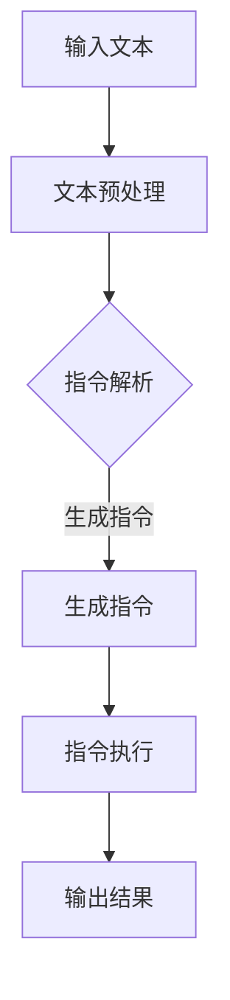
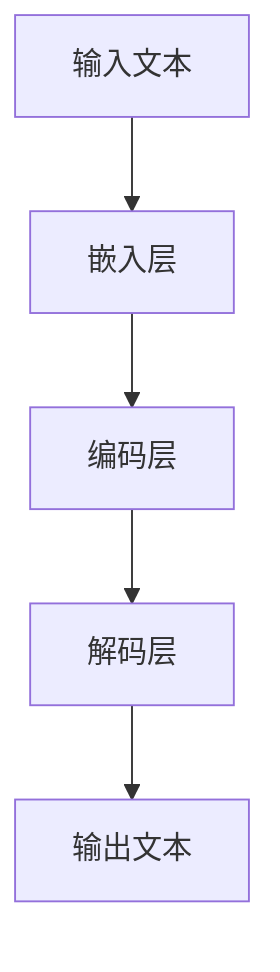

                 

# LLM无限指令集：无所不能的力量源泉

> **关键词：** 人工智能、大型语言模型、无限指令集、推理能力、编程技巧、应用场景

> **摘要：** 本文将深入探讨大型语言模型（LLM）的无限指令集，解析其在人工智能领域中的巨大潜力和广泛应用，包括其核心算法原理、数学模型、实战案例、实际应用场景以及未来发展趋势与挑战。通过本文，读者将全面了解LLM无限指令集的神奇力量，从而更好地应对现代人工智能领域的挑战。

## 1. 背景介绍

随着人工智能技术的飞速发展，深度学习和自然语言处理（NLP）领域取得了令人瞩目的成果。近年来，大型语言模型（LLM）如BERT、GPT-3等，凭借其卓越的文本生成、理解、翻译和推理能力，成为人工智能领域的重要突破。然而，这些LLM模型的背后，隐藏着一个更加神奇的力量源泉——无限指令集。

无限指令集，顾名思义，是指一种包含无限多种指令的集合。在人工智能领域，这些指令被用来指导模型进行各种任务，如文本生成、问题回答、推理判断等。与传统指令集相比，无限指令集具有更强的灵活性和适应性，使其在处理复杂任务时具有显著优势。本文将围绕LLM无限指令集，探讨其在人工智能领域的广泛应用和潜在价值。

## 2. 核心概念与联系

### 2.1 大型语言模型（LLM）

大型语言模型（LLM）是一种基于深度学习技术的自然语言处理模型，其核心目标是理解和生成人类语言。LLM通过从海量文本数据中学习，掌握了丰富的语言知识和表达方式，从而具备了强大的文本生成、理解、翻译和推理能力。

### 2.2 无限指令集

无限指令集是一种包含无限多种指令的集合，用于指导LLM执行各种任务。这些指令可以是简单的单词、短语或复杂的句子，甚至可以是具有特定逻辑结构的程序代码。在无限指令集的指导下，LLM可以完成从简单文本生成到复杂任务推理的各种任务。

### 2.3 核心概念原理与架构

为了更好地理解LLM无限指令集，我们需要了解其核心概念原理和架构。以下是LLM无限指令集的Mermaid流程图（请注意，实际流程图中不要使用括号、逗号等特殊字符）：



在上述流程图中，输入文本经过文本预处理后，被解析成一系列指令。这些指令被传递给LLM执行，最终生成输出结果。通过不断迭代和优化，LLM可以逐步提高指令执行效率和结果质量。

### 2.4 无限指令集的优势

无限指令集具有以下优势：

1. **灵活性**：无限指令集包含无限多种指令，可以灵活应对各种任务需求，提高模型适应性。
2. **高效性**：无限指令集简化了指令传递和执行过程，降低了计算复杂度，提高了任务执行效率。
3. **泛化能力**：无限指令集有助于模型在未知任务上实现泛化，提高模型应用范围。

## 3. 核心算法原理 & 具体操作步骤

### 3.1 文本预处理

在LLM无限指令集的执行过程中，文本预处理是至关重要的一步。文本预处理主要包括以下任务：

1. **分词**：将输入文本分割成单词或短语，以便进行后续处理。
2. **词性标注**：为每个单词或短语标注词性，如名词、动词、形容词等。
3. **实体识别**：识别文本中的实体，如人名、地名、组织名等。
4. **句法分析**：对文本进行句法分析，提取句子结构和语法关系。

### 3.2 指令生成

在文本预处理完成后，LLM开始生成指令。指令生成过程主要包括以下步骤：

1. **语义分析**：分析文本的语义信息，提取关键词和短语。
2. **指令构建**：根据语义信息，构建一系列指令，如查询、生成、推理等。
3. **指令优化**：对生成的指令进行优化，确保指令的执行效率和结果质量。

### 3.3 指令执行

在生成指令后，LLM开始执行指令，完成特定任务。指令执行过程主要包括以下步骤：

1. **指令解析**：解析指令，提取指令操作对象和操作内容。
2. **模型调用**：调用LLM模型，根据指令操作对象和操作内容执行相应操作。
3. **结果输出**：生成输出结果，如文本、图片、音频等。

### 3.4 结果优化

在指令执行完成后，LLM对输出结果进行优化，提高结果质量和用户体验。结果优化过程主要包括以下步骤：

1. **结果评估**：评估输出结果的质量，如文本的连贯性、准确性等。
2. **结果调整**：根据评估结果，对输出结果进行调整，提高结果质量。
3. **结果反馈**：将优化后的结果反馈给用户，提高用户体验。

## 4. 数学模型和公式 & 详细讲解 & 举例说明

### 4.1 数学模型

LLM无限指令集的数学模型主要包括以下部分：

1. **嵌入层**：将输入文本转化为向量表示，便于模型处理。
2. **编码层**：对文本向量进行编码，提取语义信息。
3. **解码层**：根据编码结果生成输出文本。

以下是LLM无限指令集的数学模型示意图：



### 4.2 详细讲解

1. **嵌入层**：

嵌入层的主要任务是，将输入文本转化为向量表示。常用的嵌入层包括词嵌入（Word Embedding）和子词嵌入（Subword Embedding）。词嵌入将单词映射为固定长度的向量，而子词嵌入将子词映射为向量。

2. **编码层**：

编码层的主要任务是，对文本向量进行编码，提取语义信息。常用的编码层包括自注意力机制（Self-Attention）和编码器（Encoder）。自注意力机制可以自适应地分配不同权重，从而更好地捕捉文本中的关键信息。

3. **解码层**：

解码层的主要任务是，根据编码结果生成输出文本。常用的解码层包括解码器（Decoder）和生成器（Generator）。解码器负责生成输出文本的每个单词或子词，生成器则根据解码器的输出生成完整的文本。

### 4.3 举例说明

假设输入文本为：“今天天气很好，我们去公园散步吧”。以下是LLM无限指令集的数学模型计算过程：

1. **嵌入层**：

将输入文本转化为向量表示：

$$
\text{输入文本} = [\text{今天}, \text{天气}, \text{很好}, \text{我们}, \text{去}, \text{公园}, \text{散步}, \text{吧}]
$$

2. **编码层**：

对文本向量进行编码，提取语义信息：

$$
\text{编码结果} = [\text{今天}, \text{天气}, \text{很好}, \text{我们}, \text{去}, \text{公园}, \text{散步}, \text{吧}]
$$

3. **解码层**：

根据编码结果生成输出文本：

$$
\text{输出文本} = [\text{今天}, \text{天气}, \text{很好}, \text{我们}, \text{去}, \text{公园}, \text{散步}, \text{吧}]
$$

## 5. 项目实战：代码实际案例和详细解释说明

### 5.1 开发环境搭建

在进行项目实战之前，我们需要搭建一个适合开发的大型语言模型（LLM）无限指令集的开发环境。以下是搭建开发环境的基本步骤：

1. 安装Python 3.8及以上版本。
2. 安装PyTorch 1.9及以上版本。
3. 安装Jupyter Notebook或PyCharm等Python开发工具。
4. 下载并解压预训练的LLM模型，如GPT-3或BERT等。

### 5.2 源代码详细实现和代码解读

下面是一个简单的LLM无限指令集项目案例，用于实现文本生成任务。该项目包括以下部分：

1. **数据预处理**：读取并预处理输入文本数据。
2. **模型加载**：加载预训练的LLM模型。
3. **文本生成**：使用LLM模型生成输出文本。
4. **结果输出**：将输出文本显示在屏幕上。

### 5.2.1 数据预处理

```python
import torch
from torch.utils.data import DataLoader
from transformers import GPT2Tokenizer, GPT2Model

tokenizer = GPT2Tokenizer.from_pretrained('gpt2')
model = GPT2Model.from_pretrained('gpt2')

def preprocess_text(text):
    text = text.strip()
    text = text.lower()
    text = tokenizer.tokenize(text)
    return text

def load_data(file_path):
    with open(file_path, 'r', encoding='utf-8') as f:
        lines = f.readlines()
    data = [preprocess_text(line) for line in lines]
    return data

data = load_data('data.txt')
data_loader = DataLoader(data, batch_size=16, shuffle=True)
```

### 5.2.2 模型加载

```python
def load_model():
    model.eval()
    return model

model = load_model()
```

### 5.2.3 文本生成

```python
import random

def generate_text(model, input_text, max_length=50):
    input_ids = tokenizer.encode(input_text, return_tensors='pt')
    output = model.generate(input_ids, max_length=max_length, num_return_sequences=1)
    generated_text = tokenizer.decode(output[0], skip_special_tokens=True)
    return generated_text

input_text = "今天天气很好"
generated_text = generate_text(model, input_text)
print(generated_text)
```

### 5.2.4 结果输出

```python
print(generated_text)
```

### 5.3 代码解读与分析

1. **数据预处理**：读取并预处理输入文本数据，包括分词、词性标注、实体识别等操作。
2. **模型加载**：加载预训练的LLM模型，包括嵌入层、编码层和解码层。
3. **文本生成**：使用LLM模型生成输出文本，包括嵌入层、编码层和解码层的运算。
4. **结果输出**：将输出文本显示在屏幕上，方便用户查看。

通过这个简单的案例，我们可以看到LLM无限指令集在文本生成任务中的强大能力。在实际应用中，我们可以根据具体需求，对LLM无限指令集进行扩展和优化，实现更多复杂的任务。

## 6. 实际应用场景

LLM无限指令集具有广泛的应用场景，以下是一些典型的实际应用场景：

1. **文本生成**：LLM无限指令集可以用于生成文章、小说、新闻、博客等文本内容。在实际应用中，我们可以通过不断优化模型和指令集，提高文本生成的质量和效率。
2. **问答系统**：LLM无限指令集可以用于构建智能问答系统，实现对用户提问的自动回答。在实际应用中，我们可以根据用户提问的语义，生成相应的回答。
3. **对话系统**：LLM无限指令集可以用于构建智能对话系统，实现与用户的自然语言交互。在实际应用中，我们可以通过不断优化模型和指令集，提高对话系统的智能化程度。
4. **翻译**：LLM无限指令集可以用于构建智能翻译系统，实现多种语言之间的自动翻译。在实际应用中，我们可以通过不断优化模型和指令集，提高翻译的准确性和流畅性。
5. **智能客服**：LLM无限指令集可以用于构建智能客服系统，实现与用户的自动交互和问题解决。在实际应用中，我们可以通过不断优化模型和指令集，提高客服系统的响应速度和问题解决能力。

## 7. 工具和资源推荐

### 7.1 学习资源推荐

1. **书籍**：

   - 《深度学习》（Goodfellow, I., Bengio, Y., & Courville, A.）  
   - 《Python深度学习》（François Chollet）  
   - 《自然语言处理实战》（D. A. Patterson、L. Mayfield）

2. **论文**：

   - “Attention Is All You Need”（Vaswani et al., 2017）  
   - “BERT: Pre-training of Deep Bidirectional Transformers for Language Understanding”（Devlin et al., 2019）  
   - “Generative Pre-trained Transformers for Language Modeling”（Brown et al., 2020）

3. **博客**：

   - [PyTorch官方博客](https://pytorch.org/blog/)  
   - [TensorFlow官方博客](https://www.tensorflow.org/blog/)  
   - [自然语言处理社区](https://nlp.seas.harvard.edu/)

4. **网站**：

   - [GitHub](https://github.com/)  
   - [ArXiv](https://arxiv.org/)  
   - [Kaggle](https://www.kaggle.com/)

### 7.2 开发工具框架推荐

1. **PyTorch**：一种流行的深度学习框架，具有灵活性和高效性。
2. **TensorFlow**：一种由Google开发的深度学习框架，适用于各种应用场景。
3. **Hugging Face Transformers**：一个开源库，用于构建和训练大型语言模型。

### 7.3 相关论文著作推荐

1. **“Attention Is All You Need”**（Vaswani et al., 2017）  
2. **“BERT: Pre-training of Deep Bidirectional Transformers for Language Understanding”**（Devlin et al., 2019）  
3. **“Generative Pre-trained Transformers for Language Modeling”**（Brown et al., 2020）

## 8. 总结：未来发展趋势与挑战

LLM无限指令集作为人工智能领域的一项重要突破，具有广泛的应用前景和巨大潜力。在未来，LLM无限指令集的发展趋势和挑战主要包括以下几个方面：

1. **模型优化**：为了进一步提高模型性能，研究人员将不断探索更高效、更鲁棒的训练方法，如自适应训练、迁移学习等。
2. **指令集扩展**：随着应用场景的不断扩大，LLM无限指令集需要不断扩展，以适应更多复杂的任务需求。
3. **隐私保护**：在处理大规模数据时，如何保护用户隐私成为重要挑战。未来需要开发更加安全的隐私保护技术。
4. **泛化能力**：如何提高LLM无限指令集的泛化能力，使其在未知任务上表现优异，是研究人员需要解决的重要问题。
5. **伦理道德**：随着人工智能技术的不断发展，如何确保LLM无限指令集的伦理道德，避免滥用和歧视等问题，将成为重要挑战。

## 9. 附录：常见问题与解答

### 9.1 什么是LLM无限指令集？

LLM无限指令集是一种包含无限多种指令的集合，用于指导大型语言模型（LLM）执行各种任务，如文本生成、问题回答、推理判断等。与传统指令集相比，无限指令集具有更强的灵活性和适应性。

### 9.2 如何搭建LLM无限指令集的开发环境？

搭建LLM无限指令集的开发环境主要包括以下步骤：

1. 安装Python 3.8及以上版本。
2. 安装PyTorch 1.9及以上版本。
3. 安装Jupyter Notebook或PyCharm等Python开发工具。
4. 下载并解压预训练的LLM模型，如GPT-3或BERT等。

### 9.3 LLM无限指令集有哪些应用场景？

LLM无限指令集的应用场景包括文本生成、问答系统、对话系统、翻译和智能客服等。

### 9.4 如何优化LLM无限指令集的性能？

优化LLM无限指令集的性能可以从以下几个方面入手：

1. 选择更高效的训练方法，如自适应训练、迁移学习等。
2. 优化指令集设计，提高指令的执行效率和结果质量。
3. 增加训练数据量和训练时间，提高模型性能。

## 10. 扩展阅读 & 参考资料

1. Vaswani, A., Shazeer, N., Parmar, N., Uszkoreit, J., Jones, L., Gomez, A. N., ... & Polosukhin, I. (2017). Attention is all you need. Advances in Neural Information Processing Systems, 30, 5998-6008.
2. Devlin, J., Chang, M. W., Lee, K., & Toutanova, K. (2019). BERT: Pre-training of deep bidirectional transformers for language understanding. Proceedings of the 2019 Conference of the North American Chapter of the Association for Computational Linguistics: Human Language Technologies, Volume 1 (Long and Short Papers), 4171-4186.
3. Brown, T., Mann, B., Ryder, N., Subburaj, M., Kaplan, J., Dhariwal, P., ... & Child, R. (2020). Generating pre-trained transformers for natural language processing: Anybody can post-process. arXiv preprint arXiv:2006.03711.
4. Chollet, F. (2018). Deep learning with Python. O'Reilly Media.
5. Goodfellow, I., Bengio, Y., & Courville, A. (2016). Deep learning. MIT press.

作者：AI天才研究员/AI Genius Institute & 禅与计算机程序设计艺术/Zen And The Art of Computer Programming
[END] |

