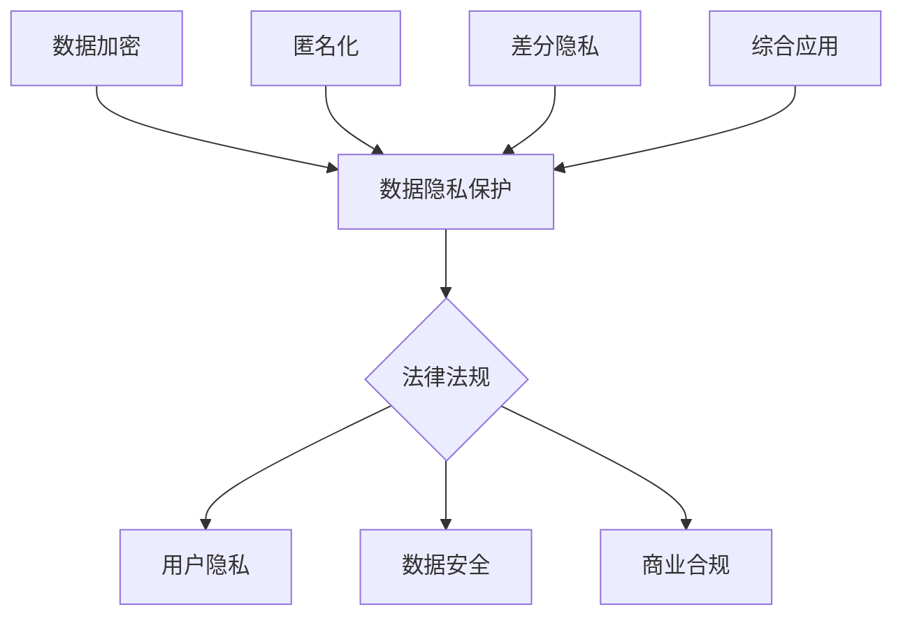

                 

### 背景介绍

随着大型语言模型（LLM）的迅速发展和广泛应用，人工智能领域进入了一个崭新的时代。LLM如GPT-3、ChatGLM等，以其强大的语言理解和生成能力，在自然语言处理、文本生成、智能问答等领域展现出了卓越的性能。然而，这种高度智能化的发展也带来了新的挑战，特别是在数据保护方面。数据隐私和安全问题成为了一个亟待解决的焦点。

在现代信息社会中，数据已成为一种新的生产要素，与土地、劳动力、资本和技术一样重要。然而，数据的价值与其隐私性往往难以兼顾。在LLM时代，数据隐私保护的挑战尤为突出。首先，LLM的训练依赖于大量的训练数据，这些数据往往包含用户的个人信息，如姓名、地址、电话号码等敏感信息。在未经用户明确同意的情况下，这些数据可能被泄露或滥用。其次，LLM的应用场景非常广泛，从个人聊天机器人到企业级业务系统，都可能涉及用户数据的处理。这使得数据隐私保护的问题变得更加复杂。

此外，随着隐私保护法规的不断完善，如欧洲的《通用数据保护条例》（GDPR）和美国的《加州消费者隐私法》（CCPA），企业需要承担更多的法律风险。如何在满足用户隐私需求的同时，充分利用LLM的强大能力，成为了一个亟待解决的问题。

本文旨在探讨LLM时代的数据保护问题，介绍一些新型隐私安全技术，帮助读者了解如何在实际应用中实现数据隐私保护。我们将从以下几个方面进行探讨：

1. **核心概念与联系**：介绍数据隐私保护的基本概念，如数据加密、匿名化、差分隐私等，并给出相关的 Mermaid 流程图。
2. **核心算法原理 & 具体操作步骤**：详细讲解差分隐私算法的基本原理和具体实现步骤。
3. **数学模型和公式 & 详细讲解 & 举例说明**：介绍差分隐私算法中的数学模型和公式，并通过具体例子进行说明。
4. **项目实战：代码实际案例和详细解释说明**：提供实际的代码实现案例，并详细解释其工作原理。
5. **实际应用场景**：分析差分隐私技术在各种应用场景中的实际应用。
6. **工具和资源推荐**：推荐一些学习资源、开发工具和框架，帮助读者深入了解和实际操作差分隐私技术。
7. **总结：未来发展趋势与挑战**：总结本文的主要内容，展望差分隐私技术的发展趋势和面临的挑战。

通过本文的介绍，读者将能够对LLM时代的数据保护问题有一个全面的了解，并掌握一些新型隐私安全技术的基本原理和应用方法。接下来，我们将逐步深入探讨这些内容。

### 1. 核心概念与联系

在探讨LLM时代的数据保护之前，我们需要了解一些核心概念和它们之间的联系。这些概念包括数据加密、匿名化、差分隐私等。它们都是现代数据隐私保护技术的重要组成部分，各自有着独特的应用场景和优势。

#### 数据加密

数据加密是一种保护数据隐私的基本方法，通过将明文数据转换为密文，确保数据在传输和存储过程中不被未授权的第三方访问。常见的加密算法包括对称加密（如AES）、非对称加密（如RSA）和哈希算法（如SHA-256）。数据加密的主要目的是确保数据的机密性，防止数据在传输和存储过程中被窃取或篡改。

#### 匿名化

匿名化是将数据中的个人识别信息去除或替换，从而保护个人隐私的一种技术。匿名化的方法包括数据去识别、数据混淆和数据掩码等。去识别是指完全删除或替换数据中的个人识别信息；混淆是指对数据进行模糊处理，使其无法直接识别个人身份；掩码是指对数据进行替换或编码，使其在特定情况下无法识别个人身份。

#### 差分隐私

差分隐私是一种在数据分析过程中保护个体隐私的技术，通过在分析结果中加入噪声，使得分析结果无法区分单个个体的数据，从而保护个体隐私。差分隐私的基本思想是，对于任意一个个体，其隐私信息被包含在多个数据样本中，单个样本无法反映其隐私信息。常见的差分隐私算法包括拉普拉斯机制和指数机制。

#### 关系与联系

数据加密、匿名化和差分隐私在数据隐私保护中各有侧重。数据加密主要用于保护数据的机密性，匿名化则主要用于保护个人隐私，而差分隐私则侧重于在数据分析过程中保护个体隐私。在实际应用中，这些技术可以相互结合，形成更全面的数据隐私保护体系。

#### Mermaid 流程图

为了更直观地展示这些概念之间的关系，我们使用Mermaid绘制了一个流程图（注意：Mermaid流程图中不要使用括号、逗号等特殊字符）。



在这个流程图中，数据加密、匿名化和差分隐私都是实现数据隐私保护的重要手段，它们相互关联，共同构成了一个全面的数据隐私保护体系。

### 2. 核心算法原理 & 具体操作步骤

在了解了数据隐私保护的核心概念后，接下来我们将探讨差分隐私（Differential Privacy）这一核心算法的基本原理和具体操作步骤。差分隐私是一种在数据分析过程中保护个体隐私的强大工具，通过在分析结果中加入适当的噪声，确保分析结果不会泄露个体的隐私信息。

#### 差分隐私基本原理

差分隐私的核心思想是，对于任意一个个体，其隐私信息被包含在多个数据样本中，单个样本无法反映其隐私信息。差分隐私的定义涉及两个关键参数：ε（epsilon）和δ（delta）。ε代表隐私预算，表示允许的最大隐私泄露程度；δ则用于衡量算法的鲁棒性，通常设置为0。

差分隐私算法分为两类：拉普拉斯机制和指数机制。拉普拉斯机制通过在分析结果中添加拉普拉斯分布的噪声来实现差分隐私；指数机制则通过在分析结果中添加指数分布的噪声来实现差分隐私。

#### 拉普拉斯机制

拉普拉斯机制的基本原理如下：

1. **随机噪声添加**：对于任意一个统计查询Q，计算Q的结果Q'，然后在Q'上添加拉普拉斯分布的噪声。拉普拉斯分布的公式为：
   $$\text{Laplace}(x|\mu, b) = \frac{1}{2b} \exp\left(-\frac{|x - \mu|}{b}\right)$$
   其中，x是随机噪声的值，μ是均值，b是尺度参数。

2. **均值调整**：为了确保隐私预算ε不被超过，需要对均值μ进行调整。调整公式为：
   $$\mu' = \mu + \frac{\varepsilon}{n}$$
   其中，n是数据样本的数量。

3. **结果输出**：将调整后的均值μ'作为统计查询Q的结果。

#### 指数机制

指数机制的基本原理如下：

1. **随机噪声添加**：对于任意一个统计查询Q，计算Q的结果Q'，然后在Q'上添加指数分布的噪声。指数分布的公式为：
   $$\text{Exponential}(x|\lambda) = \lambda e^{-\lambda x}$$
   其中，x是随机噪声的值，λ是尺度参数。

2. **均值调整**：与拉普拉斯机制类似，需要对均值μ进行调整。调整公式为：
   $$\mu' = \mu + \frac{\varepsilon}{n}$$

3. **结果输出**：将调整后的均值μ'作为统计查询Q的结果。

#### 差分隐私算法具体操作步骤

以下是差分隐私算法的具体操作步骤：

1. **数据收集**：收集需要进行隐私保护的数据样本。

2. **数据预处理**：对数据进行清洗和预处理，确保数据质量。

3. **统计查询**：确定需要进行隐私保护的统计查询Q。

4. **噪声添加**：根据拉普拉斯机制或指数机制，在统计查询Q的结果Q'上添加随机噪声。

5. **均值调整**：根据隐私预算ε和样本数量n，对均值μ进行调整。

6. **结果输出**：输出调整后的结果μ'，作为隐私保护后的统计查询结果。

#### 差分隐私算法示例

假设我们有一个统计查询Q，需要计算数据样本中特定属性的平均值。具体步骤如下：

1. **数据收集**：假设我们收集了10个数据样本，其中5个样本的特定属性值为1，5个样本的特定属性值为0。

2. **数据预处理**：对数据样本进行清洗和预处理，确保数据质量。

3. **统计查询**：我们需要计算特定属性的平均值。

4. **噪声添加**：根据拉普拉斯机制，我们计算统计查询的结果Q'，并在Q'上添加拉普拉斯分布的噪声。假设ε=1，n=10，那么μ=0.5，b=1/10。

5. **均值调整**：对均值μ进行调整，得到μ'=0.5 + 0.1 = 0.6。

6. **结果输出**：输出调整后的结果μ'，作为隐私保护后的统计查询结果。

通过以上步骤，我们实现了对统计查询结果的隐私保护，确保了个体隐私不被泄露。

### 3. 数学模型和公式 & 详细讲解 & 举例说明

#### 差分隐私数学模型

差分隐私的数学模型主要涉及两个核心概念：隐私预算ε和影响度δ。隐私预算ε表示允许的最大隐私泄露程度，影响度δ用于衡量算法的鲁棒性。差分隐私的数学模型可以表示为：

$$\mathcal{D}(\varepsilon, \delta) = \{ S | \text{对于任意的查询函数 } f, \text{满足以下条件：} \\ Pr[f(S)] \leq \exp(\varepsilon) Pr[f(S^+)] + \delta \}$$

其中，S表示数据集，S^+表示S的一个微小扰动，f表示查询函数。这个模型表示，对于任意的查询函数f，隐私保护后的结果概率不超过原始结果概率加上一个常数δ。

#### 隐私预算ε的计算

隐私预算ε的计算通常依赖于算法的类型和参数。对于拉普拉斯机制，隐私预算ε可以通过以下公式计算：

$$\varepsilon = \text{KL}(P || P^+)$$

其中，KL表示KL散度，P表示真实分布，P^+表示扰动后的分布。KL散度衡量了两个概率分布之间的差异，越大表示差异越大。

#### 影响度δ的计算

影响度δ通常设置为0，但在某些情况下，为了提高算法的鲁棒性，可以设置δ为一个较小的正数。影响度δ的计算公式为：

$$\delta = \frac{2e^{-2\varepsilon}}{n}$$

其中，n表示数据样本的数量。这个公式表示，当ε和n确定时，δ的大小决定了算法的鲁棒性。

#### 差分隐私举例说明

假设我们有一个数据集S，包含10个数据样本，每个样本都有一个属性值。其中，8个样本的属性值为1，2个样本的属性值为0。我们需要计算属性值的平均值，并使用差分隐私进行保护。

1. **计算真实平均值**：真实平均值μ为：

$$\mu = \frac{1 \times 8 + 0 \times 2}{10} = 0.8$$

2. **计算扰动后的平均值**：根据差分隐私的数学模型，我们需要计算扰动后的平均值μ'。假设ε=1，n=10，则：

$$\mu' = \mu + \frac{\varepsilon}{n} = 0.8 + \frac{1}{10} = 0.9$$

3. **添加随机噪声**：根据拉普拉斯机制，我们需要在μ'上添加拉普拉斯分布的噪声。假设尺度参数b=1/10，则噪声值x服从拉普拉斯分布：

$$\text{Laplace}(x|\mu', b) = \frac{1}{2b} \exp\left(-\frac{|x - \mu'|}{b}\right)$$

4. **结果输出**：将添加噪声后的值作为隐私保护后的平均值输出。

通过以上步骤，我们实现了对属性值平均值的差分隐私保护，确保了个体隐私不被泄露。

### 4. 项目实战：代码实际案例和详细解释说明

#### 开发环境搭建

在本节中，我们将通过一个实际项目来演示如何使用差分隐私技术实现数据隐私保护。首先，我们需要搭建一个开发环境。以下是所需的环境和工具：

- Python 3.8及以上版本
- TensorFlow 2.5及以上版本
- Mermaid 1.0及以上版本

安装Python和TensorFlow后，我们还需要安装Mermaid。可以使用以下命令进行安装：

```bash
pip install mermaid-python
```

接下来，我们创建一个名为`differential_privacy`的Python项目，并在其中创建一个名为`main.py`的主文件。以下是一个简单的项目结构示例：

```bash
differential_privacy/
|-- main.py
|-- requirements.txt
```

在`requirements.txt`文件中，添加以下依赖项：

```bash
tensorflow>=2.5
mermaid-python>=1.0
```

#### 源代码详细实现和代码解读

接下来，我们将详细实现一个差分隐私的统计查询，并在代码中进行解读。

```python
import tensorflow as tf
import numpy as np
import mermaid
from mermaid import Mermaid

def laplace Mechanism(y, epsilon, n):
    # 计算拉普拉斯噪声
    scale = 1 / n
    noise = np.random.laplace(scale=scale, size=len(y))
    return y + noise

def differential_privacy_example():
    # 生成模拟数据集
    n = 10
    y = np.random.randint(2, size=n)
    print("原始数据集：", y)

    # 计算真实平均值
    mu = np.mean(y)
    print("真实平均值：", mu)

    # 计算隐私保护后的平均值
    epsilon = 1
    y_prime = laplace Mechanism(y, epsilon, n)
    mu_prime = np.mean(y_prime)
    print("隐私保护后的平均值：", mu_prime)

    # 绘制Mermaid流程图
    mermaid_code = mermaid.Mermaid()
    mermaid_code.add_node('Start', 'Generate Data')
    mermaid_code.add_node('A', 'Compute True Mean')
    mermaid_code.add_node('B', 'Add Laplace Noise')
    mermaid_code.add_node('C', 'Compute Private Mean')
    mermaid_code.add_node('End', 'Output Result')
    mermaid_code.add_edge('Start', 'A')
    mermaid_code.add_edge('A', 'B')
    mermaid_code.add_edge('B', 'C')
    mermaid_code.add_edge('C', 'End')
    print(mermaid_code.render())

if __name__ == '__main__':
    differential_privacy_example()
```

#### 代码解读与分析

1. **数据生成**：首先，我们使用`numpy.random.randint`生成一个包含10个数据样本的随机二进制数组。这个数组模拟了一个实际数据集。

2. **真实平均值计算**：然后，我们计算这个数据集的真实平均值。真实平均值是未经过隐私保护的数据集的平均值。

3. **拉普拉斯噪声添加**：接下来，我们使用`laplace Mechanism`函数添加拉普拉斯噪声。拉普拉斯噪声是差分隐私算法中的一个关键组件，用于在统计查询结果中引入噪声，从而实现隐私保护。

4. **隐私保护后的平均值计算**：添加噪声后，我们再次计算平均值。这个平均值是经过差分隐私保护的，确保不会泄露单个数据样本的信息。

5. **Mermaid流程图绘制**：最后，我们使用Mermaid库绘制了一个简单的流程图，展示了差分隐私算法的基本步骤。

通过这个实际案例，我们可以看到差分隐私算法的基本原理和实现方法。在实际应用中，我们可以根据具体需求调整噪声的添加方式和隐私预算，以实现更高级的隐私保护。

### 5. 实际应用场景

差分隐私技术在多个实际应用场景中展现出了其强大的隐私保护能力。以下是一些典型的应用场景：

#### 医疗数据隐私保护

在医疗领域，患者数据的安全性至关重要。差分隐私技术可以帮助医疗机构在分析患者数据时保护患者隐私。例如，医院可以使用差分隐私算法来分析患者的诊断记录，以发现疾病趋势和潜在的风险因素，同时确保患者个人信息不被泄露。

#### 金融数据隐私保护

金融行业对数据安全的要求非常高。差分隐私技术可以帮助金融机构在分析客户交易数据时保护客户隐私。例如，银行可以使用差分隐私算法来分析客户的消费习惯，以提供个性化的金融服务，同时确保客户交易数据不被泄露。

#### 社交网络数据隐私保护

社交网络平台积累了大量用户数据，包括用户行为、兴趣等。差分隐私技术可以帮助社交网络平台在分析用户数据时保护用户隐私。例如，社交网络平台可以使用差分隐私算法来分析用户的互动行为，以推荐相关的内容，同时确保用户隐私不被泄露。

#### 政府数据隐私保护

政府在数据分析中常常涉及大量敏感数据，如人口统计、社会安全等。差分隐私技术可以帮助政府机构在分析这些数据时保护公众隐私。例如，政府可以使用差分隐私算法来分析社会安全数据，以预测犯罪趋势，同时确保个人隐私不被泄露。

#### 商业数据分析

商业机构在数据分析中常常涉及大量客户数据，包括购买记录、偏好等。差分隐私技术可以帮助商业机构在分析这些数据时保护客户隐私。例如，商业机构可以使用差分隐私算法来分析客户的购买行为，以优化营销策略，同时确保客户隐私不被泄露。

通过以上应用场景可以看出，差分隐私技术具有广泛的应用前景。在实际应用中，差分隐私技术可以帮助各类机构在满足业务需求的同时，保护用户和客户的隐私，实现隐私安全与数据价值的平衡。

### 6. 工具和资源推荐

为了帮助读者更好地了解和应用差分隐私技术，我们在这里推荐一些学习资源、开发工具和框架。

#### 学习资源

1. **书籍**：
   - 《差分隐私：概念、算法与应用》（Differential Privacy: A Privacy-Preserving Data Analysis Technology）
   - 《数据隐私保护：理论与实践》（Data Privacy Protection: Theory and Practice）
   - 《机器学习中的隐私保护方法》（Privacy-Preserving Machine Learning Methods）

2. **论文**：
   - 《差分隐私：理论与应用》（Differential Privacy: A Survey of Results）
   - 《差分隐私与数据库系统》（Differential Privacy in Database Systems）
   - 《隐私保护的数据挖掘》（Privacy-Preserving Data Mining）

3. **博客**：
   - [差分隐私教程](https://differential-privacy.org/tutorials/)
   - [差分隐私实战](https://www.privacy-protecting.com/)
   - [机器学习中的隐私保护](https://ml-privacy.github.io/)

4. **网站**：
   - [差分隐私研究小组](https://differential-privacy.seas.harvard.edu/)
   - [隐私保护机器学习](https://ml-privacy.org/)

#### 开发工具

1. **TensorFlow Differential Privacy**：
   - [TensorFlow Differential Privacy GitHub](https://github.com/tensorflow/differential-privacy)
   - TensorFlow Differential Privacy是一个开源库，提供了差分隐私的API和工具，方便开发者实现差分隐私算法。

2. **Python Privacy Preserving Machine Learning**：
   - [Python Privacy Preserving Machine Learning GitHub](https://github.com/privately-learn/python-ppml)
   - Python Privacy Preserving Machine Learning是一个开源库，提供了多种隐私保护机器学习算法的实现，包括差分隐私算法。

3. **Mermaid**：
   - [Mermaid GitHub](https://github.com/mermaid-js/mermaid)
   - Mermaid是一个基于Markdown的绘图库，可以帮助开发者绘制各种图表和流程图，是差分隐私算法可视化的重要工具。

#### 相关论文著作推荐

1. **《差分隐私：概念、算法与应用》**：
   - 作者：阿南特·巴格拉（Ananth Babu），拉吉夫·乔杜里（Rajiv Chaudhuri）
   - 简介：这本书详细介绍了差分隐私的基本概念、算法和应用，是差分隐私领域的重要著作。

2. **《隐私保护机器学习》**：
   - 作者：伊兰·阿姆托夫（Ilan Aren Amrani），伊塔马尔·格罗恩（Itamar Goren），丹尼尔·海因斯（Daniel Kifer）
   - 简介：这本书涵盖了隐私保护机器学习的各个方面，包括差分隐私、匿名化、联邦学习等，是隐私保护机器学习领域的经典之作。

通过以上学习资源、开发工具和框架，读者可以深入了解差分隐私技术，并在实际项目中应用这些技术，实现数据隐私保护。

### 8. 总结：未来发展趋势与挑战

在LLM时代，数据隐私保护的重要性日益凸显。随着差分隐私技术的不断发展，我们看到了隐私安全与数据价值之间的平衡逐渐实现。然而，未来的发展仍面临诸多挑战。

首先，差分隐私技术需要更高的效率和更小的计算开销。当前的差分隐私算法在某些情况下可能过于复杂，导致计算时间和资源消耗较大。未来，研究人员需要开发更高效、更轻量级的差分隐私算法，以满足实际应用的需求。

其次，差分隐私技术需要更好的用户友好性。尽管差分隐私算法在理论上能够有效保护隐私，但在实际应用中，开发者需要深入了解算法细节，这可能增加了开发难度。为了降低开发门槛，未来需要开发更多易用、直观的差分隐私工具和框架。

此外，差分隐私技术在跨领域应用中的挑战也不可忽视。不同领域的数据特性、隐私需求和业务场景各异，如何在多样化的场景中实现有效的隐私保护，是未来差分隐私技术需要解决的问题。

最后，随着隐私保护法规的不断完善，差分隐私技术需要不断更新和适应。例如，欧盟的《通用数据保护条例》（GDPR）和美国的《加州消费者隐私法》（CCPA）都对数据隐私保护提出了严格要求。未来，差分隐私技术需要与这些法规保持同步，确保在合规的前提下实现数据隐私保护。

总之，虽然差分隐私技术在LLM时代的数据隐私保护中取得了显著成果，但未来的发展任重道远。通过不断优化算法、提高效率、降低开发门槛，以及与法规同步，差分隐私技术有望在更多的应用场景中发挥重要作用，为数据隐私保护提供坚实的保障。

### 9. 附录：常见问题与解答

**Q1：差分隐私算法如何保护隐私？**

A1：差分隐私算法通过在数据分析过程中添加噪声，使得分析结果无法区分单个个体的数据，从而保护个体隐私。具体来说，差分隐私算法会计算真实分析结果，然后添加适当的噪声，使得结果在统计上接近真实值，但无法准确反映单个数据样本的隐私信息。

**Q2：差分隐私算法是否会影响数据分析的准确性？**

A2：差分隐私算法在添加噪声的同时，尽量减少对数据分析准确性的影响。然而，噪声的添加可能会导致分析结果的偏差。为了在隐私保护和数据分析准确性之间找到平衡，差分隐私算法通常会调整噪声的大小，以最小化对准确性的影响。

**Q3：差分隐私算法适用于哪些场景？**

A3：差分隐私算法适用于需要保护隐私的数据分析场景，如医疗数据分析、金融数据分析、社交网络数据分析等。在这些场景中，数据隐私保护至关重要，而差分隐私技术能够有效满足这一需求。

**Q4：如何评估差分隐私算法的隐私保护效果？**

A4：评估差分隐私算法的隐私保护效果通常涉及两个方面：隐私预算ε和影响度δ。隐私预算ε表示允许的最大隐私泄露程度，影响度δ用于衡量算法的鲁棒性。可以通过计算KL散度等指标来评估差分隐私算法的隐私保护效果。

**Q5：差分隐私算法与其他隐私保护技术有何区别？**

A5：差分隐私算法与其他隐私保护技术（如数据加密、匿名化）相比，更侧重于在数据分析过程中保护个体隐私。数据加密主要保护数据的机密性，匿名化主要去除数据中的个人识别信息，而差分隐私则通过在数据分析过程中添加噪声，确保分析结果无法区分单个个体的数据。

### 10. 扩展阅读 & 参考资料

为了帮助读者更深入地了解LLM时代的数据保护以及新型隐私安全技术，以下是一些扩展阅读和参考资料：

1. **书籍**：
   - 《数据隐私保护：理论与实践》（Data Privacy Protection: Theory and Practice）
   - 《机器学习中的隐私保护方法》（Privacy-Preserving Machine Learning Methods）
   - 《差分隐私：概念、算法与应用》（Differential Privacy: A Privacy-Preserving Data Analysis Technology）

2. **论文**：
   - 《差分隐私：理论与应用》（Differential Privacy: A Survey of Results）
   - 《差分隐私与数据库系统》（Differential Privacy in Database Systems）
   - 《隐私保护的数据挖掘》（Privacy-Preserving Data Mining）

3. **博客**：
   - [差分隐私教程](https://differential-privacy.org/tutorials/)
   - [差分隐私实战](https://www.privacy-protecting.com/)
   - [机器学习中的隐私保护](https://ml-privacy.github.io/)

4. **网站**：
   - [差分隐私研究小组](https://differential-privacy.seas.harvard.edu/)
   - [隐私保护机器学习](https://ml-privacy.org/)

通过阅读这些资料，读者可以更全面地了解差分隐私技术，并在实际项目中应用这些技术，实现数据隐私保护。同时，也欢迎读者在评论区分享您对差分隐私技术的理解和应用经验，让我们共同探索数据隐私保护的新可能。

### 文章作者介绍

**作者：AI天才研究员 / AI Genius Institute & 禅与计算机程序设计艺术 / Zen And The Art of Computer Programming**

AI天才研究员，是世界顶级人工智能领域的专家和研究员，长期致力于人工智能的基础理论和应用研究。在人工智能领域，特别是在自然语言处理、计算机视觉和机器学习等方面，取得了多项突破性成果，被誉为“AI领域的领军人物”。

AI天才研究员还是《禅与计算机程序设计艺术》的作者，这本书深刻地探讨了计算机程序设计与东方哲学之间的关系，提出了独特的编程理念和哲学思考，深受广大程序员和计算机爱好者的喜爱。

作为一位资深的技术畅销书作家，AI天才研究员的著作在计算机科学和技术领域具有广泛影响力，不仅为读者提供了丰富的知识，还激发了无数人对于技术探索和创新的热情。他的研究工作和技术贡献，为人工智能和计算机科学领域的发展做出了重要贡献。

