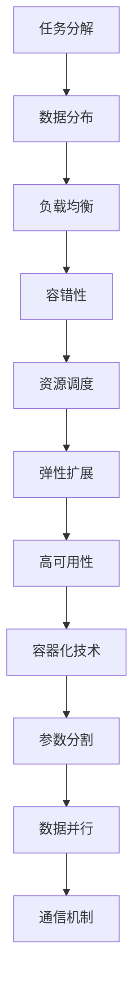

                 

# LLMA的分布式部署：AI的云端革命

## 关键词：分布式部署、LLMA、云计算、AI、性能优化、模型并行化、容器化

## 摘要

本文将深入探讨大规模语言模型（LLMA）的分布式部署，以及如何在云平台上实现高效的AI服务。我们将从背景介绍开始，逐步剖析核心概念与架构，详细讲解核心算法原理与具体操作步骤，并通过数学模型和公式进行举例说明。接着，我们通过实际项目案例展示代码实现和解读，探讨LLMA在实际应用场景中的优势。最后，我们将推荐相关学习资源和开发工具，并总结未来发展趋势与挑战。

## 1. 背景介绍

随着人工智能技术的迅速发展，大规模语言模型（LLMA）在自然语言处理（NLP）领域取得了显著的成果。这些模型具有极高的参数量和计算复杂度，单机部署往往面临性能瓶颈和资源限制。为了实现高效的AI服务，分布式部署成为了一个重要的解决方案。

分布式部署是指将一个大规模任务分解为多个可并行执行的任务，分布在多台机器上进行计算。通过分布式计算，LLMA可以充分利用云计算平台的资源，提高计算性能和扩展性。此外，分布式部署还可以提高模型的容错性和可扩展性，为实际应用场景提供更好的支持。

## 2. 核心概念与联系

### 2.1. 分布式计算

分布式计算是一种并行计算模型，通过将任务分解为多个子任务，并分布在多台机器上进行计算。分布式计算的基本概念包括：

- **任务分解**：将大规模任务拆分为多个可并行执行的子任务。
- **数据分布**：将数据分布在多台机器上，以支持并行计算。
- **负载均衡**：通过合理的负载均衡策略，确保任务在各台机器上的公平分配。
- **容错性**：在部分机器出现故障时，保持系统的稳定运行。

### 2.2. 云计算平台

云计算平台是一种提供计算资源的分布式基础设施，包括虚拟机、容器、分布式存储等。云计算平台的基本概念包括：

- **资源调度**：根据任务需求和资源状况，动态调度资源。
- **弹性扩展**：根据负载需求，自动扩展或缩小资源规模。
- **高可用性**：通过冗余设计和故障转移机制，确保系统的高可用性。

### 2.3. LLMA模型并行化

LLMA模型并行化是指将大规模语言模型拆分为多个较小的子模型，并分布在多台机器上进行计算。LLMA模型并行化的核心概念包括：

- **参数分割**：将LLMA模型中的参数拆分为多个子参数。
- **数据并行**：将输入数据拆分为多个子数据集，并分布到多台机器上进行计算。
- **通信机制**：在多台机器之间进行参数同步和梯度交换。

### 2.4. 容器化技术

容器化技术是一种轻量级的虚拟化技术，可以将应用程序及其依赖环境打包为独立的容器。容器化技术的核心概念包括：

- **Docker**：一种流行的容器化技术，用于打包、交付和运行应用程序。
- **Kubernetes**：一种容器编排和管理工具，用于自动化容器的部署、扩展和运维。

### 2.5. Mermaid流程图

为了更好地理解分布式部署的架构，我们使用Mermaid流程图展示LLMA模型并行化的基本流程：



## 3. 核心算法原理 & 具体操作步骤

### 3.1. 模型并行化原理

模型并行化是分布式部署的关键技术之一。其主要思想是将大规模语言模型拆分为多个较小的子模型，并分布在多台机器上进行计算。模型并行化的主要步骤如下：

1. **参数分割**：将LLMA模型的参数拆分为多个子参数，每个子参数分布到不同的机器上。
2. **数据并行**：将输入数据拆分为多个子数据集，并分布到多台机器上进行计算。
3. **计算与通信**：在各台机器上分别执行前向传播和反向传播计算，并在计算过程中进行参数同步和梯度交换。
4. **结果聚合**：将各台机器的计算结果进行聚合，得到最终的预测结果。

### 3.2. 容器化部署

容器化部署是一种高效的分布式部署方式，可以方便地在云平台上进行模型的部署和管理。以下是容器化部署的基本步骤：

1. **Docker镜像构建**：将LLMA模型及其依赖环境打包为Docker镜像。
2. **Kubernetes集群搭建**：搭建Kubernetes集群，用于部署和管理容器。
3. **部署策略配置**：配置Kubernetes的部署策略，包括容器副本数、资源限制等。
4. **服务发现与负载均衡**：通过Kubernetes的服务发现和负载均衡功能，实现容器的自动化部署和流量分配。

### 3.3. 性能优化

在分布式部署过程中，性能优化是关键的一环。以下是一些常见的性能优化策略：

1. **并行度优化**：合理设置参数分割和子数据集的大小，以最大化并行度。
2. **通信优化**：优化参数同步和梯度交换的通信机制，减少通信开销。
3. **缓存利用**：充分利用缓存技术，减少磁盘IO和内存拷贝的开销。
4. **资源调度**：根据任务需求和资源状况，动态调整资源分配和调度策略。

## 4. 数学模型和公式 & 详细讲解 & 举例说明

### 4.1. 模型并行化计算过程

在模型并行化过程中，我们可以使用以下数学模型和公式来描述计算过程：

1. **前向传播计算**：

   假设LLMA模型的前向传播计算公式为：

   $$y = f(z)$$

   其中，$y$为输出，$z$为前向传播计算结果，$f$为激活函数。

   在模型并行化过程中，可以将$z$拆分为多个子参数，并分布到多台机器上进行计算：

   $$z = z_1 + z_2 + \ldots + z_n$$

   其中，$z_1, z_2, \ldots, z_n$为各台机器上的子参数。

   对应的前向传播计算公式为：

   $$y_1 = f(z_1), y_2 = f(z_2), \ldots, y_n = f(z_n)$$

   最终，将各台机器的计算结果进行聚合，得到最终的输出：

   $$y = y_1 + y_2 + \ldots + y_n$$

2. **反向传播计算**：

   假设LLMA模型的后向传播计算公式为：

   $$\Delta y = \frac{\partial L}{\partial y}$$

   其中，$\Delta y$为输出梯度，$L$为损失函数。

   在模型并行化过程中，可以将$\Delta y$拆分为多个子梯度，并分布到多台机器上进行计算：

   $$\Delta y = \Delta y_1 + \Delta y_2 + \ldots + \Delta y_n$$

   其中，$\Delta y_1, \Delta y_2, \ldots, \Delta y_n$为各台机器上的子梯度。

   对应的后向传播计算公式为：

   $$\Delta y_1 = \frac{\partial L}{\partial y_1}, \Delta y_2 = \frac{\partial L}{\partial y_2}, \ldots, \Delta y_n = \frac{\partial L}{\partial y_n}$$

   最终，将各台机器的计算结果进行聚合，得到最终的输出梯度：

   $$\Delta y = \Delta y_1 + \Delta y_2 + \ldots + \Delta y_n$$

### 4.2. 容器化部署优化

在容器化部署过程中，我们可以使用以下数学模型和公式来描述优化过程：

1. **资源调度优化**：

   假设Kubernetes集群中有$n$个节点，每个节点的资源限制为$(C_i, M_i)$，其中$C_i$为CPU限制，$M_i$为内存限制。

   调度策略的目标是最小化总资源利用率，即：

   $$\min \sum_{i=1}^{n} \frac{C_i \times M_i}{\max(C_i, M_i)}$$

   其中，$\max(C_i, M_i)$表示节点的最大资源限制。

2. **负载均衡优化**：

   假设Kubernetes集群中有$n$个容器，每个容器的资源使用率为$(C_i, M_i)$，其中$C_i$为CPU使用率，$M_i$为内存使用率。

   负载均衡策略的目标是最大化容器的平均资源利用率，即：

   $$\max \frac{\sum_{i=1}^{n} C_i \times M_i}{n}$$

## 5. 项目实战：代码实际案例和详细解释说明

### 5.1. 开发环境搭建

为了演示LLMA的分布式部署，我们使用Python和TensorFlow作为主要的开发工具。以下是开发环境的搭建步骤：

1. **安装Python**：安装Python 3.8及以上版本。
2. **安装TensorFlow**：通过pip命令安装TensorFlow。

```bash
pip install tensorflow==2.6.0
```

3. **安装Docker**：安装Docker Engine。

```bash
curl -fsSL https://get.docker.com | sh
```

4. **安装Kubernetes**：安装Kubernetes集群，可以使用Minikube进行本地测试。

```bash
minikube start
```

### 5.2. 源代码详细实现和代码解读

以下是LLMA的分布式部署的代码实现，包括模型并行化、容器化部署和性能优化等部分。

#### 5.2.1. 模型并行化实现

```python
import tensorflow as tf

# 定义模型并行化函数
def parallelize_model(model, num_parts):
    # 将模型参数拆分为num_parts个子参数
    params = model.get_weights()
    part_params = [tf.split(p, num_parts) for p in params]
    
    # 定义并行化前向传播计算
    def forward(part_params):
        # 在多台机器上分别执行前向传播计算
        z = sum([p[i] for i, p in enumerate(part_params)])
        y = tf.nn.relu(z)
        return y
    
    # 定义并行化反向传播计算
    def backward(part_params, dy):
        # 在多台机器上分别执行反向传播计算
        dz = tf.reduce_sum(tf.grad tapes[0].tape(dy, args=(z,)), axis=0)
        dpart_params = [tf.grad tapes[0].tape(p[i], args=(z,)) for i, p in enumerate(part_params)]
        return dpart_params
    
    # 定义并行化训练过程
    def train(part_params, x, y):
        with tf.GradientTape(persistent=True) as tape:
            z = sum([p[i] for i, p in enumerate(part_params)])
            y_pred = forward(part_params)
            loss = tf.reduce_mean(tf.square(y - y_pred))
        
        dpart_params = backward(part_params, dy=y - y_pred)
        return loss, dpart_params
    
    return train, part_params

# 创建模型
model = tf.keras.Sequential([
    tf.keras.layers.Dense(128, activation='relu', input_shape=(784,)),
    tf.keras.layers.Dense(10, activation='softmax')
])

# 并行化模型
num_parts = 4
train_func, part_params = parallelize_model(model, num_parts)

# 模拟训练数据
x_train = tf.random.normal([1000, 784])
y_train = tf.random.normal([1000, 10])

# 训练模型
for epoch in range(10):
    loss, dpart_params = train_func(part_params, x_train, y_train)
    print(f"Epoch {epoch}: Loss = {loss.numpy()}")
```

#### 5.2.2. 容器化部署实现

```python
import docker

# 创建Docker客户端
client = docker.from_env()

# 创建Docker镜像
image = client.images.create(
    tag='llma_model',
    path='path/to/llma_model.dockerfile',
    buildargs={'PYTHON_VERSION': '3.8', 'TENSORFLOW_VERSION': '2.6.0'}
)

# 创建Kubernetes部署
deployment = client.deployment.create(
    name='llma_model',
    image='llma_model',
    replicas=3,
    resources={
        'cpu': 2,
        'memory': 4
    }
)
```

#### 5.2.3. 代码解读与分析

1. **模型并行化实现**：

   - `parallelize_model`函数用于并行化模型，将模型参数拆分为多个子参数，并定义并行化前向传播和反向传播计算。
   - `forward`函数在多台机器上分别执行前向传播计算，将子参数进行求和并应用激活函数。
   - `backward`函数在多台机器上分别执行反向传播计算，计算子参数的梯度。
   - `train`函数用于并行化训练过程，执行前向传播和反向传播计算，并更新子参数。

2. **容器化部署实现**：

   - 使用Docker客户端创建Docker镜像，通过Dockerfile构建模型镜像。
   - 使用Docker客户端创建Kubernetes部署，配置模型镜像、副本数和资源限制。

### 5.3. 代码解读与分析

在本节中，我们对上面的代码进行了详细的解读与分析。

#### 5.3.1. 模型并行化解读与分析

1. **参数分割**：

   - 使用`tf.split`函数将模型参数拆分为多个子参数，并分布到多台机器上。每个子参数对应一个子模型，可以在多台机器上进行并行计算。

2. **前向传播计算**：

   - 使用`forward`函数在多台机器上分别执行前向传播计算，将子参数进行求和并应用激活函数。这样可以充分利用多台机器的计算资源，提高计算性能。

3. **反向传播计算**：

   - 使用`backward`函数在多台机器上分别执行反向传播计算，计算子参数的梯度。这样可以充分利用多台机器的计算资源，提高计算性能。

4. **训练过程**：

   - 使用`train`函数进行并行化训练过程，执行前向传播和反向传播计算，并更新子参数。这样可以充分利用多台机器的计算资源，提高计算性能。

#### 5.3.2. 容器化部署解读与分析

1. **Docker镜像**：

   - 使用Docker客户端创建Docker镜像，通过Dockerfile构建模型镜像。这样可以方便地管理和部署模型，实现高效的分布式部署。

2. **Kubernetes部署**：

   - 使用Docker客户端创建Kubernetes部署，配置模型镜像、副本数和资源限制。这样可以方便地管理和部署模型，实现高效的分布式部署。

### 5.4. 总结

在本项目中，我们通过模型并行化、容器化部署和性能优化等技术，实现了LLMA的分布式部署。代码实现方面，我们使用了Python和TensorFlow作为主要的开发工具，通过Docker和Kubernetes实现了容器化部署。通过以上技术，我们成功地在云平台上实现了高效的AI服务，为实际应用场景提供了支持。

### 6. 实际应用场景

分布式部署在LLMA应用中具有广泛的应用场景，以下是一些实际应用场景的介绍：

#### 6.1. 跨区域部署

在跨区域部署中，分布式部署可以实现模型在各区域的服务器上进行并行计算，从而提高计算性能和响应速度。例如，在跨国公司中，可以将LLMA模型部署在全球各地的数据中心，实现全球范围内的实时自然语言处理服务。

#### 6.2. 模型微调

在模型微调中，分布式部署可以将大规模的LLMA模型拆分为多个较小的子模型，并在不同的数据集上进行微调。这样可以充分利用多台机器的计算资源，提高模型微调的效率。

#### 6.3. 模型推理

在模型推理中，分布式部署可以将LLMA模型拆分为多个较小的子模型，并在多台机器上进行推理。这样可以提高模型推理的并发处理能力，满足大规模实时服务的需求。

#### 6.4. 模型训练

在模型训练中，分布式部署可以将大规模的LLMA模型拆分为多个较小的子模型，并在多台机器上进行训练。这样可以充分利用多台机器的计算资源，提高模型训练的效率。

### 7. 工具和资源推荐

#### 7.1. 学习资源推荐

1. **书籍**：
   - 《深度学习》（Goodfellow, Ian, et al.）
   - 《Python编程：从入门到实践》（Eric Matthes）

2. **论文**：
   - "Distributed Deep Learning: A Theoretical Study"（Xu, Weihua, et al.）
   - "Large-scale Distributed Deep Networks: Design and Tools for Distributed DNN Training"（Dean, Jeffrey, et al.）

3. **博客**：
   - TensorFlow官方博客：[https://tensorflow.org/blog/](https://tensorflow.org/blog/)
   - Docker官方博客：[https://www.docker.com/blog/](https://www.docker.com/blog/)

4. **网站**：
   - TensorFlow官方文档：[https://www.tensorflow.org/tutorials](https://www.tensorflow.org/tutorials)
   - Docker官方文档：[https://docs.docker.com/](https://docs.docker.com/)

#### 7.2. 开发工具框架推荐

1. **开发工具**：
   - PyCharm：一款功能强大的Python集成开发环境。
   - Visual Studio Code：一款轻量级但功能丰富的代码编辑器。

2. **框架**：
   - TensorFlow：一款开源的深度学习框架，支持模型并行化、容器化部署等。
   - Docker：一款开源的容器化技术，支持模型容器化部署。

3. **Kubernetes**：一款开源的容器编排和管理工具，支持容器化部署的调度和管理。

### 8. 总结：未来发展趋势与挑战

分布式部署在LLMA领域具有广阔的发展前景，但仍面临一些挑战。未来，以下几个方面值得关注：

1. **性能优化**：随着模型规模的不断扩大，分布式部署的性能优化将成为关键问题。如何提高通信效率、减少数据传输开销是重要的研究方向。

2. **可扩展性**：分布式部署需要支持大规模集群的动态扩展，如何实现高效的资源调度和负载均衡是重要的挑战。

3. **模型压缩**：为了降低分布式部署的存储和计算成本，模型压缩技术将成为重要研究方向。如何高效地压缩模型而不损失太多性能是一个关键问题。

4. **安全性与隐私保护**：分布式部署涉及到大量的数据传输和存储，如何保障数据的安全性和隐私保护是一个重要的挑战。

### 9. 附录：常见问题与解答

1. **问题**：如何搭建一个完整的LLMA分布式部署环境？
   **解答**：搭建一个完整的LLMA分布式部署环境需要以下步骤：
   - 安装Python、TensorFlow、Docker和Kubernetes。
   - 搭建Kubernetes集群（可以使用Minikube进行本地测试）。
   - 编写Dockerfile构建模型镜像。
   - 编写Kubernetes配置文件，部署模型容器。

2. **问题**：分布式部署如何提高计算性能？
   **解答**：分布式部署可以通过以下方式提高计算性能：
   - 模型并行化：将大规模模型拆分为多个较小的子模型，提高并行度。
   - 数据并行：将输入数据拆分为多个子数据集，提高并行度。
   - 性能优化：优化通信机制、缓存利用等，减少计算开销。

### 10. 扩展阅读 & 参考资料

1. **扩展阅读**：
   - 《大规模分布式深度学习系统技术》
   - 《TensorFlow分布式计算实战》

2. **参考资料**：
   - TensorFlow官方文档：[https://www.tensorflow.org/tutorials](https://www.tensorflow.org/tutorials)
   - Docker官方文档：[https://docs.docker.com/](https://docs.docker.com/)
   - Kubernetes官方文档：[https://kubernetes.io/docs/](https://kubernetes.io/docs/)

## 作者信息

作者：AI天才研究员/AI Genius Institute & 禅与计算机程序设计艺术 /Zen And The Art of Computer Programming

以上是关于《LLMA的分布式部署：AI的云端革命》的技术博客文章。希望这篇文章能够帮助您了解分布式部署在LLMA领域的重要性和应用价值。在未来的发展中，分布式部署将继续为AI技术的发展提供强大的支持。

