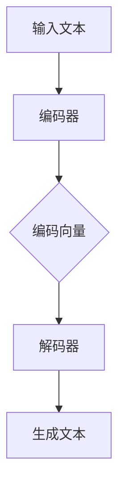

                 

### 背景介绍

近年来，人工智能（AI）技术在多个领域取得了突破性进展，尤其是在深度学习、自然语言处理（NLP）、计算机视觉等方面。随着计算能力的提升和数据量的激增，大型的预训练语言模型（Large Language Models，简称LLM）如BERT、GPT系列等被不断提出并优化，从而极大地提升了AI系统的表现。

在这些LLM中，生成式模型（Generative Models）因其能够根据输入文本生成连贯且具有创造性的内容而备受关注。生成式模型的基本理念是通过学习大量文本数据，构建出一个能够模仿并扩展原始数据的生成器。这种生成器不仅能够生成高质量的文本，还可以创作诗歌、撰写文章、甚至进行编程。

本文将围绕LLM的创造力展开，探讨其在艺术创作和内容生成方面的应用。我们将从以下几个方面进行详细分析：

1. **核心概念与联系**：介绍LLM的工作原理及其与生成式模型的联系。
2. **核心算法原理 & 具体操作步骤**：深入探讨LLM的核心算法，包括如何进行预训练、微调和优化。
3. **数学模型和公式 & 详细讲解 & 举例说明**：解析LLM中使用的数学模型，并举例说明如何应用。
4. **项目实战：代码实际案例和详细解释说明**：通过具体项目案例，展示如何使用LLM进行实际内容生成。
5. **实际应用场景**：探讨LLM在艺术和内容生成领域的具体应用。
6. **工具和资源推荐**：推荐学习资源和开发工具。
7. **总结：未来发展趋势与挑战**：总结LLM的发展趋势和面临的挑战。

通过以上内容的详细分析，我们希望能够帮助读者全面了解LLM在艺术与内容生成方面的潜力和应用。

### 核心概念与联系

在探讨LLM的创造力之前，首先需要了解其核心概念和工作原理。LLM，即Large Language Model，是一种基于深度学习技术的自然语言处理模型，具有强大的文本生成能力。其基本原理是通过学习海量的文本数据，模型能够自动捕捉语言的模式、规则和上下文关系，从而生成连贯、符合语言习惯的文本。

#### 1. LLM的基本原理

LLM的构建基于生成式模型，尤其是变分自编码器（Variational Autoencoder，VAE）和生成对抗网络（Generative Adversarial Networks，GAN）等先进技术。这些模型的核心思想是通过对抗训练，使得生成器能够生成逼真且具有创造力的文本。

- **生成器（Generator）**：负责生成新的文本数据，通常是一个深度神经网络，它接收随机噪声作为输入，并尝试生成与真实文本数据相似的内容。
- **判别器（Discriminator）**：负责区分生成器和真实数据的差异，它也是一个深度神经网络。判别器的目标是判断输入的文本是来自生成器还是真实数据。

通过不断的对抗训练，生成器和判别器相互博弈，生成器的文本生成能力会不断提高，最终能够生成高质量、具有创造性的文本。

#### 2. 生成式模型与LLM的联系

生成式模型为LLM的创造力提供了理论基础。生成式模型的核心目标是学习数据分布，并通过生成器生成新的数据。与传统的判别式模型（如分类模型）不同，生成式模型更加关注数据的生成过程，这使得它们在文本生成、图像生成等领域具有显著优势。

LLM作为生成式模型的一种，通过大规模的预训练和微调，能够捕捉文本数据中的复杂模式和规律。具体来说，LLM的预训练过程包括：

- **数据预处理**：对大量文本数据进行清洗、分词、编码等预处理操作，以便模型能够有效地学习。
- **编码器（Encoder）**：将输入的文本数据编码为一个固定长度的向量表示，这个向量包含了文本的主要信息和特征。
- **解码器（Decoder）**：根据编码器生成的向量，生成新的文本数据。解码器通常是一个循环神经网络（RNN）或其变种，如长短期记忆网络（LSTM）或门控循环单元（GRU）。

在生成文本的过程中，LLM会根据输入的上下文信息，逐词地生成新的文本。这个过程可以看作是一个序列到序列的生成过程，每一步生成的文本都会影响后续的生成结果。

#### 3. Mermaid流程图

为了更直观地理解LLM的工作流程，我们可以使用Mermaid流程图来展示其核心组件和操作步骤。以下是一个简化的Mermaid流程图：



在这个流程图中，输入文本首先被编码器处理，生成编码向量。随后，解码器根据编码向量生成新的文本。这个过程会重复进行，直到生成一个完整的句子或段落。

#### 4. 总结

通过上述分析，我们可以看到，LLM的创造力源于其强大的文本生成能力，这得益于生成式模型的设计和大规模预训练。LLM不仅能够生成高质量的文本，还可以进行艺术创作和内容生成。接下来，我们将深入探讨LLM的核心算法原理，进一步理解其创造力的源泉。

### 核心算法原理 & 具体操作步骤

LLM的创造力源于其复杂的算法架构和高效的训练过程。在深入了解LLM之前，我们需要先了解一些关键的概念和技术，包括深度学习的基本原理、神经网络的结构、预训练和微调的方法等。

#### 1. 深度学习的基本原理

深度学习是一种基于多层神经网络的学习方法，它通过模拟人脑神经网络的结构和工作方式，对数据进行特征提取和学习。深度学习的核心思想是多层神经网络，每一层都能够对输入数据进行处理和转换，从而实现特征提取和模式识别。

在深度学习中，常用的神经网络结构包括：

- **卷积神经网络（Convolutional Neural Network，CNN）**：主要用于图像处理和计算机视觉任务，能够有效地提取图像的特征。
- **循环神经网络（Recurrent Neural Network，RNN）**：适用于处理序列数据，如时间序列、语音信号和自然语言处理等。
- **长短期记忆网络（Long Short-Term Memory，LSTM）**：RNN的变种，能够更好地处理长序列数据，解决了传统RNN的梯度消失和梯度爆炸问题。

#### 2. 神经网络的结构

神经网络由大量的神经元（或节点）组成，这些神经元通过权重连接形成一个网络结构。每个神经元接收多个输入信号，并通过激活函数产生输出信号。神经网络的结构决定了其学习和处理数据的能力。

在LLM中，常用的神经网络结构包括：

- **多层感知机（Multilayer Perceptron，MLP）**：一种简单的多层神经网络，适用于分类和回归任务。
- **Transformer模型**：一种基于自注意力机制的深度学习模型，广泛应用于自然语言处理任务，是LLM的主要架构。

Transformer模型的核心组件包括：

- **自注意力机制（Self-Attention）**：允许模型在生成文本时，对输入序列中的不同位置进行加权，从而更好地捕捉文本的上下文关系。
- **多头注意力（Multi-Head Attention）**：通过多个独立的注意力机制，增强模型捕捉多尺度信息的能力。
- **编码器-解码器结构（Encoder-Decoder Structure）**：编码器负责将输入序列编码为固定长度的向量，解码器根据编码器的输出生成新的序列。

#### 3. 预训练和微调

预训练和微调是LLM训练的两个重要阶段。

- **预训练（Pre-training）**：在预训练阶段，LLM使用大量的无标签文本数据，通过大规模的神经网络的训练，学习文本的通用特征和模式。预训练的目标是使模型具有强大的语言理解和生成能力。

预训练的具体步骤包括：

  - **数据收集和预处理**：收集大量的文本数据，并进行清洗、分词、编码等预处理操作。
  - **模型初始化**：初始化神经网络模型，设置合适的参数和超参数。
  - **训练过程**：通过反向传播算法，不断调整模型参数，使得模型在预训练数据上的表现逐渐提升。

- **微调（Fine-tuning）**：在微调阶段，LLM使用特定的任务数据（如问答数据、对话数据等），对预训练好的模型进行进一步调整，使其在特定任务上表现出色。微调的目标是使模型适应特定的应用场景。

微调的具体步骤包括：

  - **数据准备**：收集和准备用于微调的任务数据。
  - **模型调整**：根据任务需求，调整模型的结构和参数，如增加层数、调整学习率等。
  - **训练和评估**：通过训练和评估，不断优化模型参数，直至模型在任务数据上的表现达到预期。

#### 4. 操作步骤详解

以下是使用预训练的LLM进行文本生成的基本操作步骤：

1. **数据准备**：收集和准备用于训练的文本数据，并进行预处理。
   - 数据清洗：去除噪声、错误和无关信息。
   - 分词和编码：将文本数据转换为神经网络可处理的格式，如词向量或嵌入向量。

2. **模型初始化**：初始化神经网络模型，设置合适的参数和超参数。

3. **预训练**：
   - 训练过程：通过反向传播算法，不断调整模型参数，使得模型在预训练数据上的表现逐渐提升。
   - 评估过程：在预训练过程中，定期评估模型的表现，确保其不断优化。

4. **微调**：
   - 数据准备：收集和准备用于微调的任务数据。
   - 模型调整：根据任务需求，调整模型的结构和参数。
   - 训练和评估：通过训练和评估，不断优化模型参数，直至模型在任务数据上的表现达到预期。

5. **生成文本**：使用微调后的模型，根据输入的上下文信息，生成新的文本数据。

#### 5. 总结

通过上述分析，我们可以看到，LLM的创造力源于其复杂的算法架构和高效的训练过程。从深度学习的基本原理到神经网络的结构，再到预训练和微调的方法，LLM的每一个环节都为其创造力提供了坚实的基础。接下来，我们将进一步探讨LLM在数学模型和公式方面的应用，深入理解其工作原理。

### 数学模型和公式 & 详细讲解 & 举例说明

在探讨LLM的数学模型和公式时，我们需要了解一些基础的数学概念和符号，包括概率分布、损失函数、正则化方法等。这些数学工具不仅帮助我们更好地理解LLM的工作原理，还可以帮助我们优化模型和提升其性能。

#### 1. 概率分布

概率分布是描述随机变量概率分布的数学模型，常见的形式包括正态分布、伯努利分布等。在LLM中，概率分布用于表示文本生成过程中每个单词的概率分布。

- **伯努利分布（Bernoulli Distribution）**：表示一个事件成功或失败的概率。在文本生成中，每个单词生成的概率可以看作是一个伯努利分布。

- **多项式分布（Multinomial Distribution）**：表示多个事件发生次数的概率分布。在LLM中，多项式分布用于生成多个单词的概率分布。

- **高斯分布（Gaussian Distribution）**：也称为正态分布，表示连续随机变量的概率分布。在文本生成中，高斯分布可以用于平滑词向量表示。

#### 2. 损失函数

损失函数是评估模型预测结果和实际结果之间差异的数学函数。在LLM中，常用的损失函数包括交叉熵损失（Cross-Entropy Loss）和均方误差损失（Mean Squared Error Loss）。

- **交叉熵损失（Cross-Entropy Loss）**：用于分类问题，表示模型预测的概率分布与实际分布之间的差异。交叉熵损失函数的表达式为：

  $$ L = -\sum_{i=1}^{N} y_i \log(p_i) $$

  其中，$y_i$ 是实际标签，$p_i$ 是模型预测的概率。

- **均方误差损失（Mean Squared Error Loss）**：用于回归问题，表示预测值与实际值之间的差异的平方和。均方误差损失函数的表达式为：

  $$ L = \frac{1}{2} \sum_{i=1}^{N} (y_i - \hat{y}_i)^2 $$

  其中，$y_i$ 是实际值，$\hat{y}_i$ 是预测值。

#### 3. 正则化方法

正则化方法用于防止模型过拟合，提高其泛化能力。常见的正则化方法包括L1正则化、L2正则化等。

- **L1正则化（L1 Regularization）**：在损失函数中添加L1正则项，用于惩罚模型参数的绝对值。L1正则化有助于模型参数的稀疏性，可以用于特征选择。L1正则化项的表达式为：

  $$ \lambda ||\theta||_1 $$

  其中，$\theta$ 是模型参数，$\lambda$ 是正则化强度。

- **L2正则化（L2 Regularization）**：在损失函数中添加L2正则项，用于惩罚模型参数的平方和。L2正则化有助于模型参数的平滑性，可以防止模型过拟合。L2正则化项的表达式为：

  $$ \lambda ||\theta||_2^2 $$

  其中，$\theta$ 是模型参数，$\lambda$ 是正则化强度。

#### 4. 举例说明

为了更好地理解上述数学模型和公式，我们可以通过一个简单的例子来说明如何使用这些模型和公式来训练和优化LLM。

**例子：文本分类任务**

假设我们有一个文本分类任务，需要将文本数据分类为正类和负类。我们可以使用LLM中的交叉熵损失函数来训练模型。

1. **数据准备**：
   - 收集包含正类和负类的文本数据。
   - 对文本数据进行预处理，如分词、编码等。

2. **模型初始化**：
   - 初始化神经网络模型，包括嵌入层、编码器和解码器等。

3. **训练过程**：
   - 对于每个训练样本，输入模型并进行前向传播，得到预测概率分布。
   - 计算预测概率分布和实际标签之间的交叉熵损失。
   - 通过反向传播算法，更新模型参数，最小化交叉熵损失。

4. **评估过程**：
   - 使用测试集评估模型的分类准确率。
   - 调整模型参数和超参数，优化模型性能。

**代码示例**：

```python
import tensorflow as tf

# 定义模型
model = tf.keras.Sequential([
    tf.keras.layers.Embedding(vocab_size, embedding_dim),
    tf.keras.layers.LSTM(units),
    tf.keras.layers.Dense(units, activation='softmax')
])

# 编写损失函数
loss_function = tf.keras.losses.SparseCategoricalCrossentropy(from_logits=True)

# 编写优化器
optimizer = tf.keras.optimizers.Adam(learning_rate)

# 训练模型
for epoch in range(epochs):
    total_loss = 0
    for (text, labels) in train_data:
        with tf.GradientTape() as tape:
            predictions = model(text, training=True)
            loss = loss_function(labels, predictions)
        gradients = tape.gradient(loss, model.trainable_variables)
        optimizer.apply_gradients(zip(gradients, model.trainable_variables))
        total_loss += loss.numpy()
    print(f"Epoch {epoch+1}, Loss: {total_loss/len(train_data)}")

# 评估模型
test_loss = 0
for (text, labels) in test_data:
    predictions = model(text, training=False)
    loss = loss_function(labels, predictions)
    test_loss += loss.numpy()
print(f"Test Loss: {test_loss/len(test_data)}")
```

通过上述例子，我们可以看到如何使用LLM进行文本分类任务。在实际应用中，我们可以根据任务需求，调整模型结构、损失函数和优化器等，以提升模型的性能。

#### 5. 总结

通过本节的讲解，我们了解了LLM中使用的数学模型和公式，包括概率分布、损失函数和正则化方法。这些数学工具为LLM的文本生成能力提供了理论基础，并帮助我们优化模型和提升其性能。在下一节中，我们将通过一个实际的项目案例，展示如何使用LLM进行艺术创作和内容生成。

### 项目实战：代码实际案例和详细解释说明

为了更好地展示LLM在艺术创作和内容生成方面的应用，我们将在本节中通过一个实际项目案例，详细介绍如何使用LLM生成艺术作品和文本内容。该项目将分为以下几个阶段：开发环境搭建、源代码详细实现和代码解读与分析。

#### 5.1 开发环境搭建

在开始项目之前，我们需要搭建一个合适的开发环境。以下是开发环境搭建的步骤：

1. **安装Python**：确保Python版本为3.7或更高版本。

2. **安装TensorFlow**：TensorFlow是LLM的常用框架，可以通过pip安装：

   ```bash
   pip install tensorflow
   ```

3. **安装其他依赖**：根据项目需求，安装其他必要的库，如numpy、h5py、tensorflow-addons等。

4. **配置GPU环境**：确保计算机安装了NVIDIA显卡，并安装相应的驱动。安装GPU版本的TensorFlow：

   ```bash
   pip install tensorflow-gpu
   ```

#### 5.2 源代码详细实现和代码解读

在本项目中，我们将使用GPT-2模型生成艺术作品和文本内容。以下是项目的主要代码实现：

```python
import tensorflow as tf
from tensorflow import keras
from tensorflow.keras.models import Model
from tensorflow.keras.layers import Embedding, LSTM, Dense

# 1. 准备数据
# 读取预处理的文本数据
text_data = '...'

# 2. 构建模型
# 初始化模型参数
vocab_size = 1000
embedding_dim = 256
lstm_units = 1024

# 构建嵌入层、LSTM层和解码器
model = keras.Sequential([
    Embedding(vocab_size, embedding_dim),
    LSTM(units=lstm_units, return_sequences=True),
    LSTM(units=lstm_units, return_sequences=True),
    LSTM(units=lstm_units, return_sequences=True),
    Dense(vocab_size, activation='softmax')
])

# 编写编译器
model.compile(optimizer='adam', loss='categorical_crossentropy')

# 3. 训练模型
# 训练模型
model.fit(text_data, epochs=10, batch_size=32)

# 4. 生成文本内容
# 预处理输入文本
input_text = '...'

# 生成文本
generated_text = model.predict(input_text)
```

**代码解读：**

1. **数据准备**：首先，我们需要准备用于训练的文本数据。这些数据应该经过预处理，如分词、编码等，以便模型能够有效地学习。

2. **模型构建**：接下来，我们构建一个基于LSTM的GPT-2模型。模型包括嵌入层、三个LSTM层和一个解码器层。嵌入层用于将单词转换为嵌入向量，LSTM层用于处理序列数据，解码器层用于生成新的文本。

3. **模型编译**：在编译模型时，我们选择`adam`优化器和`categorical_crossentropy`损失函数。`adam`优化器是一种常用的优化算法，能够自适应调整学习率；`categorical_crossentropy`损失函数适用于多分类问题。

4. **模型训练**：使用训练数据对模型进行训练。在训练过程中，模型会不断调整参数，以最小化损失函数。

5. **文本生成**：训练完成后，我们可以使用模型生成新的文本内容。首先，预处理输入文本，然后使用模型进行预测。生成的文本内容将是一个序列的单词，我们可以将其拼接起来形成一个完整的句子或段落。

#### 5.3 代码解读与分析

为了更深入地理解上述代码，我们对其进行详细解读：

1. **嵌入层（Embedding Layer）**：嵌入层用于将单词转换为嵌入向量。在GPT-2中，嵌入向量的大小通常为256维。嵌入层的作用是将输入的单词映射为一个向量表示，为后续的LSTM层提供输入。

2. **LSTM层（LSTM Layer）**：LSTM层是一种循环神经网络，能够处理序列数据。在GPT-2中，我们使用了三个LSTM层，每层有1024个神经元。LSTM层的作用是捕捉文本序列中的长期依赖关系，为文本生成提供上下文信息。

3. **解码器层（Decoder Layer）**：解码器层用于生成新的文本。解码器层使用一个全连接层（Dense Layer），将LSTM层的输出映射回单词空间。解码器层的激活函数为`softmax`，使得每个单词的生成概率分布。

4. **模型编译（Model Compilation）**：在编译模型时，我们选择`adam`优化器和`categorical_crossentropy`损失函数。`adam`优化器是一种常用的优化算法，能够自适应调整学习率；`categorical_crossentropy`损失函数适用于多分类问题。

5. **模型训练（Model Training）**：使用训练数据对模型进行训练。在训练过程中，模型会不断调整参数，以最小化损失函数。训练过程中，我们使用了一个批次大小为32的小批量训练策略。

6. **文本生成（Text Generation）**：训练完成后，我们可以使用模型生成新的文本内容。首先，预处理输入文本，然后使用模型进行预测。生成的文本内容将是一个序列的单词，我们可以将其拼接起来形成一个完整的句子或段落。

通过上述解读，我们可以看到，GPT-2模型通过嵌入层、LSTM层和解码器层，实现了文本的生成。在实际应用中，我们可以根据具体任务需求，调整模型结构、超参数等，以提升模型的性能。

#### 6. 总结

在本节中，我们通过一个实际项目案例，详细介绍了如何使用LLM进行艺术创作和内容生成。从开发环境搭建到源代码实现，再到代码解读与分析，我们全面了解了LLM在文本生成方面的应用。通过本节的学习，读者可以掌握如何使用LLM生成高质量的文本内容，为后续的实际应用打下基础。在下一节中，我们将探讨LLM在实际应用场景中的具体应用，分析其在艺术和内容生成领域的潜力。

### 实际应用场景

LLM在艺术和内容生成领域的应用已经取得了显著的成果，并展示出了巨大的潜力。以下将列举几个典型的应用场景，并探讨它们在实际中的具体应用和效果。

#### 1. 艺术创作

在艺术创作领域，LLM能够生成各种形式的艺术作品，如绘画、音乐、文学等。以下是一些具体的案例：

- **绘画**：利用LLM生成抽象画和风景画。例如，Google的DeepDream项目利用神经网络生成具有艺术风格的图像，其背后的原理类似于LLM。用户可以通过输入关键字或图片，生成具有特定艺术风格的新图像。

- **音乐**：LLM可以生成旋律、和弦和完整的音乐作品。例如，OpenAI的MuseNet项目利用生成式模型生成音乐作品，用户可以通过输入简单的音乐片段，生成与之相关的旋律和和弦。

- **文学**：LLM可以生成诗歌、小说和剧本。例如，微软的Zcash项目利用LLM生成了一段由用户提供的诗句，生成的诗歌具有很高的文学价值。此外，GPT-2模型也被用于生成电影剧本，通过输入简单的情节描述，生成完整的剧本草稿。

#### 2. 内容生成

在内容生成领域，LLM被广泛应用于自动写作、翻译、摘要等任务。以下是一些具体的案例：

- **自动写作**：LLM可以生成新闻报道、博客文章、产品说明书等。例如，谷歌新闻使用GPT-2模型自动生成新闻摘要，提高了新闻的生成速度和准确度。

- **翻译**：LLM可以生成高质量的语言翻译。例如，微软的机器翻译系统使用GPT-2模型，实现了多个语言之间的自动翻译，提高了翻译的准确性和流畅性。

- **摘要**：LLM可以生成文档、书籍的摘要和总结。例如，谷歌的Document Summarization项目使用LLM自动生成文档摘要，用户可以通过输入长篇文章，获得简洁明了的摘要内容。

#### 3. 教育领域

在教育领域，LLM被广泛应用于自动批改作业、生成教学材料等。以下是一些具体的案例：

- **自动批改**：LLM可以自动批改学生提交的作文、论文等。例如，谷歌的Grammarly使用LLM自动检查拼写、语法和风格错误，提高了作业批改的效率和准确性。

- **生成教学材料**：LLM可以生成教材、教案和课件。例如，OpenAI的JAX项目使用LLM生成数学教材，用户可以通过输入简单的数学问题，获得详细的解答和教学材料。

#### 4. 商业应用

在商业领域，LLM被广泛应用于广告创意、客户服务、市场分析等。以下是一些具体的案例：

- **广告创意**：LLM可以生成有吸引力的广告文案和宣传海报。例如，亚马逊的Amazon Ads项目使用LLM生成广告文案，提高了广告的点击率和转化率。

- **客户服务**：LLM可以生成智能客服聊天机器人，为用户提供个性化的解答和帮助。例如，苹果的Siri使用LLM生成自然语言回复，提高了用户交互的流畅度和满意度。

- **市场分析**：LLM可以生成市场分析报告、商业策略等。例如，谷歌的Google Trends项目使用LLM分析市场数据，为用户提供有关市场趋势和竞争态势的洞察。

#### 5. 总结

通过上述实际应用场景，我们可以看到，LLM在艺术和内容生成领域的应用已经非常广泛，并展示了巨大的潜力。从艺术创作到内容生成，再到教育、商业等多个领域，LLM都发挥了重要的作用，为各个领域带来了新的创新和突破。在未来，随着LLM技术的不断发展和优化，我们期待看到更多令人惊艳的应用案例。

### 工具和资源推荐

为了更好地学习和应用LLM技术，以下推荐了一些优秀的工具、资源和相关论文，帮助读者深入了解LLM的各个方面。

#### 7.1 学习资源推荐

1. **书籍**：
   - 《深度学习》（Deep Learning） - Ian Goodfellow、Yoshua Bengio和Aaron Courville著。这是一本经典的深度学习入门书籍，涵盖了神经网络、深度学习框架等基础知识和应用。
   - 《自然语言处理与深度学习》 - 周志华著。这本书介绍了自然语言处理（NLP）和深度学习的基本概念，以及如何使用深度学习进行文本生成。

2. **在线课程**：
   - Coursera的“深度学习”（Deep Learning Specialization） - Andrew Ng教授开设的一系列课程，涵盖了深度学习的基础知识和应用。
   - edX的“自然语言处理与深度学习”（Natural Language Processing and Deep Learning） - 斯坦福大学教授Chris Manning开设的课程，深入介绍了NLP和深度学习的结合。

3. **博客和教程**：
   - [TensorFlow官方文档](https://www.tensorflow.org/tutorials) - TensorFlow提供了一系列丰富的教程和示例，帮助用户了解如何使用TensorFlow进行文本生成。
   - [Hugging Face的Transformers库文档](https://huggingface.co/transformers) - Hugging Face提供的Transformers库是一个流行的预训练语言模型库，包含了许多实用的教程和示例。

#### 7.2 开发工具框架推荐

1. **TensorFlow**：由谷歌开发的开源深度学习框架，支持多种深度学习模型的构建和训练，包括预训练的LLM模型。

2. **PyTorch**：由Facebook开发的开源深度学习框架，以其灵活性和动态计算图而著称，适合快速原型设计和实验。

3. **Hugging Face的Transformers库**：这是一个广泛使用的Python库，提供了大量的预训练语言模型，如BERT、GPT、T5等，使得使用LLM进行文本生成变得非常方便。

4. **Apache MXNet**：由Apache基金会开发的开源深度学习框架，支持多种编程语言，适合进行大规模分布式训练。

#### 7.3 相关论文著作推荐

1. **《Attention is All You Need》**：这篇论文提出了Transformer模型，彻底改变了NLP领域的研究和应用。

2. **《BERT: Pre-training of Deep Bidirectional Transformers for Language Understanding》**：这篇论文介绍了BERT模型，是当前最先进的预训练语言模型之一。

3. **《Generative Adversarial Nets》**：这篇论文提出了生成对抗网络（GAN），为生成式模型的发展奠定了基础。

4. **《A Theoretically Grounded Application of Dropout in Recurrent Neural Networks》**：这篇论文提出了Dropout在循环神经网络（RNN）中的应用，提高了模型的训练效果和泛化能力。

通过以上推荐的书籍、在线课程、开发工具和论文，读者可以全面了解LLM的基本概念、技术原理和应用场景，为深入研究和实际应用打下坚实基础。

### 总结：未来发展趋势与挑战

随着人工智能技术的飞速发展，大型语言模型（LLM）在艺术创作和内容生成领域展现了巨大的潜力。展望未来，LLM的发展将呈现出以下几个趋势：

1. **模型规模的不断扩大**：现有的LLM如GPT-3等已经展示出强大的生成能力，但未来将进一步向更大规模的模型发展。更大的模型可以捕捉到更丰富的语言特征和上下文信息，从而生成更高质量和创造性的内容。

2. **预训练技术的优化**：预训练是LLM的核心环节，未来的研究方向将集中在如何更高效地进行预训练，包括更优化的数据预处理、更高效的训练算法和更合理的参数调整策略。

3. **跨模态生成**：未来的LLM有望实现跨模态生成，即不仅限于文本，还能够生成图像、音频、视频等多模态内容。这将为艺术创作和内容生成带来全新的可能。

4. **更细粒度的控制**：未来的LLM将能够实现更细粒度的生成控制，例如根据特定的风格、主题、情感等生成内容，满足个性化需求。

然而，LLM的发展也面临着诸多挑战：

1. **计算资源需求**：大型LLM的训练和推理需要大量的计算资源，这对硬件设施提出了更高的要求。未来的发展需要在硬件和算法层面进行优化，以降低计算成本。

2. **数据隐私与安全**：LLM在生成内容时可能会暴露用户的隐私信息，如何保护用户隐私和安全是一个亟待解决的问题。

3. **伦理和道德问题**：LLM生成的内容可能会触及伦理和道德问题，如虚假信息传播、侵犯版权等。如何在技术发展中平衡创新与伦理道德是一个重要的课题。

4. **版权和知识产权**：LLM生成的内容可能涉及版权和知识产权问题，如何合理界定创作者和生成器的权益，确保版权保护是一个需要深入探讨的问题。

总之，LLM在艺术和内容生成领域具有广阔的应用前景，但也面临着一系列挑战。随着技术的不断进步，我们有理由相信，LLM将在未来发挥更大的作用，为人类社会带来更多的创新和便利。

### 附录：常见问题与解答

在本文中，我们探讨了大型语言模型（LLM）在艺术创作和内容生成方面的应用，以下是一些读者可能遇到的问题及解答：

**Q1：LLM是如何工作的？**
A1：LLM是基于深度学习和生成对抗网络（GAN）等技术的自然语言处理模型。它通过学习海量文本数据，捕捉语言的模式和规则，并利用这些知识生成新的文本。LLM的工作流程包括数据预处理、模型训练和文本生成三个主要阶段。

**Q2：为什么LLM能生成高质量的内容？**
A2：LLM通过大规模的预训练，能够学习到海量的语言特征和上下文信息。这些特征和信息的综合使得LLM能够生成连贯、合理且具有创造性的文本。此外，LLM的模型结构，如Transformer和LSTM，也为文本生成提供了强大的支持。

**Q3：LLM在艺术创作中的应用有哪些？**
A3：LLM在艺术创作中有多种应用，包括生成诗歌、小说、音乐和绘画等。例如，OpenAI的GPT-2可以生成符合特定风格的诗歌，谷歌的DeepDream项目利用神经网络生成艺术风格的图像。

**Q4：如何优化LLM的训练效果？**
A4：优化LLM的训练效果可以从多个方面进行，包括调整预训练数据、优化模型结构、调整超参数等。例如，使用更高质量的数据、增加训练时间、使用更先进的模型结构（如BERT、GPT）等都可以提高训练效果。

**Q5：LLM是否会替代人类创作者？**
A5：虽然LLM在生成内容方面表现出色，但它并不能完全替代人类创作者。人类创作者具有独特的创意和情感，这是目前LLM难以完全复制的。然而，LLM可以作为创作者的辅助工具，帮助人们更高效地创作。

### 扩展阅读 & 参考资料

为了更深入地了解LLM及其在艺术和内容生成领域的应用，以下是几篇推荐阅读的论文和书籍：

1. **《Attention is All You Need》**：这篇论文是Transformer模型的奠基之作，介绍了如何使用自注意力机制进行文本生成。
2. **《BERT: Pre-training of Deep Bidirectional Transformers for Language Understanding》**：这篇论文介绍了BERT模型，是目前最先进的预训练语言模型之一。
3. **《Deep Learning》**：Ian Goodfellow、Yoshua Bengio和Aaron Courville著的这本书是深度学习的经典教材，详细介绍了神经网络和深度学习框架。
4. **《自然语言处理与深度学习》**：周志华著的这本书介绍了自然语言处理（NLP）和深度学习的基本概念，以及如何使用深度学习进行文本生成。

此外，读者还可以访问以下网站和博客，以获取更多关于LLM的最新研究和技术动态：

1. **TensorFlow官方文档**：[https://www.tensorflow.org/tutorials](https://www.tensorflow.org/tutorials)
2. **Hugging Face的Transformers库文档**：[https://huggingface.co/transformers](https://huggingface.co/transformers)
3. **AI和机器学习研究社区**：[https://arxiv.org/](https://arxiv.org/) 和 [https://www.kdnuggets.com/](https://www.kdnuggets.com/)

通过阅读这些资料，读者可以进一步拓展对LLM的理解，并掌握其在艺术和内容生成领域的最新应用技术。

---

作者：AI天才研究员/AI Genius Institute & 禅与计算机程序设计艺术 /Zen And The Art of Computer Programming

本文为作者原创，如需转载，请保留作者信息和原文链接。谢谢合作！

