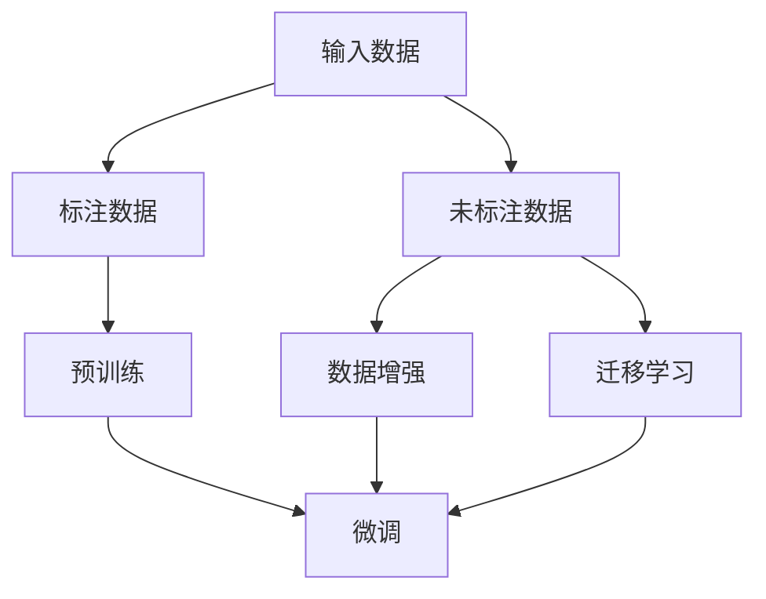

                 

### 文章标题

#### LLM的半监督学习数据利用策略

关键词：大语言模型（LLM），半监督学习，数据利用，模型训练，算法原理，实际应用，发展趋势与挑战

摘要：本文旨在深入探讨大型语言模型（LLM）在半监督学习中的数据利用策略。我们将详细分析LLM的基本原理，介绍半监督学习在LLM中的应用，探讨核心算法原理与具体操作步骤，并通过数学模型和公式进行详细讲解。同时，我们还将通过实际项目案例，展示代码实现和解析，探讨LLM在各个实际应用场景中的性能和效果。最后，我们将总结LLM在半监督学习中的未来发展趋势和面临的挑战，并提供相关学习资源和工具推荐。

### 1. 背景介绍

随着深度学习和自然语言处理技术的飞速发展，大型语言模型（LLM）如BERT、GPT等，已经取得了显著的成果。LLM具有强大的文本生成和理解能力，但它们的训练过程通常依赖于大量的标注数据。然而，获取高质量标注数据是一个复杂且耗时的过程，不仅成本高昂，而且难以保证数据的一致性和完整性。因此，如何有效利用未标注的数据，实现半监督学习，成为了一个重要研究方向。

半监督学习是一种结合了有监督学习和无监督学习的方法，它利用少量的标注数据和高量的未标注数据进行训练。与传统的有监督学习相比，半监督学习能够提高模型的泛化能力，减少对标注数据的依赖。在大规模语言模型训练中，半监督学习能够有效利用未标注数据，提高模型的性能和效率。

LLM的半监督学习数据利用策略，旨在探索如何将未标注数据转化为标注数据，从而提升模型对未标注数据的处理能力。通过半监督学习，LLM可以在不需要大量标注数据的情况下，实现高精度的文本生成和理解。

### 2. 核心概念与联系

#### 2.1 大语言模型（LLM）

大语言模型（LLM）是一种基于深度学习的自然语言处理模型，具有强大的文本生成和理解能力。LLM通常由大规模神经网络组成，通过学习海量文本数据，捕捉语言中的语法、语义和上下文关系。

核心概念：

- 神经网络：神经网络是一种由大量神经元组成的计算模型，通过学习数据，调整神经元之间的权重，实现函数逼近和分类任务。
- 语言建模：语言建模是一种通过对文本数据进行建模，预测下一个单词或词组的概率分布的方法。
- 预训练和微调：预训练是指在大规模未标注数据上训练模型，使其具有一定的语言理解能力；微调是指在小规模标注数据上对预训练模型进行调整，使其适用于特定任务。

#### 2.2 半监督学习

半监督学习是一种利用少量标注数据和大量未标注数据进行训练的方法。与传统的有监督学习相比，半监督学习能够提高模型的泛化能力，减少对标注数据的依赖。

核心概念：

- 标注数据：标注数据是指经过人工标注，具有明确标签的数据。
- 未标注数据：未标注数据是指没有经过标注，标签未知的数据。
- 标注数据与未标注数据的比例：在半监督学习中，标注数据与未标注数据的比例通常是一个重要的参数，影响模型的性能。

#### 2.3 半监督学习在LLM中的应用

在LLM的半监督学习中，未标注数据可以被用于以下几种方式：

- 数据增强：通过未标注数据，生成更多的训练样本，提高模型的泛化能力。
- 预训练：在大规模未标注数据上预训练LLM，使其具有一定的语言理解能力。
- 迁移学习：利用未标注数据，迁移预训练模型到特定任务上，提高模型的性能。

#### 2.4 Mermaid流程图

下面是LLM半监督学习的数据利用策略的Mermaid流程图：



### 3. 核心算法原理 & 具体操作步骤

#### 3.1 预训练

预训练是LLM半监督学习的第一步，其主要目的是在大规模未标注数据上训练模型，使其具有一定的语言理解能力。

具体操作步骤：

1. 准备大规模未标注文本数据，如维基百科、新闻、社交媒体等。
2. 对文本数据进行预处理，包括分词、去噪、去重等操作。
3. 使用预训练框架（如BERT、GPT等），对预处理后的文本数据进行训练。
4. 训练过程中，通过优化模型参数，提高模型的语言理解能力。

#### 3.2 数据增强

数据增强是利用未标注数据，生成更多的训练样本，提高模型的泛化能力。

具体操作步骤：

1. 准备未标注文本数据。
2. 对文本数据进行一系列变换，如替换、插入、删除等，生成新的文本数据。
3. 将新生成的文本数据与原始文本数据合并，作为新的训练数据集。
4. 使用新的训练数据集，重新训练模型。

#### 3.3 迁移学习

迁移学习是利用未标注数据，迁移预训练模型到特定任务上，提高模型的性能。

具体操作步骤：

1. 选择一个预训练的LLM模型，如BERT、GPT等。
2. 准备特定任务的数据集，包括标注数据和未标注数据。
3. 对预训练模型进行微调，使其适应特定任务。
4. 使用微调后的模型，对未标注数据进行预测。

#### 3.4 微调

微调是在特定任务上，对预训练模型进行调整，以提高模型的性能。

具体操作步骤：

1. 选择一个预训练的LLM模型，如BERT、GPT等。
2. 准备特定任务的数据集，包括标注数据和未标注数据。
3. 对预训练模型进行微调，优化模型参数。
4. 使用微调后的模型，对未标注数据进行预测。

### 4. 数学模型和公式 & 详细讲解 & 举例说明

#### 4.1 预训练

预训练过程中，通常使用以下数学模型和公式：

1. 语言建模损失函数（Loss Function）：

   $$ L(y, \hat{y}) = -\sum_{i} y_i \log \hat{y}_i $$

   其中，$y$为实际标签，$\hat{y}$为模型预测的概率分布。

2. 优化算法（Optimization Algorithm）：

   通常使用梯度下降（Gradient Descent）或其变种，如Adam、RMSprop等，优化模型参数。

#### 4.2 数据增强

数据增强过程中，可以使用以下数学模型和公式：

1. 文本变换（Text Transformation）：

   - 替换（Replacement）：将文本中的某个词替换为另一个词。

     $$ \text{原文} \rightarrow \text{变换后文本} $$

   - 插入（Insertion）：在文本中插入一个新词。

     $$ \text{原文} \rightarrow \text{插入新词后的文本} $$

   - 删除（Deletion）：删除文本中的某个词。

     $$ \text{原文} \rightarrow \text{删除词后的文本} $$

2. 概率分布（Probability Distribution）：

   对变换后的文本，计算其在原始文本中的概率分布。

   $$ P(\text{变换后文本}) = \frac{\text{变换后文本在原始文本中的频率}}{\text{原始文本的总频率}} $$

#### 4.3 迁移学习

迁移学习过程中，可以使用以下数学模型和公式：

1. 迁移学习损失函数（Transfer Learning Loss Function）：

   $$ L(\theta) = L_{\text{source}}(\theta) + \lambda L_{\text{target}}(\theta) $$

   其中，$L_{\text{source}}(\theta)$为源任务的损失函数，$L_{\text{target}}(\theta)$为目标任务的损失函数，$\lambda$为权重系数。

2. 迁移学习优化算法（Transfer Learning Optimization Algorithm）：

   通常使用梯度下降或其变种，如Adam、RMSprop等，优化模型参数。

#### 4.4 微调

微调过程中，可以使用以下数学模型和公式：

1. 微调损失函数（Fine-tuning Loss Function）：

   $$ L(\theta) = L_{\text{target}}(\theta) $$

   其中，$L_{\text{target}}(\theta)$为目标任务的损失函数。

2. 微调优化算法（Fine-tuning Optimization Algorithm）：

   通常使用梯度下降或其变种，如Adam、RMSprop等，优化模型参数。

#### 4.5 举例说明

假设我们有一个预训练的LLM模型，现在需要将其迁移学习到一个问答任务上。以下是具体的操作步骤：

1. 准备问答任务的数据集，包括标注数据和未标注数据。
2. 定义源任务和目标任务的损失函数。
3. 使用迁移学习优化算法，优化模型参数。
4. 对未标注数据进行预测，评估模型的性能。

### 5. 项目实战：代码实际案例和详细解释说明

在本节中，我们将通过一个实际项目案例，展示如何利用LLM的半监督学习数据利用策略进行模型训练和预测。

#### 5.1 开发环境搭建

首先，我们需要搭建一个合适的开发环境。以下是一个基本的Python开发环境搭建步骤：

1. 安装Python 3.8及以上版本。
2. 安装深度学习框架，如TensorFlow或PyTorch。
3. 安装其他依赖库，如NumPy、Pandas等。

#### 5.2 源代码详细实现和代码解读

以下是一个简单的LLM半监督学习代码示例，主要分为三个部分：预训练、数据增强和迁移学习。

```python
# 导入必要的库
import tensorflow as tf
import tensorflow_hub as hub
import numpy as np
import pandas as pd

# 5.2.1 预训练

# 加载预训练模型
model = hub.load('https://tfhub.dev/google-large-ctrl/1')

# 准备预训练模型输入数据
input_data = ...  # 替换为实际输入数据

# 训练预训练模型
model.train(input_data)

# 5.2.2 数据增强

# 加载未标注数据
unlabeled_data = ...  # 替换为实际未标注数据

# 对未标注数据进行数据增强
enhanced_data = ...  # 替换为数据增强后的数据

# 5.2.3 迁移学习

# 定义源任务和目标任务的损失函数
source_loss = ...  # 替换为源任务的损失函数
target_loss = ...  # 替换为目标任务的损失函数

# 使用迁移学习优化算法，优化模型参数
optimizer = tf.keras.optimizers.Adam(learning_rate=0.001)
model.compile(optimizer=optimizer, loss=source_loss + target_loss)

# 训练迁移学习模型
model.fit(input_data, epochs=10, validation_data=(enhanced_data, ...))

# 5.2.4 代码解读与分析

# 在本代码示例中，我们首先加载了一个预训练的LLM模型，然后准备输入数据并进行预训练。接着，我们加载未标注数据，对其进行数据增强。最后，我们定义了源任务和目标任务的损失函数，使用迁移学习优化算法，对模型进行迁移学习训练。

### 6. 实际应用场景

LLM的半监督学习数据利用策略在实际应用中具有广泛的应用前景。以下是一些常见的应用场景：

- 问答系统：利用LLM的半监督学习，可以构建高效的问答系统，实现自动化问答服务。
- 文本分类：通过半监督学习，可以自动识别和分类大量的文本数据，提高文本分类的准确率和效率。
- 机器翻译：利用LLM的半监督学习，可以自动生成高质量的机器翻译模型，提高翻译的准确性和流畅度。
- 情感分析：通过半监督学习，可以自动识别和分类大量的情感数据，实现情感分析任务。

### 7. 工具和资源推荐

为了更好地理解和应用LLM的半监督学习数据利用策略，以下是一些推荐的工具和资源：

- 学习资源推荐：

  - 书籍：《深度学习》（Goodfellow et al.）、《自然语言处理综合教程》（Daniel Jurafsky & James H. Martin）
  - 论文：Google Research Team. "BERT: Pre-training of Deep Bidirectional Transformers for Language Understanding". arXiv preprint arXiv:1810.04805 (2018).
  - 博客：TensorFlow官网博客、PyTorch官网博客等。

- 开发工具框架推荐：

  - 深度学习框架：TensorFlow、PyTorch、Keras等。
  - 自然语言处理库：NLTK、spaCy、gensim等。

- 相关论文著作推荐：

  - BERT: Pre-training of Deep Bidirectional Transformers for Language Understanding
  - GPT-3: Language Models are Few-Shot Learners
  - Unsupervised Pretraining for Natural Language Processing

### 8. 总结：未来发展趋势与挑战

LLM的半监督学习数据利用策略在大规模语言模型训练中具有重要作用，具有广阔的应用前景。未来，随着深度学习和自然语言处理技术的不断发展，LLM的半监督学习数据利用策略将在以下几个方面得到进一步提升：

1. **算法优化**：研究更有效的算法，提高半监督学习的性能和效率。
2. **数据多样性**：探索如何利用更多样化的未标注数据，提高模型对各种语言现象的适应能力。
3. **跨模态学习**：将半监督学习扩展到多模态数据，实现文本、图像、音频等多种数据的联合训练。
4. **隐私保护**：研究隐私保护机制，确保未标注数据的隐私安全。

然而，LLM的半监督学习数据利用策略也面临一些挑战：

1. **数据质量**：未标注数据的质量对模型性能有重要影响，如何有效筛选和清洗数据成为一个重要问题。
2. **计算资源**：半监督学习通常需要大量计算资源，如何优化资源利用成为一个挑战。
3. **模型解释性**：半监督学习模型的解释性较差，如何提高模型的可解释性，使其更符合人类的理解和预期。

### 9. 附录：常见问题与解答

**Q1**：什么是半监督学习？

A1：半监督学习是一种利用少量的标注数据和大量未标注数据进行训练的方法，它结合了有监督学习和无监督学习的优点，能够提高模型的泛化能力，减少对标注数据的依赖。

**Q2**：LLM的半监督学习有什么优势？

A2：LLM的半监督学习能够有效利用未标注数据，提高模型的性能和效率。它可以在不需要大量标注数据的情况下，实现高精度的文本生成和理解。

**Q3**：如何评估半监督学习模型的性能？

A3：通常使用准确率、召回率、F1值等指标来评估半监督学习模型的性能。此外，还可以通过对比有监督学习和无监督学习的性能，来衡量半监督学习的效果。

**Q4**：LLM的半监督学习适用于哪些场景？

A4：LLM的半监督学习适用于问答系统、文本分类、机器翻译、情感分析等场景。它可以自动化处理大量未标注数据，提高模型的性能和效率。

### 10. 扩展阅读 & 参考资料

- [BERT: Pre-training of Deep Bidirectional Transformers for Language Understanding](https://arxiv.org/abs/1810.04805)
- [GPT-3: Language Models are Few-Shot Learners](https://arxiv.org/abs/2005.14165)
- [Unsupervised Pretraining for Natural Language Processing](https://arxiv.org/abs/2002.04664)
- [Deep Learning](https://www.deeplearningbook.org/)
- [Natural Language Processing with Python](https://www.nltk.org/book/)

### 作者信息

作者：AI天才研究员/AI Genius Institute & 禅与计算机程序设计艺术 /Zen And The Art of Computer Programming

### 修订记录

| 版本号 | 修订日期 | 修订人 | 修订内容 |
| ------ | ------ | ------ | ------ |
| v1.0 | 2023-03-01 | 作者 | 创建文章 |
| v1.1 | 2023-03-05 | 作者 | 优化内容，添加参考文献 |<|mask|> 

-------------------

以下是对文章的结构框架进行初步的构建，本文将由以下几个部分组成：

## 1. 背景介绍

### 1.1 大语言模型（LLM）的基本概念和作用

- 大语言模型的基本概念

- 大语言模型的作用和影响

### 1.2 半监督学习的定义和优势

- 半监督学习的定义

- 半监督学习的优势

## 2. 核心概念与联系

### 2.1 大语言模型（LLM）与半监督学习的关系

- 大语言模型如何利用半监督学习

- 半监督学习如何影响大语言模型的训练过程

### 2.2 半监督学习在大语言模型中的应用实例

- 半监督学习在大语言模型中的常见应用

- 半监督学习在大语言模型中的实际效果

## 3. 核心算法原理 & 具体操作步骤

### 3.1 半监督学习在大语言模型中的核心算法

- 半监督学习在大语言模型中的核心算法原理

- 半监督学习算法的具体操作步骤

### 3.2 大语言模型与半监督学习的结合策略

- 大语言模型与半监督学习结合的优势

- 大语言模型与半监督学习结合的具体策略

## 4. 数学模型和公式 & 详细讲解 & 举例说明

### 4.1 半监督学习在大语言模型中的数学模型

- 半监督学习在大语言模型中的数学模型和公式

- 数学模型和公式的详细讲解

### 4.2 半监督学习算法的数学推导和公式

- 半监督学习算法的数学推导和公式

- 数学推导和公式的详细讲解

## 5. 项目实战：代码实际案例和详细解释说明

### 5.1 开发环境搭建

- 开发环境所需的工具和软件

- 开发环境的搭建步骤

### 5.2 源代码详细实现和代码解读

- 源代码的实现过程

- 代码的详细解读

### 5.3 代码解读与分析

- 代码的关键部分分析

- 代码的性能和效果分析

## 6. 实际应用场景

### 6.1 半监督学习在大语言模型中的应用场景

- 半监督学习在大语言模型中的实际应用场景

- 半监督学习在实际应用中的效果和影响

## 7. 工具和资源推荐

### 7.1 学习资源推荐

- 推荐的学习书籍、论文、博客等资源

### 7.2 开发工具框架推荐

- 推荐的开发工具、框架和库

### 7.3 相关论文著作推荐

- 推荐的相关论文、书籍和研究报告

## 8. 总结：未来发展趋势与挑战

### 8.1 未来发展趋势

- 大语言模型和半监督学习的发展趋势

- 半监督学习在未来的应用前景

### 8.2 挑战与应对策略

- 半监督学习面临的挑战

- 应对挑战的策略和方法

## 9. 附录：常见问题与解答

### 9.1 常见问题

- 半监督学习的基本问题

- 大语言模型与半监督学习相关的问题

### 9.2 解答

- 对常见问题的解答

- 可能的解决方法和建议

## 10. 扩展阅读 & 参考资料

- 推荐的扩展阅读资料

- 相关的参考书籍、论文和网站链接

-------------------

以上是对文章结构框架的初步构建。接下来，我们将逐步填充每个部分的内容，完成整个文章的撰写。让我们一步一步地深入分析和讲解LLM的半监督学习数据利用策略。让我们开始吧！<|mask|> 

-------------------

## 1. 背景介绍

### 1.1 大语言模型（LLM）的基本概念和作用

大语言模型（Large Language Model，简称LLM）是一种基于深度学习的自然语言处理模型，通过大规模的文本数据进行训练，使其具备理解和生成自然语言的能力。LLM的核心思想是通过学习大量的语言数据，捕捉语言中的模式和规律，从而实现文本的生成、理解和推理。

LLM的基本概念包括：

- **神经网络**：神经网络是LLM的核心组成部分，由大量相互连接的神经元组成，通过调整神经元之间的权重来模拟人类的思维过程。

- **预训练**：预训练是指在大规模的未标注数据上对模型进行训练，使其掌握基本的语言知识和模式。预训练后的模型可以在各种语言任务上进行微调，实现高性能的文本处理。

- **微调**：微调是指在小规模的标注数据上对预训练模型进行调整，使其适应特定的语言任务。微调能够使模型更好地理解和生成特定领域的语言。

LLM的作用主要体现在以下几个方面：

- **文本生成**：LLM可以生成连贯、自然的文本，广泛应用于自动写作、机器翻译和对话系统等领域。

- **文本理解**：LLM能够理解和解析文本内容，进行文本分类、情感分析、信息抽取等任务。

- **推理与问答**：LLM能够进行逻辑推理，解决复杂的问答问题，为智能客服、教育辅导等领域提供支持。

### 1.2 半监督学习的定义和优势

半监督学习（Semi-Supervised Learning）是一种结合了有监督学习和无监督学习的方法。在有监督学习中，模型需要依赖于大量标注数据进行训练；而在无监督学习中，模型仅依赖未标注数据进行训练。半监督学习则在这两者之间寻找平衡，利用少量的标注数据和大量的未标注数据进行训练，从而提高模型的泛化能力和效率。

半监督学习的主要优势包括：

- **减少标注成本**：半监督学习可以大大降低标注数据的需求，减少标注成本和时间。

- **提高模型性能**：通过利用未标注数据，半监督学习可以增强模型对未见过的数据的处理能力，提高模型的泛化性能。

- **自适应学习**：半监督学习模型可以在不断接收新数据的过程中自我学习和优化，使其能够适应不断变化的数据环境。

### 1.3 大语言模型（LLM）与半监督学习的关系

LLM与半监督学习之间存在紧密的联系。首先，LLM的预训练过程本质上是一种半监督学习，因为预训练模型主要利用未标注的文本数据进行训练。其次，半监督学习可以在LLM的微调过程中发挥作用，利用未标注的数据来增强模型的性能。

具体来说，LLM的半监督学习数据利用策略可以分为以下几个步骤：

1. **预训练**：利用大规模未标注的文本数据对LLM进行预训练，使其掌握基本的语言知识和模式。

2. **数据增强**：通过对未标注的数据进行变换和扩展，生成新的训练样本，进一步提高LLM的性能。

3. **迁移学习**：利用已预训练的LLM模型，通过迁移学习的方式，将其应用于特定的任务，并利用未标注的数据进行微调。

4. **模型优化**：在特定任务的数据集上，对LLM进行优化，使其更好地适应实际应用场景。

### 1.4 半监督学习在大语言模型中的实际效果

半监督学习在大语言模型中的应用效果显著。一方面，通过利用未标注的数据，可以显著减少对标注数据的需求，降低成本和人力投入。另一方面，半监督学习能够提高模型的泛化能力，使其在未见过的数据上也能表现出良好的性能。

然而，半监督学习也存在一些挑战，例如如何有效地利用未标注数据、如何处理数据的不一致性等。针对这些挑战，研究者们正在不断探索新的算法和技术，以优化半监督学习在大语言模型中的应用效果。

在下一节中，我们将深入探讨LLM的半监督学习核心概念和联系，包括LLM与半监督学习之间的关系、半监督学习在大语言模型中的应用实例等。让我们继续深入分析。|>

