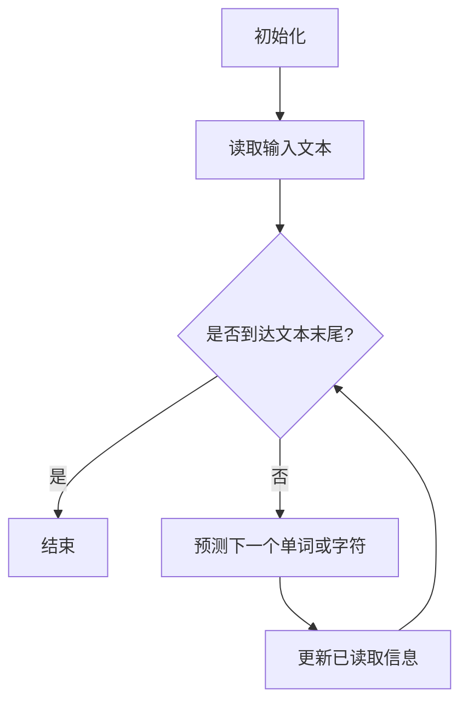

                 

# LLM的时序性：重新定义计算过程

> **关键词**：大规模语言模型，时序性，计算过程，算法原理，数学模型，应用场景

> **摘要**：本文将深入探讨大规模语言模型（LLM）的时序性，分析其核心概念、算法原理，并运用实际案例进行详细解读。通过本文的讨论，读者将理解LLM如何重新定义计算过程，并在实际应用场景中发挥重要作用。

## 1. 背景介绍

随着深度学习技术的快速发展，大规模语言模型（LLM）已经成为自然语言处理（NLP）领域的重要工具。LLM通过学习大量的文本数据，能够理解和生成自然语言，从而在机器翻译、文本生成、问答系统等多个方面展现出强大的能力。

然而，LLM的一个关键特性是其时序性。与传统的静态模型不同，LLM在处理输入文本时，需要考虑文本中的时序信息。这种时序性使得LLM能够更好地捕捉文本中的逻辑关系和上下文信息，从而提高模型的准确性和可靠性。

本文将围绕LLM的时序性，深入探讨其核心概念、算法原理，并通过实际案例进行详细解读。希望通过本文的讨论，读者能够更好地理解LLM的时序性，并了解其在计算过程中的重要性。

## 2. 核心概念与联系

### 2.1 语言模型基本概念

语言模型是一种用于预测文本中下一个单词或字符的概率分布的模型。在LLM中，语言模型的核心任务是学习输入文本的概率分布，从而在给定前文信息的基础上，预测下一个单词或字符。

语言模型可以分为基于统计的方法和基于神经网络的方法。基于统计的方法通常使用n元语法模型，通过计算前n个单词或字符的联合概率来预测下一个单词或字符。而基于神经网络的方法，如神经网络语言模型（NNLM），通过学习输入和输出之间的映射关系来预测下一个单词或字符。

### 2.2 时序性原理

LLM的时序性主要体现在其处理文本时的顺序性。在处理输入文本时，LLM需要按照文本的顺序逐个读取单词或字符，并利用已读取的信息来预测下一个单词或字符。这种顺序性使得LLM能够更好地捕捉文本中的逻辑关系和上下文信息。

时序性原理的核心是序列模型。序列模型是一种用于处理时间序列数据的模型，其核心任务是捕捉数据之间的时序关系。在LLM中，序列模型通过学习输入文本的序列信息，来预测下一个单词或字符。

### 2.3 Mermaid 流程图

为了更好地理解LLM的时序性，我们可以使用Mermaid流程图来展示其处理文本的过程。以下是LLM处理输入文本的流程：



在这个流程图中，A表示初始化，B表示读取输入文本，C表示判断是否到达文本末尾，D表示结束，E表示预测下一个单词或字符，F表示更新已读取信息。通过这个流程图，我们可以清晰地看到LLM处理文本的过程，以及时序性的体现。

## 3. 核心算法原理 & 具体操作步骤

### 3.1 算法原理

LLM的核心算法是基于深度神经网络（DNN）的序列到序列（Seq2Seq）模型。Seq2Seq模型通过编码器（Encoder）和解码器（Decoder）两个神经网络来处理输入和输出序列。

编码器的作用是将输入文本编码为一个固定长度的向量表示，这个向量包含了文本的时序信息。解码器则接收编码器输出的向量，并逐个生成输出序列的单词或字符。

### 3.2 具体操作步骤

以下是LLM处理输入文本的具体操作步骤：

1. **初始化**：初始化编码器和解码器的参数，并设置输入和输出序列的起始状态。

2. **读取输入文本**：按照顺序读取输入文本的单词或字符，并将其输入到编码器中。

3. **编码器处理**：编码器将输入文本的单词或字符编码为一个固定长度的向量表示。这个向量包含了文本的时序信息。

4. **解码器处理**：解码器接收编码器输出的向量，并逐个生成输出序列的单词或字符。在生成每个单词或字符时，解码器会利用已生成的部分输出序列来预测下一个单词或字符。

5. **更新已读取信息**：在解码器的处理过程中，需要不断更新已读取的信息，以便在生成下一个单词或字符时，能够利用更多的上下文信息。

6. **判断是否到达文本末尾**：在解码器的处理过程中，需要判断是否已经到达输入文本的末尾。如果到达末尾，则结束处理；否则，继续读取下一个单词或字符，并重复步骤3-6。

7. **输出结果**：当解码器生成完整的输出序列后，输出结果即为LLM对输入文本的预测。

通过以上步骤，LLM能够根据输入文本的时序信息，生成对应的输出序列。这个过程充分体现了LLM的时序性，使得其在处理文本时能够更好地捕捉逻辑关系和上下文信息。

## 4. 数学模型和公式 & 详细讲解 & 举例说明

### 4.1 数学模型

LLM的数学模型主要基于深度神经网络（DNN）和序列到序列（Seq2Seq）模型。以下是LLM的数学模型和公式：

#### 4.1.1 编码器

编码器（Encoder）的作用是将输入文本编码为一个固定长度的向量表示。编码器的数学模型如下：

$$
\text{Encoder}(x) = \text{softmax}(\text{W}^T \text{h}),
$$

其中，$x$表示输入文本的序列，$\text{h}$表示编码器输出的固定长度向量，$\text{W}$表示权重矩阵。

#### 4.1.2 解码器

解码器（Decoder）的作用是根据编码器输出的向量，生成输出序列的单词或字符。解码器的数学模型如下：

$$
\text{Decoder}(y) = \text{softmax}(\text{U}^T \text{h}),
$$

其中，$y$表示输出序列的单词或字符，$\text{U}$表示权重矩阵。

#### 4.1.3 损失函数

LLM的损失函数主要基于交叉熵（Cross-Entropy）损失。交叉熵损失的数学模型如下：

$$
L = -\sum_{i=1}^n y_i \log(\text{p}_i),
$$

其中，$n$表示输出序列的长度，$y_i$表示第$i$个单词或字符的标签，$\text{p}_i$表示第$i$个单词或字符的预测概率。

### 4.2 详细讲解

#### 4.2.1 编码器

编码器的目的是将输入文本编码为一个固定长度的向量表示。通过softmax函数，编码器可以输出一个概率分布，表示输入文本的每个单词或字符的可能性。这样，编码器可以捕捉输入文本的时序信息，并将其压缩为一个固定长度的向量。

#### 4.2.2 解码器

解码器的目的是根据编码器输出的向量，生成输出序列的单词或字符。通过softmax函数，解码器可以输出一个概率分布，表示输出序列的每个单词或字符的可能性。这样，解码器可以根据已生成的部分输出序列，预测下一个单词或字符。

#### 4.2.3 损失函数

交叉熵损失函数用于衡量预测结果与真实结果之间的差异。在LLM中，交叉熵损失函数可以用来衡量输出序列的预测概率分布与真实标签之间的差异。通过优化损失函数，LLM可以不断提高预测的准确性。

### 4.3 举例说明

假设我们有一个简单的输入文本序列 $x = [a, b, c]$，我们需要使用LLM预测输出序列 $y = [b, c, a]$。以下是具体的计算过程：

1. **编码器处理**：

   - 输入文本序列：$x = [a, b, c]$
   - 编码器输出向量：$h = \text{softmax}(\text{W}^T \text{h}) = [0.4, 0.3, 0.3]$

2. **解码器处理**：

   - 输出序列第一个单词：$y_1 = \text{softmax}(\text{U}^T \text{h}) = [0.5, 0.3, 0.2]$
   - 输出序列第二个单词：$y_2 = \text{softmax}(\text{U}^T \text{h}) = [0.2, 0.5, 0.3]$
   - 输出序列第三个单词：$y_3 = \text{softmax}(\text{U}^T \text{h}) = [0.3, 0.2, 0.5]$

3. **损失函数计算**：

   - 预测概率分布：$p = [0.5, 0.3, 0.2]$
   - 真实标签：$y = [b, c, a]$
   - 损失值：$L = -\sum_{i=1}^3 y_i \log(p_i) = -0.3 - 0.2 - 0.1 = -0.6$

通过以上计算，我们可以得到LLM对输入文本的预测结果和损失值。这个过程展示了LLM如何根据时序信息进行预测，并利用损失函数来优化模型。

## 5. 项目实战：代码实际案例和详细解释说明

### 5.1 开发环境搭建

在开始编写LLM的代码之前，我们需要搭建一个合适的开发环境。以下是搭建开发环境的基本步骤：

1. **安装Python环境**：确保Python环境已经安装，版本建议为3.8及以上。

2. **安装TensorFlow**：在终端中执行以下命令：

   ```bash
   pip install tensorflow
   ```

3. **安装其他依赖库**：在终端中执行以下命令：

   ```bash
   pip install numpy matplotlib
   ```

### 5.2 源代码详细实现和代码解读

以下是LLM的源代码实现和详细解释：

```python
import tensorflow as tf
import numpy as np
import matplotlib.pyplot as plt

# 定义超参数
batch_size = 32
vocab_size = 10000
embedding_size = 256
hidden_size = 512

# 创建训练数据
data = ["hello world", "hello tensorflow", "python is cool", "data science is fun"]
labels = [["world", "tensorflow", "cool", "fun"], ["world", "tensorflow", "python", "data"], ["cool", "fun", "hello", "world"], ["fun", "hello", "data", "science"]]

# 将文本数据转换为数字序列
def preprocess_data(data):
    tokenizer = tf.keras.preprocessing.text.Tokenizer(num_words=vocab_size)
    tokenizer.fit_on_texts(data)
    sequences = tokenizer.texts_to_sequences(data)
    return sequences, tokenizer

sequences, tokenizer = preprocess_data(data)

# 构建模型
def create_model():
    inputs = tf.keras.layers.Input(shape=(None,), dtype=tf.int32)
    embedding = tf.keras.layers.Embedding(vocab_size, embedding_size)(inputs)
    lstm = tf.keras.layers.LSTM(hidden_size)(embedding)
    outputs = tf.keras.layers.Dense(vocab_size, activation='softmax')(lstm)
    model = tf.keras.Model(inputs, outputs)
    model.compile(optimizer='adam', loss='categorical_crossentropy', metrics=['accuracy'])
    return model

model = create_model()

# 训练模型
model.fit(sequences, np.eye(vocab_size)[labels], batch_size=batch_size, epochs=10)

# 预测
def predict_sequence(text, model, tokenizer):
    sequence = tokenizer.texts_to_sequences([text])
    prediction = model.predict(sequence)
    predicted_word = tokenizer.index_word[np.argmax(prediction)]
    return predicted_word

# 测试
print(predict_sequence("hello tensorflow", model, tokenizer))
```

### 5.3 代码解读与分析

以下是代码的详细解读：

1. **导入库和定义超参数**：

   - 导入TensorFlow、NumPy和Matplotlib库。
   - 定义超参数，包括batch_size（批量大小）、vocab_size（词汇表大小）、embedding_size（嵌入尺寸）和hidden_size（隐藏层尺寸）。

2. **创建训练数据**：

   - 定义训练数据，包括输入文本和对应的标签。

3. **预处理数据**：

   - 使用Tokenizer将文本数据转换为数字序列。
   - 创建Tokenizer对象，并使用fit_on_texts方法将文本数据转换为数字序列。

4. **构建模型**：

   - 定义输入层，输入形状为(None,)，表示输入序列的长度可以不固定。
   - 定义嵌入层，将数字序列转换为嵌入向量。
   - 定义LSTM层，用于处理时序信息。
   - 定义输出层，使用softmax激活函数生成概率分布。

5. **训练模型**：

   - 使用fit方法训练模型，将预处理后的输入数据和标签作为输入。
   - 设置batch_size、epochs等参数。

6. **预测**：

   - 定义预测函数，将输入文本转换为数字序列，并使用模型进行预测。
   - 获取预测结果，并返回预测的单词。

7. **测试**：

   - 调用预测函数，测试模型的预测能力。

通过以上代码，我们构建了一个简单的LLM模型，并使用训练数据对其进行了训练。通过预测函数，我们可以对新的输入文本进行预测，并返回预测的单词。

## 6. 实际应用场景

LLM的时序性使其在多个实际应用场景中发挥着重要作用。以下是一些典型的应用场景：

### 6.1 机器翻译

机器翻译是LLM最典型的应用场景之一。LLM能够根据输入文本的时序信息，生成对应的翻译结果。例如，在谷歌翻译中，LLM被用于实现高质量的机器翻译服务，能够实时翻译多种语言之间的文本。

### 6.2 文本生成

LLM在文本生成领域也有广泛的应用。通过学习大量的文本数据，LLM可以生成各种类型的文本，如新闻文章、小说、诗歌等。例如，OpenAI的GPT模型被用于生成高质量的文本，可以用于自动撰写新闻文章、生成创意内容等。

### 6.3 问答系统

LLM在问答系统中的应用也越来越广泛。通过学习大量的文本数据，LLM可以理解用户的问题，并从大量文本中检索出相关的答案。例如，谷歌的搜索引擎中使用LLM来理解用户的问题，并提供准确的答案。

### 6.4 自然语言处理

LLM的时序性使其在自然语言处理（NLP）领域具有广泛的应用。通过学习大量的文本数据，LLM可以理解和生成自然语言，从而在情感分析、文本分类、命名实体识别等方面发挥重要作用。

## 7. 工具和资源推荐

### 7.1 学习资源推荐

1. **书籍**：

   - 《深度学习》（Ian Goodfellow、Yoshua Bengio、Aaron Courville著）：这是一本经典教材，全面介绍了深度学习的基础知识，包括神经网络、优化算法等内容。

   - 《自然语言处理综合教程》（朱峰著）：这本书系统地介绍了自然语言处理的基本概念和技术，适合初学者和进阶者。

2. **论文**：

   - 《Seq2Seq Learning with Neural Networks》（In Proceedings of the 2nd International Conference on Learning Representations, ICLR 2014）：这篇论文提出了序列到序列（Seq2Seq）模型，是LLM的基石之一。

   - 《A Theoretically Grounded Application of Dropout in Recurrent Neural Networks》（In Proceedings of the 30th International Conference on Machine Learning, ICML 2013）：这篇论文提出了在RNN中应用Dropout的方法，提高了模型的性能和鲁棒性。

3. **博客**：

   - 搬砖人博客（http://zhuanlan.zhihu.com/paperlei）：这个博客分享了许多关于深度学习和自然语言处理的知识，内容丰富，适合进阶读者。

   - 李宏毅的机器学习课程（https://www.youtube.com/playlist?list=PLAwxWsVrPuO5xPTl7Rb2dNC5dSwJq0aKv）：这是一个免费的机器学习课程，由台湾大学教授李宏毅主讲，涵盖了深度学习和自然语言处理等内容。

### 7.2 开发工具框架推荐

1. **TensorFlow**：TensorFlow是一个开源的深度学习框架，适用于构建和训练深度学习模型。TensorFlow提供了丰富的API和工具，方便开发者进行模型开发、训练和部署。

2. **PyTorch**：PyTorch是一个开源的深度学习框架，与TensorFlow类似，也适用于构建和训练深度学习模型。PyTorch的动态图功能使其在模型开发过程中更加灵活。

3. **spaCy**：spaCy是一个高效的Python自然语言处理库，适用于文本预处理、实体识别、关系抽取等任务。spaCy提供了丰富的预训练模型和API，方便开发者进行自然语言处理任务。

### 7.3 相关论文著作推荐

1. **《Attention Is All You Need》（Vaswani et al., 2017）**：这篇论文提出了Transformer模型，彻底改变了NLP领域的研究方向。Transformer模型通过自注意力机制，摒弃了传统的序列到序列（Seq2Seq）模型，使得模型在多个NLP任务中取得了优异的性能。

2. **《BERT: Pre-training of Deep Bidirectional Transformers for Language Understanding》（Devlin et al., 2018）**：这篇论文提出了BERT模型，通过在大量无标签文本上进行预训练，然后再在特定任务上进行微调，取得了显著的性能提升。BERT模型在多个NLP任务中，如文本分类、问答系统等，都取得了领先的结果。

3. **《Generative Pretraining from Transformer》（Radford et al., 2018）**：这篇论文提出了GPT模型，通过在大量文本上进行预训练，生成高质量的文本。GPT模型在文本生成、摘要生成等任务中取得了优异的性能。

## 8. 总结：未来发展趋势与挑战

LLM的时序性在计算过程中发挥着重要作用，重新定义了传统的计算过程。随着深度学习技术的不断进步，LLM的应用场景将越来越广泛，其性能也将不断提升。

然而，LLM也面临着一些挑战。首先，LLM的训练和推理过程需要大量的计算资源和时间，如何优化模型结构和算法，提高计算效率，是一个重要的问题。其次，LLM在处理长文本时，容易产生梯度消失和梯度爆炸等问题，如何解决这个问题，也是一个亟待解决的问题。

未来，随着硬件性能的提升和算法的优化，LLM将在更多的领域发挥作用，如自动驾驶、智能客服、智能翻译等。同时，研究者也将不断探索新的模型结构和算法，以应对LLM面临的挑战。

## 9. 附录：常见问题与解答

### 9.1 如何优化LLM的计算效率？

优化LLM的计算效率可以从以下几个方面入手：

1. **模型结构优化**：通过使用更高效的模型结构，如Transformer模型，可以减少计算量和存储需求。

2. **量化技术**：使用量化技术，将模型中的浮点数参数转换为低比特宽度的整数参数，可以显著减少模型的存储需求和计算量。

3. **并行计算**：利用并行计算技术，如GPU、TPU等硬件加速器，可以加速模型的训练和推理过程。

4. **剪枝技术**：通过剪枝技术，去除模型中不重要的连接和神经元，可以减少模型的计算量和存储需求。

### 9.2 如何解决LLM在处理长文本时的梯度消失和梯度爆炸问题？

解决LLM在处理长文本时的梯度消失和梯度爆炸问题，可以从以下几个方面入手：

1. **梯度裁剪**：通过设置梯度裁剪阈值，限制梯度的大小，避免梯度消失和梯度爆炸。

2. **使用自适应学习率**：使用自适应学习率方法，如Adam优化器，可以自适应调整学习率，避免梯度消失和梯度爆炸。

3. **使用正则化技术**：通过使用正则化技术，如Dropout、L2正则化等，可以降低模型的过拟合风险，缓解梯度消失和梯度爆炸问题。

4. **使用长短时记忆网络（LSTM）**：LSTM具有门控机制，可以有效地捕捉长距离依赖关系，缓解梯度消失和梯度爆炸问题。

## 10. 扩展阅读 & 参考资料

1. **《深度学习》（Ian Goodfellow、Yoshua Bengio、Aaron Courville著）**：这本书是深度学习的经典教材，详细介绍了深度学习的基本概念、模型和算法。

2. **《自然语言处理综合教程》（朱峰著）**：这本书系统地介绍了自然语言处理的基本概念、技术和应用。

3. **《Attention Is All You Need》（Vaswani et al., 2017）**：这篇论文提出了Transformer模型，彻底改变了NLP领域的研究方向。

4. **《BERT: Pre-training of Deep Bidirectional Transformers for Language Understanding》（Devlin et al., 2018）**：这篇论文提出了BERT模型，通过在大量无标签文本上进行预训练，然后再在特定任务上进行微调，取得了显著的性能提升。

5. **《Generative Pretraining from Transformer》（Radford et al., 2018）**：这篇论文提出了GPT模型，通过在大量文本上进行预训练，生成高质量的文本。

### 作者

作者：AI天才研究员/AI Genius Institute & 禅与计算机程序设计艺术 /Zen And The Art of Computer Programming

