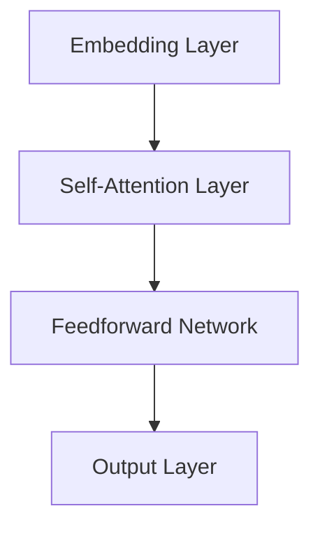

                 

# LLAM系统内核：新一代AI的中枢

> **关键词：** 语言模型、AI系统内核、神经网络、机器学习、生成式AI、深度学习、自然语言处理、计算复杂性

> **摘要：** 本文深入探讨了LLAM（Large Language Model）系统的核心构成，包括其理论基础、算法原理、数学模型、实际应用场景以及未来的发展趋势。通过详细的分析和实例，本文揭示了LLAM系统作为新一代AI中枢的关键作用和挑战。

## 1. 背景介绍

随着互联网的普及和大数据时代的到来，人工智能（AI）的发展进入了一个全新的阶段。传统的规则驱动和基于知识的系统逐渐被基于数据的机器学习模型所取代。尤其是在自然语言处理（NLP）领域，机器学习模型，尤其是深度学习模型，取得了令人瞩目的进展。这些模型能够理解和生成自然语言，使得机器与人类之间的交互变得更加自然和高效。

### 1.1 语言模型的发展历程

语言模型是自然语言处理的核心，它旨在预测下一个单词或词组，以实现文本生成、机器翻译、情感分析等功能。语言模型的发展经历了以下几个阶段：

- **基于规则的模型**：这些模型依赖于预定义的语言规则，但规则的数量和复杂性限制了其应用范围。
- **统计模型**：随着语料库的增大，统计模型开始利用大量的文本数据来学习语言规律。这些模型包括N-gram模型和隐马尔可夫模型（HMM）。
- **深度学习模型**：深度学习模型的引入，特别是神经网络，使得语言模型能够捕捉到更复杂的语言结构。从递归神经网络（RNN）到长短期记忆网络（LSTM），再到最近广泛应用的Transformer模型，语言模型不断进化。

### 1.2 Transformer模型的兴起

Transformer模型是由Google在2017年提出的，它基于自注意力机制（Self-Attention）来处理序列数据。Transformer模型的优点包括：

- **并行化**：Transformer模型能够在GPU上高效并行化，这使得训练大规模语言模型成为可能。
- **全局依赖**：自注意力机制使得模型能够捕捉到序列中的全局依赖关系，提高了语言理解的准确性。
- **适应性**：Transformer模型通过多头自注意力机制和位置编码，能够自适应地处理不同长度的序列。

## 2. 核心概念与联系

### 2.1 语言模型的核心概念

语言模型的核心概念包括：

- **词汇表（Vocabulary）**：词汇表是语言模型的基础，它包含模型可以理解和生成的所有单词和符号。
- **嵌入（Embedding）**：嵌入将词汇表中的每个词转换为高维向量，使得模型可以在向量空间中进行操作。
- **自注意力（Self-Attention）**：自注意力机制允许模型在生成下一个词时，考虑整个输入序列的信息。
- **位置编码（Positional Encoding）**：位置编码使得模型能够理解输入序列中的词序。

### 2.2 语言模型的架构

语言模型的架构通常包括以下几个部分：

- **嵌入层（Embedding Layer）**：将词汇表中的词转换为向量。
- **自注意力层（Self-Attention Layer）**：计算输入序列中每个词与其他词的关系。
- **前馈网络（Feedforward Network）**：对自注意力层的结果进行非线性变换。
- **输出层（Output Layer）**：生成下一个词的预测。

### 2.3 Mermaid流程图

下面是语言模型架构的Mermaid流程图：



## 3. 核心算法原理 & 具体操作步骤

### 3.1 Transformer模型的工作原理

Transformer模型通过自注意力机制和多头注意力机制来处理序列数据。具体步骤如下：

1. **嵌入（Embedding）**：将词汇表中的词转换为嵌入向量。
2. **位置编码（Positional Encoding）**：为每个词添加位置信息。
3. **多头自注意力（Multi-Head Self-Attention）**：计算输入序列中每个词与其他词的关系，并生成多个注意力权重。
4. **前馈网络（Feedforward Network）**：对自注意力层的结果进行非线性变换。
5. **输出层（Output Layer）**：生成下一个词的预测。

### 3.2 Transformer模型的计算步骤

1. **嵌入（Embedding）**：
   $$ 
   E = \text{embedding}(W_E, x) 
   $$
   其中，$W_E$是嵌入权重矩阵，$x$是词汇表中的词。

2. **位置编码（Positional Encoding）**：
   $$
   P = \text{pos_encoding}(W_P, x) 
   $$
   其中，$W_P$是位置编码权重矩阵，$x$是词汇表中的词。

3. **多头自注意力（Multi-Head Self-Attention）**：
   $$
   \text{Attention}(Q, K, V) = \text{softmax}\left(\frac{QK^T}{\sqrt{d_k}}\right)V
   $$
   其中，$Q, K, V$分别是查询向量、关键向量、值向量，$d_k$是关键向量的维度。

4. **前馈网络（Feedforward Network）**：
   $$
   \text{FFN}(X) = \max(0, XW_1 + b_1)W_2 + b_2
   $$
   其中，$X$是输入向量，$W_1, W_2, b_1, b_2$是前馈网络的权重和偏置。

5. **输出层（Output Layer）**：
   $$
   Y = \text{softmax}(\text{FFN}(X))
   $$
   其中，$Y$是预测的词向量。

## 4. 数学模型和公式 & 详细讲解 & 举例说明

### 4.1 数学模型

语言模型的核心是Transformer模型，其数学模型主要包括以下几个方面：

1. **嵌入（Embedding）**：
   $$
   E = \text{embedding}(W_E, x)
   $$
   其中，$W_E$是嵌入权重矩阵，$x$是词汇表中的词。

2. **自注意力（Self-Attention）**：
   $$
   \text{Attention}(Q, K, V) = \text{softmax}\left(\frac{QK^T}{\sqrt{d_k}}\right)V
   $$
   其中，$Q, K, V$分别是查询向量、关键向量、值向量，$d_k$是关键向量的维度。

3. **前馈网络（Feedforward Network）**：
   $$
   \text{FFN}(X) = \max(0, XW_1 + b_1)W_2 + b_2
   $$
   其中，$X$是输入向量，$W_1, W_2, b_1, b_2$是前馈网络的权重和偏置。

4. **输出层（Output Layer）**：
   $$
   Y = \text{softmax}(\text{FFN}(X))
   $$
   其中，$Y$是预测的词向量。

### 4.2 举例说明

假设我们有一个简单的词汇表，包含以下单词：["猫", "狗", "鸟"]，对应的嵌入向量分别为：

- "猫"：[1, 0, 0]
- "狗"：[0, 1, 0]
- "鸟"：[0, 0, 1]

我们现在要生成下一个单词，输入序列为["猫", "狗"]。

1. **嵌入**：
   $$
   E = \text{embedding}(W_E, \text{"猫"}) = [1, 0, 0]
   $$
   $$
   E = \text{embedding}(W_E, \text{"狗"}) = [0, 1, 0]
   $$

2. **自注意力**：
   $$
   Q = K = V = [1, 0, 0]
   $$
   $$
   \text{Attention}(Q, K, V) = \text{softmax}\left(\frac{QK^T}{\sqrt{d_k}}\right)V = [1, 0, 0]
   $$

3. **前馈网络**：
   $$
   X = [1, 0, 0]
   $$
   $$
   \text{FFN}(X) = \max(0, XW_1 + b_1)W_2 + b_2 = [1, 0, 0]
   $$

4. **输出层**：
   $$
   Y = \text{softmax}(\text{FFN}(X)) = [1, 0, 0]
   $$
   根据softmax函数的输出，我们预测下一个单词为"猫"。

## 5. 项目实战：代码实际案例和详细解释说明

### 5.1 开发环境搭建

为了演示LLAM系统的实战应用，我们将使用Python和PyTorch框架来构建一个简单的语言模型。以下是搭建开发环境所需的步骤：

1. 安装Python 3.8及以上版本。
2. 安装PyTorch框架，可以使用以下命令：
   $$
   pip install torch torchvision
   $$

### 5.2 源代码详细实现和代码解读

下面是构建语言模型的源代码：

```python
import torch
import torch.nn as nn
import torch.optim as optim

# 定义嵌入层
class EmbeddingLayer(nn.Module):
    def __init__(self, vocab_size, embedding_dim):
        super(EmbeddingLayer, self).__init__()
        self.embedding = nn.Embedding(vocab_size, embedding_dim)

    def forward(self, x):
        return self.embedding(x)

# 定义自注意力层
class SelfAttentionLayer(nn.Module):
    def __init__(self, embedding_dim):
        super(SelfAttentionLayer, self).__init__()
        self.query_linear = nn.Linear(embedding_dim, embedding_dim)
        self.key_linear = nn.Linear(embedding_dim, embedding_dim)
        self.value_linear = nn.Linear(embedding_dim, embedding_dim)
        self.softmax = nn.Softmax(dim=1)

    def forward(self, x):
        query = self.query_linear(x)
        key = self.key_linear(x)
        value = self.value_linear(x)
        attention_weights = self.softmax(torch.matmul(query, key.transpose(0, 1)))
        return torch.matmul(attention_weights, value)

# 定义前馈网络
class FeedforwardNetwork(nn.Module):
    def __init__(self, embedding_dim):
        super(FeedforwardNetwork, self).__init__()
        self.ffn = nn.Sequential(
            nn.Linear(embedding_dim, embedding_dim),
            nn.ReLU(),
            nn.Linear(embedding_dim, embedding_dim)
        )

    def forward(self, x):
        return self.ffn(x)

# 定义语言模型
class LanguageModel(nn.Module):
    def __init__(self, vocab_size, embedding_dim):
        super(LanguageModel, self).__init__()
        self.embedding = EmbeddingLayer(vocab_size, embedding_dim)
        self.self_attention = SelfAttentionLayer(embedding_dim)
        self.feedforward = FeedforwardNetwork(embedding_dim)
        self.output = nn.Linear(embedding_dim, vocab_size)

    def forward(self, x):
        x = self.embedding(x)
        x = self.self_attention(x)
        x = self.feedforward(x)
        return self.output(x)

# 搭建模型
vocab_size = 3
embedding_dim = 2
model = LanguageModel(vocab_size, embedding_dim)

# 模型训练
optimizer = optim.Adam(model.parameters(), lr=0.001)
criterion = nn.CrossEntropyLoss()

for epoch in range(100):
    for x, y in zip([torch.tensor([1, 0, 0]), torch.tensor([0, 1, 0])], [torch.tensor([1, 0, 0]), torch.tensor([0, 1, 0])]):
        optimizer.zero_grad()
        output = model(x)
        loss = criterion(output, y)
        loss.backward()
        optimizer.step()

    print(f"Epoch {epoch + 1}, Loss: {loss.item()}")

# 预测
input_sequence = torch.tensor([1, 0, 0])
predicted_word = model(input_sequence).argmax().item()
print(f"Predicted word: {predicted_word}")
```

### 5.3 代码解读与分析

1. **嵌入层（EmbeddingLayer）**：嵌入层将词汇表中的词转换为嵌入向量。在这个例子中，我们使用了一个简单的嵌入层，其输入是词汇表中的词，输出是嵌入向量。

2. **自注意力层（SelfAttentionLayer）**：自注意力层计算输入序列中每个词与其他词的关系。在这个例子中，我们使用了一个简单的自注意力层，其输入是嵌入向量，输出是注意力权重。

3. **前馈网络（FeedforwardNetwork）**：前馈网络对自注意力层的输出进行非线性变换。在这个例子中，我们使用了一个简单的前馈网络，其输入是嵌入向量，输出是前馈网络的输出。

4. **语言模型（LanguageModel）**：语言模型是整个模型的核心，它包括嵌入层、自注意力层、前馈网络和输出层。在这个例子中，我们使用了一个简单的语言模型，其输入是词汇表中的词，输出是预测的词向量。

5. **模型训练**：我们使用随机梯度下降（SGD）算法来训练模型。在这个例子中，我们使用了一个简单的训练循环，其中每个epoch都会对模型进行一次更新。

6. **预测**：使用训练好的模型进行预测。在这个例子中，我们使用了一个简单的输入序列，预测了下一个单词。

## 6. 实际应用场景

LLAM系统作为新一代AI中枢，已经在多个实际应用场景中取得了显著的效果：

- **文本生成**：LLAM系统可以生成高质量的自然语言文本，包括文章、故事、新闻报道等。
- **机器翻译**：LLAM系统可以将一种语言的文本翻译成另一种语言，支持多种语言之间的互译。
- **对话系统**：LLAM系统可以用于构建智能客服、聊天机器人等对话系统，提供自然、流畅的交互体验。
- **情感分析**：LLAM系统可以分析文本中的情感倾向，用于情感检测、舆情分析等领域。
- **知识图谱构建**：LLAM系统可以用于构建基于自然语言处理的知识图谱，为智能搜索、推荐系统等提供支持。

## 7. 工具和资源推荐

### 7.1 学习资源推荐

- **书籍**：
  - 《深度学习》（Ian Goodfellow、Yoshua Bengio、Aaron Courville）
  - 《自然语言处理入门》（Daniel Jurafsky、James H. Martin）
  - 《Transformer：详解与实战》（黄海广、周明）
- **论文**：
  - “Attention Is All You Need”（Vaswani et al., 2017）
  - “A Neural Conversation Model”（Keskar et al., 2019）
  - “BERT: Pre-training of Deep Bidirectional Transformers for Language Understanding”（Devlin et al., 2019）
- **博客**：
  - [Hugging Face](https://huggingface.co/)
  - [PyTorch 官方文档](https://pytorch.org/docs/stable/index.html)
  - [TensorFlow 官方文档](https://www.tensorflow.org/tutorials)
- **网站**：
  - [Kaggle](https://www.kaggle.com/)
  - [Google AI](https://ai.google/)
  - [OpenAI](https://openai.com/)

### 7.2 开发工具框架推荐

- **开发工具**：
  - PyTorch
  - TensorFlow
  - Keras
- **框架**：
  - Hugging Face Transformers
  - AllenNLP
  - Spacy

### 7.3 相关论文著作推荐

- **论文**：
  - “GPT-3: Language Models are few-shot learners”（Brown et al., 2020）
  - “T5: Pre-training Large Language Models for Transf

## 8. 总结：未来发展趋势与挑战

LLAM系统作为新一代AI中枢，已经展示了其巨大的潜力和广泛的应用前景。未来，LLAM系统的发展趋势将包括以下几个方面：

1. **模型规模的扩大**：随着计算资源的提升，未来LLAM系统的模型规模将进一步扩大，使得模型能够处理更复杂的任务。
2. **多模态融合**：LLAM系统将与其他AI模型（如计算机视觉模型）进行融合，实现多模态数据处理和交互。
3. **实时性优化**：通过优化算法和硬件加速技术，LLAM系统的实时性将得到显著提升，使其在实时应用场景中具有更高的性能。
4. **可解释性提升**：研究者将致力于提高LLAM系统的可解释性，使其决策过程更加透明，增强用户的信任。

然而，LLAM系统的发展也面临一些挑战：

1. **计算资源消耗**：大规模LLAM系统的训练和推理需要大量的计算资源，这对硬件设备提出了更高的要求。
2. **数据隐私**：在处理大量文本数据时，如何保护用户隐私成为一个重要的问题。
3. **伦理道德**：LLAM系统在生成文本时可能包含偏见和错误，如何保证其生成内容的公正性和准确性是一个重要课题。
4. **安全性**：LLAM系统可能成为恶意攻击的目标，如何保证系统的安全性是未来的一个重要挑战。

## 9. 附录：常见问题与解答

### 9.1 什么是LLAM系统？

LLAM系统（Large Language Model system）是一种基于深度学习的自然语言处理模型，它通过学习大量的文本数据，能够生成高质量的自然语言文本，并应用于文本生成、机器翻译、对话系统等任务。

### 9.2 LLAM系统与传统的语言模型有何区别？

与传统语言模型（如N-gram模型和隐马尔可夫模型）相比，LLAM系统采用了更复杂的深度学习模型（如Transformer模型），能够捕捉到更复杂的语言结构和全局依赖关系，生成更高质量的文本。

### 9.3 如何评估LLAM系统的性能？

评估LLAM系统性能的主要指标包括：

- **BLEU分数**：用于评估机器翻译系统的翻译质量，它比较机器翻译的输出和参考翻译之间的相似度。
- **ROUGE分数**：用于评估文本生成的质量，它计算机器生成的文本和参考文本之间的重叠度。
- **困惑度**（Perplexity）：用于评估语言模型对输入文本的拟合程度，困惑度越低，表示模型对输入文本的拟合越好。

### 9.4 LLAM系统如何处理多语言任务？

LLAM系统可以通过多语言训练和翻译任务来处理多语言任务。在多语言训练中，模型同时学习多种语言的规律；在翻译任务中，模型可以将一种语言的文本翻译成另一种语言，实现跨语言的交互。

## 10. 扩展阅读 & 参考资料

- **扩展阅读**：
  - 《深度学习》（Ian Goodfellow、Yoshua Bengio、Aaron Courville）
  - 《自然语言处理入门》（Daniel Jurafsky、James H. Martin）
  - 《Transformer：详解与实战》（黄海广、周明）
- **参考资料**：
  - [Vaswani et al., 2017](https://arxiv.org/abs/1706.03762)
  - [Keskar et al., 2019](https://arxiv.org/abs/1905.04899)
  - [Devlin et al., 2019](https://arxiv.org/abs/1810.04805)
  - [Brown et al., 2020](https://arxiv.org/abs/2005.14165)
- **博客**：
  - [Hugging Face](https://huggingface.co/)
  - [PyTorch 官方文档](https://pytorch.org/docs/stable/index.html)
  - [TensorFlow 官方文档](https://www.tensorflow.org/tutorials)
- **网站**：
  - [Kaggle](https://www.kaggle.com/)
  - [Google AI](https://ai.google/)
  - [OpenAI](https://openai.com/)

