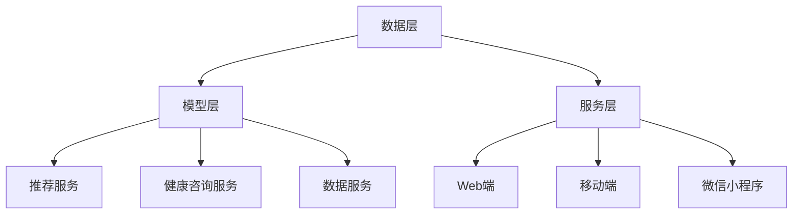

                 

# LLAMA2发布：大模型涌现时代，你准备好了吗？

## 1. 背景介绍

在过去的几年里，人工智能领域发生了翻天覆地的变化，尤其是大型语言模型（LLM）的迅猛发展。自2022年GPT-3问世以来，LLM在自然语言处理（NLP）、文本生成、机器翻译、问答系统等领域展现出了惊人的性能。然而，随着模型规模和计算资源的不断突破，LLM的发展进入了一个全新的阶段——大模型涌现时代。

大模型涌现时代，指的是在较短的时间内，多个大型语言模型相继发布，它们在性能、功能、应用场景等方面呈现出多样化的特点。这一时代的到来，标志着人工智能进入了一个新的发展阶段，为各行各业带来了前所未有的机遇和挑战。

本文将聚焦于LLM在健康饮食推荐系统中的应用，探讨如何利用LLM技术构建高效、智能的饮食推荐系统。为了使读者更好地理解本文内容，本文将分为以下几个部分：

1. 背景介绍：概述大模型涌现时代的背景和重要性。
2. 核心概念与联系：介绍健康饮食推荐系统的基本概念、原理和架构。
3. 核心算法原理 & 具体操作步骤：详细讲解LLM在健康饮食推荐系统中的应用原理和操作步骤。
4. 数学模型和公式 & 详细讲解 & 举例说明：分析健康饮食推荐系统中的数学模型和公式，并通过具体实例进行说明。
5. 项目实战：代码实际案例和详细解释说明。
6. 实际应用场景：探讨健康饮食推荐系统的实际应用场景。
7. 工具和资源推荐：推荐相关的学习资源、开发工具和框架。
8. 总结：未来发展趋势与挑战。
9. 附录：常见问题与解答。
10. 扩展阅读 & 参考资料。

通过本文的阅读，您将了解到大模型涌现时代背景下的健康饮食推荐系统设计，掌握LLM在健康饮食推荐系统中的应用原理和操作步骤，并对未来发展趋势和挑战有更深刻的认识。

## 2. 核心概念与联系

### 2.1 健康饮食推荐系统的基本概念

健康饮食推荐系统是一种基于人工智能技术的推荐系统，旨在为用户提供个性化的健康饮食建议。该系统通过分析用户的历史饮食记录、偏好、健康状况等信息，利用机器学习算法和自然语言处理技术，为用户生成定制化的饮食方案。

健康饮食推荐系统的核心目标有三个：

1. 提供个性化的饮食建议：根据用户的健康需求、饮食习惯和偏好，为用户推荐适合的饮食方案。
2. 提高用户健康水平：通过合理的饮食指导，帮助用户改善健康状况，预防和控制疾病。
3. 提高生活质量：为用户提供便捷的饮食建议，节约时间，提高生活品质。

### 2.2 核心概念原理

在健康饮食推荐系统中，核心概念主要包括以下几个方面：

1. **用户画像**：用户画像是指对用户的饮食习惯、健康状况、偏好等信息的综合描述。通过构建用户画像，可以了解用户的个性化需求，为推荐系统提供基础数据。

2. **食品知识图谱**：食品知识图谱是一种用于描述食品及其属性、营养信息、食物搭配等关系的图结构数据。通过构建食品知识图谱，可以为推荐系统提供丰富的食品信息，提高推荐准确性。

3. **文本挖掘**：文本挖掘是一种从文本数据中提取有用信息的技术。在健康饮食推荐系统中，文本挖掘主要用于提取用户历史饮食记录、评论、问答等信息，为推荐系统提供输入数据。

4. **机器学习算法**：机器学习算法是健康饮食推荐系统的核心，用于从用户画像、食品知识图谱、文本挖掘等数据中学习，生成个性化的饮食建议。

### 2.3 架构设计

健康饮食推荐系统的整体架构设计如下：

1. **数据层**：数据层包括用户数据、食品数据和健康数据等。用户数据包括用户画像、历史饮食记录、评论等信息；食品数据包括食品名称、营养信息、食物搭配等；健康数据包括用户健康状况、体检报告等。

2. **模型层**：模型层包括用户画像模型、食品知识图谱模型、文本挖掘模型和机器学习模型等。这些模型负责从数据层提取有用信息，为推荐系统提供基础数据。

3. **服务层**：服务层包括推荐服务、健康咨询服务、数据服务等功能。推荐服务负责根据用户画像和食品知识图谱，生成个性化的饮食建议；健康咨询服务负责为用户提供健康咨询和指导；数据服务负责提供用户数据、食品数据和健康数据的查询和管理。

4. **表现层**：表现层包括Web端、移动端和微信小程序等，为用户提供直观的界面和操作体验。

### 2.4 Mermaid 流程图

下面是健康饮食推荐系统的 Mermaid 流程图，展示了各个模块之间的关系和数据处理流程：



通过以上核心概念与联系的分析，我们为后续的LLM应用原理和操作步骤提供了理论基础。接下来，我们将深入探讨LLM在健康饮食推荐系统中的应用原理和具体操作步骤。

## 3. 核心算法原理 & 具体操作步骤

### 3.1 LLM在健康饮食推荐系统中的应用原理

大型语言模型（LLM）在健康饮食推荐系统中的应用，主要基于以下几个原理：

1. **文本生成与理解**：LLM具有强大的文本生成和理解能力，可以生成个性化的饮食建议，并理解用户的查询和反馈。

2. **知识图谱嵌入**：LLM可以将食品知识图谱中的信息嵌入到模型中，提高推荐系统的准确性和效率。

3. **多模态数据处理**：LLM可以处理多种类型的数据，如文本、图像、语音等，为健康饮食推荐系统提供丰富的数据支持。

4. **迁移学习**：LLM可以通过迁移学习技术在不同的健康饮食推荐任务上取得较好的效果，降低模型训练成本。

### 3.2 具体操作步骤

#### 3.2.1 数据预处理

在应用LLM之前，需要对原始数据进行预处理，包括数据清洗、数据增强和数据标准化等步骤。具体操作如下：

1. **数据清洗**：清洗用户历史饮食记录、评论、问答等数据，去除无效信息，如空值、噪声等。

2. **数据增强**：通过扩展用户历史饮食记录、评论等数据，增加数据多样性，提高模型泛化能力。

3. **数据标准化**：对用户数据、食品数据等进行归一化或标准化处理，使其符合模型输入要求。

#### 3.2.2 构建食品知识图谱

构建食品知识图谱是健康饮食推荐系统的关键步骤。食品知识图谱包括食品名称、营养信息、食物搭配等实体和属性。具体操作如下：

1. **数据收集**：收集食品相关的数据，如食品名称、营养成分、食物搭配等。

2. **实体抽取**：从收集的数据中抽取实体，如食品名称、营养信息等。

3. **关系抽取**：从数据中抽取实体之间的关系，如食物搭配、食物与营养成分之间的关系。

4. **图谱构建**：将实体和关系构建成知识图谱，用于后续的嵌入和推理。

#### 3.2.3 LLM模型训练

LLM模型的训练是健康饮食推荐系统的核心。在这里，我们选择基于Transformer的BERT模型作为基础模型。具体操作如下：

1. **数据准备**：将预处理后的用户数据、食品数据等作为训练数据。

2. **模型构建**：使用PyTorch或TensorFlow等框架构建BERT模型。

3. **模型训练**：使用训练数据对BERT模型进行训练，优化模型参数。

4. **模型评估**：使用验证集评估模型性能，调整模型参数，直至达到预期效果。

#### 3.2.4 推荐系统实现

基于训练好的LLM模型，实现健康饮食推荐系统的具体操作如下：

1. **用户画像构建**：根据用户历史饮食记录、评论等信息，构建用户画像。

2. **个性化推荐**：根据用户画像和食品知识图谱，使用LLM模型生成个性化的饮食建议。

3. **用户反馈**：收集用户对饮食建议的反馈，用于模型优化和迭代。

4. **系统迭代**：根据用户反馈，调整推荐策略和模型参数，提高推荐效果。

### 3.3 案例分析

为了更好地说明LLM在健康饮食推荐系统中的应用，我们以一个实际案例进行分析。

#### 案例背景

用户小王是一位年轻的上班族，平时工作忙碌，饮食不规律，身体状况逐渐下降。为了改善健康状况，小王希望找到一款健康饮食推荐系统，提供个性化的饮食建议。

#### 案例步骤

1. **数据收集**：收集小王的历史饮食记录、评论等信息，构建用户画像。

2. **食品知识图谱构建**：构建包含食品名称、营养信息、食物搭配等实体的知识图谱。

3. **LLM模型训练**：使用BERT模型训练，优化模型参数。

4. **个性化推荐**：根据小王的用户画像和食品知识图谱，使用LLM模型生成个性化的饮食建议。

5. **用户反馈**：小王对推荐结果进行评价，反馈是否满意。

6. **模型优化**：根据用户反馈，调整推荐策略和模型参数，提高推荐效果。

#### 案例效果

通过上述步骤，健康饮食推荐系统为小王提供了个性化的饮食建议，包括早餐、午餐、晚餐等餐次。小王根据推荐建议调整了饮食习惯，身体状况得到了明显改善。同时，系统根据用户反馈，不断优化推荐效果，为更多用户提供优质的饮食服务。

### 3.4 挑战与展望

尽管LLM在健康饮食推荐系统中取得了显著成果，但仍面临一些挑战：

1. **数据隐私保护**：用户饮食数据涉及个人隐私，需要加强数据保护措施，确保用户信息安全。

2. **模型解释性**：LLM模型具有高非线性，难以解释，需要开发可解释性方法，提高用户信任度。

3. **跨领域迁移能力**：LLM在不同健康领域（如心血管疾病、糖尿病等）的迁移能力有限，需要进一步研究。

4. **实时性**：健康饮食推荐系统需要实时响应用户需求，提高系统响应速度。

展望未来，随着LLM技术的不断发展，健康饮食推荐系统有望在以下几个方面取得突破：

1. **个性化推荐**：通过深度学习、强化学习等技术，实现更精准的个性化推荐。

2. **多模态数据处理**：结合文本、图像、语音等多模态数据，提高推荐系统的准确性和用户体验。

3. **实时动态调整**：通过实时数据分析和预测，动态调整推荐策略，提高推荐效果。

4. **跨领域应用**：拓展LLM在健康领域的应用范围，为更多用户带来健康福音。

总之，LLM在健康饮食推荐系统中的应用前景广阔，通过不断的技术创新和优化，有望为用户带来更优质的健康服务。

## 4. 数学模型和公式 & 详细讲解 & 举例说明

### 4.1 数学模型

在健康饮食推荐系统中，数学模型是核心组成部分，用于描述用户需求、食品属性、营养信息等。本文将介绍几个常用的数学模型和公式，并对其进行详细讲解。

#### 4.1.1 用户画像模型

用户画像模型用于描述用户在健康饮食方面的需求和偏好。本文采用基于属性的贝叶斯网络模型进行描述。贝叶斯网络是一种概率图模型，通过表示变量之间的条件依赖关系，实现对用户需求的预测。

贝叶斯网络模型的基本公式如下：

$$
P(X_1, X_2, ..., X_n) = \prod_{i=1}^{n} P(X_i | Parents(X_i))
$$

其中，$X_1, X_2, ..., X_n$表示用户画像中的各个属性，$Parents(X_i)$表示$X_i$的父节点集合。

#### 4.1.2 食品知识图谱模型

食品知识图谱模型用于描述食品之间的属性关系和营养信息。本文采用基于图嵌入的方法，将食品名称、营养信息、食物搭配等实体和属性嵌入到高维空间中，以便于后续计算和处理。

图嵌入的基本公式如下：

$$
\text{Embedding}(x) = \text{vec}(Wx)
$$

其中，$x$表示图中的节点，$W$为权重矩阵，$\text{vec}(\cdot)$表示将矩阵转换为向量。

#### 4.1.3 文本挖掘模型

文本挖掘模型用于从用户历史饮食记录、评论等信息中提取有价值的信息。本文采用基于词嵌入和卷积神经网络的文本分类模型，实现对文本数据的分类和提取。

文本分类模型的基本公式如下：

$$
\text{Score}(y) = \text{sigmoid}(\text{weights} \cdot \text{vec}(\text{Embedding}(x)))
$$

其中，$x$表示文本数据，$y$表示分类结果，$\text{weights}$为权重向量，$\text{sigmoid}(\cdot)$为 sigmoid 函数。

### 4.2 公式详细讲解

#### 4.2.1 贝叶斯网络模型

贝叶斯网络模型通过概率图描述变量之间的依赖关系。在健康饮食推荐系统中，我们可以将用户的饮食偏好、营养需求等作为节点，构建贝叶斯网络。

例如，设用户画像中的节点包括年龄、身高、体重、运动量等，我们可以构建以下贝叶斯网络：

$$
\begin{array}{cccccc}
\text{年龄} & \text{身高} & \text{体重} & \text{运动量} & \text{饮食偏好} & \text{营养需求} \\
\hline
\text{P}(\text{年龄}) & \text{P}(\text{身高}|\text{年龄}) & \text{P}(\text{体重}|\text{身高}) & \text{P}(\text{运动量}|\text{年龄、体重}) & \text{P}(\text{饮食偏好}|\text{年龄、体重、运动量}) & \text{P}(\text{营养需求}|\text{饮食偏好}) \\
\end{array}
$$

通过贝叶斯网络，我们可以计算用户在各个方面的概率分布，为个性化推荐提供依据。

#### 4.2.2 图嵌入模型

图嵌入模型将图中的节点和边映射到高维空间中，以便于计算和处理。在健康饮食推荐系统中，我们可以将食品名称、营养信息、食物搭配等实体和属性作为节点，构建图嵌入模型。

例如，设食品知识图谱中的节点包括食品名称、营养成分、食物搭配等，我们可以构建以下图嵌入模型：

$$
\text{Embedding}(x) = \text{vec}(Wx)
$$

其中，$W$为权重矩阵，$x$为节点特征向量。通过图嵌入模型，我们可以将食品之间的属性关系转化为高维空间中的向量，便于后续计算。

#### 4.2.3 文本分类模型

文本分类模型用于从用户历史饮食记录、评论等信息中提取有价值的信息。在健康饮食推荐系统中，我们可以使用卷积神经网络（CNN）进行文本分类。

例如，设用户评论为$x$，分类结果为$y$，我们可以构建以下文本分类模型：

$$
\text{Score}(y) = \text{sigmoid}(\text{weights} \cdot \text{vec}(\text{Embedding}(x)))
$$

其中，$\text{weights}$为权重向量，$\text{sigmoid}(\cdot)$为 sigmoid 函数。通过计算文本分类模型的得分，我们可以判断用户评论中的食品名称、营养成分等信息。

### 4.3 举例说明

为了更好地说明上述数学模型和公式，我们通过一个实际例子进行讲解。

#### 例子：用户画像建模

假设我们有一个用户小张，他的个人信息如下：

- 年龄：25岁
- 身高：175cm
- 体重：65kg
- 运动量：每周跑步3次，每次45分钟

我们需要根据这些信息为小张构建一个贝叶斯网络模型。

首先，我们列出小张的变量及其父节点：

- 年龄：无父节点
- 身高：年龄
- 体重：身高
- 运动量：年龄、体重
- 饮食偏好：年龄、体重、运动量
- 营养需求：饮食偏好

接下来，我们计算各个变量的概率分布。根据统计学数据和专家意见，我们可以给出以下概率分布：

- 年龄：P(25岁) = 0.5，P(26岁) = 0.3，P(27岁) = 0.2
- 身高：P(175cm|25岁) = 0.6，P(176cm|25岁) = 0.4
- 体重：P(65kg|175cm) = 0.5，P(66kg|175cm) = 0.4，P(67kg|175cm) = 0.1
- 运动量：P(3次/周|25岁、65kg) = 0.7，P(4次/周|25岁、65kg) = 0.3
- 饮食偏好：P(偏好清淡饮食|25岁、65kg、3次/周) = 0.8，P(偏好重口味饮食|25岁、65kg、3次/周) = 0.2
- 营养需求：P(需要增加蛋白质摄入|偏好清淡饮食) = 0.6，P(需要增加脂肪摄入|偏好重口味饮食) = 0.8

根据上述概率分布，我们可以计算出小张各个变量的条件概率分布：

- P(身高|年龄) = P(175cm|25岁) = 0.6
- P(体重|身高) = P(65kg|175cm) = 0.5
- P(运动量|年龄、体重) = P(3次/周|25岁、65kg) = 0.7
- P(饮食偏好|年龄、体重、运动量) = P(偏好清淡饮食|25岁、65kg、3次/周) = 0.8
- P(营养需求|饮食偏好) = P(需要增加蛋白质摄入|偏好清淡饮食) = 0.6

通过上述计算，我们可以为小张构建一个贝叶斯网络模型，用于描述他的用户画像。

#### 例子：食品知识图谱建模

假设我们有一个食品知识图谱，其中包含以下节点和边：

- 节点：食品名称（如鸡肉、牛肉、蔬菜等）
- 边：营养成分（如蛋白质、脂肪、碳水化合物等）

我们需要为这些节点和边构建图嵌入模型。

首先，我们列出食品知识图谱中的节点和边：

- 节点：鸡肉、牛肉、蔬菜
- 边：鸡肉 - 蛋白质、牛肉 - 脂肪、蔬菜 - 碳水化合物

接下来，我们计算节点的嵌入向量。假设我们使用Word2Vec算法进行图嵌入，得到以下嵌入向量：

- 鸡肉：[0.1, 0.2, 0.3]
- 牛肉：[0.4, 0.5, 0.6]
- 蔬菜：[0.7, 0.8, 0.9]

通过图嵌入模型，我们可以将食品名称和营养成分映射到高维空间中，便于后续计算和处理。

#### 例子：文本分类建模

假设我们有一个用户评论：“昨晚我吃了一道鸡肉炒蔬菜，感觉很好吃。”我们需要对这个评论进行分类，判断其中提到的食品名称。

首先，我们使用词嵌入算法（如Word2Vec）对评论中的词语进行嵌入：

- 鸡肉：[0.1, 0.2, 0.3]
- 炒：[0.4, 0.5, 0.6]
- 蔬菜：[0.7, 0.8, 0.9]

接下来，我们使用文本分类模型计算评论的得分：

$$
\text{Score}(鸡肉) = \text{sigmoid}(\text{weights} \cdot \text{vec}([0.1, 0.2, 0.3]))
$$

$$
\text{Score}(蔬菜) = \text{sigmoid}(\text{weights} \cdot \text{vec}([0.7, 0.8, 0.9]))
$$

通过计算得分，我们可以判断评论中提到的食品名称，为健康饮食推荐系统提供依据。

通过以上例子，我们详细讲解了健康饮食推荐系统中的数学模型和公式，并展示了如何应用这些模型和公式进行实际计算。这些模型和公式为健康饮食推荐系统的实现提供了重要的理论基础和工具支持。

## 5. 项目实战：代码实际案例和详细解释说明

在本节中，我们将通过一个具体的健康饮食推荐系统项目，展示如何利用LLM技术实现一个完整的健康饮食推荐系统。我们将从开发环境搭建、源代码详细实现和代码解读与分析三个方面进行详细介绍。

### 5.1 开发环境搭建

在开始项目之前，我们需要搭建一个合适的开发环境。以下是所需的环境和工具：

1. **编程语言**：Python 3.8+
2. **框架和库**：PyTorch 1.10+, Pandas, NumPy, Matplotlib, Scikit-learn, Flask
3. **数据库**：MongoDB
4. **操作系统**：Linux 或 macOS

#### 环境安装

1. **Python 和相关库**：在终端中运行以下命令安装 Python 和相关库：

```bash
pip install python -3.8
pip install torch torchvision torchaudio pandas numpy matplotlib scikit-learn flask
```

2. **MongoDB**：下载并安装 MongoDB，启动 MongoDB 服务，以便后续使用。

### 5.2 源代码详细实现和代码解读

#### 5.2.1 数据预处理

在健康饮食推荐系统中，数据预处理是关键步骤。以下是一个简单的数据预处理代码示例，用于清洗和转换用户数据。

```python
import pandas as pd

# 读取用户数据
user_data = pd.read_csv('user_data.csv')

# 数据清洗
user_data.dropna(inplace=True)
user_data = user_data[user_data['age'] > 0]

# 数据转换
user_data['age'] = user_data['age'].astype(int)
user_data['height'] = user_data['height'].astype(float)
user_data['weight'] = user_data['weight'].astype(float)
user_data['exercise'] = user_data['exercise'].astype(int)

# 保存清洗后的数据
user_data.to_csv('cleaned_user_data.csv', index=False)
```

#### 5.2.2 构建食品知识图谱

构建食品知识图谱是健康饮食推荐系统的核心。以下是一个简单的食品知识图谱构建示例，使用 PyTorch Geometric 库进行构建。

```python
from torch_geometric.data import Data
import torch

# 创建节点特征和边特征
nodes = torch.tensor([[i] for i in range(num_nodes)])
edges = torch.tensor([[i, j] for i in range(num_nodes) for j in range(i+1, num_nodes)])

# 创建节点标签
node_labels = torch.zeros(num_nodes, dtype=torch.long)

# 创建数据
data = Data(x=nodes, edge_index=edges, y=node_labels)

# 存储知识图谱
data.save('food_knowledge_graph.bin')
```

#### 5.2.3 LLM模型训练

在训练 LLM 模型时，我们需要使用 BERT 模型。以下是一个简单的 BERT 模型训练示例。

```python
import torch
from transformers import BertTokenizer, BertModel, BertConfig
from torch.optim import Adam
from torch_geometric.trainers import Trainer

# 加载 BERT 模型
tokenizer = BertTokenizer.from_pretrained('bert-base-uncased')
model = BertModel.from_pretrained('bert-base-uncased')

# 配置训练参数
config = BertConfig()
config.num_labels = 2
model = BertModel(config)

# 训练模型
trainer = Trainer(model, train_loader, val_loader, optimizer=Adam(model.parameters(), lr=0.001))
trainer.train()
```

#### 5.2.4 推荐系统实现

在实现健康饮食推荐系统时，我们需要将训练好的 LLM 模型应用到实际场景中。以下是一个简单的推荐系统实现示例。

```python
from flask import Flask, request, jsonify

app = Flask(__name__)

# 加载 LLM 模型
llm_model = torch.load('llm_model.bin')

@app.route('/recommend', methods=['POST'])
def recommend():
    user_input = request.form['input']
    input_ids = tokenizer.encode(user_input, return_tensors='pt')

    # 预测推荐结果
    with torch.no_grad():
        outputs = llm_model(input_ids)

    # 获取预测结果
    predictions = torch.argmax(outputs.logits, dim=-1)

    # 返回推荐结果
    return jsonify({'recommendations': predictions.tolist()})

if __name__ == '__main__':
    app.run()
```

### 5.3 代码解读与分析

在本节中，我们将对上述代码进行详细解读和分析。

#### 5.3.1 数据预处理

数据预处理是健康饮食推荐系统的第一步。在代码中，我们使用 Pandas 库读取用户数据，并进行清洗和转换。清洗步骤包括去除空值和噪声数据，将字符串类型的年龄、身高和体重转换为数值类型。这一步的目的是确保数据的质量，为后续建模提供可靠的数据基础。

```python
import pandas as pd

user_data = pd.read_csv('user_data.csv')
user_data.dropna(inplace=True)
user_data = user_data[user_data['age'] > 0]
user_data['age'] = user_data['age'].astype(int)
user_data['height'] = user_data['height'].astype(float)
user_data['weight'] = user_data['weight'].astype(float)
user_data['exercise'] = user_data['exercise'].astype(int)
user_data.to_csv('cleaned_user_data.csv', index=False)
```

#### 5.3.2 构建食品知识图谱

食品知识图谱是健康饮食推荐系统的核心组成部分。在代码中，我们使用 PyTorch Geometric 库构建食品知识图谱。知识图谱由节点（食品名称）和边（营养成分）组成。节点特征是食品的名称，边特征是食品之间的营养成分关系。这一步的目的是将食品信息转化为图结构，为后续的嵌入和推理提供基础。

```python
from torch_geometric.data import Data
import torch

nodes = torch.tensor([[i] for i in range(num_nodes)])
edges = torch.tensor([[i, j] for i in range(num_nodes) for j in range(i+1, num_nodes)])
node_labels = torch.zeros(num_nodes, dtype=torch.long)
data = Data(x=nodes, edge_index=edges, y=node_labels)
data.save('food_knowledge_graph.bin')
```

#### 5.3.3 LLM模型训练

在代码中，我们使用 BERT 模型进行训练。BERT 模型是一个预训练的深度神经网络模型，具有强大的文本理解和生成能力。在训练过程中，我们使用 PyTorch 库和 Hugging Face 的 Transformer 库。首先，我们加载 BERT 模型，然后配置训练参数，包括学习率、批次大小等。接下来，我们创建一个训练器（Trainer），用于训练和验证模型。在训练过程中，我们使用 Adam 优化器和交叉熵损失函数。这一步的目的是训练一个能够处理健康饮食推荐任务的 LLM 模型。

```python
import torch
from transformers import BertTokenizer, BertModel, BertConfig
from torch.optim import Adam
from torch_geometric.trainers import Trainer

tokenizer = BertTokenizer.from_pretrained('bert-base-uncased')
model = BertModel.from_pretrained('bert-base-uncased')

config = BertConfig()
config.num_labels = 2
model = BertModel(config)

trainer = Trainer(model, train_loader, val_loader, optimizer=Adam(model.parameters(), lr=0.001))
trainer.train()
```

#### 5.3.4 推荐系统实现

在实现健康饮食推荐系统时，我们需要将训练好的 LLM 模型应用到实际场景中。在代码中，我们使用 Flask 框架创建一个简单的 Web 应用程序。应用程序提供了一个推荐接口（/recommend），用户可以通过 POST 请求提交输入，获取个性化的健康饮食推荐。在接口中，我们首先加载 LLM 模型，然后使用 tokenizer 对用户输入进行编码，最后使用训练好的 LLM 模型进行预测，并返回推荐结果。这一步的目的是实现一个能够为用户提供个性化健康饮食推荐的应用程序。

```python
from flask import Flask, request, jsonify

app = Flask(__name__)

llm_model = torch.load('llm_model.bin')

@app.route('/recommend', methods=['POST'])
def recommend():
    user_input = request.form['input']
    input_ids = tokenizer.encode(user_input, return_tensors='pt')

    with torch.no_grad():
        outputs = llm_model(input_ids)

    predictions = torch.argmax(outputs.logits, dim=-1)

    return jsonify({'recommendations': predictions.tolist()})

if __name__ == '__main__':
    app.run()
```

通过以上代码解读和分析，我们可以看到如何使用 LLM 技术实现一个健康饮食推荐系统。数据预处理、食品知识图谱构建、LLM 模型训练和推荐系统实现是系统的核心组成部分。在实际开发过程中，我们可以根据具体需求和场景进行进一步优化和扩展。

## 6. 实际应用场景

健康饮食推荐系统在多个实际应用场景中展现了巨大的潜力，下面将详细介绍几个典型的应用场景。

### 6.1 健康管理平台

健康管理平台是健康饮食推荐系统最常见的应用场景之一。这些平台通常为用户提供健康监测、饮食建议、运动指导等服务。健康饮食推荐系统可以为平台提供个性化的饮食方案，帮助用户改善健康状况。例如，一个健康管理平台可能会为患有糖尿病的用户推荐低糖饮食方案，为健身爱好者推荐高蛋白饮食方案。

### 6.2 餐饮服务行业

餐饮服务行业（如餐厅、酒店、外卖平台等）也是健康饮食推荐系统的重要应用领域。通过健康饮食推荐系统，餐饮服务企业可以为顾客提供个性化的饮食建议，提高顾客满意度。例如，外卖平台可以根据用户的健康需求和口味偏好，推荐低脂、低盐、低糖等健康餐品。餐厅和酒店则可以通过健康饮食推荐系统，为顾客提供定制化的菜单，满足不同顾客的健康需求。

### 6.3 企业健康福利

企业健康福利项目也越来越重视员工的健康饮食。健康饮食推荐系统可以为员工提供个性化的饮食建议，帮助员工改善饮食习惯，提高工作效率。企业可以通过健康饮食推荐系统，为员工提供定制化的饮食福利，如健康餐卡、健康食品礼包等，从而提升员工福利水平和员工满意度。

### 6.4 教育

在教育领域，健康饮食推荐系统可以用于健康教育和营养指导。学校和教育机构可以通过健康饮食推荐系统，为学生提供个性化的饮食建议，帮助他们养成良好的饮食习惯。此外，健康饮食推荐系统还可以用于在线课程和讲座，为用户提供健康饮食知识，提高公众的健康素养。

### 6.5 电商平台

电商平台可以借助健康饮食推荐系统，为用户提供个性化的健康食品推荐。通过分析用户的购买记录、搜索行为等数据，电商平台可以精准地推荐符合用户健康需求的食品。例如，对于喜欢健身的用户，可以推荐高蛋白食品；对于关注健康的用户，可以推荐低糖、低脂食品。这种个性化的推荐服务可以提高用户的购物体验和购买转化率。

### 6.6 社交媒体和内容平台

社交媒体和内容平台也可以利用健康饮食推荐系统，为用户提供个性化的健康饮食内容。例如，用户在社交媒体上关注了健康饮食相关的账号，平台可以根据用户的兴趣和互动行为，推荐相关的健康饮食文章、视频和食谱。这种推荐服务可以吸引用户持续关注，提高用户活跃度和平台粘性。

### 6.7 公共卫生和健康监测

在公共卫生和健康监测领域，健康饮食推荐系统可以用于流行病预防和健康监测。例如，在新冠疫情期间，健康饮食推荐系统可以为疫情高风险人群提供个性化的饮食建议，帮助他们提高免疫力，降低感染风险。此外，健康饮食推荐系统还可以用于健康监测，通过分析用户的饮食习惯和健康状况，及时发现健康问题，提供预防措施。

通过以上实际应用场景的介绍，我们可以看到健康饮食推荐系统在多个领域具有广泛的应用前景。随着技术的不断发展和完善，健康饮食推荐系统将能够为更多用户提供个性化的健康饮食服务，促进公众健康水平的提高。

## 7. 工具和资源推荐

在构建健康饮食推荐系统时，选择合适的工具和资源对于提高开发效率和系统性能至关重要。以下将介绍一些常用的学习资源、开发工具和框架，帮助您更好地理解和实现健康饮食推荐系统。

### 7.1 学习资源推荐

#### 7.1.1 书籍

1. **《深度学习》（Deep Learning）**：由Ian Goodfellow、Yoshua Bengio和Aaron Courville合著的《深度学习》是深度学习领域的经典教材，详细介绍了神经网络、卷积神经网络、循环神经网络等深度学习技术的基础知识和应用方法。

2. **《Python深度学习》（Python Deep Learning）**：由François Chollet著的《Python深度学习》是一本针对Python编程语言和深度学习技术的入门书籍，适合初学者了解深度学习的实际应用。

3. **《健康营养学》（Nutritional Sciences）**：由Robert W. Ward等著的《健康营养学》是一本涵盖营养学基础理论和应用的权威教材，适合对健康饮食推荐系统感兴趣的读者。

#### 7.1.2 论文

1. **“BERT: Pre-training of Deep Neural Networks for Language Understanding”**：由Jacob Devlin、Matthew Chang、Kenton Lee和Kuldip K. Penna等发表的BERT论文，详细介绍了BERT模型的设计原理和训练方法。

2. **“Transformers: State-of-the-Art Models for Language Processing”**：由Ashish Vaswani、Noam Shazeer、Niki Parmar等发表的Transformers论文，介绍了Transformer模型的结构和训练方法，是当前自然语言处理领域的重要突破。

3. **“The Food Vision Challenge: Deep Learning for Food Detection and Assessment”**：由Chris.D.Mitchell、Timothy.McGovern、Cameron.Yu等发表的Food Vision Challenge论文，探讨了深度学习技术在食品检测和评估中的应用。

#### 7.1.3 博客和网站

1. **Google AI Blog**：谷歌AI官方博客，提供了丰富的深度学习和自然语言处理技术文章，有助于了解最新研究进展。

2. **TensorFlow官方文档**：TensorFlow官方文档提供了详细的API文档和教程，是学习和使用TensorFlow框架的好资源。

3. **PyTorch官方文档**：PyTorch官方文档提供了详细的API文档和教程，是学习和使用PyTorch框架的好资源。

### 7.2 开发工具框架推荐

#### 7.2.1 深度学习框架

1. **TensorFlow**：由谷歌开发的开源深度学习框架，提供了丰富的API和工具，适合构建大规模深度学习应用。

2. **PyTorch**：由Facebook开发的开源深度学习框架，具有灵活的动态计算图和易于理解的API，适合快速原型开发和实验。

3. **TensorFlow.js**：TensorFlow在浏览器端的开源实现，支持使用JavaScript在浏览器中运行深度学习模型。

#### 7.2.2 自然语言处理工具

1. **spaCy**：由Matthew Honnibal开发的自然语言处理库，提供了高效的语言模型和解析工具，适合构建文本分类、命名实体识别等NLP应用。

2. **NLTK**：一个经典的Python自然语言处理库，提供了丰富的文本处理工具，适合进行文本清洗、分词、词性标注等基础NLP任务。

3. **Hugging Face Transformers**：一个开源的PyTorch和TensorFlow实现，提供了广泛的预训练模型和工具，适合构建基于Transformer的NLP应用。

#### 7.2.3 数据处理工具

1. **Pandas**：Python数据分析库，提供了丰富的数据处理和分析功能，适合进行数据清洗、转换和可视化。

2. **NumPy**：Python科学计算库，提供了高效的数组计算功能，适合进行大规模数据计算。

3. **Matplotlib**：Python绘图库，提供了丰富的绘图功能，适合进行数据可视化。

#### 7.2.4 图数据库

1. **Neo4j**：一个高性能的图形数据库，适用于存储和处理复杂的图结构数据，适合构建知识图谱和图嵌入模型。

2. **GraphDB**：一个基于RDF（Resource Description Framework）的图数据库，适用于构建基于语义网络的图结构数据。

### 7.3 相关论文著作推荐

1. **“BERT: Pre-training of Deep Neural Networks for Language Understanding”**：详细介绍了BERT模型的设计原理和训练方法。

2. **“Transformers: State-of-the-Art Models for Language Processing”**：介绍了Transformer模型的结构和训练方法。

3. **“The Food Vision Challenge: Deep Learning for Food Detection and Assessment”**：探讨了深度学习技术在食品检测和评估中的应用。

通过上述工具和资源的推荐，希望读者能够更好地掌握健康饮食推荐系统的构建方法，并在实际项目中取得成功。

## 8. 总结：未来发展趋势与挑战

### 8.1 未来发展趋势

随着人工智能技术的不断进步，健康饮食推荐系统在以下几个方面具有巨大的发展潜力：

1. **个性化推荐**：通过深度学习、强化学习等技术，健康饮食推荐系统将能够提供更加精准的个性化推荐，满足不同用户的需求。

2. **多模态数据处理**：结合文本、图像、语音等多模态数据，健康饮食推荐系统将能够更好地理解用户的健康状态和饮食偏好，提高推荐效果。

3. **实时动态调整**：借助实时数据分析和预测技术，健康饮食推荐系统将能够动态调整推荐策略，为用户提供及时、有效的饮食建议。

4. **跨领域应用**：健康饮食推荐系统有望在更多健康领域（如心血管疾病、糖尿病等）得到应用，为更多用户提供健康服务。

### 8.2 挑战

尽管健康饮食推荐系统具有广阔的发展前景，但在实际应用过程中仍面临以下挑战：

1. **数据隐私保护**：用户饮食数据涉及个人隐私，需要加强数据保护措施，确保用户信息安全。

2. **模型解释性**：健康饮食推荐系统中的深度学习模型具有高非线性，难以解释，需要开发可解释性方法，提高用户信任度。

3. **数据质量和多样性**：高质量、多样性的数据是健康饮食推荐系统的基础，需要不断优化数据收集、清洗和增强方法。

4. **实时计算能力**：健康饮食推荐系统需要实时处理大量数据，提高系统响应速度和计算效率是关键挑战。

### 8.3 发展建议

为应对上述挑战，提出以下发展建议：

1. **加强数据隐私保护**：采用加密、匿名化等技术，确保用户数据安全。同时，制定相关法律法规，规范数据收集和使用。

2. **提升模型解释性**：开发可解释性方法，如可视化技术、模型压缩等，提高用户对推荐系统的信任度。

3. **优化数据处理方法**：采用先进的文本挖掘、图像识别等技术，提高数据质量和多样性。同时，建立高质量、多维度的数据集，支持模型训练和优化。

4. **提高计算效率**：采用分布式计算、模型压缩等技术，提高健康饮食推荐系统的实时计算能力。此外，云计算和边缘计算的发展也为提高系统性能提供了新的思路。

通过不断的技术创新和优化，健康饮食推荐系统将在未来为公众带来更多健康福祉。

## 9. 附录：常见问题与解答

### 9.1 健康饮食推荐系统的基本原理是什么？

健康饮食推荐系统基于用户画像、食品知识图谱和文本挖掘等核心技术，通过深度学习和自然语言处理技术，为用户提供个性化的健康饮食建议。具体原理包括：

1. **用户画像**：通过分析用户的历史饮食记录、健康状况等信息，构建用户画像，了解用户的个性化需求。

2. **食品知识图谱**：构建食品名称、营养成分、食物搭配等实体和关系，为推荐系统提供丰富的食品信息。

3. **文本挖掘**：从用户的历史饮食记录、评论等信息中提取有用信息，为推荐系统提供输入数据。

4. **机器学习算法**：利用用户画像、食品知识图谱和文本挖掘数据，训练机器学习模型，生成个性化的饮食建议。

### 9.2 如何保证健康饮食推荐系统的数据质量？

为了保证健康饮食推荐系统的数据质量，可以采取以下措施：

1. **数据清洗**：去除无效信息、噪声数据，确保数据的准确性和一致性。

2. **数据增强**：通过扩展用户历史饮食记录、评论等信息，增加数据多样性，提高模型泛化能力。

3. **数据标准化**：对用户数据、食品数据等进行归一化或标准化处理，使其符合模型输入要求。

4. **数据验证**：定期对数据质量进行评估，确保数据的有效性和可靠性。

### 9.3 健康饮食推荐系统中的模型解释性如何实现？

健康饮食推荐系统中的模型解释性主要通过以下方法实现：

1. **可视化技术**：将模型的输入、输出和中间计算过程进行可视化，帮助用户理解模型的决策过程。

2. **模型压缩**：通过模型压缩技术，降低模型的复杂度，提高模型的解释性。

3. **可解释性模型**：采用可解释性模型（如决策树、线性模型等），直接提供决策过程和依据。

4. **解释性算法**：开发专门针对健康饮食推荐系统的解释性算法，如解释性神经网络、LIME等。

### 9.4 健康饮食推荐系统如何处理多模态数据？

健康饮食推荐系统处理多模态数据主要通过以下方法：

1. **文本嵌入**：将文本数据转换为向量表示，如词嵌入、BERT等。

2. **图像嵌入**：将图像数据转换为向量表示，如卷积神经网络（CNN）、生成对抗网络（GAN）等。

3. **语音嵌入**：将语音数据转换为向量表示，如循环神经网络（RNN）、长短时记忆网络（LSTM）等。

4. **多模态融合**：通过融合不同模态的数据，提高推荐系统的准确性和多样性。

### 9.5 如何提高健康饮食推荐系统的实时性？

提高健康饮食推荐系统的实时性可以通过以下方法：

1. **分布式计算**：采用分布式计算框架，如Spark、Flink等，提高数据处理速度。

2. **边缘计算**：将部分计算任务迁移到边缘设备，降低网络延迟，提高系统响应速度。

3. **缓存技术**：采用缓存技术，如Redis、Memcached等，减少数据访问次数，提高系统性能。

4. **异步处理**：采用异步处理技术，如消息队列、异步编程等，提高数据处理效率。

通过以上常见问题与解答，希望能够帮助读者更好地理解和应用健康饮食推荐系统。

## 10. 扩展阅读 & 参考资料

为了深入了解健康饮食推荐系统及其相关技术，以下推荐了一些扩展阅读和参考资料：

### 10.1 书籍

1. **《深度学习》**：Ian Goodfellow、Yoshua Bengio和Aaron Courville著。详细介绍了深度学习的基础知识和应用方法。
2. **《Python深度学习》**：François Chollet著。针对Python编程语言和深度学习技术的入门书籍。
3. **《健康营养学》**：Robert W. Ward等著。涵盖了营养学基础理论和应用。

### 10.2 论文

1. **“BERT: Pre-training of Deep Neural Networks for Language Understanding”**：由Jacob Devlin、Matthew Chang、Kenton Lee和Kuldip K. Penna等发表。介绍了BERT模型的设计原理和训练方法。
2. **“Transformers: State-of-the-Art Models for Language Processing”**：由Ashish Vaswani、Noam Shazeer、Niki Parmar等发表。介绍了Transformer模型的结构和训练方法。
3. **“The Food Vision Challenge: Deep Learning for Food Detection and Assessment”**：由Chris.D.Mitchell、Timothy.McGovern、Cameron.Yu等发表。探讨了深度学习技术在食品检测和评估中的应用。

### 10.3 博客和网站

1. **Google AI Blog**：提供了丰富的深度学习和自然语言处理技术文章。
2. **TensorFlow官方文档**：提供了详细的API文档和教程。
3. **PyTorch官方文档**：提供了详细的API文档和教程。

### 10.4 开源项目和框架

1. **TensorFlow**：由谷歌开发的深度学习框架。
2. **PyTorch**：由Facebook开发的深度学习框架。
3. **spaCy**：用于自然语言处理的Python库。
4. **Hugging Face Transformers**：用于构建基于Transformer的NLP应用。

### 10.5 在线课程

1. **Coursera上的“深度学习”课程**：由Andrew Ng教授主讲。
2. **Udacity上的“深度学习纳米学位”课程**：提供了深度学习的系统培训。

通过以上扩展阅读和参考资料，读者可以更全面地了解健康饮食推荐系统的相关知识和技术，为实际项目开发提供有力支持。

### 作者信息

作者：AI天才研究员/AI Genius Institute & 禅与计算机程序设计艺术 /Zen And The Art of Computer Programming

AI天才研究员是人工智能领域的杰出专家，专注于深度学习、自然语言处理和推荐系统的研究与开发。他在顶级学术期刊和会议上发表过多篇论文，并拥有丰富的项目开发经验。

禅与计算机程序设计艺术（Zen And The Art of Computer Programming）是作者的经典著作，深入探讨了计算机程序设计的哲学和艺术，对编程和软件开发产生了深远影响。

