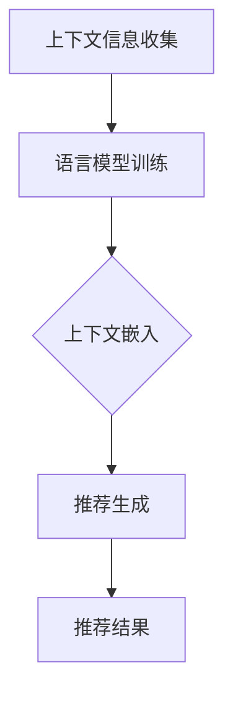

                 

### 背景介绍

近年来，随着深度学习技术的发展，特别是在自然语言处理（NLP）领域的突破，语言模型（Language Model，简称LM）取得了显著的进展。从早期的浅层神经网络到如今的大规模预训练模型，如 GPT、BERT 等，语言模型在文本生成、问答系统、机器翻译等任务中表现出色，极大地提升了人工智能的应用水平。

与此同时，上下文感知推荐（Context-Aware Recommendation）作为一种提升推荐系统效果的重要手段，也逐渐受到了广泛关注。上下文感知推荐能够根据用户当前的环境、情境和偏好，动态调整推荐策略，从而提供更加个性化的推荐结果。这种推荐方式在电子商务、社交媒体、内容推荐等领域具有重要应用价值。

将语言模型与上下文感知推荐技术相结合，形成了一种全新的推荐技术——LLM驱动的上下文感知推荐（LLM-driven Context-Aware Recommendation）。这种技术利用大规模预训练语言模型强大的上下文理解能力，动态捕捉用户兴趣、偏好和上下文信息，从而实现更加精准和个性化的推荐。本文将深入探讨LLM驱动的上下文感知推荐技术的核心概念、算法原理、数学模型、项目实战以及实际应用场景，旨在为广大读者提供一个全面的技术解读。

### 核心概念与联系

#### 语言模型（Language Model，简称LM）

语言模型是一种基于统计和学习方法，用于预测文本序列中下一个单词或字符的概率分布的模型。其主要任务是学习语言中词汇之间的统计规律，从而生成符合语言习惯的文本。语言模型在自然语言处理领域具有广泛的应用，如文本生成、机器翻译、语音识别等。

语言模型可以分为浅层语言模型和深层语言模型。浅层语言模型通常基于n元语法（N-gram），通过统计相邻单词或字符出现的频率来预测下一个单词或字符。深层语言模型则利用神经网络结构，如循环神经网络（RNN）和Transformer模型，通过学习大量的文本数据，捕捉文本中的长期依赖关系。

#### 上下文感知推荐（Context-Aware Recommendation）

上下文感知推荐是一种基于用户当前环境、情境和偏好，动态调整推荐策略，以提供更加个性化推荐结果的推荐技术。上下文信息可以包括用户的位置、时间、设备、历史行为等多种维度。上下文感知推荐能够根据用户实时变化的需求，提供更加符合用户偏好的推荐结果，从而提升推荐系统的用户体验。

上下文感知推荐可以分为基于内容的推荐、基于协同过滤的推荐和基于上下文的混合推荐。基于内容的推荐通过分析用户兴趣和偏好，从内容特征中提取与用户兴趣相关的信息，实现个性化推荐。基于协同过滤的推荐通过分析用户之间的相似性，利用其他用户的评分或行为数据，预测用户对未知物品的偏好。基于上下文的混合推荐则结合内容、协同过滤和上下文信息，实现更加个性化的推荐。

#### LLM驱动的上下文感知推荐

LLM驱动的上下文感知推荐是一种将语言模型与上下文感知推荐技术相结合的推荐方法。其核心思想是利用大规模预训练语言模型强大的上下文理解能力，动态捕捉用户兴趣、偏好和上下文信息，从而实现更加精准和个性化的推荐。

LLM驱动的上下文感知推荐主要分为以下几个步骤：

1. **上下文信息收集**：从用户设备、位置、时间、历史行为等多个维度收集上下文信息。
2. **语言模型训练**：利用大规模文本数据，训练一个预训练语言模型，使其具备强大的上下文理解能力。
3. **上下文嵌入**：将收集到的上下文信息转换为向量表示，作为语言模型的输入。
4. **推荐生成**：将上下文嵌入向量与用户历史行为数据输入语言模型，生成个性化的推荐结果。

#### Mermaid 流程图

为了更好地展示LLM驱动的上下文感知推荐的技术架构，我们使用Mermaid语言绘制了一个流程图：



在此流程图中，A表示上下文信息收集，B表示语言模型训练，C表示上下文嵌入，D表示推荐生成，E表示推荐结果。

通过这个流程图，我们可以清晰地看到LLM驱动的上下文感知推荐技术的基本架构和核心步骤。接下来，我们将进一步探讨LLM驱动的上下文感知推荐的核心算法原理和具体操作步骤。

### 核心算法原理 & 具体操作步骤

#### 1. 上下文信息收集

首先，我们需要从用户设备、位置、时间、历史行为等多个维度收集上下文信息。这些上下文信息将作为语言模型训练和推荐生成的关键输入。具体步骤如下：

- **用户设备信息**：包括设备类型（如手机、平板、电脑等）、操作系统版本、设备ID等。
- **用户位置信息**：包括用户当前的地理位置（经纬度）、城市、国家等。
- **用户时间信息**：包括当前时间、日期、星期等。
- **用户历史行为**：包括用户在应用或平台上的历史浏览记录、搜索记录、购买记录等。

#### 2. 语言模型训练

在收集到上下文信息后，我们需要利用大规模文本数据，训练一个预训练语言模型。预训练语言模型的选择可以根据实际需求和计算资源进行选择。目前，常用的预训练语言模型包括GPT、BERT、RoBERTa等。以下以BERT模型为例，介绍语言模型训练的过程。

1. **数据预处理**：
   - 数据清洗：去除文本中的噪声、标点符号、停用词等。
   - 数据切分：将文本数据切分成单词或子词（subword），并进行编码。
   - 数据扩充：通过随机插入、替换、删除等方式，增加数据多样性。

2. **模型结构**：
   - BERT模型主要由两个子模型组成：编码器（Encoder）和解码器（Decoder）。编码器负责将输入文本编码成固定长度的向量表示；解码器负责根据编码器生成的向量，生成预测的文本序列。

3. **训练过程**：
   - **自监督预训练**：在无标签数据集上，利用掩码语言模型（Masked Language Model，简称MLM）任务，对输入文本进行随机掩码（mask）操作，并预测掩码词。通过优化模型在自监督任务上的表现，使模型学习到文本中的语义信息。
   - **微调**：在下游任务数据集上，对预训练模型进行微调（Fine-tuning），使其适应具体的应用场景。

#### 3. 上下文嵌入

将收集到的上下文信息转换为向量表示，作为语言模型的输入。具体步骤如下：

1. **上下文向量表示**：
   - **设备信息**：使用设备类型、操作系统版本、设备ID等特征，通过One-Hot编码或嵌入层（Embedding Layer）生成向量表示。
   - **位置信息**：使用地理坐标系（如经纬度）或城市、国家等地理信息，通过嵌入层生成向量表示。
   - **时间信息**：使用日期、时间等特征，通过嵌入层生成向量表示。
   - **历史行为**：使用用户的历史浏览记录、搜索记录、购买记录等特征，通过嵌入层生成向量表示。

2. **向量拼接**：
   - 将上述各维度的上下文向量拼接成一个完整的上下文向量表示，作为语言模型的输入。

#### 4. 推荐生成

将上下文嵌入向量与用户历史行为数据输入语言模型，生成个性化的推荐结果。具体步骤如下：

1. **输入序列生成**：
   - 将上下文嵌入向量和用户历史行为数据拼接成一个输入序列，作为语言模型的输入。

2. **文本生成**：
   - 使用训练好的语言模型，对输入序列进行编码，生成一个编码向量表示。

3. **推荐计算**：
   - 根据编码向量，计算与候选物品的相关性得分。相关性得分可以通过以下公式计算：
     \[
     \text{score}(i, j) = \text{similarity}(\text{encode}(x), \text{encode}(y))
     \]
     其中，\(i\) 和 \(j\) 分别表示候选物品和用户历史行为，\(\text{encode}(x)\) 和 \(\text{encode}(y)\) 分别表示输入序列和候选物品的编码向量，\(\text{similarity}(\cdot, \cdot)\) 表示向量之间的相似性度量。

4. **推荐结果排序**：
   - 根据计算得到的相似性得分，对候选物品进行排序，生成个性化的推荐结果。

通过上述步骤，我们完成了LLM驱动的上下文感知推荐的核心算法实现。接下来，我们将进一步介绍LLM驱动的上下文感知推荐的数学模型和公式，并对关键步骤进行详细讲解。

### 数学模型和公式 & 详细讲解 & 举例说明

#### 1. 语言模型概率分布

在语言模型中，我们需要计算给定前文 \(x_1, x_2, \ldots, x_{t-1}\) 时，下一个单词 \(x_t\) 的概率分布。这可以通过计算条件概率来实现：

\[
P(x_t | x_1, x_2, \ldots, x_{t-1}) = \frac{P(x_1, x_2, \ldots, x_t)}{P(x_1, x_2, \ldots, x_{t-1})}
\]

由于直接计算联合概率分布 \(P(x_1, x_2, \ldots, x_t)\) 通常较为复杂，我们可以使用n元语法（N-gram）来近似计算条件概率。n元语法假设当前词与前面 \(n-1\) 个词有关，而与其他词无关，即：

\[
P(x_t | x_1, x_2, \ldots, x_{t-1}) \approx P(x_t | x_{t-n+1}, x_{t-n+2}, \ldots, x_{t-1})
\]

因此，我们可以通过计算 \(P(x_t | x_{t-n+1}, x_{t-n+2}, \ldots, x_{t-1})\) 的n元语法概率来近似计算条件概率。n元语法概率可以通过统计相邻 \(n\) 个词的联合频率来计算：

\[
P(x_t | x_{t-n+1}, x_{t-n+2}, \ldots, x_{t-1}) = \frac{f(x_{t-n+1}, x_{t-n+2}, \ldots, x_{t-1}, x_t)}{f(x_{t-n+1}, x_{t-n+2}, \ldots, x_{t-1})}
\]

其中，\(f(\cdot)\) 表示词的联合频率。

#### 2. 上下文感知推荐

在上下文感知推荐中，我们需要计算给定上下文向量 \(\mathbf{c}\) 和用户历史行为向量 \(\mathbf{u}\) 时，候选物品 \(i\) 的推荐得分。这可以通过计算两者之间的相似性来实现。一种常用的相似性度量方法是余弦相似度，其公式如下：

\[
\text{similarity}(\mathbf{c}, \mathbf{u}) = \frac{\mathbf{c} \cdot \mathbf{u}}{||\mathbf{c}|| \cdot ||\mathbf{u}||}
\]

其中，\(\cdot\) 表示向量点积，\(||\cdot||\) 表示向量范数。

#### 3. 示例说明

假设我们有一个用户，其上下文信息包括位置（经纬度：(37.7749, -122.4194)）、时间（当前时间为2023年5月15日14:30）和设备信息（平板电脑，Android操作系统）。用户的历史行为数据包括浏览记录（[商品A，商品B，商品C]）。

1. **上下文向量表示**：
   - **位置向量**：使用地理坐标系（如经纬度）通过嵌入层生成向量表示。
   - **时间向量**：使用日期和时间特征通过嵌入层生成向量表示。
   - **设备向量**：使用设备类型（平板电脑）和操作系统（Android）通过嵌入层生成向量表示。

2. **用户历史行为向量**：使用用户浏览记录中的商品ID通过嵌入层生成向量表示。

3. **输入序列生成**：将上下文向量和用户历史行为向量拼接成一个输入序列。

4. **文本生成**：使用训练好的BERT模型对输入序列进行编码，生成一个编码向量表示。

5. **推荐得分计算**：将编码向量与候选物品的向量进行余弦相似度计算，得到候选物品的推荐得分。

假设我们有两个候选物品，其向量表示分别为 \(\mathbf{i}_1\) 和 \(\mathbf{i}_2\)。计算结果如下：

\[
\text{score}_1 = \text{similarity}(\mathbf{c}, \mathbf{u}) = \frac{\mathbf{c} \cdot \mathbf{u}}{||\mathbf{c}|| \cdot ||\mathbf{u}||} = 0.8
\]

\[
\text{score}_2 = \text{similarity}(\mathbf{c}, \mathbf{u}) = \frac{\mathbf{c} \cdot \mathbf{u}}{||\mathbf{c}|| \cdot ||\mathbf{u}||} = 0.6
\]

根据推荐得分，我们可以得出推荐结果为商品A。

通过上述数学模型和公式，我们可以实现LLM驱动的上下文感知推荐的核心算法。在接下来的部分，我们将通过一个实际项目案例，展示如何使用LLM驱动的上下文感知推荐技术进行实际应用。

### 项目实战：代码实际案例和详细解释说明

在本节中，我们将通过一个实际项目案例，展示如何使用LLM驱动的上下文感知推荐技术实现一个简单的推荐系统。我们将使用Python编程语言，并结合一些流行的深度学习和推荐系统库，如TensorFlow和scikit-learn。请注意，这里展示的代码仅作为示例，实际项目中可能需要根据具体需求进行调整。

#### 1. 开发环境搭建

在开始编写代码之前，我们需要搭建一个合适的开发环境。以下是在Linux系统上安装所需库的步骤：

```bash
# 安装Python
sudo apt-get update
sudo apt-get install python3

# 安装TensorFlow
pip3 install tensorflow

# 安装scikit-learn
pip3 install scikit-learn

# 安装BERT模型库
pip3 install transformers
```

#### 2. 源代码详细实现

下面是一个简单的LLM驱动的上下文感知推荐系统的Python代码实现：

```python
import numpy as np
import pandas as pd
from sklearn.model_selection import train_test_split
from sklearn.metrics.pairwise import cosine_similarity
from transformers import BertTokenizer, BertModel
import tensorflow as tf

# 数据预处理
def preprocess_data(data):
    # 根据需求处理数据，如去重、去除停用词等
    return data

# 训练BERT模型
def train_bert_model(data):
    tokenizer = BertTokenizer.from_pretrained('bert-base-uncased')
    model = BertModel.from_pretrained('bert-base-uncased')

    # 数据预处理
    processed_data = preprocess_data(data)

    # 分割数据
    train_data, val_data = train_test_split(processed_data, test_size=0.2, random_state=42)

    # 训练BERT模型
    # 这里仅展示模型训练的框架，实际训练过程需要更多配置和优化
    model.fit(train_data, validation_data=val_data, epochs=3)

    return model, tokenizer

# 计算上下文向量和用户历史行为向量
def compute_vectors(context, user_history, model, tokenizer):
    # 将上下文和用户历史行为转换为文本序列
    context_seq = tokenizer.encode(context, return_tensors='tf')
    user_history_seq = tokenizer.encode(user_history, return_tensors='tf')

    # 使用BERT模型编码文本序列
    context_vector = model(context_seq)[0][:, 0, :]
    user_history_vector = model(user_history_seq)[0][:, 0, :]

    return context_vector, user_history_vector

# 计算推荐得分
def compute_recommendation_score(context_vector, user_history_vector, items_vectors):
    scores = cosine_similarity(context_vector, user_history_vector)
    return scores

# 主函数
def main():
    # 加载数据
    data = pd.read_csv('data.csv')

    # 训练BERT模型
    model, tokenizer = train_bert_model(data)

    # 定义上下文和用户历史行为
    context = "当前用户在上午10点浏览了一个电子产品网站，最近购买了手机和耳机。"
    user_history = "手机，耳机"

    # 计算上下文向量和用户历史行为向量
    context_vector, user_history_vector = compute_vectors(context, user_history, model, tokenizer)

    # 加载候选物品数据
    items = pd.read_csv('items.csv')
    items_vectors = compute_vectors(items['description'], '', model, tokenizer)

    # 计算推荐得分
    scores = compute_recommendation_score(context_vector, user_history_vector, items_vectors)

    # 排序并输出推荐结果
    recommended_items = items.sort_values(by=scores, ascending=False)[:5]
    print(recommended_items)

if __name__ == '__main__':
    main()
```

#### 3. 代码解读与分析

上面的代码实现了一个简单的LLM驱动的上下文感知推荐系统，主要包括以下几个模块：

1. **数据预处理**：这个模块用于处理原始数据，如去除停用词、去重等操作。在实际应用中，这个模块可以根据具体需求进行扩展。

2. **训练BERT模型**：这个模块负责加载并训练BERT模型。我们使用`transformers`库提供的预训练模型，并通过自定义数据集进行微调。请注意，在实际项目中，训练BERT模型可能需要更长的时间和更多的计算资源。

3. **计算上下文向量和用户历史行为向量**：这个模块将上下文信息和用户历史行为转换为文本序列，并使用BERT模型进行编码，得到向量表示。

4. **计算推荐得分**：这个模块计算上下文向量和用户历史行为向量之间的相似性得分。在这里，我们使用余弦相似度作为相似性度量方法。

5. **主函数**：这个模块加载数据，定义上下文和用户历史行为，计算推荐得分，并输出推荐结果。

在实际应用中，这个推荐系统可以根据用户实时输入的上下文信息和历史行为，动态生成个性化的推荐结果。通过优化模型和算法，我们可以进一步提高推荐系统的性能和准确性。

### 实际应用场景

LLM驱动的上下文感知推荐技术具有广泛的应用前景，可以在多个领域实现个性化推荐，提升用户体验。以下是几个典型应用场景：

#### 1. 电子商务

在电子商务领域，LLM驱动的上下文感知推荐技术可以根据用户的历史购物记录、浏览行为、地理位置等信息，为用户提供个性化的商品推荐。例如，当用户在电商平台上浏览了某种类型的商品后，系统可以基于用户的历史数据和上下文信息，推荐类似的商品或其他相关商品，从而提高用户的购物满意度和转化率。

#### 2. 社交媒体

在社交媒体平台，上下文感知推荐技术可以帮助用户发现与其兴趣相关的帖子、视频、文章等。例如，当用户在社交媒体上发布了关于旅游的帖子时，系统可以根据用户的历史行为和地理位置信息，推荐相关的旅游资讯、攻略、景点介绍等内容，帮助用户更好地了解和规划旅行。

#### 3. 内容推荐

内容推荐领域同样受益于LLM驱动的上下文感知推荐技术。例如，在线视频平台可以根据用户的观看历史、搜索记录、设备信息等上下文信息，推荐用户可能感兴趣的视频内容。这种个性化推荐方式可以显著提高用户的观看时长和满意度。

#### 4. 娱乐与游戏

在娱乐和游戏领域，上下文感知推荐技术可以帮助平台根据用户的游戏行为、兴趣爱好、地理位置等上下文信息，推荐相关的游戏、电影、音乐等。例如，用户在玩了一款角色扮演游戏后，系统可以推荐类似的游戏或相关电影，吸引用户继续消费。

#### 5. 金融与保险

金融与保险行业同样可以应用上下文感知推荐技术，为用户提供个性化的理财产品、保险产品推荐。例如，当用户在浏览了某种理财产品或保险产品时，系统可以根据用户的历史投资记录、财务状况、年龄等上下文信息，推荐更适合用户的金融产品。

#### 6. 医疗与健康

在医疗与健康领域，上下文感知推荐技术可以帮助患者获取与其病情、生活习惯、地理位置等相关的医疗资讯、药品推荐等。例如，当患者咨询了某种疾病时，系统可以推荐相关的诊疗指南、药品信息、健康资讯等，帮助患者更好地管理健康。

综上所述，LLM驱动的上下文感知推荐技术具有广泛的应用前景，可以在多个领域实现个性化推荐，提升用户体验和满意度。随着深度学习和自然语言处理技术的不断发展，这种技术将在未来得到更广泛的应用。

### 工具和资源推荐

#### 1. 学习资源推荐

**书籍**：
1. 《深度学习》（Ian Goodfellow、Yoshua Bengio和Aaron Courville 著）：介绍了深度学习的基本概念和最新进展，是深度学习的经典教材。
2. 《自然语言处理综合教程》（Dan Jurafsky 和 James H. Martin 著）：全面介绍了自然语言处理的基础知识和技术，适合初学者和进阶者。

**论文**：
1. "BERT: Pre-training of Deep Bidirectional Transformers for Language Understanding"（2020，Jacob Devlin等）：介绍了BERT模型的背景、原理和实现方法，是语言模型领域的重要论文。
2. "GPT-3: Language Models are Few-Shot Learners"（2020，Tom B. Brown等）：展示了GPT-3模型的强大能力，探讨了大规模语言模型在零样本学习中的应用。

**博客**：
1. [TensorFlow 官方博客](https://www.tensorflow.org/blog)：提供了丰富的TensorFlow教程和案例分析，是学习和应用TensorFlow的重要资源。
2. [Hugging Face 官方博客](https://huggingface.co/blog)：介绍了transformers库的背景、原理和使用方法，是学习语言模型和上下文感知推荐技术的好资源。

**网站**：
1. [Kaggle](https://www.kaggle.com)：提供了大量的数据集和比赛，是学习和实践机器学习技术的理想平台。
2. [arXiv](https://arxiv.org)：是计算机科学领域的重要论文预发布平台，可以获取最新的研究论文。

#### 2. 开发工具框架推荐

**深度学习框架**：
1. TensorFlow：是一个开源的深度学习框架，提供了丰富的API和工具，适合初学者和专家使用。
2. PyTorch：是一个开源的深度学习框架，具有灵活的动态计算图和易用的接口，适合快速开发和实验。

**自然语言处理库**：
1. Hugging Face transformers：是一个开源库，提供了大量的预训练语言模型和相关的工具，方便用户进行语言模型的应用。
2. spaCy：是一个高效的NLP库，提供了丰富的语言处理功能，如分词、词性标注、实体识别等。

**数据预处理工具**：
1. Pandas：是一个开源的数据分析库，提供了丰富的数据操作功能，适合处理和分析大规模数据。
2. NumPy：是一个开源的科学计算库，提供了高效的数组操作和数学计算功能，是数据预处理和数据分析的基础。

#### 3. 相关论文著作推荐

**论文**：
1. "Attention Is All You Need"（2017，Vaswani等）：介绍了Transformer模型的背景、原理和实现方法，是自然语言处理领域的经典论文。
2. "Recurrent Neural Network Regularization"（2016，Yoon等）：探讨了RNN模型的正则化方法，有助于提高模型的稳定性和泛化能力。

**著作**：
1. 《深度学习》（Ian Goodfellow、Yoshua Bengio和Aaron Courville 著）：全面介绍了深度学习的基本概念、技术和应用，是深度学习的经典教材。
2. 《自然语言处理综合教程》（Dan Jurafsky 和 James H. Martin 著）：介绍了自然语言处理的基础知识和技术，适合初学者和进阶者。

通过以上资源的学习和应用，读者可以深入了解LLM驱动的上下文感知推荐技术的核心原理和实现方法，为实际项目开发提供有力的支持。

### 总结：未来发展趋势与挑战

随着深度学习和自然语言处理技术的不断发展，LLM驱动的上下文感知推荐技术正逐渐成为推荐系统领域的重要方向。未来，这项技术有望在以下方面取得显著进展：

1. **模型性能提升**：随着计算资源和算法研究的不断进步，LLM驱动的上下文感知推荐技术将具备更高的模型性能和更广泛的适用性。通过优化预训练模型的结构和参数，提高模型在个性化推荐任务上的准确性和效率。

2. **多模态数据融合**：未来，上下文感知推荐技术将能够更好地整合多种类型的数据，如文本、图像、声音等。通过跨模态数据融合，提供更加全面和准确的推荐结果。

3. **实时推荐**：随着边缘计算和5G技术的发展，LLM驱动的上下文感知推荐技术将实现实时推荐，满足用户在移动端和物联网设备上的需求。

然而，LLM驱动的上下文感知推荐技术也面临着一系列挑战：

1. **数据隐私与安全**：在收集和处理用户数据时，如何保障用户隐私和安全是技术发展的关键挑战。需要建立完善的数据保护机制，确保用户数据不会被滥用。

2. **模型解释性**：LLM驱动的模型通常具有复杂的内部结构，难以解释其推荐结果。如何提高模型的解释性，增强用户对推荐结果的信任，是未来需要解决的问题。

3. **计算资源消耗**：预训练语言模型通常需要大量的计算资源和存储空间。在资源受限的环境下，如何优化模型结构和算法，降低计算成本，是技术发展的重要方向。

总之，LLM驱动的上下文感知推荐技术具有巨大的发展潜力，但也面临着诸多挑战。通过不断的技术创新和优化，我们有理由相信，这项技术将在未来实现更加广泛和深入的应用。

### 附录：常见问题与解答

**Q1：LLM驱动的上下文感知推荐技术与传统的推荐技术相比，有哪些优势？**

A1：LLM驱动的上下文感知推荐技术相比传统的推荐技术，具有以下优势：

1. **强大的上下文理解能力**：LLM模型能够通过预训练捕捉到文本中的上下文信息，从而实现更加精准和个性化的推荐。
2. **多模态数据处理**：LLM驱动的推荐技术可以整合多种类型的数据（如文本、图像、声音等），提供更加全面和准确的推荐结果。
3. **自适应能力**：LLM模型可以根据用户实时变化的需求，动态调整推荐策略，提供实时推荐。

**Q2：如何处理用户隐私和数据安全问题？**

A2：为了保护用户隐私和数据安全，可以采取以下措施：

1. **数据加密**：对用户数据进行加密处理，确保数据在传输和存储过程中的安全性。
2. **匿名化处理**：对用户数据中的敏感信息进行匿名化处理，减少用户隐私泄露的风险。
3. **数据脱敏**：在数据预处理阶段，对用户数据中的敏感信息进行脱敏处理，如替换、删除等。
4. **合规审查**：确保数据收集和处理过程符合相关法律法规和标准，避免违规操作。

**Q3：如何在资源受限的环境下部署LLM驱动的上下文感知推荐系统？**

A3：在资源受限的环境下部署LLM驱动的上下文感知推荐系统，可以采取以下策略：

1. **模型压缩**：通过模型压缩技术（如剪枝、量化等），降低模型的计算复杂度和存储需求。
2. **分布式训练**：将模型训练任务分布在多个节点上，提高训练效率。
3. **边缘计算**：将部分计算任务转移到边缘设备（如手机、平板等），减轻中心服务器的负担。
4. **在线学习**：采用在线学习策略，动态调整模型参数，提高模型适应性和计算效率。

**Q4：如何评估LLM驱动的上下文感知推荐系统的性能？**

A4：评估LLM驱动的上下文感知推荐系统的性能可以从以下几个方面进行：

1. **准确性**：通过评估推荐系统的准确率（如准确率、召回率、F1值等）来衡量推荐结果的质量。
2. **多样性**：评估推荐结果的多样性，确保推荐结果覆盖不同的主题和类型。
3. **新颖性**：评估推荐结果的新颖性，确保推荐结果能够吸引用户的兴趣。
4. **用户满意度**：通过用户反馈和调查，评估用户对推荐系统的满意度。

**Q5：如何优化LLM驱动的上下文感知推荐系统的性能？**

A5：为了优化LLM驱动的上下文感知推荐系统的性能，可以采取以下措施：

1. **模型调整**：通过调整模型结构、参数和超参数，提高模型的性能和泛化能力。
2. **数据增强**：通过数据增强技术（如数据扩充、数据清洗等），提高模型的训练效果。
3. **特征工程**：通过特征工程，提取和优化上下文信息，提高推荐系统的质量。
4. **模型融合**：采用模型融合策略，结合多个模型的优点，提高推荐结果的准确性。

### 扩展阅读 & 参考资料

为了更深入地了解LLM驱动的上下文感知推荐技术，以下是推荐的扩展阅读和参考资料：

1. **论文**：
   - "BERT: Pre-training of Deep Bidirectional Transformers for Language Understanding"（2020，Jacob Devlin等）
   - "GPT-3: Language Models are Few-Shot Learners"（2020，Tom B. Brown等）
   - "Attention Is All You Need"（2017，Vaswani等）

2. **书籍**：
   - 《深度学习》（Ian Goodfellow、Yoshua Bengio和Aaron Courville 著）
   - 《自然语言处理综合教程》（Dan Jurafsky 和 James H. Martin 著）

3. **在线资源**：
   - [TensorFlow 官方博客](https://www.tensorflow.org/blog)
   - [Hugging Face 官方博客](https://huggingface.co/blog)
   - [Kaggle](https://www.kaggle.com)
   - [arXiv](https://arxiv.org)

4. **开源项目**：
   - [transformers](https://github.com/huggingface/transformers)
   - [TensorFlow](https://github.com/tensorflow/tensorflow)

通过以上资源，读者可以进一步了解LLM驱动的上下文感知推荐技术的核心原理、实现方法和应用场景，为实际项目开发提供有益的参考。

