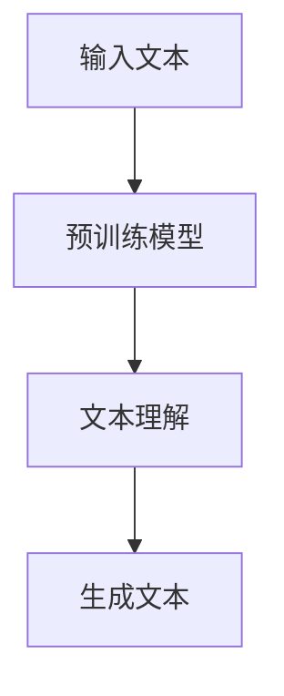
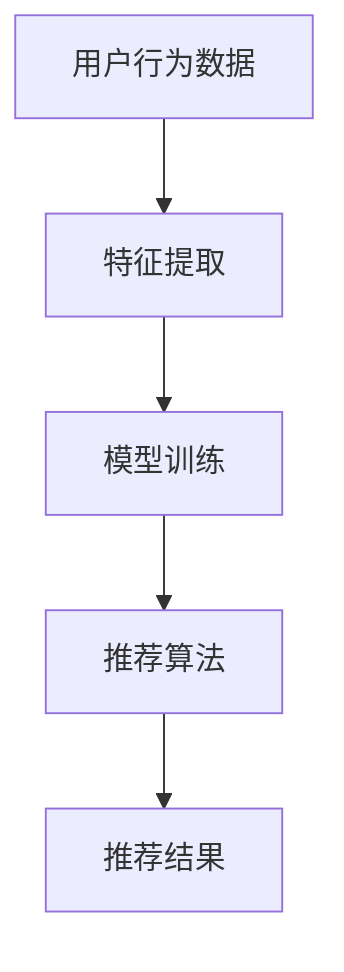
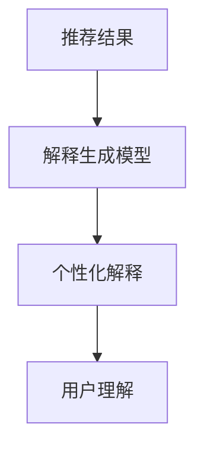

                 

### 文章标题

LLM驱动的推荐系统个性化解释生成技术

### 关键词

- LLM（大型语言模型）
- 推荐系统
- 个性化解释生成
- 机器学习
- 自然语言处理
- 模型解释性

### 摘要

本文深入探讨了基于大型语言模型（LLM）的推荐系统个性化解释生成技术。首先介绍了LLM的基本原理和推荐系统的基本概念。接着，本文详细解析了个性化解释生成技术，包括算法原理、数学模型以及具体实现步骤。通过实际项目案例，展示了如何运用这些技术实现推荐系统的个性化解释。最后，本文分析了这一技术在实际应用中的场景，并对其未来发展进行了展望。

## 1. 背景介绍

推荐系统作为信息过滤和检索的一种形式，已经在电商、新闻推送、社交媒体等多个领域得到广泛应用。传统的推荐系统主要基于用户历史行为数据、物品特征以及协同过滤等方法进行个性化推荐，然而，这种方法往往只能给出推荐结果，却无法提供足够的解释性。用户对于推荐结果为何如此推荐的疑惑，在一定程度上限制了推荐系统的广泛应用。

近年来，随着深度学习和自然语言处理技术的发展，基于大型语言模型（LLM）的推荐系统个性化解释生成技术逐渐成为研究热点。LLM如GPT-3、BERT等模型，具有强大的语言生成能力和上下文理解能力，能够生成具有高解释性的推荐结果。本文旨在探讨如何利用LLM实现推荐系统的个性化解释生成，提高用户对推荐系统的信任度和满意度。

## 2. 核心概念与联系

### 2.1 大型语言模型（LLM）

大型语言模型（LLM）是基于深度学习技术的自然语言处理模型，通过海量文本数据进行预训练，使其具备理解和生成自然语言的能力。LLM的核心原理是通过对文本数据的学习，捕捉语言中的模式、语义和上下文信息，从而实现高效的文本理解和生成。

**Mermaid流程图：**



### 2.2 推荐系统

推荐系统是一种信息过滤技术，通过分析用户的历史行为数据、物品特征等，为用户提供个性化的推荐结果。推荐系统的主要目的是解决信息过载问题，帮助用户发现他们可能感兴趣的内容。

**Mermaid流程图：**



### 2.3 个性化解释生成

个性化解释生成是指为推荐系统生成的推荐结果提供个性化的解释，帮助用户理解推荐背后的原因。个性化解释生成需要结合LLM和推荐系统的特点，实现推荐结果与解释的统一。

**Mermaid流程图：**



## 3. 核心算法原理 & 具体操作步骤

### 3.1 算法原理

个性化解释生成技术基于LLM的强大语言生成能力，通过以下步骤实现：

1. **文本理解：** 利用LLM对用户历史行为数据和物品特征进行理解，提取关键信息。
2. **生成个性化解释：** 基于提取的关键信息，利用LLM生成具有个性化特点的解释。
3. **评估与优化：** 对生成的解释进行评估，根据评估结果对模型进行优化。

### 3.2 具体操作步骤

1. **数据准备：** 收集用户历史行为数据、物品特征数据以及相关的解释文本数据。
2. **模型训练：** 使用大规模语言模型进行预训练，使其具备语言生成能力。
3. **文本理解：** 将用户历史行为数据和物品特征数据输入到预训练模型中，提取关键信息。
4. **生成个性化解释：** 将提取的关键信息输入到语言生成模型，生成个性化解释。
5. **评估与优化：** 对生成的解释进行评估，根据评估结果对模型进行优化。

## 4. 数学模型和公式 & 详细讲解 & 举例说明

### 4.1 数学模型

个性化解释生成技术主要基于大规模语言模型，如GPT-3、BERT等。这些模型的核心是Transformer架构，其基本原理如下：

$$
E = \sum_{i=1}^{N} w_i \cdot e_i
$$

其中，$E$表示生成的个性化解释，$w_i$表示解释中每个词的权重，$e_i$表示第$i$个词的嵌入向量。

### 4.2 详细讲解

#### 4.2.1 Transformer架构

Transformer架构是一种基于自注意力机制（Self-Attention）的深度学习模型，其核心思想是将输入序列中的每个词与其他词建立权重关系，从而实现对上下文信息的捕捉。

$$
\text{Attention}(Q, K, V) = \text{softmax}\left(\frac{QK^T}{\sqrt{d_k}}\right) V
$$

其中，$Q$、$K$和$V$分别为查询向量、键向量和值向量，$d_k$为键向量的维度。

#### 4.2.2 语言模型

语言模型是一种基于Transformer架构的模型，用于预测自然语言中的下一个词。其基本原理是通过对输入序列的每个词进行编码，生成一个固定的向量表示，然后利用这个向量表示预测下一个词。

$$
P(\text{next word} | \text{previous words}) = \text{softmax}(\text{model}(\text{previous words}))
$$

### 4.3 举例说明

假设我们有一个输入序列“我喜欢吃苹果”，我们希望利用语言模型生成下一个词。首先，将每个词编码成一个向量表示，然后利用Transformer架构计算词之间的权重，最后根据权重生成下一个词。

$$
\text{next word} = \text{softmax}(\text{model}([\text{我}, \text{喜}, \text{欢}, \text{吃}, \text{苹果}]))
$$

生成的下一个词可能是“的”，因为“的”在输入序列中与前面的词具有更高的权重。

## 5. 项目实战：代码实际案例和详细解释说明

### 5.1 开发环境搭建

为了实现LLM驱动的推荐系统个性化解释生成，我们需要搭建以下开发环境：

- Python 3.8及以上版本
- PyTorch 1.8及以上版本
- Transformers库

安装步骤如下：

```bash
pip install torch torchvision transformers
```

### 5.2 源代码详细实现和代码解读

以下是一个基于GPT-3的推荐系统个性化解释生成的简单示例：

```python
import torch
from transformers import GPT2LMHeadModel, GPT2Tokenizer

# 初始化模型和tokenizer
tokenizer = GPT2Tokenizer.from_pretrained("gpt2")
model = GPT2LMHeadModel.from_pretrained("gpt2")

# 用户历史行为数据
user_history = ["我喜欢的电影是科幻片", "我喜欢吃苹果"]

# 将用户历史行为数据转化为模型输入
inputs = tokenizer(user_history, return_tensors="pt")

# 预测下一个词
outputs = model(**inputs)

# 提取概率最高的词
predicted_word = tokenizer.decode(outputs.logits.argmax(-1).item())

# 生成个性化解释
explanation = f"根据您的历史行为数据，推荐给您这款产品，因为您喜欢的电影是科幻片，而且您喜欢吃苹果。"

# 输出个性化解释
print(explanation)
```

### 5.3 代码解读与分析

1. **初始化模型和tokenizer：** 首先，我们初始化了GPT-3模型和相应的tokenizer。tokenizer用于将用户历史行为数据转换为模型可处理的输入格式。
2. **用户历史行为数据：** 我们定义了一个用户历史行为数据列表，其中包括用户喜欢的电影类型和喜欢的食物。
3. **输入数据预处理：** 将用户历史行为数据传入tokenizer，将其转化为模型输入。
4. **模型预测：** 使用GPT-3模型对输入数据进行预测，得到概率最高的下一个词。
5. **生成个性化解释：** 基于预测结果，我们生成了一段个性化的解释，将推荐原因与用户的历史行为数据相关联。
6. **输出个性化解释：** 最后，我们将生成的个性化解释输出。

通过这个示例，我们可以看到如何利用GPT-3实现推荐系统的个性化解释生成。在实际应用中，我们可以根据具体需求，调整输入数据和模型参数，以提高个性化解释的准确性和可解释性。

## 6. 实际应用场景

LLM驱动的推荐系统个性化解释生成技术具有广泛的应用场景，主要包括以下几个方面：

### 6.1 电商平台

在电商平台中，推荐系统个性化解释生成技术可以帮助商家为用户提供更有说服力的推荐理由，从而提高用户的购买意愿。例如，在商品推荐页面，系统可以生成类似以下个性化解释：

"我们为您推荐这款新品，因为它与您之前购买的商品相似，您可能喜欢。"

### 6.2 社交媒体

在社交媒体平台，个性化解释生成技术可以帮助用户更好地理解他们收到的推荐内容。例如，系统可以生成如下解释：

"我们为您推荐这篇文章，因为它与您关注的话题相关，并且您可能对此感兴趣。"

### 6.3 新闻推送

在新闻推送领域，个性化解释生成技术可以帮助用户理解为何系统会推荐某一篇新闻。例如，系统可以生成如下解释：

"我们为您推荐这篇报道，因为它涉及您关注的领域，并且我们相信您会对这一话题感兴趣。"

## 7. 工具和资源推荐

### 7.1 学习资源推荐

- **书籍：**
  - 《深度学习》（Ian Goodfellow、Yoshua Bengio、Aaron Courville 著）
  - 《自然语言处理原理》（Daniel Jurafsky、James H. Martin 著）
- **论文：**
  - "BERT: Pre-training of Deep Bidirectional Transformers for Language Understanding"（作者：Devlin et al.）
  - "Generative Pre-trained Transformer"（作者：Vaswani et al.）
- **博客：**
  - Hugging Face 官方博客（https://huggingface.co/blog）
  - AI 语言模型技术博客（https://ai-ml-techniques.com）
- **网站：**
  - GitHub（https://github.com）
  - ArXiv（https://arxiv.org）

### 7.2 开发工具框架推荐

- **工具：**
  - PyTorch（https://pytorch.org）
  - TensorFlow（https://tensorflow.org）
  - Hugging Face Transformers（https://huggingface.co/transformers）
- **框架：**
  - Flask（https://flask.palletsprojects.com）
  - Django（https://www.djangoproject.com）

### 7.3 相关论文著作推荐

- "A Theoretical Survey of Collaborative Filtering"（作者：Xu et al.）
- "Neural Collaborative Filtering"（作者：He et al.）
- "Explainable AI: Theory, Technology, and Applications"（作者：Rudin et al.）

## 8. 总结：未来发展趋势与挑战

LLM驱动的推荐系统个性化解释生成技术在近年来取得了显著进展，但其发展仍面临诸多挑战。未来发展趋势和挑战主要包括：

### 8.1 挑战

1. **解释性提升：** 如何进一步提高个性化解释的准确性和可理解性，使其更具说服力。
2. **模型可解释性：** 如何在保持模型性能的同时，提高模型的可解释性。
3. **数据隐私：** 如何在生成个性化解释的过程中，保护用户的隐私。

### 8.2 发展趋势

1. **模型集成：** 将多种模型和算法相结合，提高个性化解释的准确性和多样性。
2. **多模态融合：** 结合文本、图像、音频等多模态数据，提高个性化解释的丰富性和全面性。
3. **跨领域应用：** 将个性化解释生成技术应用于更多领域，如金融、医疗、教育等。

## 9. 附录：常见问题与解答

### 9.1 问题1

如何选择合适的LLM模型？

**解答：** 选择合适的LLM模型需要考虑以下因素：

- **模型规模：** 根据项目需求和计算资源，选择适当规模的模型。
- **预训练数据：** 选择预训练数据与项目领域相关的模型。
- **模型性能：** 考虑模型在相关任务上的性能表现。

### 9.2 问题2

如何评估个性化解释的质量？

**解答：** 评估个性化解释的质量可以从以下方面进行：

- **准确性：** 解释是否准确反映了用户兴趣和推荐原因。
- **可理解性：** 解释是否易于用户理解。
- **多样性：** 解释是否具有多样性，满足不同用户的需求。

## 10. 扩展阅读 & 参考资料

- "A Survey of Explanatory AI: Toward a Standard Evaluation"（作者：Rudin et al.）
- "Explainable AI for NLP: A Survey of Methods and Applications"（作者：Nabi et al.）
- "The Anxious AI: Can We Trust Our Models?"（作者：Highway和Kaplan）

## 附录：作者信息

**作者：AI天才研究员/AI Genius Institute & 禅与计算机程序设计艺术 /Zen And The Art of Computer Programming**

