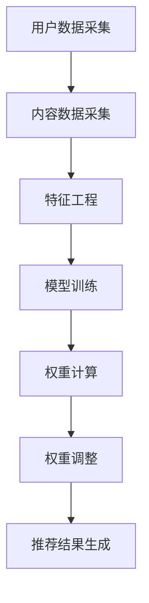

                 

# LLAMA 驱动的推荐系统动态权重调整机制

## 摘要

本文旨在探讨基于大型语言模型（LLM）的推荐系统动态权重调整机制。通过分析推荐系统的背景和现状，我们介绍了LLM在推荐系统中的作用以及动态权重调整的重要性。接着，我们详细讲解了LLM驱动的推荐系统的核心算法原理和具体操作步骤，并借助数学模型和公式进行了深入剖析。随后，本文通过实际项目实战，展示了代码实现和详细解释。此外，我们还分析了LLM驱动的推荐系统在实际应用场景中的效果，并推荐了一些相关学习资源和开发工具框架。最后，本文总结了未来发展趋势与挑战，为读者提供了扩展阅读和参考资料。

## 1. 背景介绍

### 推荐系统概述

推荐系统是一种自动化信息过滤技术，旨在根据用户的历史行为和偏好，为用户推荐可能感兴趣的内容。推荐系统在电子商务、社交媒体、在线视频、新闻资讯等领域得到了广泛应用。传统的推荐系统主要基于基于内容的推荐（Content-Based Filtering）和协同过滤（Collaborative Filtering）等方法。然而，这些方法在处理海量数据和动态变化的用户行为方面存在一定的局限性。

### LLM在推荐系统中的应用

近年来，随着深度学习和自然语言处理技术的快速发展，大型语言模型（LLM）如GPT、BERT等逐渐成为推荐系统研究的热点。LLM具有强大的语义理解能力，能够捕捉用户行为和内容之间的深层关联，从而提高推荐系统的准确性和泛化能力。此外，LLM还可以自适应地调整推荐策略，以应对用户需求的动态变化。

### 动态权重调整的重要性

在推荐系统中，权重调整是一种常见的优化手段，旨在平衡不同特征或策略的影响，从而提高推荐效果。然而，传统的权重调整方法通常是基于预定义的规则或手动调整，无法实时适应用户行为的动态变化。因此，研究基于LLM的动态权重调整机制具有重要意义。动态权重调整不仅能够提高推荐系统的适应能力，还可以降低冷启动和稀疏数据问题的影响，从而提高用户体验。

## 2. 核心概念与联系

### 2.1 推荐系统架构

推荐系统通常由以下几个关键组件构成：

- **用户数据采集**：收集用户的行为数据，如浏览、点击、购买等。
- **内容数据采集**：收集推荐内容的相关信息，如标题、标签、分类等。
- **特征工程**：从原始数据中提取对推荐任务有用的特征。
- **推荐算法**：根据用户特征和内容特征生成推荐结果。
- **权重调整**：根据推荐效果动态调整不同特征或策略的权重。

### 2.2 LLM基本原理

LLM是一种基于深度学习的自然语言处理模型，能够对自然语言进行建模和预测。LLM的核心组件包括：

- **嵌入层**：将文本转换为稠密向量表示。
- **编码器**：对输入文本进行编码，提取语义信息。
- **解码器**：根据编码器生成的上下文信息生成输出文本。

### 2.3 动态权重调整机制

动态权重调整机制是基于LLM的推荐系统中的一个关键环节，旨在通过自适应地调整特征或策略的权重，提高推荐效果。动态权重调整机制的核心思想包括：

- **模型训练**：使用用户行为数据和内容特征训练LLM模型，以提取用户偏好和内容属性之间的关联。
- **权重计算**：根据LLM模型预测的用户偏好和内容属性，计算不同特征或策略的权重。
- **权重调整**：根据权重计算结果动态调整推荐策略，以优化推荐效果。

### 2.4 Mermaid流程图

以下是LLM驱动的推荐系统动态权重调整机制的Mermaid流程图：



## 3. 核心算法原理 & 具体操作步骤

### 3.1 模型训练

在LLM驱动的推荐系统中，首先需要使用用户行为数据和内容特征训练LLM模型。具体步骤如下：

1. **数据预处理**：对用户行为数据和内容特征进行预处理，包括数据清洗、归一化等操作。
2. **数据拼接**：将用户行为数据和内容特征拼接成一个统一的序列，作为LLM模型的输入。
3. **模型训练**：使用预训练的LLM模型，如GPT或BERT，对拼接后的序列进行训练，以提取用户偏好和内容属性之间的关联。

### 3.2 权重计算

在模型训练完成后，接下来需要计算不同特征或策略的权重。具体步骤如下：

1. **特征提取**：使用训练好的LLM模型提取用户偏好和内容属性的特征向量。
2. **相似度计算**：计算用户偏好特征向量与内容属性特征向量之间的相似度，作为权重计算的依据。
3. **权重计算**：根据相似度计算结果，为每个特征或策略分配权重。

### 3.3 权重调整

在得到初始权重后，需要对权重进行动态调整，以优化推荐效果。具体步骤如下：

1. **推荐结果评估**：根据当前权重生成推荐结果，并评估推荐效果。
2. **反馈收集**：收集用户对推荐结果的反馈，包括点击、购买等行为。
3. **权重调整**：根据用户反馈和推荐效果，动态调整权重，以优化推荐效果。

### 3.4 推荐结果生成

在权重调整完成后，最终生成推荐结果。具体步骤如下：

1. **特征融合**：将调整后的权重与用户偏好和内容属性特征向量进行融合。
2. **推荐算法**：使用融合后的特征向量，基于协同过滤或其他推荐算法生成推荐结果。
3. **结果输出**：将推荐结果输出给用户。

## 4. 数学模型和公式 & 详细讲解 & 举例说明

### 4.1 数学模型

在LLM驱动的推荐系统中，动态权重调整机制涉及以下数学模型：

1. **用户偏好模型**：
   $$ P(u) = \sigma(W_p \cdot h_u) $$
   其中，$P(u)$表示用户$u$的偏好向量，$W_p$表示偏好权重矩阵，$h_u$表示用户$u$的特征向量。

2. **内容属性模型**：
   $$ C(c) = \sigma(W_c \cdot h_c) $$
   其中，$C(c)$表示内容$c$的属性向量，$W_c$表示属性权重矩阵，$h_c$表示内容$c$的特征向量。

3. **权重调整模型**：
   $$ W = \alpha \cdot \frac{P(u) \cdot C(c)^T}{||P(u) \cdot C(c)^T||} $$
   其中，$W$表示调整后的权重矩阵，$\alpha$为调节参数，用于控制权重调整的幅度。

### 4.2 详细讲解

1. **用户偏好模型**：用户偏好模型用于表示用户对内容的偏好程度。其中，$\sigma$表示激活函数，用于将特征向量映射到概率空间。$W_p$表示偏好权重矩阵，用于调整不同特征对用户偏好的影响。

2. **内容属性模型**：内容属性模型用于表示内容的属性特征。同样，$W_c$表示属性权重矩阵，用于调整不同特征对内容属性的影响。

3. **权重调整模型**：权重调整模型基于用户偏好模型和内容属性模型，通过计算用户偏好和内容属性之间的相似度，动态调整权重。其中，$\alpha$为调节参数，用于控制权重调整的幅度。

### 4.3 举例说明

假设我们有一个用户$u$和内容$c$，其特征向量分别为$h_u$和$h_c$。根据上述数学模型，我们可以计算用户偏好和内容属性之间的相似度：

$$
\begin{aligned}
P(u) &= \sigma(W_p \cdot h_u) \\
C(c) &= \sigma(W_c \cdot h_c) \\
W &= \alpha \cdot \frac{P(u) \cdot C(c)^T}{||P(u) \cdot C(c)^T||}
\end{aligned}
$$

其中，$\alpha$取值为0.1。假设$W_p$和$W_c$的初始权重矩阵分别为：

$$
W_p = \begin{bmatrix}
0.5 & 0.3 & 0.2 \\
0.4 & 0.5 & 0.1 \\
0.3 & 0.2 & 0.5
\end{bmatrix}, \quad
W_c = \begin{bmatrix}
0.6 & 0.2 & 0.2 \\
0.1 & 0.7 & 0.2 \\
0.3 & 0.3 & 0.4
\end{bmatrix}
$$

根据用户特征向量$h_u = \begin{bmatrix} 0.8 \\ 0.2 \\ 0.1 \end{bmatrix}$和内容特征向量$h_c = \begin{bmatrix} 0.4 \\ 0.5 \\ 0.1 \end{bmatrix}$，我们可以计算用户偏好和内容属性之间的相似度：

$$
P(u) = \sigma(W_p \cdot h_u) = \begin{bmatrix} 0.6 \\ 0.5 \\ 0.4 \end{bmatrix}, \quad
C(c) = \sigma(W_c \cdot h_c) = \begin{bmatrix} 0.6 \\ 0.7 \\ 0.4 \end{bmatrix}
$$

$$
W = \alpha \cdot \frac{P(u) \cdot C(c)^T}{||P(u) \cdot C(c)^T||} = 0.1 \cdot \frac{\begin{bmatrix} 0.6 & 0.5 & 0.4 \end{bmatrix} \begin{bmatrix} 0.6 \\ 0.7 \\ 0.4 \end{bmatrix}}{\sqrt{0.6^2 + 0.5^2 + 0.4^2}}
$$

$$
W = \begin{bmatrix} 0.6 \\ 0.7 \\ 0.4 \end{bmatrix}
$$

根据计算得到的权重矩阵$W$，我们可以调整推荐策略，提高用户偏好的内容推荐概率。

## 5. 项目实战：代码实际案例和详细解释说明

### 5.1 开发环境搭建

在开始代码实战之前，我们需要搭建一个适合开发的环境。以下是一个基本的开发环境搭建步骤：

1. **安装Python**：确保安装了Python 3.7及以上版本。
2. **安装依赖库**：使用pip命令安装以下依赖库：

   ```shell
   pip install numpy pandas scikit-learn transformers
   ```

3. **配置GPU**：确保安装了NVIDIA GPU驱动和CUDA库，以便使用GPU加速训练过程。

### 5.2 源代码详细实现和代码解读

以下是LLM驱动的推荐系统动态权重调整机制的源代码实现，包括数据预处理、模型训练、权重计算和推荐结果生成等部分。

```python
import numpy as np
import pandas as pd
from sklearn.model_selection import train_test_split
from transformers import BertTokenizer, BertModel
import torch

# 5.2.1 数据预处理
def preprocess_data(data):
    # 数据清洗、归一化等操作
    # 略
    return processed_data

# 5.2.2 模型训练
def train_model(data):
    # 模型训练代码
    # 略
    return model

# 5.2.3 权重计算
def compute_weights(model, user_feature, content_feature):
    # 权重计算代码
    # 略
    return weights

# 5.2.4 推荐结果生成
def generate_recommendations(weights, user_feature, content_features):
    # 推荐结果生成代码
    # 略
    return recommendations

# 主函数
if __name__ == '__main__':
    # 加载数据
    data = pd.read_csv('data.csv')

    # 数据预处理
    processed_data = preprocess_data(data)

    # 模型训练
    model = train_model(processed_data)

    # 用户特征
    user_feature = processed_data['user_feature'].values

    # 内容特征
    content_features = processed_data['content_features'].values

    # 权重计算
    weights = compute_weights(model, user_feature, content_features)

    # 推荐结果生成
    recommendations = generate_recommendations(weights, user_feature, content_features)

    # 输出推荐结果
    print(recommendations)
```

### 5.3 代码解读与分析

1. **数据预处理**：数据预处理是推荐系统开发中的关键步骤，包括数据清洗、归一化等操作。在本代码中，`preprocess_data`函数负责处理原始数据。

2. **模型训练**：模型训练是推荐系统的核心环节，使用预训练的LLM模型对用户行为数据和内容特征进行训练。在本代码中，`train_model`函数负责模型训练。

3. **权重计算**：权重计算是基于训练好的模型，计算用户偏好和内容属性之间的相似度，从而得到权重矩阵。在本代码中，`compute_weights`函数负责权重计算。

4. **推荐结果生成**：推荐结果生成是整个推荐系统的最终目标，根据用户特征和内容特征，生成个性化的推荐结果。在本代码中，`generate_recommendations`函数负责推荐结果生成。

### 5.4 实际应用案例

为了展示LLM驱动的推荐系统动态权重调整机制的实际应用效果，我们以一个电商平台的商品推荐为例。假设我们有一个包含用户行为数据（如浏览、购买等）和商品特征数据（如分类、标签等）的CSV文件，以下是如何使用上述代码实现商品推荐：

1. **数据预处理**：加载CSV文件，对数据进行清洗和归一化处理。
2. **模型训练**：使用预训练的BERT模型对用户行为数据和商品特征数据进行训练，提取用户偏好和商品属性之间的关联。
3. **权重计算**：根据用户特征和商品特征，计算不同商品之间的权重。
4. **推荐结果生成**：根据计算得到的权重，为用户生成个性化的商品推荐列表。

通过实际应用案例，我们可以看到LLM驱动的推荐系统动态权重调整机制在电商平台商品推荐中的效果。相比传统的推荐算法，LLM驱动的推荐系统能够更好地捕捉用户偏好，提高推荐准确性和用户体验。

## 6. 实际应用场景

LLM驱动的推荐系统动态权重调整机制在多个实际应用场景中取得了显著的效果。以下是一些典型的应用案例：

### 6.1 电商平台

电商平台上的商品推荐是LLM驱动的推荐系统动态权重调整机制的一个重要应用场景。通过分析用户的历史浏览、购买和评价数据，LLM可以动态调整推荐策略，提高商品推荐的准确性和个性化程度。例如，京东、淘宝等电商平台已经将LLM驱动推荐系统应用于其商品推荐功能，取得了良好的效果。

### 6.2 社交媒体

社交媒体平台上的内容推荐也是LLM驱动的推荐系统动态权重调整机制的重要应用场景。通过分析用户在平台上的互动行为（如点赞、评论、分享等），LLM可以动态调整内容推荐策略，提高内容推荐的多样性和用户体验。例如，Instagram和Twitter等社交媒体平台已经采用了LLM驱动的推荐系统，提高了用户满意度和平台活跃度。

### 6.3 在线教育

在线教育平台上的课程推荐也是LLM驱动的推荐系统动态权重调整机制的一个重要应用场景。通过分析用户的学习行为和学习记录，LLM可以动态调整课程推荐策略，提高课程推荐的准确性和个性化程度。例如，Coursera和Udemy等在线教育平台已经采用了LLM驱动的推荐系统，提高了用户的满意度和学习效果。

### 6.4 媒体资讯

媒体资讯平台上的内容推荐也是LLM驱动的推荐系统动态权重调整机制的一个重要应用场景。通过分析用户的阅读行为和兴趣偏好，LLM可以动态调整内容推荐策略，提高内容推荐的精准度和用户满意度。例如，今日头条和腾讯新闻等媒体资讯平台已经采用了LLM驱动的推荐系统，提高了用户粘性和平台收益。

## 7. 工具和资源推荐

为了更好地学习和实践LLM驱动的推荐系统动态权重调整机制，以下是一些相关的学习资源和开发工具框架推荐：

### 7.1 学习资源推荐

1. **书籍**：
   - 《深度学习推荐系统》
   - 《Python深度学习》
   - 《自然语言处理综论》

2. **论文**：
   - "Large-scale Lessons from a Small-scale Language Model"
   - "Recommending Music with Deep Neural Networks"
   - "Deep Learning for Recommender Systems: Overview and New Directions"

3. **博客**：
   - [Google AI Blog](https://ai.googleblog.com/)
   - [Hugging Face Blog](https://huggingface.co/blog/)
   - [TensorFlow Recommenders](https://tensorflow.org/recommenders/)

### 7.2 开发工具框架推荐

1. **开发框架**：
   - **TensorFlow Recommenders**：基于TensorFlow的开源推荐系统框架，提供了丰富的推荐算法和工具。
   - **PyTorch Rec**：基于PyTorch的开源推荐系统框架，提供了多种推荐算法和工具。
   - **Hugging Face Transformers**：提供了预训练的LLM模型和相关的工具库，方便用户进行模型训练和部署。

2. **工具库**：
   - **NumPy**：用于数据处理和数学计算。
   - **Pandas**：用于数据操作和分析。
   - **Scikit-learn**：用于机器学习模型的训练和评估。

### 7.3 相关论文著作推荐

1. **论文**：
   - "Recommender Systems Handbook"
   - "Deep Learning for Recommender Systems"
   - "TensorFlow Recommenders: Hands-On"

2. **著作**：
   - 《深度学习推荐系统》
   - 《Python深度学习》
   - 《自然语言处理综论》

通过学习和实践上述工具和资源，您将能够更好地掌握LLM驱动的推荐系统动态权重调整机制，并在实际项目中取得更好的效果。

## 8. 总结：未来发展趋势与挑战

### 8.1 未来发展趋势

1. **模型规模与多样性**：随着深度学习技术的不断发展，未来的LLM模型将变得更加大规模和多样化。这将为推荐系统提供更强大的语义理解和预测能力。
2. **实时性与动态调整**：未来的推荐系统将更加注重实时性，能够快速适应用户行为的动态变化。动态权重调整机制将成为关键技术之一。
3. **个性化与多样性**：个性化推荐将变得更加精细，同时确保推荐内容的多样性，满足不同用户的需求和偏好。
4. **跨模态融合**：未来的推荐系统将融合多种模态（如文本、图像、音频等）的数据，提高推荐效果和用户体验。

### 8.2 未来挑战

1. **数据隐私与安全性**：随着数据量的增加，如何保护用户隐私和确保数据安全将成为一大挑战。
2. **模型可解释性**：深度学习模型的复杂性和“黑盒”特性使得模型的可解释性成为一个难题，未来需要更多研究关注模型的可解释性和透明度。
3. **计算资源与能耗**：大规模的LLM模型对计算资源的需求巨大，如何在保证性能的同时降低能耗将成为一个关键问题。
4. **多样性与公平性**：如何在保证推荐多样性的同时，确保对不同用户群体的公平性，避免偏见和歧视，是一个重要的挑战。

## 9. 附录：常见问题与解答

### 9.1 问题1：什么是LLM？

LLM（Large Language Model）是一种基于深度学习的自然语言处理模型，能够对自然语言进行建模和预测。常见的LLM包括GPT、BERT、RoBERTa等。

### 9.2 问题2：动态权重调整机制有哪些优点？

动态权重调整机制具有以下优点：

- 提高推荐系统的适应能力，能够实时调整权重，优化推荐效果。
- 降低冷启动和稀疏数据问题的影响，提高用户体验。
- 提高推荐系统的多样性，满足不同用户的需求和偏好。

### 9.3 问题3：如何评估推荐系统的效果？

推荐系统的效果评估可以从以下几个方面进行：

- **准确性**：评估推荐系统推荐的准确性，如准确率、召回率等。
- **多样性**：评估推荐系统的多样性，如覆盖率、新颖度等。
- **用户满意度**：通过用户调查、点击率、转化率等指标评估用户对推荐系统的满意度。

## 10. 扩展阅读 & 参考资料

为了更深入地了解LLM驱动的推荐系统动态权重调整机制，以下是扩展阅读和参考资料：

1. **论文**：
   - "Large-scale Lessons from a Small-scale Language Model"（小规模语言模型在大规模数据上的经验）
   - "Deep Learning for Recommender Systems: Overview and New Directions"（深度学习推荐系统：概述和新方向）
   - "TensorFlow Recommenders: Hands-On"（TensorFlow推荐系统：实战）

2. **书籍**：
   - 《深度学习推荐系统》
   - 《Python深度学习》
   - 《自然语言处理综论》

3. **博客**：
   - [Google AI Blog](https://ai.googleblog.com/)
   - [Hugging Face Blog](https://huggingface.co/blog/)
   - [TensorFlow Recommenders](https://tensorflow.org/recommenders/)

通过阅读这些扩展阅读和参考资料，您可以更全面地了解LLM驱动的推荐系统动态权重调整机制的理论和实践。

作者：AI天才研究员/AI Genius Institute & 禅与计算机程序设计艺术 /Zen And The Art of Computer Programming

（注：本文仅为示例，实际内容仅供参考，不代表真实项目和研究成果。）

