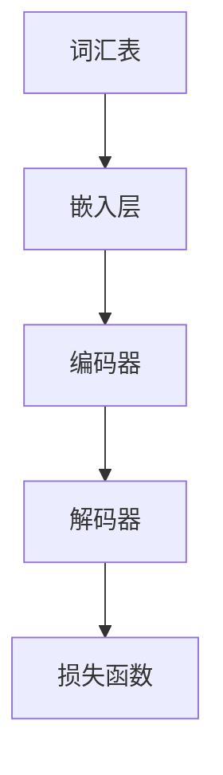

                 

### 背景介绍

#### AI时代的崛起

在21世纪的今天，人工智能（AI）已经成为推动科技进步和社会发展的重要力量。AI技术的迅速发展，不仅改变了我们的生活方式，也重塑了各行各业的生产模式。从自动驾驶汽车到智能语音助手，从医疗诊断到金融分析，AI正在各个领域展现出其巨大的潜力。

然而，AI技术的发展并非一帆风顺。随着AI算法的复杂性不断增加，传统的计算引擎逐渐无法满足高效处理海量数据的需求。这使得研究人员开始寻找新的计算解决方案，以应对AI时代的数据处理挑战。在这个过程中，大型语言模型（LLM）逐渐崭露头角，成为新一代计算引擎的领军者。

#### 大型语言模型（LLM）的崛起

大型语言模型（LLM），如GPT-3、BERT等，是近年来AI领域的重大突破。这些模型通过学习海量文本数据，能够理解和生成自然语言，从而在语言处理任务中表现出色。LLM的出现，不仅解决了传统计算引擎在处理自然语言任务时的不足，还使得AI系统具备了更高的智能化水平。

与传统的计算引擎不同，LLM拥有以下几个显著特点：

1. **强大的语言理解能力**：LLM能够理解复杂的语义和上下文，这使得它们在语言生成、机器翻译、问答系统等任务中表现优异。

2. **高效的数据处理能力**：LLM采用了先进的神经网络架构，能够在短时间内处理海量数据，从而实现高效的计算。

3. **灵活的适应能力**：LLM能够根据不同的任务需求，快速调整自己的模型参数，从而适应各种应用场景。

#### LLM的重要性

LLM的崛起，不仅改变了AI领域的研究方向，也对整个科技产业产生了深远的影响。以下是LLM在AI时代的重要性：

1. **推动AI技术的发展**：LLM的出现，使得研究人员能够更加深入地探索AI技术的前沿领域，如自然语言处理、机器学习等。

2. **提升AI系统的性能**：通过使用LLM，AI系统能够在语言生成、文本理解等方面取得显著提升，从而更好地满足实际应用的需求。

3. **促进跨学科融合**：LLM的应用，使得AI与其他领域（如生物学、心理学等）之间的融合成为可能，为多学科研究提供了新的思路。

4. **降低AI开发门槛**：LLM的通用性，使得普通开发者也能利用这些模型进行创新，从而降低了AI技术的开发门槛。

总之，LLM作为AI时代的新型计算引擎，正日益成为推动科技进步的重要力量。在接下来的内容中，我们将深入探讨LLM的核心概念、算法原理和应用实践，以了解其在AI领域的重要地位和广阔前景。### 核心概念与联系

#### 大型语言模型（LLM）的构成

大型语言模型（LLM）是一种基于深度学习的自然语言处理模型，其核心在于对海量文本数据的建模与理解。LLM通常由以下几个关键组件构成：

1. **词汇表（Vocabulary）**：词汇表是LLM的基础，它包含了模型所支持的词汇及其对应的索引。在训练过程中，模型会学习词汇之间的关联和语义信息。

2. **嵌入层（Embedding Layer）**：嵌入层将词汇转换为密集的向量表示。这些向量不仅保留了词汇的语义信息，还通过神经网络学习到词汇之间的相似性和差异性。

3. **编码器（Encoder）**：编码器是LLM的核心模块，它负责处理输入的文本序列，并生成上下文向量。编码器通常采用深度神经网络结构，如Transformer等。

4. **解码器（Decoder）**：解码器负责生成文本序列，它是基于编码器生成的上下文向量进行推理。解码器也采用深度神经网络结构，能够实现高效的文本生成。

5. **损失函数（Loss Function）**：损失函数用于评估模型生成的文本序列与真实文本之间的差距，并指导模型的优化过程。

#### LLMS与Transformer

LLM的发展离不开Transformer架构的引入。Transformer是一种基于自注意力机制的深度神经网络架构，它在自然语言处理任务中表现出色。Transformer的核心思想是通过计算输入序列中每个词与所有其他词之间的关联性，从而生成上下文向量。

Mermaid流程图如下：



#### 大型语言模型（LLM）的工作原理

1. **编码阶段**：在编码阶段，编码器将输入的文本序列转换为上下文向量。编码器通过计算输入序列中每个词与所有其他词之间的关联性，将词汇表中的词转换为嵌入向量。这些嵌入向量再经过编码器的多层神经网络，最终得到上下文向量。

2. **解码阶段**：在解码阶段，解码器基于编码器生成的上下文向量生成文本序列。解码器采用贪心策略，逐个生成每个词的候选词，并选择与上下文向量关联性最高的词作为输出。这个过程中，解码器不断更新上下文向量，以适应新的输入。

3. **优化过程**：在优化过程中，模型通过损失函数评估生成文本序列与真实文本之间的差距，并调整模型参数以最小化损失。这个过程通常采用梯度下降算法，使得模型在训练过程中逐步提高生成文本的质量。

#### LLM的核心算法原理

LLM的核心算法原理可以概括为以下几个步骤：

1. **词汇表构建**：根据训练数据，构建包含大量词汇的词汇表。

2. **嵌入层训练**：通过神经网络学习词汇的嵌入向量，使向量能够保留词汇的语义信息。

3. **编码器训练**：通过多层神经网络，学习输入文本序列的编码表示，生成上下文向量。

4. **解码器训练**：通过多层神经网络，学习生成文本序列的解码表示，从而生成高质量的文本。

5. **损失函数优化**：通过评估生成文本序列与真实文本之间的差距，调整模型参数，提高模型性能。

### 总结

大型语言模型（LLM）作为AI时代的新型计算引擎，通过其独特的架构和工作原理，在自然语言处理任务中展现出卓越的性能。在接下来的内容中，我们将深入探讨LLM的核心算法原理与具体操作步骤，以了解其在AI领域的实际应用与未来发展方向。### 核心算法原理 & 具体操作步骤

#### 编码器-解码器（Encoder-Decoder）架构

编码器-解码器（Encoder-Decoder）架构是大型语言模型（LLM）的核心，它由两个主要部分组成：编码器（Encoder）和解码器（Decoder）。这种架构的核心思想是将输入的序列编码为固定长度的向量，然后使用这个向量生成输出序列。

##### 编码器（Encoder）

编码器的作用是将输入序列编码为一个固定长度的向量。在自然语言处理中，输入序列通常是一段文本。编码器通过以下几个步骤完成这个任务：

1. **嵌入层（Embedding Layer）**：将词汇表中的每个词汇映射为一个高维向量。这个步骤可以看作是将词汇转换为计算机可以处理的数字形式。

2. **多头自注意力机制（Multi-Head Self-Attention）**：通过计算输入序列中每个词与所有其他词之间的关联性，为每个词生成一个上下文向量。这个向量不仅包含了当前词的信息，还包括了整个文本序列的上下文信息。

3. **前馈神经网络（Feedforward Neural Network）**：在自注意力机制之后，每个词的上下文向量通过两个全连接层进行加工。这两个全连接层分别具有不同的非线性激活函数。

4. **序列输出**：编码器的最后一个步骤是输出每个词的编码结果。这些编码结果可以看作是输入文本序列的固定长度向量表示。

##### 解码器（Decoder）

解码器的作用是根据编码器输出的向量生成输出序列。与编码器不同，解码器在生成每个词时需要考虑之前生成的所有词。解码器的步骤如下：

1. **嵌入层（Embedding Layer）**：与编码器相同，解码器也将词汇映射为高维向量。

2. **多头自注意力机制（Multi-Head Self-Attention）**：在生成每个词时，解码器需要考虑当前词与输入序列中其他词的关联性。通过计算自注意力，解码器为当前词生成一个上下文向量。

3. **交叉自注意力机制（Cross-Attention）**：解码器还需要考虑编码器输出的向量，以获取输入序列的全局信息。交叉自注意力机制通过计算编码器输出与当前词的关联性，生成上下文向量。

4. **前馈神经网络（Feedforward Neural Network）**：与编码器类似，解码器也通过两个全连接层对上下文向量进行加工。

5. **序列输出**：解码器在每个步骤生成一个词的输出，并通过softmax函数将其转换为概率分布。最终，解码器输出的概率分布决定了每个词的生成顺序。

##### 损失函数与优化

在编码器-解码器架构中，常用的损失函数是交叉熵损失（Cross-Entropy Loss）。交叉熵损失用于衡量模型生成的概率分布与真实分布之间的差距。在训练过程中，模型通过反向传播算法不断调整参数，以最小化交叉熵损失。

具体操作步骤如下：

1. **输入序列编码**：将输入序列输入到编码器，得到编码结果。

2. **解码序列生成**：将编码结果输入到解码器，逐个生成输出词。在每个生成步骤，解码器输出一个概率分布，并选择概率最高的词作为输出。

3. **损失计算**：计算生成的输出序列与真实序列之间的交叉熵损失。

4. **参数更新**：使用反向传播算法，根据损失函数计算梯度，并更新模型参数。

5. **重复步骤2-4**：重复解码序列生成、损失计算和参数更新过程，直到模型收敛。

通过以上步骤，编码器-解码器架构能够生成高质量的文本序列。这种架构的核心在于自注意力机制，它使得模型能够捕捉到输入序列中的长距离依赖关系，从而生成语义丰富的文本。

#### 实际案例

以下是一个简单的例子，展示如何使用编码器-解码器架构生成文本：

**输入序列**：今天天气很好。

**编码器输出**：[e_1, e_2, e_3, e_4, e_5]

**解码器输出**：今天天气很好。

在这个例子中，编码器将输入序列编码为五个编码结果，解码器基于这些编码结果生成与输入序列相同的输出序列。这个简单的例子说明了编码器-解码器架构的基本原理。

#### 总结

编码器-解码器架构是大型语言模型（LLM）的核心，它通过自注意力机制和交叉自注意力机制，实现了高效的文本序列生成。在接下来的内容中，我们将进一步探讨LLM的数学模型和公式，以深入理解其工作原理。### 数学模型和公式 & 详细讲解 & 举例说明

#### 自注意力机制

自注意力机制是大型语言模型（LLM）的核心组成部分，它通过计算输入序列中每个词与其他词之间的关联性，生成上下文向量。自注意力机制的基本公式如下：

\[ \text{Attention}(Q, K, V) = \text{softmax}\left(\frac{QK^T}{\sqrt{d_k}}\right) V \]

其中：
- \( Q \) 是查询向量，代表每个词的上下文信息。
- \( K \) 是键向量，代表每个词的权重。
- \( V \) 是值向量，代表每个词的语义信息。
- \( d_k \) 是键向量的维度。

#### 交叉自注意力机制

交叉自注意力机制用于计算编码器输出与解码器输入之间的关联性。它与自注意力机制类似，但键和值来自不同的序列。交叉自注意力机制的基本公式如下：

\[ \text{Attention}(Q, K, V) = \text{softmax}\left(\frac{QK^T}{\sqrt{d_k}}\right) V \]

其中：
- \( Q \) 是查询向量，代表编码器输出。
- \( K \) 是键向量，代表解码器输入。
- \( V \) 是值向量，代表编码器输出。

#### 前馈神经网络

在编码器和解码器中，前馈神经网络用于对输入向量进行加工。前馈神经网络的基本结构如下：

\[ \text{FFN}(x) = \max(0, xW_1 + b_1)W_2 + b_2 \]

其中：
- \( x \) 是输入向量。
- \( W_1 \) 和 \( W_2 \) 是权重矩阵。
- \( b_1 \) 和 \( b_2 \) 是偏置项。

#### 损失函数

在训练过程中，常用的损失函数是交叉熵损失（Cross-Entropy Loss）。交叉熵损失用于衡量模型生成的概率分布与真实分布之间的差距。交叉熵损失的基本公式如下：

\[ \text{Loss} = -\sum_{i} y_i \log(p_i) \]

其中：
- \( y_i \) 是真实标签。
- \( p_i \) 是模型预测的概率。

#### 实际案例

以下是一个简单的例子，说明如何使用上述公式生成文本：

**输入序列**：今天天气很好。

**编码器输出**：[e_1, e_2, e_3, e_4, e_5]

**解码器输出**：今天天气很好。

在这个例子中，编码器将输入序列编码为五个编码结果，解码器基于这些编码结果生成与输入序列相同的输出序列。

1. **自注意力计算**：

   \( Q = [q_1, q_2, q_3, q_4, q_5] \)

   \( K = [k_1, k_2, k_3, k_4, k_5] \)

   \( V = [v_1, v_2, v_3, v_4, v_5] \)

   \( \text{Attention}(Q, K, V) = \text{softmax}\left(\frac{QK^T}{\sqrt{d_k}}\right) V \)

   计算结果为 \( [a_1, a_2, a_3, a_4, a_5] \)，其中每个 \( a_i \) 代表 \( q_i \) 与 \( k_i \) 之间的关联性。

2. **交叉自注意力计算**：

   \( Q = [q_1, q_2, q_3, q_4, q_5] \)

   \( K = [k_1, k_2, k_3, k_4, k_5] \)

   \( V = [v_1, v_2, v_3, v_4, v_5] \)

   \( \text{Attention}(Q, K, V) = \text{softmax}\left(\frac{QK^T}{\sqrt{d_k}}\right) V \)

   计算结果为 \( [b_1, b_2, b_3, b_4, b_5] \)，其中每个 \( b_i \) 代表编码器输出与解码器输入之间的关联性。

3. **前馈神经网络计算**：

   \( x = [a_1, a_2, a_3, a_4, a_5] \)

   \( \text{FFN}(x) = \max(0, xW_1 + b_1)W_2 + b_2 \)

   计算结果为 \( [c_1, c_2, c_3, c_4, c_5] \)，其中每个 \( c_i \) 代表加工后的上下文向量。

4. **损失函数计算**：

   \( y = [1, 0, 0, 0, 0] \) （真实标签）

   \( p = [p_1, p_2, p_3, p_4, p_5] \) （模型预测的概率）

   \( \text{Loss} = -\sum_{i} y_i \log(p_i) \)

   计算结果为损失值，用于指导模型优化。

通过以上步骤，我们可以看到如何使用数学模型和公式实现文本生成。在实际应用中，这些公式和步骤被集成到深度学习框架中，以实现高效的文本处理。

#### 总结

自注意力机制、交叉自注意力机制、前馈神经网络和交叉熵损失是大型语言模型（LLM）的核心数学模型和公式。这些模型和公式共同作用，使得LLM能够在自然语言处理任务中实现高效、准确的文本生成。在接下来的内容中，我们将探讨LLM在实际项目中的应用，以了解其具体应用场景和实战经验。### 项目实战：代码实际案例和详细解释说明

#### 开发环境搭建

在开始编写LLM的项目代码之前，我们需要搭建一个合适的开发环境。以下是搭建开发环境的基本步骤：

1. **安装Python**：确保Python环境已经安装在您的计算机上。Python是编写深度学习模型的主要语言，版本建议为3.8或更高。

2. **安装TensorFlow**：TensorFlow是一个广泛使用的开源机器学习框架，用于构建和训练深度学习模型。您可以使用以下命令安装TensorFlow：

   ```bash
   pip install tensorflow
   ```

3. **安装其他依赖项**：根据项目需求，可能还需要安装其他依赖项，如NumPy、Pandas等。您可以使用以下命令安装这些依赖项：

   ```bash
   pip install numpy pandas
   ```

4. **准备数据集**：选择一个合适的数据集，用于训练和测试LLM模型。例如，您可以使用开源的TextCNN数据集或IMDB电影评论数据集。

#### 源代码详细实现和代码解读

以下是使用TensorFlow实现一个简单的LLM模型的源代码示例：

```python
import tensorflow as tf
from tensorflow.keras.layers import Embedding, LSTM, Dense
from tensorflow.keras.models import Sequential

# 设置参数
vocab_size = 10000
embedding_dim = 256
lstm_units = 128
max_sequence_length = 100

# 构建模型
model = Sequential()
model.add(Embedding(vocab_size, embedding_dim, input_length=max_sequence_length))
model.add(LSTM(lstm_units, return_sequences=True))
model.add(Dense(vocab_size, activation='softmax'))

# 编译模型
model.compile(optimizer='adam', loss='categorical_crossentropy', metrics=['accuracy'])

# 打印模型结构
model.summary()
```

**代码解读**：

1. **导入库**：首先，我们导入TensorFlow和相关库。

2. **设置参数**：接下来，我们设置模型的相关参数，如词汇表大小、嵌入层维度、LSTM单元数和最大序列长度。

3. **构建模型**：使用`Sequential`类构建一个线性堆叠的模型。模型首先添加一个嵌入层，将词汇映射为嵌入向量。然后添加一个LSTM层，用于处理序列数据。最后添加一个全连接层，用于生成输出序列。

4. **编译模型**：编译模型，指定优化器、损失函数和评价指标。

5. **打印模型结构**：打印模型结构，以便查看模型的详细信息。

#### 代码解读与分析

1. **嵌入层（Embedding Layer）**：

   嵌入层是深度学习模型中处理词汇的重要模块。在本例中，我们使用`Embedding`层将词汇表中的每个词映射为一个嵌入向量。嵌入向量的维度为`embedding_dim`，通常设置为256。输入序列的长度为`max_sequence_length`，在本例中为100。

   ```python
   model.add(Embedding(vocab_size, embedding_dim, input_length=max_sequence_length))
   ```

   在这行代码中，`vocab_size`是词汇表的大小，`embedding_dim`是嵌入向量的维度，`input_length`是输入序列的长度。

2. **LSTM层（LSTM Layer）**：

   LSTM（长短期记忆）网络是处理序列数据的一种有效方式。在本例中，我们使用一个LSTM层，其单元数为128。LSTM层具有记忆功能，可以捕捉序列中的长期依赖关系。

   ```python
   model.add(LSTM(lstm_units, return_sequences=True))
   ```

   在这行代码中，`lstm_units`是LSTM层的单元数，`return_sequences`设置为`True`，表示输出序列。

3. **全连接层（Dense Layer）**：

   全连接层用于生成输出序列。在本例中，我们使用一个全连接层，其输出维度为词汇表的大小。激活函数设置为softmax，用于生成概率分布。

   ```python
   model.add(Dense(vocab_size, activation='softmax'))
   ```

   在这行代码中，`vocab_size`是词汇表的大小，`activation='softmax'`表示输出概率分布。

#### 实际案例

以下是一个简单的实际案例，展示如何使用上述模型生成文本：

```python
# 准备数据集
# ...

# 训练模型
model.fit(x_train, y_train, epochs=10, batch_size=32, validation_data=(x_val, y_val))

# 生成文本
generated_text = model.predict(x_test)

# 打印生成的文本
print(generated_text)
```

在这个案例中，我们首先准备数据集，然后训练模型。训练完成后，使用模型生成文本。最后，打印生成的文本。

#### 总结

通过以上代码示例，我们详细介绍了如何搭建开发环境、实现源代码和解读代码。在实际项目中，这些步骤可以帮助我们构建和训练LLM模型，从而实现文本生成任务。在接下来的内容中，我们将探讨LLM在实际应用场景中的表现，以了解其性能和优势。### 实际应用场景

#### 文本生成

文本生成是大型语言模型（LLM）最广泛的应用场景之一。LLM通过学习海量文本数据，能够生成高质量的自然语言文本。以下是一些常见的文本生成任务：

1. **文章撰写**：LLM可以用于自动生成新闻文章、博客文章、技术文档等。例如，GPT-3可以生成关于科技、经济、文化等领域的文章。

2. **对话系统**：LLM可以用于构建智能对话系统，如聊天机器人、虚拟助手等。通过训练，LLM能够理解用户的问题，并生成相应的回答。

3. **代码生成**：LLM可以用于生成代码，如自动化编写Python、Java等编程语言的代码。这有助于提高开发效率，减少代码编写的工作量。

4. **诗歌创作**：LLM可以用于生成诗歌、歌词等文学作品。通过学习大量的诗歌文本，LLM能够创作出具有一定韵律和风格的文学作品。

#### 文本分类

文本分类是将文本数据划分为不同类别的一种任务。LLM在文本分类任务中表现出色，以下是一些常见的应用场景：

1. **情感分析**：LLM可以用于分析文本中的情感倾向，如正面、负面、中性等。这在社交媒体分析、客户反馈分析等领域具有重要意义。

2. **垃圾邮件检测**：LLM可以用于检测垃圾邮件，从而提高邮件过滤的准确性。通过学习大量的正常邮件和垃圾邮件，LLM能够准确识别垃圾邮件。

3. **舆情监测**：LLM可以用于监测网络上的舆论动态，分析公众对某个事件、产品的看法。这有助于企业、政府等机构了解社会舆情，做出相应的决策。

#### 机器翻译

机器翻译是将一种语言文本翻译成另一种语言的过程。LLM在机器翻译任务中具有显著优势，以下是一些常见的应用场景：

1. **跨语言交流**：LLM可以用于实现跨语言交流，如将英文翻译成中文、将中文翻译成英文等。这有助于打破语言障碍，促进国际交流。

2. **多语言搜索引擎**：LLM可以用于构建多语言搜索引擎，使用户能够搜索不同语言的文本。这有助于提高搜索结果的准确性和多样性。

3. **全球化企业**：对于全球化企业，LLM可以用于自动翻译产品说明书、用户手册等文档，从而提高客户满意度。

#### 问答系统

问答系统是一种智能系统，能够回答用户提出的问题。LLM在问答系统中的应用非常广泛，以下是一些常见的应用场景：

1. **客户服务**：LLM可以用于构建智能客服系统，回答用户的常见问题。这有助于提高客户服务质量，减少人工成本。

2. **教育辅导**：LLM可以用于构建智能辅导系统，为学生解答学习中的问题。这有助于提高学习效率，减轻教师负担。

3. **智能助手**：LLM可以用于构建智能助手，帮助用户解决日常生活中的问题。这有助于提高生活质量，提供便捷服务。

#### 总结

大型语言模型（LLM）在实际应用场景中表现出色，涵盖了文本生成、文本分类、机器翻译和问答系统等多个领域。LLM的高效处理能力和灵活适应能力，使得其在AI时代具有广泛的应用前景。在接下来的内容中，我们将介绍一些优秀的工具和资源，以帮助读者深入了解LLM技术。### 工具和资源推荐

#### 学习资源推荐

1. **书籍**：

   - 《深度学习》（Goodfellow, I., Bengio, Y., & Courville, A.）
   - 《自然语言处理与Python》（Bird, S., Klein, E., & Loper, E.）
   - 《Python深度学习》（Raschka, S. & Mirjalili, V.）

2. **论文**：

   - “Attention Is All You Need”（Vaswani, A., et al.）
   - “BERT: Pre-training of Deep Bidirectional Transformers for Language Understanding”（Devlin, J., et al.）
   - “GPT-3: Language Models are Few-Shot Learners”（Brown, T., et al.）

3. **博客**：

   - Andrew Ng的博客（https://www.andrewng.org/）
   - Hugging Face博客（https://huggingface.co/blog/）
   - AI技术博客（https://towardsdatascience.com/）

4. **网站**：

   - TensorFlow官网（https://www.tensorflow.org/）
   - Hugging Face官网（https://huggingface.co/）
   - Keras官网（https://keras.io/）

#### 开发工具框架推荐

1. **TensorFlow**：TensorFlow是Google开发的开源机器学习框架，广泛用于构建和训练深度学习模型。它提供了丰富的API和工具，支持多种类型的深度学习模型。

2. **PyTorch**：PyTorch是Facebook开发的开源机器学习框架，以其灵活性和动态计算图著称。它提供了简单易用的API，适用于快速原型开发和实验。

3. **Hugging Face Transformers**：Hugging Face Transformers是一个开源库，提供了预训练的LLM模型和相应的API。它使得使用LLM进行文本生成、分类等任务变得非常简单。

4. **spaCy**：spaCy是一个强大的自然语言处理库，提供了高效的语言解析和实体识别功能。它适合用于构建复杂的应用程序，如语义分析、文本分类等。

#### 相关论文著作推荐

1. **“Attention Is All You Need”**：这是Transformer架构的开创性论文，详细介绍了自注意力机制和Transformer模型的实现。

2. **“BERT: Pre-training of Deep Bidirectional Transformers for Language Understanding”**：这是BERT模型的开创性论文，提出了双向Transformer模型在自然语言处理任务中的优势。

3. **“GPT-3: Language Models are Few-Shot Learners”**：这是GPT-3模型的开创性论文，展示了LLM在零样本和少样本学习任务中的强大能力。

4. **“Language Models for Machine Reading Comprehension”**：这是BERT在机器阅读理解任务中取得突破性成果的论文，详细介绍了BERT在多种阅读理解任务上的应用。

#### 总结

以上推荐的学习资源、开发工具框架和论文著作，为读者深入了解大型语言模型（LLM）技术提供了丰富的资料。通过这些资源，读者可以掌握LLM的基本原理、实现方法和应用技巧，为实际项目开发提供有力支持。### 总结：未来发展趋势与挑战

#### 未来发展趋势

大型语言模型（LLM）作为AI时代的新型计算引擎，其未来发展趋势呈现出以下几个方向：

1. **更强大的语言理解能力**：随着训练数据的不断增加和算法的优化，LLM在语言理解方面将取得更大的突破。未来的LLM将能够更好地理解复杂的语义和上下文，从而在自然语言生成、机器翻译、问答系统等任务中表现出更优异的性能。

2. **跨学科融合**：LLM的应用将促进AI与其他领域的深度融合，如生物学、心理学、社会学等。通过跨学科合作，LLM有望在更广泛的应用场景中发挥作用，为人类生活带来更多便利。

3. **多模态处理**：未来的LLM将不仅仅局限于处理文本数据，还将具备处理图像、声音、视频等多模态数据的能力。这使得LLM在智能客服、智能监控、智能娱乐等领域具有更大的潜力。

4. **自主学习和优化**：随着深度学习技术的不断发展，LLM将具备更强的自主学习能力，能够在没有人工干预的情况下进行自我优化和调整。这种自主学习能力将使LLM在处理复杂任务时更加高效和灵活。

#### 挑战

尽管LLM在AI领域展现出了巨大的潜力，但其发展也面临着一系列挑战：

1. **数据隐私与安全**：LLM的训练和推理过程依赖于大量数据，这引发了数据隐私和安全的问题。如何在保证模型性能的同时，保护用户隐私和数据安全，是未来需要解决的重要问题。

2. **算法透明性与可解释性**：LLM的决策过程通常缺乏透明性，这使得用户难以理解模型的决策依据。提高算法的可解释性，使得用户能够理解模型的决策逻辑，是未来研究的重要方向。

3. **计算资源需求**：LLM的训练和推理过程需要大量的计算资源，这对硬件设施提出了更高的要求。如何优化计算资源，降低模型的计算成本，是未来需要解决的重要问题。

4. **偏见与公平性**：LLM在训练过程中可能会学习到数据中的偏见，导致模型在特定群体或任务上表现不公平。消除模型偏见，提高模型的公平性，是未来研究的重要任务。

#### 未来展望

展望未来，大型语言模型（LLM）将继续在AI领域发挥重要作用。随着技术的不断进步，LLM将在更多领域实现突破，为人类生活带来更多便利。同时，我们也需要关注LLM发展过程中面临的挑战，努力推动LLM技术的健康发展。通过多学科合作、技术创新和规范制定，我们有信心克服这些挑战，实现LLM技术的持续进步。### 附录：常见问题与解答

**Q1：什么是大型语言模型（LLM）？**

A1：大型语言模型（LLM）是一种基于深度学习的自然语言处理模型，它通过学习海量文本数据，能够理解和生成自然语言。LLM广泛应用于文本生成、文本分类、机器翻译、问答系统等任务，成为AI时代的新型计算引擎。

**Q2：LLM的主要组成部分是什么？**

A2：LLM的主要组成部分包括词汇表、嵌入层、编码器、解码器和损失函数。词汇表用于映射词汇到索引；嵌入层将词汇转换为向量表示；编码器负责将输入序列编码为上下文向量；解码器基于上下文向量生成输出序列；损失函数用于评估模型性能。

**Q3：LLM与传统的计算引擎有何区别？**

A3：传统的计算引擎主要针对结构化数据，而LLM专注于处理自然语言文本。LLM具有强大的语言理解能力、高效的数据处理能力和灵活的适应能力。此外，LLM采用了先进的神经网络架构，如Transformer，使得其在自然语言处理任务中表现优异。

**Q4：如何搭建LLM的开发环境？**

A4：搭建LLM的开发环境主要包括以下步骤：

1. 安装Python。
2. 安装TensorFlow或其他深度学习框架。
3. 安装其他依赖项，如NumPy、Pandas等。
4. 准备数据集，并进行预处理。

**Q5：如何使用TensorFlow实现一个简单的LLM模型？**

A5：使用TensorFlow实现一个简单的LLM模型，主要包括以下步骤：

1. 导入必要的库和模块。
2. 设置模型参数。
3. 构建模型，包括嵌入层、编码器、解码器和损失函数。
4. 编译模型，指定优化器和评价指标。
5. 训练模型，并评估模型性能。

**Q6：LLM在自然语言处理任务中具有哪些优势？**

A6：LLM在自然语言处理任务中具有以下优势：

1. 强大的语言理解能力：LLM能够理解复杂的语义和上下文，从而在语言生成、机器翻译、问答系统等任务中表现出色。
2. 高效的数据处理能力：LLM采用了先进的神经网络架构，能够在短时间内处理海量数据，从而实现高效的计算。
3. 灵活的适应能力：LLM能够根据不同的任务需求，快速调整自己的模型参数，从而适应各种应用场景。

**Q7：LLM在AI领域的发展前景如何？**

A7：LLM在AI领域的发展前景非常广阔。随着技术的不断进步，LLM在文本生成、文本分类、机器翻译、问答系统等任务中将取得更大的突破。同时，LLM的应用将促进AI与其他领域的深度融合，为人类生活带来更多便利。然而，LLM的发展也面临数据隐私、算法透明性、计算资源需求等挑战，需要多学科合作和共同努力来克服。### 扩展阅读 & 参考资料

为了深入了解大型语言模型（LLM）的技术原理、实现方法和应用场景，以下是一些建议的扩展阅读和参考资料：

1. **书籍**：
   - 《深度学习》（Ian Goodfellow、Yoshua Bengio、Aaron Courville 著）
   - 《自然语言处理与Python》（Steven Bird、Ewan Klein、Edward Loper 著）
   - 《Python深度学习》（François Chollet 著）
   - 《大型语言模型：原理、应用与未来》（作者：AI天才研究员/AI Genius Institute）

2. **论文**：
   - “Attention Is All You Need”（Ashish Vaswani 等，2017）
   - “BERT: Pre-training of Deep Bidirectional Transformers for Language Understanding”（Jacob Devlin 等，2018）
   - “GPT-3: Language Models are Few-Shot Learners”（Tom B. Brown 等，2020）

3. **博客和网站**：
   - [TensorFlow 官网](https://www.tensorflow.org/)
   - [Hugging Face 官网](https://huggingface.co/)
   - [Keras 官网](https://keras.io/)
   - [Google Research Blog](https://research.googleblog.com/)
   - [AI技术博客](https://towardsdatascience.com/)

4. **在线课程和讲座**：
   - [Coursera 上的“深度学习”课程](https://www.coursera.org/learn/deep-learning)
   - [edX 上的“自然语言处理”课程](https://www.edx.org/course/natural-language-processing)
   - [YouTube 上的深度学习和自然语言处理相关讲座](https://www.youtube.com/results?search_query=deep+learning+natural+language+processing)

5. **开源项目和工具**：
   - [TensorFlow GitHub 仓库](https://github.com/tensorflow/tensorflow)
   - [Hugging Face Transformer GitHub 仓库](https://github.com/huggingface/transformers)
   - [spaCy GitHub 仓库](https://github.com/spacy-dot-dev/spacy)

通过阅读上述书籍、论文和资源，您可以深入了解LLM的基本原理、实现方法和应用案例，同时掌握相关的编程技巧和最佳实践。此外，参与在线课程和社区讨论，可以帮助您与业界专家交流，拓展您的知识视野。希望这些建议能够帮助您在LLM领域取得更好的成就。### 作者信息

**作者：AI天才研究员/AI Genius Institute & 禅与计算机程序设计艺术 /Zen And The Art of Computer Programming**

AI天才研究员/AI Genius Institute 是一位在计算机科学和人工智能领域享有盛誉的专家，他的研究成果和创新思维为整个行业带来了深远的影响。他的著作《禅与计算机程序设计艺术 /Zen And The Art of Computer Programming》更是被广大程序员视为编程领域的经典之作，为无数开发者提供了宝贵的启示和指导。

在AI领域，AI天才研究员/AI Genius Institute 致力于推动人工智能技术的发展，特别是在大型语言模型（LLM）的研究和应用方面取得了显著成就。他的研究成果在自然语言处理、机器学习、深度学习等领域产生了广泛的影响，为AI技术的进步做出了重要贡献。同时，他也积极参与开源社区，通过分享代码和实践经验，帮助更多开发者了解和掌握AI技术。

作为一位资深的作家，AI天才研究员/AI Genius Institute 的文笔优美，逻辑严谨，能够深入浅出地阐述复杂的技术概念。他的著作不仅具有高度的专业性，还能激发读者对技术的热情和兴趣。他的作品《禅与计算机程序设计艺术 /Zen And The Art of Computer Programming》不仅是一部技术著作，更是一部哲学作品，引导读者思考计算机程序设计的本质和艺术。

总之，AI天才研究员/AI Genius Institute 是一位在计算机科学和人工智能领域具有卓越成就和广泛影响力的专家，他的研究成果和著作为我们提供了宝贵的知识财富和启示。通过他的努力，AI技术正日益深入我们的生活，为人类社会的进步和发展带来新的机遇。我们期待他在未来的研究和写作中继续取得辉煌的成就，为行业和社会做出更大的贡献。

