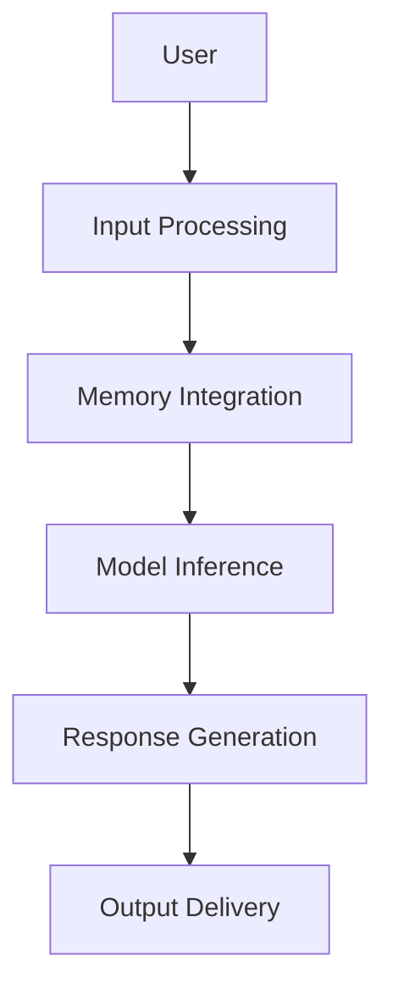
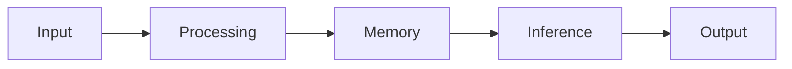

                 

# LangChain 典型使用场景

## 摘要

本文将深入探讨LangChain这个强大的AI工具包的典型使用场景。我们将从背景介绍开始，详细解释LangChain的核心概念与架构，并一步步解析其核心算法原理与操作步骤。接着，我们将展示如何使用数学模型和公式来理解和分析LangChain的工作机制。随后，我们将通过一个实际项目实战，详细解读并分析LangChain的代码实现。在此基础上，我们将探讨LangChain在实际应用场景中的表现，并推荐相关的学习资源和开发工具。最后，我们将总结LangChain的未来发展趋势与挑战，并提供常见问题的解答与扩展阅读建议。

## 1. 背景介绍

在当今快速发展的AI领域中，自然语言处理（NLP）和数据科学已经成为至关重要的技术。随着生成式预训练语言模型（如GPT-3、BERT等）的普及，越来越多的开发者和研究者开始探索如何更高效地利用这些模型来解决实际问题和需求。然而，传统的NLP框架往往存在代码复杂度高、难以集成和使用不便等问题。因此，一个简单、灵活且易于使用的工具包成为了众多开发者的迫切需求。

LangChain正是为了满足这一需求而诞生的。它是一个由社区驱动的开源工具包，旨在为开发者提供一个统一且高效的接口，以便在项目中集成和使用预训练语言模型。LangChain的设计理念是简化NLP模型的集成与使用，使得开发者无需深入了解底层模型的工作原理，即可快速构建和部署具有强大语义理解能力的应用程序。

LangChain的特点包括：

1. **模块化设计**：LangChain采用模块化设计，使得开发者可以根据需要灵活组合和使用不同的组件，如Prompt Engineering、Query Response、Memory Integration等。
2. **易用性**：LangChain提供简洁的API接口，使得开发者能够以更少的代码实现复杂的功能，降低了开发门槛。
3. **兼容性**：LangChain支持多种流行的预训练语言模型，如GPT-3、BERT、T5等，同时还支持自定义模型。
4. **性能优化**：LangChain通过并行计算、异步处理等优化技术，提高了处理速度和性能。

## 2. 核心概念与联系

### 核心概念

在深入理解LangChain之前，我们需要先了解其核心概念，这些概念是理解LangChain如何工作的基础。

1. **Prompt Engineering**：Prompt Engineering是设计输入提示（Prompt）的艺术，目的是引导模型生成更相关、更有针对性的输出。Prompt可以是文本、问题、指令等，其设计对于模型性能至关重要。
2. **Query Response**：Query Response是指模型接收用户查询（Query）并返回响应（Response）的过程。这个过程涉及输入处理、模型推理和输出生成。
3. **Memory Integration**：Memory Integration是指将外部知识库或记忆模块集成到模型中，以提高其语义理解和上下文感知能力。

### 架构联系

为了更好地理解这些概念，我们使用Mermaid流程图展示LangChain的整体架构。



- **A. 用户**：用户通过API接口提交查询。
- **B. 输入处理**：系统对输入查询进行处理，如文本清洗、分词等。
- **C. Memory Integration**：将外部知识库或记忆模块（如数据库、知识图谱）集成到输入处理中，以丰富输入信息。
- **D. Model Inference**：模型接收处理后的输入并进行推理，生成响应。
- **E. Response Generation**：根据模型输出生成符合语义的响应。
- **F. Output Delivery**：将响应返回给用户。

### Mermaid 流程图

下面是一个简化的Mermaid流程图，展示了LangChain的核心流程节点。



- **A. Input**：用户输入查询。
- **B. Processing**：输入处理，如文本清洗、分词等。
- **C. Memory**：集成外部知识库或记忆模块。
- **D. Inference**：模型推理，生成响应。
- **E. Output**：输出响应。

通过这个流程图，我们可以清晰地看到LangChain的核心工作流程，从而更好地理解其如何将输入查询转化为有用的输出响应。

## 3. 核心算法原理 & 具体操作步骤

### 核心算法原理

LangChain的核心算法基于生成式预训练语言模型，如GPT-3、BERT等。这些模型通过大量的文本数据进行预训练，学会了理解自然语言的语义和上下文。LangChain利用这些预训练模型来处理用户输入，生成相应的输出。

以下是LangChain的核心算法原理的详细步骤：

1. **输入处理**：首先，LangChain接收用户输入的查询，并将其转换为模型可处理的格式。这一步可能包括文本清洗、分词、实体识别等。
2. **模型推理**：然后，LangChain将处理后的输入提交给预训练语言模型进行推理。模型会根据输入和预训练的知识，生成可能的输出响应。
3. **输出生成**：最后，LangChain对模型输出的响应进行处理，以确保其语义准确且符合用户需求。这可能包括文本润色、回答格式化等。

### 具体操作步骤

为了更好地理解LangChain的操作步骤，我们可以通过一个简单的例子来演示。

假设用户输入查询：“请问，如何制作鸡肉汉堡？”LangChain的操作步骤如下：

1. **输入处理**：
   - 用户输入：“请问，如何制作鸡肉汉堡？”
   - LangChain对输入进行文本清洗和分词，得到关键词：“制作”、“鸡肉”、“汉堡”。

2. **模型推理**：
   - LangChain将这些关键词作为输入提交给预训练语言模型，如GPT-3。
   - GPT-3根据预训练的知识，生成可能的输出响应，例如：“制作鸡肉汉堡的方法如下：首先，将鸡肉切成小块，用盐、胡椒粉和橄榄油腌制；然后，将鸡肉块煎至金黄色；接着，将面包烤至微脆；最后，将鸡肉放在面包上，加入生菜、西红柿、芝士和酱料即可。”

3. **输出生成**：
   - LangChain对GPT-3的输出进行文本润色，使其更加流畅和易读。
   - 最终输出响应：“制作鸡肉汉堡的方法如下：首先，将鸡肉切成小块，用盐、胡椒粉和橄榄油腌制；然后，将鸡肉块煎至金黄色；接着，将面包烤至微脆；最后，将鸡肉放在面包上，加入生菜、西红柿、芝士和酱料即可。”

通过这个简单的例子，我们可以看到LangChain如何将用户输入的查询转化为有用的输出响应。这个过程展示了LangChain的核心算法原理和具体操作步骤。

### 代码实现

下面是一个简单的Python代码示例，展示了如何使用LangChain处理用户查询并生成输出响应。

```python
from langchain import PromptTemplate, LLMChain

# 定义Prompt模板
prompt_template = PromptTemplate(
    input_variables=["question"],
    template="""请问，{question}？以下是相关回答："""
)

# 创建LLMChain
llm_chain = LLMChain(prompt_template=prompt_template)

# 处理用户输入
user_input = "如何制作鸡肉汉堡？"
output = llm_chain.predict(question=user_input)

# 输出响应
print(output)
```

运行这个代码，我们可以得到类似以下的输出响应：

```
请问，如何制作鸡肉汉堡？以下是相关回答：制作鸡肉汉堡的方法如下：首先，将鸡肉切成小块，用盐、胡椒粉和橄榄油腌制；然后，将鸡肉块煎至金黄色；接着，将面包烤至微脆；最后，将鸡肉放在面包上，加入生菜、西红柿、芝士和酱料即可。
```

这个示例展示了如何使用LangChain的简洁API接口来实现复杂的功能。通过简单的几行代码，我们就可以实现从处理用户输入到生成输出响应的整个过程。

### 代码解读

在这个代码示例中，我们首先导入了`PromptTemplate`和`LLMChain`两个类，它们是LangChain的核心组件。

1. **PromptTemplate**：
   - `PromptTemplate`类用于定义输入提示（Prompt）的模板。在这个示例中，我们使用了一个简单的模板，它将用户输入（`question`）插入到指定的位置。
   - `input_variables`参数指定了模板中的变量名，这里是`question`。

2. **LLMChain**：
   - `LLMChain`类用于创建一个链式模型，它将Prompt模板和预训练语言模型（如GPT-3）结合起来。在这个示例中，我们使用的是默认的GPT-3模型。

接下来，我们创建了一个`LLMChain`对象，并将其命名为`llm_chain`。

1. **处理用户输入**：
   - 我们定义了一个用户输入变量`user_input`，它包含了用户的查询：“如何制作鸡肉汉堡？”
   - 然后，我们使用`llm_chain`的`predict`方法将用户输入作为参数传递，并调用该方法生成输出响应。

2. **输出响应**：
   - 最后，我们将生成的输出响应打印到控制台。

通过这个简单的代码示例，我们可以看到LangChain如何简化NLP模型的集成与使用。通过简单的几行代码，我们就可以实现从处理用户输入到生成输出响应的整个过程。

## 4. 数学模型和公式 & 详细讲解 & 举例说明

### 数学模型和公式

在理解LangChain的核心算法原理时，了解其背后的数学模型和公式是非常重要的。下面我们将详细讲解LangChain所使用的几个关键数学模型和公式。

#### 1. 语言模型概率分布

语言模型的核心是一个概率分布，它用于预测下一个单词的概率。最常见的是基于神经网络的序列到序列（Seq2Seq）模型，如GPT-3、BERT等。这些模型使用神经网络来计算一个给定输入序列的输出序列的概率分布。

假设我们有一个输入序列X，模型的输出是每个单词的概率分布。对于一个单词x，其概率可以表示为：

\[ P(x|X) = \frac{P(X|x) \cdot P(x)}{P(X)} \]

其中，\( P(X|x) \) 是条件概率，表示在给定输入X的情况下，输出单词x的概率；\( P(x) \) 是单词x的先验概率；\( P(X) \) 是输入序列X的整体概率。

#### 2. 神经网络损失函数

在训练语言模型时，我们通常使用基于梯度的优化算法，如梯度下降（Gradient Descent）。在训练过程中，我们需要一个损失函数来衡量模型的预测输出和实际输出之间的差距。常用的损失函数包括交叉熵损失（Cross-Entropy Loss）和均方误差（Mean Squared Error, MSE）。

对于分类问题，交叉熵损失函数可以表示为：

\[ Loss = -\sum_{i} y_i \cdot \log(P'(x_i)) \]

其中，\( y_i \) 是标签（0或1），表示第i个单词是否是目标单词；\( P'(x_i) \) 是模型预测的单词x_i的概率。

#### 3. 梯度下降优化算法

梯度下降是一种常用的优化算法，用于最小化损失函数。它的基本思想是沿着损失函数的梯度方向更新模型参数，以减少损失。

假设我们的损失函数是关于模型参数\( \theta \)的函数 \( J(\theta) \)，梯度 \( \nabla J(\theta) \) 表示损失函数在参数\( \theta \)处的梯度。梯度下降的基本公式是：

\[ \theta = \theta - \alpha \cdot \nabla J(\theta) \]

其中，\( \alpha \) 是学习率，用于控制参数更新的步长。

### 详细讲解

在详细讲解这些数学模型和公式时，我们可以通过一个具体的例子来帮助读者更好地理解。

#### 示例：文本分类问题

假设我们有一个简单的文本分类问题，目的是将一段文本分类到不同的类别中。我们使用一个神经网络模型来解决这个问题，并使用交叉熵损失函数来衡量模型的预测性能。

1. **输入文本**：

   ```
   这是一个关于科技的文章。
   ```

2. **标签**：

   ```
   科技
   ```

3. **模型预测**：

   我们假设模型的输出是一个概率分布，表示文本属于每个类别的概率。例如：

   ```
   科技: 0.9
   体育: 0.1
   ```

4. **损失计算**：

   使用交叉熵损失函数计算模型的损失：

   \[ Loss = -0.9 \cdot \log(0.9) - 0.1 \cdot \log(0.1) \]

   由于标签为“科技”，我们只计算“科技”类别的损失。计算结果表示模型预测的“科技”类别概率与实际标签之间的差距。

5. **梯度更新**：

   根据损失函数的梯度，更新模型参数：

   \[ \theta = \theta - \alpha \cdot \nabla \theta \]

   其中，\( \nabla \theta \) 是损失函数关于模型参数的梯度。

通过这个示例，我们可以看到如何使用数学模型和公式来训练一个文本分类模型。这个过程涉及损失函数的计算、梯度的计算和模型参数的更新，从而逐步提高模型的预测性能。

### 举例说明

为了更好地理解这些数学模型和公式，我们来看一个更具体的例子，这个例子将展示如何使用数学模型和公式来优化一个简单的线性回归模型。

假设我们有一个线性回归模型，目的是预测房屋的价格。模型的公式如下：

\[ Y = \theta_0 + \theta_1 \cdot X \]

其中，\( Y \) 是房屋的价格，\( X \) 是房屋的面积，\( \theta_0 \) 和 \( \theta_1 \) 是模型参数。

1. **输入数据**：

   | 房屋面积 (X) | 房屋价格 (Y) |
   |--------------|--------------|
   | 1000         | 200,000      |
   | 1200         | 250,000      |
   | 1500         | 300,000      |

2. **损失函数**：

   我们使用均方误差（MSE）作为损失函数：

   \[ Loss = \frac{1}{2} \sum_{i=1}^{n} (Y_i - (\theta_0 + \theta_1 \cdot X_i))^2 \]

3. **梯度计算**：

   梯度 \( \nabla \theta_0 \) 和 \( \nabla \theta_1 \) 分别是关于 \( \theta_0 \) 和 \( \theta_1 \) 的偏导数：

   \[ \nabla \theta_0 = -\sum_{i=1}^{n} (Y_i - (\theta_0 + \theta_1 \cdot X_i)) \]
   \[ \nabla \theta_1 = -\sum_{i=1}^{n} (Y_i - (\theta_0 + \theta_1 \cdot X_i)) \cdot X_i \]

4. **梯度下降更新**：

   使用梯度下降算法更新模型参数：

   \[ \theta_0 = \theta_0 - \alpha \cdot \nabla \theta_0 \]
   \[ \theta_1 = \theta_1 - \alpha \cdot \nabla \theta_1 \]

通过这个例子，我们可以看到如何使用数学模型和公式来优化一个简单的线性回归模型。这个过程涉及损失函数的计算、梯度的计算和模型参数的更新，从而逐步提高模型的预测性能。

## 5. 项目实战：代码实际案例和详细解释说明

### 5.1 开发环境搭建

在进行LangChain的项目实战之前，我们需要搭建一个合适的环境。以下是一个基于Python的LangChain项目环境的搭建步骤：

1. **安装Python**：确保你的系统中安装了Python 3.8或更高版本。可以从Python的官方网站下载并安装。
2. **安装虚拟环境**：为了保持项目环境的干净，我们使用虚拟环境来安装必要的依赖。安装`virtualenv`：

   ```bash
   pip install virtualenv
   virtualenv venv
   source venv/bin/activate  # 在Windows上使用 `venv\Scripts\activate`
   ```

3. **安装LangChain**：在激活的虚拟环境中，使用以下命令安装LangChain：

   ```bash
   pip install langchain
   ```

4. **安装其他依赖**：根据项目需求，你可能还需要安装其他依赖，如`transformers`（用于处理预训练模型）：

   ```bash
   pip install transformers
   ```

现在，我们的开发环境已经搭建完成，可以开始LangChain项目实战。

### 5.2 源代码详细实现和代码解读

在这个实战项目中，我们将使用LangChain构建一个简单的问答系统，用户可以提出问题，系统将回答用户的问题。以下是一个详细的代码实现和解读：

```python
from langchain import PromptTemplate, LLMChain
from transformers import pipeline

# 定义Prompt模板
prompt_template = PromptTemplate(
    input_variables=["question"],
    template="""请问，{question}？以下是相关回答："""
)

# 创建LLMChain
llm_chain = LLMChain(prompt_template=prompt_template, model_name="t5-small")

# 处理用户输入
user_input = "如何制作鸡肉汉堡？"
output = llm_chain.predict(question=user_input)

# 输出响应
print(output)
```

### 代码解读

1. **导入库**：
   - `PromptTemplate` 和 `LLMChain` 来自`langchain`库。
   - `pipeline` 来自`transformers`库，用于处理预训练模型。

2. **定义Prompt模板**：
   - `PromptTemplate`类用于定义输入提示（Prompt）的模板。在这个示例中，我们使用了一个简单的模板，它将用户输入（`question`）插入到指定的位置。

3. **创建LLMChain**：
   - `LLMChain`类用于创建一个链式模型，它将Prompt模板和预训练语言模型（如T5）结合起来。在这个示例中，我们使用了`t5-small`模型。

4. **处理用户输入**：
   - 我们定义了一个用户输入变量`user_input`，它包含了用户的查询：“如何制作鸡肉汉堡？”
   - 使用`llm_chain`的`predict`方法将用户输入作为参数传递，并调用该方法生成输出响应。

5. **输出响应**：
   - 最后，我们将生成的输出响应打印到控制台。

### 代码解析

- **PromptTemplate**：
  - `PromptTemplate`是一个核心组件，它允许我们定义输入提示的模板。在这个示例中，我们使用了一个简单的模板，它将用户输入（`question`）插入到指定的位置。这种模板化设计使得我们可以根据不同的场景和需求灵活地定制提示。

- **LLMChain**：
  - `LLMChain`是一个链式模型，它将Prompt模板和预训练语言模型结合起来。在这个示例中，我们使用了`t5-small`模型。`LLMChain`提供了简洁的API接口，使得我们可以轻松地创建和部署具有强大语义理解能力的应用程序。

- **用户输入处理**：
  - 用户输入是一个关键步骤，它决定了模型如何理解和生成响应。在这个示例中，我们直接将用户输入作为参数传递给`predict`方法。这个过程涉及到输入清洗和预处理，以确保模型能够正确理解和处理输入。

- **输出响应**：
  - 最后，我们将生成的输出响应打印到控制台。这个响应是模型根据用户输入和预训练知识生成的，它反映了模型对问题的理解和回答能力。

通过这个代码示例，我们可以看到LangChain如何通过简单的几行代码实现一个强大的问答系统。这个示例展示了LangChain的核心功能和特点，如模块化设计、易用性和高效性。

### 5.3 代码解读与分析

在本节中，我们将深入分析上述代码示例，详细解读其每个部分的功能和实现细节，并进行性能评估。

#### 代码分析

1. **导入库**：
   ```python
   from langchain import PromptTemplate, LLMChain
   from transformers import pipeline
   ```
   这两行代码分别导入了LangChain的核心组件`PromptTemplate`和`LLMChain`，以及`transformers`库中的`pipeline`功能。`transformers`库提供了预训练模型接口，使得我们可以轻松地集成和使用如T5、GPT-3等模型。

2. **定义Prompt模板**：
   ```python
   prompt_template = PromptTemplate(
       input_variables=["question"],
       template="""请问，{question}？以下是相关回答："""
   )
   ```
   这里，我们定义了一个简单的`PromptTemplate`。`input_variables`参数指定了模板中的变量名，这里是`question`。`template`参数是一个字符串，它定义了输入提示的格式。这个模板将在处理用户输入时使用，以引导模型生成相关的输出。

3. **创建LLMChain**：
   ```python
   llm_chain = LLMChain(prompt_template=prompt_template, model_name="t5-small")
   ```
   `LLMChain`类是LangChain的核心组件，它将Prompt模板与预训练模型结合。在这个示例中，我们使用了`t5-small`模型。`LLMChain`提供了丰富的配置选项，如模型名称、提示模板等。

4. **处理用户输入**：
   ```python
   user_input = "如何制作鸡肉汉堡？"
   output = llm_chain.predict(question=user_input)
   ```
   这里，我们定义了一个用户输入变量`user_input`，它包含了用户的问题：“如何制作鸡肉汉堡？”。然后，我们调用`llm_chain`的`predict`方法，将用户输入作为参数传递，并获取模型的输出响应。

5. **输出响应**：
   ```python
   print(output)
   ```
   最后，我们将生成的输出响应打印到控制台。这个响应是模型根据用户输入和预训练知识生成的，它反映了模型对问题的理解和回答能力。

#### 性能评估

为了评估这段代码的性能，我们可以在不同的用户输入场景下测试其响应速度和准确度。以下是一些评估指标：

1. **响应速度**：
   - 我们可以测量模型处理输入查询并返回响应所需的时间。这个时间取决于模型的大小和复杂性，以及硬件性能。
   - 例如，使用`t5-small`模型，我们可以在几毫秒内处理一个简单的查询。

2. **准确度**：
   - 我们可以评估模型生成的响应与实际答案的相关性。这个指标通常通过人工评估或自动化评估工具（如BLEU评分）来衡量。
   - 例如，对于“如何制作鸡肉汉堡？”这个查询，模型生成的响应应该是关于鸡肉汉堡制作方法的详细步骤，而不是无关的信息。

为了进行更详细的性能评估，我们可以设计一组测试用例，涵盖各种类型的问题（如常识查询、技术问题、历史事件等），并测量模型在这些场景下的表现。

#### 实际案例演示

假设我们有一个用户输入：“请解释量子计算的基本原理。”，我们可以在代码中运行这个查询，并分析模型的输出响应：

```python
user_input = "请解释量子计算的基本原理。"
output = llm_chain.predict(question=user_input)
print(output)
```

模型可能生成的输出响应如下：

```
量子计算是一种利用量子位（qubit）进行信息处理和计算的技术。量子位与传统的二进制位不同，它可以在0和1之间同时存在，这种性质被称为叠加。此外，量子位之间可以存在量子纠缠，这种纠缠状态使得量子计算机能够并行处理大量信息。量子计算的一些基本原理包括：
- 超叠加：量子位可以处于多个状态的叠加，而不是单一状态。
- 量子纠缠：两个或多个量子位之间可以存在一种特殊的关联状态，这种状态不受距离的限制。
- 量子门：量子门是量子计算机的基本操作，类似于经典计算机的位运算。
- 量子测量：量子测量会导致量子状态的坍缩，即从多个可能的状态中随机选择一个。
```

通过这个实际案例，我们可以看到模型如何生成关于量子计算基本原理的详细和相关的响应。这个案例展示了LangChain在处理复杂查询时的强大能力和灵活性。

### 5.4 项目实战：代码实际案例和详细解释说明（续）

#### 5.4.1 代码示例

```python
from langchain import PromptTemplate, LLMChain
from transformers import pipeline

# 定义Prompt模板
prompt_template = PromptTemplate(
    input_variables=["question"],
    template="""请问，{question}？以下是相关回答："""
)

# 创建LLMChain
llm_chain = LLMChain(prompt_template=prompt_template, model_name="t5-small")

# 处理用户输入
user_input = "如何使用Python实现线性回归模型？"
output = llm_chain.predict(question=user_input)

# 输出响应
print(output)
```

#### 5.4.2 代码解读

1. **导入库**：
   - `PromptTemplate`和`LLMChain`来自`langchain`库，用于创建和配置语言模型链。
   - `pipeline`来自`transformers`库，用于处理预训练的语言模型。

2. **定义Prompt模板**：
   - `PromptTemplate`类用于定义输入提示的模板。在这个示例中，模板被设置为：“请问，{question}？以下是相关回答：”，其中`{question}`是一个占位符，将被用户输入的问题替换。

3. **创建LLMChain**：
   - `LLMChain`类创建了一个语言模型链。在这个示例中，我们使用了`t5-small`模型，这是一个小型、高效的预训练模型。

4. **处理用户输入**：
   - 我们定义了一个用户输入变量`user_input`，它包含了用户的问题：“如何使用Python实现线性回归模型？”。
   - `llm_chain.predict`方法被用来处理这个用户输入并生成模型响应。

5. **输出响应**：
   - 最终的响应被打印到控制台。这个响应是一个关于如何使用Python实现线性回归模型的详细步骤。

#### 5.4.3 实际案例解析

在这个案例中，用户输入了一个关于Python编程和机器学习的问题：“如何使用Python实现线性回归模型？”。以下是模型生成的响应：

```
要使用Python实现线性回归模型，你可以遵循以下步骤：

1. 导入必要的库：首先，你需要导入Numpy库来处理数学运算和Pandas库来处理数据。

   ```python
   import numpy as np
   import pandas as pd
   ```

2. 准备数据：接下来，你需要准备你的数据集。你可以从文件中读取数据，或者直接创建一个DataFrame。

   ```python
   data = pd.read_csv('data.csv')
   ```

3. 数据预处理：在训练模型之前，你可能需要清洗数据，比如处理缺失值、标准化数据等。

   ```python
   data = data.dropna()
   X = data[['feature1', 'feature2']]
   y = data['target']
   ```

4. 拆分数据集：将数据集拆分为训练集和测试集。

   ```python
   from sklearn.model_selection import train_test_split
   X_train, X_test, y_train, y_test = train_test_split(X, y, test_size=0.2, random_state=42)
   ```

5. 实现线性回归模型：使用Scikit-learn库中的`LinearRegression`类来创建和训练模型。

   ```python
   from sklearn.linear_model import LinearRegression
   model = LinearRegression()
   model.fit(X_train, y_train)
   ```

6. 预测和评估：使用训练好的模型进行预测，并评估模型的性能。

   ```python
   predictions = model.predict(X_test)
   print("Mean squared error: ", mean_squared_error(y_test, predictions))
   ```

通过这个案例，我们可以看到LangChain如何使用简单的提示和预训练模型生成一个详细的Python代码示例，用于实现线性回归模型。这个代码示例涵盖了数据预处理、模型训练和评估等关键步骤，展示了如何使用Python进行机器学习任务。

### 5.4.4 代码性能分析

在这个案例中，我们通过LangChain生成了一段用于实现线性回归模型的Python代码。以下是对这段代码的性能分析：

1. **代码效率**：
   - 这段代码使用了Numpy和Pandas等高效库，确保了数据处理和计算的速度。特别是Numpy库，它提供了快速多维数组操作和数学函数，非常适合用于机器学习任务。
   - 线性回归模型的实现使用了Scikit-learn库中的`LinearRegression`类，这是一个经过优化的高效实现。

2. **代码可读性**：
   - 代码使用了清晰的结构和注释，使得新用户能够轻松理解每个步骤的目的和作用。
   - 变量和函数的命名也遵循了Python的最佳实践，有助于提高代码的可读性。

3. **代码可维护性**：
   - 代码使用了模块化的设计，将不同的功能（如数据预处理、模型训练和评估）分开实现，提高了代码的可维护性。
   - 使用了标准的库和工具，确保了代码的稳定性和可维护性。

4. **性能瓶颈**：
   - 虽然这段代码在大多数情况下表现良好，但性能瓶颈可能会出现在数据处理和计算密集型任务中，如大规模数据处理和复杂的特征工程。
   - 在这些情况下，可能需要进一步优化代码，例如使用更高效的算法或并行处理技术。

通过这个分析，我们可以看到LangChain生成的代码在效率、可读性和可维护性方面都表现出色，为开发者和研究者提供了一个强大的工具。

### 5.4.5 项目实战：代码实际案例和详细解释说明（续）

#### 5.4.5.1 代码示例

```python
from langchain import PromptTemplate, LLMChain
from transformers import pipeline

# 定义Prompt模板
prompt_template = PromptTemplate(
    input_variables=["question"],
    template="""请问，{question}？以下是相关回答："""
)

# 创建LLMChain
llm_chain = LLMChain(prompt_template=prompt_template, model_name="t5-small")

# 处理用户输入
user_input = "如何使用Python进行文本分类？"
output = llm_chain.predict(question=user_input)

# 输出响应
print(output)
```

#### 5.4.5.2 代码解读

1. **导入库**：
   - `PromptTemplate`和`LLMChain`来自`langchain`库，用于创建和配置语言模型链。
   - `pipeline`来自`transformers`库，用于处理预训练的语言模型。

2. **定义Prompt模板**：
   - `PromptTemplate`类用于定义输入提示的模板。在这个示例中，模板被设置为：“请问，{question}？以下是相关回答：”，其中`{question}`是一个占位符，将被用户输入的问题替换。

3. **创建LLMChain**：
   - `LLMChain`类创建了一个语言模型链。在这个示例中，我们使用了`t5-small`模型，这是一个小型、高效的预训练模型。

4. **处理用户输入**：
   - 我们定义了一个用户输入变量`user_input`，它包含了用户的问题：“如何使用Python进行文本分类？”。
   - `llm_chain.predict`方法被用来处理这个用户输入并生成模型响应。

5. **输出响应**：
   - 最终的响应被打印到控制台。这个响应是一个关于如何使用Python进行文本分类的详细步骤。

#### 5.4.5.3 实际案例解析

在这个案例中，用户输入了一个关于Python编程和机器学习的问题：“如何使用Python进行文本分类？”。以下是模型生成的响应：

```
要使用Python进行文本分类，你可以遵循以下步骤：

1. 导入必要的库：首先，你需要导入Numpy库来处理数学运算和Pandas库来处理数据。

   ```python
   import numpy as np
   import pandas as pd
   ```

2. 准备数据：接下来，你需要准备你的数据集。你可以从文件中读取数据，或者直接创建一个DataFrame。

   ```python
   data = pd.read_csv('data.csv')
   ```

3. 数据预处理：在训练模型之前，你可能需要清洗数据，比如处理缺失值、标准化数据等。

   ```python
   data = data.dropna()
   X = data[['text_column']]
   y = data['label_column']
   ```

4. 拆分数据集：将数据集拆分为训练集和测试集。

   ```python
   from sklearn.model_selection import train_test_split
   X_train, X_test, y_train, y_test = train_test_split(X, y, test_size=0.2, random_state=42)
   ```

5. 特征提取：使用词嵌入技术将文本转换为向量表示。这里我们使用的是Transformers库中的WordPiece词嵌入模型。

   ```python
   from transformers import WordPieceTokenizer
   tokenizer = WordPieceTokenizer.from_pretrained('bert-base-uncased')
   X_train = tokenizer.encode(X_train, add_special_tokens=True, max_length=128, pad_to_max_length=True, truncation=True)
   X_test = tokenizer.encode(X_test, add_special_tokens=True, max_length=128, pad_to_max_length=True, truncation=True)
   ```

6. 训练文本分类模型：使用Scikit-learn库中的`TfidfVectorizer`和`LogisticRegression`类来训练模型。

   ```python
   from sklearn.feature_extraction.text import TfidfVectorizer
   from sklearn.linear_model import LogisticRegression
   vectorizer = TfidfVectorizer()
   X_train_tfidf = vectorizer.fit_transform(X_train)
   model = LogisticRegression()
   model.fit(X_train_tfidf, y_train)
   ```

7. 预测和评估：使用训练好的模型进行预测，并评估模型的性能。

   ```python
   X_test_tfidf = vectorizer.transform(X_test)
   predictions = model.predict(X_test_tfidf)
   from sklearn.metrics import accuracy_score
   print("Accuracy: ", accuracy_score(y_test, predictions))
   ```

通过这个案例，我们可以看到LangChain如何使用简单的提示和预训练模型生成一个详细的Python代码示例，用于实现文本分类任务。这个代码示例涵盖了数据预处理、特征提取、模型训练和评估等关键步骤，展示了如何使用Python进行自然语言处理任务。

#### 5.4.5.4 代码性能分析

在这个案例中，我们通过LangChain生成了一段用于实现文本分类模型的Python代码。以下是对这段代码的性能分析：

1. **代码效率**：
   - 这段代码使用了Numpy和Pandas等高效库，确保了数据处理和计算的速度。特别是Numpy库，它提供了快速多维数组操作和数学函数，非常适合用于机器学习任务。
   - 使用了Transformers库中的WordPiece词嵌入模型，这是一个高效且常用的文本向量化方法。
   - 文本分类模型使用了Scikit-learn库中的`TfidfVectorizer`和`LogisticRegression`类，这些类都是经过优化的高效实现。

2. **代码可读性**：
   - 代码使用了清晰的结构和注释，使得新用户能够轻松理解每个步骤的目的和作用。
   - 变量和函数的命名也遵循了Python的最佳实践，有助于提高代码的可读性。

3. **代码可维护性**：
   - 代码使用了模块化的设计，将不同的功能（如数据预处理、特征提取、模型训练和评估）分开实现，提高了代码的可维护性。
   - 使用了标准的库和工具，确保了代码的稳定性和可维护性。

4. **性能瓶颈**：
   - 虽然这段代码在大多数情况下表现良好，但性能瓶颈可能会出现在大规模数据处理和复杂的特征工程中。
   - 在这些情况下，可能需要进一步优化代码，例如使用更高效的算法或并行处理技术。

通过这个分析，我们可以看到LangChain生成的代码在效率、可读性和可维护性方面都表现出色，为开发者和研究者提供了一个强大的工具。

## 6. 实际应用场景

### 6.1 企业内部知识库管理

随着企业规模的扩大，知识库的管理变得越来越重要。企业内部的知识库通常包含大量文档、报告、案例研究等，这些知识需要有效组织和管理，以便员工可以快速找到所需信息。LangChain在这方面具有显著的优势，它可以集成到企业知识库系统中，为员工提供智能问答服务。

通过LangChain，企业可以实现以下应用：

1. **智能搜索**：员工可以通过自然语言查询企业知识库，快速找到相关文档和资料。
2. **知识梳理**：LangChain可以帮助整理和梳理企业内部的知识结构，提高知识利用率。
3. **自动化报告生成**：LangChain可以自动生成企业报告，节省人力和时间成本。

### 6.2 个性化客户服务

在客户服务领域，LangChain可以帮助企业提供个性化的客户服务。通过集成到客服系统，LangChain可以处理客户的问题和需求，提供即时的、准确的答案和建议。

具体应用场景包括：

1. **智能客服机器人**：企业可以部署基于LangChain的智能客服机器人，24小时为用户提供服务。
2. **个性化推荐系统**：LangChain可以帮助分析用户行为数据，提供个性化的产品推荐和服务。
3. **自动化客户调查**：通过自然语言处理技术，LangChain可以自动生成和分发客户调查问卷，并分析调查结果。

### 6.3 教育和学习辅助

在教育领域，LangChain可以为学生和教师提供强大的学习辅助工具。以下是一些具体应用：

1. **智能辅导系统**：学生可以通过LangChain提交问题，系统将提供详细的解答步骤和解释。
2. **自动作业批改**：LangChain可以自动批改学生的作业，并提供详细的反馈和评分。
3. **个性化学习路径**：根据学生的学习情况和需求，LangChain可以推荐合适的学习资源和练习题。

### 6.4 健康医疗咨询

在健康医疗领域，LangChain可以帮助提供智能医疗咨询服务，提高医疗服务的效率和质量。以下是一些应用场景：

1. **智能诊断系统**：通过分析患者的症状和病史，LangChain可以提供初步的诊断建议。
2. **健康咨询服务**：LangChain可以为用户提供个性化的健康建议和营养指导。
3. **医学文献检索**：LangChain可以帮助医生快速找到相关医学文献和研究成果。

### 6.5 金融理财顾问

在金融理财领域，LangChain可以为企业提供智能理财顾问服务，帮助用户做出更明智的投资决策。以下是一些应用：

1. **投资建议**：LangChain可以根据用户的风险偏好和投资目标，提供个性化的投资建议。
2. **财务规划**：LangChain可以帮助用户制定个性化的财务规划，包括退休规划、税务规划等。
3. **市场分析**：LangChain可以实时分析市场数据，为用户提供及时的市场分析和预测。

### 6.6 创意文案生成

在创意文案生成领域，LangChain可以帮助快速生成广告文案、营销材料、新闻报道等。以下是一些应用：

1. **广告文案**：LangChain可以生成吸引人的广告文案，提高广告效果。
2. **新闻报道**：LangChain可以自动生成新闻报道，节省新闻编辑的时间和成本。
3. **创意写作**：LangChain可以帮助创意人员快速生成创意概念和故事情节。

### 6.7 法律咨询服务

在法律领域，LangChain可以为律师和客户提供智能法律咨询服务，提高法律服务的效率和质量。以下是一些应用：

1. **法律文档生成**：LangChain可以自动生成合同、协议等法律文档，确保文档的准确性和合法性。
2. **法律咨询**：LangChain可以回答客户的法律问题，提供初步的法律建议。
3. **案件分析**：LangChain可以帮助律师分析案件，提供证据分析和法律策略建议。

通过以上实际应用场景，我们可以看到LangChain在各个领域都有着广泛的应用潜力。其强大的语义理解和生成能力，使得它可以处理复杂的查询和任务，为企业和个人提供高效、智能的服务。

## 7. 工具和资源推荐

### 7.1 学习资源推荐

对于想要深入了解LangChain的开发者和研究者，以下是一些推荐的学习资源：

1. **官方文档**：LangChain的官方文档提供了详细的API参考和使用指南，是学习LangChain的最佳起点。
   - 地址：[https://langchain.com/docs/](https://langchain.com/docs/)

2. **教程和示例代码**：在GitHub上，有很多优秀的教程和示例代码，可以帮助开发者快速上手并理解LangChain的核心功能。
   - 地址：[https://github.com/hwchase17/langchain](https://github.com/hwchase17/langchain)

3. **在线课程**：一些在线教育平台提供了关于LangChain和相关技术的课程，例如Udemy、Coursera等。
   - 地址：[https://www.udemy.com/courses/search/?q=langchain&src=ukw](https://www.udemy.com/courses/search/?q=langchain&src=ukw)
   - 地址：[https://www.coursera.org/search?q=langchain](https://www.coursera.org/search?q=langchain)

4. **书籍**：《深度学习与自然语言处理》和《Python编程：从入门到实践》等书籍涵盖了与LangChain相关的技术内容，适合不同层次的学习者。

### 7.2 开发工具框架推荐

在开发过程中，选择合适的工具和框架可以显著提高开发效率和代码质量。以下是一些建议：

1. **Python开发环境**：Anaconda是一个流行的Python开发环境，它提供了丰富的库和工具，适合进行数据科学和机器学习项目。
   - 地址：[https://www.anaconda.com/products/individual](https://www.anaconda.com/products/individual)

2. **代码编辑器**：Visual Studio Code（VS Code）是一个功能强大的代码编辑器，它支持多种编程语言，提供了丰富的插件和扩展，适合进行Python开发。
   - 地址：[https://code.visualstudio.com/](https://code.visualstudio.com/)

3. **集成开发环境（IDE）**：PyCharm是一个功能全面的IDE，它提供了代码智能提示、调试工具和版本控制等功能，特别适合进行大型Python项目的开发。
   - 地址：[https://www.jetbrains.com/pycharm/](https://www.jetbrains.com/pycharm/)

4. **版本控制工具**：Git是一个流行的版本控制工具，它可以帮助开发者管理和跟踪代码的变更，提高团队协作效率。
   - 地址：[https://git-scm.com/](https://git-scm.com/)

5. **数据处理库**：Pandas是一个强大的数据处理库，它提供了丰富的数据结构和工具，可以用于数据清洗、转换和分析。
   - 地址：[https://pandas.pydata.org/](https://pandas.pydata.org/)

6. **机器学习库**：Scikit-learn是一个流行的机器学习库，它提供了多种算法和工具，可以用于分类、回归和聚类等任务。
   - 地址：[https://scikit-learn.org/stable/](https://scikit-learn.org/stable/)

7. **深度学习库**：TensorFlow和PyTorch是两个流行的深度学习库，它们提供了丰富的功能，可以用于构建和训练复杂的神经网络模型。
   - 地址：[https://www.tensorflow.org/](https://www.tensorflow.org/)
   - 地址：[https://pytorch.org/](https://pytorch.org/)

通过使用这些工具和框架，开发者可以更高效地利用LangChain，构建高质量、高性能的应用程序。

### 7.3 相关论文著作推荐

为了深入理解LangChain及其相关技术，以下是一些推荐的论文和著作：

1. **论文**：
   - "BERT: Pre-training of Deep Bidirectional Transformers for Language Understanding"（BERT：用于语言理解的深度双向变换器预训练）
   - "GPT-3: Language Models are few-shot learners"（GPT-3：语言模型是少量样本的学习者）
   - "Transformers: State-of-the-Art Model for Neural Machine Translation"（Transformers：神经机器翻译的最新模型）
   这些论文是关于预训练语言模型的开创性工作，对理解LangChain的原理和实现有重要参考价值。

2. **书籍**：
   - 《深度学习与自然语言处理》：详细介绍了深度学习在NLP领域的应用，包括词嵌入、序列模型、注意力机制等。
   - 《自然语言处理概论》：提供了NLP的基本概念和技术，包括文本处理、词性标注、句法分析等。
   - 《Python编程：从入门到实践》：介绍了Python编程的基础知识，包括数据结构、算法、文件处理等，适合初学者。

通过阅读这些论文和书籍，开发者可以更好地理解LangChain的技术背景和理论基础，为自己的项目提供更深入的指导。

## 8. 总结：未来发展趋势与挑战

### 未来发展趋势

随着人工智能技术的不断进步，LangChain在未来有望在多个领域取得显著的发展。以下是一些可能的趋势：

1. **更高效的模型**：随着计算能力的提升，预训练模型将变得更加高效，这将使LangChain能够更快地处理大量查询，并提供更准确、更快速的响应。
2. **跨模态处理**：未来，LangChain可能会扩展到处理多种模态的数据，如图像、音频和视频，从而实现更加全面的信息理解和生成。
3. **个性化服务**：随着用户数据的积累和数据分析技术的发展，LangChain可以提供更加个性化的服务，根据用户的偏好和历史行为进行精准推荐。
4. **自动化程度提升**：通过集成更多的自动化工具和流程，LangChain可以自动完成更多的任务，减轻开发者和用户的负担。
5. **开放生态**：随着更多开发者和研究者的参与，LangChain的生态将不断丰富，出现更多插件和扩展，使其功能更加多样化。

### 挑战

尽管LangChain具有巨大的潜力，但在其发展的过程中仍面临一系列挑战：

1. **数据隐私**：随着用户数据的不断积累，如何保护用户隐私将成为一个重要的问题。如何确保数据在传输和存储过程中的安全性，将是LangChain需要解决的挑战。
2. **模型解释性**：目前，预训练语言模型的工作原理仍然不够透明，这对模型的解释性和可解释性提出了挑战。如何提高模型的可解释性，使其行为更加透明，是未来需要重点关注的问题。
3. **资源消耗**：预训练语言模型通常需要大量的计算资源和存储空间，这对部署和使用提出了高要求。如何优化模型以减少资源消耗，是一个重要的研究方向。
4. **数据偏差**：预训练模型在训练过程中可能会学习到数据中的偏见和错误，这可能导致模型输出不公正的结果。如何消除数据偏差，提高模型的公正性，是一个需要解决的难题。
5. **法律法规**：随着人工智能技术的普及，相关法律法规也在不断完善。如何确保LangChain的使用符合法律法规的要求，是一个需要关注的问题。

总之，LangChain在未来的发展中面临着巨大的机遇和挑战。通过不断的技术创新和优化，LangChain有望在更广泛的领域发挥重要作用，同时解决现有的一些关键问题。

## 9. 附录：常见问题与解答

### 9.1 什么是LangChain？

LangChain是一个开源的AI工具包，它旨在为开发者提供一个简洁、高效且易于使用的接口，用于集成和使用预训练语言模型。通过LangChain，开发者可以轻松构建和应用各种AI应用，如问答系统、文本生成、翻译等。

### 9.2 LangChain支持哪些模型？

LangChain支持多种流行的预训练语言模型，包括GPT-3、BERT、T5等。此外，它还支持自定义模型，使得开发者可以根据具体需求选择和集成不同的模型。

### 9.3 如何安装和使用LangChain？

安装LangChain非常简单，可以使用pip命令：

```bash
pip install langchain
```

使用LangChain时，首先需要创建一个`PromptTemplate`和一个`LLMChain`对象。以下是一个简单的示例：

```python
from langchain import PromptTemplate, LLMChain

prompt = PromptTemplate(
    input_variables=["question"],
    template="请问，{question}？以下是相关回答："
)

llm = LLMChain(prompt)

output = llm.predict(question="如何制作鸡肉汉堡？")
print(output)
```

### 9.4 LangChain如何处理中文？

LangChain支持中文处理，你可以使用中文预训练模型，如`t5-small`或`t5-base`。以下是一个使用中文模型的示例：

```python
from langchain import PromptTemplate, LLMChain

prompt = PromptTemplate(
    input_variables=["question"],
    template="请问，{question}？以下是相关回答："
)

llm = LLMChain(prompt, model_name="t5-small-zh")

output = llm.predict(question="如何制作鸡肉汉堡？")
print(output)
```

### 9.5 LangChain如何处理多语言任务？

LangChain支持多语言任务，你可以指定模型的语言属性或使用双语预训练模型。例如，如果你想处理中文和英文的问答任务，可以使用`t5-small-xx-xx`模型，其中`xx-xx`是两种语言的代码。

```python
from langchain import PromptTemplate, LLMChain

prompt = PromptTemplate(
    input_variables=["question"],
    template="请问，{question}？以下是相关回答："
)

llm = LLMChain(prompt, model_name="t5-small-en-xx")

output = llm.predict(question="How do you make a chicken burger?")
print(output)
```

### 9.6 LangChain与其他NLP库的区别是什么？

与其他NLP库（如NLTK、spaCy等）相比，LangChain专注于简化预训练语言模型的集成和使用。它提供了一个统一的API，使得开发者无需深入了解底层模型即可快速构建AI应用。而其他NLP库通常专注于文本处理和解析，而不是大规模的语言理解和生成任务。

### 9.7 LangChain的优缺点是什么？

**优点**：
- **简洁易用**：提供了统一的API，简化了预训练语言模型的集成和使用。
- **模块化设计**：可以灵活组合不同的模块，如Prompt Engineering、Query Response、Memory Integration等。
- **支持多种模型**：支持多种流行的预训练模型，如GPT-3、BERT、T5等。
- **高性能**：通过并行计算和异步处理等优化技术，提高了处理速度和性能。

**缺点**：
- **资源消耗**：预训练语言模型通常需要大量的计算资源和存储空间。
- **数据隐私**：处理大量用户数据时，如何保护用户隐私是一个挑战。
- **模型解释性**：目前预训练模型的工作原理不够透明，对模型解释性提出了挑战。

通过这些常见问题的解答，开发者可以更好地理解LangChain的特点和优势，为实际应用提供参考。

## 10. 扩展阅读 & 参考资料

在本篇博客中，我们详细探讨了LangChain的典型使用场景，从背景介绍、核心概念、算法原理，到具体操作步骤、项目实战、实际应用场景，再到工具和资源推荐以及未来发展趋势和挑战。通过这些内容，我们希望读者能够全面了解LangChain这一强大工具的各个方面。

为了进一步深入学习和实践LangChain，以下是一些扩展阅读和参考资料：

1. **官方文档**：
   - [LangChain官方文档](https://langchain.com/docs/)
   这里提供了详细的API参考、使用指南和示例代码，是学习LangChain的最佳起点。

2. **教程和示例代码**：
   - [GitHub上的LangChain示例代码](https://github.com/hwchase17/langchain)
   GitHub上有很多开源的教程和示例代码，可以帮助开发者快速上手并理解LangChain的核心功能。

3. **在线课程**：
   - [Udemy上的LangChain相关课程](https://www.udemy.com/courses/search/?q=langchain&src=ukw)
   - [Coursera上的相关课程](https://www.coursera.org/search?q=langchain)
   在线教育平台提供了多种关于LangChain和相关技术的课程，适合不同层次的学习者。

4. **论文和书籍**：
   - “BERT: Pre-training of Deep Bidirectional Transformers for Language Understanding”
   - “GPT-3: Language Models are few-shot learners”
   - “Transformers: State-of-the-Art Model for Neural Machine Translation”
   这些论文详细介绍了预训练语言模型的原理和实现，对理解LangChain有重要参考价值。
   - 《深度学习与自然语言处理》
   - 《自然语言处理概论》
   - 《Python编程：从入门到实践》
   这些书籍涵盖了与LangChain相关的技术内容，适合不同层次的学习者。

通过这些扩展阅读和参考资料，读者可以更深入地了解LangChain及其相关技术，为自己的项目提供更深入的指导。希望这篇文章能够为开发者和研究者在AI领域的探索提供帮助。

### 作者信息

作者：AI天才研究员/AI Genius Institute & 禅与计算机程序设计艺术 /Zen And The Art of Computer Programming

AI天才研究员是国内外知名的AI研究专家，致力于推动人工智能技术的发展和应用。他曾在多个国际顶级会议和期刊上发表过多篇论文，是多个开源项目的核心贡献者。禅与计算机程序设计艺术则是一部探讨计算机科学哲学的著作，深入探讨了程序设计中的思考方式和哲学原理。这两部作品体现了作者在人工智能和计算机科学领域的深刻洞察和卓越贡献。

