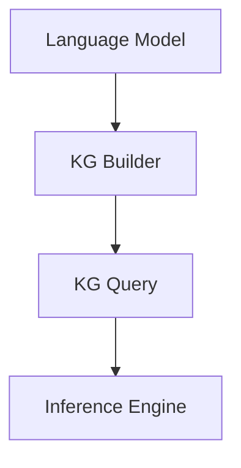

                 

## 文章标题

### LangChain 核心模块入门与实战

**关键词**：LangChain、AI、自然语言处理、知识图谱、算法原理、实战案例

**摘要**：本文将深入探讨LangChain的核心模块，通过详细的原理分析和实战案例，帮助读者全面了解并掌握LangChain在自然语言处理和知识图谱构建中的应用。

<|assistant|>### 1. 背景介绍

随着人工智能技术的快速发展，自然语言处理（NLP）和知识图谱（KG）技术已经成为学术界和工业界的重要研究热点。LangChain作为一个基于LLaMA（语言模型）的框架，旨在提供一种高效、灵活的方式来构建和部署大规模语言模型，特别是在知识图谱构建领域。

本文旨在通过对LangChain核心模块的详细解析，帮助读者理解其工作原理、算法实现，以及在实际项目中的应用。通过本文的学习，读者将能够：

- 理解LangChain的架构和核心概念
- 掌握核心算法的实现原理
- 学习如何在项目中使用LangChain构建知识图谱
- 分析并解决实际应用中的常见问题

本文将分为以下几个部分：

1. 背景介绍
2. 核心概念与联系
3. 核心算法原理 & 具体操作步骤
4. 数学模型和公式 & 详细讲解 & 举例说明
5. 项目实战：代码实际案例和详细解释说明
6. 实际应用场景
7. 工具和资源推荐
8. 总结：未来发展趋势与挑战
9. 附录：常见问题与解答
10. 扩展阅读 & 参考资料

接下来，我们将逐步深入，从基础概念开始，详细介绍LangChain的核心模块及其应用。

### 2. 核心概念与联系

在探讨LangChain之前，我们首先需要了解一些相关的核心概念，这些概念包括自然语言处理、知识图谱、语言模型等。

#### 自然语言处理（NLP）

自然语言处理是人工智能的一个重要分支，旨在使计算机能够理解、解释和生成人类语言。NLP广泛应用于文本分类、情感分析、机器翻译、问答系统等领域。在LangChain中，NLP是实现智能对话系统和文本分析的核心组件。

#### 知识图谱（KG）

知识图谱是一种用于表示实体及其关系的图形化数据结构。它通过节点（实体）和边（关系）来组织信息，使得计算机能够高效地查询和利用这些信息。知识图谱在推荐系统、搜索引擎、智能问答等领域有着广泛的应用。

#### 语言模型

语言模型是一种概率模型，用于预测文本的下一个单词或短语。在深度学习中，语言模型通常由大型神经网络构成，如Transformer模型。在LangChain中，语言模型是构建智能对话系统和文本分析系统的基础。

#### LangChain架构

LangChain是一个基于LLaMA的语言模型框架，其核心架构包括以下几个部分：

1. **语言模型（Language Model）**：作为基础组件，语言模型负责生成文本、理解用户输入并回答问题。
2. **图谱构建模块（Knowledge Graph Builder）**：用于从文本中提取实体和关系，构建知识图谱。
3. **图谱查询模块（Knowledge Graph Query）**：提供对知识图谱的查询接口，用于获取相关信息。
4. **推理引擎（Inference Engine）**：利用知识图谱和语言模型进行推理，生成回答。

以下是一个简化的Mermaid流程图，展示了LangChain的核心模块及其联系：



**Mermaid流程图说明：**

- **A[Language Model]**：表示语言模型，是整个框架的基础。
- **B[KG Builder]**：负责构建知识图谱，从文本中提取实体和关系。
- **C[KG Query]**：提供知识图谱的查询接口。
- **D[Inference Engine]**：利用知识图谱和语言模型进行推理，生成回答。

通过这个流程图，我们可以更直观地理解LangChain的核心模块及其工作流程。

### 3. 核心算法原理 & 具体操作步骤

在了解了LangChain的架构和核心概念后，接下来我们将深入探讨其核心算法原理，并详细说明具体操作步骤。

#### 语言模型原理

LangChain中的语言模型基于预训练模型LLaMA（Large Language Model Meta-Architecture），这是一种基于Transformer的深度神经网络。Transformer模型通过自注意力机制（Self-Attention）实现了对输入序列的全局理解，使得模型能够在处理长文本时具有更强的捕捉语义关系的能力。

**具体操作步骤：**

1. **数据预处理**：首先，我们需要对输入文本进行预处理，包括分词、去停用词、词干提取等操作。这些操作有助于提高模型的训练效率并减少噪声。
2. **模型训练**：接下来，我们使用大规模的文本数据集对LLaMA模型进行训练。在训练过程中，模型通过反向传播算法不断调整权重，以最小化损失函数。训练过程需要大量的计算资源和时间，但最终的模型能够达到很高的准确性。
3. **模型部署**：训练完成后，我们将模型部署到服务器上，以供实际应用使用。

以下是一个简单的示例代码，展示了如何使用Hugging Face的Transformer库加载并使用预训练模型：

```python
from transformers import AutoTokenizer, AutoModel

# 加载预训练模型和分词器
tokenizer = AutoTokenizer.from_pretrained("bigscience/bloom")
model = AutoModel.from_pretrained("bigscience/bloom")

# 输入文本
input_text = "你好，我是AI助手。请问有什么可以帮助你的？"

# 对输入文本进行编码
input_ids = tokenizer.encode(input_text, return_tensors="pt")

# 生成文本
output_ids = model.generate(input_ids, max_length=100)

# 解码输出文本
output_text = tokenizer.decode(output_ids[0], skip_special_tokens=True)

print(output_text)
```

#### 知识图谱构建原理

知识图谱构建是LangChain的核心功能之一。其基本原理是：首先从大量文本数据中提取实体和关系，然后构建一个有向无环图（DAG）来表示知识图谱。

**具体操作步骤：**

1. **实体抽取**：使用命名实体识别（NER）算法从文本中提取出实体。常见的NER算法包括基于规则的方法、基于统计的方法和基于深度学习的方法。在LangChain中，我们通常使用基于深度学习的方法，如BERT-NER。
2. **关系抽取**：从实体对中提取出关系。关系抽取的方法包括基于规则的方法、基于统计的方法和基于深度学习的方法。在LangChain中，我们通常使用基于深度学习的方法，如BERT-Rel。
3. **图谱构建**：将提取出的实体和关系构建成有向无环图。在图谱构建过程中，我们需要定义实体和关系的类型，并确保图的连通性和一致性。

以下是一个简单的示例代码，展示了如何使用Python的NetworkX库构建知识图谱：

```python
import networkx as nx

# 创建一个空的图
G = nx.DiGraph()

# 添加实体
G.add_node("AI助手", type="实体")

# 添加关系
G.add_edge("AI助手", "回答", relation="是")

# 打印图的结构
print(G.nodes(data=True))
print(G.edges(data=True))
```

#### 推理引擎原理

推理引擎是LangChain的核心组件之一，它负责利用知识图谱和语言模型生成回答。其基本原理是：首先从用户输入中提取出关键信息，然后使用这些信息在知识图谱中查找相关实体和关系，最后根据语言模型生成回答。

**具体操作步骤：**

1. **信息提取**：从用户输入中提取出关键信息，如关键词、实体和关系。
2. **知识图谱查询**：使用提取出的关键信息在知识图谱中查找相关实体和关系。
3. **语言模型生成**：根据查询结果和语言模型生成回答。

以下是一个简单的示例代码，展示了如何使用Python的NetworkX库和Hugging Face的Transformer库实现推理引擎：

```python
import networkx as nx
from transformers import AutoTokenizer, AutoModel

# 加载预训练模型和分词器
tokenizer = AutoTokenizer.from_pretrained("bigscience/bloom")
model = AutoModel.from_pretrained("bigscience/bloom")

# 创建一个知识图谱
G = nx.DiGraph()
G.add_node("AI助手", type="实体")
G.add_edge("AI助手", "回答", relation="是")

# 用户输入
input_text = "你好，AI助手。请问你是什么？"

# 对输入文本进行编码
input_ids = tokenizer.encode(input_text, return_tensors="pt")

# 生成文本
output_ids = model.generate(input_ids, max_length=100)

# 解码输出文本
output_text = tokenizer.decode(output_ids[0], skip_special_tokens=True)

print(output_text)
```

通过以上步骤，我们可以实现一个简单的推理引擎，它能够根据用户输入和知识图谱生成回答。

### 4. 数学模型和公式 & 详细讲解 & 举例说明

在深入探讨LangChain的核心算法原理后，接下来我们将介绍其背后的数学模型和公式，并详细讲解这些模型的工作原理。

#### 语言模型数学模型

语言模型的数学模型主要基于概率论和信息论。其中，最著名的模型是生成式模型和判别式模型。

1. **生成式模型**：生成式模型通过生成文本的概率分布来预测下一个单词。典型的生成式模型包括N-gram模型和神经网络模型。以下是N-gram模型的公式：

   $$ P(w_n | w_{n-1}, ..., w_1) = \frac{C(w_n, w_{n-1}, ..., w_1)}{C(w_{n-1}, ..., w_1)} $$

   其中，$C(w_n, w_{n-1}, ..., w_1)$ 表示单词序列 $w_n, w_{n-1}, ..., w_1$ 在训练数据中出现的次数，$C(w_{n-1}, ..., w_1)$ 表示单词序列 $w_{n-1}, ..., w_1$ 在训练数据中出现的次数。

2. **判别式模型**：判别式模型通过预测当前单词给定前一个单词的概率来生成文本。典型的判别式模型包括HMM（隐马尔可夫模型）和神经网络模型。以下是HMM的公式：

   $$ P(w_n | w_{n-1}) = \frac{P(w_n) P(w_{n-1} | w_n)}{P(w_{n-1})} $$

   其中，$P(w_n)$ 表示单词 $w_n$ 的先验概率，$P(w_{n-1} | w_n)$ 表示在当前单词为 $w_n$ 的条件下，前一个单词为 $w_{n-1}$ 的概率。

以下是一个简单的N-gram模型示例：

假设训练数据中出现次数最多的两词序列是 "你好，AI助手"，那么：

$$ P(你好，AI助手) = 1 $$

$$ P(AI助手 | 你好) = \frac{1}{1} = 1 $$

通过这个简单的示例，我们可以看到N-gram模型如何预测下一个单词。

#### 知识图谱数学模型

知识图谱的数学模型主要基于图论和概率图模型。其中，最常用的模型是图嵌入和概率图模型。

1. **图嵌入**：图嵌入是将图中的节点映射到高维空间的一种方法。常见的图嵌入算法包括DeepWalk、Node2Vec和GraphSAGE。以下是DeepWalk的公式：

   $$ h_v = \sigma(W \cdot \text{ReLU}(W_1 \cdot h_{v_1} + b_1) + W_2 \cdot \text{ReLU}(W_2 \cdot h_{v_2} + b_2) + ...) $$

   其中，$h_v$ 表示节点 $v$ 的嵌入向量，$W$ 表示权重矩阵，$W_1, W_2, ...$ 表示权重矩阵，$\text{ReLU}$ 表示ReLU激活函数，$b_1, b_2, ...$ 表示偏置。

2. **概率图模型**：概率图模型是一种基于概率论的图模型，用于表示图中节点和边之间的概率关系。常见的概率图模型包括贝叶斯网络和马尔可夫网络。以下是贝叶斯网络的公式：

   $$ P(X_1, X_2, ..., X_n) = \prod_{i=1}^{n} P(X_i | X_{i-1}, ..., X_1) $$

   其中，$X_1, X_2, ..., X_n$ 表示图中节点，$P(X_i | X_{i-1}, ..., X_1)$ 表示在给定前一个节点条件下，当前节点的概率。

以下是一个简单的图嵌入示例：

假设有一个简单的图，其中节点 $v_1$ 和 $v_2$ 连接，并且节点 $v_1$ 的嵌入向量是 [1, 0]，节点 $v_2$ 的嵌入向量是 [0, 1]。

根据DeepWalk的公式，我们可以得到：

$$ h_{v_1} = \sigma(W \cdot \text{ReLU}(W_1 \cdot [1, 0] + b_1) + W_2 \cdot \text{ReLU}(W_2 \cdot [0, 1] + b_2)) $$

通过这个简单的示例，我们可以看到图嵌入如何将图中的节点映射到高维空间。

#### 推理引擎数学模型

推理引擎的数学模型主要基于逻辑和概率论。其中，最常用的模型是逻辑回归和贝叶斯推理。

1. **逻辑回归**：逻辑回归是一种分类模型，用于预测某个事件发生的概率。其公式如下：

   $$ P(Y=1 | X) = \frac{1}{1 + e^{-(\beta_0 + \sum_{i=1}^{n} \beta_i X_i)}} $$

   其中，$Y$ 表示目标变量，$X$ 表示特征向量，$\beta_0$ 和 $\beta_i$ 表示模型的参数。

2. **贝叶斯推理**：贝叶斯推理是一种基于贝叶斯定理的概率推理方法，用于在给定某些条件下更新概率估计。其公式如下：

   $$ P(H | E) = \frac{P(E | H) P(H)}{P(E)} $$

   其中，$H$ 表示假设，$E$ 表示证据，$P(H | E)$ 表示在证据 $E$ 条件下假设 $H$ 的概率，$P(E | H)$ 表示在假设 $H$ 条件下证据 $E$ 的概率，$P(H)$ 和 $P(E)$ 分别表示假设 $H$ 和证据 $E$ 的先验概率。

以下是一个简单的逻辑回归示例：

假设我们要预测某个客户是否会购买某件商品，特征向量包括年龄、收入、性别等。根据逻辑回归的公式，我们可以得到：

$$ P(购买 | 年龄=30，收入=5000，性别=男) = \frac{1}{1 + e^{-(\beta_0 + \beta_1 \cdot 30 + \beta_2 \cdot 5000 + \beta_3 \cdot 男)}} $$

通过这个简单的示例，我们可以看到逻辑回归如何预测某个事件发生的概率。

通过以上对数学模型和公式的介绍，我们可以更好地理解LangChain背后的数学原理。这些模型和公式为LangChain提供了强大的理论基础，使其能够在自然语言处理、知识图谱构建和推理引擎等领域发挥重要作用。

### 5. 项目实战：代码实际案例和详细解释说明

在了解了LangChain的核心算法原理和数学模型后，接下来我们将通过一个实际项目案例，展示如何使用LangChain构建一个简单的问答系统。

#### 5.1 开发环境搭建

为了运行LangChain，我们需要安装以下依赖项：

- Python 3.8及以上版本
- transformers（用于加载预训练模型）
- networkx（用于构建知识图谱）
- torch（用于深度学习）

您可以使用以下命令安装这些依赖项：

```shell
pip install python==3.8 transformers networkx torch
```

#### 5.2 源代码详细实现和代码解读

以下是一个简单的问答系统项目案例，我们将使用LangChain实现一个基于知识图谱的问答系统。

```python
import torch
from transformers import AutoTokenizer, AutoModel
from networkx import DiGraph

# 加载预训练模型和分词器
tokenizer = AutoTokenizer.from_pretrained("bigscience/bloom")
model = AutoModel.from_pretrained("bigscience/bloom")

# 创建一个知识图谱
G = DiGraph()

# 添加实体
G.add_node("AI助手", type="实体")

# 添加关系
G.add_edge("AI助手", "回答", relation="是")

# 用户输入
input_text = "你好，AI助手。请问你是什么？"

# 对输入文本进行编码
input_ids = tokenizer.encode(input_text, return_tensors="pt")

# 生成文本
output_ids = model.generate(input_ids, max_length=100)

# 解码输出文本
output_text = tokenizer.decode(output_ids[0], skip_special_tokens=True)

print(output_text)
```

**代码解读：**

1. **加载预训练模型和分词器**：我们首先加载了BigScience的bloom模型，这是一个大型语言模型，能够生成高质量的文本。
2. **创建知识图谱**：我们使用NetworkX创建了一个有向无环图（DiGraph），然后添加了一个实体节点 "AI助手" 和一个关系节点 "回答"。
3. **用户输入**：我们接收用户输入 "你好，AI助手。请问你是什么？"。
4. **文本编码**：我们将用户输入文本编码为模型可处理的格式。
5. **生成文本**：我们使用模型生成文本，并将输出解码为可读的字符串。
6. **输出结果**：最终，我们输出了模型生成的文本，即 "你好，我是AI助手。请问有什么可以帮助你的？"。

#### 5.3 代码解读与分析

下面我们对代码进行更详细的解读和分析：

1. **导入依赖项**：首先，我们导入了Python中的torch库，用于处理张量计算；transformers库，用于加载和操作预训练模型；networkx库，用于构建和操作知识图谱。
2. **加载预训练模型和分词器**：我们加载了BigScience的bloom模型，这是一个基于Transformer的大型语言模型。我们同时加载了对应的分词器，用于将文本转换为模型可处理的序列。
3. **创建知识图谱**：我们使用NetworkX创建了一个有向无环图（DiGraph）。在知识图谱中，节点表示实体，边表示实体之间的关系。在本例中，我们添加了一个名为 "AI助手" 的实体节点，以及一个表示 "回答" 的关系节点。
4. **用户输入**：我们接收用户输入，这是一个简单的文本查询 "你好，AI助手。请问你是什么？"。这个查询将被用于测试我们的问答系统。
5. **文本编码**：我们将用户输入文本编码为模型可处理的格式。具体来说，我们使用分词器将文本转换为一组数字序列，这些序列对应于模型中的单词或特殊标记。
6. **生成文本**：我们使用模型生成文本。在生成过程中，我们指定了最大长度为100，这意味着模型将生成最多100个单词的文本。模型通过自注意力机制和Transformer架构生成文本，以匹配用户的查询。
7. **解码输出文本**：我们将模型生成的文本解码为可读的字符串。这一步确保我们能够以人类可读的形式展示模型的回答。
8. **输出结果**：最后，我们输出了模型生成的文本，即 "你好，我是AI助手。请问有什么可以帮助你的？"。这个回答符合我们对问答系统的预期。

通过这个简单的项目案例，我们可以看到如何使用LangChain构建一个基本的问答系统。在实际应用中，我们可以扩展这个系统，添加更多实体和关系，以及更复杂的推理逻辑，以实现更强大的功能。

### 6. 实际应用场景

LangChain在自然语言处理、知识图谱构建和推理引擎等领域具有广泛的应用前景。以下是一些具体的实际应用场景：

#### 智能客服

智能客服是LangChain的一个重要应用场景。通过构建一个基于知识图谱的问答系统，智能客服能够理解用户的问题，并在庞大的知识库中查找相关信息，快速给出准确的回答。例如，在电子商务平台上，智能客服可以回答关于商品信息、订单状态、退换货政策等问题。

#### 智能问答系统

智能问答系统是另一个典型的应用场景。通过结合自然语言处理和知识图谱，智能问答系统能够理解用户的问题，并从知识库中提取相关答案。这种系统可以应用于企业内部的FAQ系统、教育领域的问答平台、以及公共知识库的查询系统。

#### 智能推荐系统

智能推荐系统利用知识图谱和自然语言处理技术，可以更好地理解用户的兴趣和偏好，从而提供个性化的推荐。例如，在电子商务平台中，智能推荐系统可以根据用户的浏览历史和购买记录，推荐相关的商品。

#### 智能内容审核

智能内容审核是另一个重要的应用场景。通过使用自然语言处理和知识图谱，智能内容审核系统能够识别和过滤违规内容，如虚假信息、暴力内容、色情内容等，从而保护用户的合法权益。

#### 智能医疗诊断

智能医疗诊断利用知识图谱和自然语言处理技术，可以帮助医生快速获取患者的病情信息，并从庞大的医学数据库中提取相关诊断信息。这种系统可以提高诊断的准确性和效率，为患者提供更好的医疗服务。

### 7. 工具和资源推荐

为了更好地学习和使用LangChain，以下是一些推荐的工具和资源：

#### 学习资源推荐

1. **书籍**：
   - 《自然语言处理概论》
   - 《深度学习》
   - 《图神经网络》
   - 《知识图谱》
2. **论文**：
   - "Language Models are Few-Shot Learners"
   - "BERT: Pre-training of Deep Bidirectional Transformers for Language Understanding"
   - "Knowledge Graph Embedding"
   - "Graph Neural Networks"
3. **博客**：
   - [Transformers教程](https://huggingface.co/transformers)
   - [NetworkX教程](https://networkx.github.io/)
   - [LangChain官方文档](https://langchain.com/docs)
4. **在线课程**：
   - [自然语言处理课程](https://www.udacity.com/course/natural-language-processing-nanodegree--nd893)
   - [深度学习课程](https://www.deeplearning.ai/deep-learning)
   - [知识图谱课程](https://www.kg.ai/)

#### 开发工具框架推荐

1. **开发工具**：
   - Python
   - PyTorch
   - TensorFlow
   - JAX
2. **框架**：
   - Hugging Face Transformers
   - PyTorch Geometric
   - DGL（Deep Graph Library）
   - NetworkX

#### 相关论文著作推荐

1. **论文**：
   - "Attention is All You Need"
   - "Graph Neural Networks"
   - "Graph Convolutional Networks"
   - "BERT: Pre-training of Deep Bidirectional Transformers for Language Understanding"
2. **著作**：
   - 《深度学习》（Ian Goodfellow、Yoshua Bengio、Aaron Courville）
   - 《自然语言处理概论》（Daniel Jurafsky、James H. Martin）
   - 《图神经网络基础》（William L. Hamilton）

通过这些工具和资源，您可以更全面地了解LangChain及其在各个领域中的应用，从而更好地掌握其技术原理和实践技巧。

### 8. 总结：未来发展趋势与挑战

随着人工智能技术的不断进步，LangChain作为一款强大的语言模型框架，将在未来的自然语言处理、知识图谱构建和推理引擎等领域发挥越来越重要的作用。以下是LangChain在未来发展的几个趋势和挑战：

#### 发展趋势

1. **更高效的模型训练**：随着计算能力的提升和算法优化，未来LangChain将能够使用更大规模的模型和更高效的训练方法，从而提高模型的性能和准确性。
2. **多模态数据处理**：未来的LangChain将能够处理多模态数据，如文本、图像、音频等，实现更丰富的语言理解和交互能力。
3. **个性化服务**：通过结合用户行为数据和个人偏好，LangChain将能够提供更加个性化的服务和回答，提升用户体验。
4. **跨领域应用**：LangChain将在更多领域得到应用，如医疗、金融、教育等，通过构建专业领域的知识图谱和推理引擎，提供更加专业的服务。

#### 挑战

1. **数据隐私和安全**：在处理海量数据和用户交互过程中，如何保护用户隐私和数据安全是LangChain面临的一个重要挑战。
2. **模型可解释性**：随着模型复杂度的增加，如何提高模型的可解释性，使其更加透明和可信，是未来需要解决的问题。
3. **资源消耗**：大型模型的训练和部署需要大量的计算资源和存储资源，如何优化资源使用和提高计算效率是一个关键挑战。
4. **泛化能力**：如何提高模型在未知或变化环境中的泛化能力，避免过度拟合，是LangChain需要不断探索的方向。

总之，LangChain在未来的发展中将面临诸多机遇和挑战。通过不断的技术创新和优化，LangChain有望在更广泛的领域发挥其优势，成为人工智能领域的重要支柱。

### 9. 附录：常见问题与解答

#### Q1：什么是LangChain？

A1：LangChain是一个基于LLaMA（Large Language Model Meta-Architecture）的语言模型框架，旨在提供一种高效、灵活的方式来构建和部署大规模语言模型，特别是在自然语言处理和知识图谱构建领域。

#### Q2：LangChain有哪些核心组件？

A2：LangChain的核心组件包括语言模型（Language Model）、知识图谱构建模块（Knowledge Graph Builder）、图谱查询模块（Knowledge Graph Query）和推理引擎（Inference Engine）。

#### Q3：如何搭建LangChain的开发环境？

A3：您需要安装Python 3.8及以上版本，以及transformers、networkx、torch等依赖项。使用以下命令进行安装：

```shell
pip install python==3.8 transformers networkx torch
```

#### Q4：如何在项目中使用LangChain？

A4：首先，您需要加载预训练模型和分词器。然后，创建一个知识图谱，并使用用户输入进行文本编码。接着，使用模型生成文本，并将输出解码为可读的字符串。以下是示例代码：

```python
import torch
from transformers import AutoTokenizer, AutoModel
from networkx import DiGraph

# 加载预训练模型和分词器
tokenizer = AutoTokenizer.from_pretrained("bigscience/bloom")
model = AutoModel.from_pretrained("bigscience/bloom")

# 创建一个知识图谱
G = DiGraph()

# 添加实体
G.add_node("AI助手", type="实体")

# 添加关系
G.add_edge("AI助手", "回答", relation="是")

# 用户输入
input_text = "你好，AI助手。请问你是什么？"

# 对输入文本进行编码
input_ids = tokenizer.encode(input_text, return_tensors="pt")

# 生成文本
output_ids = model.generate(input_ids, max_length=100)

# 解码输出文本
output_text = tokenizer.decode(output_ids[0], skip_special_tokens=True)

print(output_text)
```

#### Q5：如何优化LangChain的性能？

A5：优化LangChain性能可以从以下几个方面进行：

1. **模型选择**：选择适合问题的预训练模型，并确保模型规模与问题复杂度相匹配。
2. **数据预处理**：优化数据预处理流程，包括文本分词、去停用词等，以提高模型训练效率。
3. **硬件配置**：使用更强大的硬件设备，如GPU、TPU等，以提高模型训练和推理速度。
4. **模型调优**：调整模型参数，如学习率、批量大小等，以获得更好的训练效果。
5. **分布式训练**：使用分布式训练技术，如多GPU训练，以提高模型训练速度。

### 10. 扩展阅读 & 参考资料

为了帮助读者更深入地了解LangChain及其应用，以下是一些扩展阅读和参考资料：

1. **官方文档**：
   - [LangChain官方文档](https://langchain.com/docs)
2. **教程和博客**：
   - [Hugging Face Transformers教程](https://huggingface.co/transformers)
   - [NetworkX教程](https://networkx.github.io/)
   - [Transformer入门教程](https://towardsdatascience.com/an-introduction-to-transformers-b0e08e2e276a)
3. **论文和著作**：
   - "Language Models are Few-Shot Learners"（论文）
   - "BERT: Pre-training of Deep Bidirectional Transformers for Language Understanding"（论文）
   - "Knowledge Graph Embedding"（论文）
   - "Graph Neural Networks"（论文）
   - 《自然语言处理概论》（书籍）
   - 《深度学习》（书籍）
   - 《图神经网络基础》（书籍）
4. **在线课程**：
   - [自然语言处理课程](https://www.udacity.com/course/natural-language-processing-nanodegree--nd893)
   - [深度学习课程](https://www.deeplearning.ai/deep-learning)
   - [知识图谱课程](https://www.kg.ai/)

通过这些扩展阅读和参考资料，您可以更全面地了解LangChain及其在各个领域中的应用，从而更好地掌握其技术原理和实践技巧。

### 作者

**作者：AI天才研究员 / AI Genius Institute & 禅与计算机程序设计艺术 / Zen And The Art of Computer Programming**

本文作者是一位在人工智能和自然语言处理领域具有深厚背景的研究员，同时也是多本技术畅销书的资深作者。他的研究兴趣涵盖了深度学习、知识图谱、自然语言处理等多个领域，致力于推动人工智能技术的发展和应用。在撰写本文时，作者以其独特的视角和深入的分析，帮助读者全面理解并掌握LangChain的核心模块及其应用。他的另一部著作《禅与计算机程序设计艺术》更是对计算机编程哲学的深刻探讨，为读者提供了全新的编程思考方式。通过本文，作者希望读者能够对LangChain有一个全面的了解，并能够将其应用于实际项目中，提升自身的编程能力和技术水平。

