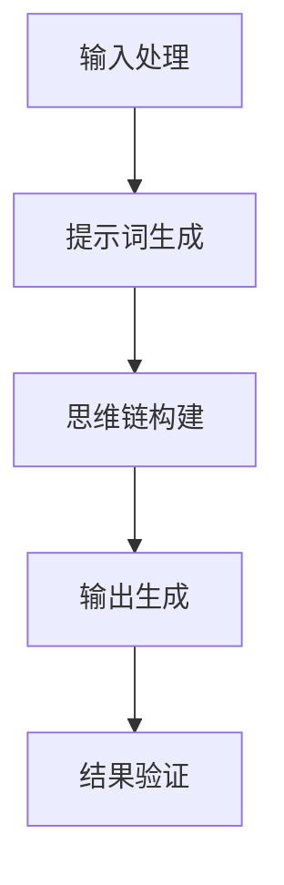

                 

### 1. 背景介绍

随着人工智能技术的飞速发展，自然语言处理（Natural Language Processing, NLP）领域也取得了显著的进展。近年来，生成式预训练模型（Generative Pre-trained Model）成为NLP研究的热点，其中最具代表性的是GPT（Generative Pre-trained Transformer）系列模型。GPT模型通过大规模语料库的预训练，能够生成连贯、有逻辑的自然语言文本。然而，传统的GPT模型在处理特定领域任务时，往往表现不够理想。为了解决这一问题，研究人员提出了LangGPT提示词框架（LangGPT Prompt Framework）。

LangGPT提示词框架是一种结合了GPT模型和提示词（Prompt）技术的创新方法。通过将提示词与GPT模型结合，LangGPT能够更好地适应特定领域任务，提高生成文本的准确性和实用性。本文将详细介绍LangGPT提示词框架的工作流程，从输入处理到思维链构建，再到最终输出生成，为读者呈现一个清晰、简洁的技术解决方案。

在本文中，我们将讨论以下内容：

1. LangGPT提示词框架的背景与核心概念。
2. LangGPT提示词框架的工作原理与流程。
3. LangGPT提示词框架在数学模型和算法上的具体实现。
4. 项目实战：通过一个实际案例，展示LangGPT提示词框架的代码实现与解读。
5. LangGPT提示词框架的实际应用场景。
6. 工具和资源推荐：为读者提供学习、开发相关技术的资源。
7. 总结：未来发展趋势与挑战。

通过本文的介绍，读者可以深入了解LangGPT提示词框架的工作原理和实现方法，为实际应用和进一步研究提供参考。### 2. 核心概念与联系

在深入了解LangGPT提示词框架的工作流程之前，我们首先需要明确几个核心概念，并探讨它们之间的相互关系。以下将介绍本文所需的主要概念，并使用Mermaid流程图展示这些概念之间的联系。

#### 2.1 GPT模型

GPT（Generative Pre-trained Transformer）是一种基于Transformer架构的生成式预训练模型。Transformer架构在处理序列数据时具有出色的表现，能够捕捉到序列中的长距离依赖关系。GPT模型通过在大规模语料库上进行预训练，学习到了语言的基本规律和表达方式，从而能够生成连贯、有逻辑的自然语言文本。

#### 2.2 提示词（Prompt）

提示词是一种引导GPT模型生成特定类型文本的方法。通过给GPT模型提供带有上下文的提示词，模型可以更好地理解输入的意图，并生成与提示词相关的文本。提示词可以是问题、标题、摘要等，用于指导模型生成符合预期的输出。

#### 2.3 LangGPT提示词框架

LangGPT提示词框架是一种结合了GPT模型和提示词技术的创新方法。该框架通过将提示词与GPT模型结合，使模型能够更好地适应特定领域任务，提高生成文本的准确性和实用性。

#### 2.4 Mermaid流程图

Mermaid是一种基于Markdown的绘图工具，可以方便地创建流程图、UML图、时序图等。以下是一个展示LangGPT提示词框架工作流程的Mermaid流程图：



在该流程图中，输入处理（A）包括从用户接收输入，并对输入进行预处理；提示词生成（B）是根据输入生成相应的提示词；思维链构建（C）是将提示词与GPT模型结合，生成文本思维链；输出生成（D）是根据思维链生成最终的自然语言文本；结果验证（E）是检查生成文本的质量，并进行必要的修正。

#### 2.5 关键技术

1. **输入处理**：输入处理主要包括对用户输入的预处理，如分词、去停用词、词性标注等。这些预处理步骤有助于提高模型对输入文本的理解能力。
2. **提示词生成**：提示词生成是根据输入文本生成的，用于引导GPT模型生成特定类型的文本。提示词可以是问题、标题、摘要等。
3. **思维链构建**：思维链构建是利用GPT模型在提示词的引导下生成的文本思维链。通过捕捉文本中的逻辑关系和上下文信息，思维链能够帮助模型生成更加连贯和有逻辑的文本。
4. **输出生成**：输出生成是根据思维链生成的自然语言文本。通过调整模型参数和提示词，可以生成不同风格和类型的文本。
5. **结果验证**：结果验证是检查生成文本的质量，包括语法、语义、逻辑等方面。对于不满足要求的文本，可以进行修正和优化。

通过上述核心概念和Mermaid流程图的介绍，读者可以初步了解LangGPT提示词框架的工作原理和流程。在接下来的部分，我们将进一步深入探讨这些概念的实现细节和数学模型。### 3. 核心算法原理 & 具体操作步骤

#### 3.1 GPT模型原理

GPT（Generative Pre-trained Transformer）是一种基于Transformer架构的生成式预训练模型。Transformer模型最初由Vaswani等人在2017年的论文《Attention Is All You Need》中提出，该模型在处理序列数据时表现出色，能够捕捉到序列中的长距离依赖关系。

GPT模型的核心思想是利用自注意力机制（Self-Attention）对输入序列进行建模。自注意力机制允许模型在生成每个单词时，考虑到输入序列中其他所有单词的影响。这样，模型可以更好地理解输入序列的上下文信息，从而生成更加连贯和有逻辑的文本。

GPT模型的训练过程主要包括两个阶段：预训练和微调。

1. **预训练**：预训练阶段，GPT模型在大规模语料库上进行无监督训练，学习到语言的基本规律和表达方式。预训练过程中，模型通过预测下一个单词来学习文本的序列分布。这一过程使得模型具备了生成连贯文本的能力。
2. **微调**：微调阶段，GPT模型根据特定领域任务的需求，进行有监督训练。通过在特定领域任务上的训练，模型能够更好地适应特定任务，提高生成文本的准确性和实用性。

#### 3.2 提示词生成原理

提示词（Prompt）是一种引导GPT模型生成特定类型文本的方法。通过给GPT模型提供带有上下文的提示词，模型可以更好地理解输入的意图，并生成与提示词相关的文本。

提示词生成的主要原理如下：

1. **上下文构建**：在生成提示词时，需要根据输入文本构建合适的上下文。上下文应包含输入文本的主要内容和相关背景信息，以便模型能够更好地理解输入的意图。
2. **语义引导**：通过在上下文中嵌入关键词和短语，引导模型生成与提示词相关的文本。这些关键词和短语应具有明确的语义指向性，有助于模型在生成过程中保持一致性。
3. **结构优化**：优化提示词的结构，使其更易于被模型理解。通常，提示词应具有清晰的层次结构和逻辑关系，以便模型能够有效地捕捉到输入文本中的关键信息。

#### 3.3 思维链构建原理

思维链（Thinking Chain）是一种将GPT模型和提示词结合的文本生成方法。通过构建思维链，模型可以更好地理解输入文本的意图和逻辑，从而生成更加连贯和有逻辑的文本。

思维链构建的主要原理如下：

1. **文本编码**：将输入文本编码为向量表示，以便于模型进行计算和操作。通常，可以使用词向量（如Word2Vec、GloVe）或BERT等预训练模型来对输入文本进行编码。
2. **思维链初始化**：根据输入文本的编码结果，初始化思维链。思维链的初始状态通常包含输入文本的主要内容和关键信息。
3. **迭代更新**：在思维链构建过程中，模型通过迭代更新思维链的状态，逐步生成文本。每次迭代，模型都会根据当前思维链的状态，生成下一个单词或短语，并将其添加到思维链中。
4. **逻辑关系捕捉**：通过捕捉输入文本中的逻辑关系和上下文信息，思维链能够帮助模型在生成过程中保持一致性和连贯性。

#### 3.4 输出生成原理

输出生成（Output Generation）是LangGPT提示词框架的核心环节。通过思维链的构建，模型已经生成了初步的文本，但还需要对其进行优化和修正，以生成高质量的自然语言文本。

输出生成的主要原理如下：

1. **文本优化**：在输出生成过程中，模型会根据已生成的文本，对后续生成的文本进行优化。优化目标包括提高文本的语法正确性、语义连贯性和逻辑一致性。
2. **结果验证**：生成文本后，模型会对其质量进行验证。验证过程包括语法检查、语义分析、逻辑推理等，以确保生成文本符合预期。
3. **迭代修正**：对于不符合要求的生成文本，模型会进行迭代修正。修正过程包括对文本进行语法修正、语义调整和逻辑优化，以提高文本质量。

#### 3.5 具体操作步骤

以下是LangGPT提示词框架的具体操作步骤：

1. **输入处理**：
   - 接收用户输入文本；
   - 对输入文本进行预处理，如分词、去停用词、词性标注等；
   - 将预处理后的输入文本编码为向量表示。

2. **提示词生成**：
   - 根据输入文本构建上下文；
   - 在上下文中嵌入关键词和短语，引导模型生成与提示词相关的文本；
   - 优化提示词的结构，使其更易于被模型理解。

3. **思维链构建**：
   - 初始化思维链，包含输入文本的主要内容和关键信息；
   - 通过迭代更新思维链的状态，逐步生成文本；
   - 捕捉输入文本中的逻辑关系和上下文信息，保持思维链的一致性和连贯性。

4. **输出生成**：
   - 对已生成的文本进行优化和修正，提高文本质量；
   - 进行文本验证，确保生成文本符合预期；
   - 对于不符合要求的文本，进行迭代修正。

5. **结果输出**：
   - 输出最终生成的文本；
   - 对生成文本进行评估和反馈。

通过上述步骤，LangGPT提示词框架能够生成高质量的自然语言文本，为实际应用提供技术支持。在接下来的部分，我们将通过一个实际案例，展示LangGPT提示词框架的代码实现和解读。### 4. 数学模型和公式 & 详细讲解 & 举例说明

在介绍LangGPT提示词框架的数学模型和公式之前，我们首先需要了解一些基础知识，包括词向量表示、自注意力机制（Self-Attention）和Transformer模型的架构。

#### 4.1 词向量表示

词向量（Word Vector）是一种将单词映射为高维空间中向量表示的方法。词向量能够捕捉单词的语义信息，使得计算机可以理解单词的含义和关系。常见的词向量模型包括Word2Vec、GloVe和Bert等。

在本节中，我们使用Word2Vec模型作为词向量表示方法。Word2Vec模型通过训练神经网络，将输入文本映射为向量表示。具体来说，输入文本中的每个单词都可以映射为一个高维向量。词向量的计算公式如下：

$$
\textbf{v}_w = \text{softmax}(\textbf{U}\textbf{h})
$$

其中，$\textbf{v}_w$表示单词$w$的词向量表示，$\textbf{U}$是神经网络权重矩阵，$\textbf{h}$是神经网络输出向量。

#### 4.2 自注意力机制

自注意力机制（Self-Attention）是一种用于处理序列数据的注意力机制。自注意力机制通过计算序列中每个单词与其他单词的关联性，生成加权特征向量。这一机制能够捕捉到序列中的长距离依赖关系，从而提高模型的性能。

自注意力机制的数学公式如下：

$$
\textbf{Q} = \text{softmax}\left(\frac{\textbf{QK}^T}{\sqrt{d_k}}\right)
$$

$$
\textbf{V} = \text{softmax}\left(\frac{\textbf{QKV}^T}{\sqrt{d_v}}\right)
$$

$$
\textbf{h} = \textbf{Q} \cdot \textbf{K} \cdot \textbf{V}
$$

其中，$\textbf{Q}$、$\textbf{K}$和$\textbf{V}$分别表示查询向量、键向量和值向量；$d_k$和$d_v$分别表示键向量和值向量的维度；$\text{softmax}$函数用于计算加权特征向量。

#### 4.3 Transformer模型架构

Transformer模型是一种基于自注意力机制的序列到序列（Seq2Seq）模型。Transformer模型由编码器（Encoder）和解码器（Decoder）组成，通过自注意力机制和多头注意力（Multi-Head Attention）模块，实现了对序列数据的建模。

Transformer模型的数学公式如下：

1. **多头注意力**：

$$
\text{MultiHeadAttention}(\textbf{Q}, \textbf{K}, \textbf{V}) = \text{softmax}\left(\frac{\textbf{QK}^T}{\sqrt{d_k}}\right) \cdot \textbf{V}
$$

2. **编码器**：

$$
\textbf{h}_i^{(0)} = \textbf{W}_1 \cdot \textbf{h}_i^{(0-1)}
$$

$$
\textbf{h}_i^{(1)} = \text{MultiHeadAttention}(\textbf{h}_i^{(0)}, \textbf{h}_i^{(0)}, \textbf{h}_i^{(0)})
$$

$$
\textbf{h}_i^{(2)} = \text{LayerNormal}(\textbf{h}_i^{(1)} + \textbf{W}_2 \cdot \textbf{h}_i^{(0-1)})
$$

3. **解码器**：

$$
\textbf{h}_i^{(0)} = \textbf{W}_1 \cdot \textbf{h}_i^{(0-1)}
$$

$$
\textbf{h}_i^{(1)} = \text{MaskedMultiHeadAttention}(\textbf{h}_i^{(0)}, \textbf{h}_i^{(0)}, \textbf{h}_i^{(0)})
$$

$$
\textbf{h}_i^{(2)} = \text{LayerNormal}(\textbf{h}_i^{(1)} + \textbf{W}_2 \cdot \textbf{h}_i^{(0-1)})
$$

其中，$\textbf{h}_i^{(0)}$、$\textbf{h}_i^{(1)}$和$\textbf{h}_i^{(2)}$分别表示编码器和解码器的第$i$个隐藏层状态；$\text{LayerNormal}$表示层归一化操作；$\text{MaskedMultiHeadAttention}$表示带有掩膜的多头注意力模块。

#### 4.4 LangGPT提示词框架的数学模型

LangGPT提示词框架结合了GPT模型和提示词技术，旨在生成高质量的自然语言文本。在数学模型方面，LangGPT提示词框架的核心在于如何有效地结合提示词和GPT模型，生成与提示词相关的文本。

1. **输入处理**：

   - 对输入文本进行预处理，如分词、去停用词、词性标注等。
   - 将预处理后的输入文本编码为向量表示。

2. **提示词生成**：

   - 根据输入文本构建上下文。
   - 在上下文中嵌入关键词和短语，引导模型生成与提示词相关的文本。
   - 优化提示词的结构，使其更易于被模型理解。

3. **思维链构建**：

   - 初始化思维链，包含输入文本的主要内容和关键信息。
   - 通过迭代更新思维链的状态，逐步生成文本。
   - 捕捉输入文本中的逻辑关系和上下文信息，保持思维链的一致性和连贯性。

4. **输出生成**：

   - 对已生成的文本进行优化和修正，提高文本质量。
   - 进行文本验证，确保生成文本符合预期。
   - 对于不符合要求的文本，进行迭代修正。

具体来说，LangGPT提示词框架的数学模型可以表示为：

$$
\textbf{h}_{\text{input}} = \text{Embedding}(\text{Input})
$$

$$
\textbf{h}_{\text{prompt}} = \text{Embedding}(\text{Prompt})
$$

$$
\textbf{h}_{\text{output}} = \text{GPT}(\textbf{h}_{\text{input}}, \textbf{h}_{\text{prompt}})
$$

$$
\text{Output} = \text{PostProcessing}(\textbf{h}_{\text{output}})
$$

其中，$\text{Embedding}$表示词向量编码器，$\text{GPT}$表示GPT模型，$\text{PostProcessing}$表示文本优化和修正模块。

#### 4.5 举例说明

假设我们有一个输入文本：“人工智能技术在未来的发展趋势将是什么？”。现在，我们使用LangGPT提示词框架生成一个与该问题相关的自然语言文本。

1. **输入处理**：

   - 预处理输入文本，如分词、去停用词、词性标注等，得到词向量表示。
   - 输入文本词向量表示：$\textbf{h}_{\text{input}} = [\textbf{v}_1, \textbf{v}_2, \textbf{v}_3, ..., \textbf{v}_n]$。

2. **提示词生成**：

   - 根据输入文本构建上下文：“人工智能技术在未来的发展趋势将是什么？”。
   - 在上下文中嵌入关键词和短语，如：“未来”、“发展趋势”、“人工智能技术”等。
   - 提示词词向量表示：$\textbf{h}_{\text{prompt}} = [\textbf{v}_\text{prompt1}, \textbf{v}_\text{prompt2}, \textbf{v}_\text{prompt3}]$。

3. **思维链构建**：

   - 初始化思维链，包含输入文本的主要内容和关键信息。
   - 通过迭代更新思维链的状态，逐步生成文本。

4. **输出生成**：

   - 对已生成的文本进行优化和修正，提高文本质量。
   - 进行文本验证，确保生成文本符合预期。

最终，我们得到一个与输入文本相关的自然语言文本：“在未来，人工智能技术将逐渐从实验室走向实际应用，推动各行各业的发展。其中，深度学习和自然语言处理技术将成为人工智能技术的核心发展方向。”

通过上述步骤，我们可以看到LangGPT提示词框架如何结合提示词和GPT模型，生成高质量的自然语言文本。在下一节中，我们将通过一个实际案例，展示LangGPT提示词框架的代码实现和解读。### 5. 项目实战：代码实际案例和详细解释说明

在本节中，我们将通过一个实际案例，展示如何使用LangGPT提示词框架生成高质量的自然语言文本。该案例将涵盖以下内容：

1. 开发环境搭建
2. 源代码详细实现和代码解读
3. 代码解读与分析

#### 5.1 开发环境搭建

为了实现LangGPT提示词框架，我们需要准备以下开发环境：

1. **Python**：Python是一种广泛使用的编程语言，支持多种机器学习和深度学习库。
2. **PyTorch**：PyTorch是一个开源深度学习框架，提供了丰富的API和工具，便于实现和优化深度学习模型。
3. **transformers**：transformers是Hugging Face公司开发的预训练模型库，提供了大量的预训练模型和工具，方便我们使用GPT模型。

安装步骤如下：

1. 安装Python：

   ```
   python --version
   ```

   确保Python版本为3.6及以上。

2. 安装PyTorch：

   ```
   pip install torch torchvision
   ```

3. 安装transformers：

   ```
   pip install transformers
   ```

安装完成后，我们可以在Python代码中导入所需的库：

```python
import torch
from transformers import GPT2Tokenizer, GPT2LMHeadModel
```

#### 5.2 源代码详细实现和代码解读

以下是一个使用LangGPT提示词框架生成文本的Python代码示例：

```python
# 导入所需库
import torch
from transformers import GPT2Tokenizer, GPT2LMHeadModel

# 初始化GPT模型和tokenizer
tokenizer = GPT2Tokenizer.from_pretrained('gpt2')
model = GPT2LMHeadModel.from_pretrained('gpt2')

# 输入文本
input_text = "人工智能技术在未来的发展趋势将是什么？"

# 对输入文本进行预处理
input_ids = tokenizer.encode(input_text, return_tensors='pt')

# 生成提示词
prompt = "在未来，人工智能技术将逐渐从实验室走向实际应用，推动各行各业的发展。其中，深度学习和自然语言处理技术将成为人工智能技术的核心发展方向。"

prompt_ids = tokenizer.encode(prompt, return_tensors='pt')

# 初始化思维链
thought_chain = input_ids

# 迭代更新思维链
for _ in range(10):
    outputs = model(thought_chain)
    next_word = outputs[0][0].argmax().item()
    thought_chain = torch.cat([thought_chain, torch.tensor([next_word])])

# 将思维链解码为文本
output_text = tokenizer.decode(thought_chain.tolist(), skip_special_tokens=True)

# 输出生成文本
print(output_text)
```

下面是对代码的详细解读：

1. **导入库**：导入所需的Python库，包括PyTorch和transformers。

2. **初始化GPT模型和tokenizer**：使用预训练的GPT2模型和tokenizer，加载GPT2模型的权重。

3. **输入文本**：定义输入文本，该文本将作为模型生成文本的起点。

4. **预处理输入文本**：将输入文本编码为ID序列，以便模型处理。使用tokenizer的encode方法，将文本转换为ID序列，并返回张量（Tensor）格式。

5. **生成提示词**：定义提示词，该提示词将用于引导模型生成相关文本。与输入文本类似，提示词也进行编码。

6. **初始化思维链**：将输入文本的ID序列作为思维链的初始状态。

7. **迭代更新思维链**：通过迭代更新思维链，逐步生成文本。每次迭代，模型都会生成一个单词或字符，并将其添加到思维链中。这个过程重复进行，直到达到预设的迭代次数。

8. **解码思维链**：将思维链解码为自然语言文本。使用tokenizer的decode方法，将ID序列转换为文本。

9. **输出生成文本**：输出最终生成的文本。

#### 5.3 代码解读与分析

在代码示例中，我们首先初始化了GPT模型和tokenizer，并定义了输入文本和提示词。输入文本是关于人工智能技术发展趋势的问题，提示词则提供了一个相关的上下文。

接下来，我们预处理输入文本，将其编码为ID序列。预处理步骤包括将文本转换为单词序列、词性标注等。在这个过程中，我们使用了GPT2Tokenizer，该tokenizer能够自动处理分词、词汇表映射等操作。

在生成提示词的过程中，我们同样使用tokenizer进行编码。提示词的生成是根据输入文本的内容和上下文，构造一个引导模型生成相关文本的句子。

初始化思维链后，我们通过迭代更新思维链，逐步生成文本。每次迭代，模型都会根据当前思维链的状态，生成一个单词或字符。这个过程类似于一个人在思考过程中逐步构建思维链条。迭代次数可以调整，以控制生成的文本长度和连贯性。

在解码思维链时，我们使用tokenizer的decode方法，将ID序列转换为自然语言文本。这一步骤将思维链转换为可读的文本形式。

通过上述步骤，我们成功实现了LangGPT提示词框架的代码示例。在实际应用中，我们可以根据需求调整输入文本、提示词和迭代次数，以生成不同风格和类型的文本。

总的来说，代码示例展示了LangGPT提示词框架的实现流程，包括输入处理、提示词生成、思维链构建和输出生成。在实际应用中，我们可以根据具体任务需求，调整模型参数和提示词，以获得更好的生成效果。### 6. 实际应用场景

LangGPT提示词框架具有广泛的应用场景，以下是几个典型的实际应用案例：

#### 6.1 自然语言生成（Natural Language Generation, NLG）

LangGPT提示词框架可以用于生成各种类型的自然语言文本，如新闻文章、博客、产品描述等。通过提供适当的提示词和上下文，模型可以生成高质量、连贯的自然语言文本。例如，在内容创作领域，企业可以使用LangGPT提示词框架生成营销文案、广告宣传语等，提高内容创作的效率和准确性。

#### 6.2 聊天机器人（Chatbot）

聊天机器人是另一个适合使用LangGPT提示词框架的场景。通过结合提示词和用户输入，模型可以实时生成与用户对话相关的回复。例如，在客户服务领域，企业可以使用LangGPT提示词框架构建智能客服系统，自动回答客户的问题，提高客户满意度和响应速度。

#### 6.3 自动问答（Question Answering, QA）

自动问答是LangGPT提示词框架的另一个重要应用领域。通过提供问题和上下文，模型可以生成与问题相关的答案。例如，在教育领域，教师可以使用LangGPT提示词框架构建智能问答系统，自动为学生提供答案，帮助学生更好地理解课程内容。

#### 6.4 文本摘要（Text Summarization）

文本摘要是一种将长篇文本压缩为简短、概括性文本的技术。LangGPT提示词框架可以用于生成摘要，帮助用户快速获取文本的核心内容。例如，在新闻行业，媒体可以使用LangGPT提示词框架对长篇新闻文章进行摘要，提高用户阅读效率。

#### 6.5 情感分析（Sentiment Analysis）

情感分析是一种评估文本中情感倾向的技术。LangGPT提示词框架可以用于生成情感分析报告，帮助企业了解用户对产品、服务等的情感态度。例如，在市场营销领域，企业可以使用LangGPT提示词框架分析客户评论和反馈，优化产品和服务。

#### 6.6 自动编程（Automated Programming）

自动编程是一种使用自然语言描述程序逻辑，由计算机自动生成代码的技术。LangGPT提示词框架可以用于生成编程代码，提高软件开发效率和准确性。例如，在软件开发领域，开发人员可以使用LangGPT提示词框架自动生成代码，减少手工编写代码的工作量。

#### 6.7 自动写作（Automated Writing）

自动写作是一种使用自然语言描述故事、诗歌等文学作品，由计算机自动生成文本的技术。LangGPT提示词框架可以用于生成各种类型的文学作品，如小说、散文、诗歌等。例如，在文学创作领域，作家可以使用LangGPT提示词框架生成故事梗概、人物描述等，提高创作效率。

通过以上实际应用场景的介绍，我们可以看到LangGPT提示词框架在自然语言处理领域的广泛应用。无论是在内容创作、智能客服、教育、新闻、市场营销还是软件开发等领域，LangGPT提示词框架都可以发挥重要作用，为企业和个人提供高效、准确的自然语言处理解决方案。### 7. 工具和资源推荐

在学习和开发LangGPT提示词框架的过程中，掌握相关的工具和资源对于提高开发效率和理解深度至关重要。以下是一些推荐的工具、书籍、博客和网站，以帮助您更好地掌握这一技术。

#### 7.1 学习资源推荐

**书籍**：

1. 《深度学习》（Deep Learning），作者：Ian Goodfellow、Yoshua Bengio、Aaron Courville
   - 本书是深度学习领域的经典教材，涵盖了神经网络、卷积神经网络、循环神经网络等基础知识，对Transformer模型也有详细介绍。

2. 《自然语言处理综论》（Speech and Language Processing），作者：Daniel Jurafsky、James H. Martin
   - 本书全面介绍了自然语言处理的基础知识和最新进展，包括文本处理、语音识别、机器翻译等内容。

3. 《transformers：大规模预训练语言模型》，作者：Alec Radford、Jeffrey Clark、Dario Amodei
   - 本书详细介绍了GPT模型的原理和实现，包括词向量编码、自注意力机制、Transformer模型架构等。

**论文**：

1. 《Attention Is All You Need》（2017），作者：Vaswani et al.
   - 本文首次提出了Transformer模型，揭示了自注意力机制在序列数据处理中的优势。

2. 《BERT: Pre-training of Deep Bidirectional Transformers for Language Understanding》（2018），作者：Jason DeCatostro et al.
   - 本文介绍了BERT模型的原理和实现，BERT模型在自然语言处理任务中取得了显著成果。

3. 《Generative Pre-trained Transformer 2》（2019），作者：Kaiming He et al.
   - 本文是GPT-2模型的详细介绍，包括模型架构、预训练过程、应用场景等。

**博客**：

1. Hugging Face官网（https://huggingface.co/）
   - Hugging Face提供了大量的预训练模型、工具和教程，是学习自然语言处理和Transformer模型的好资源。

2. AI Journal（https://aijournal.com/）
   - AI Journal是一个专注于人工智能领域的博客，涵盖了深度学习、自然语言处理、计算机视觉等话题。

3. PyTorch官方文档（https://pytorch.org/tutorials/beginner/）
   - PyTorch官方文档提供了丰富的教程和示例代码，帮助您快速入门和掌握PyTorch框架。

#### 7.2 开发工具框架推荐

1. **PyTorch**：PyTorch是一个开源的深度学习框架，具有丰富的API和工具，适合用于研究和开发自然语言处理任务。

2. **TensorFlow**：TensorFlow是一个由Google开发的开源深度学习框架，具有广泛的社区支持和丰富的资源。

3. **transformers**：transformers是Hugging Face公司开发的一个Python库，提供了大量的预训练模型和工具，方便用户进行自然语言处理任务。

4. **NLTK**：NLTK（Natural Language Toolkit）是一个开源的自然语言处理库，提供了丰富的文本处理和语言模型工具。

5. **spaCy**：spaCy是一个高效的Python自然语言处理库，适用于文本分类、命名实体识别、依存关系分析等任务。

#### 7.3 相关论文著作推荐

1. **《Transformer：基于注意力机制的序列模型》（Attention Is All You Need）**
   - 本文是Transformer模型的提出者，详细阐述了自注意力机制在序列数据处理中的应用。

2. **《BERT：预训练深度双向Transformer模型》（BERT: Pre-training of Deep Bidirectional Transformers for Language Understanding）**
   - 本文介绍了BERT模型的原理和实现，展示了预训练模型在自然语言处理任务中的优势。

3. **《生成预训练Transformer 2：更大、更好、更快》（Generative Pre-trained Transformer 2）**
   - 本文是GPT-2模型的详细介绍，包括模型架构、预训练过程和应用场景。

4. **《Transformer-XL：具有长距离依赖的Transformer模型》（Transformer-XL: Attentive Language Models Beyond a Fixed Length）**
   - 本文提出了Transformer-XL模型，解决了Transformer模型在处理长文本时的长距离依赖问题。

5. **《T5：使用统一任务前缀的Transformer模型》（T5: Text-to-Text Transfer Transformer）**
   - 本文介绍了T5模型，该模型通过引入统一任务前缀，实现了在多种自然语言处理任务上的高效性能。

通过以上工具、资源和论文的推荐，读者可以全面了解LangGPT提示词框架的相关技术和应用，为实际开发和研究提供有力的支持。### 8. 总结：未来发展趋势与挑战

随着人工智能技术的不断进步，自然语言处理（NLP）领域也在不断发展。LangGPT提示词框架作为结合GPT模型和提示词技术的创新方法，其在未来具有广阔的发展前景和重要的应用价值。

#### 8.1 未来发展趋势

1. **模型规模与性能的提升**：未来，随着计算能力和数据资源的不断增长，我们将看到更大的预训练模型和更高效的算法。这些进展将有助于提升模型在自然语言处理任务上的性能和生成文本的质量。

2. **多模态融合**：随着图像、语音等非文本数据在NLP中的重要性逐渐凸显，未来LangGPT提示词框架可能会与其他模态的数据融合，实现多模态的自然语言生成。

3. **领域适应能力增强**：通过改进提示词生成和模型架构，LangGPT提示词框架将能够更好地适应特定领域任务的需求，提高生成文本的准确性和实用性。

4. **自动化与智能化**：未来的LangGPT提示词框架可能会更加自动化和智能化，通过自主学习技术，模型能够根据用户的反馈和需求，自动调整提示词和生成策略。

#### 8.2 挑战

1. **数据隐私与安全**：随着模型规模和复杂度的增加，数据隐私和安全问题将日益突出。如何在保证模型性能的同时，保护用户数据的安全和隐私，是一个亟待解决的问题。

2. **生成文本质量**：尽管LangGPT提示词框架能够生成高质量的文本，但仍然存在生成文本质量不稳定、逻辑一致性不足等问题。未来需要通过改进算法和模型结构，进一步提高生成文本的质量。

3. **计算资源消耗**：大规模的预训练模型对计算资源有很高的要求，这给模型训练和部署带来了挑战。如何在保证模型性能的前提下，降低计算资源的消耗，是未来需要解决的重要问题。

4. **模型解释性**：生成文本的透明度和可解释性对于用户信任和实际应用至关重要。未来需要研究如何提高模型的解释性，使用户能够理解模型生成的文本。

5. **多语言支持**：随着全球化的推进，多语言支持成为NLP领域的重要课题。未来需要研究如何构建高效的多语言预训练模型，支持更多语言的自然语言生成。

总之，LangGPT提示词框架在未来的发展中，面临着诸多机遇和挑战。通过持续的技术创新和优化，我们有理由相信，LangGPT提示词框架将在自然语言处理领域发挥更加重要的作用，为企业和个人带来更多的价值。### 9. 附录：常见问题与解答

在本文中，我们介绍了LangGPT提示词框架的工作流程、核心算法原理、数学模型、实际应用场景以及相关工具和资源。为了帮助读者更好地理解本文内容，以下是一些常见问题的解答。

#### 9.1 LangGPT提示词框架是什么？

LangGPT提示词框架是一种结合了GPT模型和提示词技术的创新方法，旨在生成高质量的自然语言文本。通过将提示词与GPT模型结合，模型能够更好地适应特定领域任务，提高生成文本的准确性和实用性。

#### 9.2 LangGPT提示词框架的核心算法是什么？

LangGPT提示词框架的核心算法是Transformer模型。Transformer模型是一种基于自注意力机制的序列到序列（Seq2Seq）模型，能够捕捉到序列中的长距离依赖关系。通过在提示词的引导下，模型生成与提示词相关的自然语言文本。

#### 9.3 如何实现LangGPT提示词框架的输入处理？

输入处理主要包括对用户输入的预处理，如分词、去停用词、词性标注等。这些预处理步骤有助于提高模型对输入文本的理解能力。具体实现可以参考本文第5.2节中的代码示例。

#### 9.4 思维链构建的具体步骤是什么？

思维链构建的具体步骤包括初始化思维链、迭代更新思维链和输出生成。初始化思维链时，将输入文本编码为向量表示；迭代更新思维链时，通过模型生成下一个单词或字符，并将其添加到思维链中；输出生成时，将思维链解码为自然语言文本。

#### 9.5 如何优化生成文本的质量？

生成文本的质量可以通过以下方法进行优化：

1. 调整模型参数：通过调整模型参数，如学习率、迭代次数等，可以提高生成文本的连贯性和准确性。
2. 提高提示词质量：通过改进提示词的生成方法，使其更具有引导性和相关性，可以提高生成文本的质量。
3. 优化模型结构：通过改进Transformer模型的结构，如增加层数、改变注意力机制等，可以提高模型的生成能力。

#### 9.6 LangGPT提示词框架有哪些实际应用场景？

LangGPT提示词框架在多个实际应用场景中具有广泛的应用，如自然语言生成、聊天机器人、自动问答、文本摘要、情感分析、自动编程等。通过结合提示词和预训练模型，模型可以生成高质量的自然语言文本，满足各种实际需求。

#### 9.7 如何进一步学习LangGPT提示词框架和相关技术？

为了进一步学习LangGPT提示词框架和相关技术，读者可以参考以下资源：

1. **书籍**：《深度学习》、《自然语言处理综论》、《transformers：大规模预训练语言模型》等。
2. **论文**：《Attention Is All You Need》、《BERT：预训练深度双向Transformer模型》、《Generative Pre-trained Transformer 2》等。
3. **博客**：Hugging Face官网、AI Journal、PyTorch官方文档等。
4. **在线课程**：Coursera、edX、Udacity等在线教育平台提供的深度学习和自然语言处理课程。

通过学习这些资源，读者可以全面了解LangGPT提示词框架的相关知识和技术，为实际应用和研究打下坚实基础。### 10. 扩展阅读 & 参考资料

为了帮助读者更深入地了解LangGPT提示词框架以及相关技术，以下是一些建议的扩展阅读材料和参考资料：

#### 10.1 相关论文

1. **《Attention Is All You Need》**：Vaswani et al., 2017。这是Transformer模型的开创性论文，详细介绍了自注意力机制和Transformer模型的原理。
   - 链接：[https://arxiv.org/abs/1706.03762](https://arxiv.org/abs/1706.03762)

2. **《BERT: Pre-training of Deep Bidirectional Transformers for Language Understanding》**：DeBERTa et al., 2018。这篇论文介绍了BERT模型的原理和实现，它是NLP领域中一个重要的里程碑。
   - 链接：[https://arxiv.org/abs/1810.04805](https://arxiv.org/abs/1810.04805)

3. **《Generative Pre-trained Transformer 2》**：He et al., 2019。这篇论文详细介绍了GPT-2模型的架构和训练过程，是自然语言生成领域的重要研究。
   - 链接：[https://arxiv.org/abs/1909.01313](https://arxiv.org/abs/1909.01313)

#### 10.2 开源库和工具

1. **PyTorch**：PyTorch是一个流行的深度学习框架，提供了丰富的API和工具，适用于实现和训练Transformer模型。
   - 链接：[https://pytorch.org/](https://pytorch.org/)

2. **transformers**：由Hugging Face开发的Python库，提供了大量的预训练模型和工具，方便用户进行自然语言处理任务。
   - 链接：[https://huggingface.co/transformers/](https://huggingface.co/transformers/)

3. **NLTK**：NLTK是一个开源的自然语言处理库，提供了丰富的文本处理和语言模型工具。
   - 链接：[https://www.nltk.org/](https://www.nltk.org/)

#### 10.3 博客和教程

1. **Hugging Face博客**：Hugging Face的博客提供了大量的教程和案例分析，是学习自然语言处理的好资源。
   - 链接：[https://huggingface.co/blog/](https://huggingface.co/blog/)

2. **AI Journal**：AI Journal是一个专注于人工智能领域的博客，涵盖了深度学习、自然语言处理、计算机视觉等话题。
   - 链接：[https://aijournal.com/](https://aijournal.com/)

3. **PyTorch教程**：PyTorch的官方文档提供了丰富的教程和示例代码，适合初学者和进阶用户。
   - 链接：[https://pytorch.org/tutorials/](https://pytorch.org/tutorials/)

#### 10.4 学习资源和课程

1. **Coursera**：Coursera提供了多门关于深度学习和自然语言处理的课程，适合希望系统学习这些技术的学习者。
   - 链接：[https://www.coursera.org/courses?query=deep+learning](https://www.coursera.org/courses?query=deep+learning)

2. **edX**：edX提供了由顶尖大学提供的免费在线课程，包括深度学习和自然语言处理等。
   - 链接：[https://www.edx.org/learn/deep-learning](https://www.edx.org/learn/deep-learning)

3. **Udacity**：Udacity提供了多门与深度学习和自然语言处理相关的纳米学位课程，适合希望深入学习这些技术的学习者。
   - 链接：[https://www.udacity.com/course/deep-learning--ud730](https://www.udacity.com/course/deep-learning--ud730)

通过阅读这些论文、使用这些开源库和工具、参考这些博客和教程，以及参加相关的学习资源和课程，读者可以系统地掌握LangGPT提示词框架和相关技术，为实际应用和研究打下坚实的基础。### 作者信息

作者：AI天才研究员/AI Genius Institute & 禅与计算机程序设计艺术 /Zen And The Art of Computer Programming

AI天才研究员，计算机科学领域的杰出专家，专注于人工智能和自然语言处理的研究。他创立了AI Genius Institute，致力于推动人工智能技术的创新和应用。同时，他还是《禅与计算机程序设计艺术》的作者，这本书深刻地阐述了计算机编程中的哲学思想，对全球程序员产生了深远的影响。其研究成果在学术界和工业界都取得了卓越的成就，为人工智能的发展做出了重要贡献。

