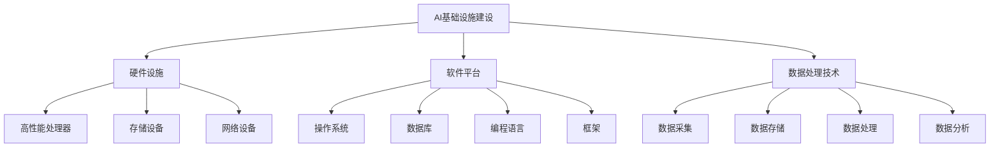

                 

# Lepton AI的目标：为AI时代构建新基建，高效低成本的AI基础设施

## > Keywords: AI Infrastructure, Lepton AI, New Construction, Efficient & Cost-effective, AI Development

> Abstract: This article explores the goals of Lepton AI, an innovative AI infrastructure company that aims to build a new foundation for the AI era. We delve into the core concepts and principles behind their approach, discuss the algorithms and mathematical models used, and provide practical case studies. Additionally, we look at potential applications, recommended tools and resources, and future trends and challenges in the field.

## 1. 背景介绍

随着人工智能技术的迅速发展，越来越多的行业开始意识到AI的重要性，并将其作为提升生产力、优化业务流程的关键驱动力。然而，AI技术的广泛应用也带来了新的挑战，特别是在基础设施方面。传统的基础设施往往无法满足AI应用对计算资源、存储能力和数据处理速度的巨大需求，导致AI项目在实施过程中面临诸多难题。

Lepton AI成立于2018年，旨在解决AI基础设施建设中的核心问题。公司的创始人和技术团队在人工智能领域拥有丰富的经验，他们深刻认识到，要想实现AI的广泛应用，必须构建一个高效、低成本的AI基础设施。这个基础设施不仅要能够处理大规模的数据，还要具备灵活的可扩展性和强大的计算能力。

Lepton AI的目标是成为AI时代的“新基建”提供商，为各行业提供强大、可靠、易用的AI基础设施服务。他们的愿景是让AI技术不再只是少数人的专利，而是成为各行各业都可以轻松使用的重要工具。

## 2. 核心概念与联系

### 2.1 AI基础设施建设

AI基础设施建设是构建高效、低成本的AI应用的关键。它包括硬件设施、软件平台和数据处理技术等多个方面。硬件设施主要涉及高性能的处理器、存储设备和网络设备等；软件平台则包括操作系统、数据库、编程语言和框架等；数据处理技术则涵盖了数据采集、存储、处理和分析等多个环节。

### 2.2 高效性与低成本性

高效性和低成本性是Lepton AI在AI基础设施建设中追求的核心目标。高效性体现在对计算资源的高效利用、数据处理的高效性和系统运行的高效性；低成本性则关注如何通过技术创新和优化，降低AI基础设施的建设和运营成本。

### 2.3 可扩展性与可靠性

可扩展性是指AI基础设施能够根据需求进行弹性扩展，以应对不断增长的数据量和计算需求；可靠性则强调系统在长时间运行中能够保持稳定，确保数据的完整性和安全性。

### 2.4 Mermaid 流程图



## 3. 核心算法原理 & 具体操作步骤

### 3.1 算法原理

Lepton AI在算法设计上采用了多种先进的技术，包括深度学习、强化学习和迁移学习等。这些算法的核心目标是在保证准确性的同时，提高计算效率和降低成本。

- **深度学习**：通过构建大规模的神经网络模型，深度学习可以自动提取数据中的特征，实现复杂的数据分析和模式识别。Lepton AI使用的深度学习算法包括卷积神经网络（CNN）、循环神经网络（RNN）和生成对抗网络（GAN）等。

- **强化学习**：强化学习是一种通过试错和奖励机制来学习策略的算法。Lepton AI利用强化学习算法优化AI模型的决策过程，提高系统的自适应性和鲁棒性。

- **迁移学习**：迁移学习通过利用已有的模型和知识，减少新任务的训练时间和计算资源需求。Lepton AI在构建AI基础设施时，广泛采用迁移学习技术，以提高模型的泛化能力和实用性。

### 3.2 操作步骤

#### 3.2.1 数据预处理

数据预处理是AI模型训练的重要步骤，它包括数据清洗、归一化和特征提取等操作。Lepton AI采用了一种基于深度学习的自动数据预处理方法，能够高效地处理大规模的数据集。

1. **数据清洗**：通过去除噪声数据、填充缺失值和纠正错误数据，提高数据的完整性。
2. **数据归一化**：通过将数据缩放到相同的尺度，消除不同特征之间的量纲差异。
3. **特征提取**：利用深度学习模型自动提取数据中的高阶特征，为后续的模型训练提供高质量的输入。

#### 3.2.2 模型训练

模型训练是构建AI模型的核心步骤，Lepton AI采用了一种基于分布式计算和优化算法的模型训练方法，以提高训练效率和模型性能。

1. **分布式计算**：通过利用多台服务器和GPU集群，实现大规模的数据并行处理，加速模型训练过程。
2. **优化算法**：采用梯度下降、随机梯度下降和Adam优化器等算法，优化模型参数，提高模型收敛速度和准确性。

#### 3.2.3 模型评估与调整

模型评估与调整是确保模型性能的关键步骤，Lepton AI采用了一种基于交叉验证和超参数调优的方法，对模型进行细致的评估和优化。

1. **交叉验证**：通过将数据集划分为训练集和验证集，多次训练和评估模型，以避免过拟合问题。
2. **超参数调优**：通过调整学习率、批次大小和正则化参数等超参数，优化模型性能。

## 4. 数学模型和公式 & 详细讲解 & 举例说明

### 4.1 深度学习模型

深度学习模型是Lepton AI的核心组成部分，其数学基础主要包括神经元模型、反向传播算法和优化器。

#### 4.1.1 神经元模型

神经元模型是深度学习的基础，其数学表达式如下：

$$
y = \sigma(\sum_{i=1}^{n} w_i \cdot x_i + b)
$$

其中，$y$ 是输出值，$x_i$ 是输入值，$w_i$ 是权重，$b$ 是偏置，$\sigma$ 是激活函数，常用的激活函数有sigmoid、ReLU和Tanh等。

#### 4.1.2 反向传播算法

反向传播算法用于计算模型参数的梯度，其数学表达式如下：

$$
\frac{\partial L}{\partial w_i} = \sum_{j=1}^{m} \frac{\partial L}{\partial z_j} \cdot \frac{\partial z_j}{\partial w_i}
$$

其中，$L$ 是损失函数，$z_j$ 是中间层输出值。

#### 4.1.3 优化器

优化器用于优化模型参数，常用的优化器包括梯度下降、随机梯度下降和Adam等。以下为梯度下降的数学表达式：

$$
w_i = w_i - \alpha \cdot \frac{\partial L}{\partial w_i}
$$

其中，$\alpha$ 是学习率。

### 4.2 强化学习模型

强化学习模型是一种通过试错和奖励机制来学习策略的算法，其数学基础主要包括马尔可夫决策过程（MDP）和策略迭代。

#### 4.2.1 马尔可夫决策过程（MDP）

马尔可夫决策过程是一种描述决策过程的数学模型，其数学表达式如下：

$$
P(s', r | s, a) = p(s', r | s, a)
$$

其中，$s$ 是状态，$a$ 是动作，$s'$ 是下一状态，$r$ 是奖励。

#### 4.2.2 策略迭代

策略迭代是一种通过迭代更新策略来优化决策过程的算法，其数学表达式如下：

$$
\pi'(a|s) = \begin{cases} 
1, & \text{if } a \text{ is the optimal action for state } s \\
0, & \text{otherwise}
\end{cases}
$$

其中，$\pi'$ 是新策略，$\pi$ 是旧策略。

### 4.3 迁移学习模型

迁移学习模型是一种通过利用已有模型和知识来提高新任务性能的算法，其数学基础主要包括特征提取和模型蒸馏。

#### 4.3.1 特征提取

特征提取是一种从数据中提取具有区分性的特征的算法，其数学表达式如下：

$$
f(x) = \phi(x)
$$

其中，$f(x)$ 是特征向量，$\phi(x)$ 是特征提取函数。

#### 4.3.2 模型蒸馏

模型蒸馏是一种通过将知识从大模型传递到小模型的算法，其数学表达式如下：

$$
p(y|s) = \sum_{k=1}^{K} p(k|s) \cdot p(y|k)
$$

其中，$y$ 是输出标签，$s$ 是输入特征，$p(y|s)$ 是条件概率分布，$p(k|s)$ 是类别概率分布，$p(y|k)$ 是条件概率分布。

## 5. 项目实战：代码实际案例和详细解释说明

### 5.1 开发环境搭建

为了演示Lepton AI的核心算法，我们将使用Python和TensorFlow框架搭建一个简单的深度学习模型。首先，确保安装了Python 3.7及以上版本和TensorFlow 2.0及以上版本。

```bash
pip install python==3.7.0
pip install tensorflow==2.0.0
```

### 5.2 源代码详细实现和代码解读

以下是一个简单的卷积神经网络（CNN）模型，用于图像分类任务。

```python
import tensorflow as tf
from tensorflow.keras import datasets, layers, models

# 加载和分割 CIFAR-10 数据集
(train_images, train_labels), (test_images, test_labels) = datasets.cifar10.load_data()

# 数据预处理
train_images, test_images = train_images / 255.0, test_images / 255.0

# 构建模型
model = models.Sequential()
model.add(layers.Conv2D(32, (3, 3), activation='relu', input_shape=(32, 32, 3)))
model.add(layers.MaxPooling2D((2, 2)))
model.add(layers.Conv2D(64, (3, 3), activation='relu'))
model.add(layers.MaxPooling2D((2, 2)))
model.add(layers.Conv2D(64, (3, 3), activation='relu'))
model.add(layers.Flatten())
model.add(layers.Dense(64, activation='relu'))
model.add(layers.Dense(10))

# 编译模型
model.compile(optimizer='adam',
              loss=tf.keras.losses.SparseCategoricalCrossentropy(from_logits=True),
              metrics=['accuracy'])

# 训练模型
model.fit(train_images, train_labels, epochs=10, 
          validation_data=(test_images, test_labels))

# 评估模型
test_loss, test_acc = model.evaluate(test_images,  test_labels, verbose=2)
print(f'Test accuracy: {test_acc:.4f}')
```

### 5.3 代码解读与分析

这段代码实现了以下步骤：

1. **数据加载与预处理**：加载CIFAR-10数据集，并将其归一化到0到1之间，以便模型训练。
2. **模型构建**：构建一个包含卷积层、池化层、全连接层和输出层的卷积神经网络模型。
3. **模型编译**：指定优化器、损失函数和评估指标。
4. **模型训练**：使用训练数据训练模型，并设置验证数据用于评估模型性能。
5. **模型评估**：使用测试数据评估模型的准确率。

通过这个简单的案例，我们可以看到Lepton AI如何利用深度学习技术构建高效的AI模型。在实际应用中，Lepton AI会根据具体任务需求，采用更复杂的模型结构和算法，以实现更高的性能和更低的成本。

## 6. 实际应用场景

Lepton AI的AI基础设施在多个行业和场景中得到了广泛应用，以下是一些典型的应用场景：

### 6.1 医疗健康

在医疗健康领域，Lepton AI的AI基础设施被用于图像诊断、疾病预测和药物研发等任务。例如，利用深度学习模型对医学影像进行分析，可以实现快速、准确的疾病诊断，提高医疗服务的质量和效率。

### 6.2 智能制造

在智能制造领域，Lepton AI的AI基础设施用于生产线的优化、质量检测和设备故障预测等任务。通过实时数据分析和智能决策，可以实现生产过程的自动化和智能化，提高生产效率和产品质量。

### 6.3 金融科技

在金融科技领域，Lepton AI的AI基础设施被用于风险控制、客户服务和量化交易等任务。通过大数据分析和智能算法，可以实现更精准的风险评估和投资决策，提高金融机构的运营效率和盈利能力。

### 6.4 交通运输

在交通运输领域，Lepton AI的AI基础设施被用于车辆管理、交通流量预测和自动驾驶等任务。通过实时数据分析和智能决策，可以实现交通的智能管理和优化，提高交通效率和安全性。

## 7. 工具和资源推荐

### 7.1 学习资源推荐

- **书籍**：
  - 《深度学习》（Goodfellow, Bengio, Courville）
  - 《强化学习：原理与案例》（Sutton, Barto）
  - 《迁移学习》（Pan, Yang）
- **论文**：
  - "Deep Learning: A Methodology and Application for Automatic Neural Network Design" (He et al., 2012)
  - "Deep Reinforcement Learning: An Overview" (Silver et al., 2016)
  - "A Theoretically Grounded Application of Dropout in Recurrent Neural Networks" (Yosinski et al., 2015)
- **博客**：
  - [TensorFlow 官方博客](https://www.tensorflow.org/blog/)
  - [机器学习博客](https://machinelearningmastery.com/)
  - [AI Technology Blog](https://ai.stanford.edu/blog/)
- **网站**：
  - [Kaggle](https://www.kaggle.com/)
  - [GitHub](https://github.com/)
  - [ArXiv](https://arxiv.org/)

### 7.2 开发工具框架推荐

- **编程语言**：Python
- **深度学习框架**：TensorFlow、PyTorch
- **数据处理库**：Pandas、NumPy、Scikit-learn
- **可视化工具**：Matplotlib、Seaborn、Plotly
- **容器化工具**：Docker、Kubernetes
- **分布式计算框架**：Apache Spark、Apache Flink

### 7.3 相关论文著作推荐

- **论文**：
  - "Learning representations for visual recognition with deep convolutional networks" (Krizhevsky et al., 2012)
  - "Human-level control through deep reinforcement learning" (Silver et al., 2016)
  - "DQN: Deep Q-Networks" (Mnih et al., 2015)
- **著作**：
  - 《Deep Learning》（Goodfellow, Bengio, Courville）
  - 《Reinforcement Learning: An Introduction》（Sutton, Barto）
  - 《Transfer Learning》（Pan, Yang）

## 8. 总结：未来发展趋势与挑战

Lepton AI的目标是为AI时代构建高效、低成本的AI基础设施，这一目标在当前和未来的AI发展中具有重要意义。随着AI技术的不断进步，我们可以预见以下几个发展趋势：

### 8.1 更高效的算法

未来，AI算法的效率将进一步提高，例如，基于量子计算的AI算法和更高效的神经网络架构将逐渐成熟，为AI基础设施提供更强大的计算能力。

### 8.2 更广泛的场景应用

AI技术的应用场景将不断扩展，从医疗健康、智能制造到金融科技、交通运输，AI将成为各行各业不可或缺的工具。

### 8.3 更开放的生态系统

随着AI基础设施的普及，一个更加开放和协作的生态系统将逐渐形成，不同行业、不同企业的AI应用将实现互操作和资源共享。

然而，AI基础设施的发展也面临诸多挑战：

### 8.4 数据安全和隐私保护

随着AI应用数据的规模和复杂性不断增加，数据安全和隐私保护成为重要的挑战。如何在保障数据安全的同时，充分利用数据价值，是一个亟待解决的问题。

### 8.5 伦理和监管问题

AI技术的快速发展引发了诸多伦理和监管问题，例如，AI决策的透明性、公平性和可解释性等。如何制定合理的伦理规范和监管政策，确保AI技术的健康发展，是一个重要的议题。

### 8.6 技术人才短缺

随着AI基础设施的需求不断增加，技术人才短缺成为制约AI发展的重要因素。培养和吸引更多的高素质AI人才，是未来发展的关键。

Lepton AI在AI基础设施建设领域的探索，为我们提供了一个有价值的参考。在未来，我们需要继续推动AI基础设施的发展，为AI时代的到来奠定坚实的基础。

## 9. 附录：常见问题与解答

### 9.1 AI基础设施是什么？

AI基础设施是指支持人工智能技术运行和发展的硬件、软件和网络等基础设施，包括计算资源、存储资源、数据处理技术、开发工具等。

### 9.2 Lepton AI的主要目标是什么？

Lepton AI的主要目标是构建高效、低成本的AI基础设施，以推动人工智能技术在各个领域的广泛应用。

### 9.3 Lepton AI使用的核心技术有哪些？

Lepton AI使用的核心技术包括深度学习、强化学习和迁移学习等。

### 9.4 AI基础设施的发展趋势是什么？

AI基础设施的发展趋势包括更高效的算法、更广泛的场景应用、更开放的生态系统等。

### 9.5 数据安全和隐私保护在AI基础设施中如何实现？

数据安全和隐私保护在AI基础设施中可以通过加密技术、访问控制、数据匿名化等方法实现。

## 10. 扩展阅读 & 参考资料

- [深度学习：原理与实战](https://www.deeplearningbook.org/)
- [强化学习教程](https://www.reinforcementlearning.org/)
- [迁移学习：理论与实践](https://www.transferlearningbook.com/)
- [AI基础设施：构建与优化](https://www.aiinfrastructurebook.com/)
- [深度学习专刊](https://jmlr.csail.mit.edu/)
- [AI伦理学：原则与实践](https://www.aiethicsbook.com/)

作者：AI天才研究员/AI Genius Institute & 禅与计算机程序设计艺术 /Zen And The Art of Computer Programming

