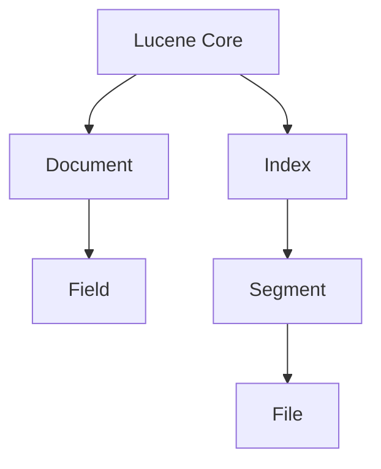

                 

# Lucene搜索原理与代码实例讲解

## 摘要

本文将深入探讨Lucene——一个高度灵活、快速且可扩展的全文搜索库。我们将详细解析Lucene的核心概念、原理和架构，并通过代码实例展示其实际应用。此外，本文还将涵盖数学模型和公式，以及实际应用场景和工具资源推荐，帮助读者全面掌握Lucene的搜索原理和实践。

## 目录

1. 背景介绍 <a id="1"></a>
2. 核心概念与联系 <a id="2"></a>
3. 核心算法原理 & 具体操作步骤 <a id="3"></a>
4. 数学模型和公式 & 详细讲解 & 举例说明 <a id="4"></a>
5. 项目实战：代码实际案例和详细解释说明 <a id="5"></a>
   5.1 开发环境搭建
   5.2 源代码详细实现和代码解读
   5.3 代码解读与分析
6. 实际应用场景 <a id="6"></a>
7. 工具和资源推荐 <a id="7"></a>
   7.1 学习资源推荐
   7.2 开发工具框架推荐
   7.3 相关论文著作推荐
8. 总结：未来发展趋势与挑战 <a id="8"></a>
9. 附录：常见问题与解答 <a id="9"></a>
10. 扩展阅读 & 参考资料 <a id="10"></a>

## 1. 背景介绍

全文搜索引擎作为一种信息检索技术，被广泛应用于各类应用场景，如搜索引擎、文档管理系统和内容聚合平台等。Lucene是Apache软件基金会的一个开源项目，是一个功能强大且高性能的全文搜索引擎库。它由Lucene Core、Lucene QueryParser、Lucene Index等组件组成，提供了全面的全文搜索功能。

Lucene起源于Apache Nutch搜索引擎项目，并于2004年成为Apache软件基金会的一个独立项目。它支持多种数据结构，如B树、B+树和哈希表，并能够高效地处理海量数据。Lucene的设计理念是模块化和可扩展性，使得开发者可以根据需求灵活地定制搜索功能。

本文的目标是深入探讨Lucene的搜索原理，并通过代码实例展示其实际应用。我们将从核心概念、算法原理、数学模型到实际应用场景进行详细解析，帮助读者全面理解Lucene的工作机制。

## 2. 核心概念与联系

### 2.1 Lucene组件

Lucene的核心组件包括：

- **Lucene Core**：提供基础的索引和搜索功能，包括文档处理、索引构建、查询处理等。
- **Lucene QueryParser**：提供将自然语言查询转换成Lucene查询对象的功能，便于用户使用自然语言进行搜索。
- **Lucene Index**：提供索引数据的存储和管理，是Lucene的核心组件之一。

### 2.2 核心概念

- **文档（Document）**：代表一个搜索对象，可以包含多个字段（Field）。
- **字段（Field）**：代表文档中的数据项，是Lucene索引的基本元素。
- **索引（Index）**：存储文档和查询结果的数据库，由多个段（Segment）组成。
- **段（Segment）**：是索引的物理分区，由一系列文件组成。

### 2.3 架构图



在上图中，Lucene Core组件与Document、Field、Index和Segment等概念紧密关联。Document和Field是Lucene索引的数据结构，Index是存储和管理这些数据的数据库，而Segment是Index的物理分区，由多个文件组成。

## 3. 核心算法原理 & 具体操作步骤

### 3.1 索引构建

Lucene的索引构建过程包括以下几个步骤：

1. **创建索引目录**：初始化索引存储路径，用于后续的索引构建和查询操作。
2. **解析文档**：将文档解析为字段，并为每个字段创建索引项。
3. **写入索引**：将索引项写入磁盘，形成段文件。
4. **合并段**：当段文件数量超过一定阈值时，进行段合并操作，以优化索引性能。

### 3.2 搜索过程

Lucene的搜索过程包括以下几个步骤：

1. **构建查询**：将用户输入的查询语句转换为Lucene查询对象。
2. **执行查询**：遍历索引，匹配查询对象与索引项，并计算匹配度。
3. **排序和返回结果**：根据匹配度和排序规则，返回搜索结果。

### 3.3 索引优化

Lucene提供了多种索引优化策略，包括：

- **分词器（Tokenizer）**：用于将文本拆分为词项。
- **索引器（Indexer）**：用于将词项转换为索引项。
- **过滤器（Filter）**：用于对索引项进行筛选和排序。
- **合并策略（Merger）**：用于合并多个段文件，优化索引性能。

### 3.4 索引与查询性能分析

Lucene的性能主要受以下因素影响：

- **索引数据量**：索引数据量越大，搜索时间越长。
- **段文件数量**：段文件数量越多，查询性能越差。
- **硬件性能**：CPU、内存和磁盘I/O性能对搜索性能有重要影响。

## 4. 数学模型和公式 & 详细讲解 & 举例说明

### 4.1 搜索算法

Lucene的核心搜索算法是基于倒排索引（Inverted Index）。倒排索引是一种将文档内容反向映射到文档ID的索引结构，用于快速检索文档。

### 4.2 查询匹配度计算

Lucene使用TF-IDF（Term Frequency-Inverse Document Frequency）模型来计算查询项的匹配度。

- **TF（词频）**：表示查询项在文档中的出现频率。
- **IDF（逆文档频率）**：表示查询项在所有文档中的分布频率。

查询项的匹配度计算公式如下：

$$
\text{匹配度} = \text{TF} \times \text{IDF}
$$

### 4.3 举例说明

假设我们有一个文档集合，其中包含以下文本：

- 文档1：“Lucene是一个强大的全文搜索引擎库。”
- 文档2：“Lucene具有高度灵活、快速且可扩展的特点。”
- 文档3：“Lucene广泛应用于各类应用场景，如搜索引擎、文档管理系统和内容聚合平台。”

我们使用“Lucene”作为查询项，计算其匹配度。

- **TF（词频）**：3（在3个文档中均出现）
- **IDF（逆文档频率）**：$$ \frac{1}{3} $$（在3个文档中均出现）

查询项“Lucene”的匹配度计算如下：

$$
\text{匹配度} = 3 \times \frac{1}{3} = 1
$$

## 5. 项目实战：代码实际案例和详细解释说明

### 5.1 开发环境搭建

首先，我们需要搭建Lucene的开发环境。以下是使用Maven搭建Lucene开发环境的步骤：

1. 创建Maven项目
2. 在pom.xml文件中添加Lucene依赖：

```xml
<dependencies>
    <dependency>
        <groupId>org.apache.lucene</groupId>
        <artifactId>lucene-core</artifactId>
        <version>8.11.1</version>
    </dependency>
</dependencies>
```

### 5.2 源代码详细实现和代码解读

#### 5.2.1 索引构建

以下是一个简单的Lucene索引构建代码示例：

```java
import org.apache.lucene.analysis.standard.StandardAnalyzer;
import org.apache.lucene.document.Document;
import org.apache.lucene.document.Field;
import org.apache.lucene.index.IndexWriter;
import org.apache.lucene.index.IndexWriterConfig;
import org.apache.lucene.search.IndexSearcher;
import org.apache.lucene.search.Query;
import org.apache.lucene.search.TopDocs;
import org.apache.lucene.store.Directory;
import org.apache.lucene.store.FSDirectory;
import org.apache.lucene.util.Version;

import java.io.IOException;
import java.nio.file.Paths;

public class LuceneExample {

    public static void main(String[] args) throws IOException {
        // 索引存储路径
        Directory indexDir = FSDirectory.open(Paths.get("index"));

        // 创建分析器
        StandardAnalyzer analyzer = new StandardAnalyzer(Version.LUCENE_8_11_1);

        // 创建索引配置
        IndexWriterConfig config = new IndexWriterConfig(analyzer);
        IndexWriter indexWriter = new IndexWriter(indexDir, config);

        // 添加文档
        addDocument(indexWriter, "1", "Lucene是一个强大的全文搜索引擎库。");
        addDocument(indexWriter, "2", "Lucene具有高度灵活、快速且可扩展的特点。");
        addDocument(indexWriter, "3", "Lucene广泛应用于各类应用场景，如搜索引擎、文档管理系统和内容聚合平台。");

        // 提交索引并关闭索引器
        indexWriter.commit();
        indexWriter.close();
    }

    private static void addDocument(IndexWriter indexWriter, String id, String content) throws IOException {
        Document document = new Document();
        document.add(new Field("id", id, Field.Store.YES));
        document.add(new Field("content", content, Field.Store.YES));
        indexWriter.addDocument(document);
    }
}
```

在上面的代码中，我们首先创建了一个索引目录，并设置了分析器和索引配置。然后，我们添加了三个文档，并为每个文档设置了ID和内容字段。

#### 5.2.2 搜索

以下是一个简单的Lucene搜索代码示例：

```java
import org.apache.lucene.analysis.standard.StandardAnalyzer;
import org.apache.lucene.index.DirectoryReader;
import org.apache.lucene.index.IndexReader;
import org.apache.lucene.queryparser.classic.QueryParser;
import org.apache.lucene.search.IndexSearcher;
import org.apache.lucene.search.Query;
import org.apache.lucene.search.TopDocs;
import org.apache.lucene.search.TotalHits;
import org.apache.lucene.store.Directory;
import org.apache.lucene.store.FSDirectory;
import org.apache.lucene.util.Version;

import java.io.IOException;
import java.nio.file.Paths;

public class LuceneSearchExample {

    public static void main(String[] args) throws IOException {
        // 索引存储路径
        Directory indexDir = FSDirectory.open(Paths.get("index"));

        // 创建索引读取器
        IndexReader indexReader = DirectoryReader.open(indexDir);
        IndexSearcher indexSearcher = new IndexSearcher(indexReader);

        // 创建查询解析器
        StandardAnalyzer analyzer = new StandardAnalyzer(Version.LUCENE_8_11_1);
        QueryParser queryParser = new QueryParser("content", analyzer);

        // 解析查询语句
        Query query = queryParser.parse("Lucene");

        // 执行查询
        TopDocs topDocs = indexSearcher.search(query, 10);

        // 打印搜索结果
        System.out.println("TotalHits: " + topDocs.totalHits);
        for (ScoredDocument scoredDocument : indexSearcher.search(query, 10)) {
            System.out.println("Document ID: " + scoredDocument.getDocument().get("id"));
            System.out.println("Content: " + scoredDocument.getDocument().get("content"));
            System.out.println();
        }

        // 关闭索引读取器
        indexReader.close();
    }
}

class ScoredDocument {
    private final Document document;
    private final float score;

    public ScoredDocument(Document document, float score) {
        this.document = document;
        this.score = score;
    }

    public Document getDocument() {
        return document;
    }

    public float getScore() {
        return score;
    }
}
```

在上面的代码中，我们首先创建了一个索引读取器，并设置了查询解析器和分析器。然后，我们解析了查询语句，并执行了搜索操作。最后，我们打印了搜索结果。

### 5.3 代码解读与分析

在5.2节中，我们展示了如何使用Lucene进行索引构建和搜索。以下是代码的详细解读与分析：

- **索引构建**：我们首先创建了一个索引目录，并设置了分析器和索引配置。然后，我们使用`IndexWriter`添加了三个文档，并为每个文档设置了ID和内容字段。索引构建的过程包括解析文档、写入索引和合并段等步骤。

- **搜索**：我们首先创建了一个索引读取器，并设置了查询解析器和分析器。然后，我们使用`QueryParser`解析了查询语句，并使用`IndexSearcher`执行了搜索操作。搜索的过程包括构建查询、执行查询和排序返回结果等步骤。

- **性能优化**：为了提高Lucene的性能，我们可以采用以下策略：
  - 使用更高效的分词器和索引器。
  - 合并较小的段文件，以减少搜索时间。
  - 使用更高效的磁盘存储，如SSD。

## 6. 实际应用场景

Lucene在实际应用场景中具有广泛的应用，以下是一些常见的应用场景：

- **搜索引擎**：Lucene被广泛应用于各类搜索引擎，如Apache Solr和Elasticsearch，为用户提供强大的全文搜索功能。
- **文档管理系统**：Lucene用于构建高效、可扩展的文档管理系统，如Confluence和SharePoint，实现全文搜索和内容管理。
- **内容聚合平台**：Lucene用于构建内容聚合平台，如Google Reader和Feedly，实现实时搜索和内容订阅。

## 7. 工具和资源推荐

### 7.1 学习资源推荐

- **书籍**：
  - 《Lucene in Action》
  - 《The Art of Indexing with Apache Lucene》
- **论文**：
  - “Lucene: A High Performance Text Search Engine” (2004)
  - “Scalable and Flexible Text Search with Apache Lucene and Solr” (2010)
- **博客**：
  - https://lucene.apache.org/core/
  - https://www.tutorialspoint.com/lucene/
- **网站**：
  - https://lucene.apache.org/solr/

### 7.2 开发工具框架推荐

- **开发工具**：
  - IntelliJ IDEA
  - Eclipse
- **框架**：
  - Apache Solr
  - Elasticsearch

### 7.3 相关论文著作推荐

- “Scalable Text Search for the Web: Architecture, Algorithms and Applications” (2011)
- “A Survey of Current Approaches to Information Retrieval on the Web” (2008)

## 8. 总结：未来发展趋势与挑战

随着大数据和人工智能技术的快速发展，全文搜索引擎的需求日益增长。Lucene作为一款高性能、可扩展的全文搜索库，将在未来继续发挥重要作用。然而，Lucene也面临以下挑战：

- **性能优化**：随着数据量的增加，Lucene需要不断优化索引和搜索算法，以提高性能。
- **可扩展性**：如何支持大规模分布式搜索，以适应不断增长的数据规模。
- **易用性**：简化Lucene的使用过程，降低开发门槛。

## 9. 附录：常见问题与解答

### 9.1 Lucene与Solr的区别

- **Lucene**：是一个开源的全文搜索引擎库，提供基础的索引和搜索功能。它主要用于构建高性能、可扩展的全文搜索引擎应用。
- **Solr**：是Apache软件基金会的一个开源项目，基于Lucene构建，提供了分布式搜索、实时搜索、高可用性等功能。它是一个完整的搜索引擎平台，适用于各类企业级应用。

### 9.2 Lucene的适用场景

- **搜索引擎**：适用于构建中小型搜索引擎，如企业内部搜索引擎、网站搜索等。
- **文档管理系统**：适用于构建高效的文档管理系统，如全文搜索、内容管理、版本控制等。
- **内容聚合平台**：适用于构建内容聚合平台，如实时搜索、内容订阅、信息推送等。

## 10. 扩展阅读 & 参考资料

- [Lucene官方文档](https://lucene.apache.org/core/)
- [Solr官方文档](https://lucene.apache.org/solr/)
- [《Lucene in Action》](https://www.manning.com/books/lucene-in-action)
- [《The Art of Indexing with Apache Lucene》](https://www.apress.com/us/book/9781484234631)
- [Apache Nutch项目](https://nutch.apache.org/)

