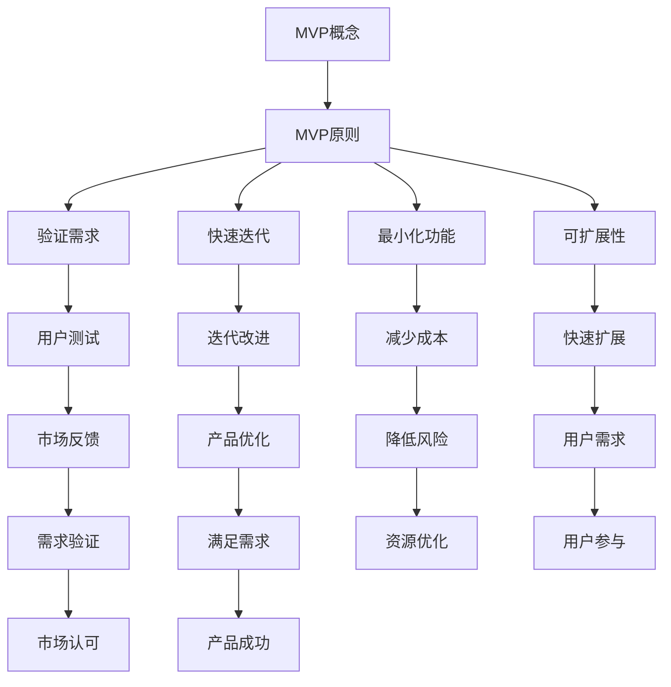

                 

# MVP开发策略：快速验证市场需求

## 关键词
MVP（最小可行性产品），市场需求验证，快速迭代，用户反馈，敏捷开发，产品管理

## 摘要
本文旨在探讨MVP（最小可行性产品）的开发策略，强调其在快速验证市场需求中的重要性。通过一系列步骤，我们将深入分析MVP的概念，核心原则，实际操作过程，以及其在市场中的应用。同时，我们将探讨MVP开发过程中可能面临的挑战，并提供实用的解决方案和资源推荐，帮助读者在产品开发过程中更好地应对市场需求。

## 1. 背景介绍

在当今快速变化的市场环境中，产品开发的成功与否往往取决于其能否满足市场需求。然而，在投入大量资源之前，如何确保我们的产品理念能够得到市场的认可，是一个亟待解决的问题。这就是MVP（最小可行性产品）的用武之地。MVP作为一种产品开发策略，其核心思想是通过最小化产品功能，快速构建一个可运行的产品原型，以便在早期阶段就获得真实用户的反馈，从而验证市场需求。

传统的产品开发方法通常需要大量的时间、资源和成本来构建一个完整的产品，这使得公司难以在早期阶段发现产品与市场需求之间的差距。相比之下，MVP允许团队在较短时间内交付一个可测试的产品版本，从而减少风险并加快市场反馈的获取。这种方法不仅有助于降低开发成本，还可以使团队更快地调整和改进产品，使其更符合用户需求。

本文将详细探讨MVP的开发策略，从其核心原则到实际操作步骤，再到市场应用和挑战，旨在为读者提供一个全面的指导，帮助他们在产品开发过程中更有效地验证市场需求。

## 2. 核心概念与联系

### 2.1 MVP的定义

MVP，即最小可行性产品（Minimum Viable Product），是一个功能最基本、最简化的产品版本，它足以满足早期用户的核心需求，并进行市场测试。MVP的核心目标是验证产品概念，而不是实现所有功能。

### 2.2 MVP的核心原则

- **验证需求**：通过构建一个最小可行性产品来验证用户对产品概念的需求。
- **快速迭代**：快速构建和测试产品，根据用户反馈不断迭代和改进。
- **最小化功能**：只包含核心功能，以减少开发时间和成本。
- **可扩展性**：设计产品使其能够根据用户需求快速扩展。

### 2.3 MVP与敏捷开发的联系

敏捷开发是一种以用户需求为导向，快速迭代和持续改进的产品开发方法。MVP与敏捷开发有紧密的联系，两者都强调快速响应变化和持续改进。

- **快速响应变化**：敏捷开发强调在开发过程中快速响应变化，而MVP通过快速构建和测试产品，为团队提供了一个快速响应变化的机会。
- **持续改进**：敏捷开发鼓励持续改进，而MVP通过迭代和用户反馈，使团队能够持续改进产品，使其更符合市场需求。

### 2.4 MVP的Mermaid流程图



通过上述流程图，我们可以清晰地看到MVP的开发过程和其与敏捷开发的联系。从MVP概念出发，通过验证需求、快速迭代、最小化功能和可扩展性等原则，MVP帮助团队在早期阶段快速获得市场反馈，并根据反馈进行产品优化，最终实现产品的成功。

## 3. 核心算法原理 & 具体操作步骤

### 3.1 MVP开发的核心算法原理

MVP开发的核心算法原理可以总结为以下几个关键步骤：

1. **需求分析**：确定产品的核心功能，这些功能必须能够解决用户的关键问题。
2. **最小化功能**：从需求分析中提取最小核心功能，构建一个可运行的产品原型。
3. **快速开发**：使用敏捷开发方法，快速构建和测试产品原型。
4. **用户反馈**：将产品原型投放市场，收集用户反馈。
5. **迭代改进**：根据用户反馈进行产品迭代和改进。

### 3.2 MVP开发的具体操作步骤

1. **需求分析**

   在开始MVP开发之前，团队需要进行详细的需求分析。这包括与潜在用户进行访谈，了解他们的需求和痛点，同时收集市场数据和竞争对手分析。

2. **确定MVP功能**

   根据需求分析的结果，团队需要确定MVP的最小核心功能。这些功能必须能够解决用户的主要问题，同时保持产品的简单性和易于扩展。

3. **快速构建**

   使用敏捷开发方法，团队需要快速构建MVP原型。这通常涉及到采用快速原型开发工具和技术，如使用低代码平台或开发框架。

4. **用户测试**

   将MVP原型投放给早期用户，进行实际测试。这可以帮助团队收集真实的用户反馈，识别产品的优势和不足。

5. **迭代改进**

   根据用户反馈，团队需要对MVP进行迭代和改进。这可以涉及到调整功能，优化用户体验，甚至重新定义产品的核心功能。

6. **市场投放**

   当MVP经过多次迭代和改进，并且团队认为产品已经相对完善时，可以将其正式投放市场。这一阶段，团队需要关注市场反馈，确保产品能够得到用户的认可。

### 3.3 实际案例

例如，一家初创公司计划开发一款智能家居控制系统。经过需求分析，团队确定MVP的核心功能是：

- 远程控制智能家居设备（如灯光、空调等）。
- 设定自动化场景（如离家模式、睡眠模式等）。

团队使用低代码平台快速构建了MVP原型，并在市场上进行测试。用户反馈显示，大多数用户对远程控制功能非常满意，但对自动化场景的设置存在一些疑惑。团队根据反馈进行了改进，增加了更直观的界面和详细的说明文档。经过几次迭代，智能家居控制系统的MVP版本得到了用户的广泛认可，为公司后续的产品开发奠定了基础。

## 4. 数学模型和公式 & 详细讲解 & 举例说明

### 4.1 MVP开发中的数学模型

在MVP开发中，可以使用一些数学模型来评估产品的可行性，其中最常用的模型是成本效益分析（Cost-Benefit Analysis，CBA）。

#### 成本效益分析（CBA）

成本效益分析是一种用于评估投资项目是否值得投资的方法。它通过比较项目的成本和预期收益，来评估项目的经济可行性。

#### 公式

CBA的公式可以表示为：

\[ CBA = \frac{B}{C} \]

其中，\( B \) 是预期收益，\( C \) 是项目成本。

### 4.2 详细讲解

1. **预期收益（B）**

   预期收益是指项目在未来可能带来的总收益。它通常包括以下几部分：

   - **直接收益**：项目直接产生的收入，如产品销售所得。
   - **间接收益**：项目带来的其他收益，如提升品牌知名度、增加客户忠诚度等。

2. **项目成本（C）**

   项目成本是指实现项目所需的全部投入，包括但不限于：

   - **开发成本**：包括人力成本、技术成本等。
   - **营销成本**：用于市场推广、广告等方面的费用。
   - **运营成本**：包括日常运营所需的费用，如服务器租赁、维护费用等。

### 4.3 举例说明

假设一家初创公司计划开发一款新的移动应用程序，他们预计这款应用可以在未来3年内带来100万元人民币的收益。开发成本、营销成本和运营成本预计分别为50万元、30万元和20万元。

使用CBA公式计算：

\[ CBA = \frac{B}{C} = \frac{100}{50+30+20} = \frac{100}{100} = 1 \]

由于CBA的结果为1，这意味着预期收益等于项目成本，该投资项目在经济上是可行的。

### 4.4 进一步分析

- **CBA > 1**：预期收益高于项目成本，投资回报率高，项目值得投资。
- **CBA < 1**：预期收益低于项目成本，投资回报率低，项目可能存在风险。

### 4.5 优化建议

- **降低成本**：通过优化开发流程、提高开发效率、减少营销和运营成本，提高CBA。
- **提高收益**：通过增加产品功能、扩大市场份额、提升用户体验，提高预期收益。

通过上述数学模型和公式，我们可以对MVP开发项目的经济可行性进行评估，从而做出更明智的投资决策。

## 5. 项目实战：代码实际案例和详细解释说明

### 5.1 开发环境搭建

在进行MVP开发之前，我们需要搭建一个合适的开发环境。以下是具体的步骤：

1. **选择开发工具和平台**：我们可以选择诸如Visual Studio Code、PyCharm等流行的集成开发环境（IDE），以及GitHub、GitLab等版本控制工具。
2. **安装开发环境**：根据所选的开发工具和平台，安装相应的软件和依赖库。
3. **配置项目目录**：创建项目的目录结构，并配置必要的文件和设置。

### 5.2 源代码详细实现和代码解读

以下是一个简单的Web应用程序的MVP示例，该应用程序允许用户创建和管理待办事项。

#### 5.2.1 项目结构

```
/to-do-app
|-- /backend
|   |-- /src
|   |   |-- app.py
|   |-- /tests
|   |   |-- test_app.py
|   |-- requirements.txt
|-- /frontend
|   |-- /src
|   |   |-- index.html
|   |   |-- styles.css
|   |-- package.json
|-- Dockerfile
|-- docker-compose.yml
```

#### 5.2.2 后端实现

**app.py**：这是我们的后端应用，使用Flask框架实现。

```python
from flask import Flask, jsonify, request
app = Flask(__name__)

# 待办事项列表
todos = []

@app.route('/todos', methods=['GET', 'POST'])
def handle_todos():
    if request.method == 'POST':
        # 添加待办事项
        data = request.json
        todos.append(data['todo'])
        return jsonify({'message': 'Todo added successfully.'})
    else:
        # 获取所有待办事项
        return jsonify(todos)

if __name__ == '__main__':
    app.run(debug=True)
```

**test_app.py**：这是我们的后端测试脚本，用于验证后端功能。

```python
import unittest
import app

class TodoTestCase(unittest.TestCase):
    def test_add_todo(self):
        # 添加待办事项
        response = app.handle_todos({'todo': 'Buy milk'})
        self.assertEqual(response.json['message'], 'Todo added successfully.')

    def test_get_todos(self):
        # 获取所有待办事项
        response = app.handle_todos()
        self.assertIsInstance(response.json, list)

if __name__ == '__main__':
    unittest.main()
```

#### 5.2.3 前端实现

**index.html**：这是我们的前端页面，用于展示和操作待办事项。

```html
<!DOCTYPE html>
<html lang="en">
<head>
    <meta charset="UTF-8">
    <meta name="viewport" content="width=device-width, initial-scale=1.0">
    <title>Todo App</title>
    <link rel="stylesheet" href="styles.css">
</head>
<body>
    <h1>Todo App</h1>
    <form id="todo-form">
        <input type="text" id="todo-input" placeholder="Enter a todo">
        <button type="submit">Add Todo</button>
    </form>
    <ul id="todo-list"></ul>
    <script src="app.js"></script>
</body>
</html>
```

**styles.css**：这是我们的前端样式文件，用于美化页面。

```css
body {
    font-family: Arial, sans-serif;
    margin: 0;
    padding: 0;
}

h1 {
    text-align: center;
    margin-bottom: 20px;
}

form {
    display: flex;
    justify-content: center;
    margin-bottom: 20px;
}

input {
    padding: 10px;
    margin-right: 10px;
    width: 300px;
}

button {
    padding: 10px 20px;
    background-color: blue;
    color: white;
    border: none;
    cursor: pointer;
}

button:hover {
    background-color: darkblue;
}

ul {
    list-style-type: none;
    padding: 0;
}

li {
    background-color: lightgray;
    padding: 10px;
    margin-bottom: 10px;
    border: 1px solid #ccc;
}
```

#### 5.2.4 前后端通信

在前端页面中，我们使用JavaScript来与后端API进行通信。以下是一个简单的示例：

```javascript
document.getElementById('todo-form').addEventListener('submit', function(e) {
    e.preventDefault();
    const todoInput = document.getElementById('todo-input');
    fetch('/todos', {
        method: 'POST',
        headers: {
            'Content-Type': 'application/json'
        },
        body: JSON.stringify({ todo: todoInput.value })
    })
    .then(response => response.json())
    .then(data => {
        console.log(data);
        todoInput.value = '';
    });
});
```

通过上述代码，我们可以看到前端页面与后端API进行交互，从而实现待办事项的添加和展示。

### 5.3 代码解读与分析

上述代码实现了一个简单的待办事项管理应用，包括前后端部分。以下是代码的详细解读：

- **后端**：使用Flask框架构建，包含一个简单的API，用于处理待办事项的添加和获取。通过JSON格式的请求和响应，前端可以方便地与后端进行通信。
- **前端**：使用HTML和CSS构建用户界面，通过JavaScript实现与后端API的交互，用户可以通过输入框添加待办事项，界面会实时更新显示待办事项列表。

这个简单的案例展示了MVP开发的核心思想：快速构建一个可运行的产品原型，并通过用户反馈不断迭代和改进。虽然这个MVP版本的功能相对简单，但它已经足够验证用户对这款产品的初步需求，为后续的功能扩展和优化提供了方向。

### 5.4 部署与测试

为了测试和部署我们的MVP应用，我们可以使用Docker和Docker Compose。

- **Dockerfile**：用于构建后端应用的Docker镜像。

```dockerfile
FROM python:3.9

WORKDIR /app

COPY requirements.txt requirements.txt
RUN pip install -r requirements.txt

COPY . .

CMD ["python", "app.py"]
```

- **docker-compose.yml**：用于配置和运行前端和后端容器。

```yaml
version: '3'
services:
  backend:
    build: ./backend
    ports:
      - "5000:5000"
  frontend:
    build: ./frontend
    ports:
      - "8080:8080"
```

通过执行以下命令，我们可以启动应用：

```shell
docker-compose up -d
```

启动后，我们可以在浏览器中访问前端页面（http://localhost:8080/），通过输入框添加待办事项，并查看后端API的响应。

```shell
curl -X POST -H "Content-Type: application/json" -d '{"todo": "Buy milk"}' http://localhost:5000/todos
```

```shell
curl http://localhost:5000/todos
```

通过这个实际案例，我们可以看到如何使用MVP开发策略构建一个简单的Web应用程序，并利用Docker进行部署和测试。这个过程展示了MVP的核心原则，即通过最小化功能和快速迭代，以最小的成本和资源验证市场需求。

## 6. 实际应用场景

MVP（最小可行性产品）的开发策略在多个行业和场景中展现出了巨大的价值。以下是几个典型的实际应用场景：

### 6.1 创业公司

对于初创公司来说，MVP是一种极具吸引力的开发策略。初创公司通常资源有限，需要在有限的预算内快速验证产品概念。通过构建MVP，初创公司可以快速推出产品原型，获得早期用户的反馈，从而确定产品方向，降低市场风险。例如，Uber和Airbnb在初创阶段都采用了MVP策略，通过最小化功能，快速测试市场需求，最终取得了巨大的成功。

### 6.2 大型企业的创新部门

大型企业在推进创新项目时，也常常采用MVP策略。这种策略可以帮助企业快速验证新技术的可行性，降低项目失败的风险。例如，许多科技巨头如Google和IBM都设有专门的创新实验室，利用MVP策略来快速开发原型，测试新技术的市场潜力。

### 6.3 电子商务

电子商务领域也非常适合采用MVP策略。例如，亚马逊在其早期就使用了MVP策略，通过构建一个简单的电子商务平台，验证用户对于在线购物的需求。随后，亚马逊不断迭代和优化产品，最终成为全球最大的电子商务公司之一。

### 6.4 教育科技

在教育科技领域，MVP策略同样应用广泛。教育科技公司如Coursera和Udemy，通过构建最小可行性产品，提供在线课程和学习平台的基本功能，验证用户需求。这些公司在获得早期用户反馈后，不断迭代和扩展产品功能，从而吸引了大量的用户和投资。

### 6.5 健康科技

健康科技领域也对MVP策略有着浓厚的兴趣。例如，医疗设备和应用开发公司通过构建MVP原型，验证产品的实际效果和市场需求。这种方式不仅帮助公司节省了开发成本，还加速了产品的上市时间。

### 6.6 总结

MVP策略在多种行业和场景中展现出了其独特的优势。它帮助公司快速验证产品概念，降低市场风险，优化资源分配。通过不断的迭代和优化，MVP使得产品能够更好地满足市场需求，从而提高产品的成功率和市场竞争力。

## 7. 工具和资源推荐

### 7.1 学习资源推荐

**书籍**：
1. 《精益创业》（The Lean Startup）- 作者：埃里克·莱斯（Eric Ries）
   这本书详细介绍了精益创业的理念，包括MVP策略，对于初学者和专业人士都具有很高的参考价值。

2. 《产品经理手册》（The Product Manager's Survival Guide）- 作者：史蒂夫·布兰克（Steve Blank）
   本书提供了丰富的产品管理技巧和策略，包括如何使用MVP进行产品开发。

**论文**：
1. "Minimum Viable Product: A Guide" - 作者：Eric Ries
   这篇论文详细阐述了MVP的概念、原则和实践方法，是了解MVP策略的权威资料。

2. "The Lean Startup" - 作者：Eric Ries
   这篇论文扩展了MVP的概念，提出了精益创业的理念，为创业者提供了宝贵的指导。

**博客**：
1.精益创业实验室（Lean Startup Lab）
   该博客由埃里克·莱斯创建，提供了大量关于MVP和精益创业的原创内容和案例分析。

2. Product School
   Product School的博客涵盖了产品管理、产品设计、MVP开发等多个领域，为产品经理和创业者提供了实用的知识和技巧。

### 7.2 开发工具框架推荐

**开发环境**：
1. Visual Studio Code
   作为一款开源的跨平台代码编辑器，Visual Studio Code提供了丰富的插件和扩展，适合MVP快速开发。

2. PyCharm
   PyCharm是一款专业的Python集成开发环境（IDE），支持敏捷开发和MVP开发，功能强大且用户友好。

**前端框架**：
1. React
   React是Facebook开发的一个用于构建用户界面的JavaScript库，适用于快速构建MVP前端界面。

2. Angular
   Angular是由Google开发的一个前端框架，适用于构建复杂的应用程序，支持MVP开发中的组件化设计。

**后端框架**：
1. Flask
   Flask是一个轻量级的Python Web框架，适用于快速构建MVP后端服务。

2. Django
   Django是一个高性能、全功能的Python Web框架，适用于构建MVP中的复杂后端应用。

### 7.3 相关论文著作推荐

**《精益创业方法论》** - 作者：埃里克·莱斯
   这本书详细介绍了精益创业的方法论，包括MVP的开发策略，是创业者和产品经理必读的经典之作。

**《产品思维：从0到1构建成功产品》** - 作者：艾伦·科恩
   这本书探讨了产品思维的实践方法，包括如何使用MVP进行产品设计和开发，适合产品经理和创业团队。

**《敏捷开发实践指南》** - 作者：杰夫·萨瑟兰
   本书提供了敏捷开发的详细指南，包括如何在敏捷开发过程中使用MVP，适合软件开发者和项目经理。

### 7.4 总结

上述资源和工具涵盖了MVP开发所需的理论知识、实践技巧和技术支持。通过这些资源，读者可以深入了解MVP的开发策略，掌握敏捷开发的方法，并选择合适的工具和框架来构建自己的MVP产品。

## 8. 总结：未来发展趋势与挑战

MVP（最小可行性产品）作为一种产品开发策略，已经在多个行业中得到了广泛应用。然而，随着市场的不断变化和技术的快速发展，MVP开发也面临着新的趋势和挑战。

### 8.1 未来发展趋势

1. **更加智能化**：随着人工智能和大数据技术的发展，MVP开发将更加智能化。通过分析用户行为数据，开发者可以更准确地预测市场需求，优化产品设计。

2. **跨平台整合**：未来MVP开发将更加注重跨平台整合，以满足用户在不同设备上的需求。开发者需要构建灵活、可扩展的应用程序，实现无缝的用户体验。

3. **自动化与AI集成**：自动化工具和AI技术的集成将提高MVP开发的效率和质量。自动化测试、智能分析和自适应优化等功能将使MVP迭代更加迅速和精准。

4. **区块链应用**：区块链技术的兴起为MVP开发带来了新的机遇。通过区块链，开发者可以实现去中心化的产品验证和市场推广，提高产品的可信度和透明度。

### 8.2 面临的挑战

1. **用户隐私保护**：在MVP开发过程中，用户隐私保护成为了一个重要问题。开发者需要在数据收集和使用过程中严格遵守相关法律法规，确保用户数据的安全和隐私。

2. **技术复杂性**：随着产品的不断迭代和扩展，MVP开发中的技术复杂性也在增加。开发者需要不断学习新技术，提升自身技能，以应对复杂的技术挑战。

3. **市场不确定性**：市场环境的变化和竞争的加剧使得MVP开发面临更高的市场不确定性。开发者需要具备快速应对变化的能力，灵活调整产品策略。

4. **资源限制**：MVP开发通常需要有限的资源，包括时间、人力和资金。开发者需要在有限的资源下，实现高效的产品开发和优化。

### 8.3 应对策略

1. **持续学习与创新**：开发者需要持续学习新技术和创新方法，提升自身竞争力。通过参加培训、研讨会和阅读专业书籍，开发者可以保持专业知识的更新。

2. **数据驱动决策**：通过收集和分析用户数据，开发者可以更准确地预测市场需求，优化产品设计。数据驱动的决策将有助于提高MVP开发的效率和效果。

3. **敏捷开发与迭代**：敏捷开发方法可以帮助开发者快速响应市场变化，不断迭代和优化产品。通过小步快跑、快速迭代，开发者可以更早地发现和解决问题。

4. **资源优化与协同**：合理分配和利用资源，实现团队内部协同工作，是MVP开发成功的关键。通过优化项目管理、提高开发效率，开发者可以更好地应对资源限制。

总之，MVP开发在未来的发展中将面临新的机遇和挑战。通过持续学习、数据驱动、敏捷开发和资源优化，开发者可以更好地应对这些挑战，推动MVP开发的不断进步。

## 9. 附录：常见问题与解答

### 9.1 什么是MVP？

MVP，即最小可行性产品（Minimum Viable Product），是一个功能最基本、最简化的产品版本，它足以满足早期用户的核心需求，并进行市场测试。MVP的核心目标是验证产品概念，而不是实现所有功能。

### 9.2 MVP开发的优势是什么？

MVP开发的优势包括：

- 快速验证市场需求：通过构建一个最小可行性产品，团队可以在早期阶段就获得真实用户的反馈，从而验证产品概念。
- 降低开发成本：只包含核心功能，减少了开发和维护的成本。
- 减少风险：通过早期市场测试，团队可以及时发现和解决潜在问题，降低项目失败的风险。
- 快速迭代：根据用户反馈，团队可以快速调整和改进产品，使其更符合用户需求。

### 9.3 MVP开发的核心原则是什么？

MVP开发的核心原则包括：

- 验证需求：通过构建一个最小可行性产品来验证用户对产品概念的需求。
- 快速迭代：快速构建和测试产品，根据用户反馈不断迭代和改进。
- 最小化功能：只包含核心功能，以减少开发时间和成本。
- 可扩展性：设计产品使其能够根据用户需求快速扩展。

### 9.4 如何进行MVP开发？

进行MVP开发的一般步骤包括：

- 需求分析：确定产品的核心功能，这些功能必须能够解决用户的关键问题。
- 确定MVP功能：从需求分析中提取最小核心功能，构建一个可运行的产品原型。
- 快速构建：使用敏捷开发方法，快速构建MVP原型。
- 用户测试：将MVP原型投放市场，收集用户反馈。
- 迭代改进：根据用户反馈，对MVP进行迭代和改进。

### 9.5 MVP开发与敏捷开发的区别是什么？

MVP开发与敏捷开发有紧密的联系，但两者还是有所区别：

- MVP开发是一种以验证市场需求为核心的产品开发策略，强调构建最小可行性产品并进行市场测试。
- 敏捷开发是一种以用户需求为导向，快速迭代和持续改进的产品开发方法，强调在开发过程中快速响应变化。

两者共同点在于都强调快速迭代和用户反馈，但MVP更侧重于市场需求验证，而敏捷开发更侧重于持续改进和灵活应对变化。

### 9.6 MVP开发适合哪些行业和场景？

MVP开发适合多种行业和场景，包括：

- 创业公司：初创公司资源有限，MVP可以帮助它们快速验证产品概念，降低市场风险。
- 大型企业的创新部门：大型企业可以利用MVP策略来快速开发原型，验证新技术的可行性。
- 电子商务：电子商务领域产品更新快，MVP可以帮助企业快速响应市场变化。
- 教育科技：教育科技公司可以通过MVP验证在线课程和平台的用户需求。
- 健康科技：健康科技公司可以通过MVP原型验证医疗设备和应用的实际效果。

### 9.7 MVP开发中如何保护用户隐私？

在MVP开发中，保护用户隐私是非常重要的。以下是一些建议：

- 遵守相关法律法规：确保产品开发符合当地数据保护法规，如欧盟的《通用数据保护条例》（GDPR）。
- 最小化数据收集：只收集实现产品功能所需的最少用户数据，避免不必要的个人信息收集。
- 数据加密：对用户数据进行加密处理，确保数据在传输和存储过程中安全。
- 用户隐私政策：明确告知用户他们的数据如何被收集、使用和存储，并获取用户的同意。
- 定期审计：定期对产品进行隐私审计，确保数据保护和用户隐私政策得到有效执行。

## 10. 扩展阅读 & 参考资料

- [《精益创业》](https://book.douban.com/subject/25908814/) - 作者：埃里克·莱斯
- [《产品经理手册》](https://book.douban.com/subject/26707478/) - 作者：史蒂夫·布兰克
- [《敏捷开发实践指南》](https://book.douban.com/subject/30293995/) - 作者：杰夫·萨瑟兰
- [MVP概念详细解释](https://www.leanstack.com/what-is-a-minimum-viable-product/)
- [敏捷开发与MVP的关系](https://www.agilealliance.org/what-is-agile/what-is-mvp/)
- [数据分析在MVP中的应用](https://towardsdatascience.com/how-to-use-data-to-decide-whether-your-mvp-is-viable-4a5e44a3a7c5)
- [MVP开发的案例分析](https://www.interaction-studio.com/blog/minimum-viable-product-definition-and-examples/)
- [保护用户隐私的最佳实践](https://www.privacyrights.org/)

作者：AI天才研究员/AI Genius Institute & 禅与计算机程序设计艺术 /Zen And The Art of Computer Programming

