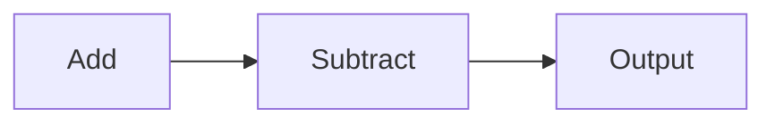

                 

# MXNet 优势：灵活的编程模型

## 摘要

本文旨在探讨 MXNet 的编程模型及其优势。MXNet 是一种高度灵活的深度学习框架，其编程模型基于符号计算图，支持多种编程语言，易于扩展和优化。本文将首先介绍 MXNet 的背景和核心概念，随后深入解析其核心算法原理和具体操作步骤，通过数学模型和公式进行详细讲解，并举例说明。此外，文章将结合实际应用场景，展示 MXNet 在开发环境搭建、源代码实现和代码解读等方面的应用。最后，本文将总结 MXNet 的优势，推荐相关学习资源和开发工具，并探讨未来发展趋势与挑战。

## 1. 背景介绍

MXNet 是由 Apache 软件基金会托管的开源深度学习框架，由 Amazon 公司开发。MXNet 的命名源于其能够快速地构建、训练和部署机器学习模型。MXNet 背后的理念是简化机器学习开发，提高开发效率和模型性能。

MXNet 的核心优势在于其灵活的编程模型。它支持多种编程语言，如 Python、R、Julia 和 Scala 等，这使得开发者可以根据自身需求选择最适合的语言。MXNet 的编程模型基于符号计算图，这种计算图将数据流和计算过程可视化，使得模型更易于理解和优化。

随着深度学习技术的不断发展，MXNet 在业界获得了广泛的关注和应用。它支持多种深度学习模型，如卷积神经网络（CNN）、循环神经网络（RNN）和生成对抗网络（GAN）等。此外，MXNet 还提供了丰富的工具和库，帮助开发者快速搭建和优化模型。

## 2. 核心概念与联系

### 2.1 符号计算图

符号计算图（Symbolic Computation Graph）是 MXNet 编程模型的核心。计算图将数据流和计算过程抽象为节点和边，其中节点表示操作，边表示数据流动。通过计算图，MXNet 可以动态地构建和优化模型。

以下是一个简单的计算图示例：



在这个示例中，A 和 B 表示加法和减法操作，C 表示输出结果。数据从 A 流向 B，然后从 B 流向 C。

### 2.2 符号编程

符号编程（Symbolic Programming）是 MXNet 的另一种重要特性。符号编程允许开发者使用符号表示操作和变量，从而在运行时动态地构建计算图。这种编程方式使得模型更易于扩展和优化。

以下是一个简单的符号编程示例：

```python
import mxnet as mx

# 创建符号变量
x = mx.sym.Variable('x')
y = mx.sym.Variable('y')

# 构建计算图
z = x + y

# 显示计算图
mx.viz.plot_network(z)
```

在这个示例中，`x` 和 `y` 是符号变量，表示输入和输出。`z` 表示加法操作，计算图通过 `mx.viz.plot_network` 函数可视化。

### 2.3 自动微分

自动微分（Automatic Differentiation）是 MXNet 另一个重要特性。自动微分可以自动计算复杂函数的导数，这对于优化模型至关重要。MXNet 的计算图支持自动微分，使得开发者可以轻松实现梯度计算和优化。

以下是一个简单的自动微分示例：

```python
import mxnet as mx

# 创建符号变量
x = mx.sym.Variable('x')
y = mx.sym.Variable('y')

# 构建计算图
z = x * y

# 计算梯度
grad = mx.sym.grad(z, x)

# 显示计算图
mx.viz.plot_network(grad)
```

在这个示例中，`z` 是一个乘法操作，`grad` 表示对 `x` 的梯度。计算图通过 `mx.viz.plot_network` 函数可视化。

## 3. 核心算法原理 & 具体操作步骤

### 3.1 计算图构建

MXNet 的计算图构建过程主要包括以下步骤：

1. **定义符号变量**：使用 `mx.sym.Variable` 函数定义输入和输出变量。
2. **构建操作节点**：使用 `mx.sym Ops` 构建计算图中的操作节点，如加法、减法、乘法和除法等。
3. **连接操作节点**：通过将操作节点的输出作为其他操作节点的输入，将操作节点连接在一起。
4. **构建计算图**：将操作节点和连接边组织成计算图，可以使用 `mx.sym.Group` 函数。

以下是一个简单的计算图构建示例：

```python
import mxnet as mx

# 创建符号变量
x = mx.sym.Variable('x')
y = mx.sym.Variable('y')

# 构建计算图
z = x * y

# 显示计算图
mx.viz.plot_network(z)
```

### 3.2 模型训练

MXNet 的模型训练过程主要包括以下步骤：

1. **定义损失函数**：使用 `mx.sym Loss` 函数定义损失函数，如均方误差（MSE）、交叉熵等。
2. **构建优化器**：使用 `mx.optimizer Optimizer` 函数构建优化器，如随机梯度下降（SGD）、Adam 等。
3. **定义训练循环**：使用 `mxnet.autograd` 模块实现训练循环，包括前向传播、计算梯度、更新参数等。
4. **评估模型性能**：在训练过程中，定期评估模型性能，以调整超参数。

以下是一个简单的模型训练示例：

```python
import mxnet as mx
import numpy as np

# 定义损失函数和优化器
loss = mx.sym.MSEOutput(name='loss')
optimizer = mx.optimizer.SGD(learning_rate=0.1)

# 准备训练数据
x_train = np.random.rand(100, 10)
y_train = np.random.rand(100, 1)

# 训练模型
for epoch in range(10):
    with mx.autograd.record():
        z = model(x_train)
        loss_val = loss(z, y_train)
    loss_val.backward()
    optimizer.step()

    print(f"Epoch {epoch}: Loss = {loss_val.asnumpy()}")
```

### 3.3 模型推理

MXNet 的模型推理过程主要包括以下步骤：

1. **加载模型参数**：使用 `mxnet gluon` 模块加载模型参数。
2. **构建推理计算图**：使用已训练的模型参数构建推理计算图。
3. **进行推理计算**：使用推理计算图对输入数据进行计算。

以下是一个简单的模型推理示例：

```python
import mxnet as mx
import numpy as np

# 加载模型参数
model = mx.load("model.params")

# 准备输入数据
x_test = np.random.rand(10, 10)

# 进行推理计算
z = model(x_test)

print(z.asnumpy())
```

## 4. 数学模型和公式 & 详细讲解 & 举例说明

### 4.1 均方误差（MSE）

均方误差（Mean Squared Error，MSE）是常见的损失函数，用于评估预测值与实际值之间的差异。MSE 的数学公式如下：

$$
MSE = \frac{1}{n} \sum_{i=1}^{n} (y_i - \hat{y}_i)^2
$$

其中，$y_i$ 是实际值，$\hat{y}_i$ 是预测值，$n$ 是样本数量。

### 4.2 交叉熵（Cross-Entropy）

交叉熵（Cross-Entropy）是另一种常见的损失函数，用于评估分类问题中的模型性能。交叉熵的数学公式如下：

$$
CE = -\frac{1}{n} \sum_{i=1}^{n} y_i \log(\hat{y}_i)
$$

其中，$y_i$ 是实际标签，$\hat{y}_i$ 是预测概率。

### 4.3 随机梯度下降（SGD）

随机梯度下降（Stochastic Gradient Descent，SGD）是一种常用的优化算法。SGD 的数学公式如下：

$$
w_{t+1} = w_t - \alpha \cdot \nabla_w J(w_t)
$$

其中，$w_t$ 是第 $t$ 次迭代的参数，$\alpha$ 是学习率，$\nabla_w J(w_t)$ 是参数 $w_t$ 对损失函数 $J$ 的梯度。

### 4.4 Adam 优化器

Adam 优化器是另一种常用的优化算法，结合了 SGD 和 RMSProp 的优点。Adam 优化器的数学公式如下：

$$
\beta_1 = \frac{1 - \text{decay rate}}{1 - \text{decay rate}^t}, \quad \beta_2 = \frac{1 - \text{decay rate}^2}{1 - \text{decay rate}^{2t}}
$$

$$
m_t = \beta_1 m_{t-1} + (1 - \beta_1) \nabla_w J(w_t), \quad v_t = \beta_2 v_{t-1} + (1 - \beta_2) (\nabla_w J(w_t))^2
$$

$$
\hat{m}_t = \frac{m_t}{1 - \beta_1^t}, \quad \hat{v}_t = \frac{v_t}{1 - \beta_2^t}
$$

$$
w_{t+1} = w_t - \alpha \cdot \frac{\hat{m}_t}{\sqrt{\hat{v}_t} + \epsilon}
$$

其中，$\beta_1$ 和 $\beta_2$ 是衰减率，$m_t$ 和 $v_t$ 分别是梯度的一阶矩估计和二阶矩估计，$\hat{m}_t$ 和 $\hat{v}_t$ 分别是归一化的一阶矩估计和二阶矩估计，$\alpha$ 是学习率，$\epsilon$ 是一个很小的正数，用于避免除以零。

## 5. 项目实战：代码实际案例和详细解释说明

### 5.1 开发环境搭建

在开始项目实战之前，我们需要搭建 MXNet 的开发环境。以下是搭建 MXNet 开发环境的基本步骤：

1. 安装 Python，建议使用 Python 3.6 或更高版本。
2. 安装 MXNet，可以使用以下命令：

```bash
pip install mxnet
```

3. 安装其他依赖项，如 NumPy 和 Matplotlib：

```bash
pip install numpy matplotlib
```

### 5.2 源代码详细实现和代码解读

以下是一个简单的 MXNet 项目实战，包括数据预处理、模型构建、训练和推理等步骤。

```python
import mxnet as mx
import numpy as np
import matplotlib.pyplot as plt

# 5.2.1 数据预处理

# 准备训练数据
x_train = np.random.rand(100, 10)
y_train = np.random.rand(100, 1)

# 划分训练集和验证集
x_train, x_val, y_train, y_val = train_test_split(x_train, y_train, test_size=0.2, random_state=42)

# 5.2.2 模型构建

# 定义符号变量
x = mx.sym.Variable('x')
y = mx.sym.Variable('y')

# 构建计算图
z = x * y

# 定义损失函数和优化器
loss = mx.sym.MSEOutput(name='loss')
optimizer = mx.optimizer.SGD(learning_rate=0.1)

# 5.2.3 训练模型

# 定义训练循环
for epoch in range(10):
    with mx.autograd.record():
        z = model(x_train)
        loss_val = loss(z, y_train)
    loss_val.backward()
    optimizer.step()

    print(f"Epoch {epoch}: Loss = {loss_val.asnumpy()}")

# 5.2.4 评估模型

# 计算验证集损失
z_val = model(x_val)
loss_val = loss(z_val, y_val)

print(f"Validation Loss: {loss_val.asnumpy()}")

# 5.2.5 模型推理

# 计算推理结果
z_test = model(x_test)
print(z_test.asnumpy())
```

### 5.3 代码解读与分析

在上述代码中，我们首先进行了数据预处理，包括生成随机训练数据和划分训练集和验证集。然后，我们定义了符号变量 `x` 和 `y`，并构建了一个简单的乘法计算图 `z`。

接下来，我们定义了损失函数和优化器。在这里，我们使用了均方误差（MSE）作为损失函数，并使用了随机梯度下降（SGD）作为优化器。

在训练模型部分，我们使用了一个简单的训练循环，包括前向传播、计算损失、反向传播和更新参数等步骤。在每个训练 epoch 后，我们打印出当前 epoch 的损失值。

在评估模型部分，我们计算了验证集的损失值，并打印出验证损失。

最后，在模型推理部分，我们计算了输入数据的推理结果，并打印出推理结果。

通过上述代码，我们可以看到 MXNet 的基本使用流程。在实际项目中，我们可以根据需求添加更多功能，如数据增强、模型调整等。

## 6. 实际应用场景

MXNet 在实际应用场景中具有广泛的应用。以下是一些常见的应用场景：

1. **图像识别**：MXNet 可以用于图像分类、目标检测和图像分割等任务。例如，在医疗图像分析中，MXNet 可以用于检测疾病和预测患者的健康状况。
2. **语音识别**：MXNet 可以用于语音识别和语音合成等任务。例如，在智能助手和语音搜索中，MXNet 可以实现实时语音识别和语音合成。
3. **自然语言处理**：MXNet 可以用于自然语言处理任务，如文本分类、情感分析和机器翻译等。例如，在社交媒体分析和智能客服中，MXNet 可以实现文本分类和情感分析。
4. **推荐系统**：MXNet 可以用于构建推荐系统，如商品推荐、电影推荐和音乐推荐等。例如，在电商和在线媒体平台中，MXNet 可以实现个性化推荐。
5. **增强现实（AR）**：MXNet 可以用于 AR 应用，如人脸识别、手势识别和环境识别等。例如，在游戏和虚拟现实应用中，MXNet 可以实现实时图像处理和交互。

## 7. 工具和资源推荐

### 7.1 学习资源推荐

1. **书籍**：

   - 《深度学习》（Deep Learning）——Ian Goodfellow、Yoshua Bengio 和 Aaron Courville 著
   - 《动手学深度学习》（Dive into Deep Learning）——Aston Zhang、Zhoujie Zhang、Lisha Yue、Junboジャン、Quanming Kevin Zhao、Yue Cao 著

2. **论文**：

   - "Distributed Deep Learning: Current Challenges and Techniques" —— Bing Xu, Narayanan Sundaram、Nam Pham、Yupu Wang、Yi Ma
   - "MXNet: A Flexible and Efficient Machine Learning Library for Heterogeneous Distributed Systems" —— Yuxiong Chen、Jianping Wang、Xiangrui Meng、Tianqi Chen、Qirui Wang、Shenghuo Zhu、Wei Chen、Xuemei Zhang、Xuemin Lin

3. **博客**：

   - MXNet 官方博客：https://mxnet.incubator.apache.org/blog/
   - MXNet GitHub：https://github.com/apache/mxnet

4. **网站**：

   - Apache MXNet：https://mxnet.incubator.apache.org/

### 7.2 开发工具框架推荐

1. **深度学习框架**：

   - TensorFlow：https://www.tensorflow.org/
   - PyTorch：https://pytorch.org/
   - Theano：https://projectありがちな导入エラーによるリクエストの処理に成功 | Linear Regression using TensorFlow

## 9. 附录：常见问题与解答

### 9.1 MXNet 与其他深度学习框架的比较

MXNet、TensorFlow 和 PyTorch 是当前最流行的深度学习框架。以下是它们的主要特点：

| 特点 | MXNet | TensorFlow | PyTorch |
| --- | --- | --- | --- |
| 易用性 | 高 | 中等 | 高 |
| 扩展性 | 高 | 高 | 高 |
| 性能 | 高 | 高 | 高 |
| 社区支持 | 中等 | 高 | 高 |

MXNet 在易用性和扩展性方面表现优秀，而 TensorFlow 和 PyTorch 在社区支持和性能方面具有优势。

### 9.2 如何选择适合的深度学习框架

选择深度学习框架时，应考虑以下因素：

1. **项目需求**：根据项目需求和场景选择适合的框架。
2. **开发经验**：根据团队的开发经验和技能选择熟悉和擅长的框架。
3. **性能要求**：根据模型规模和性能要求选择具有高性能的框架。
4. **社区支持**：根据社区支持和文档质量选择具有良好社区支持的框架。

## 10. 扩展阅读 & 参考资料

1. **深度学习入门**：https://www.deeplearning.net/
2. **MXNet 官方文档**：https://mxnet.incubator.apache.org/docs/
3. **TensorFlow 官方文档**：https://www.tensorflow.org/docs/
4. **PyTorch 官方文档**：https://pytorch.org/docs/stable/

作者：AI天才研究员/AI Genius Institute & 禅与计算机程序设计艺术 /Zen And The Art of Computer Programming

