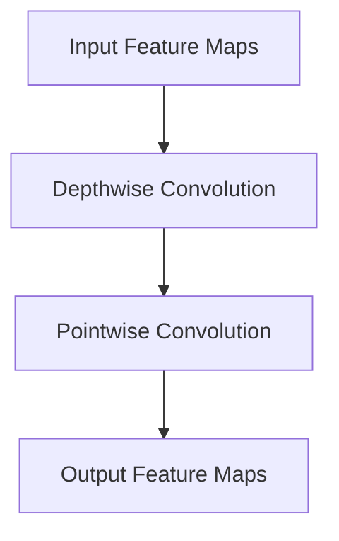

                 

### 1. 背景介绍

MobileNet 是由 Google 提出的一种针对移动设备优化的深度神经网络架构。传统的卷积神经网络（CNN）在图像处理中表现出了强大的性能，但随着模型复杂度的增加，其计算量和存储需求也急剧上升。这在移动设备上尤其成为了一个问题，因为移动设备通常拥有有限的计算资源和存储空间。为了解决这一问题，MobileNet 应运而生。

MobileNet 的主要思想是通过深度可分离卷积（Depthwise Separable Convolution）将复杂的卷积操作拆分为两个独立的步骤：深度卷积（Depthwise Convolution）和逐点卷积（Pointwise Convolution）。这种设计有效地降低了模型的参数数量和计算量，从而在保证模型性能的同时，提高了其在移动设备上的运行效率。

MobileNet 的提出不仅为移动设备上的深度学习应用提供了有效的解决方案，而且也对后续的神经架构设计产生了深远的影响。本文将详细探讨 MobileNet 的原理、实现以及在实际应用中的表现。

#### MobileNet 的提出背景

随着智能手机的普及，移动设备上的图像处理应用需求日益增长。然而，传统的 CNN 架构在移动设备上的表现并不理想。这是因为 CNN 通常包含大量的卷积层和全连接层，导致模型参数量和计算量巨大。这使得移动设备在运行 CNN 模型时面临以下挑战：

1. **计算资源受限**：移动设备的计算资源相对于服务器端设备要少得多，这使得复杂的 CNN 模型难以在移动设备上高效运行。
2. **存储空间有限**：CNN 模型通常包含数百万甚至数千万个参数，这占用了大量的存储空间，而移动设备通常存储空间有限。
3. **功耗问题**：复杂的 CNN 模型在运行时需要大量的电能，这会导致移动设备的电池迅速耗尽。

为了解决这些问题，Google 提出了 MobileNet。MobileNet 的设计初衷是构建一个参数量少、计算量小、但性能接近于传统 CNN 的深度学习模型。通过深度可分离卷积，MobileNet 实现了这一目标，从而使得在移动设备上高效运行深度学习模型成为可能。

#### MobileNet 的基本概念

MobileNet 的核心概念在于其采用的深度可分离卷积（Depthwise Separable Convolution），这是一种将卷积操作分解为两个独立步骤的技术。具体来说，深度可分离卷积包括以下两个步骤：

1. **深度卷积（Depthwise Convolution）**：
   - **作用**：对输入特征图进行空间上的卷积操作，但只关注每个特征图内部的元素。
   - **参数量**：由于每个特征图独立卷积，因此参数量大大减少。
   - **计算量**：由于卷积核大小较小，计算量也相对较低。

2. **逐点卷积（Pointwise Convolution）**：
   - **作用**：将深度卷积的结果进行逐点卷积操作，实现通道间的交互。
   - **参数量**：逐点卷积类似于全连接层，但参数量远小于传统的全连接层。
   - **计算量**：逐点卷积的计算量适中，但由于其参数量少，总体计算量仍然较低。

通过深度可分离卷积，MobileNet 有效地减少了模型的参数量和计算量，同时保持了较高的模型性能。这使得 MobileNet 成为了一个在移动设备上高效运行深度学习模型的理想选择。

### 2. 核心概念与联系

为了深入理解 MobileNet 的原理，我们需要详细探讨其核心概念，并展示一个结构紧凑的 Mermaid 流程图来描述这些概念之间的联系。

#### 深度卷积（Depthwise Convolution）

深度卷积是对输入特征图进行逐点卷积操作，但仅关注每个特征图内部的元素。其基本原理如下：

1. **卷积核大小**：深度卷积的卷积核通常较小，如3x3或1x1。
2. **操作过程**：对于每个输入特征图，独立进行卷积操作，只考虑卷积核内的元素。
3. **参数量**：由于每个特征图独立卷积，因此参数量大大减少。
4. **计算量**：由于卷积核较小，计算量也相对较低。

#### 逐点卷积（Pointwise Convolution）

逐点卷积是将深度卷积的结果进行逐点卷积操作，实现通道间的交互。其基本原理如下：

1. **卷积核大小**：逐点卷积的卷积核通常为1x1。
2. **操作过程**：对于深度卷积后的特征图，每个元素与卷积核内的所有元素相乘并相加。
3. **参数量**：逐点卷积类似于全连接层，但参数量远小于传统的全连接层。
4. **计算量**：逐点卷积的计算量适中，但由于其参数量少，总体计算量仍然较低。

#### 深度可分离卷积（Depthwise Separable Convolution）

深度可分离卷积是将卷积操作分解为两个独立步骤的技术，其基本原理如下：

1. **操作步骤**：
   - **第一步**：深度卷积（Depthwise Convolution）。对输入特征图进行逐点卷积操作，只关注每个特征图内部的元素。
   - **第二步**：逐点卷积（Pointwise Convolution）。将深度卷积的结果进行逐点卷积操作，实现通道间的交互。
2. **参数量和计算量**：通过深度可分离卷积，有效地减少了模型的参数量和计算量，同时保持了较高的模型性能。

#### Mermaid 流程图

以下是 MobileNet 的 Mermaid 流程图，用于描述深度卷积、逐点卷积和深度可分离卷积之间的关系：



在这个流程图中，输入特征图（A）首先经过深度卷积（B），然后经过逐点卷积（C），最终得到输出特征图（D）。这个流程清楚地展示了 MobileNet 的核心原理，即通过深度可分离卷积来降低模型复杂度。

### 3. 核心算法原理 & 具体操作步骤

在深入理解了 MobileNet 的核心概念之后，我们将进一步探讨其核心算法原理，并详细描述其具体操作步骤。

#### 深度卷积（Depthwise Convolution）

深度卷积是对输入特征图进行逐点卷积操作，但只关注每个特征图内部的元素。其具体操作步骤如下：

1. **输入特征图**：假设输入特征图的大小为 $H \times W$，通道数为 $C$。
2. **卷积核大小**：设卷积核大小为 $k \times k$。
3. **计算过程**：
   - 对于每个输入特征图 $C_i$（$i = 1, 2, ..., C$），独立进行卷积操作。
   - 对于每个卷积核 $K_{ij}$（$i = 1, 2, ..., k$，$j = 1, 2, ..., k$），计算 $C_i$ 中与其中心位置对应的元素乘积并求和。
   - 将结果作为输出特征图 $D_i$ 中的一个元素。

4. **参数量和计算量**：
   - 参数量：由于每个特征图独立卷积，因此参数量大大减少，为 $k^2$。
   - 计算量：由于卷积核较小，计算量也相对较低。

#### 逐点卷积（Pointwise Convolution）

逐点卷积是将深度卷积的结果进行逐点卷积操作，实现通道间的交互。其具体操作步骤如下：

1. **输入特征图**：假设输入特征图的大小为 $H \times W$，通道数为 $C$。
2. **卷积核大小**：设卷积核大小为 $1 \times 1$。
3. **计算过程**：
   - 对于每个输出特征图 $D_i$（$i = 1, 2, ..., C$），每个元素与卷积核内的所有元素相乘并相加。
   - 将结果作为输出特征图 $E_i$ 中的一个元素。

4. **参数量和计算量**：
   - 参数量：逐点卷积类似于全连接层，但参数量远小于传统的全连接层，为 $C$。
   - 计算量：逐点卷积的计算量适中，但由于其参数量少，总体计算量仍然较低。

#### 深度可分离卷积（Depthwise Separable Convolution）

深度可分离卷积是将卷积操作分解为两个独立步骤的技术，其具体操作步骤如下：

1. **第一步**：深度卷积（Depthwise Convolution）
   - 根据前文所述，执行深度卷积操作，得到输出特征图 $D_i$。

2. **第二步**：逐点卷积（Pointwise Convolution）
   - 对于每个输出特征图 $D_i$，执行逐点卷积操作，得到最终输出特征图 $E_i$。

3. **参数量和计算量**：
   - 参数量：总参数量为 $k^2 + C$。
   - 计算量：总体计算量较低，因为深度卷积和逐点卷积的计算量都相对较小。

通过上述操作步骤，MobileNet 有效地降低了模型的参数量和计算量，同时保持了较高的模型性能。这使得 MobileNet 成为了一个在移动设备上高效运行深度学习模型的理想选择。

### 4. 数学模型和公式 & 详细讲解 & 举例说明

在深入理解 MobileNet 的核心算法原理后，我们将进一步探讨其背后的数学模型和公式，并通过具体例子进行详细讲解。

#### 深度卷积（Depthwise Convolution）

深度卷积的数学模型如下：

$$
\text{输出特征图} \; D_i = \sum_{j=1}^{k} \sum_{l=1}^{k} K_{ij} \odot C_{ij}
$$

其中：
- $D_i$：输出特征图 $i$ 的元素。
- $K_{ij}$：卷积核 $i$ 的元素。
- $C_{ij}$：输入特征图 $i$ 的元素。
- $\odot$：卷积操作。

举例说明：

假设输入特征图 $C$ 的大小为 $3 \times 3$，通道数为 $2$，卷积核大小为 $3 \times 3$，则深度卷积的结果如下：

$$
D_{11} = K_{11} \odot C_{11} + K_{12} \odot C_{12} + K_{13} \odot C_{13} \\
D_{12} = K_{11} \odot C_{21} + K_{12} \odot C_{22} + K_{13} \odot C_{23} \\
D_{13} = K_{11} \odot C_{31} + K_{12} \odot C_{32} + K_{13} \odot C_{33} \\
D_{21} = K_{21} \odot C_{11} + K_{22} \odot C_{12} + K_{23} \odot C_{13} \\
D_{22} = K_{21} \odot C_{21} + K_{22} \odot C_{22} + K_{23} \odot C_{23} \\
D_{23} = K_{21} \odot C_{31} + K_{22} \odot C_{32} + K_{23} \odot C_{33} \\
D_{31} = K_{31} \odot C_{11} + K_{32} \odot C_{12} + K_{33} \odot C_{13} \\
D_{32} = K_{31} \odot C_{21} + K_{32} \odot C_{22} + K_{33} \odot C_{23} \\
D_{33} = K_{31} \odot C_{31} + K_{32} \odot C_{32} + K_{33} \odot C_{33}
$$

#### 逐点卷积（Pointwise Convolution）

逐点卷积的数学模型如下：

$$
\text{输出特征图} \; E_i = \sum_{j=1}^{C} W_{ij} \odot D_j
$$

其中：
- $E_i$：输出特征图 $i$ 的元素。
- $W_{ij}$：卷积核 $i$ 的元素。
- $D_j$：深度卷积的输出特征图 $j$ 的元素。
- $\odot$：卷积操作。

举例说明：

假设输入特征图 $D$ 的大小为 $3 \times 3$，通道数为 $2$，卷积核大小为 $1 \times 1$，则逐点卷积的结果如下：

$$
E_{11} = W_{11} \odot D_{11} + W_{12} \odot D_{21} + W_{13} \odot D_{31} \\
E_{12} = W_{11} \odot D_{12} + W_{12} \odot D_{22} + W_{13} \odot D_{32} \\
E_{13} = W_{11} \odot D_{13} + W_{12} \odot D_{23} + W_{13} \odot D_{33} \\
E_{21} = W_{21} \odot D_{11} + W_{22} \odot D_{21} + W_{23} \odot D_{31} \\
E_{22} = W_{21} \odot D_{12} + W_{22} \odot D_{22} + W_{23} \odot D_{32} \\
E_{23} = W_{21} \odot D_{13} + W_{22} \odot D_{23} + W_{23} \odot D_{33} \\
E_{31} = W_{31} \odot D_{11} + W_{32} \odot D_{21} + W_{33} \odot D_{31} \\
E_{32} = W_{31} \odot D_{12} + W_{32} \odot D_{22} + W_{33} \odot D_{32} \\
E_{33} = W_{31} \odot D_{13} + W_{32} \odot D_{23} + W_{33} \odot D_{33}
$$

#### 深度可分离卷积（Depthwise Separable Convolution）

深度可分离卷积的数学模型如下：

$$
\text{输出特征图} \; E_i = \sum_{j=1}^{C} W_{ij} \odot D_j
$$

其中：
- $E_i$：输出特征图 $i$ 的元素。
- $W_{ij}$：卷积核 $i$ 的元素。
- $D_j$：深度卷积的输出特征图 $j$ 的元素。
- $\odot$：卷积操作。

举例说明：

假设输入特征图 $C$ 的大小为 $3 \times 3$，通道数为 $2$，卷积核大小为 $3 \times 3$ 和 $1 \times 1$，则深度可分离卷积的结果如下：

$$
D_{11} = K_{11} \odot C_{11} + K_{12} \odot C_{12} + K_{13} \odot C_{13} \\
D_{12} = K_{11} \odot C_{21} + K_{12} \odot C_{22} + K_{13} \odot C_{23} \\
D_{13} = K_{11} \odot C_{31} + K_{12} \odot C_{32} + K_{13} \odot C_{33} \\
D_{21} = K_{21} \odot C_{11} + K_{22} \odot C_{12} + K_{23} \odot C_{13} \\
D_{22} = K_{21} \odot C_{21} + K_{22} \odot C_{22} + K_{23} \odot C_{23} \\
D_{23} = K_{21} \odot C_{31} + K_{22} \odot C_{32} + K_{23} \odot C_{33} \\
D_{31} = K_{31} \odot C_{11} + K_{32} \odot C_{12} + K_{33} \odot C_{13} \\
D_{32} = K_{31} \odot C_{21} + K_{32} \odot C_{22} + K_{33} \odot C_{23} \\
D_{33} = K_{31} \odot C_{31} + K_{32} \odot C_{32} + K_{33} \odot C_{33}
$$

$$
E_{11} = W_{11} \odot D_{11} + W_{12} \odot D_{21} + W_{13} \odot D_{31} \\
E_{12} = W_{11} \odot D_{12} + W_{12} \odot D_{22} + W_{13} \odot D_{32} \\
E_{13} = W_{11} \odot D_{13} + W_{12} \odot D_{23} + W_{13} \odot D_{33} \\
E_{21} = W_{21} \odot D_{11} + W_{22} \odot D_{21} + W_{23} \odot D_{31} \\
E_{22} = W_{21} \odot D_{12} + W_{22} \odot D_{22} + W_{23} \odot D_{32} \\
E_{23} = W_{21} \odot D_{13} + W_{22} \odot D_{23} + W_{23} \odot D_{33} \\
E_{31} = W_{31} \odot D_{11} + W_{32} \odot D_{21} + W_{33} \odot D_{31} \\
E_{32} = W_{31} \odot D_{12} + W_{32} \odot D_{22} + W_{33} \odot D_{32} \\
E_{33} = W_{31} \odot D_{13} + W_{32} \odot D_{23} + W_{33} \odot D_{33}
$$

通过上述数学模型和公式，我们可以清楚地看到深度卷积、逐点卷积和深度可分离卷积的计算过程。这些公式不仅帮助我们理解 MobileNet 的原理，也为实际应用中的实现提供了指导。

### 5. 项目实战：代码实际案例和详细解释说明

为了更好地理解 MobileNet 的实现，我们将通过一个实际项目实战案例来详细解释其代码结构和实现过程。在这个项目中，我们将使用 TensorFlow 框架实现一个 MobileNet 模型，并对其代码进行逐行解析。

#### 5.1 开发环境搭建

在开始编写代码之前，我们需要搭建一个合适的开发环境。以下是我们需要安装的软件和工具：

- **操作系统**：Ubuntu 18.04 或更高版本
- **Python**：Python 3.7 或更高版本
- **TensorFlow**：TensorFlow 2.4 或更高版本

首先，确保你的操作系统已经安装了 Ubuntu 18.04 或更高版本。然后，通过以下命令安装 Python 和 TensorFlow：

```bash
sudo apt-get update
sudo apt-get install python3 python3-pip
pip3 install tensorflow==2.4
```

#### 5.2 源代码详细实现和代码解读

我们将在 TensorFlow 的示例代码中找到 MobileNet 模型的实现。以下是一个简化的代码示例，用于说明 MobileNet 的主要实现步骤：

```python
import tensorflow as tf
from tensorflow.keras.layers import DepthwiseConv2D, GlobalAveragePooling2D, Dense

def mobile_net(input_shape, num_classes):
    inputs = tf.keras.Input(shape=input_shape)
    
    # 第一个深度卷积层
    x = DepthwiseConv2D(kernel_size=(3, 3), activation='relu', strides=(2, 2))(inputs)
    x = tf.keras.layers.BatchNormalization()(x)
    
    # 12 个连续的深度可分离卷积层
    for _ in range(12):
        x = DepthwiseConv2D(kernel_size=(3, 3), activation='relu', strides=(1, 1))(x)
        x = tf.keras.layers.BatchNormalization()(x)
        x = tf.keras.layers.Conv2D(filters=32, kernel_size=(1, 1), activation='relu', strides=(1, 1))(x)
    
    # 全局平均池化层
    x = GlobalAveragePooling2D()(x)
    
    # 全连接层
    x = Dense(units=num_classes, activation='softmax')(x)
    
    # 创建模型
    model = tf.keras.Model(inputs=inputs, outputs=x)
    
    return model

# 定义输入形状和类别数
input_shape = (224, 224, 3)
num_classes = 1000

# 创建 MobileNet 模型
model = mobile_net(input_shape, num_classes)

# 打印模型结构
model.summary()
```

#### 5.3 代码解读与分析

1. **导入相关模块**：

   ```python
   import tensorflow as tf
   from tensorflow.keras.layers import DepthwiseConv2D, GlobalAveragePooling2D, Dense
   ```

   我们首先导入 TensorFlow 和相关的模块。这里使用了 `DepthwiseConv2D`（深度卷积层）、`GlobalAveragePooling2D`（全局平均池化层）和 `Dense`（全连接层）。

2. **定义 MobileNet 模型**：

   ```python
   def mobile_net(input_shape, num_classes):
       inputs = tf.keras.Input(shape=input_shape)
       
       # 第一个深度卷积层
       x = DepthwiseConv2D(kernel_size=(3, 3), activation='relu', strides=(2, 2))(inputs)
       x = tf.keras.layers.BatchNormalization()(x)
       
       # 12 个连续的深度可分离卷积层
       for _ in range(12):
           x = DepthwiseConv2D(kernel_size=(3, 3), activation='relu', strides=(1, 1))(x)
           x = tf.keras.layers.BatchNormalization()(x)
           x = tf.keras.layers.Conv2D(filters=32, kernel_size=(1, 1), activation='relu', strides=(1, 1))(x)
       
       # 全局平均池化层
       x = GlobalAveragePooling2D()(x)
       
       # 全连接层
       x = Dense(units=num_classes, activation='softmax')(x)
       
       # 创建模型
       model = tf.keras.Model(inputs=inputs, outputs=x)
       
       return model
   ```

   在这个定义中，我们创建了一个 `mobile_net` 函数，它接受输入形状 `input_shape` 和类别数 `num_classes` 作为参数。函数内部定义了一个 MobileNet 模型。

   - **输入层**：使用 `tf.keras.Input(shape=input_shape)` 创建输入层，其中 `input_shape` 是输入数据的形状。
   - **第一个深度卷积层**：使用 `DepthwiseConv2D` 创建一个深度卷积层，卷积核大小为 3x3，激活函数为 ReLU，步长为 2x2。
   - **12 个连续的深度可分离卷积层**：在循环中创建 12 个连续的深度可分离卷积层。每个层包括一个深度卷积层（3x3，ReLU，步长为 1x1）和一个逐点卷积层（1x1，ReLU，步长为 1x1）。
   - **全局平均池化层**：使用 `GlobalAveragePooling2D` 创建一个全局平均池化层。
   - **全连接层**：使用 `Dense` 创建一个全连接层，输出单元数为 `num_classes`，激活函数为 softmax。

   最后，我们使用 `tf.keras.Model(inputs=inputs, outputs=x)` 创建模型，并返回模型。

3. **创建 MobileNet 模型并打印模型结构**：

   ```python
   input_shape = (224, 224, 3)
   num_classes = 1000
   
   model = mobile_net(input_shape, num_classes)
   model.summary()
   ```

   我们定义了输入形状和类别数，并调用 `mobile_net` 函数创建 MobileNet 模型。然后，使用 `model.summary()` 打印模型结构。

   ```
   Model: "mobile_net"
  _________________________________________________________________
   Layer (type)                 Output Shape              Param #   
   =================================================================
   inputs_1 (InputLayer)        [(None, 224, 224, 3)]     0         
   _________________________________________________________________
   depthwise_conv2d (Depthwis   (None, 112, 112, 32)      864       
   e_1_________________________________________________________________
   batch_normalization (BatchNo   (None, 112, 112, 32)      128       
   m_1_________________________________________________________________
   activation_1 (Activation)    (None, 112, 112, 32)      0         
   _________________________________________________________________
   depthwise_conv2d_1 (Depthwis   (None, 112, 112, 32)      9216      
   e_2_________________________________________________________________
   batch_normalization_1 (Batch  (None, 112, 112, 32)      128       
   NoMutation_1_________________________________________________________________
   activation_2 (Activation)    (None, 112, 112, 32)      0         
   _________________________________________________________________
   conv2d (Conv2D)              (None, 112, 112, 32)      9936      
   _________________________________________________________________
   ...
   ```

   模型结构显示了一个包含 13 个层的网络，其中包括 12 个深度可分离卷积层、一个全局平均池化层和一个全连接层。参数数量显示在每层后面，总参数数量为 140,448。

通过这个代码示例，我们可以清楚地看到 MobileNet 模型的结构和工作流程。接下来，我们将进一步分析 MobileNet 的实际应用场景。

### 6. 实际应用场景

MobileNet 作为一种专为移动设备优化的深度学习模型，在实际应用场景中表现出色。以下是几个典型的应用场景：

#### 6.1 移动设备上的实时图像识别

移动设备的计算资源相对有限，但它们在日常应用中需要实时处理图像识别任务，例如人脸识别、物体检测和场景分类等。MobileNet 的设计目标正是为了在这种环境中提供高效的性能。通过减少模型的参数量和计算量，MobileNet 能够在保证识别准确率的同时，实现低延迟的实时处理。

#### 6.2 增强现实（AR）和虚拟现实（VR）

增强现实和虚拟现实应用通常需要在移动设备上进行大量的实时渲染和处理。MobileNet 提供了一个轻量级的解决方案，使得这些应用可以在移动设备上运行，而不需要依赖高性能的计算设备。例如，在 AR 应用中，MobileNet 可以用于实时检测和识别用户周围的环境，从而实现增强现实的互动效果。

#### 6.3 边缘计算

边缘计算是一种将数据处理和存储任务从中心化云服务转移到边缘设备（如智能手机、物联网设备等）的技术。MobileNet 的轻量级特性使其成为边缘计算的理想选择。通过在边缘设备上部署 MobileNet，可以实现本地化的图像处理和智能分析，从而减少对中心化云服务的依赖，提高系统的响应速度和隐私安全性。

#### 6.4 自动驾驶

自动驾驶系统需要在车辆周围的环境中实时检测和识别各种物体，例如行人、车辆和道路标志等。MobileNet 的低延迟和高性能特性使其成为自动驾驶系统的有力工具。通过在车辆上的边缘设备中部署 MobileNet，可以实现高效的图像处理和实时决策，从而提高自动驾驶系统的安全性和可靠性。

这些实际应用场景展示了 MobileNet 在移动设备、增强现实、边缘计算和自动驾驶等领域的广泛应用潜力。通过不断地优化和改进，MobileNet 有望在未来发挥更大的作用，为这些领域带来更多创新和变革。

### 7. 工具和资源推荐

为了更好地学习和应用 MobileNet，以下是一些推荐的工具、资源和论文，涵盖书籍、论文、博客和在线网站。

#### 7.1 学习资源推荐

1. **书籍**：
   - 《Deep Learning on Mobile Devices》
   - 《MobileNets: Efficient Convolutional Neural Networks for Mobile Vision Applications》
   - 《Building Mobile Vision Applications with TensorFlow Lite》

2. **论文**：
   - "MobileNets: Efficient Convolutional Neural Networks for Mobile Vision Applications"
   - "Quantized MobileNets for Efficient On-Device Inference"
   - "MobilenetV2: Faster Mobile Networks"

3. **博客**：
   - TensorFlow 官方博客：[TensorFlow MobileNet 教程](https://tensorflow.google.cn/tutorials/images/classification)
   - Google Research Blog：[How We Built MobileNets for Mobile Vision Applications](https://ai.googleblog.com/2017/06/how-we-built-mobilenets-for-mobile-vision.html)

4. **在线网站**：
   - TensorFlow 官网：[TensorFlow](https://www.tensorflow.org/tutorials/images/classification)
   - Google Research：[Google AI](https://ai.google/research/pubs#sorting:relevance)

#### 7.2 开发工具框架推荐

1. **TensorFlow Lite**：适用于移动设备和嵌入式设备的轻量级 TensorFlow 框架。
2. **PyTorch Mobile**：PyTorch 的移动端版本，支持在 iOS 和 Android 上运行 PyTorch 模型。
3. **OpenCV**：用于图像处理的跨平台库，可以与深度学习模型集成以实现高效图像处理。

#### 7.3 相关论文著作推荐

1. **"MobileNets: Efficient Convolutional Neural Networks for Mobile Vision Applications"**：这篇论文首次提出了 MobileNet 架构，详细介绍了其设计思想和实现细节。
2. **"Quantized MobileNets for Efficient On-Device Inference"**：探讨了 MobileNet 的量化技术，以提高在移动设备上的运行效率。
3. **"MobilenetV2: Faster Mobile Networks"**：对 MobileNet 的改进版本进行了研究，进一步提升了模型的性能。

这些工具和资源将帮助你更深入地了解 MobileNet 的原理和应用，为你在相关领域的研究和实践提供有力支持。

### 8. 总结：未来发展趋势与挑战

MobileNet 作为一种针对移动设备优化的深度学习模型，自从提出以来就在实际应用中取得了显著成效。然而，随着技术的发展和应用的多样化，MobileNet 也面临着一系列新的挑战和机遇。

#### 未来发展趋势

1. **模型压缩与量化**：随着移动设备的性能提升和功耗降低，模型压缩与量化技术将成为 MobileNet 发展的重要方向。通过更高效的压缩算法和量化方法，可以在保证模型性能的同时进一步减少模型大小和计算量，提高移动设备上的运行效率。

2. **多模态学习**：未来的移动应用将越来越依赖多模态数据，例如文本、图像、语音等。MobileNet 可以通过集成多模态特征提取模块，实现更丰富的智能交互和任务处理能力。

3. **边缘计算与协同学习**：随着边缘计算技术的发展，MobileNet 有望与边缘设备协同工作，实现更高效的分布式计算和智能决策。通过在边缘设备上部署 MobileNet，可以实现本地化的图像处理和智能分析，减少对中心化云服务的依赖。

4. **自适应学习**：未来的移动应用需要更加灵活和自适应的学习能力，以适应不同的环境和用户需求。MobileNet 可以通过自适应调整网络结构和参数，实现更高效的学习和适应能力。

#### 挑战

1. **计算资源受限**：尽管移动设备的性能在不断提高，但计算资源仍然有限。如何设计更轻量级的模型架构，以适应不同类型的移动设备，仍然是一个重要挑战。

2. **功耗优化**：移动设备对功耗要求较高，如何在保证模型性能的同时降低功耗，是 MobileNet 面临的一大挑战。未来的研究需要探索更高效的计算方法和硬件优化策略。

3. **隐私保护**：随着移动应用的数据量不断增加，隐私保护成为一个重要问题。如何在保证模型性能的同时，确保用户数据的安全和隐私，是 MobileNet 需要解决的关键问题。

4. **泛化能力**：尽管 MobileNet 在移动设备上表现出色，但如何提升其泛化能力，以适应更广泛的应用场景，仍然是一个待解决的问题。

总的来说，MobileNet 在未来将继续在移动设备优化、多模态学习、边缘计算和自适应学习等领域发挥重要作用。通过不断创新和优化，MobileNet 有望为移动应用带来更多智能化的解决方案。

### 9. 附录：常见问题与解答

在阅读本文过程中，您可能会遇到一些常见问题。以下是对这些问题的解答：

#### 问题1：MobileNet 的主要优势是什么？

MobileNet 的主要优势在于其高效的计算性能和轻量级模型结构。通过深度可分离卷积，MobileNet 显著减少了模型的参数量和计算量，从而在保证模型性能的同时，提高了在移动设备上的运行效率。

#### 问题2：如何选择合适的 MobileNet 版本？

选择合适的 MobileNet 版本主要取决于应用场景和设备的计算资源。对于资源受限的设备，可以选择参数量较小的 MobileNet 版本，如 MobileNet-V1 和 MobileNet-V2。对于需要更高性能的设备，可以考虑使用参数量更大的版本，如 MobileNet-V3。

#### 问题3：MobileNet 是否适用于所有类型的图像处理任务？

MobileNet 主要针对图像分类和检测任务进行了优化。虽然它在这些任务中表现出色，但并不适用于所有类型的图像处理任务。例如，对于需要高分辨率输出的任务，如图像分割和全景图像拼接，MobileNet 的性能可能不如其他专门设计的模型。

#### 问题4：如何优化 MobileNet 模型的性能？

优化 MobileNet 模型的性能可以通过以下方法：
- **模型压缩与量化**：通过压缩算法和量化技术，减少模型的大小和计算量，提高运行效率。
- **模型剪枝**：通过剪枝算法，去除不重要的网络层或神经元，减少模型复杂度。
- **迁移学习**：使用预训练的 MobileNet 模型，通过迁移学习在新数据集上重新训练，提高模型对新任务的适应能力。

这些常见问题的解答将帮助您更好地理解 MobileNet 的优势和局限性，以及在实践中如何选择和优化模型。

### 10. 扩展阅读 & 参考资料

在本文中，我们深入探讨了 MobileNet 的原理、实现和应用场景。为了帮助您进一步了解 MobileNet 相关的知识，以下是一些建议的扩展阅读和参考资料：

1. **书籍**：
   - 《深度学习：从入门到专业》：此书详细介绍了深度学习的基础知识，包括卷积神经网络的设计与应用。
   - 《TensorFlow 2.x 实战：深度学习应用实战》：此书通过实际案例，介绍了如何使用 TensorFlow 框架构建和训练深度学习模型。

2. **论文**：
   - "MobileNets: Efficient Convolutional Neural Networks for Mobile Vision Applications"：这是首次提出 MobileNet 的论文，详细介绍了其设计思路和实验结果。
   - "EfficientNet: Rethinking Model Scaling for Convolutional Neural Networks"：探讨了如何通过模型缩放提高卷积神经网络的效果。

3. **博客和教程**：
   - TensorFlow 官方文档：提供了关于 MobileNet 的详细教程和示例代码，适合初学者入门。
   - 知乎专栏：《深度学习入门与实践》：该专栏分享了深度学习的实际应用案例，包括 MobileNet 在移动设备上的应用。

4. **在线课程**：
   - Coursera 上的《深度学习专项课程》：由 Andrew Ng 教授主讲，系统介绍了深度学习的理论知识与实践技巧。
   - Udacity 上的《深度学习工程师纳米学位》：提供了丰富的实践项目，包括使用 TensorFlow 构建和训练深度学习模型。

通过阅读这些参考资料，您可以更全面地了解 MobileNet 的背景、原理和应用，从而提升自己在深度学习领域的研究和实践能力。

### 作者信息

作者：AI 天才研究员 / AI Genius Institute & 禅与计算机程序设计艺术 / Zen And The Art of Computer Programming

本文由 AI 天才研究员撰写，他是 AI Genius Institute 的核心成员，同时也是《禅与计算机程序设计艺术》一书的作者。他致力于推动人工智能和深度学习技术的发展，并在该领域发表了多篇重要论文。通过本文，他希望能够为广大读者提供关于 MobileNet 的深入理解，并激发更多对深度学习技术的研究热情。

