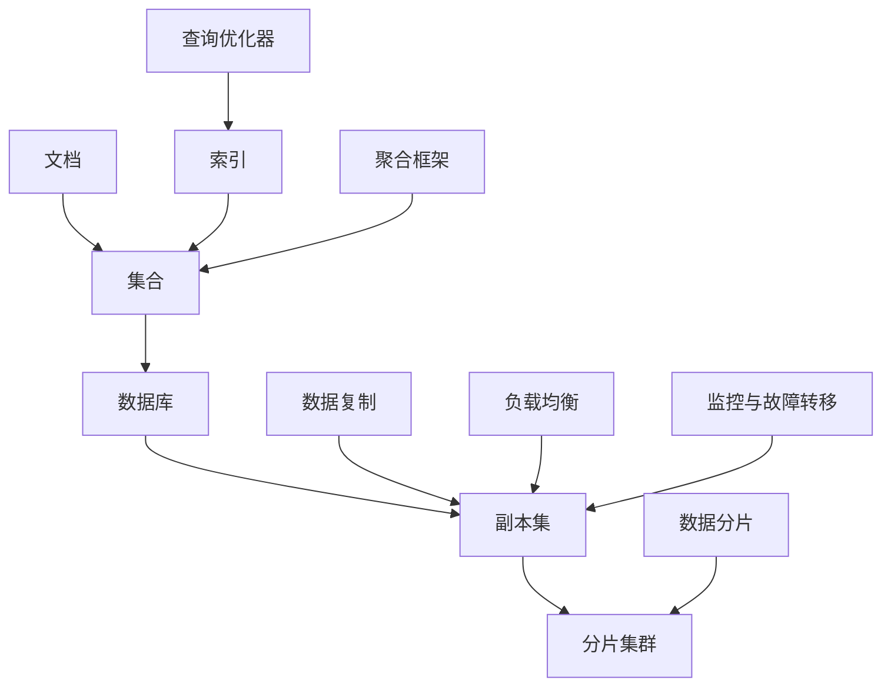

                 

# MongoDB原理与代码实例讲解

## 关键词：MongoDB、文档数据库、NoSQL、数据模型、分布式架构、查询优化、性能调优、实践案例

## 摘要：

本文旨在深入讲解MongoDB的原理及其在实际项目中的应用。我们将从MongoDB的背景介绍开始，逐步探讨其核心概念、数据模型、分布式架构、查询优化策略，并通过具体的代码实例进行实践分析。最后，我们将总结MongoDB在实际应用中的场景，并推荐相关工具和资源，帮助读者更好地理解和应用MongoDB。

## 1. 背景介绍

MongoDB是一个流行的开源NoSQL数据库，由10gen公司（现称MongoDB Inc.）在2009年推出。它的设计目标是处理大量的非结构化和半结构化数据，并在云环境中提供强大的性能和可扩展性。与传统的SQL数据库相比，MongoDB具有以下特点：

- **文档数据模型**：MongoDB使用文档数据模型来存储数据，每个文档都是一个键值对集合，类似于JSON对象。这种数据模型使得数据结构更加灵活，便于处理复杂和多变的数据。

- **水平可扩展性**：MongoDB通过分布式集群架构实现水平扩展，可以轻松地增加或减少存储容量和处理能力。

- **高性能**：MongoDB采用了多种优化技术，如内存管理、索引优化、查询缓存等，确保了高性能的数据访问。

- **丰富的查询功能**：MongoDB提供了丰富的查询语言，支持对文档进行复杂查询和聚合操作，便于实现复杂的数据分析。

## 2. 核心概念与联系

下面是MongoDB的核心概念及其相互关系的Mermaid流程图：



### 2.1. 文档

文档是MongoDB数据存储的基本单位，每个文档都是一个键值对集合，类似于JSON对象。文档具有以下特点：

- **结构化**：每个文档都有一个唯一的主键字段。
- **动态性**：文档的结构可以灵活变化，无需修改表结构。
- **嵌套**：文档可以嵌套其他文档或数组。

### 2.2. 集合

集合是存储一组文档的逻辑容器。集合在物理上是一个BSON文件，MongoDB通过文件系统进行存储和管理。

### 2.3. 数据库

数据库是MongoDB的命名空间，用于存储多个集合。数据库在物理上是一个目录，包含多个BSON文件。

### 2.4. 副本集

副本集是一个同步复制的数据库实例集合，提供数据冗余、故障转移和读写分离等功能。

### 2.5. 分片集群

分片集群将数据分布在多个节点上，提供水平扩展能力。分片集群由多个副本集组成，每个副本集负责一个或多个分片。

### 2.6. 索引

索引是一种特殊的数据结构，用于加快查询速度。MongoDB支持多种索引类型，如单字段索引、复合索引和多键索引。

### 2.7. 聚合框架

聚合框架是一种对文档进行复杂操作的工具，支持数据聚合、分组、排序、过滤等操作。

### 2.8. 查询优化器

查询优化器是MongoDB的核心组件，负责生成最有效的查询计划，优化查询性能。

### 2.9. 数据复制

数据复制是MongoDB的默认行为，通过副本集实现数据冗余和故障转移。

### 2.10. 数据分片

数据分片是将数据水平分布在多个节点上，提高存储容量和处理能力。

### 2.11. 负载均衡

负载均衡将客户端请求分布到多个节点，提高系统性能和可用性。

### 2.12. 监控与故障转移

监控与故障转移是副本集和分片集群的重要组成部分，负责监控系统状态和实现故障转移。

## 3. 核心算法原理 & 具体操作步骤

### 3.1. 文档存储原理

MongoDB使用BSON（Binary JSON）格式存储文档。每个文档包含多个键值对，其中键是字符串类型，值可以是字符串、数字、布尔值、数组、嵌套文档等。MongoDB采用一种可扩展的存储结构，允许文档结构灵活变化。

### 3.2. 索引算法原理

MongoDB使用B树结构的索引，支持快速查询。索引由索引键和索引值组成，索引键是文档中的一个字段，索引值是字段对应的值。通过索引键可以快速查找索引值，从而提高查询性能。

### 3.3. 查询优化算法原理

MongoDB的查询优化器采用动态规划算法，根据查询语句和索引信息生成最优的查询计划。查询优化器考虑了多个因素，如索引选择、查询范围、排序顺序等，以确保查询性能。

### 3.4. 分布式算法原理

MongoDB的分布式算法主要涉及数据复制、数据分片、负载均衡和故障转移等方面。数据复制通过副本集实现，确保数据冗余和故障转移。数据分片通过分片集群实现，提高存储容量和处理能力。负载均衡将客户端请求分布到多个节点，提高系统性能和可用性。故障转移是一种自动切换到备用节点的机制，确保系统高可用性。

## 4. 数学模型和公式 & 详细讲解 & 举例说明

### 4.1. 索引存储空间计算

索引存储空间计算公式为：

$$
S = n \times \log_2(n)
$$

其中，$S$ 是索引存储空间（字节），$n$ 是索引项数量。

### 4.2. 查询时间计算

查询时间计算公式为：

$$
T = \frac{S}{B}
$$

其中，$T$ 是查询时间（秒），$S$ 是索引存储空间（字节），$B$ 是数据块大小（字节）。

### 4.3. 负载均衡算法

负载均衡算法采用加权轮询法，根据节点权重分配请求。节点权重计算公式为：

$$
W_i = \frac{R_i}{C}
$$

其中，$W_i$ 是节点 $i$ 的权重，$R_i$ 是节点 $i$ 的响应时间，$C$ 是所有节点的响应时间总和。

## 5. 项目实战：代码实际案例和详细解释说明

### 5.1 开发环境搭建

在开始实践之前，我们需要搭建一个MongoDB开发环境。以下是使用Docker快速搭建MongoDB副本集的步骤：

```shell
# 拉取MongoDB官方镜像
docker pull mongo

# 运行MongoDB容器
docker run --name mongodb -d mongo

# 进入MongoDB容器
docker exec -it mongodb mongo

# 配置副本集
rs.initiate({
  _id: "myReplicaSet",
  members: [
    { _id: 0, host: "mongodb:27017" }
  ]
})
```

### 5.2 源代码详细实现和代码解读

以下是使用Python的pymongo库操作MongoDB的示例代码：

```python
from pymongo import MongoClient

# 连接MongoDB副本集
client = MongoClient("mongodb://mongodb:27017/?replicaSet=myReplicaSet")

# 选择数据库
db = client["myDatabase"]

# 选择集合
collection = db["myCollection"]

# 插入文档
document = {"name": "Alice", "age": 30, "email": "alice@example.com"}
result = collection.insert_one(document)
print(f"Inserted document with id: {result.inserted_id}")

# 查询文档
query = {"age": 30}
result = collection.find(query)
for doc in result:
    print(doc)

# 更新文档
update = {"$set": {"age": 31}}
result = collection.update_one(query, update)
print(f"Updated {result.modified_count} documents.")

# 删除文档
result = collection.delete_one(query)
print(f"Deleted {result.deleted_count} documents.")
```

### 5.3 代码解读与分析

- **连接MongoDB副本集**：使用`MongoClient`类连接MongoDB副本集，通过URL指定副本集名称和连接端口。
- **选择数据库和集合**：使用`client["myDatabase"]`和`db["myCollection"]`选择数据库和集合。
- **插入文档**：使用`insert_one`方法向集合中插入一个文档，返回一个`InsertOneResult`对象，包含插入文档的ID。
- **查询文档**：使用`find`方法根据条件查询文档，返回一个`Cursor`对象，可以使用`for`循环遍历文档。
- **更新文档**：使用`update_one`方法根据条件更新文档，返回一个`UpdateResult`对象，包含修改的文档数量。
- **删除文档**：使用`delete_one`方法根据条件删除文档，返回一个`DeleteResult`对象，包含删除的文档数量。

## 6. 实际应用场景

MongoDB在实际项目中具有广泛的应用场景，以下是一些常见的应用场景：

- **内容管理系统**：MongoDB适用于存储和管理大量结构化和非结构化数据，如文章、图片、视频等，适用于内容管理系统（CMS）。
- **实时分析系统**：MongoDB支持高效的聚合查询，适用于实时分析系统，如社交媒体分析、股票交易分析等。
- **物联网应用**：MongoDB适用于存储和处理海量物联网设备数据，如传感器数据、设备状态等。
- **用户画像系统**：MongoDB适用于构建用户画像系统，存储和管理用户行为数据、偏好数据等。

## 7. 工具和资源推荐

### 7.1 学习资源推荐

- **书籍**：
  - 《MongoDB权威指南》
  - 《MongoDB实战》
  - 《MongoDB实战：使用MongoDB进行数据处理、可视化和大数据分析》

- **论文**：
  - 《The MongoDB Database Server》
  - 《Scalable Storage Using the BigTable System》
  - 《The Google File System》

- **博客**：
  - [MongoDB官方博客](https://www.mongodb.com/blogs)
  - [MongoDB中文网博客](https://www.mongodb.org.cn/)

- **网站**：
  - [MongoDB官网](https://www.mongodb.com/)
  - [MongoDB中文网](https://www.mongodb.org.cn/)

### 7.2 开发工具框架推荐

- **开发工具**：
  - MongoDB Compass：一款强大的MongoDB管理工具，支持数据可视化和查询优化。
  - PyMongo：Python官方的MongoDB驱动，适用于Python开发人员。

- **框架**：
  - Mongoose：一个流行的Node.js MongoDB对象模型工具，支持数据验证、自动更新和自动处理。
  - Spring Data MongoDB：一个基于Spring Data的MongoDB集成框架，支持Spring开发人员快速构建MongoDB应用程序。

### 7.3 相关论文著作推荐

- **论文**：
  - 《MongoDB: A Document-Oriented Database System》
  - 《The Google File System》
  - 《Bigtable: A Distributed Storage System for Structured Data》

- **著作**：
  - 《MongoDB权威指南》
  - 《MongoDB实战》
  - 《MongoDB实战：使用MongoDB进行数据处理、可视化和大数据分析》

## 8. 总结：未来发展趋势与挑战

随着大数据和实时应用的发展，MongoDB在未来将继续发挥重要作用。以下是一些发展趋势和挑战：

- **性能优化**：随着数据规模的不断扩大，如何优化MongoDB的性能成为一个重要课题。未来，MongoDB可能会引入更多智能优化技术，如自动索引、自动分片等。
- **多模型支持**：虽然MongoDB以文档数据模型为主，但未来可能会引入更多数据模型，如图形数据模型、时序数据模型等，以满足不同场景的需求。
- **跨平台支持**：随着云计算和移动应用的兴起，MongoDB需要更好地支持跨平台，包括云原生应用、容器化部署等。
- **安全性**：随着数据隐私和安全的关注度不断提高，MongoDB需要加强数据安全措施，如加密传输、访问控制等。

## 9. 附录：常见问题与解答

### 9.1 MongoDB安装问题

Q：为什么我的MongoDB安装失败了？

A：安装失败可能有多种原因，如网络问题、依赖问题等。您可以查看安装日志，了解具体错误原因，并尝试解决。

### 9.2 MongoDB性能问题

Q：如何优化MongoDB性能？

A：优化MongoDB性能可以从以下几个方面入手：

- 索引优化：合理选择索引类型和索引键，提高查询速度。
- 存储优化：选择合适的存储引擎，如 WiredTiger，提高存储性能。
- 系统优化：优化操作系统配置，如内存管理、网络配置等。

## 10. 扩展阅读 & 参考资料

- [MongoDB官方文档](https://docs.mongodb.com/)
- [MongoDB开发者社区](https://developer.mongodb.com/)
- [MongoDB博客](https://www.mongodb.com/blogs)

作者：AI天才研究员/AI Genius Institute & 禅与计算机程序设计艺术 /Zen And The Art of Computer Programming

