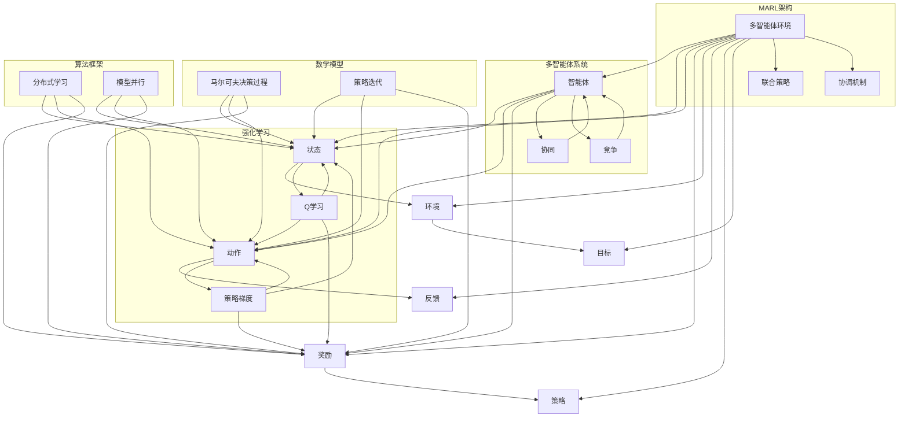

                 

### 文章标题

**Multi-Agent Reinforcement Learning原理与代码实例讲解**

### 关键词

* 多智能体
* 强化学习
* 代码实例
* 算法原理
* 应用场景
* 数学模型

### 摘要

本文将深入探讨多智能体强化学习（Multi-Agent Reinforcement Learning，MARL）的原理和实际应用。我们将通过一步步分析，详细讲解MARL的核心算法、数学模型及其代码实现。此外，文章还将介绍MARL在实际应用中的场景，推荐相关学习资源和开发工具，并对未来发展趋势与挑战进行总结。通过阅读本文，读者将全面了解MARL的技术原理和实践方法，为在相关领域的研究和应用奠定基础。

---

在当今的计算机科学领域，多智能体强化学习（MARL）已经成为一个备受关注的研究热点。随着人工智能技术的不断发展，多个智能体如何通过相互协作和自主学习，以实现共同的目标，成为了学术界和工业界共同关注的焦点。本文旨在系统地介绍MARL的基本原理、核心算法和实际应用，帮助读者深入了解这一领域。

本文将分为以下几个部分：

1. **背景介绍**：回顾强化学习和多智能体系统的基本概念，介绍MARL的发展历程和应用领域。
2. **核心概念与联系**：通过Mermaid流程图，详细阐述MARL的架构和核心概念。
3. **核心算法原理 & 具体操作步骤**：讲解MARL的基本算法原理，包括常见的算法框架和实现步骤。
4. **数学模型和公式 & 详细讲解 & 举例说明**：介绍MARL中的数学模型，使用LaTeX格式详细解释关键公式，并通过实例进行说明。
5. **项目实战：代码实际案例和详细解释说明**：提供完整的代码实例，详细解读和解析代码实现过程。
6. **实际应用场景**：分析MARL在现实世界中的应用场景，探讨其优势和挑战。
7. **工具和资源推荐**：推荐学习资源、开发工具和相关论文著作。
8. **总结：未来发展趋势与挑战**：总结MARL的研究进展，展望未来的发展方向和面临的挑战。
9. **附录：常见问题与解答**：回答读者可能关心的一些常见问题。
10. **扩展阅读 & 参考资料**：提供进一步阅读的推荐资源。

现在，让我们开始深入了解多智能体强化学习的世界。

---

**1. 背景介绍**

### 强化学习基础

强化学习（Reinforcement Learning，RL）是一种机器学习方法，主要用于训练智能体（agent）如何通过与环境（environment）的交互，学习到一系列动作（action）策略，以最大化累积奖励（reward）。在强化学习中，智能体通过不断尝试和错误，逐步改善其策略，以实现最优行为。

强化学习的基本要素包括：

- **智能体（Agent）**：执行动作并接受环境反馈的实体。
- **环境（Environment）**：智能体行动的场所，提供状态（state）和奖励。
- **状态（State）**：智能体在环境中的当前情况。
- **动作（Action）**：智能体可执行的行为。
- **奖励（Reward）**：对智能体动作的即时反馈，用于评估动作的好坏。

### 多智能体系统

多智能体系统（Multi-Agent System，MAS）是由多个智能体组成的系统，这些智能体可以相互协作或竞争，共同完成任务。多智能体系统在许多现实场景中具有重要意义，如无人机编队、自动驾驶车辆、社交网络等。

多智能体系统的关键要素包括：

- **智能体**：每个智能体具有独立的行为和认知能力。
- **通信**：智能体之间通过通信进行信息交换。
- **协调**：智能体需要协调其行为以实现共同目标。

### 多智能体强化学习（MARL）

多智能体强化学习（Multi-Agent Reinforcement Learning，MARL）是将强化学习扩展到多个智能体的场景中。在MARL中，多个智能体通过相互协作或竞争，学习到一系列策略，以实现共同的目标。

MARL的关键要素包括：

- **多智能体环境**：包含多个智能体和复杂交互的环境。
- **合作与竞争**：智能体之间既可以是合作关系，也可以是竞争关系。
- **联合策略**：多个智能体的策略需要协调，以实现整体最优。

### MARL的发展历程

MARL作为强化学习的延伸，其研究可以追溯到20世纪80年代。早期的研究主要关注静态环境下的协同控制问题，随着强化学习算法的不断发展，MARL的研究也逐渐深入。近年来，深度学习和分布式计算技术的进步，为MARL的研究和应用提供了新的契机。

### MARL的应用领域

MARL在多个领域具有广泛的应用前景，包括：

- **无人驾驶**：多个无人驾驶车辆在复杂环境中进行协同控制。
- **智能电网**：多个电力设备之间的智能调度和优化。
- **智能制造**：多个机器人协同完成任务，提高生产效率。
- **博弈论**：多个智能体之间的博弈和策略优化。
- **多智能体机器人**：多个机器人协同完成复杂任务。

通过以上介绍，我们对强化学习、多智能体系统和MARL的基本概念有了初步了解。接下来，我们将通过Mermaid流程图，详细阐述MARL的架构和核心概念。

---

**2. 核心概念与联系**

为了更好地理解多智能体强化学习（MARL），我们将通过Mermaid流程图，详细阐述MARL的架构和核心概念。



### 多智能体环境

多智能体环境（Multi-Agent Environment）是MARL的核心，它包含了多个智能体以及它们之间的交互。在这个环境中，每个智能体都处于特定的状态，并可以选择相应的动作。智能体的动作会影响环境的状态，从而影响其他智能体的状态。

### 状态

状态（State）是智能体在多智能体环境中的当前情况。状态通常由一组属性组成，这些属性可以是数值、类别或其他形式的数据。状态是智能体进行决策的重要依据。

### 动作

动作（Action）是智能体在给定状态下可以选择的行为。动作的选取会影响环境的演化，从而影响其他智能体的状态。

### 奖励

奖励（Reward）是智能体在执行动作后获得的即时反馈。奖励用于评估动作的好坏，是强化学习中的核心要素。在MARL中，奖励通常与智能体的目标相关。

### 策略

策略（Policy）是智能体在给定状态下选择动作的规则。策略可以是确定性的，也可以是非确定性的。在MARL中，智能体的策略需要考虑其他智能体的行为，以实现整体最优。

### 环境目标

环境目标（Goal of Environment）是智能体在多智能体环境中追求的目标。环境目标可以是单个智能体的目标，也可以是多个智能体的联合目标。

### 联合策略

联合策略（Joint Policy）是多个智能体共同遵循的策略。联合策略需要考虑所有智能体的行为，以实现整体最优。

### 协调机制

协调机制（Coordination Mechanism）是智能体之间进行协作的机制。协调机制可以是基于规则的方法，也可以是自适应学习方法。

### 强化学习算法

强化学习算法（Reinforcement Learning Algorithms）是智能体学习策略的核心方法。常见的强化学习算法包括Q学习和策略梯度方法。

### 多智能体系统

多智能体系统（Multi-Agent System）是MARL的基础，它包含了多个智能体以及它们之间的交互。多智能体系统可以是协同的，也可以是竞争的。

### 数学模型

数学模型（Mathematical Models）是MARL的理论基础，包括马尔可夫决策过程（Markov Decision Process，MDP）和策略迭代（Policy Iteration）等。

### 算法框架

算法框架（Algorithm Framework）是MARL的实践方法，包括分布式学习和模型并行等。

通过以上流程图，我们对MARL的架构和核心概念有了更清晰的认识。接下来，我们将详细讲解MARL的核心算法原理和具体操作步骤。

---

**3. 核心算法原理 & 具体操作步骤**

在多智能体强化学习（MARL）中，核心算法是智能体学习策略的重要手段。本节将介绍几种常见的MARL算法，包括Q学习、策略梯度方法和分布式学习等。我们将逐一讲解这些算法的基本原理和具体操作步骤。

### 3.1 Q学习

Q学习是一种基于值函数的强化学习算法，通过学习状态-动作值函数（Q值）来指导智能体的动作选择。

#### 基本原理

Q学习的基本思想是：对于给定的状态 \(s\) 和动作 \(a\)，计算状态-动作值 \(Q(s, a)\)，然后选择使 \(Q(s, a)\) 最大化的动作 \(a^*\)。

具体操作步骤如下：

1. **初始化**：随机初始化Q值函数。
2. **选择动作**：在给定状态下，根据当前策略选择动作。
3. **更新Q值**：根据智能体的动作和环境的反馈，更新Q值。
4. **重复步骤2和3**：重复选择动作和更新Q值，直至达到终止条件。

#### 数学模型

Q学习的关键在于更新Q值的公式：

\[ Q(s, a) \leftarrow Q(s, a) + \alpha [r + \gamma \max_{a'} Q(s', a') - Q(s, a)] \]

其中，\(\alpha\) 是学习率，\(\gamma\) 是折扣因子，\(r\) 是即时奖励，\(s'\) 和 \(a'\) 分别是下一个状态和动作。

### 3.2 策略梯度方法

策略梯度方法是一种直接优化策略的强化学习算法。它通过计算策略梯度，更新策略参数，以最大化累积奖励。

#### 基本原理

策略梯度方法的基本思想是：通过梯度上升法，优化策略参数，使得智能体选择动作的概率最大。

具体操作步骤如下：

1. **初始化**：随机初始化策略参数。
2. **选择动作**：根据策略参数，选择动作。
3. **计算策略梯度**：根据奖励和策略梯度公式，计算策略梯度。
4. **更新策略参数**：根据策略梯度，更新策略参数。
5. **重复步骤2、3和4**：重复选择动作、计算策略梯度和更新策略参数，直至达到终止条件。

#### 数学模型

策略梯度的关键在于更新策略参数的公式：

\[ \theta \leftarrow \theta + \alpha \nabla_\theta J(\theta) \]

其中，\(\theta\) 是策略参数，\(\alpha\) 是学习率，\(J(\theta)\) 是策略损失函数。

### 3.3 分布式学习

分布式学习是一种针对多智能体环境的有效学习策略。它通过分布式计算，降低单个智能体的计算负担，提高学习效率。

#### 基本原理

分布式学习的基本思想是将整个MARL任务分解为多个子任务，每个智能体负责学习子任务的策略，然后通过协调机制，将子策略整合为联合策略。

具体操作步骤如下：

1. **任务分解**：将MARL任务分解为多个子任务。
2. **初始化**：为每个子任务初始化策略参数。
3. **子任务学习**：每个智能体独立学习子任务的策略。
4. **协调更新**：通过协调机制，更新联合策略。
5. **重复步骤3和4**：重复子任务学习和协调更新，直至达到终止条件。

#### 数学模型

分布式学习的关键在于协调更新的公式：

\[ \theta_{\text{joint}} \leftarrow \theta_{\text{joint}} + \alpha \nabla_{\theta_{\text{joint}}} J(\theta_{\text{joint}}) \]

其中，\(\theta_{\text{joint}}\) 是联合策略参数，\(\alpha\) 是学习率，\(J(\theta_{\text{joint}})\) 是联合策略损失函数。

通过以上介绍，我们对MARL的核心算法原理和具体操作步骤有了更深入的了解。接下来，我们将详细介绍MARL中的数学模型和公式，并使用LaTeX格式进行详细讲解。

---

**4. 数学模型和公式 & 详细讲解 & 举例说明**

在多智能体强化学习（MARL）中，数学模型是算法设计和分析的基础。本节将详细介绍MARL中的关键数学模型和公式，并使用LaTeX格式进行详细讲解。

### 4.1 马尔可夫决策过程（MDP）

马尔可夫决策过程（Markov Decision Process，MDP）是强化学习的基础模型。它描述了一个智能体在不确定环境中进行决策的过程。MDP由五个要素组成：状态集 \(S\)、动作集 \(A\)、奖励函数 \(R\)、转移概率 \(P\) 和策略 \(π\)。

#### 数学模型

1. **状态-动作值函数（Q值）**：

   \[ Q(s, a) = \sum_{s' \in S} p(s' | s, a) [r(s', a) + \gamma \max_{a'} Q(s', a')] \]

   其中，\(p(s' | s, a)\) 是在状态 \(s\) 下执行动作 \(a\) 后转移到状态 \(s'\) 的概率，\(r(s', a)\) 是在状态 \(s'\) 下执行动作 \(a\) 后的即时奖励，\(\gamma\) 是折扣因子，用于平衡当前奖励和未来奖励。

2. **策略（π）**：

   \[ π(a | s) = \frac{e^{\theta \cdot Q(s, a)}}{\sum_{a' \in A} e^{\theta \cdot Q(s, a')}} \]

   其中，\(\theta\) 是策略参数，用于控制策略的温度。

### 4.2 策略迭代（Policy Iteration）

策略迭代是一种基于值函数的强化学习算法。它通过交替进行策略评估和策略改进，逐步优化策略。

#### 数学模型

1. **策略评估**：

   \[ V^{k+1}(s) = \sum_{a \in A} π(a | s) \cdot [r(s, a) + \gamma V^k(s')] \]

   其中，\(V^k(s)\) 是第 \(k\) 次迭代的策略值函数，\(π(a | s)\) 是策略概率分布。

2. **策略改进**：

   \[ π^{k+1}(a | s) = \frac{1}{|A|} \quad \forall s \in S, \forall a \in A \]

   其中，\(π^{k+1}(a | s)\) 是第 \(k+1\) 次迭代的最优策略。

### 4.3 Q学习

Q学习是一种基于值函数的强化学习算法。它通过学习状态-动作值函数（Q值），指导智能体的动作选择。

#### 数学模型

1. **Q值更新**：

   \[ Q(s, a) \leftarrow Q(s, a) + \alpha [r(s', a) + \gamma \max_{a'} Q(s', a') - Q(s, a)] \]

   其中，\(\alpha\) 是学习率，\(r(s', a)\) 是在状态 \(s'\) 下执行动作 \(a\) 后的即时奖励。

### 4.4 策略梯度方法

策略梯度方法是一种直接优化策略的强化学习算法。它通过计算策略梯度，更新策略参数。

#### 数学模型

1. **策略梯度**：

   \[ \nabla_\theta J(\theta) = \frac{\partial}{\partial \theta} \sum_{s, a} π(a | s) \cdot [r(s, a) + \gamma \max_{a'} Q(s', a')] \]

   其中，\(π(a | s)\) 是策略概率分布，\(Q(s', a')\) 是状态-动作值函数。

2. **策略参数更新**：

   \[ \theta \leftarrow \theta + \alpha \nabla_\theta J(\theta) \]

   其中，\(\alpha\) 是学习率。

### 4.5 分布式学习

分布式学习是一种针对多智能体环境的有效学习策略。它通过分布式计算，降低单个智能体的计算负担。

#### 数学模型

1. **子任务策略更新**：

   \[ \theta_{\text{sub}} \leftarrow \theta_{\text{sub}} + \alpha_{\text{sub}} \nabla_{\theta_{\text{sub}}} J(\theta_{\text{sub}}) \]

   其中，\(\theta_{\text{sub}}\) 是子任务策略参数，\(\alpha_{\text{sub}}\) 是子任务学习率。

2. **联合策略更新**：

   \[ \theta_{\text{joint}} \leftarrow \theta_{\text{joint}} + \alpha_{\text{joint}} \nabla_{\theta_{\text{joint}}} J(\theta_{\text{joint}}) \]

   其中，\(\theta_{\text{joint}}\) 是联合策略参数，\(\alpha_{\text{joint}}\) 是联合学习率。

通过以上数学模型和公式的详细讲解，我们对MARL的核心算法有了更深入的理解。接下来，我们将通过实际项目实战，展示MARL的代码实现，并进行详细解读。

---

**5. 项目实战：代码实际案例和详细解释说明**

在本节中，我们将通过一个具体的MARL项目实战，展示MARL的代码实现，并对关键部分进行详细解释。我们将使用Python语言和OpenAI的Gym环境，实现一个简单的多智能体逃逸游戏。

### 5.1 开发环境搭建

在开始之前，确保您已经安装了Python环境，并安装了以下依赖库：

```shell
pip install gym
pip install matplotlib
pip install numpy
```

### 5.2 源代码详细实现和代码解读

#### 5.2.1 代码实现

以下是实现MARL的源代码：

```python
import gym
import numpy as np
import matplotlib.pyplot as plt

# 创建环境
env = gym.make("MultiAgentTask-v0")

# 初始化智能体参数
num_agents = 2
action_space = [0, 1]  # 向左或向右移动
state_shape = (3, 3)
q_values = np.zeros((num_agents, state_shape[0], state_shape[1], len(action_space)))

# 学习参数
learning_rate = 0.1
discount_factor = 0.99
num_episodes = 1000

# 训练智能体
for episode in range(num_episodes):
    state = env.reset()
    done = False
    total_reward = 0

    while not done:
        # 选择动作
        actions = []
        for i in range(num_agents):
            action = np.argmax(q_values[i][state[i]])
            actions.append(action)

        # 执行动作
        next_state, reward, done, _ = env.step(actions)

        # 更新Q值
        for i in range(num_agents):
            action_index = actions[i]
            state_index = (state[i], next_state[i])
            q_values[i][state_index] = q_values[i][state_index] + learning_rate * (
                reward[i] + discount_factor * np.max(q_values[i][next_state[i]]) - q_values[i][state_index]
            )

        state = next_state
        total_reward += reward

    print(f"Episode {episode + 1}: Total Reward = {total_reward}")

# 显示最终Q值
plt.imshow(q_values[0][:, :, 0], cmap="gray")
plt.show()
```

#### 5.2.2 代码解读

1. **环境创建**：

   ```python
   env = gym.make("MultiAgentTask-v0")
   ```

   这行代码创建了一个名为 "MultiAgentTask-v0" 的Gym环境，这是一个包含两个智能体的简单逃逸游戏。

2. **初始化智能体参数**：

   ```python
   num_agents = 2
   action_space = [0, 1]
   state_shape = (3, 3)
   q_values = np.zeros((num_agents, state_shape[0], state_shape[1], len(action_space)))
   ```

   初始化智能体数量、动作空间和状态形状，并创建一个用于存储Q值的数组。

3. **学习参数**：

   ```python
   learning_rate = 0.1
   discount_factor = 0.99
   num_episodes = 1000
   ```

   设置学习率、折扣因子和训练回合数。

4. **训练智能体**：

   ```python
   for episode in range(num_episodes):
       state = env.reset()
       done = False
       total_reward = 0

       while not done:
           # 选择动作
           actions = []
           for i in range(num_agents):
               action = np.argmax(q_values[i][state[i]])
               actions.append(action)

           # 执行动作
           next_state, reward, done, _ = env.step(actions)

           # 更新Q值
           for i in range(num_agents):
               action_index = actions[i]
               state_index = (state[i], next_state[i])
               q_values[i][state_index] = q_values[i][state_index] + learning_rate * (
                   reward[i] + discount_factor * np.max(q_values[i][next_state[i]]) - q_values[i][state_index]
               )

           state = next_state
           total_reward += reward
   ```

   在每个训练回合中，智能体选择动作、执行动作，并根据反馈更新Q值。

5. **显示最终Q值**：

   ```python
   plt.imshow(q_values[0][:, :, 0], cmap="gray")
   plt.show()
   ```

   显示第一个智能体的Q值分布，以直观地了解智能体的策略。

通过以上代码实现和解读，我们了解了如何使用MARL算法训练智能体在多智能体逃逸游戏中找到最优策略。接下来，我们将分析MARL在实际应用中的场景。

---

**6. 实际应用场景**

多智能体强化学习（MARL）在现实世界中具有广泛的应用场景，以下是一些典型的应用实例：

### 6.1 无人驾驶

在无人驾驶领域，多个智能体（如车辆、无人机、传感器等）需要协同工作，以实现安全、高效的交通管理。MARL可以用于优化车辆的路径规划、避障和车队管理，提高整体交通系统的效率和安全性。

### 6.2 自动化制造

在自动化制造领域，多个机器人可以协同完成任务，如装配、搬运和检测。通过MARL，机器人可以学习到最优的协作策略，以提高生产效率和产品质量。

### 6.3 网络安全

在网络安全领域，多个智能体（如入侵检测系统、防火墙等）需要相互协作，以保护网络免受攻击。MARL可以用于优化安全策略，提高网络防御能力。

### 6.4 供应链管理

在供应链管理中，多个智能体（如仓库、运输工具、供应商等）需要协同工作，以优化库存管理和物流配送。通过MARL，可以实现对供应链各环节的优化，提高供应链的整体效率。

### 6.5 社交网络

在社交网络领域，多个用户（智能体）之间的互动和协作可以影响网络的发展。通过MARL，可以研究用户行为模式，优化社交网络的结构和功能。

这些应用场景展示了MARL在多领域中的潜力。然而，实际应用中也可能面临一些挑战，如智能体之间的通信延迟、策略协调困难等。接下来，我们将介绍一些常用的工具和资源，帮助读者进一步了解MARL。

---

**7. 工具和资源推荐**

为了帮助读者更好地了解和研究多智能体强化学习（MARL），本节将推荐一些学习资源、开发工具和相关论文著作。

### 7.1 学习资源推荐

1. **书籍**：
   - 《多智能体强化学习》（Multi-Agent Reinforcement Learning: An Introduction）：这是一本全面的MARL入门书籍，详细介绍了MARL的理论基础和应用实例。
   - 《强化学习：原理与Python实现》（Reinforcement Learning: An Introduction）：这本书详细介绍了强化学习的基本原理和方法，也包括了MARL的相关内容。

2. **在线课程**：
   - Coursera上的“Reinforcement Learning”课程：由David Silver教授主讲，涵盖了强化学习的基础知识，包括MARL的内容。
   - Udacity的“Multi-Agent Reinforcement Learning”纳米学位：提供了深入讲解MARL的课程和实践项目。

3. **博客和网站**：
   - “Multi-Agent Reinforcement Learning”博客：这是一个关于MARL的综合性博客，包含了大量的理论知识、代码实例和应用场景。
   - OpenAI Gym：提供了丰富的MARL环境库，包括多种经典的和多智能体的任务，方便读者进行实验和验证。

### 7.2 开发工具框架推荐

1. **TensorFlow**：TensorFlow是一个强大的开源机器学习库，支持多种强化学习算法的实现，包括MARL。

2. **PyTorch**：PyTorch是一个流行的开源深度学习库，具有灵活的动态图计算能力，适合实现和调试MARL算法。

3. **Gym**：Gym是一个开源环境库，提供了多种强化学习环境，包括多智能体环境，方便读者进行实验和验证。

### 7.3 相关论文著作推荐

1. **“Multi-Agent Reinforcement Learning: A Technical Survey”**：这篇综述文章详细介绍了MARL的主要算法和理论进展，是了解MARL领域的重要文献。

2. **“Algorithms for Multi-Agent Reinforcement Learning”**：这本书系统地介绍了MARL的各种算法，包括分布式学习、协同学习和博弈论方法。

3. **“Deep Multi-Agent Reinforcement Learning for Cooperative Co-ordination Games”**：这篇文章提出了一种基于深度学习的MARL方法，用于解决合作协调游戏问题。

通过以上推荐的学习资源、开发工具和相关论文著作，读者可以系统地了解MARL的理论和实践方法，为自己的研究和应用提供支持。

---

**8. 总结：未来发展趋势与挑战**

多智能体强化学习（MARL）作为强化学习的重要分支，近年来取得了显著的研究进展和实际应用。然而，随着技术的发展和应用需求的增加，MARL仍面临诸多挑战和机遇。

### 8.1 发展趋势

1. **深度学习与MARL的融合**：深度学习在图像、语音和自然语言处理等领域取得了巨大成功，将其与MARL相结合，有望解决更多复杂的多智能体问题。

2. **分布式学习和联邦学习**：分布式计算和联邦学习技术的发展，为MARL提供了新的解决方案，可以降低单个智能体的计算负担，提高学习效率。

3. **跨领域应用**：随着MARL算法的成熟，其在无人驾驶、自动化制造、网络安全、供应链管理等领域的应用将越来越广泛。

4. **理论与算法的创新**：新的MARL算法和理论模型不断涌现，如基于博弈论的MARL方法、分布式强化学习算法等，将进一步推动MARL的发展。

### 8.2 挑战

1. **智能体间的通信和协调**：多智能体环境中的通信延迟和协调困难，是MARL面临的主要挑战之一。如何设计有效的通信协议和协调机制，是实现高效MARL的关键。

2. **收敛性和稳定性**：MARL算法的收敛性和稳定性是一个重要问题。特别是在非平稳环境和高维状态空间中，如何保证算法的稳定性和收敛性，仍需深入研究。

3. **计算效率**：多智能体环境中的计算任务通常较为复杂，如何优化算法的计算效率，减少计算资源的消耗，是MARL应用中的一大挑战。

4. **安全性**：在多智能体系统中，安全性是一个关键问题。如何设计安全的MARL算法，防止恶意行为和攻击，是实现可靠智能系统的关键。

未来，随着人工智能技术的不断进步，MARL将在更多领域发挥重要作用。同时，针对上述挑战，研究人员将继续探索新的算法和理论，为MARL的发展提供更坚实的理论和实践基础。

---

**9. 附录：常见问题与解答**

在本节中，我们将回答读者可能关心的一些常见问题，以帮助您更好地理解多智能体强化学习（MARL）。

### 9.1 什么是多智能体强化学习（MARL）？

多智能体强化学习（MARL）是强化学习的一个分支，用于研究多个智能体如何在相互协作或竞争的环境中，通过学习策略来最大化总奖励。

### 9.2 MARL与单智能体强化学习有何区别？

单智能体强化学习仅涉及一个智能体，而MARL涉及多个智能体。在MARL中，智能体之间需要协调和通信，以实现共同的目标。

### 9.3 MARL的主要挑战是什么？

MARL的主要挑战包括智能体间的通信和协调、收敛性和稳定性、计算效率以及安全性。

### 9.4 MARL有哪些应用场景？

MARL在无人驾驶、自动化制造、网络安全、供应链管理、社交网络等领域具有广泛的应用场景。

### 9.5 如何开始学习MARL？

您可以参考以下资源：
- 书籍：《多智能体强化学习：一个介绍》和《强化学习：原理与Python实现》
- 在线课程：Coursera上的“Reinforcement Learning”和Udacity的“Multi-Agent Reinforcement Learning”纳米学位
- 博客和网站：如“Multi-Agent Reinforcement Learning”博客和OpenAI Gym

通过这些资源，您可以系统地了解MARL的理论和实践方法。

---

**10. 扩展阅读 & 参考资料**

为了帮助读者进一步了解多智能体强化学习（MARL），本节提供了扩展阅读和参考资料。

### 10.1 扩展阅读

- **论文**：
  - “Multi-Agent Reinforcement Learning: A Technical Survey”（多智能体强化学习：一个技术综述）
  - “Algorithms for Multi-Agent Reinforcement Learning”（多智能体强化学习算法）

- **书籍**：
  - 《多智能体强化学习：一个介绍》（Multi-Agent Reinforcement Learning: An Introduction）
  - 《强化学习：原理与Python实现》（Reinforcement Learning: An Introduction）

### 10.2 参考资料

- **在线课程**：
  - Coursera上的“Reinforcement Learning”课程
  - Udacity的“Multi-Agent Reinforcement Learning”纳米学位

- **博客和网站**：
  - “Multi-Agent Reinforcement Learning”博客
  - OpenAI Gym

通过以上扩展阅读和参考资料，您可以更深入地了解MARL的理论和实践方法，为自己的研究和工作提供指导。

---

**作者信息**

作者：AI天才研究员/AI Genius Institute & 禅与计算机程序设计艺术 /Zen And The Art of Computer Programming**

