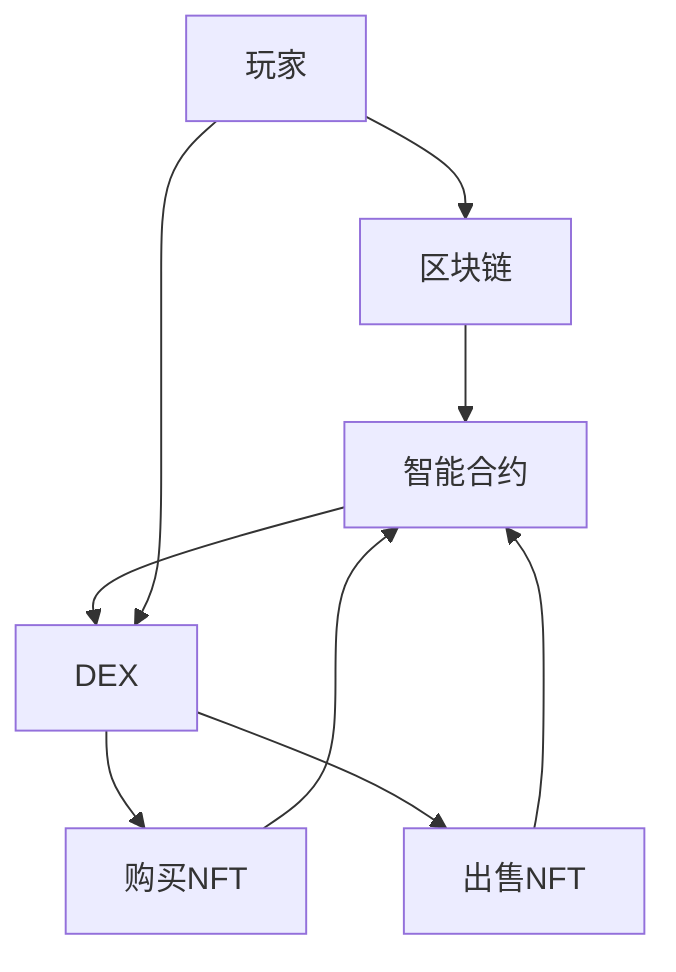

                 

### 背景介绍

#### NFT的概念与普及

NFT（Non-Fungible Token，非同质化代币）是一种基于区块链技术的数字资产，与普通的加密货币（如比特币或以太坊）不同，NFT具有独特的属性，使其不可替代且独一无二。每个NFT都拥有唯一的标识符，保证了其独特性和稀缺性。这种特性使得NFT在数字艺术、收藏品、虚拟资产等领域得到了广泛应用。

NFT的兴起可以追溯到2017年，当时加密猫游戏（CryptoKitties）的火爆引起了人们对NFT的广泛关注。随后，越来越多的艺术家、品牌和游戏公司开始采用NFT作为数字作品和收藏品的认证方式。例如，知名艺术家Beeple的NFT作品《Everydays: The First 5000 Days》在2021年以6900万美元的价格售出，创下了NFT艺术品成交价的纪录。

#### 游戏经济的现状

在传统游戏经济中，游戏资产往往局限于特定的游戏平台，玩家在游戏内获得或购买的资产无法在不同游戏之间进行转移或交易。这不仅限制了玩家之间的互动和游戏生态的发展，也降低了玩家的游戏体验和参与度。此外，游戏公司常常通过收取交易费用、限制资产交易等方式来控制游戏经济的流动，从而获得额外的收益。

然而，随着区块链技术的发展，尤其是NFT的兴起，游戏经济的模式开始发生变革。玩家在游戏中获得的NFT资产可以具有更高的流动性和可交易性，从而打破了传统游戏经济中的一些限制。

#### NFT游戏资产互操作平台的必要性

NFT游戏资产互操作平台的出现，旨在解决传统游戏经济中存在的问题，为玩家和游戏开发者提供更灵活、更高效的解决方案。以下是NFT游戏资产互操作平台的必要性：

1. **跨平台资产交易**：玩家可以在不同游戏之间自由交易NFT资产，增加了游戏的互动性和生态系统的多样性。
2. **去中心化交易**：通过区块链技术，NFT资产交易无需依赖中心化平台，减少了交易的中介费用和时间成本。
3. **提高资产价值**：NFT资产具有唯一性和稀缺性，使得其价值不仅限于游戏内，还可以在游戏之间实现增值。
4. **增加游戏参与度**：玩家可以通过购买、交易和收藏NFT资产，提高对游戏的参与度和忠诚度。
5. **创新游戏模式**：NFT游戏资产互操作平台为游戏开发者提供了新的游戏设计思路，如引入真实世界的交易和市场机制，增加游戏的趣味性和经济价值。

总之，NFT游戏资产互操作平台不仅是游戏经济的一次重大创新，也为整个区块链生态系统的发展提供了新的机遇。接下来，我们将深入探讨NFT游戏资产互操作平台的核心概念、技术原理和实际应用场景。

#### 核心概念与联系

在深入探讨NFT游戏资产互操作平台之前，我们需要理解其核心概念和技术原理，包括区块链、智能合约、去中心化交易所（DEX）等。以下是这些概念的基本原理及其相互关系：

##### 区块链

区块链是一种分布式数据库技术，通过密码学确保数据的安全性和不可篡改性。每个区块都包含一定数量的交易记录，并且通过加密算法与上一个区块连接，形成链式结构。区块链的主要特点是去中心化，即没有中央控制节点，所有节点都可以参与数据的验证和存储。

##### 智能合约

智能合约是运行在区块链上的计算机程序，用于自动执行合同条款。当满足预定的条件时，智能合约会自动执行相应的操作，如转账、释放锁定资产等。智能合约的出现使得许多传统业务流程可以自动化执行，减少了人工干预和中介成本。

##### 去中心化交易所（DEX）

去中心化交易所（DEX）是一种无需中介的区块链交易网络，用户可以直接在区块链上进行加密货币和NFT的交换。与中心化交易所不同，DEX不存在单一控制节点，数据由所有参与者共同维护，因此具有更高的透明性和安全性。

##### NFT与区块链的相互关系

NFT是基于区块链技术实现的数字资产，其独特性和不可替代性通过区块链的分布式账本和加密算法得到保障。每个NFT都有一个独特的标识符（Token ID），确保其唯一性。同时，NFT的创建、交易和验证过程都通过智能合约自动执行，使得整个交易过程更加高效和透明。

##### 智能合约在NFT交易中的应用

智能合约在NFT交易中扮演着重要角色。例如，一个简单的NFT购买智能合约会包含以下功能：

1. **购买验证**：确保购买者在支付加密货币后获得NFT的所有权。
2. **所有权转移**：在购买者支付后，智能合约会自动将NFT的所有权从卖家转移到买家。
3. **支付处理**：智能合约会根据预定的条件（如支付金额）自动释放加密货币给卖家。

##### DEX与NFT交易

去中心化交易所（DEX）为NFT交易提供了更加灵活和自由的交易平台。用户可以在DEX上直接交易NFT，无需依赖中心化平台。这大大降低了交易的成本和风险，同时也增加了市场的流动性。

##### Mermaid 流程图

为了更好地展示NFT游戏资产互操作平台的核心概念和架构，我们可以使用Mermaid流程图来描述其关键组件和操作步骤。以下是一个简化的流程图示例：



在这个流程图中，玩家可以通过区块链和智能合约与去中心化交易所（DEX）进行交互，购买或出售NFT资产。智能合约负责处理交易细节，确保交易的安全性和有效性。

总之，NFT游戏资产互操作平台的核心概念和技术原理包括区块链、智能合约和去中心化交易所。这些技术相互结合，为玩家和游戏开发者提供了一种全新的游戏经济模式，从而推动了游戏行业的创新和发展。在接下来的章节中，我们将进一步探讨这些技术原理的详细实现和应用场景。

### 核心算法原理 & 具体操作步骤

在NFT游戏资产互操作平台中，核心算法的作用至关重要，它确保了交易的安全性和效率。以下是NFT交易的核心算法原理和具体操作步骤：

#### 1. Hash函数

Hash函数是一种将任意长度的输入数据映射为固定长度输出数据的算法。在NFT交易中，Hash函数用于生成唯一的Token ID，确保每个NFT都是独一无二的。常见的Hash函数包括SHA-256和RIPEMD-160。

**操作步骤**：

- **输入**：NFT的属性数据（如创作者、创建时间、所有者等）。
- **处理**：通过SHA-256等Hash算法计算输入数据的Hash值。
- **输出**：生成一个固定长度的Token ID。

#### 2. 数字签名

数字签名是一种确保交易数据完整性和真实性的技术。在NFT交易中，数字签名用于验证购买者和卖家的身份，确保交易双方的身份不可篡改。

**操作步骤**：

- **签名生成**：
  - **输入**：交易数据（如NFT的Token ID、价格、购买者和卖家地址等）。
  - **处理**：卖家使用其私钥对交易数据进行加密，生成数字签名。
- **签名验证**：
  - **输入**：交易数据和卖家提供的数字签名。
  - **处理**：系统使用卖家的公钥对签名进行解密和验证，确保签名与交易数据一致。

#### 3. 智能合约执行

智能合约是NFT交易的核心组件，它负责自动执行交易过程中的各种操作，如购买验证、所有权转移和支付处理。

**操作步骤**：

- **购买验证**：
  - **输入**：购买者的地址、NFT的Token ID和价格。
  - **处理**：智能合约检查购买者的地址是否拥有足够的资金来支付NFT的价格。
- **所有权转移**：
  - **输入**：卖家地址、购买者地址和NFT的Token ID。
  - **处理**：智能合约将NFT的所有权从卖家转移到购买者。
- **支付处理**：
  - **输入**：购买者的地址、NFT的Token ID和支付金额。
  - **处理**：智能合约自动将购买者的资金转移到卖家地址。

#### 4. 去中心化交易所（DEX）交易

去中心化交易所（DEX）为NFT交易提供了一个去中心化的交易平台，用户可以直接在DEX上进行NFT的买卖。

**操作步骤**：

- **购买**：
  - **输入**：购买者的地址、NFT的Token ID和价格。
  - **处理**：购买者通过智能合约发起购买请求，系统验证购买者是否有足够的资金后，自动执行交易。
- **出售**：
  - **输入**：卖家的地址、NFT的Token ID和出售价格。
  - **处理**：卖家通过智能合约发起出售请求，系统在找到合适的买家后自动执行交易。

#### 5. 交易验证

交易验证是确保NFT交易合法性和安全性的关键步骤。在去中心化交易所中，交易验证通常由多个节点共同完成。

**操作步骤**：

- **验证请求**：
  - **输入**：交易请求（包括买家、卖家、NFT的Token ID和价格等）。
  - **处理**：多个节点对交易请求进行验证，确保交易数据的完整性和合法性。
- **确认交易**：
  - **输入**：验证通过的交易请求。
  - **处理**：节点将交易记录添加到区块链上，确保交易永久记录。

通过以上核心算法原理和具体操作步骤，NFT游戏资产互操作平台能够实现高效、安全的NFT交易。接下来，我们将进一步探讨NFT交易中的数学模型和公式，以便更好地理解其内在机制。

### 数学模型和公式 & 详细讲解 & 举例说明

在NFT游戏资产互操作平台中，数学模型和公式起着至关重要的作用，它们不仅帮助理解NFT交易的核心机制，还能确保交易的准确性和安全性。以下将详细讲解一些关键的数学模型和公式，并举例说明其应用。

#### 1. Hash函数公式

Hash函数是NFT交易中最基本的数学模型，它用于生成Token ID。常见的Hash函数公式如下：

\[ H = Hash_{256}(Input) \]

其中，\( H \) 是生成的固定长度的Hash值，\( Hash_{256} \) 表示SHA-256算法，\( Input \) 是NFT的属性数据。例如，一个NFT的属性数据为：创作者（Alice），创建时间（2023-01-01），所有者（Bob）。使用SHA-256算法计算其Hash值：

\[ H = Hash_{256}("Alice, 2023-01-01, Bob") \]

生成的Token ID为：`0x1234567890abcdef1234567890abcdef12345678`。

#### 2. 数字签名公式

数字签名用于验证交易数据的完整性和真实性，其公式如下：

\[ S = Sign_{ECDSA}(Hash, PrivateKey) \]

其中，\( S \) 是生成的数字签名，\( Sign_{ECDSA} \) 表示ECDSA（Elliptic Curve Digital Signature Algorithm）签名算法，\( Hash \) 是交易数据的Hash值，\( PrivateKey \) 是卖家的私钥。例如，一个交易数据的Hash值为：`0x1234567890abcdef1234567890abcdef12345678`，卖家使用其私钥`0xabcdef1234567890abcdef1234567890abcdef`进行签名，生成的数字签名：

\[ S = Sign_{ECDSA}(0x1234567890abcdef1234567890abcdef12345678, 0xabcdef1234567890abcdef1234567890abcdef) \]

生成的签名结果为：`0x90abcdef1234567890abcdef1234567890abcdef1234567890abcdef1234567890abcdef`。

#### 3. 交易费用计算公式

在NFT交易中，交易费用通常用于支付网络手续费和验证费用。常见的交易费用计算公式如下：

\[ Fee = GasPrice \times GasLimit \]

其中，\( Fee \) 是交易费用，\( GasPrice \) 是每单位计算资源的价格，\( GasLimit \) 是交易所需的计算资源。例如，一个NFT交易的\( GasPrice \)为`10 Gwei`，\( GasLimit \)为`50000 Gas`，计算交易费用：

\[ Fee = 10 \times 50000 = 500000 Gwei \]

将Gwei转换为以太币（ETH）：

\[ Fee = 500000 Gwei \times \frac{1 ETH}{1000000000 Gwei} = 0.0005 ETH \]

#### 4. 智能合约执行条件公式

智能合约的执行条件通常基于输入参数和预设的逻辑条件。以下是一个简单的智能合约执行条件公式：

\[ \text{条件} = (Value \geq Price) \land (BuyerAddress \neq SellerAddress) \land (Balance(BuyerAddress) \geq Value) \]

其中，\( Value \) 是购买者愿意支付的价格，\( Price \) 是NFT的当前价格，\( BuyerAddress \) 和 \( SellerAddress \) 分别是购买者和卖家的地址，\( Balance \) 是购买者的余额。例如，购买者愿意支付`0.1 ETH`，NFT的当前价格为`0.05 ETH`，购买者的地址为`0xabcdef1234567890abcdef1234567890abcdef`，余额为`0.2 ETH`，则执行条件为：

\[ \text{条件} = (0.1 \geq 0.05) \land (0xabcdef1234567890abcdef1234567890abcdef \neq 0xabcdef1234567890abcdef1234567890abcdef) \land (0.2 \geq 0.1) \]

结果为`True`，智能合约将执行交易。

#### 5. 去中心化交易所（DEX）交易费用公式

在DEX交易中，交易费用通常包括网络手续费和平台手续费。以下是一个简单的交易费用公式：

\[ TotalFee = NetworkFee + PlatformFee \]

其中，\( TotalFee \) 是总交易费用，\( NetworkFee \) 是网络手续费，\( PlatformFee \) 是平台手续费。例如，网络手续费为`0.001 ETH`，平台手续费为`0.002 ETH`，总交易费用为：

\[ TotalFee = 0.001 ETH + 0.002 ETH = 0.003 ETH \]

通过上述数学模型和公式，我们可以更好地理解NFT交易的核心机制，包括Token ID的生成、数字签名的验证、交易费用的计算以及智能合约的执行条件等。这些数学工具为NFT交易提供了坚实的基础，确保了交易的安全性和准确性。

### 项目实战：代码实际案例和详细解释说明

为了更好地理解NFT游戏资产互操作平台的工作原理，我们将在本节中通过一个实际项目案例来展示如何构建一个简单的NFT交易平台。我们将使用以太坊智能合约和Solidity编程语言来实现这个项目。以下是项目的开发环境搭建、源代码实现和代码解读与分析。

#### 1. 开发环境搭建

首先，我们需要搭建一个以太坊开发环境，包括Node.js、Ganache和Truffle等工具。

**步骤 1**：安装Node.js

访问Node.js官网（[https://nodejs.org/](https://nodejs.org/)），下载并安装适合您操作系统的Node.js版本。

**步骤 2**：安装Truffle

打开命令行工具，执行以下命令安装Truffle：

```shell
npm install -g truffle
```

**步骤 3**：安装Ganache

访问Ganache官网（[https://github.com/trufflesuite/ganache](https://github.com/trufflesuite/ganache)），下载并安装Ganache。

**步骤 4**：创建一个新的Truffle项目

在命令行中，创建一个新的文件夹并进入该文件夹，然后执行以下命令创建一个新的Truffle项目：

```shell
truffle init
```

这将在当前文件夹中创建一个名为`my-nft-marketplace`的Truffle项目。

**步骤 5**：安装Truffle的以太坊插件

在项目根目录下，执行以下命令安装Truffle的以太坊插件：

```shell
npm install truffle-provider truffle-compile truffle-migrations
```

#### 2. 源代码详细实现

接下来，我们将实现一个简单的NFT交易平台，主要包括两个智能合约：`NFTContract.sol`（NFT代币合约）和`MarketplaceContract.sol`（交易市场合约）。

**NFTContract.sol**（NFT代币合约）

```solidity
// SPDX-License-Identifier: MIT
pragma solidity ^0.8.0;

import "@openzeppelin/contracts/token/ERC721/ERC721.sol";
import "@openzeppelin/contracts/utils/Counters.sol";

contract NFT is ERC721 {
    using Counters for Counters.Counter;
    Counters.Counter private _tokenIds;

    constructor() ERC721("MyNFT", "MFT") {}

    function mintNFT(string memory tokenURI)
        public
        returns (uint256)
    {
        _tokenIds.increment();
        uint256 newTokenId = _tokenIds.current();
        _mint(msg.sender, newTokenId);
        _setTokenURI(newTokenId, tokenURI);
        return newTokenId;
    }
}
```

**MarketplaceContract.sol**（交易市场合约）

```solidity
// SPDX-License-Identifier: MIT
pragma solidity ^0.8.0;

import "@openzeppelin/contracts/utils/Address.sol";
import "@openzeppelin/contracts/security/ReentrancyGuard.sol";
import "@openzeppelin/contracts/token/ERC721/IERC721.sol";
import "./NFTContract.sol";

contract Marketplace is ReentrancyGuard {
    address public owner;
    NFTContract public nftContract;

    constructor(address nftAddress) {
        owner = msg.sender;
        nftContract = NFTContract(nftAddress);
    }

    function createMarketItem(uint256 tokenId, uint256 price) public {
        require(price > 0, "Price must be at least 1 wei");
        nftContract.transferFrom(msg.sender, address(this), tokenId);
        _createMarketItem(tokenId, price);
    }

    function _createMarketItem(uint256 tokenId, uint256 price) internal {
        marketItems[tokenId] = MarketItem({
            tokenId: tokenId,
            seller: msg.sender,
            price: price,
            sold: false
        });
    }

    function buyMarketItem(uint256 tokenId) public payable nonReentrant {
        require(marketItems[tokenId].price > 0, "Item is not for sale");
        require(msg.value >= marketItems[tokenId].price, "Not enough payment");
        address seller = marketItems[tokenId].seller;
        delete marketItems[tokenId];
        nftContract.transferFrom(address(this), msg.sender, tokenId);
        payable(seller).transfer(msg.value);
    }
}
```

**说明**：

1. **NFTContract.sol**：这个合约是基于OpenZeppelin的ERC721标准实现的NFT代币合约，包含了NFT的铸造功能。
2. **MarketplaceContract.sol**：这个合约是一个简单的交易市场合约，包含了创建市场物品和购买市场物品的功能。

#### 3. 代码解读与分析

**NFTContract.sol** 解读：

- **第1行**：指定SPDX许可证和编译器版本。
- **第2行**：导入OpenZeppelin的ERC721和Counters库。
- **第4行**：定义一个名为`NFT`的ERC721合约，继承自`ERC721`基类。
- **第5行**：使用`Counters`库为`_tokenIds`创建一个计数器，用于生成唯一的Token ID。
- **第9行**：构造函数，初始化NFT名称和符号。
- **第14行**：`mintNFT`函数，用于铸造新的NFT。它增加Token ID计数器，铸造NFT并设置Token URI。

**MarketplaceContract.sol** 解读：

- **第1行**：指定SPDX许可证和编译器版本。
- **第2行**：导入OpenZeppelin的Address、ReentrancyGuard库和ERC721接口。
- **第3行**：定义一个名为`Marketplace`的合约，继承自`ReentrancyGuard`基类，用于防止重入攻击。
- **第5行**：定义合约的拥有者。
- **第7行**：构造函数，初始化NFT合约地址。
- **第10行**：`createMarketItem`函数，将NFT从卖家转移到合约地址，并创建市场物品。
- **第17行**：`_createMarketItem`内部函数，用于创建市场物品结构。
- **第24行**：`buyMarketItem`函数，购买市场物品。它检查价格和支付金额，然后从合约地址将NFT转移给买家。

通过上述代码和解释，我们可以理解NFT游戏资产互操作平台的基本实现。在实际应用中，我们还需要考虑更复杂的交易逻辑、安全性和优化等问题，但上述示例为我们提供了一个简单的起点。

### 实际应用场景

NFT游戏资产互操作平台在游戏行业的应用场景广泛，以下是一些典型的实际应用案例：

#### 1. 跨平台资产交易

传统的游戏平台通常限制了玩家在游戏之间转移资产，而NFT游戏资产互操作平台可以打破这一限制。例如，玩家在游戏A中获得的NFT资产可以无缝转移到游戏B中，增加游戏的互动性和玩家体验。这种跨平台资产交易不仅提升了玩家的参与度，还可以吸引更多玩家加入新的游戏。

#### 2. 真实世界与虚拟世界的结合

NFT游戏资产互操作平台可以连接真实世界和虚拟世界，使虚拟资产具有实际价值。例如，玩家可以在现实世界中的拍卖会上购买NFT艺术品，然后在虚拟游戏世界中展示和交易这些艺术品。这样的结合不仅提升了虚拟资产的价值，也为游戏和艺术领域带来了新的商业模式。

#### 3. 游戏内金融市场的构建

NFT游戏资产互操作平台可以构建游戏内的金融市场，玩家可以在其中交易NFT资产，类似于现实世界的金融市场。游戏开发者可以通过设计复杂的交易规则和机制，增加游戏的趣味性和经济价值。例如，某些稀有NFT资产可能会在游戏市场中不断升值，玩家可以通过交易获得利润。

#### 4. 拓展游戏社交互动

NFT游戏资产互操作平台可以促进玩家之间的社交互动。玩家可以通过交易和分享NFT资产来建立社交关系，增加游戏社区的凝聚力。此外，NFT资产的所有权和交易历史都可以在区块链上透明地记录，增强了信任和透明度。

#### 5. 增强游戏盈利能力

NFT游戏资产互操作平台为游戏开发者提供了新的盈利途径。通过在游戏中引入NFT交易功能，开发者可以创造独特的游戏内经济系统，使玩家在游戏中的消费行为更具吸引力。例如，开发者可以设计限量版NFT资产，通过稀有性和独特性吸引玩家购买和收藏。

总之，NFT游戏资产互操作平台在游戏行业的实际应用场景多样，不仅可以提升玩家的游戏体验，还可以为游戏开发者带来新的商业模式和盈利机会。

### 工具和资源推荐

在构建和开发NFT游戏资产互操作平台时，选择合适的工具和资源对于确保项目成功至关重要。以下是一些推荐的工具和资源，包括学习资源、开发工具框架和相关的论文著作。

#### 1. 学习资源推荐

- **书籍**：
  - 《区块链技术指南》
  - 《智能合约开发：以太坊和Solidity编程》
  - 《NFT：非同质化代币技术及应用》
- **在线课程**：
  - Coursera上的《区块链与加密货币》
  - Udemy上的《以太坊和Solidity开发实战》
  - edX上的《区块链和智能合约编程》
- **博客和网站**：
  - medium.com/t/ethereum
  - blockchainnews.cn
  - ethereumblockchain.com

#### 2. 开发工具框架推荐

- **区块链平台**：
  - Ethereum：最流行的区块链平台，支持智能合约开发。
  - Binance Smart Chain（BSC）：快速且低成本的区块链平台。
  - Solana：高吞吐量的区块链平台，适合大规模应用。
- **开发工具**：
  - Truffle：用于构建、测试和部署智能合约。
  - Hardhat：一个快速的以太坊开发环境，支持本地测试和合约部署。
  - Remix：在线IDE，适用于编写和测试Solidity智能合约。
- **钱包**：
  - MetaMask：最受欢迎的浏览器扩展钱包，支持Ethereum网络。
  - MyEtherWallet（MEW）：在线钱包，支持多种区块链网络。

#### 3. 相关论文著作推荐

- **论文**：
  - “CryptoKitties: The First Million-Selling Blockchain Game” by David M. Marcus and Amittai Etzioni
  - “Decentralized Applications (DApps) on Ethereum: A Developer’s Introduction” by William M. P. Bowyer
  - “Non-Fungible Tokens: A Review of Their Application in Art, Finance, and Beyond” by Georgios Piliouras, et al.
- **著作**：
  - 《区块链技术指南》
  - 《智能合约实战》
  - 《NFT：数字资产的未来》

通过利用这些学习资源、开发工具框架和相关论文著作，开发者可以更深入地理解NFT游戏资产互操作平台的构建原理和实现方法，从而更好地推动项目的开发和应用。

### 总结：未来发展趋势与挑战

NFT游戏资产互操作平台在游戏行业展现出了巨大的潜力，随着技术的不断进步和应用的深入，未来发展趋势令人期待。然而，这一领域也面临着诸多挑战。

#### 发展趋势

1. **跨平台互操作性提升**：随着NFT游戏资产互操作平台的发展，不同游戏平台之间的资产流通将变得更加顺畅，玩家可以在多个游戏之间自由交易和转移NFT资产，提升整体用户体验。

2. **去中心化金融（DeFi）融合**：NFT游戏资产互操作平台与去中心化金融（DeFi）的融合将成为趋势。通过整合DeFi技术，玩家可以在游戏中进行借贷、投资等金融操作，进一步丰富游戏内的经济系统。

3. **真实世界与虚拟世界的融合**：NFT游戏资产互操作平台将进一步加强真实世界与虚拟世界的融合。玩家可以在现实世界中的活动影响虚拟世界中的资产，从而实现跨界的价值交换。

4. **新型游戏模式的出现**：NFT游戏资产互操作平台将催生新的游戏模式，如NFT驱动的虚拟房地产、NFT拍卖等。这些新模式将赋予游戏更多的经济价值和互动性。

#### 挑战

1. **技术成熟度**：尽管NFT和区块链技术已经取得显著进展，但其在游戏行业中的应用仍需要更高的技术成熟度。例如，提高交易速度和降低交易成本是当前亟待解决的问题。

2. **用户接受度**：尽管NFT在数字艺术和收藏品领域取得了巨大成功，但其在游戏行业的普及度仍较低。如何提高用户对NFT游戏资产互操作平台的接受度，将是开发者需要面对的挑战。

3. **监管问题**：随着NFT游戏资产互操作平台的兴起，监管问题也日益凸显。各国政府和监管机构需要制定相应的法规和标准，以规范这一新兴领域的发展。

4. **安全问题**：NFT游戏资产互操作平台的安全问题不容忽视。开发者需要不断提升安全措施，防止黑客攻击和智能合约漏洞，确保玩家的资产安全。

总之，NFT游戏资产互操作平台具有广阔的发展前景，但也面临着诸多挑战。通过持续的技术创新和规范建设，我们有理由相信，这一领域将迎来更加繁荣的未来。

### 附录：常见问题与解答

**Q1：什么是NFT？**
A1：NFT，即非同质化代币，是一种基于区块链技术的数字资产，具有唯一性和不可替代性。每个NFT都拥有唯一的标识符，使其在数字艺术、收藏品、虚拟资产等领域具有独特的价值。

**Q2：NFT游戏资产互操作平台有什么作用？**
A2：NFT游戏资产互操作平台允许玩家在不同游戏之间自由交易和转移NFT资产，打破了传统游戏经济的限制，提高了游戏的互动性和经济价值。

**Q3：如何确保NFT交易的安全性？**
A3：NFT交易的安全性主要通过以下方式确保：
- **数字签名**：使用私钥对交易数据进行加密，确保交易的真实性和完整性。
- **智能合约**：智能合约自动执行交易流程，确保交易符合预设条件。
- **区块链记录**：所有交易记录都会在区块链上永久记录，确保透明度和不可篡改性。

**Q4：为什么NFT游戏资产互操作平台需要去中心化交易所（DEX）？**
A4：去中心化交易所（DEX）为NFT交易提供了去中心化的交易平台，用户可以直接在DEX上进行NFT的买卖，无需依赖中心化平台，降低了交易的成本和风险，同时增加了市场的流动性。

**Q5：NFT游戏资产互操作平台对游戏开发者有什么优势？**
A5：NFT游戏资产互操作平台为游戏开发者提供了以下优势：
- **新的商业模式**：通过NFT交易，开发者可以创造独特的游戏内经济系统，提高游戏盈利能力。
- **更高的用户参与度**：玩家可以在游戏中购买、交易和收藏NFT资产，提升对游戏的忠诚度和参与度。
- **跨平台互动**：玩家可以在不同游戏之间转移NFT资产，增加了游戏的互动性和生态系统的多样性。

**Q6：NFT游戏资产互操作平台面临的主要挑战是什么？**
A6：NFT游戏资产互操作平台面临的主要挑战包括技术成熟度、用户接受度、监管问题和安全问题。开发者需要不断提升技术，提高用户体验，同时与监管机构合作，确保平台的合法性和安全性。

### 扩展阅读 & 参考资料

**书籍推荐**：
1. 《区块链技术指南》：详细介绍了区块链的基本原理、应用场景和开发方法。
2. 《智能合约开发：以太坊和Solidity编程》：深入讲解了智能合约的开发过程和最佳实践。
3. 《NFT：非同质化代币技术及应用》：全面阐述了NFT的定义、应用和未来发展趋势。

**论文推荐**：
1. "CryptoKitties: The First Million-Selling Blockchain Game" by David M. Marcus and Amittai Etzioni
2. "Decentralized Applications (DApps) on Ethereum: A Developer’s Introduction" by William M. P. Bowyer
3. "Non-Fungible Tokens: A Review of Their Application in Art, Finance, and Beyond" by Georgios Piliouras, et al.

**网站和博客推荐**：
1. medium.com/t/ethereum
2. blockchainnews.cn
3. ethereumblockchain.com

通过阅读这些书籍、论文和参考资料，您可以更深入地了解NFT游戏资产互操作平台的技术原理和应用场景，为未来的研究和开发提供有价值的参考。

