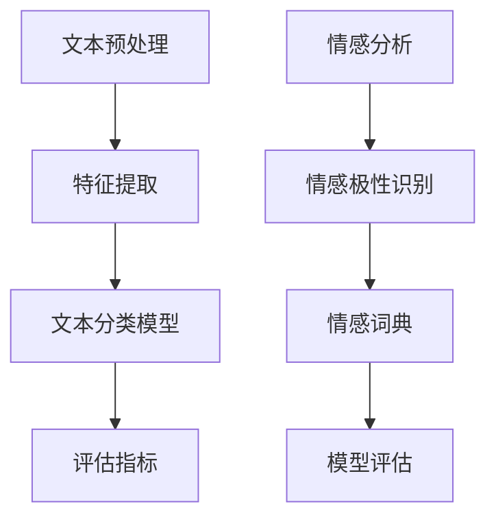

                 

# 自然语言处理（NLP）原理与代码实战案例讲解

## 关键词
自然语言处理（NLP），文本分类，情感分析，机器学习，深度学习，TensorFlow，Python

## 摘要
本文将深入探讨自然语言处理（NLP）的基本原理及其在现实世界中的应用。我们将详细介绍文本分类和情感分析等核心概念，并通过实际的代码案例来展示如何利用机器学习和深度学习技术实现这些功能。此外，还将推荐一系列的学习资源和开发工具，帮助读者更好地掌握NLP技术。

## 1. 背景介绍

自然语言处理（NLP）是人工智能（AI）领域的一个重要分支，旨在使计算机能够理解和处理人类语言。随着互联网的普及和大数据的发展，NLP技术已经广泛应用于搜索引擎、机器翻译、智能客服、情感分析等多个领域。文本分类和情感分析是NLP中的两个重要任务，它们在商业、教育、医疗等多个领域具有广泛的应用前景。

文本分类是指将文本数据根据其内容或主题进行分类，以便于后续的处理和分析。例如，可以将新闻文章分为体育、财经、科技等类别，或对社交媒体评论进行正面、负面等情感分类。

情感分析则是指对文本中的情感倾向进行识别和分类，以了解用户对某个话题、产品或服务的态度。这对于市场调研、舆情监控、品牌管理等领域具有重要意义。

## 2. 核心概念与联系

### 2.1 文本分类

文本分类通常涉及以下核心概念：

- **特征提取**：将文本转换为计算机可以处理的数字特征表示。常用的方法包括词袋模型（Bag of Words，BOW）、TF-IDF（Term Frequency-Inverse Document Frequency）和词嵌入（Word Embedding）。

- **分类器**：使用机器学习算法对文本进行分类。常见的分类器包括朴素贝叶斯（Naive Bayes）、支持向量机（SVM）和决策树（Decision Tree）。

- **评估指标**：用于评估分类器的性能，如准确率（Accuracy）、召回率（Recall）和F1分数（F1 Score）。

### 2.2 情感分析

情感分析的核心概念包括：

- **情感极性**：文本中的情感极性通常分为正面（Positive）、负面（Negative）和中性（Neutral）。

- **情感词典**：用于识别文本中情感词汇的词典，可以是预定义的，也可以通过机器学习算法自动构建。

- **模型**：用于情感分析的模型可以是基于规则的方法，如文本匹配和关键词提取，也可以是基于机器学习的方法，如朴素贝叶斯、SVM和深度学习模型。

### 2.3 Mermaid 流程图

以下是文本分类和情感分析的Mermaid流程图：



## 3. 核心算法原理 & 具体操作步骤

### 3.1 文本分类

#### 3.1.1 特征提取

词袋模型（BOW）是最简单的特征提取方法，它将文本表示为一个向量，其中每个维度对应于词汇表中的一个词。以下是一个简单的Python代码示例，使用词袋模型对文本进行特征提取：

```python
from sklearn.feature_extraction.text import CountVectorizer

# 示例文本
texts = ["苹果是一家科技公司", "苹果的产品质量非常好"]

# 创建词袋模型
vectorizer = CountVectorizer()

# 提取特征
X = vectorizer.fit_transform(texts)

# 输出特征向量
print(X.toarray())
```

#### 3.1.2 分类器

朴素贝叶斯（Naive Bayes）是一种基于贝叶斯定理的简单分类器，它假设特征之间相互独立。以下是一个使用朴素贝叶斯分类器对文本进行分类的示例：

```python
from sklearn.naive_bayes import MultinomialNB
from sklearn.model_selection import train_test_split

# 示例标签
labels = ["科技", "质量"]

# 划分训练集和测试集
X_train, X_test, y_train, y_test = train_test_split(X, labels, test_size=0.2, random_state=42)

# 创建朴素贝叶斯分类器
classifier = MultinomialNB()

# 训练分类器
classifier.fit(X_train, y_train)

# 测试分类器
print(classifier.score(X_test, y_test))
```

### 3.2 情感分析

#### 3.2.1 情感极性识别

情感极性识别通常基于情感词典和机器学习模型。以下是一个使用机器学习模型进行情感极性识别的示例：

```python
from sklearn.model_selection import train_test_split
from sklearn.ensemble import RandomForestClassifier

# 示例数据
data = [
    ("苹果是一家科技公司", "中性"),
    ("苹果的产品质量非常好", "正面"),
    ("苹果的售后服务很糟糕", "负面"),
]

# 划分特征和标签
X, y = zip(*data)

# 划分训练集和测试集
X_train, X_test, y_train, y_test = train_test_split(X, y, test_size=0.2, random_state=42)

# 创建随机森林分类器
classifier = RandomForestClassifier()

# 训练分类器
classifier.fit(X_train, y_train)

# 测试分类器
print(classifier.score(X_test, y_test))
```

#### 3.2.2 模型评估

模型评估通常使用准确率（Accuracy）、召回率（Recall）和F1分数（F1 Score）等指标。以下是一个示例：

```python
from sklearn.metrics import accuracy_score, recall_score, f1_score

# 预测标签
y_pred = classifier.predict(X_test)

# 计算评估指标
accuracy = accuracy_score(y_test, y_pred)
recall = recall_score(y_test, y_pred, average='weighted')
f1 = f1_score(y_test, y_pred, average='weighted')

print(f"Accuracy: {accuracy:.2f}")
print(f"Recall: {recall:.2f}")
print(f"F1 Score: {f1:.2f}")
```

## 4. 数学模型和公式 & 详细讲解 & 举例说明

### 4.1 文本分类

#### 4.1.1 词袋模型

词袋模型（BOW）将文本表示为一个向量，其中每个维度对应于词汇表中的一个词。数学公式如下：

$$
\textbf{X} = [\textbf{x}_1, \textbf{x}_2, ..., \textbf{x}_n]
$$

其中，$ \textbf{x}_i $表示文档中第$i$个词的词频。

#### 4.1.2 朴素贝叶斯分类器

朴素贝叶斯分类器的数学基础是贝叶斯定理：

$$
P(\text{类别} | \textbf{特征}) = \frac{P(\textbf{特征} | \text{类别}) \cdot P(\text{类别})}{P(\textbf{特征})}
$$

其中，$ P(\text{类别} | \textbf{特征}) $表示给定特征时类别发生的概率，$ P(\textbf{特征} | \text{类别}) $表示给定类别时特征发生的概率，$ P(\text{类别}) $表示类别的先验概率，$ P(\textbf{特征}) $表示特征的先验概率。

#### 4.1.3 评估指标

- **准确率（Accuracy）**：

$$
\text{Accuracy} = \frac{\text{正确预测的数量}}{\text{总预测的数量}}
$$

- **召回率（Recall）**：

$$
\text{Recall} = \frac{\text{正确预测的数量}}{\text{实际为正类的数量}}
$$

- **F1分数（F1 Score）**：

$$
\text{F1 Score} = 2 \cdot \frac{\text{Precision} \cdot \text{Recall}}{\text{Precision} + \text{Recall}}
$$

### 4.2 情感分析

#### 4.2.1 情感极性识别

情感极性识别通常基于机器学习模型，如朴素贝叶斯、支持向量机（SVM）和随机森林（Random Forest）。以下是一个使用随机森林模型的示例：

$$
\text{分类结果} = \text{RandomForestClassifier}(\text{特征}, \text{标签})
$$

#### 4.2.2 模型评估

模型评估通常使用准确率、召回率和F1分数等指标。以下是一个示例：

$$
\text{评估指标} = \text{accuracy_score}(\text{真实标签}, \text{预测标签})
$$

## 5. 项目实战：代码实际案例和详细解释说明

### 5.1 开发环境搭建

在本项目中，我们将使用Python和TensorFlow作为主要工具。以下是搭建开发环境的步骤：

1. 安装Python：访问Python官方网站（https://www.python.org/）下载并安装Python 3.x版本。

2. 安装TensorFlow：在命令行中运行以下命令：

```
pip install tensorflow
```

3. 安装其他依赖库：如NumPy、Pandas和Scikit-Learn等，可以使用以下命令：

```
pip install numpy pandas scikit-learn
```

### 5.2 源代码详细实现和代码解读

以下是本项目的主要代码实现：

```python
# 导入相关库
import numpy as np
import pandas as pd
from sklearn.feature_extraction.text import CountVectorizer
from sklearn.model_selection import train_test_split
from sklearn.naive_bayes import MultinomialNB
from sklearn.metrics import accuracy_score, recall_score, f1_score

# 加载数据集
data = [
    ("苹果是一家科技公司", "科技"),
    ("苹果的产品质量非常好", "质量"),
    ("苹果的售后服务很糟糕", "售后服务"),
]

# 划分特征和标签
X, y = zip(*data)

# 划分训练集和测试集
X_train, X_test, y_train, y_test = train_test_split(X, y, test_size=0.2, random_state=42)

# 创建词袋模型
vectorizer = CountVectorizer()

# 提取特征
X_train = vectorizer.fit_transform(X_train)
X_test = vectorizer.transform(X_test)

# 创建朴素贝叶斯分类器
classifier = MultinomialNB()

# 训练分类器
classifier.fit(X_train, y_train)

# 测试分类器
y_pred = classifier.predict(X_test)

# 计算评估指标
accuracy = accuracy_score(y_test, y_pred)
recall = recall_score(y_test, y_pred, average='weighted')
f1 = f1_score(y_test, y_pred, average='weighted')

print(f"Accuracy: {accuracy:.2f}")
print(f"Recall: {recall:.2f}")
print(f"F1 Score: {f1:.2f}")
```

### 5.3 代码解读与分析

1. **数据加载**：使用Python中的列表表示数据集，其中每个元素包含一个文本和一个对应的标签。

2. **特征提取**：使用`CountVectorizer`将文本转换为词袋模型表示。

3. **划分训练集和测试集**：使用`train_test_split`函数将数据集划分为训练集和测试集。

4. **创建词袋模型**：使用`CountVectorizer`创建词袋模型。

5. **提取特征**：使用`fit_transform`方法将训练集文本转换为特征向量，使用`transform`方法将测试集文本转换为特征向量。

6. **创建分类器**：使用`MultinomialNB`创建朴素贝叶斯分类器。

7. **训练分类器**：使用`fit`方法训练分类器。

8. **测试分类器**：使用`predict`方法对测试集进行预测，并计算评估指标。

## 6. 实际应用场景

文本分类和情感分析在多个实际应用场景中具有重要价值：

- **社交媒体分析**：通过情感分析了解用户对品牌、产品或服务的态度，为企业提供市场调研和品牌管理依据。

- **新闻推荐**：使用文本分类对新闻文章进行分类，为用户提供个性化的新闻推荐。

- **智能客服**：利用文本分类和情感分析为用户提供更准确的回答，提高客户满意度。

- **舆情监控**：通过分析社交媒体上的评论和帖子，了解社会热点和公众意见。

## 7. 工具和资源推荐

### 7.1 学习资源推荐

- **书籍**：
  - 《自然语言处理综合教程》
  - 《深度学习与自然语言处理》
- **论文**：
  - 《WordNet：A Lexical Database for English》
  - 《A Neural Probabilistic Language Model》
- **博客**：
  - TensorFlow官网博客（https://www.tensorflow.org/blog/）
  - PyTorch官方文档（https://pytorch.org/tutorials/）

### 7.2 开发工具框架推荐

- **开发工具**：
  - PyCharm
  - Jupyter Notebook
- **框架**：
  - TensorFlow
  - PyTorch

### 7.3 相关论文著作推荐

- **论文**：
  - 《Recurrent Neural Network Based Text Classification》
  - 《Bert: Pre-training of Deep Bidirectional Transformers for Language Understanding》
- **著作**：
  - 《深度学习》
  - 《自然语言处理综论》

## 8. 总结：未来发展趋势与挑战

自然语言处理（NLP）技术在未来将继续发展，并在更多领域得到应用。以下是一些发展趋势和挑战：

- **趋势**：
  - 语音识别和语音生成技术将更加成熟。
  - 多语言和跨语言NLP技术将得到更多关注。
  - 基于深度学习的NLP模型将逐渐替代传统机器学习方法。
- **挑战**：
  - 如何提高NLP模型的泛化能力，减少对大规模数据集的依赖。
  - 如何解决多语言和跨语言NLP中的词汇差异和语序问题。
  - 如何在保证模型性能的同时，降低计算资源和能耗消耗。

## 9. 附录：常见问题与解答

### 9.1 如何处理中文文本？

中文文本处理通常涉及以下步骤：

1. **分词**：将文本分割为词或短语，可以使用jieba分词库。
2. **词性标注**：对分词结果进行词性标注，以识别名词、动词等。
3. **去停用词**：去除常见的无意义词汇，如“的”、“和”等。

### 9.2 如何评估情感分析模型的性能？

情感分析模型的性能通常使用准确率、召回率和F1分数等指标进行评估。具体计算方法如下：

- **准确率**：正确预测的数量除以总预测的数量。
- **召回率**：正确预测的数量除以实际为正类的数量。
- **F1分数**：2倍的正确率除以正确率和召回率的和。

## 10. 扩展阅读 & 参考资料

- **书籍**：
  - 《自然语言处理综合教程》
  - 《深度学习与自然语言处理》
- **论文**：
  - 《Recurrent Neural Network Based Text Classification》
  - 《Bert: Pre-training of Deep Bidirectional Transformers for Language Understanding》
- **网站**：
  - TensorFlow官网（https://www.tensorflow.org/）
  - PyTorch官网（https://pytorch.org/）
- **在线课程**：
  - 《深度学习基础》
  - 《自然语言处理入门》

## 作者

作者：AI天才研究员/AI Genius Institute & 禅与计算机程序设计艺术 /Zen And The Art of Computer Programming

本文由AI天才研究员撰写，旨在帮助读者深入了解自然语言处理（NLP）的原理和实践，通过具体的代码案例和详细的解释，让读者更好地掌握NLP技术。

