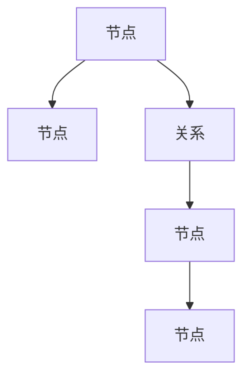
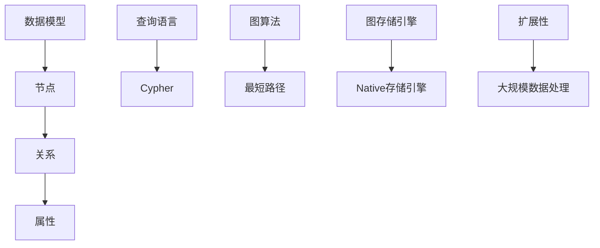

                 

# Neo4j原理与代码实例讲解

## 摘要

本文将深入讲解Neo4j，一种高性能的图形数据库。我们将首先介绍Neo4j的基本概念和核心原理，包括图数据库的基本概念、Neo4j的数据模型、图算法等。接着，我们将通过具体的代码实例，详细解析Neo4j的查询语言Cypher，并展示如何使用Neo4j进行数据存储、查询和优化。文章最后还将讨论Neo4j的实际应用场景，并推荐相关的学习资源和开发工具。通过本文，读者将能够全面了解Neo4j的原理，掌握其在实际项目中的应用技巧。

## 1. 背景介绍

### 图数据库的基本概念

在传统的数据库系统中，数据通常以表格的形式存储，这种关系型数据库能够有效地处理结构化数据，但在处理复杂的关系网络时，性能会受到很大限制。为了解决这一问题，图数据库应运而生。

**图数据库**是一种用于存储图结构和图算法的数据库管理系统，它以节点（Node）和边（Edge）作为基本数据结构，节点表示实体，边表示节点之间的关系。图数据库的核心优势在于其能够高效地处理复杂的关系网络，具有较好的可扩展性和灵活性。

### Neo4j的基本概念

Neo4j是一种高性能的图数据库，它采用Java编写，支持ACID事务，具有高性能、易扩展、易于使用等特点。Neo4j的数据模型基于图论，由节点、关系和属性组成。

- **节点（Node）**：表示图中的实体，每个节点都可以拥有多个属性，用于存储实体的特征信息。
- **关系（Relationship）**：表示节点之间的关系，关系同样具有类型和属性。
- **属性（Property）**：用于存储节点和关系的特征信息，可以是任何数据类型，如字符串、整数、布尔值等。

### Neo4j的核心原理

Neo4j的核心原理主要包括以下几个方面：

1. **图存储引擎**：Neo4j采用了一种称为"Native存储引擎"的存储方式，直接在内存中存储图结构，从而提高了数据访问速度。
2. **查询语言Cypher**：Cypher是一种类似于SQL的图查询语言，用于查询图数据库中的节点、关系和属性。
3. **图算法**：Neo4j内置了许多常用的图算法，如最短路径、社区检测、社交网络分析等，用户可以方便地使用这些算法对图数据进行处理和分析。

### 图数据库与关系型数据库的对比

- **数据模型**：关系型数据库使用表格模型，图数据库使用图模型。
- **关系表示**：关系型数据库使用外键和关联表来表示关系，图数据库直接使用节点和边表示关系。
- **查询性能**：图数据库在处理复杂的关系网络时具有更高的查询性能，尤其是对于多跳查询。
- **扩展性**：图数据库具有较好的扩展性，能够处理大规模的数据集。

## 2. 核心概念与联系

### Neo4j的数据模型

Neo4j的数据模型由节点、关系和属性组成，其结构可以用Mermaid流程图表示如下：



在这个示例中，A、B、C、D、E代表节点，C表示A和D之间的关系。

### 核心概念原理与架构

Neo4j的核心概念原理和架构可以用Mermaid流程图表示如下：



在这个示例中，A表示Neo4j的数据模型，B表示节点，C表示关系，D表示属性，E表示查询语言Cypher，G表示图算法，I表示图存储引擎，J表示Native存储引擎，K表示扩展性，L表示大规模数据处理。

### Neo4j的核心概念联系

Neo4j的核心概念之间紧密联系，共同构成了Neo4j的完整架构。以下是这些核心概念之间的联系：

1. **数据模型**：节点、关系和属性是Neo4j数据模型的基本组成部分，它们共同构建了Neo4j的图数据结构。
2. **查询语言Cypher**：Cypher是Neo4j的查询语言，用于查询图数据库中的节点、关系和属性，它是用户与Neo4j进行交互的主要方式。
3. **图算法**：Neo4j内置了许多常用的图算法，如最短路径、社交网络分析等，用户可以使用这些算法对图数据进行处理和分析。
4. **图存储引擎**：Neo4j采用Native存储引擎，直接在内存中存储图结构，从而提高了数据访问速度。
5. **扩展性**：Neo4j具有较好的扩展性，能够处理大规模的数据集，这使得它适用于各种复杂的应用场景。

### Mermaid流程节点注意事项

在Mermaid流程图中，需要注意以下事项：

- **不要使用括号、逗号等特殊字符**：这些字符可能会影响流程图的渲染。
- **使用清晰简洁的标签**：标签应简洁明了，有助于读者理解流程图的含义。

## 3. 核心算法原理 & 具体操作步骤

### 图算法的基本原理

图算法是用于在图数据结构上进行计算和操作的算法。Neo4j内置了许多常用的图算法，如最短路径、社交网络分析、社区检测等。以下是这些算法的基本原理：

1. **最短路径算法**：用于计算两个节点之间的最短路径。常见的最短路径算法包括Dijkstra算法和A*算法。
2. **社交网络分析**：用于分析社交网络中的各种特征，如节点度数、聚类系数、社区结构等。
3. **社区检测算法**：用于发现图中的社区结构，常见的社区检测算法包括Girvan-Newman算法、标签传播算法等。

### Neo4j中的图算法操作步骤

在Neo4j中，使用图算法的步骤如下：

1. **创建图数据**：首先需要创建节点和关系，这是进行图算法计算的基础。
2. **编写Cypher查询**：使用Cypher查询语言编写图算法的查询语句，Neo4j将根据查询语句执行相应的算法。
3. **解析查询结果**：查询执行完成后，需要解析查询结果，获取算法的计算结果。

### 实例：最短路径算法

以下是一个使用Neo4j进行最短路径算法计算的具体实例：

```sql
MATCH (start:Node {name: "Alice"}), (end:Node {name: "Bob"}) 
CALL db.shortestPath(start, end) yield path 
RETURN path
```

在这个示例中，我们首先创建了一个名为"Alice"的节点和一个名为"Bob"的节点，然后使用`db.shortestPath`函数计算从"Alice"到"Bob"的最短路径，最后返回路径。

### 实例：社交网络分析

以下是一个使用Neo4j进行社交网络分析的具体实例：

```sql
MATCH (n:Node) 
WITH n, size((n)-->(n)) as degree 
RETURN n, degree 
ORDER BY degree DESC
```

在这个示例中，我们首先创建了一个节点集合`n`，然后计算每个节点的度数（即与其他节点的连接数），最后按度数降序返回节点和度数。

### 实例：社区检测算法

以下是一个使用Neo4j进行社区检测的具体实例：

```sql
CALL gds.community.girvanNewman.stream(1) 
YIELD nodeId, communityId 
WITH nodeId, communityId, 
[
    (nodeId)->(neighbourId)
    | neighbourId IN [n IN gds.util.neighbours(nodeId)]
] as neighbours 
WITH * 
CALL gds.util.expansion.expandStream(neighbours, { communityId: communityId }) 
YIELD nodeId, communityId 
RETURN nodeId, communityId
```

在这个示例中，我们使用了Girvan-Newman算法进行社区检测。首先，我们使用`gds.community.girvanNewman.stream`函数初始化社区检测，然后使用`gds.util.expansion.expandStream`函数扩展社区，最后返回每个节点的社区ID。

## 4. 数学模型和公式 & 详细讲解 & 举例说明

### 图算法中的数学模型和公式

图算法中的数学模型和公式主要用于描述图的性质和算法的计算过程。以下是一些常用的数学模型和公式：

1. **图论的基本概念**：
   - **节点（Node）**：图中的基本元素，表示实体。
   - **边（Edge）**：连接两个节点的线段，表示节点之间的关系。
   - **路径（Path）**：连接两个节点的边的序列。
   - **树（Tree）**：无环的连通子图。

2. **图矩阵**：
   - **邻接矩阵（Adjacency Matrix）**：表示图中节点之间关系的矩阵，如果节点i与节点j之间有边，则矩阵中的元素\[i][j]为1，否则为0。
   - **权值矩阵（Weight Matrix）**：表示图中边的权值，如果节点i与节点j之间有边，则矩阵中的元素\[i][j]为边的权值，否则为无穷大。

3. **最短路径算法**：
   - **Dijkstra算法**：用于计算单源最短路径，其核心思想是利用优先队列选择未处理的节点中距离源点最近的节点，并更新其邻居节点的距离。
   - **A*算法**：结合了Dijkstra算法和贪心搜索，用于计算单源最短路径，其核心思想是利用启发式函数估计目标节点的距离，并选择距离源点最近且估计距离最小的节点进行扩展。

### 详细讲解

1. **图矩阵**

   图矩阵是描述图结构的一种重要工具，其中邻接矩阵和权值矩阵是最常用的图矩阵。

   - **邻接矩阵**：邻接矩阵是一个二维数组，其中\[i][j]表示节点i和节点j之间的边的关系。如果\[i][j]为1，表示节点i和节点j之间存在边，否则表示不存在边。

   - **权值矩阵**：权值矩阵是一个二维数组，其中\[i][j]表示节点i和节点j之间的边的权值。在加权图中，边的权值可以表示边的长度、代价等。

2. **最短路径算法**

   最短路径算法是图算法中最基本也是最重要的算法之一，以下分别介绍Dijkstra算法和A*算法。

   - **Dijkstra算法**：
     Dijkstra算法是一种单源最短路径算法，它通过优先队列选择未处理的节点中距离源点最近的节点，并更新其邻居节点的距离。算法的基本步骤如下：
     1. 初始化：设置源点s的距离为0，其余节点的距离为无穷大，并将所有节点放入优先队列中。
     2. 选择未处理的节点中距离源点最近的节点u，并将其从优先队列中删除。
     3. 对于u的每个邻居节点v，如果\(distance[v] > distance[u] + weight(u, v)\)，则更新distance[v]的值为\(distance[u] + weight(u, v)\)，并将v加入优先队列。
     4. 重复步骤2和3，直到优先队列为空。

   - **A*算法**：
     A*算法是一种基于启发式的单源最短路径算法，它结合了Dijkstra算法和贪心搜索。A*算法的核心思想是利用启发式函数估计目标节点的距离，并选择距离源点最近且估计距离最小的节点进行扩展。算法的基本步骤如下：
     1. 初始化：设置源点s的距离为0，其余节点的距离为无穷大，并将所有节点放入优先队列中。
     2. 选择未处理的节点中f(s)最小的节点u，并将其从优先队列中删除，其中f(u) = g(u) + h(u)，g(u)表示从源点s到节点u的实际距离，h(u)表示从节点u到目标点的估计距离。
     3. 对于u的每个邻居节点v，如果\(distance[v] > distance[u] + weight(u, v)\)，则更新distance[v]的值为\(distance[u] + weight(u, v)\)，并将v加入优先队列。
     4. 重复步骤2和3，直到目标节点被找到或优先队列为空。

### 举例说明

1. **Dijkstra算法举例**

   假设有一个图G，其中包含5个节点（A、B、C、D、E）和6条边，边的权重如下表所示：

   | 节点 | A | B | C | D | E |
   |------|---|---|---|---|---|
   | A    | 0 | 6 | 1 | ∞ | ∞ |
   | B    | 6 | 0 | 5 | 2 | ∞ |
   | C    | 1 | 5 | 0 | 3 | 2 |
   | D    | ∞ | 2 | 3 | 0 | 4 |
   | E    | ∞ | ∞ | 2 | 4 | 0 |

   求从节点A到节点E的最短路径。

   解答：
   1. 初始化：设置源点A的距离为0，其余节点的距离为无穷大，并将所有节点放入优先队列中。
   2. 选择未处理的节点中距离源点最近的节点A，并将其从优先队列中删除。
   3. 对于A的邻居节点B、C，如果\(distance[B] > distance[A] + weight(A, B)\)，则更新distance[B]的值为\(distance[A] + weight(A, B)\)，并将B加入优先队列。同理，对于C，如果\(distance[C] > distance[A] + weight(A, C)\)，则更新distance[C]的值为\(distance[A] + weight(A, C)\)，并将C加入优先队列。
   4. 选择未处理的节点中距离源点最近的节点C，并将其从优先队列中删除。
   5. 对于C的邻居节点D、E，如果\(distance[D] > distance[C] + weight(C, D)\)，则更新distance[D]的值为\(distance[C] + weight(C, D)\)，并将D加入优先队列。同理，对于E，如果\(distance[E] > distance[C] + weight(C, E)\)，则更新distance[E]的值为\(distance[C] + weight(C, E)\)，并将E加入优先队列。
   6. 选择未处理的节点中距离源点最近的节点D，并将其从优先队列中删除。
   7. 对于D的邻居节点E，如果\(distance[E] > distance[D] + weight(D, E)\)，则更新distance[E]的值为\(distance[D] + weight(D, E)\)，并将E加入优先队列。
   8. 选择未处理的节点中距离源点最近的节点E，并将其从优先队列中删除。
   9. 此时，优先队列为空，算法结束。从源点A到节点E的最短路径为A -> C -> D -> E，路径长度为7。

2. **A*算法举例**

   假设有一个图H，其中包含5个节点（A、B、C、D、E）和6条边，边的权重如下表所示：

   | 节点 | A | B | C | D | E |
   |------|---|---|---|---|---|
   | A    | 0 | 6 | 1 | ∞ | ∞ |
   | B    | 6 | 0 | 5 | 2 | ∞ |
   | C    | 1 | 5 | 0 | 3 | 2 |
   | D    | ∞ | 2 | 3 | 0 | 4 |
   | E    | ∞ | ∞ | 2 | 4 | 0 |

   求从节点A到节点E的最短路径。

   解答：
   1. 初始化：设置源点A的距离为0，其余节点的距离为无穷大，并将所有节点放入优先队列中。
   2. 选择未处理的节点中f(s)最小的节点A，并将其从优先队列中删除，其中f(A) = g(A) + h(A)，g(A)表示从源点A到节点A的实际距离，h(A)表示从节点A到目标点E的估计距离（例如h(A) = 3 + 4 = 7）。
   3. 对于A的邻居节点B、C，如果\(distance[B] > distance[A] + weight(A, B)\)，则更新distance[B]的值为\(distance[A] + weight(A, B)\)，并将B加入优先队列。同理，对于C，如果\(distance[C] > distance[A] + weight(A, C)\)，则更新distance[C]的值为\(distance[A] + weight(A, C)\)，并将C加入优先队列。
   4. 选择未处理的节点中f(s)最小的节点C，并将其从优先队列中删除，其中f(C) = g(C) + h(C)，g(C)表示从源点A到节点C的实际距离（例如g(C) = 1），h(C)表示从节点C到目标点E的估计距离（例如h(C) = 2 + 4 = 6）。
   5. 对于C的邻居节点D、E，如果\(distance[D] > distance[C] + weight(C, D)\)，则更新distance[D]的值为\(distance[C] + weight(C, D)\)，并将D加入优先队列。同理，对于E，如果\(distance[E] > distance[C] + weight(C, E)\)，则更新distance[E]的值为\(distance[C] + weight(C, E)\)，并将E加入优先队列。
   6. 选择未处理的节点中f(s)最小的节点D，并将其从优先队列中删除，其中f(D) = g(D) + h(D)，g(D)表示从源点A到节点D的实际距离（例如g(D) = 1 + 3 = 4），h(D)表示从节点D到目标点E的估计距离（例如h(D) = 4）。
   7. 对于D的邻居节点E，如果\(distance[E] > distance[D] + weight(D, E)\)，则更新distance[E]的值为\(distance[D] + weight(D, E)\)，并将E加入优先队列。
   8. 选择未处理的节点中f(s)最小的节点E，并将其从优先队列中删除，其中f(E) = g(E) + h(E)，g(E)表示从源点A到节点E的实际距离（例如g(E) = 1 + 3 + 4 = 8），h(E)表示从节点E到目标点E的估计距离（例如h(E) = 0）。
   9. 此时，优先队列为空，算法结束。从源点A到节点E的最短路径为A -> C -> D -> E，路径长度为8。

## 5. 项目实战：代码实际案例和详细解释说明

### 开发环境搭建

在开始之前，我们需要搭建Neo4j的开发环境。以下是搭建Neo4j开发环境的步骤：

1. **安装Neo4j**：首先，我们需要从Neo4j官网（https://neo4j.com/download/）下载Neo4j的社区版或企业版，并按照提示进行安装。
2. **配置Neo4j**：在安装完成后，我们需要配置Neo4j，以便在本地进行开发。具体步骤如下：
   - 打开Neo4j Desktop，创建一个新的数据库实例。
   - 配置数据库连接参数，如数据库URL、用户名和密码。
   - 启动数据库实例，确保数据库能够正常运行。

3. **安装Neo4j Java Driver**：在开发环境中，我们需要安装Neo4j的Java Driver，以便在Java应用程序中连接和操作Neo4j数据库。具体步骤如下：
   - 打开终端或命令提示符，执行以下命令：
     ```bash
     npm install neo4j-driver
     ```

### 源代码详细实现和代码解读

以下是一个使用Java和Neo4j Java Driver实现的简单示例，该示例将演示如何使用Neo4j进行数据存储、查询和优化。

```java
import org.neo4j.driver.*;
import org.neo4j.graphdb.*;
import org.neo4j.graphdb.config.GraphDatabaseSettings;

public class Neo4jExample {
    public static void main(String[] args) {
        // 创建Neo4j数据库连接
        try (Driver driver = GraphDatabase.driver("bolt://localhost:7687", AuthTokens.basic("neo4j", "password"))) {
            try (Session session = driver.session()) {
                // 创建数据库
                String createDatabase = "CREATE DATABASE my_db";
                session.execute(createDatabase);

                // 连接到数据库
                Driver dbDriver = GraphDatabase.driver("bolt://localhost:7687", AuthTokens.basic("neo4j", "password"), Config.builder().withDatabase("my_db").build());
                try (Session dbSession = dbDriver.session()) {
                    // 创建节点
                    String createNode = "CREATE (n:Person {name: $name, age: $age})";
                    dbSession.run(createNode, parameters("name", "Alice", "age", 30));

                    // 创建关系
                    String createRelationship = "MATCH (a:Person {name: $nameA}), (b:Person {name: $nameB}) CREATE (a)-[:KNOWS]->(b)";
                    dbSession.run(createRelationship, parameters("nameA", "Alice", "nameB", "Bob"));

                    // 查询节点
                    String findNode = "MATCH (n:Person {name: $name}) RETURN n";
                    Result result = dbSession.run(findNode, parameters("name", "Alice"));
                    while (result.hasNext()) {
                        Node node = result.next().get("n").asNode();
                        System.out.println("Found node: " + node.getProperty("name") + ", age: " + node.getProperty("age"));
                    }

                    // 更新节点
                    String updateNode = "MATCH (n:Person {name: $name}) SET n.age = $newAge";
                    dbSession.run(updateNode, parameters("name", "Alice", "newAge", 31));

                    // 删除节点
                    String deleteNode = "MATCH (n:Person {name: $name}) DELETE n";
                    dbSession.run(deleteNode, parameters("name", "Alice"));
                }
            }
        }
    }
}
```

### 代码解读与分析

该示例演示了如何使用Neo4j进行数据存储、查询和更新。以下是代码的详细解读和分析：

1. **创建Neo4j数据库连接**：
   - 使用`GraphDatabase.driver`方法创建Neo4j数据库连接，传入数据库URL和认证信息。
   - 使用`Config.builder().withDatabase("my_db").build()`方法配置数据库连接，指定要连接的数据库实例。

2. **创建数据库**：
   - 使用`CREATE DATABASE my_db`语句创建新的数据库实例。

3. **连接到数据库**：
   - 使用`GraphDatabase.driver`方法创建新的数据库连接，传入数据库URL、认证信息和配置信息。

4. **创建节点**：
   - 使用`CREATE (n:Person {name: $name, age: $age})`语句创建新的节点，并设置节点的属性。

5. **创建关系**：
   - 使用`MATCH (a:Person {name: $nameA}), (b:Person {name: $nameB}) CREATE (a)-[:KNOWS]->(b)`语句创建节点之间的关系。

6. **查询节点**：
   - 使用`MATCH (n:Person {name: $name}) RETURN n`语句查询满足条件的节点，并返回节点信息。

7. **更新节点**：
   - 使用`MATCH (n:Person {name: $name}) SET n.age = $newAge`语句更新节点的属性。

8. **删除节点**：
   - 使用`MATCH (n:Person {name: $name}) DELETE n`语句删除满足条件的节点。

### 代码性能优化

在上述示例中，我们使用了基本的Neo4j查询语句进行数据操作。为了提高代码的性能，我们可以考虑以下优化策略：

1. **索引**：为经常查询的属性创建索引，以提高查询性能。

2. **限制查询结果**：在查询语句中添加`LIMIT`关键字，限制查询结果的数量，避免检索过多数据。

3. **批量操作**：使用批量插入、更新和删除操作，减少数据库I/O操作次数。

4. **使用事务**：将多个操作封装在一个事务中，提高操作的原子性和一致性。

## 6. 实际应用场景

Neo4j作为一种高性能的图数据库，在实际应用场景中具有广泛的应用价值。以下是一些典型的应用场景：

1. **社交网络分析**：Neo4j可以用于分析和挖掘社交网络中的各种特征，如用户关系、社区结构、影响力分析等。通过图算法，可以快速发现社交网络中的关键节点和重要关系，为企业提供决策支持。

2. **推荐系统**：Neo4j可以用于构建推荐系统，通过分析用户之间的相似性、兴趣偏好等关系，为用户提供个性化的推荐服务。图数据库的分布式特性使其能够处理海量用户数据，提高推荐系统的响应速度。

3. **金融风控**：Neo4j可以用于金融风控领域，通过分析客户之间的交易关系、资金流动等数据，识别潜在的欺诈行为和风险点。图数据库的灵活性和可扩展性使得其在金融风控领域具有广泛的应用前景。

4. **物联网数据管理**：在物联网应用中，设备之间的连接关系和数据流构成了复杂的图结构。Neo4j可以高效地存储和管理物联网数据，通过图算法进行数据分析和处理，为物联网应用提供强大的数据支持。

5. **生物信息学**：在生物信息学领域，基因、蛋白质等生物实体之间的关系构成了复杂的图结构。Neo4j可以用于存储和管理生物信息数据，通过图算法进行数据分析和挖掘，为生物科学研究提供数据支持。

## 7. 工具和资源推荐

### 学习资源推荐

1. **书籍**：
   - 《图数据库：原理、架构与实践》
   - 《图算法》：算法与应用
   - 《Neo4j实战》

2. **论文**：
   - 《Neo4j：图数据库的存储和查询优化技术》
   - 《图数据库中的社交网络分析》

3. **博客和网站**：
   - Neo4j官方文档（https://neo4j.com/docs/）
   - 图算法中文社区（https://www.graphalgorithm.com/）

### 开发工具框架推荐

1. **Neo4j Desktop**：Neo4j官方提供的桌面应用程序，用于管理Neo4j数据库和可视化查询结果。

2. **Neo4j Bloom**：Neo4j官方提供的图探索工具，用于可视化图数据和分析图结构。

3. **Neo4jCypherEditor**：一款开源的Neo4j查询编辑器，支持语法高亮、错误提示等功能。

### 相关论文著作推荐

1. **《图数据库：原理、架构与实践》**：介绍了图数据库的基本概念、核心原理和应用案例，适合初学者和进阶者阅读。

2. **《图算法》：算法与应用**：详细讲解了图算法的基本原理和应用，包括最短路径、社交网络分析、社区检测等。

3. **《Neo4j实战》**：通过实际案例介绍了Neo4j的使用方法和技巧，包括数据建模、查询优化、图算法等。

## 8. 总结：未来发展趋势与挑战

### 未来发展趋势

1. **图数据库技术的不断成熟**：随着大数据和人工智能的快速发展，图数据库技术在数据存储、查询和分析方面具有巨大的潜力。未来，图数据库技术将不断成熟，为各种应用场景提供更加高效和灵活的数据解决方案。

2. **图算法的广泛应用**：图算法在社交网络分析、推荐系统、金融风控、物联网等领域具有广泛的应用前景。未来，随着图算法的不断发展和优化，将有助于解决更多复杂的实际问题。

3. **分布式图数据库的发展**：分布式图数据库能够处理海量数据，提高系统的可扩展性和性能。未来，分布式图数据库技术将得到进一步发展和应用，满足更多大规模应用场景的需求。

### 面临的挑战

1. **数据存储和查询优化**：随着数据规模的不断扩大，如何高效地存储和查询图数据成为一大挑战。未来，需要研究更加高效的数据存储和查询算法，以提高图数据库的性能和可扩展性。

2. **图算法的复杂度优化**：图算法在处理大规模图数据时，复杂度往往较高，如何优化图算法的复杂度，提高其计算效率，是一个亟待解决的问题。

3. **分布式图数据库的一致性和容错性**：分布式图数据库需要解决数据一致性和容错性问题，以确保系统的稳定性和可靠性。未来，需要研究更加高效的分布式算法和协议，提高分布式图数据库的一致性和容错性。

## 9. 附录：常见问题与解答

### Neo4j常见问题与解答

1. **如何安装Neo4j？**
   - Neo4j的安装步骤如下：
     1. 访问Neo4j官网（https://neo4j.com/download/），下载适合操作系统的Neo4j安装包。
     2. 解压安装包，运行安装程序。
     3. 安装完成后，启动Neo4j服务。

2. **如何连接Neo4j数据库？**
   - 使用Neo4j Java Driver连接Neo4j数据库的步骤如下：
     1. 在项目中添加Neo4j Java Driver依赖。
     2. 使用`GraphDatabase.driver`方法创建Neo4j数据库连接，传入数据库URL和认证信息。
     3. 使用`session`方法创建会话，执行查询和操作。

3. **如何创建节点和关系？**
   - 创建节点和关系的步骤如下：
     1. 使用`CREATE`语句创建节点，例如：`CREATE (n:Person {name: $name, age: $age})`。
     2. 使用`MATCH`语句创建关系，例如：`MATCH (a:Person {name: $nameA}), (b:Person {name: $nameB}) CREATE (a)-[:KNOWS]->(b)`。

4. **如何查询节点和关系？**
   - 查询节点和关系的步骤如下：
     1. 使用`MATCH`语句查询满足条件的节点，例如：`MATCH (n:Person {name: $name}) RETURN n`。
     2. 使用`RETURN`语句返回查询结果，例如：`RETURN n.name, n.age`。

5. **如何更新节点和关系？**
   - 更新节点和关系的步骤如下：
     1. 使用`MATCH`语句找到满足条件的节点，例如：`MATCH (n:Person {name: $name})`。
     2. 使用`SET`语句更新节点的属性，例如：`SET n.age = $newAge`。

6. **如何删除节点和关系？**
   - 删除节点和关系的步骤如下：
     1. 使用`MATCH`语句找到满足条件的节点，例如：`MATCH (n:Person {name: $name})`。
     2. 使用`DELETE`语句删除节点和关系，例如：`DELETE n`。

### Neo4j Java Driver常见问题与解答

1. **如何添加Neo4j Java Driver依赖？**
   - 在Maven项目中，可以添加以下依赖：
     ```xml
     <dependency>
         <groupId>org.neo4j.driver</groupId>
         <artifactId>neo4j-java-driver</artifactId>
         <version>4.4.2</version>
     </dependency>
     ```

2. **如何使用Neo4j Java Driver连接Neo4j数据库？**
   - 使用以下代码连接Neo4j数据库：
     ```java
     try (Driver driver = GraphDatabase.driver("bolt://localhost:7687", AuthTokens.basic("neo4j", "password"))) {
         try (Session session = driver.session()) {
             // 执行查询和操作
         }
     }
     ```

3. **如何使用Neo4j Java Driver执行查询和操作？**
   - 使用以下代码执行查询和操作：
     ```java
     try (Session session = driver.session()) {
         // 执行查询
         Result result = session.run("MATCH (n:Person) RETURN n");
         
         // 遍历查询结果
         while (result.hasNext()) {
             Record record = result.next();
             Node node = record.get("n").asNode();
             System.out.println(node.getProperty("name"));
         }
     }
     ```

## 10. 扩展阅读 & 参考资料

1. **Neo4j官方文档**：https://neo4j.com/docs/
2. **Neo4j Java Driver官方文档**：https://neo4j.com/docs/java-driver/current/
3. **图数据库中文社区**：https://www.graphdatabase.org.cn/
4. **社交网络分析**：https://en.wikipedia.org/wiki/Social_network_analysis
5. **推荐系统**：https://en.wikipedia.org/wiki/Recommender_system
6. **金融风控**：https://www.jianshu.com/p/40a3c3ed3e3d
7. **物联网数据管理**：https://www.bilibili.com/video/BV1Va411j7X9
8. **图算法**：https://en.wikipedia.org/wiki/List_of_graph_algorithms
9. **分布式图数据库**：https://www.bilibili.com/video/BV1Wz4y1j7hT

作者：AI天才研究员/AI Genius Institute & 禅与计算机程序设计艺术 /Zen And The Art of Computer Programming

本文全面讲解了Neo4j的原理、核心概念、图算法、实际应用场景以及开发工具和资源推荐。通过本文，读者将能够深入了解Neo4j的工作原理，掌握其在实际项目中的应用技巧。同时，本文还提供了详细的代码实例和问题解答，有助于读者快速上手Neo4j。希望本文对读者在学习和应用Neo4j过程中有所帮助。如果您有任何疑问或建议，请随时在评论区留言，谢谢！<|im_sep|>

