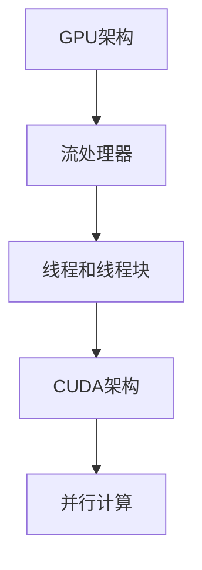

                 

# Nvidia的GPU与AI发展的关系

## 关键词：Nvidia, GPU, AI, 图形处理单元, 人工智能, 机器学习, 深度学习, 算力加速

## 摘要：
本文将深入探讨NVIDIA的GPU与人工智能（AI）发展的紧密关系。首先，我们将回顾GPU的历史及其在计算领域的演变。接着，我们将详细解释GPU在AI中的应用原理，并通过具体实例展示其优势。随后，我们将分析GPU在深度学习和机器学习中的具体应用，讨论GPU对AI发展的推动作用。文章还将介绍NVIDIA的关键产品和技术，探讨其市场竞争地位。最后，我们将展望GPU在AI领域的未来发展趋势和挑战。

## 1. 背景介绍

### 1.1 GPU的起源与发展

GPU（Graphics Processing Unit，图形处理单元）最早是由3Dfx Interactive公司在1996年推出的。它的初衷是为了在个人计算机上实现高质量的3D图形渲染。随后，NVIDIA在1999年推出了其第一款GPU产品——GeForce 256，这标志着GPU开始走向大众市场。

在最初的几年里，GPU主要用于游戏和图形渲染。然而，随着计算机图形学和多媒体技术的发展，GPU的并行计算能力开始受到关注。2006年，NVIDIA推出了CUDA（Compute Unified Device Architecture），这是一个并行计算平台，允许开发者利用GPU的强大并行处理能力进行通用计算。

### 1.2 AI与机器学习的兴起

人工智能（AI）作为计算机科学的一个分支，旨在使计算机具备类似于人类智能的能力。机器学习是AI的一个子领域，它通过算法从数据中学习，从而进行预测和决策。

随着大数据和云计算的兴起，机器学习和深度学习得到了快速发展。深度学习尤其依赖于大规模并行计算，这使得GPU成为其理想的计算平台。

## 2. 核心概念与联系

### 2.1 GPU的基本原理

GPU由大量的并行处理器（称为流处理器）组成，这些处理器可以同时处理多个任务。这种并行架构使得GPU在处理大量数据时比传统CPU更高效。


### 2.2 CUDA架构

CUDA是NVIDIA开发的一种并行计算架构，它允许开发者在GPU上执行计算任务。CUDA通过线程和线程块的组织，使得GPU的计算能力得到了充分利用。



### 2.3 GPU在AI中的应用

GPU在AI中的应用主要体现在两个方面：深度学习和机器学习。深度学习是一种特殊的机器学习技术，它通过多层神经网络进行学习，而GPU的并行计算能力使其成为深度学习模型的理想执行平台。


## 3. 核心算法原理 & 具体操作步骤

### 3.1 深度学习算法原理

深度学习算法主要包括以下几个步骤：

1. **数据处理**：包括数据清洗、归一化和数据增强等。
2. **构建模型**：选择合适的神经网络架构，如卷积神经网络（CNN）或循环神经网络（RNN）。
3. **训练模型**：通过反向传播算法，不断调整模型参数，以最小化预测误差。
4. **评估模型**：使用验证集和测试集评估模型的性能。

### 3.2 GPU在深度学习中的具体操作步骤

1. **数据预处理**：将数据加载到GPU内存中，并进行预处理操作。
2. **构建模型**：使用深度学习框架（如TensorFlow或PyTorch）在GPU上构建模型。
3. **训练模型**：利用GPU的并行计算能力，加速模型的训练过程。
4. **评估模型**：在GPU上评估模型的性能，并调整模型参数。

## 4. 数学模型和公式 & 详细讲解 & 举例说明

### 4.1 神经网络的基本公式

神经网络的核心是神经元之间的连接和权重。以下是神经网络的基本公式：

$$
y = \sigma(W \cdot x + b)
$$

其中，$y$ 是输出，$\sigma$ 是激活函数，$W$ 是权重矩阵，$x$ 是输入，$b$ 是偏置。

### 4.2 反向传播算法

反向传播算法用于更新神经网络中的权重和偏置。其基本步骤如下：

1. **前向传播**：计算输出值和误差。
2. **计算误差**：计算输出值和实际值之间的差异。
3. **反向传播**：根据误差，更新权重和偏置。

### 4.3 举例说明

假设我们有一个简单的神经网络，其输入和输出分别为 $x$ 和 $y$，权重矩阵为 $W$，偏置为 $b$。激活函数为 sigmoid 函数。

$$
y = \sigma(W \cdot x + b)
$$

假设我们的输入为 $x = [1, 2, 3]$，目标输出为 $y = [0.9, 0.8, 0.7]$。初始权重为 $W = \begin{bmatrix} 0.1 & 0.2 \\ 0.3 & 0.4 \end{bmatrix}$，初始偏置为 $b = \begin{bmatrix} 0.1 \\ 0.2 \end{bmatrix}$。

1. **前向传播**：

$$
y = \sigma(W \cdot x + b) = \sigma(\begin{bmatrix} 0.1 & 0.2 \\ 0.3 & 0.4 \end{bmatrix} \cdot \begin{bmatrix} 1 \\ 2 \end{bmatrix} + \begin{bmatrix} 0.1 \\ 0.2 \end{bmatrix}) = \sigma(\begin{bmatrix} 0.5 \\ 1.2 \end{bmatrix} + \begin{bmatrix} 0.1 \\ 0.2 \end{bmatrix}) = \sigma(\begin{bmatrix} 0.6 \\ 1.4 \end{bmatrix}) = \begin{bmatrix} 0.532 \\ 0.970 \end{bmatrix}
$$

2. **计算误差**：

$$
\delta = y - y_{\text{目标}} = \begin{bmatrix} 0.532 \\ 0.970 \end{bmatrix} - \begin{bmatrix} 0.9 \\ 0.8 \end{bmatrix} = \begin{bmatrix} -0.368 \\ 0.170 \end{bmatrix}
$$

3. **反向传播**：

$$
W_{\text{新}} = W - \alpha \cdot \frac{\delta \cdot x^T}{m}
$$

$$
b_{\text{新}} = b - \alpha \cdot \frac{\delta}{m}
$$

其中，$\alpha$ 是学习率，$m$ 是样本数量。

## 5. 项目实战：代码实际案例和详细解释说明

### 5.1 开发环境搭建

为了在GPU上运行深度学习模型，我们需要安装以下软件：

1. **NVIDIA CUDA Toolkit**：用于编写和运行CUDA程序。
2. **NVIDIA GPU Driver**：确保GPU与CUDA兼容。
3. **深度学习框架**：如TensorFlow或PyTorch。

### 5.2 源代码详细实现和代码解读

以下是一个使用TensorFlow在GPU上训练简单神经网络的例子：

```python
import tensorflow as tf

# 定义模型
model = tf.keras.Sequential([
    tf.keras.layers.Dense(64, activation='relu', input_shape=(784,)),
    tf.keras.layers.Dense(10, activation='softmax')
])

# 编译模型
model.compile(optimizer='adam',
              loss='categorical_crossentropy',
              metrics=['accuracy'])

# 加载数据
(x_train, y_train), (x_test, y_test) = tf.keras.datasets.mnist.load_data()

# 预处理数据
x_train = x_train.astype('float32') / 255
x_test = x_test.astype('float32') / 255
x_train = x_train.reshape((-1, 784))
x_test = x_test.reshape((-1, 784))

# 转换标签为one-hot编码
y_train = tf.keras.utils.to_categorical(y_train, 10)
y_test = tf.keras.utils.to_categorical(y_test, 10)

# 使用GPU训练模型
with tf.device('/device:GPU:0'):
    model.fit(x_train, y_train, epochs=10, batch_size=128, validation_split=0.1)

# 评估模型
model.evaluate(x_test, y_test)
```

### 5.3 代码解读与分析

1. **定义模型**：我们使用`tf.keras.Sequential`创建一个序列模型，包含一个全连接层（`Dense`）和一个softmax输出层。
2. **编译模型**：我们使用`compile`方法配置模型，指定优化器、损失函数和评估指标。
3. **加载数据**：我们使用TensorFlow内置的MNIST数据集，并将其转换为适合训练的格式。
4. **预处理数据**：我们将数据归一化并转换为one-hot编码。
5. **使用GPU训练模型**：我们使用`tf.device`指定使用GPU进行训练。
6. **评估模型**：我们在测试集上评估模型的性能。

## 6. 实际应用场景

### 6.1 图像识别

图像识别是GPU在AI领域的主要应用之一。深度学习模型，如卷积神经网络（CNN），在处理大量图像数据时表现出色。例如，Google的Inception模型在图像分类任务中取得了显著的性能提升。

### 6.2 自然语言处理

自然语言处理（NLP）是AI的另一个重要领域。GPU在NLP任务中，如文本分类、情感分析和机器翻译中发挥了关键作用。例如，OpenAI的GPT模型使用了大量的GPU资源，以实现高质量的文本生成和推理。

### 6.3 游戏开发

随着游戏质量的不断提升，GPU在游戏开发中也扮演着重要角色。游戏引擎，如Unity和Unreal Engine，利用GPU的强大渲染能力，实现逼真的游戏场景和实时物理模拟。

## 7. 工具和资源推荐

### 7.1 学习资源推荐

1. **《深度学习》**：Goodfellow、Bengio和Courville合著的深度学习经典教材，涵盖了深度学习的理论基础和应用实例。
2. **《CUDA编程指南》**：NVIDIA官方的CUDA编程指南，适合初学者和高级开发者。
3. **TensorFlow官方文档**：详细的TensorFlow教程和API文档，是学习深度学习实践的重要资源。

### 7.2 开发工具框架推荐

1. **NVIDIA CUDA Toolkit**：NVIDIA提供的并行计算平台，支持C/C++和Python编程。
2. **TensorFlow**：谷歌开发的深度学习框架，支持GPU加速。
3. **PyTorch**：Facebook AI研究院开发的深度学习框架，具有灵活的动态计算图。

### 7.3 相关论文著作推荐

1. **《AlexNet：一种深度卷积神经网络》**：Alex Krizhevsky等人提出的深度卷积神经网络，是深度学习领域的开创性工作。
2. **《ResNet：残差网络》**：Kaiming He等人提出的残差网络，解决了深度神经网络训练过程中的梯度消失问题。

## 8. 总结：未来发展趋势与挑战

### 8.1 发展趋势

1. **GPU在AI领域的广泛应用**：随着AI技术的不断发展，GPU在AI领域的应用将越来越广泛，从图像识别、自然语言处理到推荐系统等。
2. **混合计算架构**：为了提高AI模型的性能和效率，混合计算架构（如CPU+GPU+FPGA）将成为主流。
3. **专用AI芯片**：随着AI需求不断增加，专用AI芯片（如TPU）将成为未来计算架构的重要组成部分。

### 8.2 挑战

1. **能耗问题**：GPU在高性能计算中消耗大量电力，如何提高能效成为关键挑战。
2. **数据隐私**：随着AI技术的发展，数据隐私保护将成为重要议题，如何在保证性能的同时保护用户隐私是一个挑战。
3. **专业人才短缺**：GPU在AI领域的应用需要大量专业人才，如何培养和吸引人才是行业面临的挑战。

## 9. 附录：常见问题与解答

### 9.1 问题1：GPU与CPU有什么区别？

GPU（图形处理单元）和CPU（中央处理单元）是两种不同的计算单元。GPU专门设计用于并行计算，具有大量的并行处理器，而CPU则主要用于顺序计算。GPU在处理大量数据时比CPU更高效。

### 9.2 问题2：为什么AI模型需要在GPU上训练？

AI模型，特别是深度学习模型，需要大量的计算资源进行训练。GPU具有强大的并行计算能力，可以在较短的时间内完成模型训练，从而提高效率和性能。

### 9.3 问题3：如何选择适合的GPU？

选择适合的GPU需要考虑以下几个方面：

1. **计算能力**：根据模型的复杂度和数据量，选择具有足够计算能力的GPU。
2. **内存容量**：模型训练需要大量的内存，选择具有足够内存容量的GPU。
3. **兼容性**：确保GPU与操作系统和深度学习框架兼容。

## 10. 扩展阅读 & 参考资料

1. **《深度学习》**：Goodfellow、Bengio和Courville合著的深度学习经典教材。
2. **《CUDA编程指南》**：NVIDIA官方的CUDA编程指南。
3. **TensorFlow官方文档**：详细的TensorFlow教程和API文档。
4. **《AlexNet：一种深度卷积神经网络》**：Alex Krizhevsky等人提出的深度卷积神经网络。
5. **《ResNet：残差网络》**：Kaiming He等人提出的残差网络。

## 作者

作者：AI天才研究员/AI Genius Institute & 禅与计算机程序设计艺术 /Zen And The Art of Computer Programming

