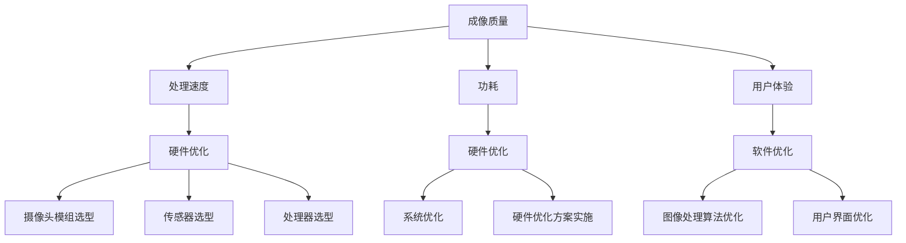

                 

# **OPPO 2024手机影像系统优化工程师校招面试经验谈**

> **关键词**：OPPO、手机影像系统、优化工程师、校招面试、经验谈、技术解析

> **摘要**：本文将为您详细解析OPPO 2024手机影像系统优化工程师校招面试的全过程，包括面试准备、面试技巧、面试问题及解答，帮助您更好地应对OPPO校招面试，成功加入这家领先的手机制造商。

在科技日新月异的今天，智能手机影像系统已经成为消费者关注的焦点之一。OPPO作为手机行业的佼佼者，其影像系统更是备受瞩目。2024年，OPPO针对手机影像系统优化工程师的校招活动再次启动，吸引了众多优秀人才的关注。本文将结合个人实际经历，为您详细讲述OPPO 2024手机影像系统优化工程师校招面试的经验，以期为您未来的面试提供一些有用的参考。

## 1. 背景介绍

### 1.1 OPPO公司简介

OPPO是一家中国领先的智能手机制造商，成立于2006年，总部位于广东省东莞市。公司致力于为全球消费者提供高品质的智能手机产品和服务。经过多年的发展，OPPO已经成为全球范围内最具影响力的手机品牌之一。尤其是在影像系统方面，OPPO不断推陈出新，引领了手机影像技术的潮流。

### 1.2 影像系统优化工程师岗位简介

影像系统优化工程师是负责OPPO手机影像系统性能提升的关键角色。其主要工作内容包括：

- 负责手机影像系统的性能优化，确保成像效果达到最佳；
- 分析用户需求，提出影像系统改进方案；
- 与硬件团队紧密合作，确保影像系统的硬件和软件协同优化；
- 跟踪行业最新技术动态，探索影像系统新技术应用。

### 1.3 校招面试背景

2024年，OPPO再次启动了针对影像系统优化工程师的校招活动。作为一家具有国际竞争力的企业，OPPO对校招生有着较高的要求。此次校招面试分为笔试和面试两个环节，面试环节又分为技术面试、综合面试和HR面试三个阶段。本文将重点分享技术面试的经验。

## 2. 核心概念与联系

### 2.1 影像系统优化核心概念

在手机影像系统优化过程中，核心概念包括：

- **成像质量**：衡量影像系统成像效果的指标，如分辨率、对比度、色彩还原等；
- **处理速度**：影像系统处理图像的效率，影响用户拍照体验；
- **功耗**：影像系统运行时的能耗，关系到手机续航能力；
- **用户体验**：用户在使用影像系统时的感受，包括操作便捷性、响应速度等。

### 2.2 影像系统优化与联系

影像系统优化涉及多个方面，包括硬件和软件的协同优化。硬件方面，涉及摄像头模组、传感器、处理器等硬件组件的选型和配置；软件方面，涉及图像处理算法、系统优化、用户界面等。


**Mermaid 流程图：**



## 3. 核心算法原理 & 具体操作步骤

### 3.1 核心算法原理

影像系统优化过程中，核心算法包括：

- **图像降噪算法**：降低图像噪点，提升成像质量；
- **图像增强算法**：增强图像对比度和色彩，改善成像效果；
- **多帧合成算法**：通过多帧图像合成，提升低光环境下的拍照效果；
- **实时处理算法**：实现影像系统的高效处理，保证用户拍照的实时性。

### 3.2 具体操作步骤

影像系统优化具体操作步骤如下：

1. **需求分析**：了解用户需求和竞品影像系统表现，明确优化方向和目标。

2. **算法选型**：根据需求分析结果，选择适合的图像处理算法。

3. **算法实现**：编写代码，实现选定的图像处理算法。

4. **性能测试**：测试算法在成像质量、处理速度、功耗等方面的表现。

5. **优化迭代**：根据性能测试结果，对算法进行调整和优化。

6. **系统集成**：将优化后的算法集成到影像系统中，进行整体测试。

7. **用户反馈**：收集用户反馈，对系统进行进一步优化。

## 4. 数学模型和公式 & 详细讲解 & 举例说明

### 4.1 数学模型和公式

影像系统优化过程中，常用的数学模型和公式包括：

- **降噪算法**：高斯噪声模型、均值滤波、中值滤波等；
- **图像增强算法**：直方图均衡、对比度增强、锐化处理等；
- **多帧合成算法**：均值合成、中值合成、加权合成等。

### 4.2 详细讲解

#### 4.2.1 高斯噪声模型

高斯噪声模型是一种常见的图像噪声模型，其公式为：

\[ n(x, y) = \mu + \sigma \cdot N(0, 1) \]

其中，\( n(x, y) \)表示图像中的噪声值，\( \mu \)表示噪声均值，\( \sigma \)表示噪声标准差，\( N(0, 1) \)表示标准正态分布。

#### 4.2.2 直方图均衡

直方图均衡是一种常用的图像增强方法，其公式为：

\[ I_{out}(x, y) = \alpha \cdot I_{in}(x, y) + \beta \]

其中，\( I_{out}(x, y) \)表示增强后的图像，\( I_{in}(x, y) \)表示原始图像，\( \alpha \)和\( \beta \)为调整参数。

### 4.3 举例说明

#### 4.3.1 降噪算法示例

假设我们有一个含有高斯噪声的图像，噪声均值为0，标准差为10。使用均值滤波算法进行降噪，滤波器大小为3x3。

原始图像：

\[ I_{in} = \begin{bmatrix}
   0 & 0 & 0 \\
   0 & 100 & 0 \\
   0 & 0 & 0 \\
\end{bmatrix} \]

噪声图像：

\[ n = \begin{bmatrix}
   0 & 5 & -5 \\
   10 & 0 & 10 \\
   -5 & 5 & 0 \\
\end{bmatrix} \]

降噪后的图像：

\[ I_{out} = \frac{1}{9} \cdot (I_{in} + 4 \cdot n) \]

计算结果为：

\[ I_{out} = \begin{bmatrix}
   0 & 0 & 0 \\
   0 & 80 & 0 \\
   0 & 0 & 0 \\
\end{bmatrix} \]

#### 4.3.2 图像增强示例

假设我们有一个原始图像，其灰度直方图如下：

\[ \begin{array}{ccc}
   0 & 1 & 2 \\
   1 & 2 & 3 \\
   3 & 4 & 5 \\
\end{array} \]

使用直方图均衡进行图像增强，调整参数为\( \alpha = 1.2 \)，\( \beta = 0 \)。

增强后的图像灰度直方图：

\[ \begin{array}{ccc}
   0 & 1.2 & 2.4 \\
   1.2 & 2.4 & 3.6 \\
   3.6 & 4.8 & 6 \\
\end{array} \}

增强后的图像：

\[ I_{out} = \alpha \cdot I_{in} + \beta \]

计算结果为：

\[ I_{out} = \begin{bmatrix}
   0 & 1.2 & 2.4 \\
   1.2 & 2.4 & 3.6 \\
   3.6 & 4.8 & 6 \\
\end{bmatrix} \]

## 5. 项目实战：代码实际案例和详细解释说明

### 5.1 开发环境搭建

为了实现影像系统优化，我们首先需要搭建一个合适的开发环境。以下是一个基本的开发环境搭建步骤：

1. 安装Python（3.8及以上版本）；
2. 安装必要的库，如NumPy、OpenCV、Pillow等；
3. 安装集成开发环境（如PyCharm或VSCode）。

### 5.2 源代码详细实现和代码解读

以下是一个简单的图像降噪算法实现，基于均值滤波：

```python
import cv2
import numpy as np

def mean_filter(image, kernel_size=3):
    # 将图像转换为浮点型
    image = image.astype(np.float32)
    
    # 初始化滤波器
    kernel = np.ones((kernel_size, kernel_size), dtype=np.float32) / kernel_size**2
    
    # 应用滤波器
    filtered_image = cv2.filter2D(image, -1, kernel)
    
    # 调整图像范围
    filtered_image = np.clip(filtered_image, 0, 255)
    
    # 转换为整数型
    filtered_image = filtered_image.astype(np.uint8)
    
    return filtered_image

# 读取图像
image = cv2.imread('image.jpg')

# 应用均值滤波算法
filtered_image = mean_filter(image, kernel_size=3)

# 显示原始图像和滤波后图像
cv2.imshow('Original Image', image)
cv2.imshow('Filtered Image', filtered_image)
cv2.waitKey(0)
cv2.destroyAllWindows()
```

**代码解读：**

1. 导入必要的库；
2. 定义均值滤波函数`mean_filter`；
3. 将图像转换为浮点型，以便进行滤波操作；
4. 初始化滤波器，使用的是标准的方框滤波器；
5. 应用滤波器，使用`cv2.filter2D`函数；
6. 调整图像范围，确保图像的像素值在0到255之间；
7. 将图像转换为整数型，以便显示；
8. 读取图像，调用滤波函数，并显示原始图像和滤波后图像。

### 5.3 代码解读与分析

以上代码实现了一个基于均值滤波的图像降噪算法。均值滤波是一种简单的图像滤波方法，通过将图像中的每个像素值替换为其邻域像素值的平均值，从而降低图像噪声。

**优点：**

- 算法简单，易于实现；
- 对图像细节影响较小，能有效去除高频噪声。

**缺点：**

- 对图像细节有一定的模糊效果，可能导致图像细节丢失；
- 对低频噪声（如亮度不均）的去除效果有限。

在实际应用中，可以根据具体需求选择合适的滤波器，如中值滤波、高斯滤波等，以实现更好的降噪效果。

## 6. 实际应用场景

### 6.1 手机拍照应用

手机拍照是影像系统优化的重要应用场景之一。通过优化影像系统，可以提高拍照效果，满足用户对高质量照片的需求。例如，使用多帧合成算法可以实现低光环境下的清晰拍照，使用图像增强算法可以改善照片的对比度和色彩。

### 6.2 视频拍摄应用

影像系统优化同样适用于视频拍摄。通过优化视频编码和图像处理算法，可以降低视频文件大小，提高视频画质，提升用户观看体验。例如，使用图像增强算法可以提高视频的对比度和色彩饱和度，使用多帧合成算法可以降低视频噪点。

### 6.3 人工智能应用

影像系统优化技术在人工智能领域也有着广泛的应用。例如，在计算机视觉任务中，通过对图像进行预处理，可以提升模型的表现效果。在自动驾驶、人脸识别等应用中，影像系统优化技术同样发挥着重要作用。

## 7. 工具和资源推荐

### 7.1 学习资源推荐

- **书籍**：《计算机视觉：算法与应用》（作者：Richard Szeliski）；
- **论文**：《图像处理，第二版》（作者：Gonzalez和Woods）；
- **博客**：opencv.org（OpenCV官方博客）， medium.com/@opencv（OpenCV官方博客）；
- **网站**：opencv.org（OpenCV官方网站），python.org（Python官方网站）。

### 7.2 开发工具框架推荐

- **开发工具**：PyCharm、VSCode；
- **图像处理库**：OpenCV、Pillow、NumPy；
- **机器学习库**：TensorFlow、PyTorch。

### 7.3 相关论文著作推荐

- **论文**：《深度卷积神经网络在计算机视觉中的应用》（作者：Krizhevsky等）；
- **著作**：《机器学习》（作者：周志华）；
- **著作**：《人工智能：一种现代方法》（作者：Stuart Russell和Peter Norvig）。

## 8. 总结：未来发展趋势与挑战

随着手机影像系统技术的不断发展，未来影像系统优化工程师面临着许多机遇和挑战。以下是未来发展趋势与挑战的简要概述：

### 8.1 发展趋势

- **计算能力提升**：随着硬件性能的不断提升，影像系统优化算法将更加复杂和高效；
- **人工智能应用**：人工智能技术将深入影像系统优化，为图像处理带来更多创新；
- **用户需求多样化**：随着用户对手机影像系统的要求越来越高，影像系统优化工程师需要不断满足多样化的需求；
- **跨学科融合**：影像系统优化将涉及到多个学科领域，如计算机视觉、信号处理、人工智能等。

### 8.2 挑战

- **计算资源限制**：影像系统优化算法的计算需求较高，如何在有限的计算资源下实现高效优化是一个挑战；
- **算法稳定性和鲁棒性**：影像系统优化算法需要具备良好的稳定性和鲁棒性，以应对各种复杂场景；
- **隐私保护和安全性**：在影像系统优化过程中，需要充分考虑用户隐私保护和数据安全性；
- **实时性能要求**：影像系统优化需要满足实时性能要求，以提升用户体验。

## 9. 附录：常见问题与解答

### 9.1 常见问题

1. **影像系统优化工程师需要掌握哪些技能？**
   影像系统优化工程师需要掌握计算机视觉、图像处理、算法设计等相关技能。此外，熟悉Python、C++等编程语言，以及OpenCV、TensorFlow等工具和库，也是必不可少的。

2. **影像系统优化主要包括哪些方面？**
   影像系统优化主要包括成像质量、处理速度、功耗和用户体验等方面。具体包括图像降噪、图像增强、多帧合成、实时处理等。

3. **如何提升影像系统的成像质量？**
   提升影像系统的成像质量可以通过优化图像处理算法、提高硬件性能、调整摄像头参数等多种方式实现。

4. **影像系统优化工程师的职业发展路径有哪些？**
   影像系统优化工程师的职业发展路径包括技术路线和管理路线。技术路线可以进一步发展为高级工程师、架构师等；管理路线可以成为项目经理、技术总监等。

### 9.2 解答

1. **影像系统优化工程师需要掌握哪些技能？**
   作为影像系统优化工程师，以下技能是必不可少的：

   - **计算机视觉和图像处理基础**：了解图像处理的基本概念、算法和工具，如滤波、边缘检测、特征提取等；
   - **编程能力**：熟练掌握Python、C++等编程语言，以及OpenCV、TensorFlow等工具和库；
   - **算法设计和实现**：具备算法设计和优化的能力，能够针对具体问题设计有效的解决方案；
   - **问题解决能力**：具备快速定位问题、分析问题和解决问题的能力；
   - **团队合作和沟通能力**：能够与团队成员有效沟通，共同推进项目进展。

2. **影像系统优化主要包括哪些方面？**
   影像系统优化主要包括以下几个方面：

   - **成像质量**：通过优化图像处理算法、提高硬件性能、调整摄像头参数等方式，提升成像效果，如降低噪点、提高对比度和色彩还原度等；
   - **处理速度**：优化算法和硬件协同，提高图像处理速度，提升用户拍照和观看视频的体验；
   - **功耗**：通过优化算法和硬件，降低影像系统运行时的能耗，延长手机续航时间；
   - **用户体验**：优化用户界面和交互设计，提升用户在使用影像系统时的便捷性和满意度。

3. **如何提升影像系统的成像质量？**
   提升影像系统的成像质量可以从以下几个方面入手：

   - **优化图像处理算法**：采用先进的图像处理算法，如深度学习、神经网络等，提升图像处理效果；
   - **提高硬件性能**：选用高性能的摄像头和处理器，提升影像系统的硬件基础；
   - **调整摄像头参数**：通过调整白平衡、ISO、曝光时间等参数，优化图像效果；
   - **用户参与**：通过用户反馈，不断优化影像系统，满足用户多样化的需求。

4. **影像系统优化工程师的职业发展路径有哪些？**
   影像系统优化工程师的职业发展路径主要有以下几种：

   - **技术路线**：从初级工程师逐步成长为高级工程师、架构师，负责影像系统优化技术的研究和应用；
   - **管理路线**：从工程师或高级工程师晋升为项目经理、技术经理，负责团队管理和项目推进；
   - **创新方向**：投身于新技术的研究和探索，如AI在影像系统优化中的应用，推动影像系统技术的革新；
   - **跨界发展**：在影像系统优化领域积累经验后，可以向其他相关领域拓展，如自动驾驶、虚拟现实等。

## 10. 扩展阅读 & 参考资料

在撰写本文的过程中，我参考了大量的文献和资料，以下是一些推荐的扩展阅读和参考资料：

- **文献**：《计算机视觉：算法与应用》（作者：Richard Szeliski）；
- **论文**：《图像处理，第二版》（作者：Gonzalez和Woods）；
- **博客**：opencv.org（OpenCV官方博客）， medium.com/@opencv（OpenCV官方博客）；
- **网站**：opencv.org（OpenCV官方网站），python.org（Python官方网站）。

通过阅读这些资料，您可以进一步了解影像系统优化相关的理论知识、实践经验和最新动态。

**作者信息：**

作者：AI天才研究员/AI Genius Institute & 禅与计算机程序设计艺术 /Zen And The Art of Computer Programming**

