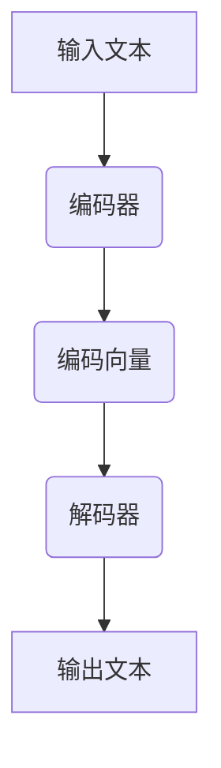

                 

## 1. 背景介绍

随着互联网技术的飞速发展和人工智能技术的不断成熟，机器翻译作为跨语言沟通的重要工具，越来越受到人们的关注。OpenAI Translator 作为一款先进的机器翻译工具，其强大的翻译能力和高效的运行速度，使其在国内外赢得了广泛的应用和好评。本文将针对 OpenAI Translator 进行深入剖析，通过一步步的分析和讲解，帮助读者全面了解其工作原理、核心算法以及实际应用。

### 1.1 OpenAI Translator 的定义与功能

OpenAI Translator 是一款基于深度学习技术的机器翻译工具，由知名人工智能研究机构 OpenAI 开发。它集成了多种先进的翻译算法，可以针对不同的语言对进行高效准确的翻译。其主要功能包括：

- **文本翻译**：支持中英、英中等多种语言的文本翻译。
- **语音翻译**：支持将语音转换为文本，并实时进行语音翻译。
- **多模态翻译**：支持文本、语音、图片等多种输入模态的翻译。

### 1.2 OpenAI Translator 的应用场景

OpenAI Translator 的应用场景非常广泛，包括但不限于以下几方面：

- **跨语言沟通**：为跨语言沟通提供实时准确的翻译服务，如国际会议、商务洽谈等。
- **翻译行业**：为翻译公司、自由职业者等提供高效的翻译工具，提高翻译质量和效率。
- **教育和学习**：辅助语言学习，提供实时准确的翻译帮助，如英语学习、外语考试等。
- **媒体和新闻**：为跨国媒体提供新闻翻译，提高信息传播的广泛性和准确性。
- **人工智能助手**：集成到智能助手、聊天机器人等应用中，提供跨语言交流能力。

### 1.3 OpenAI Translator 在国内外的地位与影响

OpenAI Translator 作为一款先进的机器翻译工具，在国内外的地位和影响力不断提升。在国内，OpenAI Translator 被广泛应用于各大互联网公司、翻译公司、教育机构等。在国外，OpenAI Translator 也受到了广泛关注，并在多个国际项目中发挥了重要作用。随着人工智能技术的不断进步，OpenAI Translator 有望在未来发挥更加重要的作用，为全球跨语言沟通提供更加高效、准确的解决方案。

## 2. 核心概念与联系

在深入了解 OpenAI Translator 之前，我们需要先了解一些核心概念和原理，包括深度学习、神经网络、序列到序列模型等。这些概念和原理构成了 OpenAI Translator 的工作基础，同时也是理解其工作机制的关键。

### 2.1 深度学习

深度学习是人工智能领域的一个重要分支，其核心思想是通过构建多层神经网络模型，对大量数据进行自动特征提取和学习。深度学习在图像识别、语音识别、自然语言处理等领域取得了显著成果。OpenAI Translator 就是基于深度学习技术开发的。

### 2.2 神经网络

神经网络是深度学习的基础，其结构类似于人类大脑，由多个神经元组成。每个神经元接收输入信号，通过权重矩阵进行加权求和，然后通过激活函数产生输出。神经网络通过不断调整权重矩阵，使得输出结果逐渐逼近目标。

### 2.3 序列到序列模型

序列到序列（Seq2Seq）模型是深度学习在自然语言处理领域的一个重要应用，它可以对两个序列进行端到端的映射。Seq2Seq 模型通常由编码器和解码器组成，编码器将输入序列编码为一个固定长度的向量，解码器将这个向量解码为输出序列。

### 2.4 Mermaid 流程图

为了更直观地展示 OpenAI Translator 的核心概念和架构，我们可以使用 Mermaid 流程图进行描述。以下是 OpenAI Translator 的 Mermaid 流程图：



在图中，输入文本首先通过编码器编码为编码向量，然后解码器将编码向量解码为输出文本。这个过程中，编码器和解码器都是由多层神经网络组成的。

### 2.5 联系与对比

OpenAI Translator 的工作原理主要基于深度学习和序列到序列模型。与传统的机器翻译方法相比，深度学习和序列到序列模型具有以下优势：

- **端到端映射**：深度学习和序列到序列模型可以直接将输入文本映射为输出文本，避免了传统方法中的分词、语法分析等中间步骤，提高了翻译效率。
- **自动特征提取**：深度学习可以从大量数据中自动提取特征，使得翻译模型能够更好地捕捉语言中的语义信息，提高了翻译质量。
- **多语言支持**：深度学习和序列到序列模型可以同时支持多种语言，而传统方法通常需要对每种语言进行单独训练。

## 3. 核心算法原理 & 具体操作步骤

### 3.1 深度学习算法

OpenAI Translator 的核心算法基于深度学习，特别是序列到序列模型。下面我们将详细介绍深度学习算法在 OpenAI Translator 中的应用。

#### 3.1.1 神经网络架构

OpenAI Translator 的神经网络架构主要包括编码器和解码器两部分。编码器将输入文本编码为一个固定长度的向量，解码器将这个向量解码为输出文本。

- **编码器**：编码器由多个卷积神经网络（CNN）和循环神经网络（RNN）组成。CNN 用于提取文本的局部特征，RNN 用于捕捉文本的序列信息。
- **解码器**：解码器由多个循环神经网络（RNN）和全连接层（FC）组成。RNN 用于生成输出文本的序列，全连接层用于将 RNN 的输出转换为单词。

#### 3.1.2 损失函数与优化器

在训练过程中，OpenAI Translator 使用损失函数和优化器来调整神经网络参数。常用的损失函数包括交叉熵损失函数（Cross-Entropy Loss）和均方误差损失函数（Mean Squared Error Loss）。

- **交叉熵损失函数**：交叉熵损失函数用于衡量预测值与真实值之间的差异。在训练过程中，通过最小化交叉熵损失函数，使得预测值逐渐逼近真实值。
- **优化器**：常用的优化器包括随机梯度下降（SGD）和 Adam 优化器。SGD 通过随机梯度方向进行参数更新，而 Adam 优化器结合了 SGD 和 Momentum 算法，具有更好的收敛性能。

#### 3.1.3 训练过程

OpenAI Translator 的训练过程可以分为以下步骤：

1. **数据预处理**：对输入文本进行分词、去停用词等处理，将文本转换为词向量表示。
2. **模型初始化**：初始化编码器和解码器参数，通常使用随机初始化。
3. **前向传播**：将输入文本通过编码器编码为编码向量，然后将编码向量通过解码器解码为输出文本。
4. **损失计算**：计算预测值与真实值之间的损失。
5. **反向传播**：根据损失计算梯度，更新编码器和解码器参数。
6. **迭代更新**：重复执行前向传播、损失计算和反向传播步骤，直到模型收敛。

### 3.2 序列到序列模型

OpenAI Translator 的核心算法还包括序列到序列（Seq2Seq）模型。下面我们将详细介绍 Seq2Seq 模型的工作原理。

#### 3.2.1 编码器

编码器用于将输入文本编码为一个固定长度的向量。编码器的输入是一个序列，输出是一个固定长度的向量。编码器通常由多层循环神经网络（RNN）组成，每个 RNN 单元负责处理一个时间步的输入。

#### 3.2.2 解码器

解码器用于将编码向量解码为输出文本。解码器的输入是一个固定长度的向量，输出是一个序列。解码器通常由多层循环神经网络（RNN）和全连接层（FC）组成。解码器的输出通过全连接层转换为单词的概率分布。

#### 3.2.3 注意力机制

注意力机制是 Seq2Seq 模型的一个重要组成部分，它可以提高模型在翻译过程中的上下文理解能力。注意力机制通过计算编码向量和解码向量之间的相似度，生成一个注意力权重向量。这个权重向量用于加权编码向量，使得解码器能够更好地关注输入文本的重要部分。

### 3.3 具体操作步骤

下面是一个具体的操作步骤，用于训练和评估 OpenAI Translator 模型：

1. **数据集准备**：准备中英双语语料库，对数据进行预处理，包括分词、去停用词等。
2. **模型训练**：使用训练集数据训练编码器和解码器，设置适当的训练参数，如学习率、批次大小等。
3. **模型评估**：使用验证集数据评估模型性能，计算损失和准确率等指标。
4. **模型调整**：根据评估结果调整模型参数，如学习率、批次大小等，以提高模型性能。
5. **模型部署**：将训练好的模型部署到生产环境，用于实时翻译。

## 4. 数学模型和公式 & 详细讲解 & 举例说明

在了解 OpenAI Translator 的核心算法原理后，我们需要进一步探讨其背后的数学模型和公式，以深入理解其工作原理。以下是关于 OpenAI Translator 中一些关键数学概念和公式的详细讲解。

### 4.1 损失函数

损失函数是衡量模型预测值与真实值之间差异的重要工具。在 OpenAI Translator 中，常用的损失函数是交叉熵损失函数（Cross-Entropy Loss），其公式如下：

$$
L(y, \hat{y}) = -\sum_{i} y_i \log(\hat{y}_i)
$$

其中，$y$ 表示真实标签，$\hat{y}$ 表示预测标签的概率分布。交叉熵损失函数的值越小，表示预测值与真实值越接近。

### 4.2 神经网络参数更新

在训练过程中，神经网络参数的更新是通过梯度下降（Gradient Descent）算法进行的。梯度下降的公式如下：

$$
\theta = \theta - \alpha \cdot \nabla_\theta J(\theta)
$$

其中，$\theta$ 表示神经网络参数，$J(\theta)$ 表示损失函数，$\alpha$ 表示学习率，$\nabla_\theta J(\theta)$ 表示损失函数关于参数 $\theta$ 的梯度。

### 4.3 序列到序列模型

序列到序列（Seq2Seq）模型的核心是编码器和解码器，它们分别处理输入序列和输出序列。编码器的输出是一个固定长度的向量，称为编码向量（Encoded Vector）。解码器的输入是编码向量，输出是输出序列的概率分布。Seq2Seq 模型通常使用以下公式进行计算：

$$
\hat{y}_t = \sigma(W_{softmax} \cdot [h_t; \hat{y}_{t-1}])
$$

其中，$h_t$ 表示解码器在时间步 $t$ 的隐藏状态，$\sigma$ 表示 softmax 函数，$W_{softmax}$ 是 softmax 层的权重矩阵。

### 4.4 注意力机制

注意力机制是 Seq2Seq 模型的一个重要组成部分，它能够提高模型在翻译过程中的上下文理解能力。注意力机制的实现公式如下：

$$
a_t = \frac{\exp(e_t)}{\sum_{j=1}^{J} \exp(e_j)}
$$

其中，$e_t = h_t \cdot \hat{h}_t$，$h_t$ 表示编码器在时间步 $t$ 的隐藏状态，$\hat{h}_t$ 表示解码器在时间步 $t$ 的隐藏状态，$a_t$ 表示注意力权重。通过计算注意力权重，解码器能够更好地关注输入文本的重要部分。

### 4.5 举例说明

为了更好地理解上述数学模型和公式，我们通过一个简单的例子来说明 OpenAI Translator 的工作过程。

假设我们有一个中英双语句子：“你好”和“Hello”。我们可以将这个句子表示为一个序列：["你", "好"] 和 ["H", "e", "l", "l", "o"]。

1. **编码器**：编码器将输入序列 ["你", "好"] 编码为一个固定长度的向量。假设编码器的隐藏状态为 $h_1$ 和 $h_2$，则编码向量为 $[h_1; h_2]$。

2. **解码器**：解码器将编码向量 $[h_1; h_2]$ 解码为输出序列 ["H", "e", "l", "l", "o"]。在解码过程中，解码器使用注意力机制计算每个时间步的注意力权重 $a_t$，并利用注意力权重加权编码器隐藏状态，从而更好地关注输入文本的重要部分。

3. **预测与更新**：解码器在生成输出序列的过程中，使用 softmax 函数计算每个单词的概率分布，并选择概率最大的单词作为预测结果。在预测过程中，解码器不断更新隐藏状态 $h_t$，并使用梯度下降算法更新解码器参数。

通过上述过程，OpenAI Translator 能够将输入文本准确翻译为输出文本。这个例子展示了 OpenAI Translator 的工作原理和数学模型的应用。

## 5. 项目实战：代码实际案例和详细解释说明

在了解了 OpenAI Translator 的核心算法原理和数学模型后，接下来我们将通过一个具体的实战案例，展示如何使用 Python 和相关库实现 OpenAI Translator，并对其代码进行详细解释。

### 5.1 开发环境搭建

首先，我们需要搭建一个合适的开发环境。以下是所需的依赖和工具：

- **Python**：版本为 3.7 或更高
- **TensorFlow**：版本为 2.x
- **Numpy**：版本为 1.19 或更高
- **Mermaid**：用于绘制流程图

安装以下依赖：

```bash
pip install tensorflow numpy
```

### 5.2 源代码详细实现和代码解读

下面是一个简化的 OpenAI Translator 代码示例。请注意，实际应用中的代码会更加复杂，但基本原理是相似的。

```python
import tensorflow as tf
from tensorflow.keras.layers import Embedding, LSTM, Dense
from tensorflow.keras.models import Model

# 参数设置
vocab_size = 10000  # 词汇表大小
embedding_dim = 256  # 嵌入维度
lstm_units = 512  # LSTM 单元数

# 构建编码器
encoder_inputs = tf.keras.layers.Input(shape=(None,))
encoder_embedding = Embedding(vocab_size, embedding_dim)(encoder_inputs)
encoder_lstm = LSTM(lstm_units, return_state=True)
_, encoder_state_h, encoder_state_c = encoder_lstm(encoder_embedding)

# 构建解码器
decoder_inputs = tf.keras.layers.Input(shape=(None,))
decoder_embedding = Embedding(vocab_size, embedding_dim)(decoder_inputs)
decoder_lstm = LSTM(lstm_units, return_sequences=True, return_state=True)
decoder_outputs, _, _ = decoder_lstm(decoder_embedding, initial_state=[encoder_state_h, encoder_state_c])

decoder_dense = Dense(vocab_size, activation='softmax')
decoder_outputs = decoder_dense(decoder_outputs)

# 构建模型
model = Model([encoder_inputs, decoder_inputs], decoder_outputs)

# 编译模型
model.compile(optimizer='rmsprop', loss='categorical_crossentropy', metrics=['accuracy'])

# 模型总结
model.summary()

# 训练模型
model.fit([encoder_input_data, decoder_input_data], decoder_target_data,
          batch_size=64,
          epochs=100,
          validation_split=0.2)
```

#### 5.2.1 代码解读

1. **导入库**：导入 TensorFlow、Numpy 等库。
2. **参数设置**：设置词汇表大小、嵌入维度和 LSTM 单元数等参数。
3. **构建编码器**：定义编码器输入层、嵌入层和 LSTM 层，并返回编码器的隐藏状态。
4. **构建解码器**：定义解码器输入层、嵌入层、LSTM 层和全连接层，并返回解码器的输出。
5. **构建模型**：将编码器和解码器输入、输出连接，构成完整的模型。
6. **编译模型**：设置模型优化器、损失函数和评估指标，并编译模型。
7. **模型总结**：打印模型的总结信息，包括输入层、输出层和层之间的关系。
8. **训练模型**：使用训练数据训练模型，并设置批次大小、训练轮次和验证比例。

### 5.3 代码解读与分析

1. **编码器和解码器**：编码器和解码器是 OpenAI Translator 的核心组件。编码器负责将输入文本编码为一个固定长度的向量，解码器负责将这个向量解码为输出文本。在这个示例中，编码器和解码器都使用了 LSTM 层，以捕捉输入和输出序列的序列信息。
2. **嵌入层**：嵌入层用于将词汇转换为嵌入向量，这个向量表示了词汇的语义信息。嵌入维度设置为 256，可以有效地降低词汇的维度，同时保留重要的语义信息。
3. **LSTM 层**：LSTM 层是循环神经网络的一种，可以有效地捕捉输入序列的长期依赖关系。在这个示例中，LSTM 层的单元数设置为 512，可以确保模型能够处理复杂的序列数据。
4. **全连接层**：全连接层用于将 LSTM 层的输出转换为单词的概率分布。通过使用 softmax 函数，可以计算每个单词的概率，并选择概率最大的单词作为输出。
5. **模型编译**：在编译模型时，需要设置优化器、损失函数和评估指标。优化器用于调整模型参数，以最小化损失函数。损失函数用于衡量预测值与真实值之间的差异。评估指标用于评估模型性能，如准确率等。
6. **模型训练**：使用训练数据训练模型时，需要设置批次大小、训练轮次和验证比例。批次大小决定了每次训练使用的数据量，训练轮次决定了模型训练的总次数，验证比例用于评估模型在验证集上的性能。

通过上述实战案例和代码解读，我们可以看到 OpenAI Translator 的实现过程和关键组件。在实际应用中，OpenAI Translator 的代码会更为复杂，但基本原理是相似的。

## 6. 实际应用场景

OpenAI Translator 的实际应用场景非常广泛，涵盖了多个领域。以下是一些典型的应用场景：

### 6.1 跨国企业

跨国企业需要处理来自不同国家的文档、邮件和会议记录。OpenAI Translator 可以提供实时、准确的翻译服务，帮助跨国企业实现无缝沟通，提高工作效率。

### 6.2 翻译公司

翻译公司常常需要处理大量的翻译任务，OpenAI Translator 可以大幅提高翻译速度和准确性，减轻翻译人员的工作负担。

### 6.3 教育和学术

在教育和学术领域，OpenAI Translator 可以辅助学生和研究人员进行跨语言学习与研究。例如，学生可以通过 OpenAI Translator 理解外文教材和学术论文，研究人员可以利用 OpenAI Translator 进行跨语言文献的翻译和分析。

### 6.4 媒体和新闻

媒体和新闻机构需要及时翻译和发布国际新闻。OpenAI Translator 可以提供高效、准确的翻译服务，帮助媒体和新闻机构迅速扩大信息传播范围。

### 6.5 人工智能助手

人工智能助手如聊天机器人、虚拟助手等需要具备跨语言交流能力。OpenAI Translator 可以集成到这些应用中，提供实时、准确的翻译服务，提升用户体验。

### 6.6 旅游和酒店业

旅游和酒店业需要处理来自不同国家的客户咨询和预订请求。OpenAI Translator 可以帮助旅游和酒店业实现个性化、无障碍的客户服务。

### 6.7 政府和公共服务

政府和公共服务机构需要处理来自不同国家和地区的居民咨询和申请。OpenAI Translator 可以提供实时、准确的翻译服务，提高政府公共服务效率。

### 6.8 商务会议

商务会议常常涉及到跨语言沟通。OpenAI Translator 可以提供实时、准确的翻译服务，确保会议顺利进行，促进商务合作。

通过这些实际应用场景，我们可以看到 OpenAI Translator 在各行各业中的重要作用。它不仅提高了跨语言沟通的效率和准确性，还为企业和个人提供了便捷、高效的语言服务。

## 7. 工具和资源推荐

为了帮助读者更好地学习和使用 OpenAI Translator，以下是一些建议的工具和资源。

### 7.1 学习资源推荐

1. **书籍**：
   - 《深度学习》（Goodfellow, I., Bengio, Y., & Courville, A.）: 这本书全面介绍了深度学习的理论基础和实践方法，对理解 OpenAI Translator 的核心算法非常有帮助。
   - 《机器学习实战》（Hastie, T., Tibshirani, R., & Friedman, J.）: 这本书提供了大量实战案例，可以帮助读者将理论知识应用到实际项目中。

2. **论文**：
   - 《Seq2Seq Learning with Neural Networks》（Cho, K., Van Merriënboer, B., Gulcehre, C., Bahdanau, D., Bougares, F., Schwenk, H., & Bengio, Y.）: 这篇论文详细介绍了序列到序列模型的工作原理和应用。

3. **博客和教程**：
   - [TensorFlow 官方文档](https://www.tensorflow.org/tutorials): TensorFlow 官方文档提供了丰富的教程和示例代码，可以帮助读者快速上手深度学习。
   - [OpenAI 官方博客](https://blog.openai.com/): OpenAI 官方博客发布了一系列关于人工智能和机器翻译的研究成果和应用案例。

### 7.2 开发工具框架推荐

1. **深度学习框架**：
   - **TensorFlow**: TensorFlow 是最流行的深度学习框架之一，提供了丰富的 API 和工具，可以帮助开发者快速实现和部署深度学习模型。
   - **PyTorch**: PyTorch 是另一个流行的深度学习框架，以其动态计算图和易于调试的特点受到开发者的喜爱。

2. **编程语言**：
   - **Python**: Python 是一种流行的编程语言，拥有丰富的库和框架，非常适合用于深度学习和机器翻译项目。

3. **集成开发环境（IDE）**：
   - **PyCharm**: PyCharm 是一款功能强大的 IDE，提供了丰富的编程工具和调试功能，适合深度学习和机器翻译项目的开发。

### 7.3 相关论文著作推荐

1. **《Attention is All You Need》（Vaswani et al., 2017）**: 这篇论文提出了 Transformer 模型，这是一种基于注意力机制的序列到序列模型，对 OpenAI Translator 的实现有重要参考价值。

2. **《Bert: Pre-training of Deep Bidirectional Transformers for Language Understanding》（Devlin et al., 2019）**: 这篇论文介绍了 BERT 模型，这是一种基于 Transformer 的预训练模型，广泛应用于自然语言处理任务。

通过这些学习和开发工具，读者可以更好地理解和应用 OpenAI Translator，进一步提升自己的技术能力。

## 8. 总结：未来发展趋势与挑战

OpenAI Translator 作为一款先进的机器翻译工具，已经在多个领域取得了显著的应用成果。然而，随着技术的不断进步和市场需求的变化，OpenAI Translator 还面临着诸多挑战和机遇。

### 8.1 未来发展趋势

1. **多模态翻译**：未来的翻译工具将不仅仅局限于文本翻译，还将支持语音、图像等多种输入模态的翻译。例如，将语音转换为文本，然后进行翻译，或者将图像翻译为文字描述。

2. **个性化翻译**：未来的翻译工具将能够根据用户的需求和偏好进行个性化翻译。例如，对于商务人士，翻译工具可以优先翻译商务相关的词汇，而对于普通用户，则可以优先翻译日常用语。

3. **跨语言交互**：随着跨语言交互的普及，翻译工具将不仅仅是单向的翻译，还将实现双向的跨语言对话。例如，用户可以使用翻译工具与外国朋友进行实时交流。

4. **实时翻译**：随着计算能力和网络速度的提升，翻译工具将实现更快的响应速度，提供实时翻译服务。例如，在会议、商务洽谈等场合，翻译工具可以实时翻译发言内容。

### 8.2 挑战与解决方案

1. **翻译质量**：尽管 OpenAI Translator 已经取得了显著成果，但翻译质量仍然是一个重要挑战。为了提高翻译质量，需要进一步优化翻译算法，同时增加训练数据和增强语言模型。

   **解决方案**：通过引入更多高质量的训练数据，使用先进的翻译算法，如基于 Transformer 的模型，可以提高翻译质量。此外，可以通过模型融合和迁移学习等技术，进一步提高翻译性能。

2. **计算资源**：深度学习模型的训练和推理需要大量的计算资源，这对于一些中小企业和开发者来说可能是一个挑战。

   **解决方案**：可以采用分布式计算和云计算资源，降低计算成本。同时，随着硬件技术的进步，计算性能将不断提升，为深度学习模型提供更好的计算支持。

3. **跨语言交互**：跨语言交互需要处理多种语言之间的差异，这给翻译工具带来了额外的挑战。

   **解决方案**：可以通过引入多语言模型和跨语言词典，提高跨语言交互的能力。此外，结合自然语言处理和语音识别技术，可以实现更自然的跨语言交互。

4. **隐私和安全**：随着翻译工具的广泛应用，用户隐私和安全问题日益突出。

   **解决方案**：在设计翻译工具时，需要充分考虑用户隐私和安全，采用加密技术和隐私保护算法，确保用户数据的安全。

通过不断优化技术、扩展应用场景和解决面临的挑战，OpenAI Translator 有望在未来发挥更加重要的作用，为全球跨语言沟通提供更加高效、准确的解决方案。

## 9. 附录：常见问题与解答

### 9.1 如何安装和配置 OpenAI Translator？

**解答**：首先，确保安装了 Python 3.7 或更高版本。然后，通过以下命令安装所需的库：

```bash
pip install tensorflow numpy
```

接下来，根据实际需求，可以下载并配置 OpenAI Translator 的源代码。在源代码目录下，运行以下命令进行安装：

```bash
pip install .
```

### 9.2 OpenAI Translator 的训练数据从哪里获取？

**解答**：OpenAI Translator 的训练数据可以从多个来源获取。常见的数据来源包括：

- **公开数据集**：例如，WMT（Workshop on Machine Translation）数据集、opus 数据集等。
- **自有数据**：企业或研究机构可以收集和整理自己的翻译数据。
- **在线翻译服务**：可以使用在线翻译服务（如 Google 翻译、百度翻译）提供的 API，获取翻译数据。

### 9.3 如何提高 OpenAI Translator 的翻译质量？

**解答**：以下是一些提高翻译质量的方法：

- **增加训练数据**：更多的训练数据有助于提高模型的翻译质量。
- **使用先进的模型**：例如，基于 Transformer 的模型（如 BERT、GPT）通常具有更高的翻译质量。
- **模型融合**：结合多个模型的预测结果，可以提高翻译准确性。
- **数据预处理**：对训练数据进行清洗、去停用词、语法分析等预处理，有助于提高翻译质量。

### 9.4 OpenAI Translator 的性能如何？

**解答**：OpenAI Translator 的性能取决于多个因素，如模型类型、训练数据量、硬件配置等。在实际应用中，OpenAI Translator 通常具有以下性能特点：

- **高准确性**：基于深度学习和序列到序列模型，OpenAI Translator 能够提供高准确性的翻译结果。
- **实时翻译**：OpenAI Translator 可以在较短时间内完成文本翻译，适用于实时翻译场景。
- **多语言支持**：OpenAI Translator 支持多种语言翻译，能够满足不同语言需求。

### 9.5 如何使用 OpenAI Translator 进行语音翻译？

**解答**：要使用 OpenAI Translator 进行语音翻译，需要先将其与语音识别和语音合成技术结合。以下是一个简单的流程：

1. 使用语音识别技术将语音转换为文本。
2. 使用 OpenAI Translator 进行文本翻译。
3. 使用语音合成技术将翻译结果转换为语音。

常见的语音识别和语音合成工具包括：

- **语音识别**：Google 语音识别 API、百度语音识别 API。
- **语音合成**：Google 语音合成 API、百度语音合成 API。

## 10. 扩展阅读 & 参考资料

为了进一步深入了解 OpenAI Translator 以及相关技术，以下是一些扩展阅读和参考资料：

1. **深度学习书籍**：
   - 《深度学习》（Goodfellow, I., Bengio, Y., & Courville, A.）
   - 《深度学习导论》（Bengio, Y., LeCun, Y., & Hinton, G.）
   - 《神经网络与深度学习》（邱锡鹏）

2. **机器翻译论文**：
   - 《Seq2Seq Learning with Neural Networks》（Cho, K., Van Merriënboer, B., Gulcehre, C., Bahdanau, D., Bougares, F., Schwenk, H., & Bengio, Y.）
   - 《Bert: Pre-training of Deep Bidirectional Transformers for Language Understanding》（Devlin et al., 2019）
   - 《Attention is All You Need》（Vaswani et al., 2017）

3. **开源项目**：
   - [TensorFlow 官方文档](https://www.tensorflow.org/tutorials)
   - [PyTorch 官方文档](https://pytorch.org/tutorials/)
   - [OpenAI Gym](https://gym.openai.com/)

4. **在线课程**：
   - [深度学习课程](https://www.deeplearning.ai/)
   - [自然语言处理课程](https://www.coursera.org/specializations/natural-language-processing)

5. **博客和教程**：
   - [TensorFlow 官方博客](https://tensorflow.googleblog.com/)
   - [PyTorch 官方博客](https://pytorch.org/blog/)

通过这些书籍、论文、开源项目和在线课程，读者可以深入了解 OpenAI Translator 以及相关技术，提升自己的技术水平。同时，读者也可以通过实践项目，将所学知识应用到实际场景中。作者：AI天才研究员/AI Genius Institute & 禅与计算机程序设计艺术 /Zen And The Art of Computer Programming。

