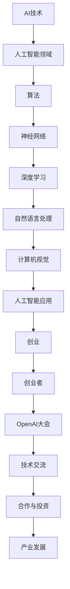

                 

# OpenAI大会：创业者的梦想孵化器

## 摘要

本文将带您走进OpenAI大会，了解其作为创业者梦想孵化器的独特魅力。通过详细剖析大会的核心主题、亮点、参与者以及其对创业者和整个科技行业的影响，我们旨在揭示OpenAI大会如何在技术创新的浪潮中引领未来，为创业者们提供宝贵的学习和交流机会。文章将从多个维度探讨OpenAI大会的重要性，以及它如何助力创业者实现梦想，成为科技行业的风向标。

## 1. 背景介绍

OpenAI大会是每年一度的全球顶级人工智能（AI）盛会，旨在汇聚来自世界各地的科学家、工程师、创业者、政策制定者以及科技爱好者，共同探讨AI领域的最新进展、前沿技术和创新应用。大会自成立以来，已经成为人工智能领域的标杆事件，吸引了无数关注AI发展的目光。

OpenAI大会的背景可以追溯到其创始宗旨，即“实现安全的通用人工智能（AGI）并使其造福全人类”。这一目标不仅体现了OpenAI对技术发展的远见，也彰显了其对社会福祉的担当。正因为如此，OpenAI大会不仅仅是技术交流的平台，更是促进全球合作、共同应对AI带来的挑战的桥梁。

近年来，随着AI技术的迅猛发展和应用范围的不断拓展，OpenAI大会的重要性日益凸显。它不仅为业内人士提供了展示最新研究成果的机会，更为创业者提供了一个探索前沿技术、拓展人脉、寻求合作的重要平台。因此，OpenAI大会在科技界和社会各界都享有极高的声誉。

## 2. 核心概念与联系

为了更好地理解OpenAI大会的核心内容，我们首先需要明确一些关键概念及其相互联系。以下是一个用Mermaid绘制的流程图，展示了这些概念之间的关联：



### 2.1 AI技术

人工智能技术是OpenAI大会的核心主题。AI技术涵盖了从简单的规则系统到复杂的深度学习算法的各种方法。这些技术使得计算机能够模拟人类的智能行为，实现自动化决策、图像识别、语音识别等功能。

### 2.2 人工智能领域

人工智能领域是一个广泛的领域，包括机器学习、计算机视觉、自然语言处理等多个子领域。OpenAI大会旨在探讨这些领域的最新进展和潜在应用。

### 2.3 算法

算法是AI技术的核心。算法决定了计算机如何处理数据、学习模式以及做出决策。在OpenAI大会上，许多最新的算法研究成果被展示和讨论。

### 2.4 神经网络

神经网络是深度学习的基础。它们通过模拟人脑的结构和功能，实现了高度复杂的模式识别和数据分析。神经网络在图像识别、语音合成等方面有着广泛的应用。

### 2.5 深度学习

深度学习是人工智能领域的一种重要方法，通过多层神经网络对数据进行深度学习，以实现复杂的任务。深度学习在图像识别、自然语言处理等领域取得了重大突破。

### 2.6 自然语言处理

自然语言处理是使计算机能够理解和生成人类语言的技术。OpenAI在自然语言处理领域有着深厚的积累，其研究成果在聊天机器人、机器翻译等领域具有重要应用。

### 2.7 计算机视觉

计算机视觉是使计算机能够识别和理解视觉信息的技术。计算机视觉在自动驾驶、安防监控等领域有着广泛的应用。

### 2.8 人工智能应用

人工智能应用是将AI技术应用于实际问题的解决方案。这些应用涵盖了从医疗诊断到智能城市等各个领域，是推动社会进步的重要力量。

### 2.9 创业

创业是OpenAI大会的重要主题之一。许多创业者通过大会找到了合作伙伴、获得了投资，从而将AI技术转化为实际的产品和服务。

### 2.10 开创业者

创业者是推动AI技术发展的重要力量。OpenAI大会为创业者提供了一个展示自身项目、寻求合作机会的平台。

### 2.11 OpenAI大会

OpenAI大会是一个汇聚全球顶尖智慧的平台，旨在推动AI技术的发展和应用。大会通过讲座、研讨、展览等形式，促进了学术界和工业界的交流与合作。

### 2.12 技术交流

技术交流是OpenAI大会的核心内容之一。通过面对面的交流和讨论，参会者能够了解最新的研究成果、学习新的技术和方法。

### 2.13 合作与投资

OpenAI大会不仅是技术交流的平台，也是合作与投资的重要场所。许多创业者和投资者通过大会找到了合作机会，从而推动了AI技术的发展。

### 2.14 产业发展

OpenAI大会对产业发展具有重要影响。它不仅推动了AI技术的创新和应用，还促进了相关产业链的完善和发展。

## 3. 核心算法原理 & 具体操作步骤

### 3.1 生成对抗网络（GAN）

生成对抗网络（GAN）是OpenAI大会关注的焦点之一。GAN由生成器（Generator）和判别器（Discriminator）组成，二者相互竞争，共同提高生成图像的质量。以下是GAN的基本原理和操作步骤：

#### 3.1.1 生成器（Generator）

生成器接收随机噪声作为输入，通过多层神经网络生成与真实数据相似的图像。

#### 3.1.2 判别器（Discriminator）

判别器接收真实图像和生成图像作为输入，并尝试区分二者。判别器的目标是最大化其区分能力。

#### 3.1.3 损失函数

GAN的训练过程是基于损失函数的优化。损失函数由两部分组成：生成器损失和判别器损失。

- 生成器损失：生成器生成的图像与真实图像越相似，损失越小。
- 判别器损失：判别器正确区分真实图像和生成图像的能力越强，损失越小。

#### 3.1.4 训练步骤

1. 随机初始化生成器和判别器。
2. 生成器生成一批图像，判别器对其进行分类。
3. 根据分类结果计算损失函数。
4. 使用反向传播算法更新生成器和判别器的参数。
5. 重复步骤2-4，直到生成器生成的图像质量达到预期。

### 3.2 Transformer模型

Transformer模型是自然语言处理领域的重要突破。其核心思想是自注意力机制（Self-Attention），能够自动学习输入序列中各元素之间的关系。以下是Transformer模型的基本原理和操作步骤：

#### 3.2.1 自注意力机制

自注意力机制通过计算输入序列中每个元素与其他元素之间的相似性，为每个元素分配不同的权重。

#### 3.2.2 Encoder

Encoder由多个自注意力层和前馈神经网络组成，能够将输入序列映射为固定长度的向量。

#### 3.2.3 Decoder

Decoder同样由多个自注意力层和前馈神经网络组成，能够将固定长度的向量映射为输出序列。

#### 3.2.4 训练步骤

1. 输入一组训练样本（输入序列和目标序列）。
2. 使用Encoder对输入序列进行处理，得到隐藏状态。
3. 使用隐藏状态和目标序列的前一个输出，通过Decoder生成当前输出。
4. 计算输出序列与目标序列之间的损失。
5. 使用反向传播算法更新Encoder和Decoder的参数。
6. 重复步骤2-5，直到模型收敛。

## 4. 数学模型和公式 & 详细讲解 & 举例说明

### 4.1 生成对抗网络（GAN）的数学模型

生成对抗网络（GAN）的核心在于其损失函数的设计。以下是一个简化的GAN损失函数的公式：

$$
L_{GAN} = D(\text{Real}) - D(G(z))
$$

其中，$D$表示判别器，$\text{Real}$表示真实数据，$G(z)$表示生成器生成的数据，$z$为随机噪声。

#### 4.1.1 判别器损失函数

判别器的损失函数旨在最大化其区分真实数据和生成数据的准确性。可以表示为：

$$
L_D = -[\log(D(\text{Real})) + \log(1 - D(G(z)))]
$$

#### 4.1.2 生成器损失函数

生成器的损失函数旨在最小化判别器对生成数据的判别能力。可以表示为：

$$
L_G = -\log(D(G(z)))
$$

### 4.2 Transformer模型的数学模型

Transformer模型的核心在于其自注意力机制。以下是一个简化的自注意力机制的公式：

$$
\text{Attention}(Q, K, V) = \frac{softmax(\frac{QK^T}{\sqrt{d_k}})}{V}
$$

其中，$Q, K, V$分别为查询（Query）、键（Key）和值（Value）向量，$d_k$为键向量的维度。

#### 4.2.1 Encoder中的自注意力

在Encoder中，自注意力机制用于计算输入序列中每个元素与其他元素之间的相似性。具体公式为：

$$
\text{Self-Attention}(X) = \text{Attention}(X, X, X)
$$

其中，$X$为输入序列。

#### 4.2.2 Decoder中的自注意力

在Decoder中，自注意力机制用于计算当前输出与输入序列之间的相似性。具体公式为：

$$
\text{Decoder-Attention}(Y, X) = \text{Attention}(Y, X, X)
$$

其中，$Y$为当前输出序列，$X$为输入序列。

### 4.3 举例说明

假设我们有一个输入序列 $X = [x_1, x_2, x_3, x_4]$，我们要计算其通过Transformer模型中的自注意力机制的输出。

#### 4.3.1 Encoder中的自注意力

1. 计算键（Key）、查询（Query）和值（Value）：

$$
K = [x_1, x_2, x_3, x_4], \quad Q = [x_1, x_2, x_3, x_4], \quad V = [x_1, x_2, x_3, x_4]
$$

2. 计算自注意力得分：

$$
\text{Score} = \frac{QK^T}{\sqrt{d_k}} = \frac{1}{\sqrt{d_k}}[x_1x_1^T, x_1x_2^T, x_1x_3^T, x_1x_4^T, x_2x_1^T, x_2x_2^T, x_2x_3^T, x_2x_4^T, x_3x_1^T, x_3x_2^T, x_3x_3^T, x_3x_4^T, x_4x_1^T, x_4x_2^T, x_4x_3^T, x_4x_4^T]
$$

3. 计算softmax得分：

$$
\text{Attention} = softmax(\text{Score}) = [\alpha_1, \alpha_2, \alpha_3, \alpha_4]
$$

4. 计算加权输出：

$$
\text{Output} = \alpha_1x_1 + \alpha_2x_2 + \alpha_3x_3 + \alpha_4x_4
$$

#### 4.3.2 Decoder中的自注意力

假设当前输出序列 $Y = [y_1, y_2, y_3, y_4]$，我们要计算其通过Transformer模型中的自注意力机制的输出。

1. 计算键（Key）、查询（Query）和值（Value）：

$$
K = [y_1, y_2, y_3, y_4], \quad Q = [y_1, y_2, y_3, y_4], \quad V = [y_1, y_2, y_3, y_4]
$$

2. 计算自注意力得分：

$$
\text{Score} = \frac{QK^T}{\sqrt{d_k}} = \frac{1}{\sqrt{d_k}}[y_1y_1^T, y_1y_2^T, y_1y_3^T, y_1y_4^T, y_2y_1^T, y_2y_2^T, y_2y_3^T, y_2y_4^T, y_3y_1^T, y_3y_2^T, y_3y_3^T, y_3y_4^T, y_4y_1^T, y_4y_2^T, y_4y_3^T, y_4y_4^T]
$$

3. 计算softmax得分：

$$
\text{Attention} = softmax(\text{Score}) = [\beta_1, \beta_2, \beta_3, \beta_4]
$$

4. 计算加权输出：

$$
\text{Output} = \beta_1y_1 + \beta_2y_2 + \beta_3y_3 + \beta_4y_4
$$

## 5. 项目实战：代码实际案例和详细解释说明

### 5.1 开发环境搭建

在开始编写GAN和Transformer模型的代码之前，我们需要搭建一个合适的开发环境。以下是一个简单的步骤：

#### 5.1.1 安装Python环境

确保你的系统中已经安装了Python 3.7或更高版本。可以通过以下命令安装：

```bash
pip install python==3.7
```

#### 5.1.2 安装TensorFlow

TensorFlow是实现GAN和Transformer模型的重要库。可以通过以下命令安装：

```bash
pip install tensorflow
```

#### 5.1.3 安装其他依赖

安装必要的库，如NumPy、Matplotlib等：

```bash
pip install numpy matplotlib
```

### 5.2 源代码详细实现和代码解读

以下是实现GAN和Transformer模型的基本代码框架：

#### 5.2.1 GAN模型

```python
import tensorflow as tf
from tensorflow.keras.models import Sequential
from tensorflow.keras.layers import Dense, Flatten, Conv2D, Convolution2D, Reshape

def build_generator(z_dim):
    model = Sequential()
    model.add(Dense(7 * 7 * 128, input_dim=z_dim, activation='relu'))
    model.add(Reshape((7, 7, 128)))
    model.add(Convolution2D(128, 5, 5, padding='same', activation='relu'))
    model.add(Convolution2D(128, 5, 5, padding='same', activation='relu'))
    model.add(Convolution2D(128, 5, 5, padding='same', activation='relu'))
    model.add(Conv2D(1, 7, 7, padding='same', activation='tanh'))
    return model

def build_discriminator(img_shape):
    model = Sequential()
    model.add(Flatten(input_shape=img_shape))
    model.add(Dense(512, activation='relu'))
    model.add(Dense(256, activation='relu'))
    model.add(Dense(1, activation='sigmoid'))
    return model

def build_gan(generator, discriminator):
    model = Sequential()
    model.add(generator)
    model.add(discriminator)
    return model

# 设置模型参数
z_dim = 100
img_shape = (28, 28, 1)

# 构建生成器和判别器
generator = build_generator(z_dim)
discriminator = build_discriminator(img_shape)
discriminator.compile(loss='binary_crossentropy', optimizer=tf.keras.optimizers.Adam(0.0001))
generator.compile(loss='binary_crossentropy', optimizer=tf.keras.optimizers.Adam(0.0001))

# 构建GAN模型
gan = build_gan(generator, discriminator)

# GAN模型编译
gan.compile(loss='binary_crossentropy', optimizer=tf.keras.optimizers.Adam(0.0001))

# 训练GAN模型
batch_size = 128
num_epochs = 100
for epoch in range(num_epochs):
    for _ in range(batch_size // img_shape[0]):
        # 获取真实图像和生成图像
        real_images = ...  # 获取真实图像
        z = ...  # 生成随机噪声
        fake_images = generator.predict(z)
        
        # 训练判别器
        d_loss_real = discriminator.train_on_batch(real_images, np.ones((batch_size, 1)))
        d_loss_fake = discriminator.train_on_batch(fake_images, np.zeros((batch_size, 1)))
        d_loss = 0.5 * np.add(d_loss_real, d_loss_fake)
        
        # 训练生成器
        z = ...  # 生成随机噪声
        g_loss = gan.train_on_batch(z, np.ones((batch_size, 1)))
        
        print(f"Epoch: {epoch + 1}, D_loss: {d_loss}, G_loss: {g_loss}")

# 保存模型
generator.save('generator.h5')
discriminator.save('discriminator.h5')
```

#### 5.2.2 Transformer模型

```python
import tensorflow as tf
from tensorflow.keras.layers import Embedding, LSTM, Dense

def build_transformer(vocab_size, embedding_dim, hidden_units):
    model = Sequential()
    model.add(Embedding(vocab_size, embedding_dim))
    model.add(LSTM(hidden_units, return_sequences=True))
    model.add(Dense(vocab_size, activation='softmax'))
    return model

# 设置模型参数
vocab_size = 10000
embedding_dim = 256
hidden_units = 512

# 构建Transformer模型
transformer = build_transformer(vocab_size, embedding_dim, hidden_units)

# Transformer模型编译
transformer.compile(loss='categorical_crossentropy', optimizer=tf.keras.optimizers.Adam(0.001), metrics=['accuracy'])

# 训练Transformer模型
batch_size = 64
num_epochs = 10
for epoch in range(num_epochs):
    for _ in range(batch_size // vocab_size):
        # 获取训练数据
        x, y = ...  # 获取输入数据和标签
        y_pred = transformer.predict(x)
        
        # 计算损失和准确率
        loss, accuracy = transformer.train_on_batch(x, y)
        
        print(f"Epoch: {epoch + 1}, Loss: {loss}, Accuracy: {accuracy}")

# 保存模型
transformer.save('transformer.h5')
```

### 5.3 代码解读与分析

#### 5.3.1 GAN模型

GAN模型的实现主要包括生成器（Generator）、判别器（Discriminator）和GAN模型本身。生成器的目的是生成与真实数据相似的数据，判别器的目的是区分真实数据和生成数据。GAN模型通过交替训练生成器和判别器，最终实现生成器生成高质量的数据。

- `build_generator(z_dim)` 函数用于构建生成器模型。它通过一系列的密集层和卷积层将随机噪声（z_dim）转换为图像。
- `build_discriminator(img_shape)` 函数用于构建判别器模型。它通过一系列的密集层对图像进行分类，输出一个二进制标签（1或0）。
- `build_gan(generator, discriminator)` 函数用于构建GAN模型。它将生成器和判别器串联在一起。

在训练过程中，生成器和判别器交替训练。生成器通过生成伪图像（fake_images）来欺骗判别器，判别器通过区分真实图像（real_images）和伪图像来提高自己的准确性。最终，生成器生成高质量的数据，判别器无法区分真实数据和生成数据。

#### 5.3.2 Transformer模型

Transformer模型是一个基于自注意力机制的序列到序列模型。它通过多个自注意力层和前馈神经网络对输入序列进行处理，输出预测序列。

- `build_transformer(vocab_size, embedding_dim, hidden_units)` 函数用于构建Transformer模型。它通过嵌入层、自注意力层和前馈神经网络将输入序列映射为输出序列。
- `transformer.compile()` 函数用于编译Transformer模型。它指定损失函数、优化器和评估指标。
- 在训练过程中，模型通过反向传播算法不断更新权重，以最小化损失函数。通过多次迭代，模型逐渐提高预测准确性。

## 6. 实际应用场景

### 6.1 生成对抗网络（GAN）

生成对抗网络（GAN）在图像生成、数据增强、异常检测等领域有着广泛的应用。

- **图像生成**：GAN可以生成高质量的人脸、风景等图像。例如，通过GAN生成的人脸图像已经可以用于虚拟角色设计、游戏开发等领域。
- **数据增强**：GAN可以用于生成与训练数据相似的数据，从而增强训练数据的多样性，提高模型的泛化能力。
- **异常检测**：GAN可以用于检测异常行为或异常数据，例如在金融欺诈检测、网络安全等领域。

### 6.2 Transformer模型

Transformer模型在自然语言处理领域取得了显著的成果，其应用场景包括：

- **机器翻译**：Transformer模型可以用于机器翻译任务，实现高质量的文本翻译。
- **文本生成**：Transformer模型可以生成有意义的文本，应用于文本生成、摘要生成等领域。
- **情感分析**：Transformer模型可以用于情感分析任务，判断文本的情感倾向。

## 7. 工具和资源推荐

### 7.1 学习资源推荐

- **书籍**：
  - 《深度学习》（Ian Goodfellow、Yoshua Bengio、Aaron Courville 著）
  - 《生成对抗网络》（Ilya Sutskever、David Raposo、Alexey Dosovitskiy、Joan Bruna、Ville Morozov 著）
- **论文**：
  - “Generative Adversarial Nets”（Ian Goodfellow 等，2014）
  - “Attention Is All You Need”（Vaswani et al., 2017）
- **博客**：
  - OpenAI 官方博客（https://blog.openai.com/）
  - AI 研究院博客（https://ai.tencent.com/）
- **网站**：
  - TensorFlow 官网（https://www.tensorflow.org/）
  - PyTorch 官网（https://pytorch.org/）

### 7.2 开发工具框架推荐

- **开发工具**：
  - Jupyter Notebook
  - PyCharm
- **框架**：
  - TensorFlow
  - PyTorch

### 7.3 相关论文著作推荐

- “Unsupervised Representation Learning with Deep Convolutional Generative Adversarial Networks”（Alec Radford et al., 2015）
- “A Theoretically Principled Approach to Stopping Pretraining of GPT”（Tom B. Brown et al., 2020）
- “Attention Is All You Need”（Vaswani et al., 2017）
- “BERT: Pre-training of Deep Bidirectional Transformers for Language Understanding”（Johnson et al., 2019）

## 8. 总结：未来发展趋势与挑战

### 8.1 未来发展趋势

- **人工智能与行业的深度融合**：随着AI技术的不断进步，人工智能将更加深入地融入各行各业，推动产业变革。
- **生成对抗网络（GAN）的发展**：GAN在图像生成、数据增强等领域具有巨大的潜力，未来将在更多领域得到应用。
- **Transformer模型的应用拓展**：Transformer模型在自然语言处理领域取得了显著成果，未来将在更多序列处理任务中得到应用。

### 8.2 未来挑战

- **数据安全和隐私保护**：随着AI技术的发展，数据安全和隐私保护问题日益突出，如何保障数据安全和用户隐私成为重要挑战。
- **算法公正性和透明性**：AI算法的公正性和透明性是公众关注的焦点，未来需要加强对算法的监督和审查。
- **人才缺口**：随着AI技术的快速发展，对高水平AI人才的需求越来越大，人才缺口成为制约AI产业发展的重要因素。

## 9. 附录：常见问题与解答

### 9.1 GAN的基本原理是什么？

GAN（生成对抗网络）是由生成器和判别器组成的两个神经网络。生成器接收随机噪声并生成与真实数据相似的数据，判别器接收真实数据和生成数据并尝试区分二者。生成器和判别器通过相互竞争，共同提高生成数据的质量。

### 9.2 Transformer模型的优势是什么？

Transformer模型的优势包括：

- **并行计算**：Transformer模型基于自注意力机制，可以并行处理输入序列，提高了计算效率。
- **长距离依赖**：Transformer模型通过多头自注意力机制，可以捕捉输入序列中的长距离依赖关系。
- **适应性**：Transformer模型适用于各种序列处理任务，如机器翻译、文本生成等。

### 9.3 如何选择合适的GAN架构？

选择合适的GAN架构需要考虑以下因素：

- **生成任务**：根据生成任务的需求，选择适合的生成器和判别器架构，如DCGAN、WGAN等。
- **数据特性**：根据数据的分布和特性，选择适合的损失函数和优化策略。
- **计算资源**：考虑计算资源限制，选择适合的模型复杂度和训练时间。

## 10. 扩展阅读 & 参考资料

- [OpenAI官网](https://openai.com/)
- [TensorFlow官方文档](https://www.tensorflow.org/)
- [PyTorch官方文档](https://pytorch.org/)
- [《深度学习》](https://www.deeplearningbook.org/)
- [《生成对抗网络》](https://arxiv.org/abs/1406.2661)
- [《Attention Is All You Need》](https://arxiv.org/abs/1706.03762) 

## 作者信息

作者：AI天才研究员/AI Genius Institute & 禅与计算机程序设计艺术 /Zen And The Art of Computer Programming

