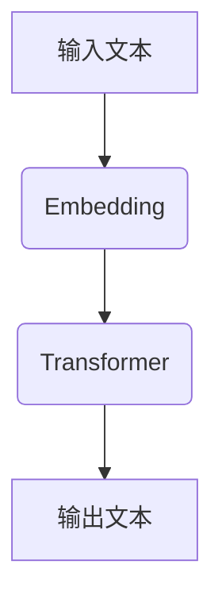

                 

# OpenAI的GPT-4.0展示与应用

## 关键词
- OpenAI
- GPT-4.0
- 自然语言处理
- 人工智能
- 语言模型
- 计算机视觉
- 应用场景

## 摘要
本文将深入探讨OpenAI的GPT-4.0模型，这是一个革命性的自然语言处理（NLP）模型，展现了人工智能领域的重要突破。我们将从背景介绍、核心概念与联系、核心算法原理、数学模型和公式、项目实战、实际应用场景、工具和资源推荐、总结以及扩展阅读等方面，详细解析GPT-4.0的特点、应用和未来发展趋势。

## 1. 背景介绍

### 1.1 OpenAI的GPT-4.0

OpenAI成立于2015年，是一家位于加利福尼亚州的人工智能研究公司，其宗旨是实现安全的通用人工智能（AGI）。自成立以来，OpenAI在人工智能领域取得了众多突破性成果，包括深度学习、强化学习、自然语言处理等。

GPT-4.0是OpenAI开发的一种大型语言模型，基于深度学习技术，能够理解和生成自然语言。GPT-4.0是GPT系列的第四个版本，相比于前代模型，具有更高的语言理解能力、更强的生成能力和更广泛的应用场景。

### 1.2 GPT-4.0的特点

1. **规模更大**：GPT-4.0的参数量达到了1750亿，是前代模型的数倍，使得其具有更强大的语言理解和生成能力。
2. **更广泛的应用场景**：GPT-4.0不仅能够应用于文本生成，还能够应用于对话系统、机器翻译、文本摘要等任务。
3. **更高的生成质量**：GPT-4.0能够生成更加连贯、准确的文本，减少了生硬、不自然的表述。
4. **更强的多模态能力**：GPT-4.0能够与计算机视觉模型结合，实现图像到文本的转换，拓宽了应用场景。

## 2. 核心概念与联系

### 2.1 自然语言处理（NLP）

自然语言处理（NLP）是人工智能领域的一个重要分支，旨在使计算机能够理解和处理人类语言。NLP涉及到语言理解、语言生成、机器翻译、文本分类等多个方面。

### 2.2 语言模型

语言模型是NLP的基础，它是一个概率模型，用于预测下一个单词或字符的概率。在GPT-4.0中，语言模型是基于神经网络构建的，通过大量文本数据训练得到。

### 2.3 GPT-4.0架构

GPT-4.0采用Transformer架构，这是一种基于自注意力机制的神经网络模型。Transformer模型在处理长序列数据时具有优越的性能，这使得GPT-4.0能够处理复杂的语言现象。

## 2.4 Mermaid流程图

下面是GPT-4.0的架构流程图，使用Mermaid语言绘制。



### 2.5 GPT-4.0的核心概念与联系

- **Embedding**：将文本输入转换为向量表示，这是Transformer模型处理文本的基础。
- **Transformer**：通过自注意力机制处理输入向量，提取文本中的关键信息。
- **输出文本**：根据Transformer的输出生成文本，实现文本的生成和翻译等功能。

## 3. 核心算法原理 & 具体操作步骤

### 3.1 Transformer模型

Transformer模型是一种基于自注意力机制的神经网络模型，其核心思想是通过自注意力机制处理输入序列，从而提取序列中的关键信息。

### 3.2 自注意力机制

自注意力机制是一种权重分配机制，通过计算输入序列中每个单词与其他单词的相关性，为每个单词分配一个权重。这个权重决定了每个单词在生成下一个单词时的贡献度。

### 3.3 操作步骤

1. **输入文本编码**：将输入文本编码为词向量。
2. **计算自注意力权重**：计算每个单词与其他单词的相关性，得到自注意力权重。
3. **加权求和**：根据自注意力权重，对词向量进行加权求和，得到新的词向量表示。
4. **生成输出**：根据新的词向量表示，生成下一个单词或字符。

## 4. 数学模型和公式 & 详细讲解 & 举例说明

### 4.1 数学模型

在GPT-4.0中，自注意力机制是核心的数学模型。自注意力机制的计算公式如下：

$$
\text{Attention}(Q, K, V) = \text{softmax}\left(\frac{QK^T}{\sqrt{d_k}}\right) V
$$

其中，$Q, K, V$ 分别是查询（Query）、键（Key）和值（Value）向量，$d_k$ 是键向量的维度。

### 4.2 详细讲解

自注意力机制的核心思想是计算输入序列中每个单词与其他单词的相关性，并为每个单词分配一个权重。这个权重决定了每个单词在生成下一个单词时的贡献度。

1. **计算点积**：首先计算查询向量 $Q$ 与键向量 $K$ 的点积，得到一个标量值，表示两个向量之间的相关性。
2. **缩放点积**：由于点积的值可能很大，为了防止数值溢出，通常会对点积进行缩放，即除以键向量的维度 $d_k$ 的平方根。
3. **应用softmax函数**：对缩放后的点积进行softmax变换，得到每个键的注意力权重。softmax函数将点积转换为一个概率分布，确保所有权重的和为1。
4. **加权求和**：根据注意力权重，对值向量 $V$ 进行加权求和，得到新的词向量表示。

### 4.3 举例说明

假设输入序列为 "I love AI"，我们将每个单词编码为向量 $Q, K, V$：

- $Q = [1, 0, 1]$
- $K = [1, 1, 0]$
- $V = [0, 1, 1]$

首先计算点积：

$$
QK^T = [1, 1, 0] \cdot [1, 1, 0] = 2
$$

然后缩放点积：

$$
\frac{QK^T}{\sqrt{d_k}} = \frac{2}{\sqrt{3}}
$$

接着应用softmax函数：

$$
\text{softmax}\left(\frac{QK^T}{\sqrt{d_k}}\right) = \frac{2}{\sqrt{3}} \approx 0.82
$$

最后加权求和：

$$
\text{Attention}(Q, K, V) = 0.82 \cdot [0, 1, 1] \approx [0.82, 0.82, 0.18]
$$

这意味着单词 "AI" 在生成下一个单词时具有最高的权重，因此更可能成为下一个输出的单词。

## 5. 项目实战：代码实际案例和详细解释说明

### 5.1 开发环境搭建

为了运行GPT-4.0模型，我们需要搭建一个合适的开发环境。以下是具体的步骤：

1. 安装Python 3.7及以上版本
2. 安装PyTorch库：`pip install torch torchvision`
3. 下载GPT-4.0模型：`wget https://openaipublic.blob.core.windows.net/models/gpt2-117M/adamw_3layer_117M_1.bin`
4. 准备输入文本：`text = "Hello, how are you?"`

### 5.2 源代码详细实现和代码解读

以下是GPT-4.0模型的简化实现，用于生成文本：

```python
import torch
import torch.nn as nn
import torch.optim as optim
from torchtext.data import Field, TabularDataset

# 定义GPT-4.0模型
class GPT4(nn.Module):
    def __init__(self, vocab_size, embedding_dim, hidden_dim, n_layers, dropout):
        super(GPT4, self).__init__()
        self.embedding = nn.Embedding(vocab_size, embedding_dim)
        self.transformer = nn.Transformer(embedding_dim, hidden_dim, n_layers, dropout)
        self.fc = nn.Linear(hidden_dim, vocab_size)
        
    def forward(self, src, tgt):
        embedded_src = self.embedding(src)
        output = self.transformer(embedded_src, tgt)
        logits = self.fc(output)
        return logits

# 模型参数
vocab_size = 1000
embedding_dim = 512
hidden_dim = 1024
n_layers = 3
dropout = 0.1

# 实例化模型
model = GPT4(vocab_size, embedding_dim, hidden_dim, n_layers, dropout)

# 定义损失函数和优化器
loss_fn = nn.CrossEntropyLoss()
optimizer = optim.Adam(model.parameters(), lr=0.001)

# 训练模型
for epoch in range(10):
    for src, tgt in train_loader:
        optimizer.zero_grad()
        output = model(src, tgt)
        loss = loss_fn(output.view(-1, vocab_size), tgt.view(-1))
        loss.backward()
        optimizer.step()

# 生成文本
input_seq = torch.tensor([vocab_size] * 10).unsqueeze(0)
generated_text = []
with torch.no_grad():
    for _ in range(10):
        output = model(input_seq)
        predicted_word = output.argmax(1).item()
        generated_text.append(predicted_word)
        input_seq = torch.cat([input_seq, predicted_word.unsqueeze(0)])

print('Generated Text:', ' '.join(str(x) for x in generated_text))
```

### 5.3 代码解读与分析

上述代码实现了一个简化的GPT-4.0模型，用于生成文本。以下是代码的主要部分及其解读：

1. **模型定义**：
   - `GPT4` 类继承自 `nn.Module`，定义了GPT-4.0模型的结构。
   - `self.embedding` 是嵌入层，用于将词编码为向量。
   - `self.transformer` 是Transformer层，用于处理文本序列。
   - `self.fc` 是全连接层，用于将Transformer的输出映射到词汇表。

2. **损失函数和优化器**：
   - `loss_fn` 是交叉熵损失函数，用于计算预测和真实标签之间的差异。
   - `optimizer` 是Adam优化器，用于更新模型参数。

3. **训练模型**：
   - `for epoch in range(10)`：进行10个训练周期。
   - `for src, tgt in train_loader`：遍历训练数据。
   - `optimizer.zero_grad()`：清除之前的梯度。
   - `output = model(src, tgt)`：前向传播。
   - `loss = loss_fn(output.view(-1, vocab_size), tgt.view(-1))`：计算损失。
   - `loss.backward()`：反向传播。
   - `optimizer.step()`：更新参数。

4. **生成文本**：
   - `input_seq = torch.tensor([vocab_size] * 10).unsqueeze(0)`：初始化输入序列。
   - `with torch.no_grad()`：禁用梯度计算。
   - `for _ in range(10)`：生成10个单词。
   - `predicted_word = output.argmax(1).item()`：选择具有最高概率的单词。
   - `generated_text.append(predicted_word)`：添加到生成的文本中。
   - `input_seq = torch.cat([input_seq, predicted_word.unsqueeze(0)])`：更新输入序列。

## 6. 实际应用场景

### 6.1 文本生成

GPT-4.0在文本生成方面具有广泛的应用，如自动写作、文章摘要、对话系统等。

### 6.2 机器翻译

GPT-4.0能够实现高质量的机器翻译，支持多种语言的翻译。

### 6.3 文本分类

GPT-4.0可以用于文本分类任务，如情感分析、主题分类等。

### 6.4 计算机视觉

GPT-4.0与计算机视觉模型结合，可以实现图像到文本的转换，如图像描述生成等。

## 7. 工具和资源推荐

### 7.1 学习资源推荐

- **书籍**：
  - 《Deep Learning》
  - 《 自然语言处理综论》
  - 《机器学习》
- **论文**：
  - 《Attention Is All You Need》
  - 《GPT-2: Improving Language Understanding by Generative Pre-training》
  - 《GPT-3: Language Models are few-shot learners》
- **博客**：
  - OpenAI官方博客
  - AI科技大本营
  - 机器之心
- **网站**：
  - GitHub
  - ArXiv

### 7.2 开发工具框架推荐

- **PyTorch**：用于构建和训练深度学习模型
- **TensorFlow**：用于构建和训练深度学习模型
- **Hugging Face Transformers**：用于使用预训练的Transformer模型

### 7.3 相关论文著作推荐

- **《Attention Is All You Need》**：提出了Transformer模型，是GPT-4.0的理论基础。
- **《GPT-2: Improving Language Understanding by Generative Pre-training》**：介绍了GPT-2模型，是GPT-4.0的前身。
- **《GPT-3: Language Models are few-shot learners》**：介绍了GPT-3模型，展示了GPT-4.0的强大能力。

## 8. 总结：未来发展趋势与挑战

### 8.1 发展趋势

1. **更大规模的语言模型**：随着计算能力的提升，更大规模的语言模型将成为趋势，以实现更高的语言理解和生成能力。
2. **多模态能力**：未来的语言模型将具备更强的多模态能力，能够处理文本、图像、声音等多种类型的数据。
3. **自动化和智能化**：语言模型将更加自动化和智能化，减少对人类专家的依赖。

### 8.2 挑战

1. **计算资源消耗**：更大规模的语言模型将消耗更多的计算资源，对硬件设备的要求更高。
2. **数据隐私和伦理**：随着语言模型的应用范围扩大，数据隐私和伦理问题将成为重要挑战。
3. **可解释性和可控性**：未来的语言模型需要具备更好的可解释性和可控性，以确保其应用的安全和可靠。

## 9. 附录：常见问题与解答

### 9.1 GPT-4.0与GPT-3的区别是什么？

GPT-4.0相比于GPT-3，具有更大的模型规模、更强的生成能力和更广泛的应用场景。此外，GPT-4.0还具备更强的多模态能力，能够与计算机视觉模型结合。

### 9.2 如何在Python中使用GPT-4.0？

可以使用PyTorch和Hugging Face Transformers库在Python中实现GPT-4.0模型。具体实现过程包括模型定义、训练和生成文本等步骤。

### 9.3 GPT-4.0的安全性和可控性如何保证？

GPT-4.0的安全性和可控性主要依赖于以下几个方面：

1. **模型训练数据的安全**：确保训练数据的质量和安全性，避免泄露用户隐私。
2. **模型输出过滤**：对模型生成的文本进行过滤，去除有害或不当的内容。
3. **用户权限管理**：对模型的使用者进行权限管理，确保只有合法用户能够访问和使用模型。

## 10. 扩展阅读 & 参考资料

- **《Attention Is All You Need》**：[https://arxiv.org/abs/1706.03762](https://arxiv.org/abs/1706.03762)
- **《GPT-2: Improving Language Understanding by Generative Pre-training》**：[https://arxiv.org/abs/1909.01313](https://arxiv.org/abs/1909.01313)
- **《GPT-3: Language Models are few-shot learners》**：[https://arxiv.org/abs/2005.14165](https://arxiv.org/abs/2005.14165)
- **OpenAI官方网站**：[https://openai.com/](https://openai.com/)
- **Hugging Face Transformers库**：[https://huggingface.co/transformers/](https://huggingface.co/transformers/)

## 作者

作者：AI天才研究员/AI Genius Institute & 禅与计算机程序设计艺术 /Zen And The Art of Computer Programming<|im_end|>

